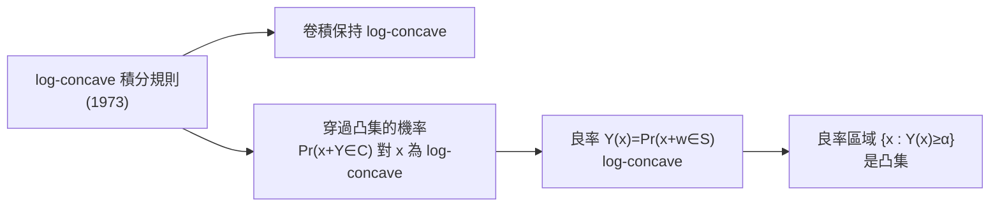
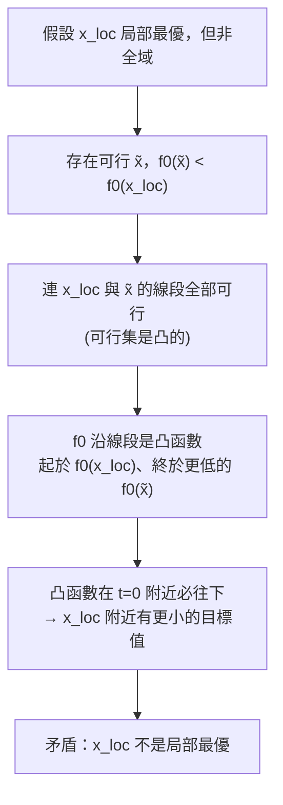
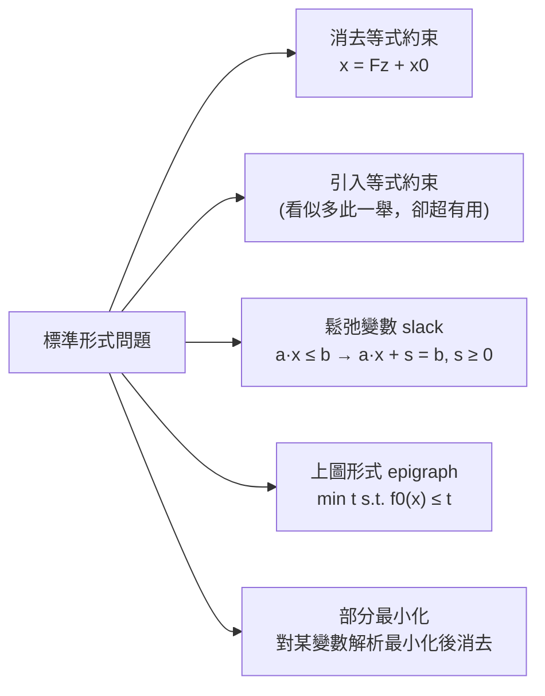
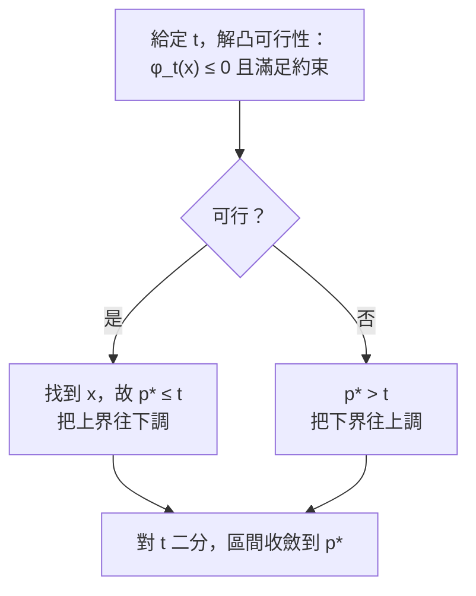

# 對數凹性與凸優化問題

對應逐字稿：`data/EE364A/transcripts/Stanford EE364A Convex Optimization I Stephen Boyd I 2023 I Lecture 5 [AAjG1TQcL7c].en.txt`

本章已完整閱讀逐字稿，閱讀筆記見 [Lecture 5 閱讀筆記](notes/lecture-05-log-concavity-and-convex-problems.md)。

> Boyd 一開場就把這一講定位成整門課的**轉折點**：他半開玩笑地說前面兩週幾乎是純數學，這裡是「情緒的最低點（emotional low point）」，撐過來就是好消息——因為從今天下半段起，課程開始「往上爬」，逐步逼近可以真正寫成程式、可以拿去執行（actionable）的東西。他也提醒：這是動手 `pip install cvxpy` 的好時機，你會看到前兩週講的組合規則等，全部在 Python 裡被「codified」。本章順著這個節奏，前半收尾凸性的兩個推廣（對數凹、K-凸），後半正式進入**凸優化問題**本身。

## 兩個凸性推廣之一：對數凹與對數凸函數

凸性有一整個「延伸產業」——擬凸（quasiconvex）、偽凸（pseudoconvex）、對數凸（log-convex）等等，各有專書。這門課只挑真正用得上的少數幾個。上一講談了擬凸，這一講先補上**對數凹／對數凸**，它在統計裡尤其常見。

定義極簡：一個**正值**函數 $f$，若 $\log f$ 為凹，就稱它 **log-concave（對數凹）**；若 $\log f$ 為凸，就稱 **log-convex（對數凸）**。

$$
f>0,\quad f\ \text{log-concave} \iff \log f\ \text{concave}.
$$

這裡有個 Boyd 也說不出原因的**不對稱**：實務上到處出現的是 log-concave（Google 一下會有海量論文），log-convex 幾乎查不到。

把定義凸性的 Jensen 不等式套到 $\log f$ 上再取指數，會得到一個漂亮的幾何意義：

$$
f\big(\theta x+(1-\theta)y\big)\ \ge\ f(x)^{\theta}\,f(y)^{1-\theta},
\qquad 0\le\theta\le1.
$$

右邊是 $f(x)$ 與 $f(y)$ 的**加權幾何平均**（對比之下，凹函數給的是加權算術平均 $\theta f(x)+(1-\theta)f(y)$）。當 $\theta=\tfrac12$ 時，右邊就是兩個值的幾何平均。

### 例子與辨識

- **冪函數** $x^a$：$a<0$ 時 log-convex，$a\ge0$ 時 log-concave。
- **常態密度**（$\mathbb R^n$ 上的標準例）是 log-concave。驗證：取 log 後 $= \text{常數} - \tfrac12 (x-\mu)^\top\Sigma^{-1}(x-\mu)$，常數與曲率無關，後項因 $\Sigma\succ0$ 是負二次式、故為凹。密度為 log-concave 的測度稱為 **log-concave measure**，在統計、經濟學裡極重要。Boyd 附帶一句（進階、可略）：要對資料擬合一個分布時，要求它 log-concave 是很合理的 regularizer。
- 大量常見機率密度都是 log-concave（Boyd 估計具名密度裡至少一半）。
- **高斯 CDF** $\Phi$ 是 log-concave——這一點完全不顯然，是有提示的作業題。更一般地：**任何 log-concave 密度的累積分布函數（CDF）也是 log-concave**。

二階條件把 $\nabla^2\log f\preceq0$ 攤開，可寫成

$$
f(x)\,\nabla^2 f(x)\ \preceq\ \nabla f(x)\,\nabla f(x)^\top .
$$

右邊是 rank-one 矩陣。含義很有趣：一個矩陣 $\preceq$ 某個 rank-one 矩陣，代表它**至多只有一個正特徵值**，其餘都非正。

### 哪些運算保持 log-concave

| 運算 | 是否保持 log-concave | 說明 |
|---|---|---|
| 乘積 $f\cdot g$ | 保持 | 取 log 變凹函數之和，而兩凹函數之和仍凹 |
| 相加 $f+g$ | **不一定** | 見下方雙高斯反例 |
| 卷積 $f*g$ | 保持 | 由積分規則推得（見下節） |
| 對一維積分掉 | 保持 | 積分規則（1973） |

**和不封閉的反例**：把兩個分得夠開的高斯密度相加，得到「上去、下來、再上去、再下來」的雙峰曲線。它中間彎下去，連 quasiconcave 都不是，故不可能 log-concave。

## 積分規則與良率：離真實應用只差一步

log-concave 有一個**不平凡、相對晚近**的結果。Boyd 說：據他所知，這要到 **1973 年**才被知道（不像多數其他規則早在 1920–30 年代就會），而且證明不簡單。

> **積分規則**：若 $f(x,y)$ 對 $(x,y)$ **聯合** log-concave，把其中一個變數積分掉，
> $$g(x)=\int f(x,y)\,dy$$
> 得到的 $g$ 仍然 log-concave。

（這被稱為 **Prékopa–Leindler 不等式**）

由它可立刻推出兩個重要事實：

1. **卷積保持 log-concave**：$f,g$ 皆 log-concave，則 $f*g$ 亦然。機率語言：兩個各自具 log-concave 密度的**獨立**隨機變數相加，其和的密度仍 log-concave。
2. **穿過凸集的機率是 log-concave**：設 $C\subseteq\mathbb R^n$ 為凸集、$Y$ 有 log-concave 密度，則
   $$
   x\ \longmapsto\ \Pr\big(x+Y\in C\big)
   $$
   是 $x$ 的 log-concave 函數。證明只要寫成積分：
   $$
   \Pr(x+Y\in C)=\int p(y)\,g(x+y)\,dy,
   $$
   其中 $g$ 是 $C$ 的 0/1 指示函數——它 log-concave（log 在 $C$ 內為 $0$、在 $C$ 外為 $-\infty$），而 $g(x+y)$ 是 log-concave 前置合成一個仿射映射，仍 log-concave；被積式聯合 log-concave，對 $y$ 積掉即得結論。

### 良率（yield）：一個近乎真實的工程問題

把上面第 2 點具體化，就是製造業的**良率**：

- $x$：產品的標稱／目標參數（你打算製造的設定，是個向量）。
- $S$：可接受值的集合（各參數落在對的範圍，產品才能運作）。
- $w$：製造時的隨機擾動（例如假設為高斯）。
- 良率 $Y(x)=\Pr\big(x+w\in S\big)$，是「你把目標設在哪裡」的函數。

由上面的結果，$Y$ 是 **log-concave**。於是對任一最低良率門檻 $\alpha$，**良率區域**

$$
\{\,x : Y(x)\ge\alpha\,\}
$$

是**凸集**（因為 $\log Y$ 為凹，這是凹函數的一個超水平集；可能為空，那就代表這產品經濟上做不出來）。

Boyd 用 2D 高斯的心算示範直覺：

| 目標位置（相對於集合 $S$） | 約略良率 |
|---|---|
| 落在 $S$ 外 | 約 10% |
| 壓在一條邊界上 | 略低於 50%（半空間恰 50%，因為另一側也會出界） |
| 放在集合中心 | 90%~95% |

結論顯而易見：**要最大化良率，就瞄準集合的「中心」**。這在一維沒有爭議（區間中心＝中點），但一進到二維以上，「集合的中心」就有很多種定義——這是課程後面會回來處理的主題。



## 兩個凸性推廣之二：對廣義不等式的凸性（K-凸）

第二個推廣把 Jensen 從純量搬到**向量值**函數。設 $f:\mathbb R^n\to\mathbb R^m$，$K$ 是一個 proper cone（真錐）。稱 $f$ 為 **K-convex**，若

$$
f\big(\theta x+(1-\theta)y\big)\ \preceq_K\ \theta f(x)+(1-\theta)f(y),
\qquad 0\le\theta\le1,
$$

其中 $\preceq_K$ 是該錐誘導的廣義不等式。

**最有名的例子（矩陣凸）**：對稱矩陣上的平方映射 $F(X)=X^2$，取 $K$ 為半正定錐。這聽起來「就該是凸的」（純量情形 $x^2$ 確實凸），而且真的成立。要證的是：對稱矩陣 $X,Y$ 與混合 $\theta X+(1-\theta)Y$，有

$$
\big(\theta X+(1-\theta)Y\big)^2\ \preceq\ \theta X^2+(1-\theta)Y^2 .
$$

用「對所有 $z$ 有 $z^\top(\cdot)z\ge0$」展開，會化約成一堆純量凸函數，於是成立。

> **提醒：直覺會騙人。** Boyd 特別警告，做這類推廣時要「保持警覺」，不是每個你覺得該成立的都成立。他舉「對稱矩陣的指數 $e^X$」為例——聽起來該矩陣凸，但他認為**不是**。（Boyd 自己也說 "I could be wrong"，本書據此標記 存疑，不下定論。）

到這裡，Boyd 說「課程需要的分析（analysis）部分就全部講完了」，並給了一個實用建議：每隔一陣子花半小時回頭重讀第 1、2、3 章的某一段——兩週前完全看不懂的東西會開始通，而且會連上其他概念。

## 進入「問題」：優化問題的正式定義

分析告一段落，接下來談的是 **problems**。底層論點只有一句：**凸優化問題是可解的（tractable）**。說一個問題是凸的，重點不在能做什麼數學宣稱（最優性條件之類），而在於你**真的能把它解出來**——這才讓前兩週的東西變得 actionable。

把優化問題當成 CS 意義的**物件**來看：它有若干屬性——一個 objective、一串 inequality constraints、一串 equality constraints。標準形式（standard form）：

$$
\begin{aligned}
\text{minimize}\quad & f_0(x)\\
\text{subject to}\quad & f_i(x)\le 0,\quad i=1,\dots,m\\
& h_i(x)=0,\quad i=1,\dots,p
\end{aligned}
$$

> `minimize` 不是 `min`。`min` 是數學運算子，只有一個意思：有限個數取最小。`minimize` 則是**問題的建構子**。Boyd 說他黑板偷懶時會寫 `Min.`（加個句點）代表 minimize，若沒加句點就該糾正他。標準形式選擇「最小化」；經濟學裡習慣最大化效用或利潤，只要 minimize $-f_0$ 即可。不等式一律寫成 $\le0$：想要 $f_1(x)\ge0$，就寫 $-f_1(x)\le0$。

**最優值** 定義為可行點上目標的下確界：

$$
p^\star=\inf\{\,f_0(x)\ :\ f_i(x)\le0,\ h_i(x)=0\,\}.
$$

（此處是 star ⋆ 最優，不是 asterisk；asterisk 保留給幾週後的共軛與對偶。）

兩種病態值得記住：

- **infeasible**：可行集為空，依慣例 $\inf\varnothing=+\infty$，即 $p^\star=+\infty$。
- **unbounded below**：有一列可行點讓目標無限往下，$p^\star=-\infty$。Boyd 說在風險趨避控制裡這有個好名字叫 **euphoric breakdown（欣快崩潰）**——因為每找到一個更負的成本就更爽，爽到系統崩潰。

兩者都是病態；實務上遇到，通常代表你把問題**建錯了**。

**可行 / 最優 / 局部最優**：$x$ 可行 = 在目標定義域內且滿足所有約束；$x$ 最優 = 可行且 $f_0(x)=p^\star$。最優點集合 $X_{\text{opt}}$ 是**凸集**（$p^\star$ 水平下集合與可行集之交）。**局部最優**：在某個受限鄰域內是最優。

下面幾個小例子把這套詞彙釘牢：

| 問題 | 定義域 | $p^\star$ | 最優點 | 重點 |
|---|---|---|---|---|
| $\min\ x^3-3x$ | $\mathbb R$ | $-\infty$ | 無 | 加 $|x-1|\le0.5$ 後 $x=1$ 是**局部**最優 |
| $\min\ 1/x$ | $\mathbb R_{++}$ | $0$ | 無（下確界達不到） | 不准說 $x=\infty$ |
| $\min\ -\log x$ | $\mathbb R_{++}$ | $-\infty$ | 無 | unbounded below |
| $\min\ x\log x$（負熵） | $\mathbb R_{+}$ | $-1/e$ | $x=1/e$ | 無病態；$0\log0:=0$（續延） |
| $\min\ 1/x\ \text{s.t.}\ x\le3$ | $\mathbb R_{++}$ | $1/3$ | $x=3$（唯一） | well-posed，$X_{\text{opt}}$ 是單點 |

## 隱含約束、無約束、可行性問題

一個關鍵區分：**隱含（implicit）約束 vs 顯式（explicit）約束**。

問題的**定義域**是所有 $f_0,f_i,h_i$ 定義域的交集。提出定義域外的 $x$，比 infeasible 還糟：infeasible 至少能評估、只是違反某條約束；定義域外則根本**無法評估**目標或約束。Boyd 的比喻：這種提案該收到一則「非常不客氣」的錯誤訊息，再犯兩次就該被踢出去。

- **隱含約束**：只因你寫下某個函數就自帶。本課的「社會契約」：$\log$ 的定義域是 $\mathbb R_{++}$、$1/x$ 亦然。寫下 $\log Z$ 就隱含 $Z>0$。
- **顯式約束**：你實際寫出來的 $f_i\le0$、$h_i=0$。
- **無約束問題**：沒有顯式約束（但可以有隱含約束）。例如 $\min\ -\sum_i\log(b_i-a_i^\top x)$ 看似無約束，其實隱含 $a_i^\top x<b_i$。

**可行性問題**：口語版「find $x$ 使其滿足一堆約束」。它是標準形式的特例——目標取常數 $0$：

$$
\begin{aligned}
\text{minimize}\quad & 0\\
\text{subject to}\quad & f_i(x)\le0,\ \ h_i(x)=0.
\end{aligned}
$$

若可行則 $p^\star=0$（且該可行點即最優）；不可行則 $p^\star=+\infty$。約束在這裡是 **hard constraints（硬約束）**：完全不可談判，滿足與否是唯一的事，勉強滿足或大幅滿足都一視同仁。Boyd 提到這類問題在真實應用中會出現，例如經濟學的**無套利（no arbitrage）**：$x$ 是你能建的投資組合，約束是「無論發生什麼都不虧、且至少有一種情況會賺」；若這可行，就代表市場存在套利。

## 凸優化問題

終於到主角。凸優化問題就是**標準形式加上曲率限制**：

$$
\begin{aligned}
\text{minimize}\quad & f_0(x) & &\text{（}f_0\ \text{凸，非負曲率）}\\
\text{subject to}\quad & f_i(x)\le0 & &\text{（}f_i\ \text{凸，非負曲率）}\\
& a_i^\top x=b_i & &\text{（仿射，零曲率）}
\end{aligned}
$$

也就是：目標與不等式約束都是凸函數（非負曲率），等式約束必須**仿射**（$Ax=b$，零曲率）。有人問「為什麼等式一定要仿射？」Boyd 的誠實答案是：**因為這就是定義**（他說換個不那麼欠揍的講法，但意思一樣）。

一個重要觀念：**凸性依賴於問題的表述**，不只看可行集。同一個可行集，用不同函數描述，「是不是凸問題」可能不同。舉例：

$$
\begin{aligned}
\text{minimize}\quad & x_1^2+x_2^2\\
\text{subject to}\quad & \frac{x_1}{1+x_2^2}\le0\\
& (x_1+x_2)^2=0
\end{aligned}
$$

目標是漂亮的碗（凸），但 $f_1(x)=x_1/(1+x_2^2)$ **不凸**、$h(x)=(x_1+x_2)^2$ **不仿射**，所以**這不是凸問題**。Boyd 逐屬性走查 `is_convex`：

```text
prob.objective.is_convex()          -> true
for ineq in prob.inequalities:
    ineq.is_convex()                -> false   # game over
for eq in prob.equalities:
    eq.is_affine()                  -> false
```

但這個問題其實可以**等價改寫**成凸的（$x_1/(1+x_2^2)\le0$ 就是 $x_1\le0$；$(x_1+x_2)^2=0$ 就是 $x_1+x_2=0$）：

$$
\begin{aligned}
\text{minimize}\quad & x_1^2+x_2^2\\
\text{subject to}\quad & x_1\le0,\quad x_1+x_2=0
\end{aligned}
$$

這兩個問題**等價（equivalent）但不相等（equal）**。相等要逐條約束函數都一樣（`==` 會回 false）；等價則是 CS 意義的 **reduction**：解出一個，就有簡單方法得到另一個的解（本課用非正式版）。所以會出現一件「令人困惑但事實如此」的事：**一個非凸問題可以等價於一個凸問題**。注意：等價**不等於**兩者 $p^\star$ 相同——它指的是解與解之間有簡單的互換方式。

## 為什麼凸問題「局部即全域」

凸優化最震撼的性質：**凸問題的任何局部最優點都是全域最優**。Boyd 用兩則軼事凸顯這宣稱有多強——一位資深電路設計師聽到「這是全域最優的電路設計」時反問「你怎麼敢這樣說？這電路有 45 個長寬，怎知沒人能想出更好的組合？」；又如「我算出把衛星送回軌道的最小燃料軌跡」，任何理性的人都會覺得推力序列有無窮多種、憑什麼說這個最省。答案是：**純粹因為這問題的數學結構**。

圖證很簡潔：



## 可微時的最優性條件

若 $f_0$ 可微，凸問題有一個極簡的最優性判準：$x$ 最優 $\iff$ $x$ 可行且

$$
\nabla f_0(x)^\top (y-x)\ \ge\ 0\quad\text{對所有可行 } y.
$$

幾何上：$-\nabla f_0$ 指向下坡方向並與最低水平曲線的切線正交；換句話說，梯度定義了可行集的一個 **supporting hyperplane**。兩個常見特例：

- **無約束**：可行集是整個 $\mathbb R^n$，要對所有 $y$ 成立，唯一可能是 $\nabla f_0(x)=0$（否則取 $y=x-t\,\nabla f_0(x)$ 且 $t$ 很大就破壞不等式）。這**回到微積分二**的「梯度歸零」，但差別在：微積分二裡梯度歸零只是駐點（可能極大、極小、鞍點），而這裡因為 $f_0$ 凸，它**直接就是全域最優**，沒有任何「可能是……」的免責條款。
- **等式約束** $Ax=b$：把上述不等式套到仿射集上，會得到 $\nabla f_0(x)+A^\top\nu=0$——這就是 **Lagrange 乘子**。Boyd 坦言自己當年看了兩三次乘子都不懂，這要等到約兩週後的 **Duality** 才會真正講清楚。

## 等價問題：一整套建模變換

軟體會替你自動做大量「等價變換（reduction）」。以下幾個要自己會：



- **消去等式約束**：找 $x_0$ 滿足 $Ax_0=b$、找 $F$ 使 $\mathrm{range}(F)=\mathrm{null}(A)$（純線性代數，如 QR），則 $Ax=b \iff x=Fz+x_0$。改成對 $z$ 的無等式約束問題，$p^\star$ 相同，解回傳 $Fz^\star+x_0$。可寫成漂亮的 wrapper：先試 $Ax=b$，若 $b\notin\mathrm{range}(A)$ 直接回報 infeasible，否則求解再回傳。**天真陷阱**：以為「100 變數消成 50 變數」比較好解——Boyd 說這完全錯，之後會看到有時候你反而**寧可解 100 變數的那個**。
- **引入等式約束**（相反操作）：聽起來蠢，卻極其有用（後面章節會見）。前置合成仿射保持凸性，所以變換後仍是凸問題。
- **鬆弛變數（slack）**：把 $a_i^\top x\le b_i$ 改寫成 $a_i^\top x+s_i=b_i,\ s_i\ge0$。源自作業研究（1940 年代）。名字取自鋼索：等長時繃緊（taut），短於則零張力、鬆弛（slack）。
- **上圖形式（epigraph form）**：$\min f_0(x)$ 改成 $\min\ t$ s.t. $f_0(x)\le t$，變數變 $(x,t)$。有人說「凸優化裡線性目標是 universal」，意思就是：只要你能處理 $f_0(x)\le t$ 這種約束，任何目標都能化成線性目標。很多現成軟體只吃線性目標，正是預期你自己化成 epigraph form。
- **部分（選擇性）最小化**：若能對某個變數（如 $x_2$）**解析**最小化（例如 $f_0$ 對 $x_2$ 是二次式），就先消掉它。這正是**動態規劃**的作法（消去尾端變數得到 value function）。部分最小化保持凸性。

## 擬凸優化：靠二分法求解

若目標換成**擬凸**函數（不等式仍凸、等式仍仿射），叫擬凸優化。要小心：擬凸函數可能有**非全域的局部最優**（例如一段平坦區，左右微動目標都不降，但那不是真正的最小點）——所以「局部即全域」在擬凸**不成立**。

好消息是：擬凸優化可以用**凸可行性 + 二分法**解。關鍵是把擬凸目標的水平下集表成凸函數族：找一族凸函數 $\phi_t$，使

$$
f_0(x)\le t\ \iff\ \phi_t(x)\le0\quad(\text{對每個固定 } t).
$$

（「$\{x:f_0(x)\le t\}$ 對每個 $t$ 都是凸集」正是擬凸的定義。）**例子**：$f_0(x)=\dfrac{p(x)}{q(x)}$，$p$ 非負且凸、$q$ 正值且凹，是擬凸。因為

$$
\frac{p(x)}{q(x)}\le t\ \iff\ p(x)-t\,q(x)\le0,
$$

右邊對固定的 $t\ge0$ 是 $x$ 的**凸**函數（注意：是對 $x$ 凸，不是對 $(x,t)$ 聯合凸）。

於是二分法如下：給定 $t$，解**可行性問題**「是否存在 $x$ 使 $\phi_t(x)\le0$ 且滿足原約束」。



Boyd 講到這裡收尾，下週四繼續。

## 本章小結

- **對數凹**：正函數 $f$，$\log f$ 凹即 log-concave，滿足 $f(\theta x+(1-\theta)y)\ge f(x)^\theta f(y)^{1-\theta}$（加權幾何平均）。常態密度、多數具名密度、高斯 CDF 皆 log-concave；log-convex 罕見。
- 乘積保持 log-concave、相加**不一定**（雙高斯反例）；一條 1973 年才知的**積分規則**保證「聯合 log-concave 積掉一維仍 log-concave」，推出卷積封閉與 $\Pr(x+Y\in C)$ 對 $x$ 為 log-concave。
- **良率** $Y(x)=\Pr(x+w\in S)$ 是 log-concave，故良率區域 $\{x:Y(x)\ge\alpha\}$ 是凸集；最大良率＝瞄準集合中心（中心有多種定義，後述）。
- **K-凸**把 Jensen 用廣義不等式 $\preceq_K$ 寫；$X\mapsto X^2$（半正定錐）矩陣凸。推廣時直覺會騙人（$e^X$ 是否矩陣凸，Boyd 自己也不確定，存疑）。
- 優化問題是**物件**：objective + 不等式清單 + 等式清單。`minimize`≠`min`。$p^\star=\inf$，空集給 $+\infty$（infeasible）、下無界給 $-\infty$（unbounded / euphoric breakdown），皆為病態。
- 區分**隱含約束**（$\log,1/x$ 的定義域自帶正性）與**顯式約束**；無約束問題可有隱含約束；可行性問題＝minimize 常數 $0$，對應無套利等真實情境。
- **凸優化問題**＝標準形式 + 曲率限制（目標與不等式凸、等式仿射）。凸性依賴**表述**；非凸問題可等價於凸問題（等價＝reduction，非相等，也非同 $p^\star$）。
- 凸問題**局部即全域**（圖證：凸函數沿可行線段必下降）。可微最優性條件 $\nabla f_0(x)^\top(y-x)\ge0$；無約束退化成 $\nabla f_0=0$（且直接全域最優），等式約束帶出 Lagrange 乘子（Duality 章詳談）。
- 建模變換工具箱：消去/引入等式約束、slack 變數、epigraph 化線性目標、部分最小化（＝動態規劃）；擬凸優化用凸可行性 + 二分法求解。

## 相關教材與材料

此段只建立關聯，不提供作業解答。若材料尚未核對或資訊不足，保留 `待補`。

- 對應 slides：主體對應 `data/EE364A/course material/slids/04_Convex optimization problems.pdf`（Convex optimization problems）；開頭 log-concave 與 K-凸屬 `03_Convex functions.pdf` 的收尾。狀態：待核對逐字稿與投影片頁次對應。
- 對應教科書《Convex Optimization》（Boyd & Vandenberghe）：log-concave / K-凸屬第 3 章（3.5、3.6，章節號待核對）；優化問題屬第 4 章（4.1–4.2 基本、4.4 等價變換、4.2.5 擬凸），**章節號待核對、頁碼待補**。
- 積分規則（log-concave 積掉一維仍 log-concave）的定理**名稱**：Prékopa–Leindler 不等式。
- 「集合的中心」多種定義：Boyd 說課程後面會談，可能對應幾何問題 `08_Geometric problems.pdf`。狀態：`待補`（存疑）。
- 完整的 Lagrange 乘子 / 最優性條件：對應後續 **Duality**（`05_Duality.pdf`，教科書 Ch.5）。
- 行政資訊（作業配分、CVXPY 安裝規定等）屬各學期版本，集中於附錄，不與 2023 逐字稿內容混寫。逐字稿本講提到「homework 2 是最後一個不有趣的作業、homework 3 起轉入有用的東西」，以及「下週起需要用 CVXPY」，屬 2023 版課程節奏。
