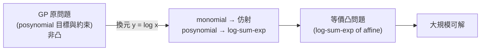
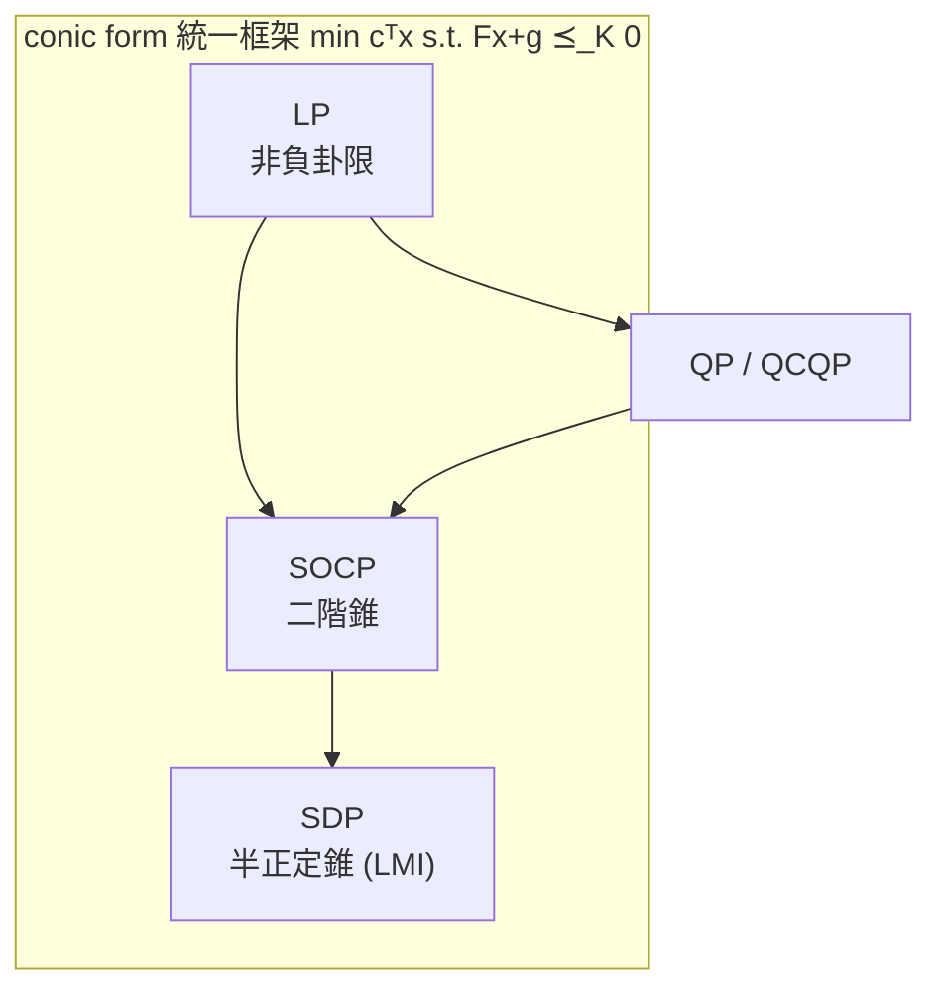

# 具名凸優化問題類別

對應逐字稿：`data/EE364A/transcripts/Stanford EE364A Convex Optimization I Stephen Boyd I 2023 I Lecture 6 [d2jF3SXcFQ8].en.txt`

本章已完整閱讀逐字稿，閱讀筆記見 [Lecture 6 閱讀筆記](notes/lecture-06-convex-problem-classes.md)。

> 這一講是「凸優化問題旋風之旅」的收尾。Boyd 用一整堂課，把工程、統計、財務裡最常出現、而且**有名字**的凸優化問題類別逐一走過：LP、分段線性極小化、Chebyshev center、線性分式規劃、QP、QCQP、SOCP、幾何規劃、以及用廣義不等式寫出的 conic form 與 SDP。他反覆強調的重點不是「怎麼解」（演算法留到後面），而是**認得名字、一眼歸類、知道它可大規模甚至即時求解**。本章就順著這條清單，把每一類的長相、判斷法與代表性建模例子釘牢。

## 收尾：擬凸優化與二分法

開場先接上一講的 [擬凸優化](05-log-concavity-and-convex-problems.md)。要小心：**凸問題「局部即全域」對擬凸並不成立**，可能出現非全域的局部最優，所以要更謹慎（但也沒那麼難）。

作法是替擬凸目標的水平下集找一族凸函數 $\phi_t$，使 $f_0(x)\le t \iff \phi_t(x)\le0$。經典例子是兩函數之比

$$
f_0(x)=\frac{p(x)}{q(x)},\qquad p\ \text{凸非負},\ q\ \text{凹正}.
$$

因為對固定 $t>0$，

$$
\frac{p(x)}{q(x)}\le t \iff p(x)-t\,q(x)\le0,
$$

右邊是「凹 × 正 $t$ 仍凹、取負變凸、再相加」，故對 $x$ 為凸。於是「是否存在 $x$ 使 $f_0(x)\le t$」變成一個**凸可行性問題**，再對 $t$ 做**二分法**：可行就把上界拉到中點、不可行就把下界拉到中點，每次迭代「無知區間」收縮一半——Boyd 說這相當於每解一次可行性問題就取得**關於 $p^\star$ 的一個 bit**。

以下正式進入具名的凸問題類別。

## 線性規劃 LP

**線性規劃**是最有名的一類：在多面體上極小化仿射函數。

$$
\begin{aligned}
\text{minimize}\quad & c^\top x + d\\
\text{subject to}\quad & Gx\le h,\quad Ax=b.
\end{aligned}
$$

常數 $d$ 可拿掉得到**等價**問題（不是相等）。幾何圖像：可行集是多面體，每個面是一條線性不等式；目標的水平線與 $c$ 正交，你沿 $-c$ 方向盡量推進，最優解落在某頂點。兩變數用眼睛就能解，真正在意的是**上萬變數、上萬約束**的 LP——排程、供應鏈等此刻正大量在跑。

### diet problem（歷史例）

選各種食物的非負份量 $x_j$，食物 $j$ 每單位含營養素 $i$ 的量為 $A_{ij}$，健康飲食要求營養素 $i$ 至少 $b_i$：

$$
\begin{aligned}
\text{minimize}\quad & c^\top x\quad(\text{總花費})\\
\text{subject to}\quad & Ax\ge b,\quad x\ge0.
\end{aligned}
$$

這與 LP「標準形」長得不完全一樣（不等式方向反了）。Boyd 示範**一次**如何整理成 $Gx\le h$：先各乘 $-1$（$Ax\ge b \Rightarrow -Ax\le -b$，$x\ge0 \Rightarrow -x\le0$），再堆疊：

$$
G=\begin{bmatrix}-A\\-I\end{bmatrix},\qquad h=\begin{bmatrix}-b\\0\end{bmatrix}.
$$

之後永遠不再手動做這種事——現代建模語言會替你處理。過去要人工轉換、追蹤、除錯，苦不堪言，被戲稱為 **matrix stuffing（塞矩陣）**。上界營養素、供給上限等變化都能自然加入，可見 LP 表達力很強。

## 分段線性極小化

極小化一個**分段線性函數**（有限多個仿射函數取 max）：

$$
\text{minimize}\quad \max_{i=1,\dots,m}\ (a_i^\top x + b_i).
$$

目標非仿射（$m>1$ 時），所以它**不是** LP。但用 [epigraph 形式](05-log-concavity-and-convex-problems.md) 引入變數 $t$ 即可化成 LP：

$$
\begin{aligned}
\text{minimize}\quad & t\\
\text{subject to}\quad & a_i^\top x + b_i\le t,\quad i=1,\dots,m.
\end{aligned}
$$

這是一個誠實的 LP（線性目標、線性約束）。Boyd 說如果你把某問題化到這步，別人問「怎麼解」，你只要回一句「它是 LP」——這是被預期要知道的常識。

## Chebyshev center：多面體內的最大內接球

第二個「找集合中心」的例子（前一個是良率的 yield center）。給定多面體 $P=\{x:a_i^\top x\le b_i\}$，求**最大內接球**的圓心與半徑。

關鍵一步：球 $\{x_c+u:\lVert u\rVert_2\le r\}$ 落在半空間 $a_i^\top x\le b_i$ 內，等價於球上該仿射函數的最大值不超過 $b_i$。由 Cauchy–Schwarz 取等，

$$
\max_{\lVert u\rVert_2\le r}\ a_i^\top(x_c+u)=a_i^\top x_c + r\lVert a_i\rVert_2.
$$

多面體是所有半空間之交，於是

$$
\begin{aligned}
\text{maximize}\quad & r\\
\text{subject to}\quad & a_i^\top x_c + r\lVert a_i\rVert_2 \le b_i,\quad i=1,\dots,m.
\end{aligned}
$$

看到 two-norm 應該「黃燈閃」警覺可能不是 LP——但這裡 $\lVert a_i\rVert_2$ 是**給定資料**（描述某個面的常數），所以對變數 $(x_c,r)$ 而言每條約束仍是**線性**的，整體是 LP，可在極大規模下求解。順帶一提，Chebyshev center **不唯一**（矩形就有一整條解）。

> **教學心法**：Boyd 反覆用「大腦不同區域亮燈」比喻——聽到 LP 該浮現平面、分段仿射這類「扁的」東西；聽到 two-norm / 球 / 歐氏距離該浮現「圓的」東西，理應離 LP 很遠。看到二次或範數先起疑，再檢查它是不是只是常數資料造成的虛驚。

## 線性分式規劃 LFP

極小化兩仿射函數之比，定義域取分母為正之處，約束在多面體上：

$$
\text{minimize}\quad \frac{c^\top x + d}{e^\top x + f},\qquad e^\top x + f>0.
$$

這是**擬凸**問題，故必然能用「呼叫 LP solver 的二分法」求解。但更漂亮的結果（約 1950–60 年代發現）是：它可以化為**單一 LP**——引入新變數並重新參數化，背後用到 perspective 變換。這是個**非顯然**的問題變換（前面那些乘 $-1$、堆疊都是顯然的），這就是利用 Perspective 變換，將變數 $x$ 轉換為 $y = x/t, z = 1/t$ 來達成。

**廣義 LFP** 是一堆 LFP 取 max，仍是擬凸（擬凸函數取 max 仍擬凸），而它**只能靠二分法**求解。最著名的例子是 von Neumann 的成長經濟模型：

- $x$、$x^+$：本期與下期各部門的經濟活動水準（皆非負），$x_i^+/x_i$ 是該部門成長率；
- 目標：極大化「各部門成長率的最小值」（min 成長率的 max-min）；
- 約束：$Ax^+\le Bx$——下期消耗的資源不超過本期產出（$A$、$B$ 含正負，代表消耗與產出）。

這正是廣義 LFP（把 max-min 翻成 min-max）。十個部門就無法手算，但上萬部門電腦輕鬆解。

## 二次規劃 QP

**QP** 像 LP，但目標換成凸二次函數，約束仍線性：

$$
\begin{aligned}
\text{minimize}\quad & \tfrac12 x^\top P x + q^\top x + r\quad(P\succeq0)\\
\text{subject to}\quad & Gx\le h,\quad Ax=b.
\end{aligned}
$$

幾何上，LP 的水平集是超平面、QP 的水平集是**橢球面**。最優條件：在最優點，負梯度（指向無約束極小）是可行集的**外法向**；否則沿邊界微動還能更好。

QP 的實務地位極高：可解 50,000 變數而「毫不費力」，可靠到能嵌入控制系統、每秒解 100–1000 次、**失敗率為零**（Falcon 9 一級著陸就同時跑多個 QP，其一每秒千次而不失手）。Boyd 說過半數的量化避險基金「就只是跑 QP」，等於有數兆美元靠 QP 在交易。

**例子**：

- 無約束 QP 就退化成 **least squares**（線性代數即可解）；真正有價值的是「**加上線性約束後仍完全可解**」——很多領域不知道這件事，遇到「參數要非負或落在區間」就發明極複雜的迭代法，其實「那是個 QP，一行 Python 就解」。
- **isotonic regression**：least squares 加上 $x_1\le x_2\le\cdots\le x_n$。這是「磨損/損傷只增不減」的好模型（噴射引擎跑久了間隙不會變好）。統計界為它寫整本書，但對我們而言它就是個 QP。

**風險調整成本（risk-adjusted cost）**是 LP-with-random-cost 的雛型：成本 $c$ 隨機，取

$$
\bar c^\top x + \gamma\, x^\top\Sigma x,
$$

$\bar c$ 是平均成本、$\Sigma$ 是 $c$ 的共變異、$\gamma>0$ 是**風險趨避參數**。$\gamma>0$ 時是凸二次，是 QP。若 $\gamma<0$（**risk seeking**，追求同均值但更大變異），既是蠢事、又**非凸不可解**。Boyd 由此點出一個常見的「巧合」：

| | 該解 | 不該解 |
|---|---|---|
| **可解** | 你真正要解的（多半在此格） | — |
| **不可解** | 少數 | 那些又蠢又難的 |

也就是「該解的問題往往剛好可解，不該解的往往剛好不可解」，通常不是 25/25/25/25 平均分佈。

**QCQP** 是把線性不等式換成凸二次不等式，名字仍偶爾會聽到。

## 二階錐規劃 SOCP

接著是相對現代（近 25 年）的 **SOCP**，長相無辜卻能塞進驚人多的問題：

$$
\begin{aligned}
\text{minimize}\quad & c^\top x\\
\text{subject to}\quad & \lVert A_i x + b_i\rVert_2 \le c_i^\top x + d_i,\quad i=1,\dots,m\\
& Fx=g.
\end{aligned}
$$

每條約束說「某仿射映射的像落在**二階錐** $\{(u,v):\lVert u\rVert_2\le v\}$ 裡」。當 $A_i,b_i=0$ 就退回 LP，故 **SOCP 廣義化 LP**；它也涵蓋 QCQP。

> **注意：是 two-norm 本身，不是它的平方。** 幾百年數學訓練讓我們看到 two-norm 就想平方（為了解析解、可微等），但這裡**不要平方**。

Boyd 把 SOCP 形容成凸優化的「**byte code / 低階語言**」：你用高階語言（如 CVXPY）寫下 quadratic-over-linear、幾何平均等奇形怪狀的函數，約 95% 的實務凸問題會被**編譯成 SOCP** 再求解。妙處在於：一大群人其實在解「他們不知道能化成 SOCP」的問題，於是全世界都有人在改進 SOCP solver，整個生態互蒙其利。就像編譯後你通常不該去看 byte code，你也不該去讀被展開的 SOCP。

### robust LP：SOCP 的招牌應用

當約束係數 $a_i$ **不確定**時（diet problem 裡每批貨的營養含量本就會變），有兩種建模，兩種都變成 SOCP。

**（1）橢球不確定性（deterministic / worst-case）**：$a_i\in\{\bar a_i+P_iu:\lVert u\rVert_2\le1\}$，要求約束對**所有可能的** $a_i$ 都成立。對橢球取最大值後：

$$
\bar a_i^\top x + \lVert P_i^\top x\rVert_2 \le b_i.
$$

這正是 SOCP。若忽略不確定性就是把 $a_i$ 換成中心 $\bar a_i$ 的 LP；而 $\lVert P_i^\top x\rVert_2$ 恰恰告訴你該留多少**餘裕（margin）**：$P$ 在哪個方向大，就避免 $x$ 往那個方向——而且這個 margin 是**你自己選的 $x$ 的函數**。

**（2）統計模型（chance constraint）**：$a_i\sim\mathcal N(\bar a_i,\Sigma_i)$，要求 $\Pr(a_i^\top x\le b_i)\ge\eta$。因 $a_i^\top x$ 是高斯，標準化後用高斯 CDF $\Phi$ 的單調性，化成

$$
\bar a_i^\top x + \Phi^{-1}(\eta)\,\lVert \Sigma_i^{1/2} x\rVert_2 \le b_i.
$$

**只有當 $\eta\ge \tfrac12$（此時 $\Phi^{-1}(\eta)\ge0$）才是 SOCP、才凸**；若 $\eta<\tfrac12$，係數變負、不等式方向翻掉，既蠢又不可解。

> Boyd 的吐槽：沒有任何領域真的知道自己分布的**尾端**。有人要求 $\Pr\ge99.9\%$ 其實只是「拜託讓它成立」的意思，別當成對尾機率有精準掌握。但這仍是完全正當的建模。

## 幾何規劃 GP

**幾何規劃**是「非凸、但經換元可化成凸」的第一個範例，也自帶一套「秘密語言」。變數皆為**正**。

- **monomial（GP 意義）**：$c\,x_1^{a_1}\cdots x_n^{a_n}$，其中 $c>0$，指數 $a_i$ 是**任意實數**（可 $-1.3$、$+2.6$）。這在工程裡就是 scaling law。
- **posynomial**：monomial 之和。

> **警告**：GP 對 monomial 的用法與數學自 1820 年代起的標準定義（整數指數、係數可正可負，如 $-3x_1^3x_2x_5$）**不同**。這兩個詞（monomial、posynomial）只能在確定聽眾都懂 GP 的場合使用，否則會被當外行。

GP 標準形（$x_i>0$ 為隱含約束）：

$$
\begin{aligned}
\text{minimize}\quad & f_0(x)\ (\text{posynomial})\\
\text{subject to}\quad & f_i(x)\le1\ (\text{posynomial}),\qquad g_j(x)=1\ (\text{monomial}).
\end{aligned}
$$

這高度非線性、**完全不是凸問題**（如 $x_1^{1.3}x_2^{-0.3}=1$ 連仿射都不是）。

**凸化的換元**：令 $y_i=\log x_i$。monomial 取 log 變成**仿射函數** $a^\top y+b$；posynomial 變成 **log-sum-exp of affine**，是凸函數。於是 GP 等價於

$$
\begin{aligned}
\text{minimize}\quad & \log\textstyle\sum_k e^{a_{0k}^\top y + b_{0k}}\\
\text{subject to}\quad & \log\textstyle\sum_k e^{a_{ik}^\top y + b_{ik}}\le0,\qquad \tilde a_j^\top y + \tilde b_j=0,
\end{aligned}
$$

全部是凸（log-sum-exp 凸、前置合成仿射保凸），可大規模求解。Boyd 補充：實務領域**早就在心裡用 log**——無線功率用 dB（就是 log）、電路元件尺寸來 $1,1.4,2,4,8,16\dots$（就是等比／log 均勻）。GP 可凸化在西方到 1980 年代才被發現（據說莫斯科 60 年代就知道）。

### 例子：懸臂樑設計

設計 $N$ 段懸臂樑，變數是各段寬 $w_i$、高 $h_i$。

- 目標：極小化**總重**（正比於 $\sum w_i h_i$，是一個 indefinite 二次型、**非凸**）；
- 約束：各段寬高的幾何/製造上下限、各段**最大應力**上限（monomial）、末端**撓度**上限（從樑尖往回遞推得到的 posynomial）——例如「加 10 kN 時末端下垂不得超過 3 cm」。

原問題非凸，但經 $y=\log$ 換元即變凸。Boyd 也提到：更簡單的類似問題早在 1950 年代初就用 LP 在航太業求解——航太不能像橋樑那樣留大餘裕（多餘重量＝沒有酬載），必須在滿足所有剛度與動載要求下盡量輕。

**monomial / posynomial 的封閉性**（凸函數運算規則的類比）：

| 運算 | 結果 |
|---|---|
| monomial × monomial | monomial |
| monomial + monomial | posynomial |
| posynomial × posynomial | posynomial |
| posynomial ÷ monomial | posynomial |
| posynomial ÷ posynomial | **未知（不封閉）** |

> **軼事：直覺會騙人。** Boyd 曾到處演講宣稱某控制問題「大概非凸（probably）」，同事 Andy 用一組「對正定矩陣取逆」的變態換元，兩行就把它化成凸。幸好投影片上寫的是 "probably" 的小字腳註，才沒被打臉。教訓：面對「非凸」宣稱要非常小心。

## 廣義不等式：conic form 與 SDP

最後把純量不等式換成**廣義不等式**（向量/矩陣值約束）。**Conic form（錐形式）**：

$$
\begin{aligned}
\text{minimize}\quad & c^\top x\\
\text{subject to}\quad & Fx+g\preceq_K 0,\quad Ax=b.
\end{aligned}
$$

- $K=$ 非負卦限 $\Rightarrow$ 這只是把 LP 寫得很迂迴；
- $K=$ 二階錐之積 $\Rightarrow$ 這是 SOCP。

**半正定規劃 SDP** 取 $K$ 為半正定錐：

$$
\begin{aligned}
\text{minimize}\quad & c^\top x\\
\text{subject to}\quad & x_1 F_1 + \cdots + x_n F_n + G \preceq 0,\quad Ax=b,
\end{aligned}
$$

其中 $F_i,G$ 為對稱矩陣，$\preceq0$ 表**負半定**。這條矩陣不等式叫 **LMI（linear matrix inequality，線性矩陣不等式）**。把所有矩陣取對角就退回 LP，故 SDP 廣義化 LP；它也涵蓋 SOCP（透過 **Schur complement**）。SDP 近 20–25 年在理論計算機科學、物理、統計已相當主流。

**Schur complement**（後續作業會用）：處理 block matrix 正/負半定的判準，能把帶 two-norm 的非線性約束等價寫成 LMI。它其實無所不在——統計裡是高斯的條件化、電路裡是端口短路/開路後的化簡。本講只點名，（若 $A \succ 0$，則 $\begin{bmatrix} A & B \\ B^T & C \end{bmatrix} \succeq 0 \iff C - B^T A^{-1} B \succeq 0$）。

**例子**：極小化最大特徵值 $\lambda_{\max}\!\big(\sum_i x_i A_i\big)$（$A_i$ 對稱）。用 epigraph：$\lambda_{\max}(M)\le t \iff M\preceq tI$，於是

$$
\begin{aligned}
\text{minimize}\quad & t\\
\text{subject to}\quad & \textstyle\sum_i x_i A_i \preceq t I,
\end{aligned}
$$

是個 SDP。同理，極小化矩陣的最大奇異值（induced 2-norm）於某仿射集上，也能寫成 LMI 求解。結論一如既往：**這些問題現在就是「解就對了」**。

## 求解與建模的意義

- 本章的核心能力是**歸類**：拿到一個問題，判斷它是 LP / QP / SOCP / GP / SDP 哪一類，並知道它可大規模、甚至嵌入式即時求解。
- 反覆出現的建模招式：**epigraph**（分段線性 → LP、$\lambda_{\max}$ → SDP）、**在球/橢球上取最大值**（Chebyshev center、robust LP 的 Cauchy–Schwarz）、**換元**（GP 的 $y=\log x$）、**廣義不等式 + Schur complement**（SDP 的 LMI）。
- 最優性條件本章只在 QP 幾何略提（負梯度＝可行集外法向），完整的對偶留給下一講。
- 這些問題形式是後續 approximation、statistical estimation、geometric problems 的底層求解目標；robust / stochastic 建模則是後面 regularization 的前奏。

## 本章小結

- 先收尾**擬凸優化**：$p(x)/q(x)$（$p$ 凸非負、$q$ 凹正）為擬凸，$p-tq$ 對固定 $t>0$ 凸；用凸可行性 + 二分法求解，每步取得 $p^\star$ 的一個 bit。
- **LP**：多面體上極小化仿射目標；diet problem 為歷史例；用「乘 $-1$ + 堆疊」化標準形（matrix stuffing 交給軟體）。
- **分段線性極小化**（max of affine）與 **$\lambda_{\max}$** 都靠 epigraph 化成 LP / SDP。
- **Chebyshev center**：多面體最大內接球；由 Cauchy–Schwarz 得 $a_i^\top x_c + r\lVert a_i\rVert_2\le b_i$，因 $\lVert a_i\rVert_2$ 是常數故仍是 LP；中心不唯一。
- **LFP**（兩仿射比值）擬凸，可化為單一 LP（perspective，非顯然）；**廣義 LFP**（von Neumann 成長模型）只能二分法。
- **QP**＝凸二次目標 + 線性約束；含 least squares、isotonic regression、risk-adjusted cost（$\gamma>0$ 才是 QP，$\gamma<0$ risk-seeking 非凸）；可 5 萬變數、嵌入式每秒千次、失敗率零。**QCQP** 加凸二次約束。
- **SOCP** $\lVert A_ix+b_i\rVert_2\le c_i^\top x+d_i$（**不是平方**），廣義化 LP/QCQP，是凸優化的「低階語言」；robust LP 的橢球版與統計版（$\eta\ge\tfrac12$）皆化成 SOCP，$\lVert P_i^\top x\rVert_2$ 就是 margin。
- **GP**：monomial（$c>0$、實指數）與 posynomial（monomial 之和）為秘密語言；GP 非凸，但 $y=\log x$ 換元後變 log-sum-exp 凸問題；懸臂樑設計為例。
- **廣義不等式**：conic form 統一 LP（非負卦限）、SOCP（二階錐）、**SDP**（半正定錐，LMI）；Schur complement 可把 two-norm 約束寫成 LMI；$\min\lambda_{\max}$ 是 SDP。
- 貫穿全講：看到 two-norm / 二次先起疑，但若其內容是常數資料則是虛驚；**「該解的問題往往剛好可解」**；推廣時直覺會騙人。下一講進入 **Duality**。

## 相關教材與材料

此段只建立關聯，不提供作業解答。若材料尚未核對或資訊不足，保留 `待補`。

- 對應 slides：`data/EE364A/course material/slids/04_Convex optimization problems.pdf` 的後半段（named problem classes：LP / QP / SOCP / GP / SDP）。狀態：待核對逐字稿與投影片頁次對應。
- 對應教科書《Convex Optimization》（Boyd & Vandenberghe）第 4 章：LP（4.3）、QP/QCQP（4.4）、SOCP（4.4.2）、GP（4.5）、廣義不等式 / conic / SDP（4.6）。**章節號依常見編排標註，頁碼待核對**。
- **LFP → 單一 LP** 的確切變換（perspective 變換）：$y = x/(c^T x + d), z = 1/(c^T x + d)$，不臆造。
- **Schur complement** 的正式敘述：逐字稿只給直覺並預告後續作業，教科書附錄 A.5.5 有詳細的 Schur Complement 公式。
- Assignment / 考試關聯：待補（依學期版本，集中於附錄，不與 2023 逐字稿混寫）。
- 下一講 **Duality** 對應 `data/EE364A/course material/slids/05_Duality.pdf`、教科書第 5 章。
