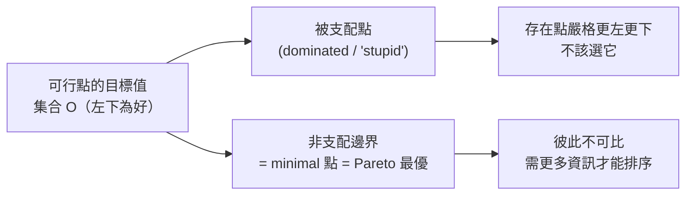
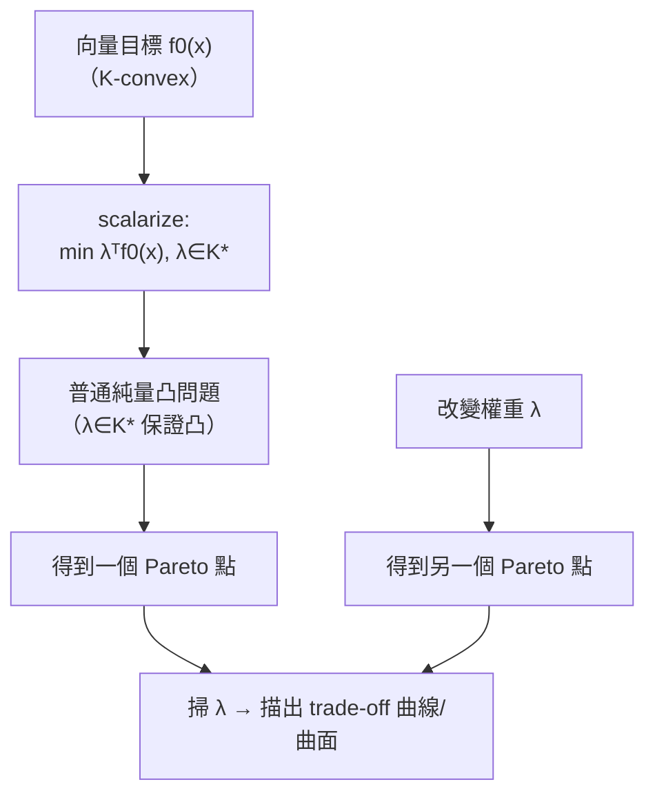
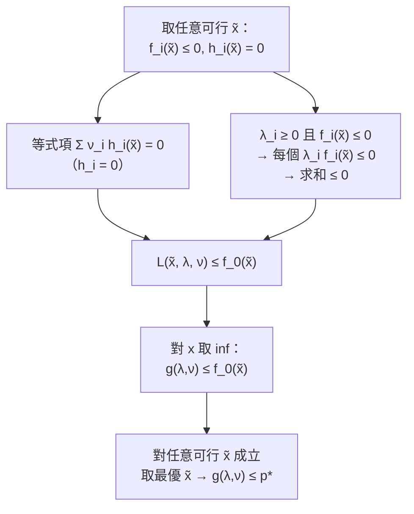

# 向量優化與對偶初步

對應逐字稿：`data/EE364A/transcripts/Stanford EE364A Convex Optimization I Stephen Boyd I 2023 I Lecture 7 [P_SuSVZnrT0].en.txt`

本章已完整閱讀逐字稿，閱讀筆記見 [Lecture 7 閱讀筆記](notes/lecture-07-vector-optimization-and-duality.md)。

> 這一講是一個轉場。**前半**收掉凸優化問題的最後一塊理論拼圖——當**目標本身是向量**時該怎麼辦（向量優化 / 多目標優化）；**後半**正式掀開整門課後段的主線：**Lagrange 對偶**。Boyd 半自嘲地說，他自己前兩三次學 Lagrange 乘子時「完全不知道那是什麼」，被教成一種「閉嘴照做」的操作；他希望這門課能讓你真正懂它的意思。本章因此把重點放在：向量優化的新語義（Pareto／trade-off／scalarization），以及對偶「從一個看似荒謬的近似出發、卻長出下界這件強力武器」的起點。

## 為什麼要「向量優化」

先回顧語義。在標準（純量）優化問題裡，語義非常硬：**不滿足全部約束就完全不可接受，沒得討論**；在可行點之中，目標（一個純量）最小的那個最好。前面談向量不等式（例如「某矩陣半正定」）時，我們動的是**約束**的寫法，優化問題的語義**沒有改變**。

現在要動的是**目標**：把目標從純量推廣成**向量**。這一步非改語義不可——因為「minimize 一個向量」本身沒有唯一意思。根本原因是：向量上的排序通常**不是線性序（linear ordering）**。於是「最小」會分裂成兩個不同概念，一如先前談過的 minimal 對 minimum。

Boyd 的引子例子：有人要你「找一個估計量，讓我的誤差共變異數矩陣**小**」。立刻有人會問：矩陣的「小」是什麼意思？如果剛好存在**一個**共變異數矩陣比其他所有選擇都小，那就毫無歧義——那叫 **minimum**，它一定是解。但這種好事很罕見。

## 可達目標集合、minimal 與 Pareto

處理向量目標的第一步，是看**可達目標集合（set of achievable objective values）**：先篩掉所有不可行的 $x$，只留可行者，再看它們的目標值集合，記為 $\mathcal O$。向量之間用一個錐 $K$ 來比較；多目標情形 $K=\mathbb R^q_+$，直覺就是「**左下為好**」。

- **minimum（罕見）**：$\mathcal O$ 裡存在一個點，比所有其他點都小（在 $\preceq_K$ 意義下）。此時直接稱 optimal。
- **minimal / Pareto optimal（一般）**：某點是 $\mathcal O$ 的極小點，意思是**沒有任何點嚴格更好**（沒有點在它的「左下」）。這條非支配邊界通常是一整條曲線，而非單點。

「非支配（non-dominated）」是 Boyd 很喜歡的另一個名字：一個點若被支配，代表存在**嚴格更左更下**、也就是各項都不差、至少一項更好的選擇。反過來，不被任何點支配的，就是 Pareto 最優。這個名字來自經濟學（Pareto，約 1890 年代），並非新東西。

一個關鍵直覺：兩個 Pareto 點通常**彼此不可比**——沒有更多資訊，你無法說哪個更好。這正是「**trade-off（權衡）**」一詞的來源：拿其中一點比另一點，它在某個目標上贏，卻用另一個目標來付帳（那項更高）。這已經帶出簡單的經濟學味道——你在兩個目標之間**用一個換另一個**。

## 多目標優化（multicriterion）

最清楚的向量優化是**多目標優化**：錐取 $\mathbb R^q_+$，各分量就是你的目標 $f_1,\dots,f_q$，全都要小。

- **完美情形**：存在單一 $x$ **同時**最小化所有目標——代表目標之間毫無競爭。Boyd 說這「幾乎從不發生」：你不會設計一個電路，然後回來宣稱它同時把面積、功耗、動態功耗、最大輸出全都最小化了。
- **一般情形**：目標互相競爭，你得到的是一條 trade-off 曲線（多於二維時稱 trade-off 曲面）。

**Pareto 的白話判準**：你交出一個 $x$、拿到 $q$ 個分數。你是 Pareto 最優，若**沒有人能羞辱你**——沒有人能拿出另一個 $x$，在**所有**目標上都不輸你、且**至少一個**目標上贏你。這個口語敘述其實就是「非支配」的精確定義。Boyd 用生產計畫作比喻：若我的計畫在你我共用的 12 種資源上都不輸、還在兩項上贏，那我支配了你，你就不是 Pareto 最優（但我也未必是）。

Boyd 強調：**幾乎所有真實問題都是多目標問題**（機器學習要權衡 loss 與 regularizer、控制要權衡命中目標與燃料與乘坐舒適度）。有人把「多目標」搞成一個獨立領域，Boyd 覺得可笑——一旦你會用優化，這些都極其直接。

### 例一：雙目標最小平方（就是正則化）

$$
\text{minimize (相對於 } \mathbb R^2_+ \text{)}\quad
\big(\ \|Ax-b\|_2^2,\ \ \|x\|_2^2\ \big)
$$

語義：你交出 $x$，會被**兩個數字**評判——第一個是擬合／追蹤誤差 $\|Ax-b\|_2^2$（「請盡量讓 $Ax\approx b$」），第二個是參數大小 $\|x\|_2^2$（「別讓 $x$ 太大」）。把所有 $x$ 對應的二維向量畫成點，就得到 $\mathcal O$；只有其非支配邊界（含端點）值得考慮。這正是統計裡的 **Ridge regression / 正則化**——所以你其實不是在歷史資料上做到最好，這是刻意的。

### 例二：投資組合（Markowitz，1953）

這是最經典的風險-報酬 trade-off。$x$ 是投資組合權重（常正規化成和為 1、非負，即各資產的配置比例；後續章節會允許 $x$ 取負，代表**放空 short**：借入該資產立即賣出，期末再買回歸還，價格下跌就獲利）。報酬 $R$ 建模成隨機向量，給定前兩階動差：

$$
\text{期望報酬} = \bar p^\top x,\qquad
\text{風險（變異數）} = x^\top \Sigma x .
$$

風險開根號就是標準差，即所謂 volatility。這是雙目標問題：報酬要大、風險要小。為了不讓「一個要大一個要小」的錐把腦袋搞爆，通常改成最小化**負報酬**與風險：

$$
\text{minimize (相對於 } \mathbb R^2_+ \text{)}\quad
\big(\ -\bar p^\top x,\ \ x^\top \Sigma x\ \big).
$$

有學生問：加了負號還算凸嗎？答案是凸的——**風險是 convex quadratic、負報酬是 affine，兩者皆凸**（多目標最小化要求每個分量都凸）；但 Boyd 提醒務必自己檢查。

其非支配組合構成經典的**風險-報酬 trade-off 曲線**（即所謂的 **效率前緣 (Efficient Frontier)**）。搭配 **stack plot**：橫軸掃過曲線上各點、縱軸堆疊四種資產的權重——低風險端幾乎全是現金（$x_4$，零風險），隨著「承擔更多風險」，現金退場、換成債券、大型股、小型股等。統計模型本身「其實不太準」，Boyd 明講。

## Scalarization：把向量問題化回純量凸問題

如何真正**求解**向量優化？答案是 **scalarization（純量化）**：把向量目標壓成單一分數，就得到線性序。作法是取對偶錐中的正權重 $\lambda$，最小化加權和：

$$
\text{minimize}\quad \lambda^\top f_0(x),\qquad \lambda \succeq_{K^\star} 0 .
$$

這是一個**普通的純量凸優化問題**，而且它的解保證是原向量問題的一個 Pareto（minimal）點。凸性的關鍵（有學生特別問 $\lambda\in K^\star$ 的直覺）：

> 若 $f_0$ 對錐 $K$ 是 **K-convex**，且 $\lambda$ 落在**對偶錐** $K^\star$ 中，則 $\lambda^\top f_0(x)$ 對 $x$ **凸**。若 $\lambda$ 不在對偶錐裡，這個純量函數可能非凸，你就解不動它。多目標情形 $K=\mathbb R^q_+$ 的對偶錐是自己，於是條件退化成「取一組**正權重**、最小化目標的加權和」。

幾何上，scalarization 就是在 $\mathcal O$ 空間裡看 $\lambda^\top f_0$ 的等位超平面，沿好的方向推到極限、與 $\mathcal O$ 相切——切點即 Pareto 點，切線斜率大致是各目標之間的**局部交換率**。事實上，可以正確地把 $\lambda$ 想成一組**價格**：

- $\lambda_i$＝目標 $i$ 的價格，$\lambda^\top f_0$＝總開銷；
- **改變價格 → 得到不同 Pareto 點**，正是這件事讓你沿 trade-off 曲線／曲面移動；
- 掃過 $\lambda$ 可得**幾乎所有** Pareto 點（拿不到極限端點）。

Boyd 點出：機器學習裡「loss $+\ \lambda\cdot$ regularizer」根本就是 scalarization，只是大家做得太自然、連提都不提。

### 正則化最小平方與 risk-adjusted return

把雙目標最小平方 scalarize（用權重 $(1,\gamma)$，第一項可無損正規化為 1，稱 **primary objective**）：

$$
\text{minimize}\quad \|Ax-b\|_2^2 + \gamma\,\|x\|_2^2 .
$$

$\gamma$ 是一個**交換率**：告訴你「$x$ 太大」相對「殘差太大」有多惱人；它與各量的**物理單位**有關（一個目標可以是燃料公斤數，另一個是乘坐平順度，例如 jerk 的 RMS 值）。這就是 Ridge regression。

投資組合那邊 scalarize 後、翻個符號，$\bar p^\top x - \gamma\, x^\top\Sigma x$ 稱為 **risk-adjusted return（風險調整後報酬）**，$\gamma$ 稱 **risk aversion parameter（風險趨避參數）**：它懲罰高風險的選擇，並把風險換算到報酬的尺度上。另一種掃 trade-off 的等效作法：**固定風險上限、最大化報酬，再掃上限**——本週作業的能源儲存系統 trade-off 就可以這樣做。

> 文化補充（可略）：位置的一階導是速度、二階是加速度、三階是 **jerk**、四階是 **snap**；高級電梯或無人機軌跡會最小化 snap，讓你幾乎感覺不到啟動。五、六階導戲稱 **crackle** 與 **pop**（實務不用，是個玩笑）。

## 轉入對偶：Lagrangian

理論收尾後，Boyd 轉進 **Lagrange 對偶**。從標準形式問題（**注意：對偶的許多有趣應用裡，原問題並不凸**）出發，構造 **Lagrangian**——單一函數，把目標加上約束的加權和：

$$
L(x,\lambda,\nu) = f_0(x) + \sum_{i=1}^{m}\lambda_i f_i(x) + \sum_{i=1}^{p}\nu_i h_i(x).
$$

其中 $\lambda_i$、$\nu_i$ 稱 **Lagrange 乘子**，也叫**對偶變數（dual variables）**；在不同應用領域各有專名（shadow prices；能源系統裡叫 locational marginal prices）。

Boyd 用一張圖說明這個構造**乍看有多荒謬**。設單一不等式約束 $f_1(x)\le 0$。原問題可寫成**無約束**形式，把約束換成硬指示函數：

$$
\text{minimize}\quad f_0(x) + \mathbb{I}\big(f_1(x)\le 0\big),\qquad
\mathbb{I}=\begin{cases}0,&f_1(x)\le0\\ +\infty,&f_1(x)>0\end{cases}
$$

這個指示項是「情緒化的」——不是 0 就是 $+\infty$。Lagrangian 做的事，是把這個 0/+∞ 的階梯，換成一條**線性項** $\lambda f_1(x)$（斜率 $\lambda$）。任何正常人看到都會說：這**根本不是好近似**。Boyd 反覆用 appalling 形容，正是要你先感到荒謬，才會對後面「居然有用」感到震撼。

但這條線性項有個原指示函數沒有的**豐富解讀**——它是**價格**。若 $f_0$ 以美元計、$f_1$ 是倉儲超額用量：

| 狀況 | 硬指示函數 | Lagrangian 線性項（$\lambda>0$） |
|---|---|---|
| 超過上限 | $+\infty$，完全不可接受 | 付費使用額外倉儲空間 |
| 恰在上限 | $0$ | $0$ |
| 低於上限 | $0$（用不完也無所謂） | **被補貼**：把沒用到的空間出租、產生收入 |

換句話說，$\lambda$ 這個乘子，很多時候會**變成價格**。這正是對偶故事的伏筆。

## 對偶函數與兩個「極淺」性質

定義**對偶函數（dual function）**為 Lagrangian 對 $x$ 取下確界：

$$
g(\lambda,\nu) = \inf_{x}\ L(x,\lambda,\nu).
$$

若把 $\lambda,\nu$ 看成價格，$g$ 就是「**給定價格下的最低成本**」——這正是先前**共軛函數（conjugate function）**的一種解讀（把 $y$ 看成價格向量、共軛給出對應的最優成本）。接著是兩個 Boyd 一再強調「極淺、毫無深奧之處」的觀察：

**性質一：$g$ 恆為凹**，即使原問題非凸。理由：對固定 $x$，$L(x,\lambda,\nu)$ 是 $(\lambda,\nu)$ 的**仿射**函數；一族仿射函數取下確界，必為凹。就這樣，永遠成立。

**性質二（下界性質）：若 $\lambda\succeq 0$，則 $g(\lambda,\nu)\le p^\star$。** 對 $\nu$ **沒有任何符號限制**（可正可負）。證明只用到「小學等級」的事實：

Boyd 特意調侃「這裡用到極深的數學：非負數乘非正數是非正、非正數相加還是非正、一個數加上非正數會變小」——藉此強調此步毫無玄機。為什麼 $\lambda$ 必須非負？回到倉儲圖：若 $\lambda<0$，等於「我付**越來越多**錢請你超額使用、還對守規矩者收費」，這不只是壞近似，而是荒謬到不成立。相對地，$\nu$ 無需符號限制，因為等式項在可行點恆為 0。

## 四個例子與 dual certificate

### 例一：等式約束最小範數

$$
\text{minimize}\ \ \|x\|_2^2 \quad\text{s.t.}\ \ Ax=b .
$$

$L(x,\nu)=\|x\|_2^2+\nu^\top(Ax-b)$ 是凸二次；令梯度為 0（一組線性方程）解出 $x$，回代得 $g(\nu)$——如預期是**凹**的。下界性質立刻說：**任取**一個 $\nu$，$g(\nu)$ 就是 $p^\star$ 的下界。取 $\nu=0$ 得下界 0，於是你可以煞有介事地宣布「由對偶，最優值不可能為負」——聽者會覺得這是廢話（目標本來就非負），但這正是機制在運作。**真正的用途**：對某個有十億變數、只能用 heuristic 解的巨大問題，算這個下界就能回答「我離最優多遠」——若得知「我在最優的 5% 以內」，而原問題本身精度也不過 5%，那就完全夠了。

### 例二：標準形式 LP

$$
\text{minimize}\ \ c^\top x\quad\text{s.t.}\ \ Ax=b,\ x\ge 0 .
$$

Lagrangian 對 $x$ 是**仿射**，其 $\inf_x$ 幾乎恆為 $-\infty$——唯一例外是**線性部分為零**時（仿射函數 $p^\top x+q$ 只有在 $p=0$ 時 inf 才是有限的 $q$）。這裡條件是 $A^\top\nu + c = \lambda \ge 0$，此時

$$
g(\nu) = -b^\top\nu,\qquad\text{下界：}\ \ p^\star \ge -b^\top\nu\ \ \text{對任意 } \nu\ \text{滿足}\ A^\top\nu+c\ge 0 .
$$

Boyd 現場又**不用 Lagrangian、直接**證了一遍：取任意可行 $x$（$Ax=b,\ x\ge0$），由「兩個非負向量的內積非負」得 $(A^\top\nu+c)^\top x\ge 0$，展開並用 $Ax=b$ 即得 $c^\top x\ge -b^\top\nu$。他強調：這結論**看起來很深**，若出成作業題你多半做不出來，但其實只用到前面那些完全平凡的步驟。

這帶出一個漂亮結論——**dual certificate（對偶憑證）**：

> 解 LP（乃至任何凸問題）時，solver 回傳的不只是 $x$，還會**一併回傳** $\nu$（對偶變數）。把 $\nu$ 代入對偶目標 $g$ 得到一個下界，而這個下界**恰好等於**你拿到的 primal 目標值。於是你**不必信任 solver**——它同時交出一個最優點，和一份「沒有人能做得更好」的**簡短、自足的證明**。

### 例三：範數最小化（用到 dual norm）

$$
\text{minimize}\ \ \|x\| \quad\text{s.t.}\ \ Ax=b .
$$

$L=\|x\|+\nu^\top(b-Ax)$。$b^\top\nu$ 與 $x$ 無關可提出；剩下「範數減線性函數」正是**共軛函數**，其 $\inf_x$ 不是 0 就是 $-\infty$。結果：

$$
g(\nu)=b^\top\nu\quad\text{provided}\quad \|A^\top\nu\|_* \le 1\ (\text{dual norm}).
$$

下界：任何滿足 $\|A^\top\nu\|_*\le 1$ 的 $\nu$ 給出 $p^\star\ge b^\top\nu$。應用範例：衛星**最小燃料軌跡**（常用 $\ell_1$ 範數）——任取合法 $\nu$，$b^\top\nu$ 就是「從現在的位置移到目標所需燃料」的下界。

### 例四：two-way partitioning（非凸）

把 $n$ 個物件分成兩組，用 $x_i\in\{+1,-1\}$ 編碼（同組 $+1$／異組 $-1$）：

$$
\text{minimize}\ \ x^\top W x\quad\text{s.t.}\ \ x_i^2 = 1,\ i=1,\dots,n .
$$

因為 $x^\top W x=\sum_{i,j}w_{ij}x_ix_j$，而 $x_ix_j=+1$（同組）或 $-1$（異組），$w_{ij}$ 可解讀成「把 $i,j$ 放同組的成本」：正值代表兩者**互斥**、負值代表**親和**（想同組）。這問題**非凸**（$W$ 未必半正定，且 $x_i^2=1$ 這種等式非凸）。對偶函數：

$$
g(\nu) = -\mathbf 1^\top \nu \quad\text{provided}\quad W + \mathrm{diag}(\nu) \succeq 0 .
$$

（因為對稱矩陣二次型 $\inf_x x^\top A x$＝$0$（$A\succeq0$，取 $x=0$）或 $-\infty$（有負特徵值）。）任何滿足 $W+\mathrm{diag}(\nu)\succeq0$ 的 $\nu$ 給出 $-\mathbf1^\top\nu$ 這個下界；代入不同數值可導出許多知名下界。

### 收尾：spectral partitioning

上例的一個著名近親。把難處理的約束 $x_i^2=1$（共 $n$ 條）**鬆弛**成單一條 $\sum_i x_i^2=n$：

$$
\text{minimize}\ \ x^\top W x\quad\text{s.t.}\ \ \textstyle\sum_i x_i^2 = n .
$$

這仍**非凸**（等式約束），卻是「大約七個我們能解的非凸問題」之一——它是一個**特徵值問題**：解就是 $W$ 的**最小特徵向量**按 $\sqrt n$ 縮放。由於是鬆弛，其最優值是原 partition 問題的**下界**；而解出的 $x$ 是浮點數、不是 $\pm1$，於是用一個 heuristic：**對各分量取 sign**，就得到一個 partition。再微調 $W$ 的對角線可讓結果更好——這就是 **spectral partitioning**，對超大問題極好用。Boyd 強調：做應用數學若不懂 partitioning 與 spectral partitioning，很難走遠。

Boyd 講到這裡收尾，週四繼續 Duality 正題（弱／強對偶、KKT）。

## 本章小結

- **向量優化**把目標從純量推廣成向量；約束語義不變，但「minimize 一個向量」須新語義，因為向量沒有線性序（minimal vs minimum）。
- 用錐 $K$（多目標時 $\mathbb R^q_+$）比較；可達目標集合 $\mathcal O$ 的**非支配邊界**＝ minimal＝**Pareto 最優**；兩 Pareto 點通常不可比，形成 **trade-off** 權衡。
- **多目標優化**幾乎涵蓋所有真實問題；Pareto 白話＝「沒人能羞辱你」。例子：雙目標最小平方（＝正則化 / Ridge）、投資組合（Markowitz，1953）風險-報酬曲線。
- **Scalarization**：取 $\lambda\succeq_{K^\star}0$、最小化 $\lambda^\top f_0(x)$，得 Pareto 點；$\lambda\in K^\star$ 保證純量問題凸。$\lambda$＝**價格**，改變權重＝沿 trade-off 曲線移動。risk-adjusted return 的 $\gamma$＝risk aversion parameter。
- **Lagrangian** $L=f_0+\sum\lambda_i f_i+\sum\nu_i h_i$：把約束的硬指示函數換成線性（價格）項，乍看是很爛的近似，卻埋下下界的種子。
- **對偶函數** $g(\lambda,\nu)=\inf_x L$：恆**凹**（仿射族的下確界），即使原問題非凸；且 $\lambda\succeq0$ 時 $g\le p^\star$（**下界性質**，$\nu$ 無符號限制），證明只用最基本的不等式。
- 例子：least-norm、standard-form LP（另有直接證法）、norm 最小化（dual norm 條件）、two-way partitioning（非凸，$W+\mathrm{diag}(\nu)\succeq0$）。
- **Dual certificate**：solver 一併回傳對偶變數，其對偶目標值等於 primal 值——一份「沒人能更好」的自足證明，可估 heuristic 解的最優性間隙。
- **Spectral partitioning**：鬆弛 $x_i^2=1$ 成 $\sum x_i^2=n$＝特徵值問題，取最小特徵向量按 sign 取整＝分割 heuristic。

## 相關教材與材料

此段只建立關聯，不提供作業解答。未核對處保留 `待補`。

- 對應 slides：向量／多目標優化與 scalarization 屬 `data/EE364A/course material/slids/04_Convex optimization problems.pdf` 收尾；Lagrangian、對偶函數、下界性質、LP／norm／partitioning 例子屬 `data/EE364A/course material/slids/05_Duality.pdf` 開頭。狀態：待核對逐字稿與投影片頁次對應。
- 對應教科書《Convex Optimization》（Boyd & Vandenberghe）：向量優化屬第 4 章（4.7 vector optimization / multicriterion / scalarization，章節號待核對）；Lagrangian 與對偶函數屬第 5 章（5.1，章節號待核對）。頁碼 `待補`。
- 前置章節：Lecture 6（本書章 06，凸優化問題各類 LP/QP/SOCP/廣義不等式，並帶到向量不等式與向量優化開端），本講開頭即續此；亦回接章 05 的凸優化問題標準形式、K-convex 與共軛函數。
- 後續章節：Duality 正題（弱／強對偶、KKT），對應下一講。
- 作業關聯：Boyd 提到本週作業（週五截止）需要向量優化，且有一題對某能源儲存系統求 trade-off；屬 2023 版課程節奏，配分等行政資訊集中於附錄，不與逐字稿混寫。
- 待補／存疑：風險-報酬曲線的專名（效率前緣 (Efficient Frontier)）；slides 與教科書精確章節號、頁碼 `待補`。
