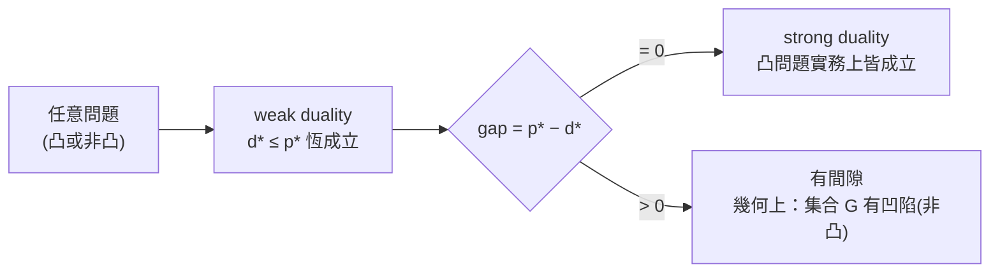
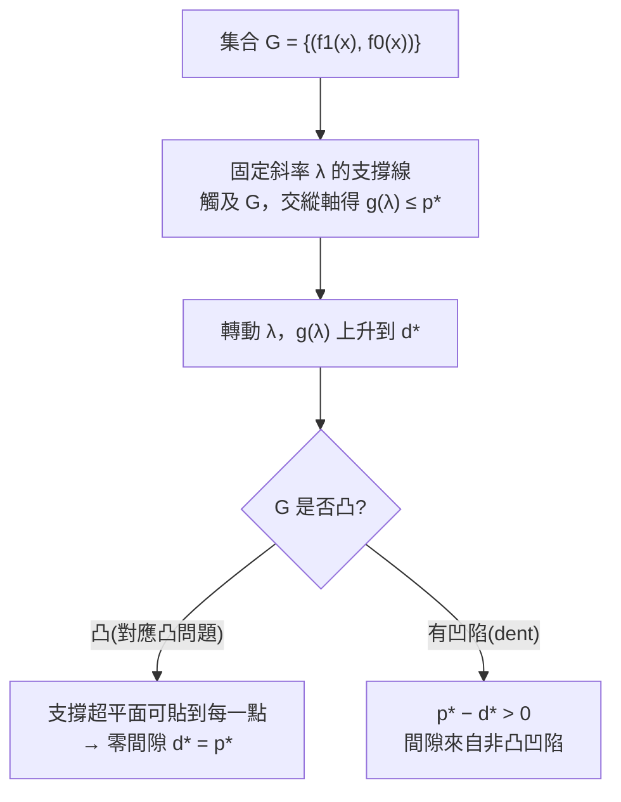
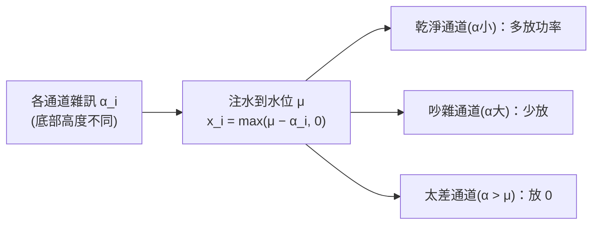

# 對偶問題、KKT 條件與敏感度分析

對應逐字稿：`data/EE364A/transcripts/Stanford EE364A Convex Optimization I Stephen Boyd I 2023 I Lecture 8 [wsRznzNgTS0].en.txt`

本章已完整閱讀逐字稿，閱讀筆記見 [Lecture 8 閱讀筆記](notes/lecture-08-dual-problem-kkt-sensitivity.md)。

> 這一講延續 **Duality**。前面已經鋪好：任取一個優化問題（凸或不凸），把約束用權重「拌」進目標形成 **Lagrangian**，再對變數 $x$ 極小化，得到 **dual function** $g(\lambda,\nu)$。它是原問題最優值 $p^\star$ 的一個**參數化下界**——換句話說，每餵一組乘子，就得一條下界（很多時候是 $-\infty$ 這種「萬用卻無用」的下界，但有時候一點都不顯然）。本講從一個顯而易見的衝動出發：**既然每組乘子都給下界，那就去找最好的那個下界**。這條線一路帶出 dual problem、weak/strong duality、Slater、幾何詮釋、互補鬆弛、KKT，最後落在最實用的**敏感度分析（影子價格）**。

## 從下界到最好的下界

回顧一下已知的事實：對任意 $\lambda\succeq0$ 與 $\nu$，

$$
g(\lambda,\nu)\ \le\ p^\star .
$$

Boyd 先用兩個例子把「dual function 從哪來、有什麼用」講活。

**partitioning 問題**（非凸）：

$$
\begin{aligned}
\text{minimize}\quad & x^\top W x\\
\text{subject to}\quad & x_i^2=1,\quad i=1,\dots,n
\end{aligned}
$$

它非凸有兩個理由：沒說 $W\succeq0$（目標可非凸），而且 $x_i^2=1$ 這種等式約束不是仿射（凸問題的等式約束必須仿射）。形成 Lagrangian、對 $x$ 極小化，會得到一個二次型的最小值——若該矩陣半正定則為 $0$、若有一個負特徵值則為 $-\infty$（game over）。於是得到一個很有意思的下界：

$$
g(\nu)=-\mathbf 1^\top\nu\quad\text{（前提：}W+\mathrm{diag}(\nu)\succeq0\text{）}.
$$

精確求解 partitioning 極難，但 Boyd 的實務態度是「你幾乎永遠不需要精確解」——那些 $W$ 通常是別人「編出來的」。真要做，就寫個笨到極點的貪婪法：隨機初始化 $x\in\{\pm1\}^n$，循環掃過各分量，若翻轉某個 $x_i$ 的符號能讓目標下降就翻；掃到不動為止（**1-opt**），再加幾行處理兩兩對調（**2-opt**）。這些「locally optimal in a discrete set」的方法常常出奇地好用。而上面的對偶下界的價值在於：當貪婪法把目標壓到 $3.2$，你能同時給出「沒有人能做到比 $2.7$ 更好」的**可證下界**，於是就知道「不必再叫人來改進 partitioner 了」。

**與共軛函數的連結**：對一般問題 minimize $f_0(x)$ s.t. $Ax\preceq b,\ Cx=d$，dual function 裡會冒出「極小化（函數 ＋ 線性項）」的結構，那正是共軛 $f_0^\ast$（差個符號）：

$$
g(\lambda,\nu)=-b^\top\lambda-d^\top\nu-f_0^\ast\!\big(-A^\top\lambda-C^\top\nu\big).
$$

於是「最大熵問題（負熵目標）的對偶，是一個含指數的凸問題」——這正是統計裡**最大熵 ↔ 指數族**的連結。

### Lagrange 對偶問題

把「找最好的下界」寫成問題本身，就是 **Lagrange dual problem**：

$$
\begin{aligned}
\text{maximize}\quad & g(\lambda,\nu)\\
\text{subject to}\quad & \lambda\succeq0
\end{aligned}
$$

用白話說：**在 Lagrange duality 的框架下，找對原問題最優值最大的下界。** 它最漂亮的性質是——

!!! note "對偶問題永遠是凸的"
    無論原問題凸或不凸，dual problem 都是凸問題（$g$ 是一族仿射函數的下確界，故為凹；maximize 凹函數 s.t. $\lambda\succeq0$ 即凸）。

一個範例是**標準式 LP** 與其對偶都是 LP，兩者稱為 **dual LPs**。「dual」這名字像 conjugate：做兩次會回到原點（在多數情況下）。

## Weak duality 與 strong duality

令 $d^\star$ 為對偶問題的最優值（＝用 Lagrange duality 能拿到的最大下界），$p^\star$ 為原問題最優值。

$$
\boxed{\ d^\star\ \le\ p^\star\ }\qquad(\text{weak duality})
$$

**weak duality 永遠成立**——凸、非凸都成立，沒有病態、沒有例外。$d^\star,p^\star$ 允許為 $\pm\infty$；特別地 $d^\star=+\infty$ 是「原問題不可行」的憑證。Boyd 強調：它聽起來玄，其實只建立在「兩個非負數相乘非負、相加非負」這種最簡單的事實上。定義

$$
\text{最優對偶間隙（duality gap）}\ =\ p^\star-d^\star\ \ge\ 0 .
$$

**strong duality** 是 $d^\star=p^\star$（gap 為 0）。一般不成立，但 Boyd 的實務斷言是：

> 在**所有實務上的凸問題**，strong duality 都成立。真有反例（存在，但極其病態）的話，你八成是**把問題建錯了**，該回頭檢查。

### 何時保證 strong duality：Slater 條件

要**保證** strong duality，通常要附加 **constraint qualification**。最著名的一把「大鎚（sledgehammer）」是 **Slater 條件**：

!!! note "Slater 條件"
    對**凸問題**，若存在一點使所有**不等式約束嚴格成立**（strictly feasible），則 strong duality 成立。
    此外，**線性不等式可豁免**嚴格性要求（不需嚴格滿足）。

還有一大堆其他的 constraint qualification（整本書、整門課都在講），但 Boyd 認為一般人不需要為此操心。

### solver 免費奉送最優性憑證

對 inequality-form LP、QP，把對偶顯式寫出後可看到：任何 feasible 的 $\lambda$ 都給一個下界。更關鍵的是——

> 當你呼叫 solver 解 LP/QP，它回傳的不只是 primal optimal $x$，還有 dual optimal $\lambda$；後者是一份**獨立可檢驗的證明**，證明沒有任何可行點的目標值能更小。這在數值計算裡非常罕見。所有現成 solver 都同時回傳 **primal optimal 與 dual optimal**，dual optimal 就是**最優性憑證（certificate of optimality）**。

## 幾何詮釋：間隙就是集合的凹陷

以單一約束的非凸問題 minimize $f_0(x)$ s.t. $f_1(x)\le0$ 為例，定義

$$
\mathcal G=\{(f_1(x),\,f_0(x)) : x\in\mathrm{dom}\}\subseteq\mathbb R^2 .
$$

- 橫軸 $f_1$：左半（$\le0$）可接受，右半不可（那些 $x$ 直接無視）。
- 縱軸 $f_0$：越小越好。
- $p^\star$：$\mathcal G$ 在「左半部」的最低點在縱軸上的高度。

固定 $\lambda$（斜率），Lagrangian 的 level curve $f_0+\lambda f_1=\text{const}$ 往下推到剛好觸及 $\mathcal G$，與縱軸的交點即 $g(\lambda)$，且 $g(\lambda)\le p^\star$。轉動斜率，$g$ 先升到最大值 $d^\star$、再下降——正好描出一條凹曲線（我們早知 $g$ 凹）。

> 逐字稿裡 Boyd 對 level curve 斜率是 $-\lambda$ 還是 $-1/\lambda$ 當場也沒把握（口述「maybe minus lambda… or minus one over lambda」）。此處**標存疑**，不下定論——重點在幾何機制，不在斜率的精確係數。

把這張圖內化後就能「看見」為何凸問題零間隙：改用 epigraph 版集合 $\mathcal A$（兩個 epigraph 的交），凸問題下 $\mathcal A$ 是凸集，可對其邊界上每一點取 **supporting hyperplane**，那條切線的斜率就對應最佳的 $\lambda$，於是 $p^\star=d^\star$。

### 非凸也可能零間隙：兩個二次式

有少數非凸問題已知零間隙，最有名的是**兩個二次式**（min 非凸 quadratic s.t. 一個 quadratic 約束，如單位球上），可證 strong duality（不易證）。推論很驚人：**任何「兩個二次式」的問題（凸或不凸）都可 tractable 求解**——特徵值問題就是一例：

$$
\text{maximize } x^\top A x\quad\text{s.t. } x^\top x=1
$$

你能給的是**全域解**，即使問題非凸。Boyd 說有人據此主張「凡是能全域求解的問題，背後都藏著凸性」——極端但不算壞的觀點（連最短路徑的鬆弛都可證緊）。這個「兩二次式」事實**每約十年就在不同領域被重新發現一次**，很值得知道。更病態的非凸零間隙（如複域六變數四次式，源自代數幾何）Boyd 建議忘掉。

## 互補鬆弛（complementary slackness）

設 strong duality 成立且達到，$x^\star$ 為 primal optimal、$(\lambda^\star,\nu^\star)$ 為 dual optimal（合稱 **primal-dual optimal**）。串起這條夾擠鏈：

$$
f_0(x^\star)=g(\lambda^\star,\nu^\star)=\inf_x L(x,\lambda^\star,\nu^\star)\ \le\ L(x^\star,\lambda^\star,\nu^\star)
= f_0(x^\star)+\underbrace{\textstyle\sum_i\lambda_i^\star f_i(x^\star)}_{\le 0}+\underbrace{\textstyle\sum_i\nu_i^\star h_i(x^\star)}_{=0}\ \le\ f_0(x^\star).
$$

頭尾相等 ⇒ 全是等式 ⇒ $\sum_i\lambda_i^\star f_i(x^\star)=0$。而每一項 $\lambda_i^\star\ge0$、$f_i(x^\star)\le0$ 皆 $\le0$；一堆非正數加起來為 0，代表**每一項都是 0**：

$$
\boxed{\ \lambda_i^\star\, f_i(x^\star)=0\quad\text{對每個 }i\ }\qquad(\text{complementary slackness})
$$

術語：$f_i(x^\star)=0$ 稱該約束 **tight（taut）**，$f_i(x^\star)<0$ 稱 **slack**。互補鬆弛說：**約束 slack ⇒ 乘子必為 0**；反過來，**乘子為正 ⇒ 約束必 tight**。

**力學類比**（書上有）：最小化位能 s.t. 約束時，$\lambda$ 就是**接觸力／張力（單位 Newton）**。兩物以纜繩相連、整體垂下靜置：纜繩 slack ⇒ 張力為 0；taut ⇒ 張力恰為 $\lambda$。

## KKT 條件

把上面的觀察整理成 differentiable 情形下的 **Karush–Kuhn–Tucker（KKT）條件**：

| # | 條件 | 名稱 |
|---|---|---|
| 1 | $f_i(x)\le0,\ h_i(x)=0$ | primal feasibility |
| 2 | $\lambda\succeq0$ | dual feasibility（負乘子＝被付錢去違反約束，無意義） |
| 3 | $\lambda_i f_i(x)=0$ | complementary slackness |
| 4 | $\nabla f_0(x)+\sum_i\lambda_i\nabla f_i(x)+\sum_i\nu_i\nabla h_i(x)=0$ | $\nabla_x L=0$（stationarity） |

兩個方向的結論：

- **任意問題**（含非凸）若 strong duality 成立且達到，則 primal-dual optimal **必滿足 KKT**。滿足 KKT 的 $(x,\lambda,\nu)$ 稱 **KKT point**；非凸時 KKT point 未必最優（類比「stationary point」）。
- **凸問題**：滿足 KKT $\Rightarrow$ **最優（充要）**。因互補鬆弛令 $L(x^\star)=f_0(x^\star)$；凸 $L$ 的梯度歸零 ⇒ $x^\star$ 極小化 $L$ ⇒ $g(\lambda^\star,\nu^\star)=f_0(x^\star)$，primal＝dual，故最優。

!!! tip "怎麼記 KKT"
    KKT 就是把微積分教你的東西一路推廣：無約束凸問題的最優性條件是 $\nabla f_0=0$；1830 年代 Lagrange 把它推廣到**等式約束**（形 Lagrangian、對 $x$ 與乘子取偏導設 0）；KKT 再推廣到**含不等式約束**——多出來的就是 $\lambda\succeq0$ 與互補鬆弛。

**命名故事**：Kuhn 與 Tucker（普林斯頓，約 1951）擴充 Lagrange 到不等式，一度稱 Kuhn–Tucker conditions；後來發現 Karush 約 1939 的碩士論文早已含全部內容，遂正名為 KKT。Boyd 藉此告誡：別宣稱自己「首創」，多半更早就有人（甚至 Gauss）知道了。（史實年份為 Boyd 口述，**待核對**；他順口提到 Cauchy–Schwarz 更早的版本，拼寫**存疑**，疑指 Bunyakovsky。）

### 可解析的 KKT：注水法（water-filling）

通訊裡的經典例：無線裝置把頻譜切成如 512 個通道，各有雜訊參數 $\alpha_i$；$x_i$ 為第 $i$ 通道功率，位元率正比於 $\log(x_i+\alpha_i)$。

$$
\begin{aligned}
\text{maximize}\quad & \textstyle\sum_i\log(x_i+\alpha_i)\\
\text{subject to}\quad & x\succeq0,\quad \mathbf 1^\top x = P
\end{aligned}
$$

寫下 KKT 可得**解析解**，直覺是「注水」：把 $\alpha_i$ 想成各通道底部高度，注水到某一水位 $\mu$，則 $x_i=(\mu-\alpha_i)_+$。

Boyd 評註：即使有解析式，數值法一樣快、還能再加別的約束，所以在今日過度歌頌解析式略顯多餘。

## 擾動與敏感度分析：對偶最實用的一面

把原問題的**右側**擾動——不等式改成 $f_i(x)\le u_i$、等式改成 $h_i(x)=v_i$——研究最優值 $p^\star(u,v)$。

- $u_i>0$：**放寬（relax）**該約束（更多 $x$ 可行）。例：功率預算從 50 mW 調到 55 mW。
- $u_i<0$：**收緊（restrict/tighten）**。例：被別的模組「借」走 5 mW。
- $v_i\ne0$：等式擾動也很具體。例電網節點功率守恆，$v_i\ne0$＝「拉條電線去該節點抽出或灌入功率」。

weak duality 直接給一條**全域、非近似**的不等式：

$$
\boxed{\ p^\star(u,v)\ \ge\ p^\star(0,0)-\sum_i\lambda_i^\star u_i-\sum_i\nu_i^\star v_i\ }
$$

它是 $p^\star$ 這個凸曲面在 $(0,0)$ 的一個**支撐超平面**。這條界很怪、且**不對稱**：

| 動作 | 乘子 $\lambda_i^\star$ 大時的預測 | 保證方向 |
|---|---|---|
| **收緊**約束（$u_i<0$） | $p^\star$ 上升**至少** $\lvert\lambda_i^\star u_i\rvert$ | 保證下界，實際可能更多、甚至 $+\infty$（變 infeasible） |
| **放寬**約束（$u_i>0$） | $p^\star$ 下降**最多** $\lambda_i^\star u_i$ | 只保證上界，實際可能更少（sad case：曲線很快變平） |

換句話說：拿走資源，痛苦「至少這麼多」（可能更痛）；給你資源，好處「頂多這麼多」（可能沒那麼好）。這個不對稱值得找個安靜地方盯著它想清楚。

若 $p^\star$ 在 $(0,0)$ **可微**（常常不可微，但假設可微時），乘子就是**局部靈敏度（偏導）**：

$$
\lambda_i^\star=-\frac{\partial p^\star}{\partial u_i},\qquad
\nu_i^\star=-\frac{\partial p^\star}{\partial v_i}.
$$

### 影子價格與各領域的名字

因為 solver「不管你要不要」都會回傳最優乘子，敏感度資訊等於**免費**。這催生了各領域對乘子的稱呼：

- **Shadow price（影子價格）**：放寬/收緊約束一單位，目標（錢）變多少。資料中心資源分配（cores、IO 頻寬）中 $\lambda^\star$＝資源價格——「多給你一顆核心，你能好多少？」
- **Locational marginal price（LMP，節點邊際電價）**：電網節點功率守恆等式的乘子，單位 $/MWh。可實際查到某節點某 15 分鐘的價格（Boyd 舉例如 \$83/MWh，僅示意）。
- **接觸力／張力**：力學裡乘子單位是 Newton。
- **Trade-off curve**：只有單一約束時，掃描 $u_i$ 重解一系列問題，得目標對該資源的最優權衡曲線。

> Boyd 的軼事：他們曾為電路設計做工具，把 50 條約束依乘子大小上色（紅＝大、橙＝中、黃＝小、無色＝slack），設計師驚呼「這是新方法嗎？」Boyd 答：「這叫 Lagrange 乘子，他 1840 年就過世了。」同樣是 tight，乘子小的「其實沒那麼緊」——就像牆是頂到了，但接觸力很小。

## 尾聲：等價問題的對偶（下一講預告）

Boyd 在結尾擺出下一講的 setup：問題 $P$ 與其**等價問題 $\tilde P$**（CS 意義的 reduction——CVXPY 本質上就是不斷把問題等價重寫，直到某個 solver 能吃，再把解一路拉回，如同 compiler 的 rewriting system）。$P$ 有對偶、$\tilde P$ 也有對偶；四者顯然相關，而「這兩個對偶之間有沒有直接連結」——想把它連成一張**交換圖（commutative diagram）**——正是下一講要處理的問題。本講只擺 setup，Boyd 說「今天就到這」。

## 本章小結

- **Lagrange dual problem**：maximize $g(\lambda,\nu)$ s.t. $\lambda\succeq0$，求「用 duality 能得到的最大下界」；**無論原問題凸不凸，對偶永遠是凸問題**。
- **weak duality** $d^\star\le p^\star$ 恆成立（無例外）；**duality gap** $=p^\star-d^\star\ge0$。**strong duality** $d^\star=p^\star$ 一般不保證，但**凸問題實務上都成立**；遇反例多半是模型建錯。
- **Slater 條件**：凸問題存在嚴格內點 ⇒ strong duality；線性不等式免驗嚴格性。solver 回傳的 **dual optimal 即最優性憑證**（primal + dual 同時回傳）。
- **幾何詮釋**：集合 $\mathcal G=\{(f_1,f_0)\}$；間隙來自 $\mathcal G$ 的**凹陷（非凸）**。凸問題可對每點取支撐超平面 ⇒ 零間隙。少數非凸（**兩個二次式**、特徵值問題）也零間隙。
- **互補鬆弛** $\lambda_i^\star f_i(x^\star)=0$：約束 slack ⇒ 乘子 0；乘子正 ⇒ 約束 tight。力學上乘子＝接觸力/張力（Newton）。
- **KKT 條件**：primal feasible、$\lambda\succeq0$、互補鬆弛、$\nabla_x L=0$。任意問題（strong duality 達到）必滿足；**凸問題下為最優性的充要條件**。它把 $\nabla f_0=0$ 與 Lagrange 乘子推廣到含不等式約束。
- **Water-filling**：通訊功率分配，KKT 可解析，直覺為「注水到水位 $\mu$，$x_i=(\mu-\alpha_i)_+$」。
- **敏感度**：$p^\star(u,v)\ge p^\star(0,0)-\lambda^{\star\top}u-\nu^{\star\top}v$（全域、不對稱）；可微時 $\lambda_i^\star=-\partial p^\star/\partial u_i$。乘子＝**影子價格 / LMP / 接觸力**——收緊約束痛苦「至少」乘子×量，放寬好處「至多」乘子×量。

## 相關教材與材料

此段只建立關聯，不提供作業解答。若材料尚未核對或資訊不足，保留 `待補`。

- 對應 slides：`data/EE364A/course material/slids/05_Duality.pdf`（Duality）。本講屬該檔**中後段**：dual problem、weak/strong duality、Slater、geometric interpretation、complementary slackness、KKT、water-filling、perturbation & sensitivity。**投影片頁次對應：待核對。**
- 對應教科書《Convex Optimization》(Boyd & Vandenberghe) **第 5 章 Duality**：dual problem（約 5.2）、weak/strong duality 與 Slater（約 5.2.3 / 5.3.2）、geometric interpretation（約 5.3）、optimality / complementary slackness / KKT（約 5.5）、perturbation & sensitivity（約 5.6）、examples 含 water-filling（約 5.5–5.7）。**章節號待核對、頁碼待補。**
- 「兩個二次式零間隙」（S-procedure / trust-region 類結果）：教科書附錄或 5.x，**待核對，不臆造定理號**。
- KKT 命名史（Karush 1939 碩論、Kuhn–Tucker 1951）與 Cauchy–Schwarz 早期版本：為 Boyd 口述，**年份/拼寫待核對，存疑**。
- 前一講（Lagrangian、dual function、conjugate 的建立，lecture 06/07）為本講前置，**待各該章成章後回填交叉連結**。
- 行政資訊（作業、考試、CVXPY 規定）屬各學期版本，集中於附錄，不與 2023 逐字稿內容混寫。
