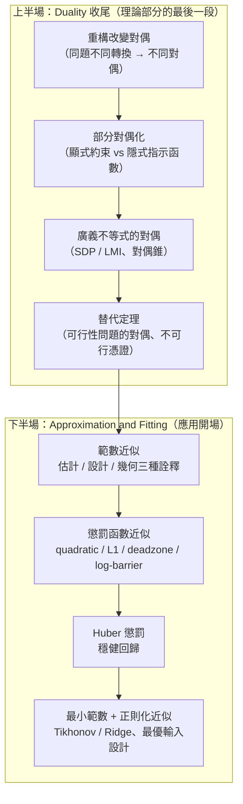

# 對偶理論收尾與近似擬合

對應逐字稿：`data/EE364A/transcripts/Stanford EE364A Convex Optimization I Stephen Boyd I 2023 I Lecture 9 [whE03c84ahA].en.txt`

本章已完整閱讀逐字稿，閱讀筆記見 [Lecture 9 閱讀筆記](notes/lecture-09-duality-wrapup-and-approximation.md)。

> 這一講是整門課的**分水嶺**。Boyd 用大約 20 分鐘把「理論部分」的最後幾個對偶主題收乾淨，然後宣布：課程第一部分（幾乎全是理論）到此結束，接下來三、四週全是**應用**。他半開玩笑地預告：「你會發現這些應用看起來慢慢都一樣——因為它們本來就一樣。」應用的第一站是**近似與擬合（approximation and fitting）**。本章因此分成兩半：上半收尾對偶，下半正式進入近似擬合。



---

## 上半場：對偶理論收尾

### 重構會改變對偶

上一講已經看到「一個問題可以先做等價轉換再取對偶」。數學背景的人會有股衝動，想在「原問題的對偶」與「轉換後問題的對偶」之間畫一條箭頭、宣稱它們相關。Boyd 的結論很反直覺：**通常沒有這種簡單關係**，而且極簡單的例子就會給出天差地遠的對偶。

**例一：無約束問題。** 考慮

$$
\text{minimize}\quad f_0(Ax),\qquad f_0\ \text{凸}.
$$

沒有約束，Lagrangian 就是目標本身，沒有對偶變數。對偶函數就是把目標極小化——結果正好是 $p^\star$。這是一個**精確、卻完全無用**的下界（Boyd：有個笑話的哏就是「答案精確無比，卻毫無用處，講的一定是數學家」）。

現在做一個看似無辜的轉換：給 $Ax$ 一個名字 $y$，

$$
\begin{aligned}
\text{minimize}\quad & f_0(y)\\
\text{subject to}\quad & y = Ax .
\end{aligned}
$$

這顯然等價，但取對偶後會用到 $f_0$ 的**共軛函數（conjugate）** $f_0^\star$，變成一個真正有內容的對偶。同一個問題，只因先引入等式約束，對偶就從「廢話」變「有用」。

**例二：範數近似。** $\min \|Ax-b\|$ 也是無約束（意義上）。引入 $y = Ax - b$，取對偶會冒出**對偶範數（dual norm）** 的指示函數。若改成極小化**範數平方**，又會得到完全不同的對偶。

> **模式辨識（pattern）。** Boyd 強調與其背表格，不如「預載」一些期待：
>
> | Primal 出現 | Dual 應預期 |
> |---|---|
> | 某函數 $f$ | 它的共軛 $f^\star$ |
> | 相對熵 / KL divergence | 指數、log-sum-exp |
> | 矩陣 $A$ | 伴隨 / 轉置 $A^\top$ |
> | $L_\infty$ 範數 | $L_1$ 範數（反之亦然） |
>
> 若算出來不符合這些模式，多半是哪裡算錯了，該回頭檢查。

### 部分對偶化（partial dualization）

有時你不想對「所有」約束取對偶。經典例子是 LP 裡的 **box 約束** $-\mathbf 1 \preceq x \preceq \mathbf 1$。做法是：**不對 box 取對偶**，改把它寫成指示函數塞進目標——顯式約束就變成隱式（目標在不可行時回傳 $+\infty$）。這與原問題顯然等價。

接著在 box 上極小化一個 affine 函數 $ (A^\top\nu + c)^\top x$ 是可以**解析**算的（這就是 Hölder 不等式 / Cauchy–Schwarz 的離散版）：分量為正取 $x_i=-1$、為負取 $x_i=+1$，最小值是

$$
-\sum_i \left| (A^\top\nu + c)_i \right| = -\|A^\top\nu + c\|_1 .
$$

於是又冒出 $L_1$——正好呼應「$L_\infty$ 約束（$\|x\|_\infty\le 1$）在對偶裡對應 $L_1$」的模式。這是個 $D$ 與 $\tilde D$（兩種對偶）**極為接近**的漂亮案例。

### 廣義不等式的對偶

當不等式約束是**向量或矩陣值**時（$f_i(x)\preceq_K 0$，例如某對稱矩陣半負定），整套機制「就是能用」。差別只在：

- Lagrangian 的乘子項改成**內積** $\langle \lambda_i, f_i(x)\rangle$；
- 乘子 $\lambda_i$ 必須落在**對偶錐（dual cone）** $K^\ast$ 裡（非負性推廣到錐）。

下界性質的證明也只多一步：純量情形用「非負數 × 非正數 ≤ 0」；這裡用「對偶錐中非負的向量，與錐中非正的向量做內積 $\le 0$」。

**半正定規劃（SDP）／線性矩陣不等式（LMI）範例：**

$$
\begin{aligned}
\text{minimize}\quad & c^\top x\\
\text{subject to}\quad & \sum_i x_i F_i + G \preceq 0 ,
\end{aligned}
$$

其中 $F_i, G$ 為對稱矩陣，$\preceq$ 是對**半正定錐**而言（這條約束稱 LMI）。此時乘子改用對稱矩陣 $Z$，內積讀作 $\operatorname{trace}\big(Z(\cdot)\big)$。Lagrangian 對 $x$ 是 affine，極小化時線性部分必須消失（否則 $-\infty$）：對每個 $x_i$，要求 $c_i + \operatorname{trace}(Z F_i)=0$。結果得到一個**對偶 SDP**。弱對偶完全直接；強對偶則不顯然。Boyd 感嘆：這些結果在二、三十年前根本無人知曉。

### 替代定理：可行性問題的對偶

最後一塊理論是**可行性問題的對偶**，正式名稱是**替代定理（theorems of the alternative）**。把可行性寫成一個優化問題：

$$
\begin{aligned}
\text{minimize}\quad & 0\\
\text{subject to}\quad & f_i(x)\le 0,\quad h_i(x)=0 .
\end{aligned}
$$

它的最優值只有兩種可能：可行時 $p^\star = 0$；不可行時 $p^\star = +\infty$（空集的下確界依定義為 $+\infty$）。

對它取對偶，會得到一個關鍵事實：**弱對偶永遠成立，無論凸或非凸**。這帶來一個很有力的推論——**不可行憑證（certificate of infeasibility）**：

> 即使「這組不等式是否可行」是 NP-hard，只要你在對偶端找到一點使對偶值 $d = 1$，因為 $d$ 是原問題最優值的下界，而原問題的值只能是 $0$ 或 $+\infty$，$1$ 就把它逼到只能是 $+\infty$——於是**證明了原問題不可行**。對偶上無界（$d^\star = +\infty$）同理給出不可行憑證。

之所以叫「替代」定理，是因為它們的形式都是：**一組不等式有解，若且唯若另一組不等式無解。** 線性情形的著名版本是 **Farkas 引理**（逐字稿 ASR 作 "farcus"）。

它的應用面很廣，其中之一是古典經濟學與金融的基石——**無套利（no arbitrage）**：若存在一種投資組合，在所有情境下都不虧、且某些情境會賺，就是套利；大量古典金融理論假設它不會發生（否則價格會被人套到消失）。Boyd 順口講了個「不錄用純經濟系背景」的玩笑，重點是這個「以無套利為根本信念」的結構，正是替代定理的用武之地。（本講作業的選擇權定價題其實暗用了它，屬於課程刻意設計的「隱形題」——用到對偶卻不點名 d-word。）

---

## 下半場：近似與擬合

課程第二部分開場。核心物件是一個矩陣 $A$ 與資料 $b$，要選 $x$ 讓 $Ax$ 盡量接近 $b$。

### 範數近似問題

$$
\text{minimize}\quad \|Ax - b\|\qquad(\text{任意範數})
$$

同一條式子有三種完全不同的**詮釋**，這是本節的關鍵：

| 詮釋 | $x$ 是什麼 | 範數表達什麼 | 典型例子 |
|---|---|---|---|
| 幾何 | 座標 | $Ax^\star$ 是 $\mathrm{range}(A)$ 中離 $b$ 最近的點 | 投影 |
| 估計（estimation） | 待估參數 | 測量誤差 $v=y-Ax$ 的**不合理程度** | 地球物理反演、感測 |
| 最優設計（design） | 設計變數 | miss 目標 $b$ 有多惱人 | 衛星推進器序列 |

**估計詮釋**特別重要。線性測量模型寫成 $y = Ax + v$。$A$ 常稱 **model** 或 **forward model**（通常來自物理：若源在某處、依某模型擴散，各處會測到這些濃度）。殘差 $v = y - Ax$ 有個漂亮名字 **physics residual**。Boyd 的提醒：如果**不**對 $v$ 加任何約束，任何 $x$ 都「合法」——你甚至能宣稱源全為零、其餘全推給「測量誤差」。所以你需要一個 $v$ 的**合理性度量**，而這裡就用範數：不同範數（$L_1$、$L_2$…）代表你對誤差合理性的不同假設。

**具名特例：**

| 範數 | 名稱 | 求解 |
|---|---|---|
| $L_2$ | 最小平方（least squares） | 平方後可微 → normal equations，解析解 |
| $L_\infty$ | Chebyshev 近似 | 可轉線性規劃（LP） |
| $L_1$ | 絕對殘差和 | 可轉線性規劃（LP） |

Boyd 強調：在 CVXPY 裡你根本不必知道「怎麼轉 LP」——直接寫

```python
prob = Problem(Minimize(norm(A @ x - b, 1)))
prob.solve()
```

一行構造、一行求解。

### 懲罰函數近似

把範數換成**可分（separable）** 的懲罰函數之和：

$$
\text{minimize}\quad \sum_i \phi(r_i),\qquad r = Ax - b .
$$

Boyd 的「擬人化（anthropomorphize）」讀法非常好用：$\phi(u)$ 就是「殘差大小為 $u$ 時你有多惱火」。不同的 $\phi$ 表達不同的態度：

| 懲罰函數 | 形狀 | 態度／效果 |
|---|---|---|
| quadratic $u^2$ | 拋物線 | 最小平方；殘差變小後「淡定」（小的平方更小） |
| 絕對值 $\lvert u\rvert$（$L_1$） | V 形，**尖點** | 解**稀疏**（很多分量恰為 0） |
| deadzone-linear | 帶內為 0、帶外線性 | 帶內完全不在乎（如量化 / 感測器解析度以下） |
| log barrier | 小殘差近似平方、$\lvert u\rvert<a$ 外 $+\infty$ | 像「上了夾具的最小平方」，強制殘差落在帶內 |
| 非對稱（asymmetric） | 正負斜率不同 | 偏好低估或高估 → **quantile 估計** |

觀察 $\phi$ 要看**兩端**：

- **近零（near zero）**：若有**尖點**（如 $L_1$），降低殘差的**邊際收益直到 0 都不衰減**，於是最優解偏好把許多殘差壓成**恰好 0**（稀疏）。這正是 compressed sensing 那套複雜理論的樸素直覺解釋。相對地，平方在小殘差處「很 chill」，deadzone 在帶內乾脆完全不在乎。
- **遠端（large）**：若成長是**線性**（而非平方），代表你對「少數大殘差」比較淡定——這正是**穩健估計（robust estimator）** 的來源。

Boyd 用 100×30 的隨機矩陣示範：同一組資料換不同懲罰，殘差直方圖形狀完全不同（$L_1$ 出現大量零殘差、deadzone 把殘差堆在帶邊界、log barrier 把殘差全夾進 $\pm 1$）。

### Huber 懲罰：穩健回歸

Boyd 把它列進「本課該帶走的 top 10」。Huber 懲罰在閾值 $M$ 內是**平方**、超過後轉為**線性**（linear tails）：

$$
\phi_{\text{hub}}(u)=
\begin{cases}
u^2, & |u|\le M,\\[2pt]
M(2|u| - M), & |u| > M .
\end{cases}
$$

擬人化：「我想做最小平方，但**萬一非得有大殘差，我比最小平方淡定得多**。」線性尾巴讓它成為統計上的**穩健（robust）估計**。

> **機械彈簧詮釋。** 把懲罰想成彈簧的勢能。平方 = 虎克彈簧（勢能 ∝ 位移平方）。最小平方擬合裡，兩個離群點像兩個被大幅拉伸的彈簧，施加巨大**力矩**，把回歸線「torque（扭）」歪。Huber 的彈簧超過閾值後勢能線性成長 = **定力（constant force）**，不會對離群點無限加力，因此擬合線紋風不動。它能**輾過** 20–30% 的離群點。命名自統計學家 **Peter Huber**（他是從「未知分布下的第一原理」推導出來的；我們的業餘詮釋只是「小殘差配平方、大殘差配線性」）。

Boyd 補一句實務結論：**大部分擬合資料的場合，其實都該用 Huber 而非最小平方。** 而且這些懲罰可以自由加凸約束——例如 **Huber 單調回歸**（Huber + $x_1\le x_2\le\cdots$）仍是個 QP，「我們有 50 種解法，每種都比你那個花俏演算法好」。

### 最小範數與正則化近似

**最小範數問題：**

$$
\text{minimize}\ \|x\|\quad\text{s.t.}\ Ax = b .
$$

它是解集 $\{x: Ax=b\}$ 在原點的投影（想投到別的目標就改成 $\|x - x_{\text{des}}\|$）。估計詮釋：測量很準但**不夠多**（晶片上少數溫度感測器，想推估沒量到的點）。設計詮釋：硬約束下取最小範數，經典例子是**最小燃料**機動。也可用絕對值和（燃料用量的初階模型）或一般的最小懲罰。

**正則化近似（regularized approximation）** 是一個雙目標（bi-criterion）問題：同時想 $\|Ax-b\|$ 小、也想 $\|x\|$ 小。透過 scalarization 合成單目標：

$$
\text{minimize}\quad \|Ax-b\| + \gamma\,\|x\| .
$$

實務最常用平方形式，即 **Tikhonov 正則化 / Ridge regression**：

$$
\text{minimize}\quad \|Ax-b\|_2^2 + \delta\,\|x\|_2^2 ,
$$

有立即的解析解。**為什麼要 $x$ 小？** 兩個理由：

1. **先驗**：你相信 $x$ 本來就小。
2. **對 $A$ 的不確定性穩健**：$Ax$ 裡 $x$ 乘著 $A$；若 $A$ 會抖動而你不確定它，$x$ 越小、$A$ 的變動對 $Ax$ 的影響越小（$x=0$ 完全免疫）。Boyd 反覆強調「別想得太深奧，就是這麼樸素」。

**權重（$\gamma$、$\delta$）怎麼選？** Boyd 現場點名：正解是**交叉驗證（cross-validation）／樣本外驗證**；長篇大論高斯漸近理論是「錯的答案」（雖然有趣）。很多領域（影像處理、控制）根本就是**轉旋鈕轉到滿意**——即 hyperparameter tweaking。

### 收尾範例：最優輸入設計

一個貫穿控制、金融等 50 個領域的模板。系統是卷積 $y = h * u$（線性動態系統，$h$ 是卷積核 / 脈衝響應）。三個目標：

$$
\underbrace{\|y - y_{\text{des}}\|}_{\text{tracking error}},\qquad
\underbrace{\|u\|_2^2}_{\text{輸入大小}},\qquad
\underbrace{\textstyle\sum (u_{k+1}-u_k)^2}_{\text{平滑度 / wiggliness}} .
$$

合成為正則化最小平方，權重 $\delta$、$\eta$ 決定「輸入小」與「不要太抖」相對於追蹤誤差的重視程度。示範中：把 $\eta$ 調大 → 輸入變小但追蹤變差；再把平滑權重調大 → 輸入變平滑。實務上就是在三者間來回退讓，「直到你不是滿意、就是煩了為止」。同一個問題在金融裡就是「追蹤債券組合 ± 30 個基點」，而 wiggliness 換成 turnover（交易量）。

---

## 本章小結

- 這一講先收尾對偶理論，再開啟課程第二部分「近似與擬合」（應用）。
- **重構會改變對偶**：同題不同等價轉換，對偶可從「精確但無用」變「有內容」；記住模式——函數 → 共軛，$A$ → $A^\top$，$L_\infty$ → $L_1$，相對熵 → log-sum-exp。
- **部分對偶化**：可只對部分約束取對偶，把其餘寫成隱式指示函數；box 約束的例子自然導出 $L_1$。
- **廣義不等式的對偶**：乘子改成對偶錐中的向量／矩陣、乘子項改成內積；SDP／LMI 有對應的對偶 SDP，弱對偶顯然、強對偶不顯然。
- **替代定理**＝可行性問題的對偶：弱對偶恆成立（含非凸），提供**不可行憑證**；線性情形即 Farkas 引理，是無套利理論的基礎。
- **範數近似** $\min\|Ax-b\|$ 有幾何 / 估計 / 設計三種詮釋；$L_2$=最小平方、$L_\infty$=Chebyshev、$L_1$=絕對殘差和，後兩者可轉 LP。
- **懲罰函數**擬人化為「殘差多惱人」：尖點（$L_1$）→ 稀疏解；線性尾巴 → 穩健。
- **Huber 懲罰**（平方頭 + 線性尾）是穩健回歸的核心，用彈簧「定力」詮釋能輾過離群點。
- **正則化近似 / Ridge**：要 $x$ 小可源於先驗，或為了對 $A$ 抖動穩健；權重靠交叉驗證選；最優輸入設計是跨領域模板。

## 相關教材與材料

此段只建立關聯，不提供作業解答。若材料尚未核對或資訊不足，保留 `補充`。

- 對應 slides：`data/EE364A/course material/slids/05_Duality.pdf`（上半場的重構對偶、廣義不等式對偶、替代定理）與 `data/EE364A/course material/slids/06_Approximation and fitting.pdf`（下半場的範數近似、懲罰函數、Huber、正則化）。狀態：待核對與逐字稿逐頁對應。
- 對應教科書：《Convex Optimization》（Boyd & Vandenberghe）第 5 章 Duality（廣義不等式、theorems of alternatives 各節）與第 6 章 Approximation and fitting。狀態：待核對章節與頁碼（`補充`）。
- 行政資訊（作業、考試）屬其他學期版本，集中於附錄，不與 2023 逐字稿混寫。逐字稿提到本講作業含選擇權定價（暗用替代定理）；具體題號與版本 `補充`。
- 項：QP 的不同對偶被稱 "Clark / Frank" 對偶（ASR 轉錄），人名與拼寫****，未作事實斷言，待核對。
