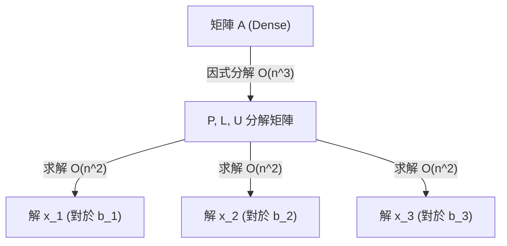

# 第十二講：幾何問題與數值線性代數基礎

## 導讀

本講主要分為兩個部分。前半部是幾何問題的延伸與收尾，涵蓋了如何定義多面體的「分析中心 (Analytic Center)」、資料分類中的「線性判別 (Linear Discrimination)」與其背後的機器學習淵源（如 SVM），以及常見於電路設計中的「佈局與設施選址 (Placement and Facility Location)」。後半部則正式進入課程的下一個階段：求解演算法的基礎。我們將探討數值線性代數的基本概念，了解運算複雜度 (Flop count)、結構化矩陣的特性，以及為何在實務上「矩陣因式分解搭配快取 (Factorization caching)」能帶來驚人的計算效率。

## 幾何問題的延伸

### 分析中心 (Analytic Center)

在討論一組不等式 $f_i(x) \le 0$（例如多面體的描述）時，我們常希望能找到該集合的「中心」。嚴格來說，分析中心並非集合本身的幾何中心，而是該**不等式描述**的中心。

- **邊界 (Margin)**：對於不等式 $f_i(x) \le 0$，其餘裕或邊界可定義為 $-f_i(x) > 0$。
- **分析中心的定義**：分析中心是最大化這些邊界乘積的點，等價於最小化負對數邊界的總和：
  $$ \min \sum_{i=1}^m -\log(-f_i(x)) $$
  目標函數 $-\sum \log(-f_i(x))$ 稱為**對數障礙函數 (Log barrier)**。當點靠近不等式邊界時，該函數值會趨向無限大，宛如一道物理上的位能屏障。

**幾何近似性質**：
如果在分析中心處計算該對數障礙函數的 Hessian 矩陣，並以此定義一個橢球（右側為 1），該橢球保證會包含於原不等式系統定義的集合內。若將此橢球放大 $m$ 倍（$m$ 為不等式數量），則能完全覆蓋該集合。這提供了一個多面體內外橢球近似的方法，雖然其逼近品質與維度 $m$ 相關，但在後續的內點法演算法中扮演了關鍵角色。

### 線性與非線性判別 (Linear and Nonlinear Discrimination)

給定兩組點 $x_1, \dots, x_N$ 與 $y_1, \dots, y_M$，線性判別的目標是尋找一個超平面 $a^T x + b = 0$，將這兩組點完全分開。

**嚴格不等式與同質性縮放**：
直覺上，我們希望 $a^T x_i + b > 0$ 且 $a^T y_i + b < 0$。但在凸優化中，處理嚴格不等式（Strict inequalities）可能導致只有 $a=0, b=0$ 這種無意義的平凡解。
由於這些不等式在 $a$ 與 $b$ 上是同質的 (Homogeneous) —— 同乘一個常數其正負號不變，因此我們可以不失一般性地將嚴格不等式縮放，替換為：
$$ a^T x_i + b \ge 1 \quad \forall i $$
$$ a^T y_i + b \le -1 \quad \forall i $$
這將問題轉化為一個簡單的線性規劃 (LP) 可行性問題。

**最大化邊界 (Maximum Margin) 與對偶解釋**：
若兩組點可分離，我們通常希望尋找「最寬」的隔離帶。這可表示為最小化 $\|a\|_2$，也就是二次規劃 (QP)。
有趣的是，這個問題的拉格朗日對偶問題 (Lagrange Dual) 有著極為直觀的幾何意義：
對偶問題等價於分別在 $x$ 的凸包 (Convex hull) 與 $y$ 的凸包中各找出一點，使得這兩點之間的距離最短。這展現了幾何對偶性的優雅。

**凸替代函數與 SVM 雛形**：
當兩組點無法完美線性分離時，直覺的做法是「最小化誤判的點數」。但這會產生一個非凸的階躍函數。
實務上的解法是引入**鬆弛變數 (Slack variables)** $u_i \ge 0, v_i \ge 0$，將限制條件放寬為 $a^T x_i + b \ge 1 - u_i$。我們轉而最小化這些鬆弛變數的總和。這種將非凸目標替換為凸目標的手法稱為**凸替代 (Convex Surrogate)**，正是機器學習中支援向量機 (Support Vector Machine, SVM) 的核心思想。

### 佈局與設施選址 (Placement and Facility Location)

佈局問題常見於電路設計。我們有許多單元（如邏輯閘），有些位置已固定（如外部引腳），其餘的為變數。目標是決定變數的位置，使得相連單元之間的距離成本最小化。

對於相連的節點 $i, j$，我們可以定義不同的距離懲罰函數 $h(\|x_i - x_j\|)$：
1. **線性懲罰 ($L_2$ 或 $L_1$)**：對長距離的容忍度較高，點可能會比較分散。
2. **平方懲罰 ($L_2^2$)**：強烈懲罰遠距離，會將相連的節點緊緊拉在一起。
3. **Dead-zone Linear**：當距離在特定閾值 $D$ 內時成本為 0，超過才開始線性懲罰。這種函數會導致大量相鄰節點的距離精準停留在 $D$，在實務上可用來作為避免單元重疊的啟發式 (Heuristic) 凸解法。

## 數值線性代數基礎

課程的下一個階段是探討求解演算法，而所有凸優化求解器最底層的引擎都是數值線性代數（解 $Ax = b$）。

### 浮點運算與 BLAS 等級

為了估算計算時間，我們常以**浮點運算次數 (Flops)** 為單位。
- **BLAS Level 1 (向量-向量運算)**：如內積，複雜度為 $O(n)$。
- **BLAS Level 2 (矩陣-向量運算)**：如 $Ax$，複雜度為 $O(n^2)$。
- **BLAS Level 3 (矩陣-矩陣運算)**：如 $AB$，標準複雜度為 $O(n^3)$。

雖然理論計算機科學界有 $O(n^{2.3})$ 的矩陣乘法演算法，但實務上完全不適用。目前電腦（特別是 GPU 與多核心 CPU）能極速完成 $n^3$ 的矩陣乘法，主要是依賴底層硬體的**快取優化 (Cache optimization)**，將大矩陣切分為可放入 L1/L2 快取的小方塊（例如 16x16）。

### 結構化矩陣

若矩陣 $A$ 具有特殊結構，求解 $Ax=b$ 的複雜度會大幅下降：
- **對角矩陣 (Diagonal)**：$O(n)$。
- **三角矩陣 (Triangular)**：利用前向或後向替換 (Forward/backward substitution)，複雜度為 $O(n^2)$。
- **正交矩陣 (Orthogonal)**：$A^{-1} = A^T$，計算 $A^T b$ 為 $O(n^2)$。
- **排列矩陣 (Permutation)**：$0$ Flops，僅需搬移記憶體。
- **稀疏矩陣 (Sparse)**：複雜度取決於非零元素的數量。

### 矩陣因式分解與快取 (Factorization Caching)

實務上解 $Ax=b$ 的標準流程分為兩步：
1. **因式分解 (Factorization)**：如 LU 分解，將 $A$ 拆解為易於求解的矩陣乘積（如排列矩陣、下三角、上三角）。這一步最耗時，通常為 $O(n^3)$。
2. **依序求解 (Sequence of Solves)**：利用分解後的結構，依序求解多個方程組。這一步僅需 $O(n^2)$。

**這個流程有一個極為強大的優勢：Factorization Caching。**
若我們需要解 10 個擁有「相同係數矩陣 $A$ 但不同常數項 $b$」的方程組，天真的做法需花費 $10 \times O(n^3)$ 的時間。但若使用快取，我們只需做一次分解 $O(n^3)$，接著執行 10 次 $O(n^2)$ 的求解。當 $n$ 極大（如 5000）時，後續的求解時間（微秒級）相比於第一次的分解時間（秒級）幾乎可以忽略不計！這是凸優化求解器能高效運行的秘密之一。

## 常見誤解

1. **真的去計算反矩陣 $A^{-1}$**：在解線性方程組時，實務上絕對不會（也不應該）明確去計算反矩陣，而是使用矩陣分解法（如 LU, Cholesky）來解方程式。
2. **嚴格不等式可以直接丟給求解器**：求解器通常無法處理嚴格不等式（如 $<0$）。遇到時應透過物理意義，利用同質性縮放轉換為 $\le -1$ 或是 $\le 0$。

## 小結

本講我們見證了幾何問題的廣泛應用，從找出分析中心、機器學習分類器到電路佈局。同時，我們也向下探勘了求解器的底層基礎——數值線性代數。理解複雜度與結構化矩陣的運作，將幫助我們在未來的章節中，清楚明白為什麼某些演算法能在現代電腦上如魔法般飛速運行。
