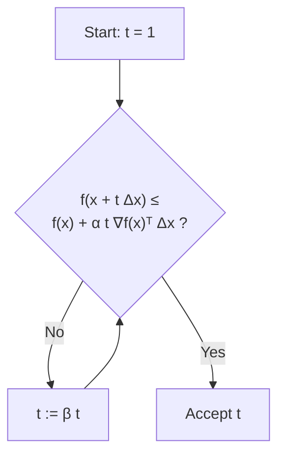

# 第 13 講：數值線性代數與無約束最小化 (Numerical Linear Algebra and Unconstrained Minimization)

## 導讀

本講是求解器的基礎。在設計和實作凸優化求解器時，最底層的核心運算是求解線性方程組 $Ax=b$。理解數值線性代數（特別是稀疏矩陣與特殊結構矩陣的分解）能幫助我們判斷哪些問題在實務上可以被極快地求解。接著，課程進入無約束最小化（unconstrained minimization）的主題，介紹了迭代下降法與線搜尋技術，並分析了梯度下降法（Gradient Descent Method）在面對條件數不佳的問題時為何會遇到嚴重的 zigzagging 現象。

## 數值線性代數基礎

### 直接法：分解與求解 (Factor and Solve)

在數值計算中，極少真正計算矩陣的反矩陣 $A^{-1}$。求解 $Ax=b$ 的標準做法是「直接法」（Direct Methods），分為兩個步驟：

1. **Factor（分解）**：將矩陣 $A$ 分解為幾個容易求解的矩陣乘積（例如下三角矩陣與上三角矩陣）。此步驟通常耗時 $O(n^3)$。
2. **Solve（求解）**：利用分解後的矩陣進行前向與後向代入（forward and backward substitution）求出 $x$。此步驟只需 $O(n^2)$。

這個兩階段架構有一個驚人的優勢：如果你需要求解多個具有**相同係數矩陣 $A$ 但不同右式 $b$** 的方程組，你只需要做一次分解，並將其快取（cache）起來，接下來的每次求解都只需極快的 $O(n^2)$ 操作。

### 稀疏矩陣與分解

實務上的矩陣往往非常巨大且稀疏（例如具有一百萬個變數，但每行只有 10 個非零元素）。

- **LU 分解**：$A = P_1 L U P_2$。排列矩陣 $P_1, P_2$ 的選擇至關重要。好的排列可以保持 $L$ 和 $U$ 的稀疏性；不好的排列會導致「填充（fill-in）」，使分解出的矩陣變得稠密，耗盡記憶體。
- **帶狀矩陣（Banded Matrices）**：如果矩陣的非零元素集中在對角線附近（帶寬為 $K$），其 LU 分解的複雜度會降至 $O(n K^2)$，求解複雜度為 $O(n K)$。這表示大規模的控制系統問題（這類問題通常產生帶狀矩陣）能在極短時間內被求解。
- **Cholesky 分解**：針對正定矩陣的分解 $A = L L^T$。透過對稱排列 $P A P^T = L L^T$，好的排列同樣能帶來極度稀疏的分解。

### 舒爾補與區塊消去法 (Schur Complement & Block Elimination)

將線性系統切分為區塊：

$$
\begin{bmatrix}
A_{11} & A_{12} \\
A_{21} & A_{22}
\end{bmatrix}
\begin{bmatrix}
x_1 \\
x_2
\end{bmatrix}
=
\begin{bmatrix}
b_1 \\
b_2
\end{bmatrix}
$$

若 $A_{11}$ 非常容易求逆（例如為對角矩陣），我們可以用**區塊消去法**，將 $x_1$ 表達為 $x_2$ 的函數代入第二式，從而得到**舒爾補系統**（Schur Complement System）：

$$ (A_{22} - A_{21}A_{11}^{-1}A_{12})x_2 = b_2 - A_{21}A_{11}^{-1}b_1 $$

當矩陣具有特殊結構（如 block arrow matrix）時，利用區塊消去法能將原本看似 $O(n^3)$ 的問題降至 $O(n)$ 線性時間。

### 矩陣反演引理 (Matrix Inversion Lemma)

又稱 Sherman-Morrison-Woodbury 公式。當你要解的矩陣結構是「對角矩陣 + 低秩矩陣（diagonal + low rank）」即 $(A + BC)x = b$ 時，更聰明的做法是「反向消去（un-elimination）」：

引入新變數 $y = Cx$，將系統擴展為：

$$
\begin{bmatrix}
A & B \\
C & -I
\end{bmatrix}
\begin{bmatrix}
x \\
y
\end{bmatrix}
=
\begin{bmatrix}
b \\
0
\end{bmatrix}
$$

此時，由於 $A$ 是對角矩陣極易消去，我們透過區塊消去法消去 $x$，反而得到一個針對小維度 $y$ 的方程組。這個技巧廣泛應用於量化金融中的因子模型（Factor models）與訊號處理中。

## 無約束最小化 (Unconstrained Minimization)

接下來我們探討如何最小化無約束的平滑凸函數 $\min f(x)$。
除非具有特殊解析解，否則一般採用**迭代法**：

$$ x^{(k+1)} = x^{(k)} + t \Delta x $$

其中 $\Delta x$ 是搜尋方向（Search Direction），$t > 0$ 是步長（Step Size）。若 $\nabla f(x)^T \Delta x < 0$，則該方向為下降方向。

### 強凸性與停止準則

通常我們會持續迭代直到梯度夠小（$\|\nabla f(x)\|_2 \le \epsilon$）。為何這是一個合理的停止準則？
如果函數具有**強凸性（Strong Convexity / Minimum Curvature）**，即 $\nabla^2 f(x) \succeq mI$（對於某個常數 $m > 0$），那麼我們可以推導出一個強化的不等式，進一步保證次優性（suboptimality）的上限：

$$ f(x) - p^* \le \frac{1}{2m} \|\nabla f(x)\|_2^2 $$

這表示只要梯度夠小，我們就能確定當前函數值離最佳值 $p^*$ 非常近。

### 線搜尋技術 (Line Search)

決定方向後，如何決定步長 $t$？

1. **精確線搜尋（Exact Line Search）**：沿著射線找到使函數值最小的 $t$。在某些二次函數上可解析求得，但通常計算昂貴且實務上未必更好。
2. **回溯線搜尋（Backtracking Line Search）**：這是一個極為實用且簡單的啟發式方法。給定參數 $\alpha \in (0, 0.5)$ 與 $\beta \in (0, 1)$：
   - 初始 $t=1$。
   - 檢查是否滿足充分下降條件：$f(x + t \Delta x) \le f(x) + \alpha t \nabla f(x)^T \Delta x$
   - 如果不滿足，令 $t := \beta t$，重複檢查。

### 梯度下降法 (Gradient Descent Method)

最直覺的下降方向是**負梯度方向** $\Delta x = -\nabla f(x)$，因為它指向函數值下降最快的方向。

然而，梯度下降法有一個致命缺點。對於條件數差（poorly conditioned）的問題，即其 level sets（等高線）呈現狹長橢圓時，梯度方向（垂直於等高線）並不會直接指向全局最小值。這會導致演算法在峽谷中來回震盪，產生所謂的 **Zigzagging（或稱 Moratto effect）** 現象。

如果 level sets 是正圓形的，梯度下降法搭配精確線搜尋可以在一步之內找到最小值；但若極度扁平，收斂速度會呈現極為緩慢的線性收斂（linear convergence，在半對數圖表上呈現直線下降）。

## 小結

- 數值線性代數是優化求解器的底層引擎。理解矩陣結構（稀疏、帶狀、區塊對角）並正確利用矩陣分解（及 Un-elimination 技巧），是讓演算法在實務上跑得快的關鍵。
- 梯度下降法雖然直觀，但在面對條件數不佳的問題時效率低落。
- 回溯線搜尋是一個簡單卻極為有效的步長選擇策略。

## 常見誤解

- **誤解**：精確線搜尋（Exact Line Search）總是比回溯線搜尋好。
  **釐清**：在實務上，花費大量計算力在單一步驟中尋找精確最小值往往不划算，甚至可能導致更差的整體收斂路徑。簡單的回溯線搜尋通常表現更好。
- **誤解**：消去變數（Elimination）總是讓問題變簡單。
  **釐清**：在具有對角加低秩結構的系統中，反向引入新變數並擴大方程組（Un-elimination），反而能創造出可用區塊消去法極速求解的結構。
