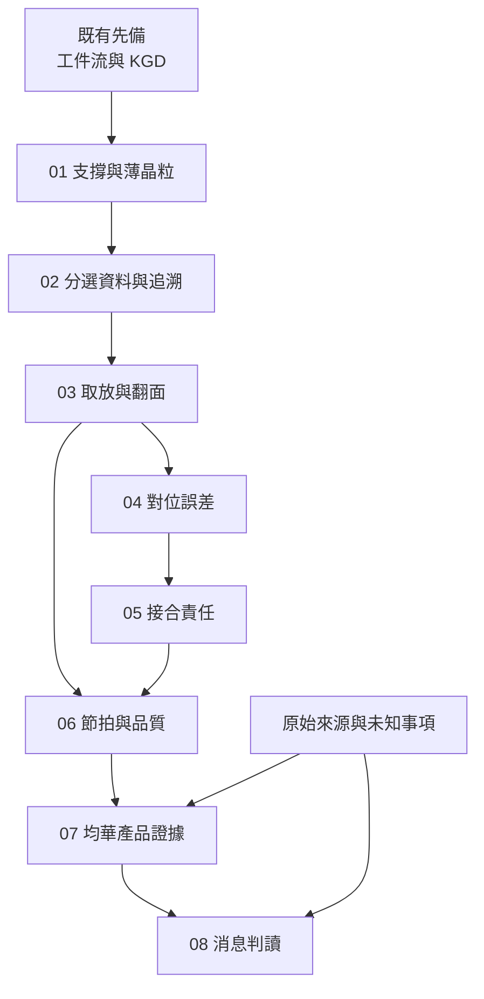

# 全書地圖：從工件狀態到供應證據

本書不是把所有先進封裝術語重寫一次，而是沿「一顆晶粒被正確交出去」的主線補上工程與證據判斷。

## 概念依賴

**圖 M-1｜依賴關係。** 公司資料可以先讀，但判斷規格是否有意義，需要回到前面對應的工件、量測與控制條件。

| 章節 | 新增問題 | 接收的先備 | 交給下一章 |
|---|---|---|---|
| [01](01-die-handling.md) | 晶粒離開膠膜時的支撐如何改變？ | 晶圓／晶粒形態 | 完整晶粒與材料條件 |
| [02](02-sorter-traceability.md) | 如何挑對晶粒並追到目的格位？ | 01、電測與 KGD 的限制 | 晶粒身分、bin 與來源 |
| [03](03-pick-place-flip.md) | 工具交接與翻面如何改變姿態？ | 01–02 | 可量測的姿態與交接履歷 |
| [04](04-alignment-error-budget.md) | 哪種精度能代表實際放置？ | 03 的基準轉換 | 位置量測與誤差預算 |
| [05](05-bonder-process-boundaries.md) | 位置合格後，接合還缺什麼？ | 04、接合背景 | 材料／設備／製程責任 |
| [06](06-throughput-quality.md) | 多頭與並行如何變成良品產出？ | 03–05 | 節拍、瓶頸與品質基準 |
| [07](07-gmm-product-evidence.md) | 均華公開機型能對上哪些問題？ | 01–06、原始公司來源 | 型號證據與缺口 |
| [08](08-reading-news.md) | 怎樣寫不跨越證據的結論？ | 07 | 事實／推論／未知分析卡 |

## 跨書只補先備

| 遇到的問題 | 既有章節 | 回到本書哪裡 |
|---|---|---|
| 晶圓、晶粒、載具如何不同？ | <a href="../../gpm/html/04-workpiece-flow.html">工件流</a> | 01 的支撐轉換 |
| KGD 為何不等於保證零缺陷？ | <a href="../../cowos/html/13-test-and-kgd.html">測試與 KGD</a> | 02 的分類資料 |
| 做 HBM 與把 HBM 裝進系統有何不同？ | <a href="../../gpm/html/08-hbm.html">HBM</a> | 05／07 的加工對象與證據 |
| 混合鍵合為何對表面要求高？ | <a href="../../gpm/html/09-soic-hybrid-bonding.html">SoIC 與混合鍵合</a> | 05 的責任邊界 |
| 回流與 ACF 的基本原理？ | <a href="../../smt-bonding/html/index.html">電子接合導讀</a> | 05，但不移植板級條件 |

## 讀完的自我檢核

看到任一設備消息，試著填完：**誰的哪個型號，處理哪個工件，在哪個站點，以什麼條件達到什麼結果，商業證據到哪個階段？** 填不出來的部分就是[待查事項](appendix-open-questions.md)，不是應該用常識補完的空格。
