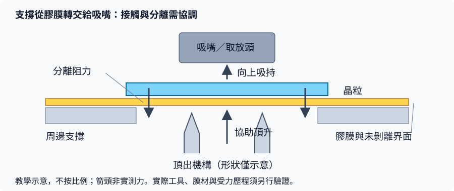

# 01　薄晶粒為什麼難拿？

## 1. 開場問題：同一個吸嘴，為什麼換薄晶粒就開始破？

切割後的晶粒不是散放在桌上的小石塊。它通常仍貼在膠膜上，背面可能有黏著材料，上表面可能有不能刮傷的結構。設備要把它取走，先得改變原本的支撐關係。

本章新增的問題是：**晶粒從膠膜轉交給吸嘴時，哪裡承受彎曲、局部接觸與剝離？** 若不熟悉工件形態，先看<a href="../../gpm/html/04-workpiece-flow.html">工件流</a>；此處不重寫薄化或切割製程。

## 2. 先看結構：不是單純把吸力開大

<figure class="external-image">
  
  <figcaption><strong>圖 1-2｜先看實物：膠膜讓切割後的晶粒留在原位。</strong> 留意格網中的空位，再對照下方圖 1-1 的支撐轉換；照片無法判定晶粒厚度、膠膜配方或頂出方式，亦非均華設備或客戶實績。 來源：<a href="https://commons.wikimedia.org/wiki/File:A_semiconductor_wafer_on_a_dicing_(blue)_tape._Few_chips_(dies)_from_the_wafer_have_already_been_picked_up_(removed)_for_further_manufacturing.png">Khpsoi／Wikimedia Commons</a>，<a href="https://creativecommons.org/licenses/by-sa/4.0/">CC BY-SA 4.0</a>；未修改原圖。</figcaption>
</figure>

| 部位 | 原本的作用 | 取走時會改變什麼 |
|---|---|---|
| 晶粒（die） | 含電路的脆性工件 | 支撐由大面積膠膜變成工具接觸；表面與邊緣都可能受損 |
| 膠膜（dicing tape） | 切割及搬運時保持晶粒位置 | 黏著界面需受控剝離，不能當作無阻力平面 |
| 頂出機構（ejector） | 從下方協助分離 | 透過膠膜提供局部支撐或頂升；不只一種針形設計 |
| 吸嘴／取放頭（collet） | 建立吸持並移動晶粒 | 接觸區、密封、真空與運動需要協調 |
| 框架與支撐台 | 固定膠膜與取料區 | 張力、平整度及局部支撐影響分離路徑 |

**圖 1-1｜本書自繪的支撐轉換示意。** 僅表示常見頂出式取料的相對關係，不按比例；箭頭是作用方向，不是可加總的實測力，也不代表均華機構。真實膠膜、工具與多層晶粒的變形更複雜。

用薄板的直覺理解：在材料、跨度與邊界條件相近時，變薄會降低抗彎剛性，因此局部頂升較容易造成撓曲；**這不是「厚度低於某數字就一定破」**。實際破損還受切割傷、微裂紋、工具位置與受力歷程影響。

吸持能力也不是泵浦真空設定值本身。粗略力學模型是 `吸持力約為壓差 × 有效密封面積`，但漏氣、孔位、表面形狀及動態流量都會改變有效值。真空讀值正常不能保證接觸面沒有粒子或晶粒未受損。

## 3. 輸入／操作／輸出：把「拿起來」拆成支撐交接

以下為工程教學流程，不是實機操作配方。膠膜是否需 UV 處理、加熱或預剝離，應由材料相容性與設備規格決定，不能自行套用。

| 輸入 | 操作 | 輸出／目的 |
|---|---|---|
| 晶圓框、晶粒位置與材料履歷 | 核對晶圓 ID、方向、膠膜及配方 | 知道取的是哪顆、允許用什麼條件 |
| 仍受膠膜支撐的晶粒 | 工具靠近並建立受控吸持 | 上方工具準備承接，不先猛拉 |
| 吸持中的晶粒與膠膜 | 頂出／剝離機構與取放頭協調 | 減少未分離面積並避免過度彎曲 |
| 已分離晶粒 | 確認取料成功，再抬升與移動 | 工件改由取放頭承載 |
| 空出的原位置 | 記錄消耗及異常 | 避免漏取、重複取或遺失晶粒身分 |

取料成功至少有兩個條件：**物理上取得完整晶粒，資料上確認取得正確晶粒**。後者在[第 2 章](02-sorter-traceability.md)展開。

## 4. 失敗會長什麼樣子？

| 缺陷／現象 | 可能形成路徑 | 不能直接下的結論 |
|---|---|---|
| 吸不起來或掉片 | 剝離阻力、密封不良、動態吸持不足 | 只要加大吸力就能解決 |
| 晶粒破裂或崩邊 | 原有切割傷加上彎曲、偏心頂升、工具碰撞 | 所有裂紋都由取放站新造成 |
| 表面壓痕或刮傷 | 接觸區不相容、工具粒子、相對滑動 | 顯微外觀合格就電性可靠 |
| 背面殘留或污染 | 膠材轉移、工具接觸、環境粒子 | 下一站一定能把污染清掉 |
| 明明取起卻沒有輸出 | 中途掉落、交接失敗或記錄不同步 | 單看起始真空就能追到成品 |

## 5. 如何檢查與控制：找出缺陷出現在哪一段

比較「取料前、剝離後、交接後」的同一顆或可追溯樣本，才有機會辨別原有缺陷與新增缺陷。記錄厚度、翹曲、膠膜批次、工具 ID、頂出行程、吸持曲線、重試次數與缺陷位置；本書沒有足夠證據提供通用門檻。

驗證不要只挑平整、好拿的樣品。合理的試驗應涵蓋來料變異與工具使用前後，並同時看取料成功率、破損率、污染及後續良率。只優化「有沒有吸起來」，可能把損失轉移到下一站。

若發現異常，依工廠程序暫停受影響流程、隔離工件並保留紀錄；不要讓重試把「疑似已拿走」的晶粒再次當作可取料。

## 6. 與均華的連結

| 已確認事實 | 合理推論 | 尚待查證 |
|---|---|---|
| KS-962JL 官網列 pre-peeling、heating ejector 可選（G7） | 分離與頂出條件是研究其取料能力的合理問題 | 可適用膠膜、厚度、溫度、破片率與實測窗口 |
| KS-856／852 列 0.5–50 mm 晶粒尺寸字面範圍及厚度量測選配（G4） | 尺寸與厚度是不同驗收軸 | 範圍的尺寸定義、最薄晶粒、所有選配是否可同時使用 |

**公開尺寸範圍不等於所有厚度、材料與速度組合都能處理。** 本章的受力模型不是均華公開性能。

## 7. 理解檢查

??? question "吸取失敗，為什麼不應先把真空開到最大？"
    失敗可能來自剝離、密封或支撐；加大壓差不一定改善，還可能增加局部接觸負擔。先辨識失敗時點與材料、工具條件。

??? question "取料後有裂紋，怎樣分辨是原有切割傷還是新造成？"
    對同一晶粒建立取料前後可比較影像與位置履歷；若取料前的檢測能力看不見微裂紋，也要保留這個盲點。

??? question "產品頁寫晶粒尺寸範圍，能否直接推論能拿任意薄的晶粒？"
    不能。平面尺寸、厚度、材料、支撐及製程條件各自獨立，需要組合驗證。

## 8. 來源與待查

[G4、G7](appendix-sources.md)支持公開功能，查閱 2026-09-10。受力與控制表為本書工程教學整理，非原廠薄晶粒配方；原廠材料／工具實驗資料仍待補（Q1）。下一章處理[如何選對晶粒並保留身分](02-sorter-traceability.md)。
