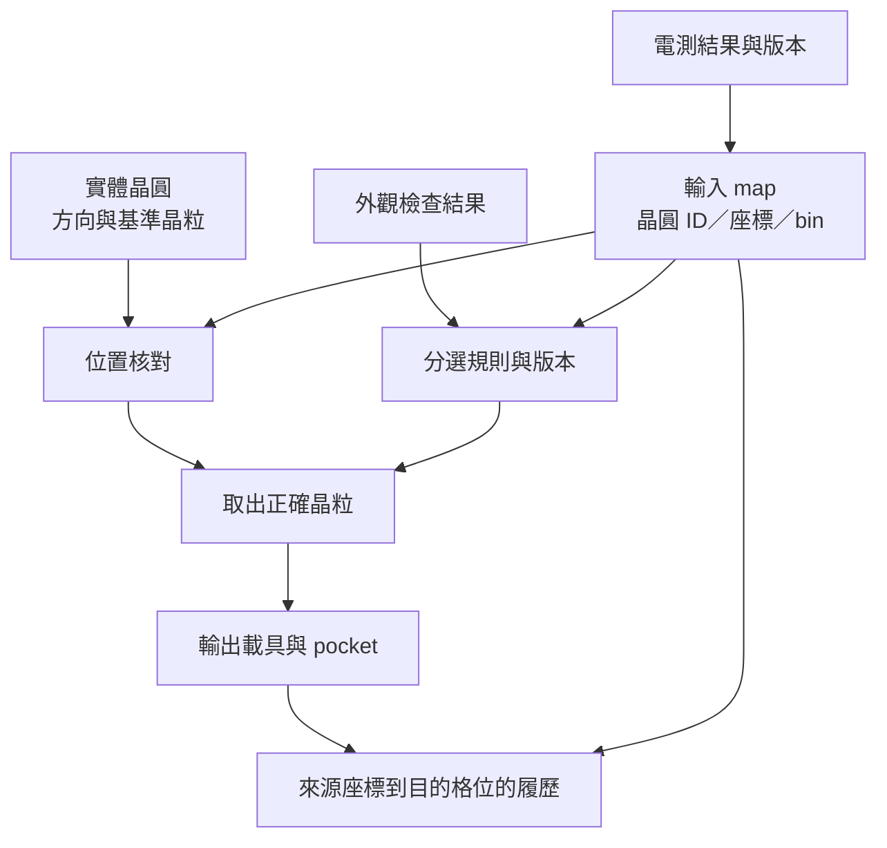

# 02　挑的是什麼，如何避免放錯？

## 1. 開場問題：機械動作全對，仍可能整盤報廢

假設設備每次都準確拿起晶粒，最後也放進指定 tray 的格子。但輸入的 wafer map 旋轉方向弄反了，設備挑出的就不是測試資料標示的那些晶粒。**精密運動不會修正錯誤的身分。**

<a href="../../cowos/html/13-test-and-kgd.html">KGD</a>討論哪些測試增加「已知良好」的信心；本章新增的是測試結果如何連到實體晶粒，以及分選、重測、覆判和交接之後如何仍能追溯。

## 2. 先看結構：分選有資料流，也有實體流

**Wafer map（晶圓圖）**把晶圓座標與分類資料對應；**bin** 是分類代碼，不保證所有公司的同一代碼都有相同意思。Bin 可以來自電測、外觀、尺寸或客戶自定條件，必須先讀它的定義。

**圖 2-1｜本書的資料／實體對照模型。** 分類規則與方向核對要一起成立。這不是特定 MES 或 SEMI 標準的實作宣告。

| 資料 | 為什麼需要 | 少了會怎樣 |
|---|---|---|
| 晶圓 ID、批次與 map 版本 | 確認資料屬於這片晶圓及目前有效結果 | 新舊 map 或不同晶圓混用 |
| 原點、行列方向、觀看面與旋轉定義 | 把格位變成實體位置 | 鏡射、旋轉或行列互換 |
| bin 字典與分選規則版本 | 知道代碼對應的測試／外觀條件 | 把未知碼當良品 |
| 來源座標與目的載具／pocket | 保留搬運前後的對應 | 出站後只剩總數，查不到單顆 |
| 重測、覆判、報廢與異常履歷 | 不覆蓋原判定，知道結果何時改變 | 同一顆同時出現在兩種結果裡 |

## 3. 輸入／操作／輸出：先驗證 map，再放行晶粒

| 輸入 | 操作 | 輸出／目的 |
|---|---|---|
| 晶圓條碼與 map metadata | 核對 ID、版本、檔案完整性與配方 | 確認對的是檔案，而不只是讀得到條碼 |
| 基準晶粒與方向標誌 | 以不對稱位置核對原點、X／Y 遞增和旋轉 | 排除只靠圓形輪廓看不出的方向錯誤 |
| 電測 bin、外觀與規則 | 形成分選決策，保留各結果來源 | 不把「外觀良好」覆蓋成「電性合格」 |
| 已允許取料座標 | 執行取料並確認成功 | 原位置從可取料改為已取走 |
| 目的格位與實體放置結果 | 確認落座後提交對應紀錄 | 輸出 map 與盤內晶粒一致 |
| 中斷或結果不確定 | 停止相關放行、隔離並復原核對 | 不把不確定當作成功或直接重做 |

### 教學案例：外觀與電測不能互相代替

以下四顆是假想資料；本例規則明定「電測合格且外觀可接受」才可進正常輸出。規則可因產品改變，但不可由設備自行猜測。

| 晶粒 | 電測結果 | 外觀結果 | 本例分流 | 判斷理由 |
|---|---|---|---|---|
| A | 合格 | 可接受 | 正常輸出 | 滿足本例兩項條件，仍非零風險 |
| B | 合格 | 崩邊超出允收 | 隔離／複判 | 電測時間點與可見機械損傷不同 |
| C | 不合格 | 看起來正常 | 不進正常輸出 | 外觀不能推翻已知電性失敗 |
| D | 未知代碼 | 可接受 | 隔離並要求規則確認 | 未知不等於良品 |

分選機可能只是**搬運既有電測判定**，也可能整合 AOI 產生新增外觀分類。是否有電測介面、實際量測或 AI 模型，必須各自查證，不能因為能分 bin 就宣稱能測所有電性。

## 4. 失敗會長什麼樣子？

| 失敗 | 為何只看總數不夠 | 可追查的訊號 |
|---|---|---|
| map 對錯片 | 顆數可能剛好一樣 | ID、版本、時間與上料紀錄 |
| 方向錯誤 | 規則照跑，座標卻對不到原晶粒 | 不對稱基準點、實體圖與轉換模型 |
| 放錯 bin tray | 好壞總量可維持不變 | tray ID 與 pocket 對應 |
| 重試造成重複登錄 | 系統可能認為同一顆出貨兩次 | 唯一事件 ID、前後狀態與中斷紀錄 |
| 覆判蓋掉原結果 | 無法再建立缺陷與檢測關聯 | 原始影像、判定版本及批准者 |

## 5. 如何檢查與控制：數量守恆只是起點

本書建議建立互斥且完備的工件狀態：`未取走、在機內搬運中、已輸出、已隔離／報廢`。盤點時每顆只能在其中一類；將各類相加應回到本批納管總數。**納管總數不一定等於整片晶圓格位數**，空格或不納入本次取料的格位要先定義。

數量對得上仍可能身分互換，因此還要抽查「來源晶圓／座標 → 搬運事件 → 輸出載具／格位」。輸出確認與資料提交之間若斷電，復原要辨認實體位置，再完成紀錄；不可假設上一個命令沒收到回應就代表沒有動作。

## 6. 與均華的連結

| 已確認事實 | 合理推論 | 尚待查證 |
|---|---|---|
| KS-956／962 列條碼確認 mapping file、SECS 傳輸選配、NG die 導出（G5） | 公司公開功能涉及分選資料與異常晶粒流程 | map 格式版本、交易復原、逐顆履歷及 SECS 實作範圍 |
| KS-812 列 3／6 bin 與 wafer mapping（G6）；F1 第 10 頁有 AI 分選示意 | 多重分類是其公開產品／技術方向 | AI 模型測試、漏檢／誤判率；是否整合電測不能從示意圖判定 |

## 7. 理解檢查

??? question "一批輸入與輸出顆數完全一致，能證明追溯正確嗎？"
    不能。兩顆互換或整片方向錯誤，數量仍可能一致；還需逐顆座標與目的格位對應。

??? question "AOI 判良能把電測不合格的晶粒升級為 KGD 嗎？"
    不能。觀測對象與條件不同，必須依核准的重測／覆判程序處理，不能由外觀推翻電測。

??? question "放置命令發出後斷線，為什麼直接重送有風險？"
    晶粒可能已放下但回應遺失。需先核實實體狀態和事件紀錄，避免重放、錯帳或下一顆覆蓋。

??? question "SECS 選配能證明符合特定 wafer map 標準嗎？"
    不能。通訊能力、資料格式及標準版本是不同問題，需看實作與相容性證據。

## 8. 來源與待查

[G5、G6、F1](appendix-sources.md)，查閱 2026-09-10。資料契約、隔離與狀態設計為本書建議，不是已確認的均華軟體架構；未讀 SEMI E142 正文，標準符合性列 Q2。下一章轉向[取放、翻面與實體交接](03-pick-place-flip.md)。
