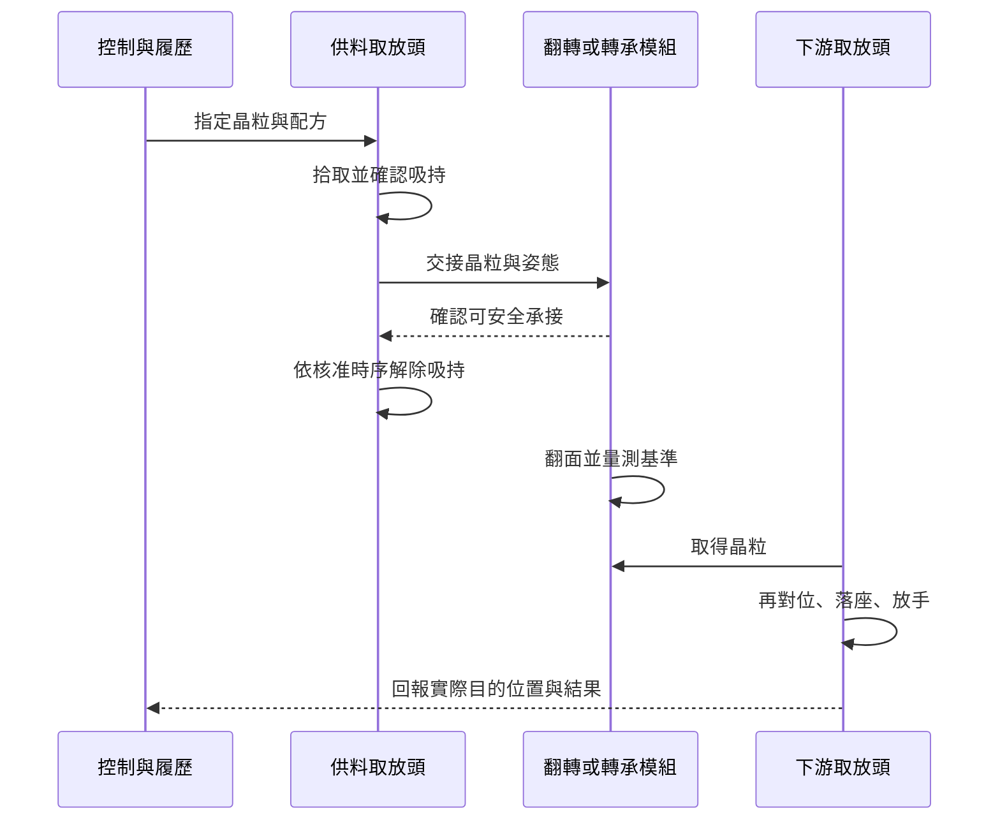

# 03　如何拾取、翻面、轉移？

## 1. 開場問題：只要多轉半圈，就能把晶粒翻過來？

想把有電路的一面從朝上變成朝下，不能只在工作平面內轉半圈。平面旋轉改變方位，卻不改變哪一面朝上；真正的翻面還會改變工具接觸面及觀看方向。

本章新增的問題是：**一次搬運如何同時保住晶粒、身分與姿態？** [第 1 章](01-die-handling.md)處理從膠膜取出，[第 2 章](02-sorter-traceability.md)處理資料；本章把兩者放進同一個交接循環。

## 2. 先看結構：工具接走的是一個有方向的工件

| 動作 | 改變什麼 | 必須保留什麼 |
|---|---|---|
| Pick：拾取 | 工件的支撐者 | 身分、完整性、抓持位置 |
| Transfer：轉移 | 工件所在位置及可能的工具 | 來源／目的、當前持有者 |
| Flip：翻面 | 工作面朝向及接觸關係 | 翻面軸、基準標記、正反面定義 |
| Place：放置 | 工件由工具轉交給載具／基板 | 實際落座、姿態、位置與履歷 |

不是每台設備都用獨立翻轉台，也不是每顆晶粒都要翻。工具可以直接交接，也可經轉承台；選哪一種取決於工件表面、幾何與後續製程。以下是**教學簡化**，不代表某一 KS／KB 的實際時序。

**圖 3-1｜交接時序。** 「確認可承接」可能由吸持、接觸、位置與互鎖共同構成，不是任意允許兩個工具同時拉扯晶粒。

## 3. 輸入／操作／輸出：每次交接都重新確認基準

| 輸入 | 操作 | 輸出／目的 |
|---|---|---|
| 晶粒 ID、正反面與目標姿態 | 建立當前座標與觀看面 | 知道標記在工具哪一側 |
| 供料頭上的晶粒 | 移動、減速、等待穩定並交接 | 晶粒由下一工具或平台接住 |
| 已翻轉晶粒 | 重新取像並確認標記 | 取得實際姿態，而非只信命令角度 |
| 工件及目標載具 | 校正座標、下降、落座及放手 | 接收站實際取得工件 |
| 動作與感測結果 | 更新履歷、保存異常 | 機械狀態與資料狀態一致 |

### 翻面座標的簡單反例

假設晶粒以中心為原點，X 向右、Y 向上、Z 為原正面的法向。繞 X 軸作三維 180° 翻轉，位置向量會從 `(x, y, z)` 變成 `(x, −y, −z)`；這個**三維動作仍是旋轉，不是物理鏡射**。但由固定上方相機看新的可見面，投影的平面座標可能呈現 Y 方向反轉。

若錯用平面 180° 旋轉 `(x, y) → (−x, −y)`，不對稱標記就會落在錯的角。實際相機也可能有自己的影像軸或鏡像設定，因此必須用已知、不對稱的基準驗證，不靠晶粒的矩形外框猜方向。

## 4. 失敗會長什麼樣子？

| 交接問題 | 造成的缺陷 | 可辨識它的證據 |
|---|---|---|
| 前一工具太早放手 | 掉片、姿態失控 | 吸持與互鎖時間序列 |
| 工具相對移動時仍共同抓住 | 彎曲、刮傷、破片 | 接觸時點、軌跡及失效位置 |
| 晶粒在吸嘴上微滑 | 命令位置對但真實位置偏 | 交接前後的同一基準影像 |
| 翻面變換錯 | 正反面或角度錯，pad 對錯位置 | 不對稱標記與座標轉換紀錄 |
| 接觸到不相容區域 | 粒子、膠殘留、結構壓傷 | 接觸面清單、工具檢查與污染追溯 |

不能以「最後沒有掉片」定義成功。對位前看不見的粒子，可能在後續接合造成空隙；取放站必須交付的不只是位置，還包括表面與身分狀態。

## 5. 如何檢查與控制：再定位不是前站做不好

每次換工具都會引入新的抓持或基準轉換。交接後再定位，是量測這個新增自由度，不是必然代表前站不準。前後量測需要共通或可轉換的基準，否則兩張「看起來正常」的影像無法比較。

為了降低污染，先列出哪一面可接觸、哪一區必須避開，再訂工具材質、清潔與更換規則。頻率和允收門檻依材料／客戶規範驗證；本書不給通用值。若可能有靜電敏感性，也需核對產品與工具的防護要求，不能只依視覺確認無損。

控制系統應能回答「現在是哪個工具持有哪顆晶粒」。交接失敗要保留可復原狀態，不讓後續正常節拍把不確定的位置掩蓋。

## 6. 與均華的連結

| 已確認事實 | 合理推論 | 尚待查證 |
|---|---|---|
| G4、G8 分別公開 Sorter 與 Bonder 的 face up／down 可切換功能 | 翻面是跨設備類別的功能，不能只用它分辨 Sorter 與 Bonder | 工具接觸面、翻面軸、實際時序與允收精度 |
| P1 在帶翻轉模組的實施例中說明可轉 180°，讓需沾膠的一面朝下 | 可用來理解「翻面服務後續製程」的機構動機 | 是否由某 KS／KB 採用；不可把專利機構直接當型錄 |

## 7. 理解檢查

??? question "繞 Z 軸轉 180°，可以把原本朝上的工作面朝下嗎？"
    不行。在本章座標定義中，繞 Z 軸是平面旋轉，工作面法向沒有翻轉；需要明定真正的三維翻面軸。

??? question "交接前已對位，為什麼交接後還要量？"
    晶粒可能相對新工具滑動，或基準轉換有殘差。後測是檢查新增的不確定性，不能只用前測代替。

??? question "兩個工具都確認吸到晶粒，是否代表交接最安全？"
    不一定。若兩工具位置或動作不協調，可能拉扯晶粒；必須依核准的接觸、吸持及放手互鎖時序。

## 8. 來源與待查

[G4、G8、P1](appendix-sources.md)，查閱 2026-09-10。圖 3-1、座標反例與控制建議為作者教學整理；P1 只提供公開實施例。污染／姿態驗收列 Q1、Q3；下一章建立[對位誤差預算](04-alignment-error-budget.md)。
