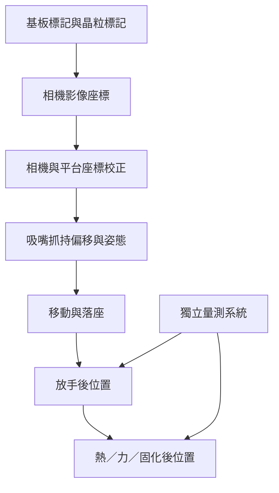

# 04　標稱精度能否代表實際放置？

## 1. 開場問題：每次都放在同一點，為什麼還是不合格？

一台設備重複放置時，晶粒落點聚得很緊，卻全部偏離目標。另一台平均位置恰好對準，但每顆散布很大。兩台都不能只靠一句「高精度」判定可用。

<figure class="external-image">
  
  <figcaption><strong>圖 4-2｜落點集中，不等於放在正確位置。</strong> 圖中的 Precision 指重複結果的集中程度；Accuracy 指結果接近目標的程度。讀圖時分開看「散布」與「整群偏移」，不要把平均接近靶心當作每顆都合格。這是定性比喻，沒有公差、樣本統計或均華實測數據，不能用來估良率。<br>來源：<a href="https://commons.wikimedia.org/wiki/File:Accuracy_and_Precision.svg">Arbeck／Wikimedia Commons</a>，<a href="https://creativecommons.org/licenses/by/4.0/">CC BY 4.0</a>；未修改原圖。</figcaption>
</figure>

本章新增的問題不是相機能看多細，而是：**從看見基準、換算座標、驅動平台，到吸嘴放手及完成接合，誤差在哪裡增加？** 先備為[取放與翻面](03-pick-place-flip.md)。以下數字全是教學設定，不是均華或其他廠商規格。

## 2. 先看結構：量的是哪兩個物件、哪一個時點？

先固定被測量：例如「在室溫、放手後、固化前，晶粒兩個定位標記相對基板目標標記的 X／Y／旋轉偏移」。若改成加熱前、接合後、晶粒中心或邊緣，得到的不是同一項指標。



**圖 4-1｜教學量測鏈。** 最後一次對位不必然觀察到放手後滑移，更看不到尚未發生的熱變形；所以前、後兩個位置都要定義。

| 用語 | 應回答的問題 | 常見誤讀 |
|---|---|---|
| 解析度 | 影像或位置讀值可分辨的步距 | 可辨識小步距就能保證實際放得準 |
| 重複性 | 同條件重做，散布多少？ | 聚得緊就沒有系統偏差 |
| 偏差 | 相對可信基準的平均偏移是多少？ | 平均接近零就每顆都合格 |
| 再現性／穩定性 | 換班、治具、吸嘴或時間後如何？ | 短測結果可代表整班 |
| 量測不確定度 | 對所報量測結果還有多少不確定？ | 量測讀值就是無誤差的真值 |

NIST 的量測指引區分上述問題（T1、T2）。**量測本身的重複性**和**設備反覆放置的重複性**不是同一件事：前者不搬動工件重測，後者需重新取放後再量。

## 3. 輸入／操作／輸出：建立一張可診斷的誤差預算

| 輸入 | 操作 | 輸出／目的 |
|---|---|---|
| 有溯源性的基準件、相機與平台 | 校正尺度、旋轉、畸變與工作區位置 | 轉換模型及殘差，不只一個 offset |
| 晶粒與吸嘴 | 取放前後量相同標記 | 分離抓持、交接及放手的影響 |
| 冷機／暖機／不同時間資料 | 用 check standard 追蹤基準位置 | 發現漂移，訂預熱、重校或補償條件 |
| 量測系統與實際放置樣本 | 分開做重測與重放，再比較 | 判斷散布主要來自製程還是檢測 |

### 教學算例：只有條件成立，才做 RSS

先用一維、近似線性模型：`e_x = b + e_vision + e_stage + e_tool + e_transfer`。`b` 是平均偏差；其餘是假設已扣除可辨識偏差的隨機殘差。所有輸入已換算成輸出位置的 µm，因此本例敏感度係數都是 1。

| 項目 | 教學標準差（1σ，µm） | 實機應如何取得 |
|---|---:|---|
| 視覺定位殘差 | 0.8 | 同一基準、不同視野位置與照明重測 |
| 平台定位殘差 | 0.6 | 在工作範圍內實測，不用編碼器解析度代替 |
| 工具抓持殘差 | 0.5 | 重複吸取並量測標記相對吸嘴的位置 |
| 交接／放手殘差 | 0.7 | 對照交接前與放手後位置 |

若這四項**零均值、同為 1σ、彼此獨立或協方差可忽略，且未重複計入同一誤差**：

```text
σ_total = sqrt(0.8² + 0.6² + 0.5² + 0.7²)
        = sqrt(1.74)
        ≈ 1.32 µm
```

這是**模型預測的製程散布**，不是 NIST 認證值，也不是量測不確定度本身。T1 提供標準差與不確定度合成的數學框架；真正的放置散布仍要與實測分布比對。量測不確定度另列，不能把它當作設備已多放偏了一次，也不能重複加入本來就含量測雜訊的各項估計。

若殘差相關，在本例單位敏感度模型下須用：

```text
var(e_x) = sum(σ_i²) + 2 × sum(cov(e_i, e_j), i < j)
```

例如共用相機基準或同一熱源可能使兩項一起漂移。直接做獨立 RSS 可能低估，也可能高估總變異；應先估相關性，而不是加一個任意「安全係數」假裝解決。

### 偏差不能藏進平方根

若另量到 `b = +2.0 µm`，未補償前落點分布是以 `+2.0 µm` 為中心，不是以零為中心。依 T1 §5.2，對可辨識且顯著的系統效應應施加校正；校正值仍有不確定度，應另評估。

**本例假設** X 方向公差是 `−4 到 +4 µm`，製程穩定、近似常態，而且暫忽略參數估計與量測不確定度，便可做一個診斷性比較：

```text
未補償：最近公差邊界距離 = 4 − 2 = 2 µm
        距離 / σ_total ≈ 2 / 1.32 = 1.52
理想補償後：最近邊界距離 / σ_total ≈ 4 / 1.32 = 3.03
```

這不是良率保證或正式 Cpk 報告；它只是說明，偏差即使不改變散布，也會讓其中一側更容易超界。`1σ`、`3σ`、抽樣最大值與全數最大誤差必須分開報告。

## 4. 失敗會長什麼樣子？

| 觀察 | 可能機制 | 如何排除替代解釋 |
|---|---|---|
| 整批同向偏 | 座標校正或工具 offset | 先用基準件重測，排除量測系統偏差 |
| 工作區邊緣變差 | 畸變、尺度／正交誤差 | 量多點殘差，不只中心點 |
| 暖機後逐漸偏 | 熱狀態與時間相關漂移 | 同時記溫度、時間、負載；不能看到相關就確定單一熱因果 |
| 對位影像合格，放手後不合格 | 吸嘴放手、膠材流動或滑移 | 加入放手後觀察，分離時點 |
| 中心對準但角落越遠越偏 | 旋轉誤差或非剛體變形 | 量兩個以上標記，必要時量局部變形 |

小角度剛體旋轉的教學近似為 `邊緣位移 ≈ r × θ`，θ 用弧度。假設標記距旋轉中心 5 mm、角誤差 0.01°，位移約 `5000 × 0.01 × π / 180 = 0.87 µm`。晶粒尺寸不同，即使角度規格相同，也不能直接說邊緣對位能力相同。

## 5. 如何檢查與控制：規格至少附一份量測契約

一份可比較的報告應交代加工對象、厚度／尺寸、載具、量測標記、X／Y／角度、取像與接合時點、樣本數與取樣分布、冷暖機條件、配方、統計表示和量測不確定度。跨機比較時，有一項不同就先解釋其影響，不急著排名。

控制順序是：**確認量測可用 → 找偏差與來源 → 修正機構／校正／熱條件 → 重跑整個工作範圍 → 觀察長時間分布**。不能只把相機換得更高解析，就跳過治具、抓持與放手。

## 6. 與均華的連結

| 已確認事實 | 合理推論 | 尚待查證 |
|---|---|---|
| P1 的公開實施例包含多處視覺定位與轉承；G8 有晶粒表面 AOI 功能 | 搬運交接與定位控制是研究其設備的合理切入點 | P1 是否用於特定 KB、位置量測定義、精度分布、熱漂移、客戶驗收 |
| 本書採用的 G4–G11 官網頁未提供完整可比較的放置精度條件 | 不能只靠這些公開頁排名設備 | 不代表公司沒有未公開型錄或客製驗收能力 |

## 7. 理解檢查

??? question "每次偏 +2 µm，但散布非常小，應先改善哪個問題？"
    先確認量測基準與偏差來源，再做校正或補償。重複性好不會自動消除偏差，也不能跳過校正不確定度。

??? question "四份規格分別是 1σ、3σ、最大值和像素尺寸，可以做 RSS 嗎？"
    不行。它們不是同種量；需要相容的統計定義、物理意義、敏感度與相關性資料，像素尺寸尤其不能當放置誤差。

??? question "晶粒中心對準，為什麼角落仍可能超差？"
    旋轉誤差會隨距離放大；翹曲或局部變形又不一定可用剛體旋轉修正。要明定標記位置與驗收點。

??? question "同一塊工件重測很好，能證明取放也很好嗎？"
    不能。重測主要觀察量測系統；取放還包含剝離、抓持、運動、放手和材料效應，需另做重放實驗。

## 8. 來源與待查

[T1、T2](appendix-sources.md)：量測與不確定度框架；[P1、G8](appendix-sources.md)：公開機構與功能。查閱 2026-09-10。所有數值例子均為本書設定，公式以純文字呈現，不依賴數學渲染器。真實量測／驗收資料見待查 Q3；下一章把「放準」與[「完成接合」](05-bonder-process-boundaries.md)分開。
