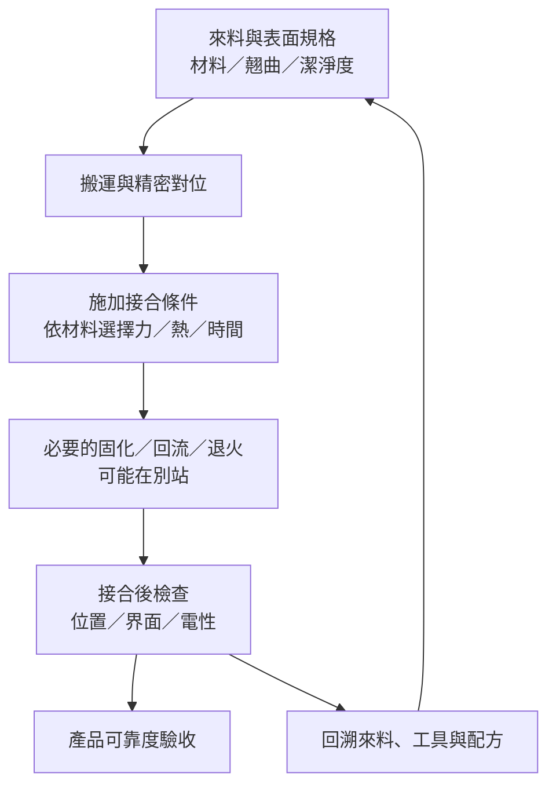

# 05　放上去與完成接合差在哪？

## 1. 開場問題：都叫 Bonder，為什麼不能互相替換？

把晶粒放在膠上、把微凸塊對到焊墊、把極平坦的金屬與介電表面對準，可能都需要精密取放，但它們不是同一種接合。**Bonder 是設備類別名稱，不是一份完整製程規格。**

本章新增的問題是：從[放置精度](04-alignment-error-budget.md)到可接受的接合，還缺哪幾項控制與驗證？回流／ACF 背景見<a href="../../smt-bonding/html/index.html">電子接合書</a>，HBM 與混合鍵合背景見<a href="../../gpm/html/08-hbm.html">HBM</a>、<a href="../../gpm/html/09-soic-hybrid-bonding.html">SoIC</a>；不要把板級配方或某代 HBM 條件直接搬來。

## 2. 先看結構：設備動作與接合介面分兩張清單

「放置」主要問晶粒在哪裡、朝哪裡；「接合」還要問靠什麼界面固定、如何形成電連接、後續熱與機械負載能否承受。使用黏膠固定背面的 die attach，不必然在該站同時完成所有電連接。

<figure class="external-image">
  
  <figcaption><strong>圖 5-2｜晶粒固定與打線，是不同的工作。</strong> 先找中央晶粒，再看兩條金屬線與表面的接點：晶粒底部的固定界面與上方打線的電連接不能混為一談。封裝端子在這張特寫範圍之外。此為傳統功率電晶體範例，不代表先進封裝或均華產品；照片也不足以判定底部固定材料。 來源：<a href="https://commons.wikimedia.org/wiki/File:2N3055_-_close_up_pic_of_wires_bonding_to_the_silicon_package.jpg">Mister rf／Wikimedia Commons</a>，<a href="https://creativecommons.org/licenses/by-sa/4.0/">CC BY-SA 4.0</a>；未修改原圖。</figcaption>
</figure>

| 製程路徑（教學分類） | 晶粒與接收面之間 | 取放站的主要任務 | 仍需確認的後續結果 |
|---|---|---|---|
| 黏著式 die attach | 黏著材料；可為導電或非導電用途 | 控膠、定位、落座與黏著層形態 | 固化、空隙、接合強度及所需電性 |
| 焊料互連／回流路徑 | 焊料與對應金屬焊墊 | 正確放置並保持到後段 | 回流、潤濕、橋接／開路、冷卻後位置 |
| 熱壓接合（TCB） | 依工藝選用的金屬互連與周邊材料 | 控制對位、力、溫度及時間歷程 | 實際界面形成、變形、空隙、電性與可靠度 |
| 混合鍵合（hybrid bonding） | 需配對的介電與金屬表面 | 高要求的潔淨搬運與對位；接觸步驟依工藝而異 | 前段表面準備、接合與可能的退火、界面完整性 |

表是**跨製程的教學簡化**，不是四種互斥的商品分類。一台設備可能整合多個步驟，也可能只負責其中一段。沒有材料與介面條件，無法從加熱器或接合力反推具體接合法。

<figure class="external-image">
  
  <figcaption><strong>圖 5-3｜覆晶把互連界面移到晶粒下方。</strong> 對照圖 5-2 的上方打線，這裡要讓凸塊與接收面對應；放置到位仍不代表焊料已形成合格接點。圖不按比例，未完整呈現材料層，也不指定回流或熱壓條件；它不是混合鍵合示意，更不是均華的製程證據。 來源：<a href="https://commons.wikimedia.org/wiki/File:Flip_chip_mount_2.svg">Twisp／Wikimedia Commons</a>，<a href="https://commons.wikimedia.org/wiki/Template:PD-self">公有領域（PD-self）</a>；未修改原圖。</figcaption>
</figure>

Besi 的公開技術摘要（T3）把熱壓與混合鍵合列為不同的先進封裝課題，強調細間距、對位及互連完整性；這支持區分問題，但不是均華參與證據。

## 3. 輸入／操作／輸出：責任交接要看工件狀態

**圖 5-1｜責任鏈而非均華產線圖。** 並非每條路徑都包含所有後處理；「必要」由工藝決定。前段不合格來料不保證能由後段高精度取放補救。

| 輸入 | 操作 | 輸出／目的 |
|---|---|---|
| 材料、表面及目標工藝規格 | 核對哪些條件已完成、哪些仍需本站處理 | 明確來料放行條件 |
| 已對位晶粒 | 在定義的接觸面施加受控歷程 | 形成暫時保持或本站負責的接合 |
| 接合中工件 | 保存力、溫度、時間、姿態與異常 | 可回溯的製程履歷 |
| 接合後樣本 | 用適合的影像、非破壞／破壞分析與電測 | 確認結果，不只確認機台命令完成 |

### 力與壓力不是同一個數字

官網 KB-9000 使用 `>300 N` 的高接合力文字（G8）。N 是力的單位；沒有作用面積及接觸分布，不能換成某一顆晶粒受到的實際壓力，更不能推導製程已成熟。

**獨立教學算例，不採用均華規格：** 同樣假設 100 N 均勻作用於 100 mm² 與 25 mm²，平均壓力分別為 `100/100 = 1 MPa` 與 `100/25 = 4 MPa`，因為 `1 N/mm² = 1 MPa`。若只有凸塊或局部區域接觸，局部應力還會不同。力量上限也不等於小力控制的解析度、均勻度或重複性。

## 4. 失敗會長什麼樣子？

| 缺陷 | 可能來源 | 單一設備指標看不到的地方 |
|---|---|---|
| 接合後位移 | 放手、材料流動、熱變形 | 加熱前對位數字不能代表接合後 |
| 空隙或不完整接觸 | 粒子、翹曲、材料或表面狀態 | 相機看見位置正確不代表界面完整 |
| 開路／高接觸電阻 | 互連未形成、污染或局部失配 | 外觀檢查不等於電測 |
| 破片／局部損傷 | 接觸不均、過大負載、原有缺陷 | 最大力較高不必然較好 |
| 後續可靠度失敗 | 材料與熱機械負載不相容 | 初始導通或拉力合格不能涵蓋所有壽命條件 |

## 5. 如何檢查與控制：一份合理的功能／責任矩陣

| 責任面 | 應提供的證據 | 不宜接受的替代說法 |
|---|---|---|
| 來料／材料 | 表面、厚度、翹曲、潔淨度與保存條件 | 晶粒尺寸放得進機台就可以 |
| 運動／視覺 | 指定工件與時點下的位置量測契約 | 只有解析度或「超高精度」 |
| 接合控制 | 適用材料、校正與實際力／溫度／時間紀錄 | 只有加熱器上限或最大力 |
| 製程整合 | 界面分析、電性、可靠度與良率 | 動作完成或參展成功 |
| 客戶驗收 | 型號、條件、階段、結果與日期 | 專利、應用圖或未配對客戶名單 |

實際分工由供應商與客戶共同定義，不一定各由一家負責。重點是每個界面有人負責、能給出驗收證據，而不是把所有良率都歸給 Bonder。

## 6. 與均華的連結

| 已確認事實 | 合理推論 | 尚待查證 |
|---|---|---|
| KB-9000 頁列 fan-out／PoW／PoP、翻面、表面 AOI 與高接合力文字（G8） | 可把它放進「搬運、對位與接合功能」的研究範圍 | 具體材料與接合法、力控制測試、後段工藝及驗收 |
| KB-9X00、9300、9150 列先進封裝／3D IC 應用（G9–G11） | 公司公開 Bonder 應用方向 | 不能單靠 3D IC 判定 HBM 堆疊或混合鍵合量產 |

## 7. 理解檢查

??? question "有加熱、有施力、有對位，是否就是混合鍵合設備？"
    不是。還要核對界面、表面準備、接合步驟與驗收，不能用共用功能代替製程身分。

??? question "最大力提高，能不能推論接合良率提高？"
    不能。局部應力、力控制、材料與接觸均勻度都重要；過大負載反而可能造成損傷。

??? question "接合後外觀正常、電測也通過，就能直接宣布量產嗎？"
    不能。還有樣本代表性、良率穩定性、可靠度與客戶階段；單一樣本成功不等於量產能力。

## 8. 來源與待查

[G8–G11、T3](appendix-sources.md)，查閱 2026-09-10。製程矩陣是教學整理，不包含可直接操作的配方；力／面積算例是作者假設。接合法與量產配對見 Q4、Q5。下一章討論[如何兼顧節拍與品質](06-throughput-quality.md)。
