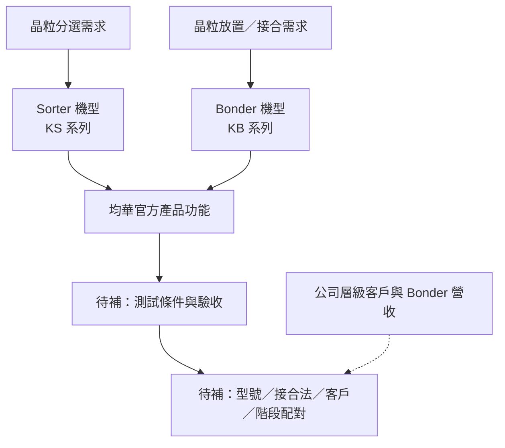

# 07　均華的產品到底做到哪一步？

## 1. 開場問題：技術需求很多，哪些真正能對上均華？

前六章建立的是通用工程問題，現在才把公司放進來。順序不能倒過來：不能先把均華稱為某製程供應商，再用技術章替它補能力。

本章新增的成果是**以法人、型號、站點、條件和商業階段為欄位的證據矩陣**。資料截至 **2026-09-10**；不給投資評等，不補未具名客戶，不拿同行規格代填。

## 2. 先看結構：公司、設備、應用、客戶是不同層級

本書的均華是**均華精密工業股份有限公司，GMM，6640**（G1、G2）。均豪 GPM 是另一法人；G2C+ 是聯盟名稱，不是將各成員全部合併的公司名稱。G3 描述三家公司於 2020 年組盟的歷史；F2 第 10 頁另列志聖、均豪、均華與東捷，不把舊沿革當成目前完整成員清單。

**圖 7-1｜證據連接圖。** 虛線表示公司層級資訊不能直接完成型號配對，不代表已建立供應關係。

官網「關於均華」具名台積電、矽品、日月光為客戶（G2）。這是**公司自述的公司層級關係**；不是「每個 KB 都賣給這些公司」，也不是客戶共同驗收公告。反過來，不能因為型號頁沒寫客戶，就說整家公司完全沒有具名客戶。

## 3. 輸入／操作／輸出：把官網翻成有邊界的產品地圖

| 輸入 | 操作 | 輸出／目的 |
|---|---|---|
| 型號頁原文 | 分開抄錄加工對象、站點、功能與數字條件 | 不把形容詞變成性能 |
| 前六章的缺陷與控制 | 判定該功能回答哪個問題 | 功能與需求對上，但不超出來源 |
| 法說／公司頁 | 標註是公司、產品類別或型號層級 | 防止把概括敘述下放到單機 |
| 專利與市場訊息 | 分離技術揭露及商業證據 | 留下具體待查，不填空猜測 |

### 產品證據矩陣

下表共 **8 組官網機型頁、10 個型號名稱**；每列均維持計畫指定的十二欄。橫向較寬，可在表格內左右捲動。「未明」表示來源未提供，不等於公司沒有。

| 法人主體 | 產品名稱／型號 | 加工對象 | 製程站點 | 公開性能及測試條件 | 客戶是否具名 | 研發／驗證／出貨／量產階段 | 來源原文位置 | 發布日期 | 查閱日期 | 證據等級 | 未知事項 |
|---|---|---|---|---|---|---|---|---|---|---|---|
| 均華 GMM | KS-856／KS-852 | 晶粒；waffle pack／JEDEC tray／tape reel 選項 | 分選、檢查、翻面及上下料 | 字面晶粒尺寸 0.5–50 mm；厚度量測選配；未交代尺寸定義與完整測試條件 | 型號未具名 | 有官方產品展示；型號別驗證、出貨、量產未明 | [G4 產品特色](https://www.gmmcorp.com.tw/chip-sorter/KS-856-852) | 未標示 | 2026-09-10 | 公司自述 | 薄度、尺寸組合、精度、UPH、6S 定義 |
| 均華 GMM | KS-956／KS-962 | 晶粒側壁、NG die 與 map | AOI、分選、NG 導出 | 側壁崩邊／裂紋；「Defect size 30um」；條碼核 map、SECS 選配；照明、速度、漏檢條件未明 | 型號未具名 | 有官方產品展示；型號別階段未明 | [G5 產品特色](https://www.gmmcorp.com.tw/chip-sorter/KS-956-962) | 未標示 | 2026-09-10 | 公司自述 | 缺陷量測定義、誤判／漏檢、UPH、標準相容 |
| 均華 GMM | KS-812 | tray 中晶粒與 wafer map | 線性取放與分 bin | 2／3／4 吋 tray；3 或 6 bin；雙 feeder；背面檢查選配。未列精度／速度 | 型號未具名 | 有官方產品展示；型號別階段未明 | [G6 產品特色](https://www.gmmcorp.com.tw/chip-sorter/KS-812) | 未標示 | 2026-09-10 | 公司自述 | tray 與晶粒組合、UPH、檢查條件 |
| 均華 GMM | KS-962JL | wafer／晶粒／tray | 取放、AOI、轉移與換料 | 四頭取放、十二頭旋轉；AOI／轉移並行；預剝離、快速換 wafer、加熱頂出可選；未列 UPH | 型號未具名 | 有官方產品展示；型號別階段未明 | [G7 產品特色](https://www.gmmcorp.com.tw/chip-sorter/KS-962JL) | 未標示 | 2026-09-10 | 公司自述 | 並行瓶頸、實測節拍、材料窗口 |
| 均華 GMM | KB-9000 | 晶粒；fan-out／PoW／PoP 應用 | 翻面、表面 AOI、黏晶／接合 | high bonding force process ready >300 N；無完整溫度、作用面積、速度及校正條件 | 型號未具名 | 有官方產品展示；process ready 不等於客戶驗證或量產 | [G8 產品特色](https://www.gmmcorp.com.tw/die-bonder/KB-9000) | 未標示 | 2026-09-10 | 公司自述 | 實際接合法、力控制、精度、型號別出貨 |
| 均華 GMM | KB-9X00 | wafer／substrate；fan-out、2.5D／3D IC 應用 | 搬送與黏晶／接合 | 公開搬送介面、追溯、報表及客製通訊；無量化精度、熱力或 UPH | 型號未具名 | 有官方產品展示；型號別階段未明 | [G9 產品特色](https://www.gmmcorp.com.tw/die-bonder/KB-9X00) | 未標示 | 2026-09-10 | 公司自述 | 接合法、材料、精度及客戶驗收 |
| 均華 GMM | KB-9300 | wafer／substrate；3D IC 應用 | 搬送與黏晶／接合 | 公開搬送與資料功能；無可比較的量化性能 | 型號未具名 | 有官方產品展示；型號別階段未明 | [G10 產品特色](https://www.gmmcorp.com.tw/die-bonder/KB-9300) | 未標示 | 2026-09-10 | 公司自述 | 與 KB-9150 的差異、接合法、UPH、驗收 |
| 均華 GMM | KB-9150 | wafer／substrate；3D IC 應用 | 搬送與黏晶／接合 | 公開搬送與資料功能；無可比較的量化性能 | 型號未具名 | 有官方產品展示；型號別階段未明 | [G11 產品特色](https://www.gmmcorp.com.tw/die-bonder/KB-9150) | 未標示 | 2026-09-10 | 公司自述 | 與 KB-9300 的差異、接合法、UPH、驗收 |

不能把「有產品展示」改寫成「確認目前所有組態均可訂購」；也不能把同一頁兩型號或不同頁相似文案當成性能完全相同。

### 產品類別與專利的補充證據

| 證據 | 已確認內容 | 對階段的影響 |
|---|---|---|
| F2，2026-08-12，第 6 頁 | 公司列 2022–2025 Bonder 營收占比為 6%、9%、14%、22% | **Bonder 類別已有歷史營收自述**，不能全部標成僅研發；仍無型號／接合法／客戶拆分 |
| F1，2026-06-12，第 8–10 頁 | Multi Bin／Multi Die Size、Bonder／AOI／Sorter 整合與 AI 分選示意 | 公司公開技術方向；未提供型號性能或 AI 檢測結果 |
| P1，2021-09-16 公布 | 均華申請的晶粒接合裝置實施例 | 技術揭露；不證明對應 KS／KB 已採用 |

## 4. 失敗會長什麼樣子：公司研究也會「對位錯誤」

| 錯配方式 | 為什麼不成立 | 正確拆法 |
|---|---|---|
| 把均豪合併財報當均華單機成績 | 法人與彙總層級不同 | 先核發行人、期間、個體／合併與產品分類 |
| 30 µm 缺陷尺寸變成放置精度 | 檢測與運動是不同被測量 | 回到第 4 章量測契約 |
| 3D IC 直接等同 HBM 或混合鍵合 | 結構／應用不指定接合法 | 要有加工對象、接合法與階段配對 |
| 法說圖中的品牌等同設備客戶 | 可能是市場需求者或設計示意 | 客戶關係回公司／客戶明確公告 |
| 歷史 Bonder 占比變成某 KB 台數 | 營收類別不是數量也不是型號 | 查型號、ASP、認列及供應範圍 |

## 5. 如何檢查與控制：沿著證據鏈問下一個問題

先從缺陷推導需要的控制，再問特定型號是否提供該功能及其條件。功能能對上後，才問驗證樣品、測試基準、客戶階段和商業成果。

| 想知道 | 優先索取 | 補證後可以更新什麼 |
|---|---|---|
| 能否處理指定薄晶粒 | 型號、工具／膠膜、樣品條件及破損資料 | 第 1／3 章材料與交接邊界 |
| 是否真的放得準 | 放手後／接合後量測與時間分布 | 第 4 章精度矩陣 |
| 是否做指定接合 | 材料、表面、熱力流程與結果 | 第 5 章責任矩陣 |
| 是否已驗證或量產 | 帶日期的型號／專案結果與可辨識主體 | 本章階段欄，不用猜客戶 |
| 是否形成特定營收 | 對應期間的財報／產品分類註解 | 商業結果，仍不可自動推台數 |

## 6. 與均華的連結：本書目前能下的結論

| 已確認事實 | 合理推論 | 尚待查證 |
|---|---|---|
| 均華官方有 Sorter 與 Bonder 機型、公司層級客戶、Bonder 歷史營收自述 | 分選、交接、對位、並行與接合邊界是理解其設備價值的有效框架 | 型號別性能條件、具體接合法、客戶驗收及量產線 |
| 法說確實引用 HBM／多晶粒示意 | 可以研究相關製程需求是否帶動其產品機會 | 不能將需求圖轉成 HBM／混合鍵合已供應的結論 |

## 7. 理解檢查

??? question "官網有具名客戶，為什麼表格仍寫型號未具名？"
    客戶名稱在公司層級，未配到該型號、製程或期間。保留兩個層級的事實，才能避免過度推論。

??? question "已披露 Bonder 歷史營收，能否把全部 KB 型號標成量產？"
    不能。類別已有營收與每型號的量產階段不同；也不能據此稱整個 Bonder 業務仍僅研發。

??? question "KS-962JL 有十二頭，能否用第 6 章的 14,400 顆當其 UPH？"
    不能。第 6 章是自建雙模組算例，與官網頭數不是同一架構或測試。

??? question "型號缺少公開混合鍵合證據，是否等於確定不具備能力？"
    不等於。結論是本次資料無法證實；新型錄或可追溯驗收資料可能改變判斷。

## 8. 來源與待查

[G1–G11、F1、F2、P1](appendix-sources.md)，全部查閱 2026-09-10。官網發布日未標；法說與專利日期見表。未採用未核對的持股與財報數字。下一章以[三組消息案例](08-reading-news.md)演練如何保留證據邊界。
