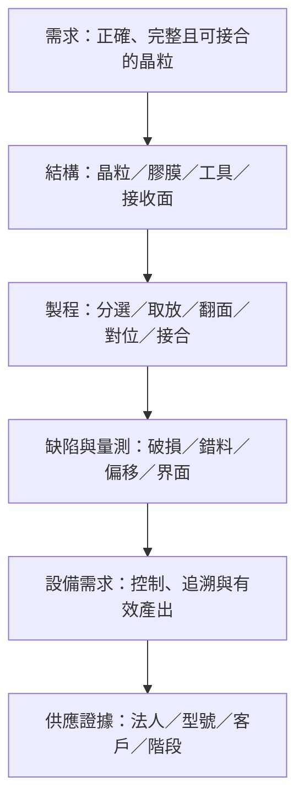

# 從晶粒分選到精密接合看懂均華

**晶粒怎麼被辨識、挑起、翻面、放準，並以可追溯的狀態交給下一站？**

這本書從這個工廠問題出發，帶你分清 Sorter、取放、Die Bonder 與特定接合製程，再回頭核對均華精密工業股份有限公司（GMM，6640）的公開資料。讀者不需已有機構或計量背景；遇到晶圓、KGD、HBM 等先備，可沿[全書地圖](00-map.md)回讀既有筆記。

## 先知道本書能確認到哪裡

均華官方公開了多組晶粒分選與黏晶機型，也在法說揭露歷史 Bonder 營收占比。這些是比「做某類設備」更具體的資料；但**功能、產品類別營收與特定型號用於客戶量產，是三個不同層級**。

本書不從「有 Bonder」直接推成「已供應某代 HBM／混合鍵合」。均豪 GPM、均華 GMM 與 G2C+ 聯盟的資料也分開處理，不把集團或聯盟名稱當同一法人。

資料查閱截至 **2026-09-10**。公司相關結論以[來源索引](appendix-sources.md)記錄的官網、2026 年法說及公開專利為範圍；技術流程以教學整理為主，不是原廠操作配方或投資建議。

## 六段推理，八章主線

**圖 0-1｜本書自建推理鏈。** 前面五段能說明設備為何有用，最後一段才能說明某公司已被證實做到哪裡。

| 章 | 核心問題 | 讀完留下的工具 |
|---|---|---|
| [01 薄晶粒為什麼難拿](01-die-handling.md) | 支撐改變如何造成損傷？ | 受力／缺陷對照 |
| [02 分選與追溯](02-sorter-traceability.md) | 資料如何對到正確晶粒？ | map、bin 與工件履歷契約 |
| [03 取放與翻面](03-pick-place-flip.md) | 交接如何保住姿態與表面？ | 交接時序與座標反例 |
| [04 對位誤差預算](04-alignment-error-budget.md) | 精度數字能否比較？ | 偏差／散布分離與 RSS 算例 |
| [05 接合責任邊界](05-bonder-process-boundaries.md) | 放準是否代表接合完成？ | 設備功能／接合法矩陣 |
| [06 節拍與品質](06-throughput-quality.md) | 更快是否產出更多良品？ | 並行時間表與 OEE 算例 |
| [07 均華產品證據](07-gmm-product-evidence.md) | 哪項公開能力對上哪一站？ | 十二欄、八組機型證據矩陣 |
| [08 消息判讀](08-reading-news.md) | 高精度、驗證、放量如何拆？ | 三組原始資料案例與分析卡 |

## 選一條閱讀路線

**完整路線：** 01 → 02 → 03 → 04 → 05 → 06 → 07 → 08。技術取向可在第 6 章後回看第 4 章的驗收條件，理解速度不能脫離品質。

**快速看公司：** 01 → 07 → 08。讀產品矩陣時遇到「精度」「bin」「process ready」等差異，再回到 02、04、05，不必從頭重讀半導體百科。

**只想學會查消息：** 先讀第 8 章的三個案例，再用第 7 章核對來源。尤其留意「缺陷尺寸不是放置精度」「營收占比不是出貨台數」「專利不是量產」。

## 每章的閱讀節奏

八章皆依序包含：開場問題、結構、輸入／操作／輸出、缺陷、檢查與控制、公司連結、理解檢查及來源與待查。每章有 3–4 題推理題，答案可展開；公司連結一律分「已確認事實／合理推論／尚待查證」。

!!! warning "三種數字不要混用"
    第 4、5、6 章的算例為作者假設，不是均華規格。官網數字保留原文條件；法說預測保留 F／e。2026 年 8 月法說的 2026 F Bonder 柱未標百分比，本書不挪用其他頁的 41%。

## 附錄與圖表

[來源索引](appendix-sources.md)提供原始 URL、日期與定位；[術語表](appendix-glossary.md)連到首次解釋；[待查總表](appendix-open-questions.md)列出會改變結論的證據。

流程與控制圖是本書自建 Mermaid、表格及一張支撐關係 SVG，不是均華產品圖、設備尺寸圖或客戶線別圖。[圖表來源說明](99-image-credits.md)記錄出處。研究 PDF 與中間筆記留在 `data/gmm/`，不作網站內容發布。
