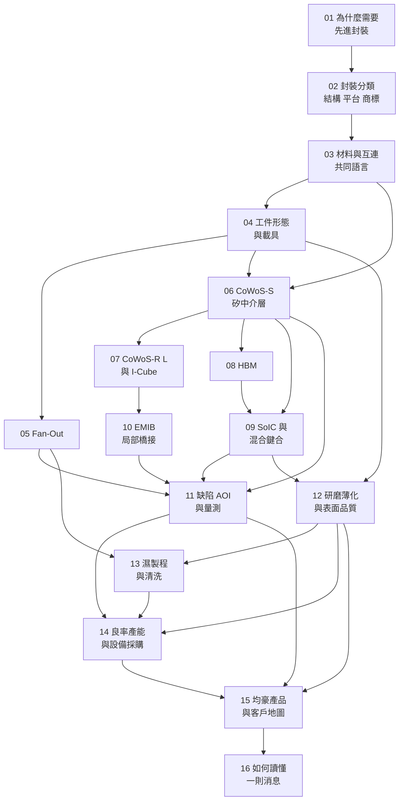

# 全書地圖

這一頁回答三個問題：每一章在做什麼、章與章之間誰依賴誰、以及你該從哪裡進入。

---

## 知識依賴圖

**圖 0-2**：章節依賴圖。箭頭代表「先讀比較好」，不是硬性順序。第 11–14 章匯集前面所有製程章的輸出，第 15 章匯集第 11–14 章，第 16 章匯集全書。

## 從哪裡進入

| 你的情況 | 建議路線 |
|---|---|
| 零製程背景，要從頭建立 | [01](01-why-advanced-packaging.md) → [16](16-reading-news.md) 依序 |
| 只想看得懂公司消息 | [01](01-why-advanced-packaging.md) → [02](02-packaging-taxonomy.md) → [04](04-workpiece-flow.md) → [11](11-defect-aoi-metrology.md) → [14](14-yield-capacity-capex.md) → [15](15-gpm-product-map.md) → [16](16-reading-news.md) |
| 製程／設備取向 | [03](03-materials-interconnect.md) → [05](05-fan-out.md) → [09](09-soic-hybrid-bonding.md) → [12](12-grinding-thinning.md) → [13](13-wet-process.md) |

導讀另有「已讀過《CoWoS 技術精讀筆記》」與「只有十分鐘」兩條，見[導讀](README.md)。

---

## 第一篇：建立封裝地圖

| 章 | 核心問題 | 讀完能做什麼 |
|---|---|---|
| [01 AI 晶片為什麼需要先進封裝](01-why-advanced-packaging.md) | 為什麼不能只把晶片做得更小？ | 說出頻寬、功耗、光罩尺寸、良率四條限制如何共同逼出封裝的答案 |
| [02 一次看懂 MCM、Fan-Out、2.5D 與 3D](02-packaging-taxonomy.md) | 這些名稱在描述什麼？ | 把任何封裝術語歸位到「結構／製程平台／商標」三層 |
| [03 封裝材料與互連的共同語言](03-materials-interconnect.md) | 電流與訊號究竟怎麼走？ | 追蹤一條訊號從 die 走到 PCB 的完整路徑，並說出每一段的名稱 |

---

## 第二篇：看懂實際製程

| 章 | 核心問題 | 讀完能做什麼 |
|---|---|---|
| [04 從晶圓到封裝成品](04-workpiece-flow.md) | 工廠裡的加工對象如何改變？ | 指出任一站點的加工對象是什麼形態、加工面在哪、靠什麼支撐 |
| [05 Fan-Out 製程全解析](05-fan-out.md) | 沒有中介層如何向外拉出互連？ | 說出 chip-first 與 chip-last 的取捨，以及 die shift 為什麼難 |
| [06 CoWoS-S：矽中介層](06-cowos-s.md) | 中介層帶來什麼能力與製造負擔？ | 分辨 CoW 與 WoS 兩段的意義與各自的設備需求 |
| [07 CoWoS-R、L 與 I-Cube](07-cowos-r-l-icube.md) | 為什麼中介層會出現不同做法？ | 用密度、尺寸、成本三個軸解釋各方案的位置 |
| [08 HBM：從 DRAM 晶粒到記憶體堆疊](08-hbm.md) | 做 HBM 與裝 HBM 有何不同？ | 畫出記憶體廠與封裝廠的責任分界 |
| [09 SoIC 與混合鍵合](09-soic-hybrid-bonding.md) | 間距縮小，製程要求如何改變？ | 說出混合鍵合對平坦度、粗糙度、潔淨度的要求為何是量級躍升 |
| [10 EMIB 與局部橋接](10-emib-bridge.md) | 為什麼只在晶粒之間放一小塊矽？ | 比較 EMIB 與 CoWoS-L 的橋接位置差異及其製程後果 |

---

## 第三篇：從製程走向設備

這一篇是全書的樞紐。**前面十章講「發生什麼事」，這一篇講「所以需要什麼機器」。**

| 章 | 核心問題 | 核心交付 |
|---|---|---|
| [11 缺陷、AOI 與量測](11-defect-aoi-metrology.md) | 怎麼知道這一步做對了？ | **「缺陷—形成站點—檢測方法—盲點」矩陣** |
| [12 研磨、薄化與表面品質](12-grinding-thinning.md) | 都叫研磨，加工對象與目的是否相同？ | **「加工對象—加工目的—指標—設備類型」表** |
| [13 濕製程、清洗與製程整合](13-wet-process.md) | 哪裡要移除材料，哪裡要保留？ | 濕製程站點圖與失效控制參數表 |
| [14 良率、產能與設備採購](14-yield-capacity-capex.md) | 需求增加，為什麼設備不一定等比例增加？ | **可重算的產能與良率算例** ＋ 驗證階段表 |

---

## 第四篇：回到均豪與公司消息

| 章 | 核心問題 | 核心交付 |
|---|---|---|
| [15 均豪的產品與客戶需求地圖](15-gpm-product-map.md) | 哪些製程需求能對上均豪的產品？ | **「公司主體—設備—站點—客戶—證據等級」矩陣** |
| [16 如何讀懂一則先進封裝消息](16-reading-news.md) | 怎樣從新聞形成可驗證的判斷？ | 八個完整案例 ＋ 一頁式消息分析卡 |

---

## 附錄

| 頁 | 用途 |
|---|---|
| [附錄 A 來源索引](appendix-sources.md) | 所有來源代號、時間錨點、已讀範圍、能支持什麼。**沒有代號的數字就是沒有來源** |
| [附錄 B 術語表](appendix-glossary.md) | 中英對照與首次定義位置 |
| [附錄 C 待查事項總表](appendix-open-questions.md) | 各章未結問題彙整，含「會推翻結論的觀察」 |
| [附錄 D 圖片來源](99-image-credits.md) | Wikimedia Commons 照片與示意圖的作者、授權與使用頁面 |

---

## 全書共用的三條紀律

這三條在每一章都適用，寫在這裡供隨時回查。

### 一、主體分離

| 主體 | 代號 | 做什麼 | 財務關係 |
|---|---|---|---|
| **均豪精密** | 5443 | Wafer 級：檢、量、磨、拋 | 本書主角 |
| **均華精密** | 6640 | Die 級：Chip Sorter、Die Bonder | 均豪持股約 56.8%，**併入合併報表** |
| **志聖工業** | 2467 | 前段製程設備 | 交叉持股，**不併入** |
| **東捷** | — | 承接聯盟溢出產能 | 2026-04 加入 G2C+ |

### 二、證據分級

| 標記 | 意思 |
|---|---|
| `[雙方公告]` | 交易雙方都有正式公告可對帳，且互相點名 |
| `[公司自述]` | 法說、年報、官網上公司自己說的 |
| `[媒體報導]` | 記者具名寫的 |
| `[業界消息]` | 媒體轉述未具名消息來源 |
| `[推論]` | 本書從結構或製程推導出來的 |
| `[未證實]` | 有人講過但沒有可查核依據 |

**證據等級只能往下標，不能往上升。** 詳見[附錄 A](appendix-sources.md)。

### 三、流程分級

書中出現的製程流程分三種，一律標示：

- **教學簡化流程**——為了說明因果而合併或省略站點
- **跨來源整理流程**——由多份公開資料拼接，未經任一廠商確認
- **公開技術文件流程**——出自原廠文件，標明版本與日期

**不得把通用流程寫成特定客戶未公開的實際流程。**

---

> ← 上一頁：[導讀](README.md)　｜　下一頁：[第 1 章 AI 晶片為什麼需要先進封裝](01-why-advanced-packaging.md)
