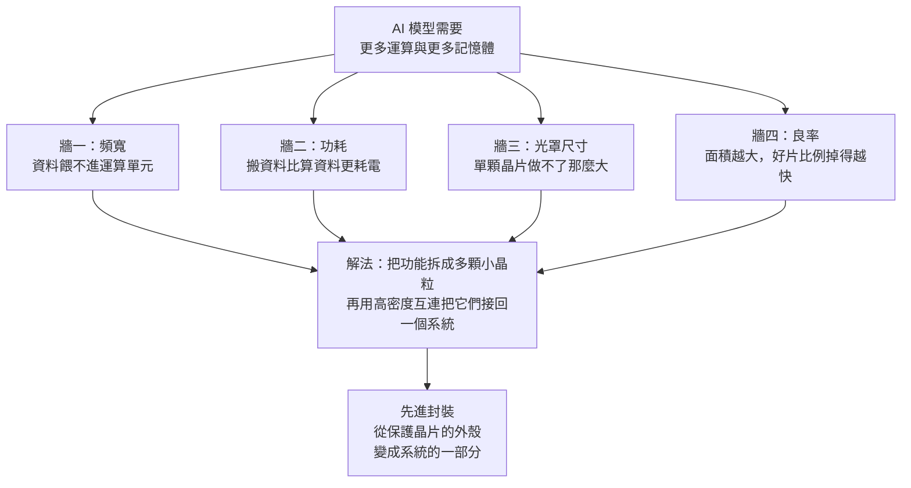
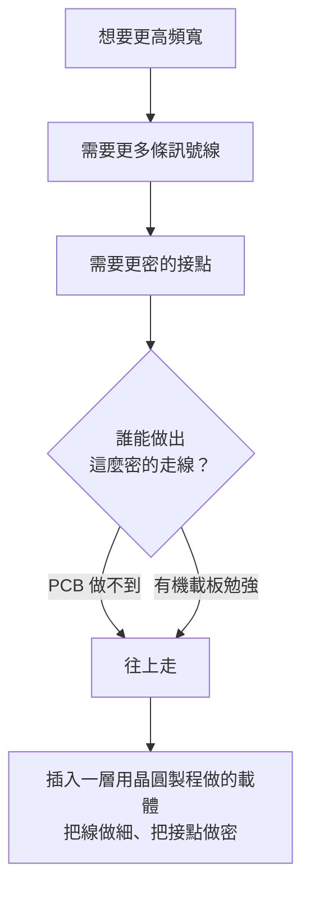
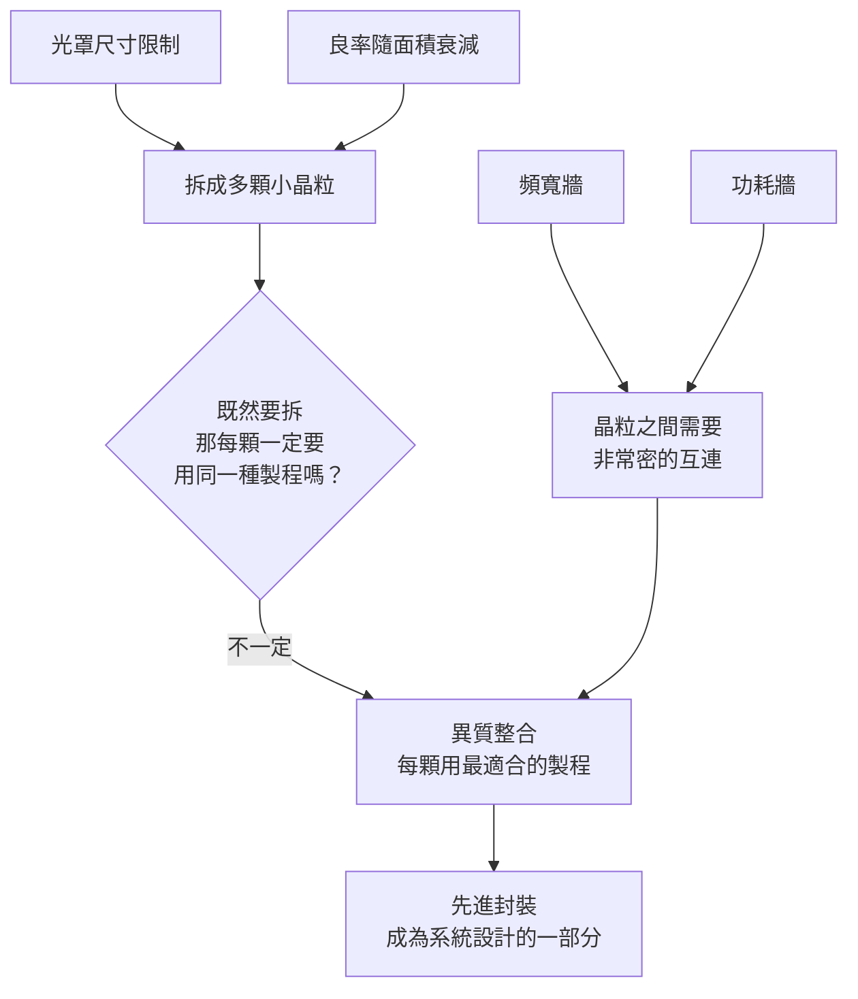
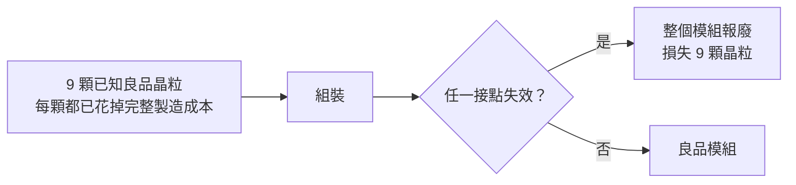

# 第 1 章：AI 晶片為什麼需要先進封裝？

## 開場問題

打開一張 AI 加速器模組的照片，你會看到一件很違反直覺的事：

**中間是一顆很大的運算晶片，旁邊圍著好幾疊記憶體，整組東西被固定在一塊比手掌還大的方形基板上。**

*2015 年 AMD Fiji（Radeon R9 Fury 系列）的封裝體：中間大塊是 GPU 晶粒，四周四疊是 HBM，它們共同坐在一片矽中介層上，中介層再接到有機載板。這就是開場那段描述的實物。它是「2.5D 加 HBM」這一類結構的公開照片，不是均豪的客戶產品，也不代表當代 AI 加速器的實際尺寸。*

一個外行人最自然的問題是：

> 半導體業五十年來的核心信念不就是「越做越小」嗎？為什麼最先進的 AI 晶片，反而變成一堆零件拼起來的、看起來很大的一塊東西？為什麼不乾脆把記憶體和運算做在同一顆晶片上就好？

這一章要回答的就是這一題。**答案不是「做不到」，而是「四道物理與經濟的牆同時擋在那裡」**——而先進封裝，是繞過這四道牆的方法。

先把結論放在前面，後面再一條一條拆：

**圖 1-1**：從系統需求走到封裝選擇的因果鏈。四道牆彼此獨立，但指向同一個解法。這張圖是全書的骨架——後面每一章都是在把某一格拆得更細。

---

## 先看結構：一個運算系統到底由什麼組成

在談封裝之前，要先知道一個運算系統需要哪些零件、它們彼此的相對位置。

一顆 AI 加速器（AI accelerator）從外面往裡面看，大致有四層：

| 層 | 是什麼 | 尺度量級 |
|---|---|---|
| **系統板** | PCB（Printed Circuit Board，印刷電路板） | 數十公分 |
| **封裝體** | 把晶粒固定、保護、對外接出的整個模組 | 數公分 |
| **晶粒（die）** | 從晶圓上切下來的那一小片矽 | 數毫米到數十毫米 |
| **電晶體** | 晶粒裡的最小開關元件 | 奈米 |

*一片做好電路、尚未切開的矽晶圓。每一小格就是一顆晶粒（die）。封裝廠收到的「來料」，常常就是這種圓片，或是已經切下來的小方塊。*

**「封裝（packaging）」指的是中間那兩層之間的所有事情**：怎麼把晶粒固定住、怎麼把訊號從晶粒表面接出去、怎麼把熱導走、怎麼讓它在 PCB 上被焊住。

傳統上，封裝的工作被理解成三件事：

1. **保護**——不讓矽裂、不讓水氣進去
2. **散熱**——把熱從矽帶到外面
3. **接線**——把晶粒上密密麻麻的接點，重新排列成 PCB 焊得動的間距

注意第 3 點。**晶粒上接點的間距，跟 PCB 能處理的間距，差了兩三個數量級。** 封裝從一開始就是一個「間距轉換器」：把非常細的東西，轉換成比較粗的東西。

**圖 1-2**：封裝最原始的功能，就是把兩種差好幾個數量級的間距接起來。先進封裝所做的，是在這個轉換的中途「插入更多層」，讓其中一段可以保持很細。

**這是理解整本書的第一個支點**：先進封裝之所以「先進」，不是因為外殼變厚變炫，而是因為**中途多插入的那幾層，是用晶圓製程做出來的**。詳細的層次結構在[第 3 章](03-materials-interconnect.md)。

---

## 逐步解釋：四道牆是怎麼形成的

以下把四道牆各寫成一個「輸入 → 操作 → 輸出 → 目的」的因果段落。這裡的「操作」指的是設計者被迫做的取捨，不是製程動作——製程要到[第 4 章](04-workpiece-flow.md)才開始。

### 牆一：頻寬牆——資料餵不進去

| 項目 | 內容 |
|---|---|
| **輸入** | 一顆運算晶片每秒能做的乘加運算量 |
| **操作** | 想把運算量提高，就要同步提高「每秒能送進來的資料量」 |
| **輸出** | 需要的記憶體頻寬（bandwidth）跟著運算量一起長 |
| **目的** | 讓運算單元不要在等資料 |

問題在於，**記憶體頻寬不是靠「把線跑快一點」就能無限提高的**。頻寬約略等於：

> 頻寬 ≈ 訊號線的條數 × 每條線每秒能傳的位元數

右邊那項（每條線的速度）受限於訊號完整性與功耗，提高得很慢。所以真正能大幅拉高頻寬的方式，是**增加線的條數**。

而線的條數，受限於一個非常實體的東西：**晶粒邊緣的長度**。所有對外的線都得從晶粒的周邊或底面出去，能塞多少條線，取決於「周長／面積」與「接點間距」。

這就把問題轉成了一個幾何問題：

**圖 1-3**：頻寬需求如何被翻譯成「需要一層更細的走線載體」。這條推理鏈的終點，就是[第 2 章](02-packaging-taxonomy.md)講的中介層與 RDL。

!!! note "HBM 為什麼長成堆疊的樣子"
    高頻寬記憶體（HBM，High Bandwidth Memory）解決同一個問題的方式是：**不要用少數幾條很快的線，改用非常多條慢一點的線。** 它的介面寬度是上千位元量級，遠遠超過傳統記憶體介面。代價是這麼寬的介面沒辦法拉到 PCB 上跑，必須跟運算晶片擺得很近、用封裝內的細線連起來。這就是為什麼 HBM 一定要跟運算晶片同封裝——它不是選擇，是介面寬度逼出來的結果。細節見[第 8 章](08-hbm.md)。

### 牆二：功耗牆——搬資料比算資料更貴

| 項目 | 內容 |
|---|---|
| **輸入** | 每搬一個位元要花的能量 |
| **操作** | 距離越遠、驅動的電容越大，每位元的能量越高 |
| **輸出** | 系統總功耗中，「資料搬運」那一塊的占比隨頻寬需求上升 |
| **目的** | 在有限的供電與散熱預算下，把運算做完 |

一個常被引用的量級關係是：**在晶粒內部搬一個位元的能量，比把它送出晶粒、走過封裝與 PCB 再送回來，要小一到兩個數量級。**（`[推論]`／通用量級，來源 T3；本書不給精確值，需要時請回原廠文件核對。）

這件事有兩個直接後果：

1. **距離要縮短。** 把 HBM 從 PCB 上挪到跟運算晶片並排、只隔幾毫米，每位元能量就顯著下降。這是先進封裝最直接的價值。
2. **功耗總量仍然在長。** 即使每位元變便宜，總資料量長得更快，所以整顆模組的功耗還是往上走。

均豪在 2026 年的法說裡引用過一組市場數字來描述這件事：**GPU 功耗 2025 年約 1,400 W，2027 年估約 3,600 W**（`[公司自述]` 引用之市場數字，G3，2026-08-12）。這個數字不是均豪的營收，也不是均豪自己的量測，它的作用是解釋**為什麼供電與散熱會變成封裝要解決的問題**。

功耗上去了，就要供更大的電流；電流大了，供電路徑上的電阻損耗就變成問題；於是載板要用更厚的銅、散熱結構要更貼近晶粒。**這條線一路會通到[第 12 章](12-grinding-thinning.md)的「厚銅載板研磨」**——一個看起來跟 AI 無關的加工需求，其實是從 GPU 功耗推出來的。

### 牆三：光罩尺寸牆——單顆晶片做不了那麼大

| 項目 | 內容 |
|---|---|
| **輸入** | 微影機台一次曝光能投影的最大面積 |
| **操作** | 晶粒的圖案是靠微影一次次曝光轉印到晶圓上 |
| **輸出** | 單一顆晶粒的面積有硬上限 |
| **目的** | ——這不是目的，這是限制 |

主流微影設備一次曝光的視野（field）尺寸大約是 **26 mm × 33 mm，約 860 mm² 量級**（26 × 33 = 858；業界通用規格，來源 T3）。這被稱為**光罩極限（reticle limit）**。

一顆晶粒**不能大於這個視野**，因為它的圖案必須在一次曝光裡完整轉印。

於是問題來了：如果一個 AI 系統所需要的邏輯電晶體數量，換算成面積已經超過這個曝光場，怎麼辦？

答案只有兩條路：

- **拼接曝光（stitching）**——技術上可行但代價高，且良率風險大
- **拆成多顆晶粒，再用封裝接起來**——這就是 Chiplet

均豪的 G2C 法說簡報引用過另一組數字來說明這個趨勢：**封裝面積相對光罩尺寸的倍數，2024 年約 3.3 倍，2029 年估達 14 倍以上**（`[公司自述]` 引用之市場數字，G1／G3）。

這句話翻成白話是：**未來的封裝體，會是單顆晶粒面積上限的十幾倍大。** 這正是為什麼「封裝」不再只是外殼——它已經變成一塊比晶粒大十倍的、需要自己走線與自己控制平坦度的**基板系統**。

!!! warning "這組數字的性質"
    3.3× → 14× 是均豪在法說簡報中**引用外部市場資料**，用來解釋自家設備需求的背景。它不是均豪的量測結果，也不是均豪的財務數字。本書引用它只做一件事：說明趨勢方向。精確值請回原始市場報告核對（見待查 1-2）。

    另：這組 **G3 的 3.3×**（2024 市場路線圖起點，會走到 14×）與[第 6 章](06-cowos-s.md) B1 所記 CoWoS-S「實務面積上限約 3.3–3.5 倍光罩」是**兩筆不同來源的主張**。待查 1-2 結案前不可合併，否則會以為 S 正在長到 14×。

### 牆四：良率牆——面積越大，好片越少

| 項目 | 內容 |
|---|---|
| **輸入** | 晶圓上隨機分布的缺陷密度 |
| **操作** | 把晶圓切成一顆顆晶粒；任何一顆晶粒只要壓到一個致命缺陷就報廢 |
| **輸出** | 晶粒面積越大，「完全沒踩到缺陷」的機率越低 |
| **目的** | 控制每顆好晶粒的成本 |

這是本章唯一需要一點算術的地方，但邏輯非常直觀。

假設缺陷在晶圓上隨機散布，密度是每平方公分 D 個。一顆面積 A 的晶粒完全沒踩到缺陷的機率，量級上會像：

> 良率 ≈ e^(−D × A)

關鍵不在這條式子本身，而在它的形狀：**指數衰減。面積加倍，良率不是打八折，是平方。**

用一組**本書自建的假設數字**示範（`[推論]`，非產業數據，僅示範計算方法）：

| 晶粒面積 | 相對良率 | 每片晶圓拿到的好晶粒（相對值） |
|---|---|---|
| 100 mm²（基準） | 高 | 多 |
| 400 mm²（4 倍面積） | 明顯下降 | 每顆好晶粒的成本上升 |
| 800 mm²（接近光罩極限） | 大幅下降 | 每顆好晶粒的成本上升更快 |

（本表刻意不填精確百分比。**沒有可靠的缺陷密度來源時，填入看似精確的良率數字是誤導。** 可重算的完整算例放在[第 14 章](14-yield-capacity-capex.md)，該章的所有假設都會明示。）

**這條牆的實務意義**：把一顆 800 mm² 的大晶片拆成四顆 200 mm² 的小晶粒，即使功能完全一樣，每顆小晶粒的良率都遠高於大晶片。挑掉壞的、只用好的，總成本可能反而更低。

### 四道牆的交會點：Chiplet 與異質整合

把四條線放在一起，會指向同一個設計決策：

**圖 1-4**：四道牆匯流成 Chiplet 與異質整合。左半支解釋「為什麼要拆」，右半支解釋「拆完為什麼接得起來才有用」。

**Chiplet（小晶粒）** 指的是：把原本一顆大晶片的功能，拆成多顆各自獨立製造、再組裝回一個系統的小晶粒。

**異質整合（heterogeneous integration）** 是它的自然延伸。既然已經要拆，那就沒有理由要求每一塊都用同一種製程：

| 功能區塊 | 適合的製程 | 為什麼 |
|---|---|---|
| 邏輯運算 | 最先進節點 | 電晶體密度與速度是關鍵 |
| SRAM 快取 | 先進節點但微縮較慢 | 記憶體單元不隨邏輯等比縮小 |
| 類比與 I/O | 成熟節點 | 類比電路不太受益於微縮，且成熟節點便宜、可靠 |
| 記憶體堆疊 | 記憶體專用製程 | 跟邏輯製程完全不同 |

**這張表是「異質整合」四個字的全部內容**：讓每一塊用它最划算的製程，再靠封裝接回一個系統。

!!! danger "一個容易被跳過的代價"
    Chiplet 不是免費的。拆開之後，**原本在晶片內部的連線，變成了需要跨越封裝的連線**。這些連線每一條都是新的失效點，也都需要能量去驅動。所以 Chiplet 只有在「拆開省下的良率與製程成本」大於「跨晶粒互連的代價」時才划算。**封裝技術的進步，就是在不斷把右邊那項壓低。**

---

## 失敗會長什麼樣子

這一章談的是系統層級的決策，所以「缺陷」不是製程上的刮傷，而是**判斷失誤**與**系統層級的失效**。

| 失敗模式 | 怎麼發生 | 影響什麼 |
|---|---|---|
| **強行做超大單晶片** | 不拆，硬把面積推到光罩極限 | 良率指數下滑，每顆好晶粒成本失控 |
| **拆了但互連不夠密** | 拆成多顆，卻只用載板走線連接 | 跨晶粒頻寬變成新瓶頸，運算單元閒置 |
| **拆了但功耗更差** | 互連距離沒縮短 | 每位元能量上升，系統功耗預算被搬運吃掉 |
| **封裝良率吃掉晶粒良率** | 把多顆好晶粒組進一個封裝，任一顆或任一接點壞掉，整個封裝報廢 | **封裝良率是乘法** |

最後一項值得單獨講。

假設一個封裝裡有 1 顆運算晶粒加 8 顆 HBM 堆疊，總共 9 個元件。就算每個元件單獨都是好的，只要**組裝過程**讓其中任何一個接不上，整個模組就報廢——而此時報廢掉的，是九顆已經花了完整製造成本的好晶粒。

**圖 1-5**：先進封裝的損失結構。越往後段，一次失效的代價越高。這解釋了為什麼封裝廠會願意在檢測與量測上投入——**在這裡多攔下一片，省下的是九顆晶粒。**

**這就是本書後半所有檢測、量測需求的經濟基礎。** 不是「檢測比較先進」，而是**後段的失效代價高到讓檢測變成划算的投資**。

---

## 如何檢查與控制

這一章的層次還沒有進到製程站點，所以「檢查」指的是**系統層級的判斷指標**。這些指標在後面章節會被逐步換成具體的量測項目。

| 想控制什麼 | 系統層級指標 | 後面會變成什麼 |
|---|---|---|
| 資料餵得夠不夠 | 每秒頻寬、每毫米晶粒邊緣可提供的頻寬 | 互連密度、間距（[第 3 章](03-materials-interconnect.md)） |
| 搬資料花多少電 | 每位元能量（pJ/bit 量級） | 互連長度與結構選擇（[第 2 章](02-packaging-taxonomy.md)） |
| 晶粒好不好 | 晶粒良率 | 缺陷密度、缺陷分類（[第 11 章](11-defect-aoi-metrology.md)） |
| 組裝會不會毀掉好晶粒 | 已知良品晶粒（KGD，Known Good Die）比例、封裝良率 | 組裝前後的檢測站點（[第 11 章](11-defect-aoi-metrology.md)、[第 14 章](14-yield-capacity-capex.md)） |

### 一個關鍵概念：KGD（Known Good Die，已知良品晶粒）

因為封裝良率是乘法，所以在把晶粒組進封裝**之前**，必須盡可能確認它是好的。

這件事聽起來理所當然，實際上很難：一顆還沒封裝、還沒接線的裸晶，要怎麼完整測試它？測試探針的間距能不能對上晶粒上越來越密的接點？

**KGD 的難度，本身就是先進封裝的核心挑戰之一。** 它會在[第 4 章](04-workpiece-flow.md)（測試發生在工件形態的哪一步）和[第 14 章](14-yield-capacity-capex.md)（累積良率）再出現。

---

## 與均豪的連結

本章是系統層級的因果建立，**不涉及任何具體製程站點**，因此與均豪的連結只有一種：均豪在公開場合**引用哪些市場數字來解釋自家設備需求**。這些引用本身是 `[公司自述]`（引用行為是事實），但被引用的數字是外部市場資料。

### ✅ 已確認事實

- 均豪在 2026 年三場法說中，把先進封裝與再生晶圓列為雙主軸，並在 2026-08-12 補上第三條線：PMIC／AI 電源管理相關的載板研磨與檢測。`[公司自述]`（G2、G3、G4）
- 均豪在 2026-08-12 法說中引用「GPU 功耗 2025 年 1,400 W → 2027 年估 3,600 W」，用以說明高導熱厚銅載板需求的來源。`[公司自述]`（引用行為）；被引用數字為外部市場資料（G3）
- 均豪法說引用「CoWoS 月產能 2023 年 1.3 萬片 → 2027 年估 20 萬片」，以及「封裝面積相對光罩尺寸 2024 年 3.3× → 2029 年 14× 以上」。`[公司自述]`（引用行為）（G1、G3）。簡報是否點名 TSMC，待核對原文（待查 1-2）；本書不在此補上公司名。
- 均豪法說引用「每片先進封裝晶圓約搭配 2.5 片循環使用載具」，並以此推導 Carrier AOI 的需求量。`[公司自述]`（G1、G3）

### 🔶 合理推論

- 本章的四道牆解釋了**為什麼封裝體會越來越大、越來越平、越來越需要控制厚度與表面品質**。這正好對應到「檢、量、磨、拋」四類設備存在的理由。但這只說明了**設備類別的需求方向**，沒有說明均豪拿到哪一條產線的訂單。`[推論]`
- 功耗上升 → 大電流 → 厚銅載板 → 需要大面積平坦化加工，這條推理鏈與均豪 2026 H1「PMIC 占母公司半導體營收由 1% 升至 19%」的公開數字方向一致。**方向一致不等於因果證實**——本書無法從公開資料驗證那 19% 的具體產品與客戶組合。`[推論]`（數字本身為 `[公司自述]`，G3）

### ❓ 尚待查證

- 均豪法說引用的市場數字（GPU 功耗、CoWoS 產能、光罩倍數、載具用量）**原始出處未在筆記中留下引用來源**。本書無法核對其定義與統計口徑。
- 「每片先進封裝晶圓搭配約 2.5 片循環載具」這個比例的來源與適用範圍（是哪一種封裝平台？哪一個世代？）未見公開說明。這個比例直接影響 Carrier AOI 的市場規模推估，卻是整條推理中最未經檢驗的一環。

!!! danger "本章不能推出的結論"
    「AI 需要先進封裝 → 先進封裝需要檢測與研磨 → 均豪做檢測與研磨 → 均豪受惠於 AI」——**這個四段論在本書全程無效**。中間缺的是「均豪的設備賣給誰、用在哪一條線、什麼時候認列」。這三題要到[第 15 章](15-gpm-product-map.md)才有資格回答，而且答案的證據等級參差不齊。

---

## 理解檢查

???+ question "Q1：如果明天有人發明了一種微影設備，一次曝光可以做到 3,000 平方毫米，Chiplet 就沒有存在必要了嗎？"
    **不會。** 光罩尺寸只是四道牆的其中一道。

    - **良率牆還在**：3,000 mm² 的單顆晶粒，良率會低到難以接受（指數衰減）。
    - **異質整合的動機還在**：類比電路與 I/O 不受益於最先進節點，硬把它們做在最貴的製程上是浪費。
    - **記憶體的動機還在**：HBM 用的是記憶體專用製程，本來就不可能跟邏輯做在同一片晶圓上。

    所以光罩限制放寬會讓「拆不拆」的計算改變，但不會讓 Chiplet 消失。**這一題的訓練目的是：不要把多重原因的結果，歸給單一原因。**

???+ question "Q2：為什麼 HBM 一定要跟運算晶片放在同一個封裝裡？請從介面寬度回答。"
    因為 HBM 的介面是**極寬、極多條線**的設計（上千位元量級），而不是少數幾條超高速線。

    這麼多條線沒辦法拉到 PCB 上：PCB 的線寬與間距做不到那個密度，而且訊號要跑那麼長的距離，每位元能量會爆掉。

    所以 HBM 的介面寬度**本身就強制**了它必須跟運算晶片距離很近、用封裝內的細線連接。**「HBM 需要先進封裝」不是行銷語言，是介面設計的必然後果。**

???+ question "Q3：某公司說「我們把一顆 800 mm² 的晶片拆成四顆 200 mm² 的 chiplet，所以成本下降」。這句話一定成立嗎？要成立需要什麼條件？"
    **不一定成立。** 拆開會省下良率成本，但同時增加三筆代價：

    1. **互連成本**：原本在晶片內部免費的連線，現在要跨越封裝，需要 bump／RDL／中介層等結構。
    2. **面積開銷**：每顆 chiplet 都要留出對外介面的實體面積（介面電路與接點），四顆的介面面積總和大於一顆。
    3. **封裝良率風險**：四顆晶粒要組進一個封裝，任一個組裝失效就報廢四顆好晶粒。

    **成立條件**：省下的良率成本 > 互連成本 + 面積開銷 + 封裝報廢的期望損失。晶片面積越大、製程節點越先進（單位面積越貴），左邊越容易贏——這就是為什麼 Chiplet 先出現在最大最貴的晶片上。

???+ question "Q4：本章說「封裝良率是乘法」。這對設備商的意義是什麼？"
    意義是：**檢測與量測設備的價值，隨著製程往後段推進而上升。**

    在晶圓前段攔下一個缺陷，損失的是那一小塊面積；在封裝組裝後才發現問題，損失的是整個模組裡所有已完成的晶粒。同一台檢測設備，放在後段能防止的損失金額大得多。

    這解釋了兩個現象：
    - 為什麼封裝廠會新增「前段來料檢查」這種站點——**因為它不再願意信任前一站交出來的東西**（均豪 2026-08 法說新增揭露此站點，`[公司自述]` G3）。
    - 為什麼先進封裝的檢測站點數量會比傳統封裝多。

???+ question "Q5：均豪法說引用「GPU 功耗 2027 年估 3,600 W」。這個數字可以用來估算均豪 2027 年的營收嗎？"
    **不可以，而且中間缺了至少四步。**

    1. 這是**外部市場預估**，不是均豪的量測或財測。均豪只是引用它來解釋需求方向。
    2. 從「GPU 功耗上升」到「厚銅載板需求上升」是合理但未經量化的推論。
    3. 從「厚銅載板需求上升」到「載板研磨設備需求上升」還要看客戶是否用研磨這條路解決，以及既有產能夠不夠。
    4. 從「設備需求上升」到「均豪拿到訂單」需要客戶關係的證據——這要到[第 15 章](15-gpm-product-map.md)的矩陣才查得到，而且大多數列的證據等級只有 `[媒體報導]` 或 `[公司自述]`。

    **把市場趨勢數字直接換算成單一設備商的營收，是本書要防的第一種錯誤。**

---

## 來源與待查事項

### 本章來源

| 主張 | 來源 | 等級 | 日期 |
|---|---|---|---|
| 光罩視野約 26 mm × 33 mm（約 860 mm² 量級） | T3 | 業界通用規格；與第 6 章 858 mm² 為同一量級 | 未於本次重新取用 |
| 頻寬 ≈ 線數 × 每線速率的分解 | T3 | 教科書級通用原理 | 未於本次重新取用 |
| 搬運能量隨距離上升，量級差一至兩個數量級 | T3 | 通用量級，**本書不給精確值** | 未於本次重新取用 |
| HBM 介面為上千位元量級 | M1、M2 | 標準規格；各世代需分列 | 未於本次重新取用 |
| 良率隨面積指數衰減的形狀 | T3 ＋ 本書自建示意 | **教學用，非產業數據** | 本書自建 |
| GPU 功耗 1,400 W → 3,600 W | G3 | `[公司自述]`（引用外部市場資料） | 2026-08-12 法說 |
| CoWoS 月產能 1.3 萬 → 20 萬片 | G3 | 同上 | 2026-08-12 法說 |
| 封裝面積相對光罩倍數 3.3× → 14× 以上 | G1、G3 | 同上；**不是** CoWoS-S 面積上限（B1，見第 6 章） | 2026 法說簡報 |
| 每片先進封裝晶圓約搭配 2.5 片循環載具 | G1、G3 | 同上 | 2026 法說簡報 |
| 均豪雙主軸與 PMIC 第三條線 | G2、G3、G4 | `[公司自述]` | 2026-03／06／08 法說 |
| PMIC 占母公司半導體營收 1% → 19% | G3 | `[公司自述]` | 2026-08-12 法說 |

各代號定義見[附錄 A 來源索引](appendix-sources.md)。

### 待查事項

| # | 問題 | 為什麼重要 | 會怎麼查 |
|---|---|---|---|
| 1-1 | 目前世代 HBM 的介面寬度與每堆疊頻寬的官方規格為何？ | 本章只給了量級；第 8 章需要按世代分列 | JEDEC 標準、SK hynix／Samsung／Micron 官方技術頁 |
| 1-2 | 均豪引用的「光罩倍數 3.3× → 14×」原始出處為何？定義是封裝面積還是中介層面積？ | 定義不同會讓倍數意義完全不同 | 法說簡報原檔的引用標註、原始市場報告 |
| 1-3 | 「每片先進封裝晶圓搭配 2.5 片循環載具」的適用平台與世代？ | 直接決定 Carrier AOI 市場規模推估的可信度 | 法說 Q&A、展場技術資料、載具供應商公開資料 |
| 1-4 | 各節點的缺陷密度是否有可引用的公開數字？ | 沒有它就無法把良率算例從「示意」升級為「估算」 | 學術論文、晶圓廠技術發表；多半不公開，可能永遠停在示意 |
| 1-5 | 跨晶粒互連的每位元能量，在不同封裝平台上的量級差異？ | 決定「拆開划不划算」這道計算的右半邊 | ECTC／ISSCC 論文、平台白皮書 |

---

> 下一頁：[第 2 章 一次看懂 MCM、Fan-Out、2.5D 與 3D](02-packaging-taxonomy.md)　｜　相關頁面：[第 3 章 封裝材料與互連的共同語言](03-materials-interconnect.md) ｜ [第 8 章 HBM](08-hbm.md) ｜ [第 14 章 良率、產能與設備採購](14-yield-capacity-capex.md) ｜ [第 15 章 均豪產品地圖](15-gpm-product-map.md)
