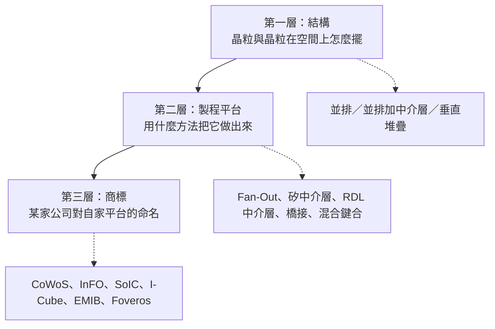
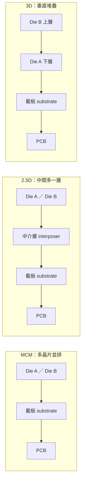
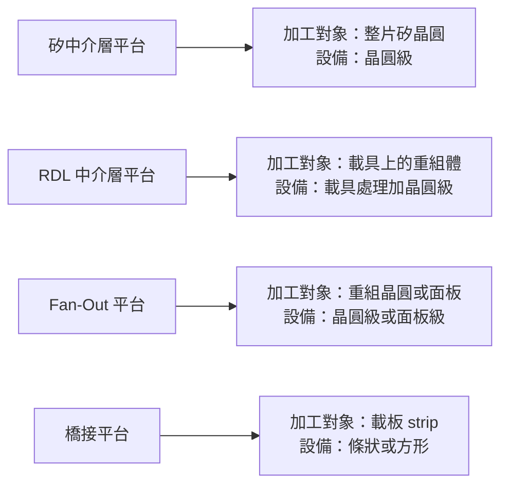
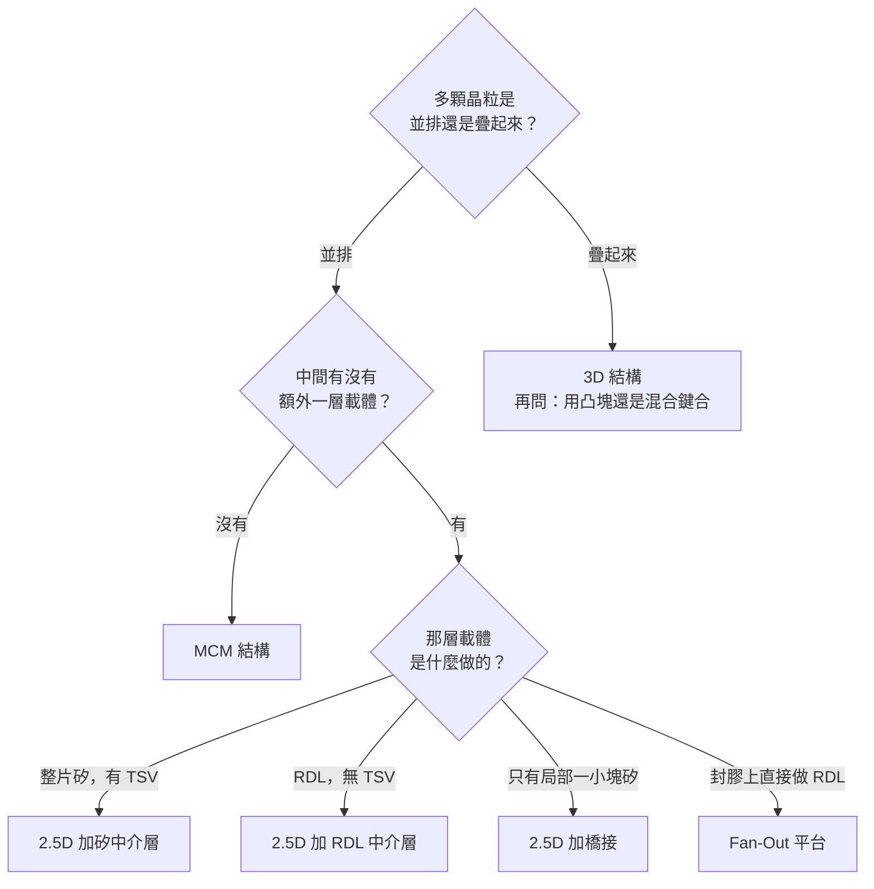

# 第 2 章：一次看懂 MCM、Fan-Out、2.5D 與 3D

## 開場問題

你在一週內看到三則新聞：

- A 公司宣布「2.5D 封裝產能擴充」
- B 公司宣布「導入 Fan-Out 面板級封裝」
- C 公司宣布「CoWoS-L 產能明年翻倍」

一個很自然的問題是：**這三家在做同一件事嗎？誰跟誰是競爭關係？**

如果你把「2.5D」「Fan-Out」「CoWoS-L」當成三個並列的技術選項，你會得到錯誤的答案。因為這三個詞根本不在同一個抽象層次上——就像問「轎車、四輪傳動、Toyota Camry 哪個比較好」一樣。

這一章要做的事只有一件：**把封裝術語拆成三個層次，之後全書都靠這個分層說話。**

---

## 先看結構：三個層次

**圖 2-1**：封裝術語的三層結構。新聞裡的詞常常橫跨三層而不自覺，讀者要自己歸位。

### 第一層：結構——晶粒怎麼擺

這一層只回答一個幾何問題：**多顆晶粒（die）在空間上的相對位置。**

| 結構 | 幾何 | 晶粒之間怎麼通訊 |
|---|---|---|
| **單晶片封裝** | 一顆 die 放在載板上 | 不需要 die 間互連 |
| **MCM（Multi-Chip Module，多晶片模組）** | 多顆 die 並排在同一片載板上 | 走載板上的線路 |
| **2.5D** | 多顆 die 並排在**一層中介物**上，中介物再放到載板 | 走中介物上的細線 |
| **3D** | 多顆 die **垂直疊起來** | 走穿過晶粒本體的垂直通道 |

「2.5D」這個名字的由來就是：它不是平面（2D），但也沒有真的把晶粒疊起來（3D），所以是「二點五維」。**中介物是它的定義特徵。**

**圖 2-2**：同一視角下三種結構的層次比較。箭頭代表「疊在上面」的關係，由上往下讀。注意 2.5D 比 MCM 多的正是中介層那一層，而 3D 少掉的是「並排」這件事。

*單晶粒封裝長這樣：深色那塊是矽晶粒，黃色是有機載板（這裡是 flip-chip BGA）。晶粒已經「翻過來」用凸塊接到載板，不是用金線從正面拉出去。這張對應上表的「單晶片封裝」，還沒有中介層、也沒有並排的第二顆晶粒。*

.PNG)
*Package-on-Package（PoP）把兩顆已經封好的體再疊起來。它是「3D」的一種日常例子，但疊的是封裝體，不是晶粒對晶粒的矽穿孔堆疊。看到「3D」兩個字，要先問：疊的是 die，還是已經封好的 package？*

*BGA 記憶體模組：每顆 IC 底部是焊球陣列，焊在 PCB 上。這是傳統「封裝體對外」的接法——間距已經粗到 PCB 焊得動。先進封裝要解決的，是在到達這一層之前，先用更細的接點把多顆晶粒連在一起。*

### 為什麼多一層中介層值得？

因為**線路的密度受限於載體的製造能力**。

| 載體 | 典型線寬／間距量級 | 製造方式 |
|---|---|---|
| PCB | 數十至上百微米 | 印刷電路板製程 |
| 有機載板（substrate） | 約十微米量級 | 增層法（build-up） |
| 矽中介層 | **次微米至數微米** | 半導體晶圓製程 |

差了兩三個數量級。當兩顆晶粒之間需要幾千條、上萬條連線（例如運算晶片對 HBM 記憶體），載板做不出那麼細的線，就只好在中間插入一片用**晶圓製程**做出來的載體。這就是中介層存在的唯一理由：**借用晶圓廠的線寬能力，來做封裝層級的走線。**

這個因果在[第 1 章](01-why-advanced-packaging.md)已經建立；這裡只是把它落到「結構」這一層。

---

## 第二層：製程平台——怎麼做出來

同樣是「2.5D 結構」，可以用完全不同的方法做出來。這一層才是**設備需求真正分岔的地方**——也是設備商該關心的層次。

| 平台 | 中介物是什麼 | 怎麼做出來 | 對設備的意義 |
|---|---|---|---|
| **矽中介層（Si interposer）** | 一整片薄化的矽 | 在矽晶圓上做 RDL 與 TSV，再薄化 | 需要晶圓級微影、TSV 蝕刻與填充、**大量背磨與 CMP** |
| **RDL 中介層（無 TSV）** | 直接長出來的重佈線層 | 在載具上逐層做 RDL，做完把載具解掉 | 需要**臨時載具貼合與解黏**、RDL 平坦度控制 |
| **橋接（bridge）** | 只在需要的地方埋一小塊矽 | 把小矽片嵌進載板或封膠層 | 需要**局部對位精度**、嵌入深度控制 |
| **Fan-Out** | 沒有中介物，互連從晶粒往外「扇出」 | 把晶粒重組排列後封膠，直接在封膠面上做 RDL | 需要**重組、封膠、封膠研磨、載具處理** |
| **混合鍵合（hybrid bonding）** | 不用凸塊，銅對銅直接接合 | 把兩個超平整表面直接貼合再退火 | 對**平坦度、粗糙度、潔淨度**要求最嚴苛 |

*傳統打線（wire bonding）：晶粒正面朝上，用金屬線把接墊拉到引腳。線的條數受晶粒周長限制，這正是[第 1 章](01-why-advanced-packaging.md)頻寬牆的幾何來源。先進封裝改走晶粒底面的凸塊或銅對銅，就是為了把「周長」換成「整個底面積」。*

!!! note "Fan-Out 為什麼常被單獨拿出來講"
    Fan-Out 有點特殊：它既可以做出 MCM 式的結構（多顆 die 並排在同一塊封膠裡），也可以透過多層 RDL 做出接近 2.5D 的密度。**所以「Fan-Out」是製程平台，不是結構分類**——這正是開場那三則新聞無法直接比較的原因之一。詳見[第 5 章](05-fan-out.md)。

### 一個關鍵觀察：加工對象決定設備

上表最後一欄透露了本書的主軸。**同樣叫做「先進封裝」，不同平台需要的設備差異，主要來自加工對象的形態不同**：

**圖 2-3**：製程平台 → 加工對象 → 設備形態的推導鏈。這條鏈是[第 4 章](04-workpiece-flow.md)與[第 12 章](12-grinding-thinning.md)的骨架。

---

## 第三層：商標——誰家的名字

這一層最容易誤導人，因為**商標名稱不告訴你結構，也不完全告訴你平台**。

| 商標 | 公司 | 對應結構 | 對應平台 |
|---|---|---|---|
| **CoWoS-S** | TSMC | 2.5D | 矽中介層 |
| **CoWoS-R** | TSMC | 2.5D | RDL 中介層（無 TSV） |
| **CoWoS-L** | TSMC | 2.5D | 局部矽橋接加 RDL |
| **InFO** | TSMC | 依產品而異 | Fan-Out |
| **SoIC** | TSMC | 3D | 混合鍵合 |
| **I-Cube** | Samsung | 2.5D | 矽中介層（各版本細節須按來源分列） |
| **EMIB** | Intel | 2.5D | 嵌入式橋接 |
| **Foveros** | Intel | 3D | 面對面堆疊 |

**兩個立刻可以得到的結論：**

1. **CoWoS 不是一個技術，是一個家族。** CoWoS-S 與 CoWoS-L 的中介物做法完全不同，用到的設備也不同。看到「CoWoS 產能」的新聞，要先問是哪一個。
2. **同結構不同公司，不代表可互換。** EMIB 與 CoWoS-L 都是「用橋接做 2.5D」，但橋接埋在哪裡不一樣（見[第 10 章](10-emib-bridge.md)），製程站點因此不同。

### 「2.3D」是什麼？

你會在部分廠商（尤其是 OSAT，封測服務業者）的資料裡看到 **2.3D** 這個詞。

這**不是一個業界統一定義的分類**。它通常用來描述「比純 2D 密、但沒有用到矽中介層與 TSV」的方案——也就是用有機材料或高密度 RDL 做出中介層功能。不同公司對 2.3D 的界線畫法不同。

**處理原則：看到 2.3D，不要當成一個明確技術，要回頭問它的中介物是什麼材料、有沒有 TSV。** 問完這兩題，它自然會落回上面的第一層與第二層。

---

## 失敗會長什麼樣子

分類搞錯，實務上會產生四種可預期的錯誤。這一節不是抽象警告——它們對應到本書後面章節的具體判斷。

| 錯誤 | 長什麼樣子 | 後果 |
|---|---|---|
| **層次混用** | 「這家做 2.5D，那家做 Fan-Out，兩家在競爭」 | 可能根本不衝突：Fan-Out 也能做出 2.5D 級的互連 |
| **家族當單品** | 「CoWoS 擴產，所以所有 CoWoS 設備商受惠」 | S、R、L 用的設備不同；擴的是哪一種決定誰受惠 |
| **商標當結構** | 「EMIB 跟 CoWoS-L 一樣，所以製程一樣」 | 橋接的嵌入位置不同，站點與設備不同 |
| **世代混寫** | 把 I-Cube 早期版本的規格套到最新版 | 規格錯誤，且無法追溯是哪裡錯 |

**最貴的一種錯誤是「家族當單品」**，因為它看起來最合理。第 6、7 章會反覆回到這一點。

---

## 如何檢查與控制：四個問題

拿到任何一個封裝術語，依序問就能歸位：

**圖 2-4**：封裝術語歸位決策樹。任何商標名稱都能透過這幾題落到結構與平台上；答不出來的，就是資料不足，應標為待查。

這幾題也是[第 16 章](16-reading-news.md)消息分析模板的第一步。

---

## 與均豪的連結

本章是分類框架，不涉及特定製程站點，因此與均豪的連結**只有一條，而且是方法論層次的**。

### ✅ 已確認事實

- 均豪在 2026 年的三次法說中，把先進封裝列為主軸之一，公開提到的相關產品包含 Carrier AOI、白光干涉量測、研磨與拋光設備。`[公司自述]`（G2、G3、G4）
- 均豪的核心能力被公司自己歸納為「**檢、量、磨、拋**」四個字。`[公司自述]`（G1、G6）

### 🔶 合理推論

- 「檢、量、磨、拋」四種能力**橫跨上表的多個製程平台**，不專屬於某一個商標。這代表：從商標層次（CoWoS-L、SoIC）去推論均豪的受惠程度，方向是錯的；正確做法是從**製程平台 → 加工對象 → 站點**去推。`[推論]`
- 因此本書第 11–14 章會先把站點與設備需求建立起來，第 15 章才做對應。

### ❓ 尚待查證

- 均豪的公開資料**沒有**按 CoWoS-S／R／L 分別揭露設備對應關係。本書無法從公開來源判斷其設備進入的是哪一個子平台。

!!! danger "本章不能推出的結論"
    「CoWoS 需要 AOI 與研磨；均豪做 AOI 與研磨；所以均豪供應 CoWoS 產線」——**這個三段論在本書全程無效**。設備類別能用於某製程，與某公司已供應該製程，是兩件需要各自舉證的事。這是[第 15 章](15-gpm-product-map.md)整章存在的理由。

---

## 理解檢查

???+ question "Q1：某新聞寫「A 公司採用 2.5D 封裝，B 公司採用 Fan-Out 封裝」。這兩家一定在做不同的事嗎？"
    **不一定。**「2.5D」是結構層次的描述，「Fan-Out」是製程平台層次的描述，兩者不互斥。Fan-Out 平台可以做出並排晶粒加高密度 RDL 的結果，在結構上就是 2.5D。

    要判斷是否真的不同，得追問：B 公司的 Fan-Out 有沒有中介物？RDL 幾層？線寬多少？答完才知道兩者的實際互連密度是否可比。

???+ question "Q2：「CoWoS 產能明年翻倍」這則消息，對一家做 TSV 蝕刻設備的公司和一家做封膠研磨設備的公司，意義相同嗎？"
    **不同，而且可能相反。**

    - CoWoS-**S** 用矽中介層，需要 TSV，TSV 設備受惠。
    - CoWoS-**R** 用 RDL 中介層，**沒有 TSV**，TSV 設備不受惠。
    - CoWoS-**L** 用局部矽橋接加 RDL，橋接小片仍需 TSV，但數量與面積遠小於全矽中介層。

    所以「CoWoS 擴產」這五個字本身不足以推導設備需求。必須先確認擴的是哪一個子平台、以及新增的是哪些站點。這是「家族當單品」錯誤的典型例子。

???+ question "Q3：為什麼「中介層」值得多付一層成本？請用兩句話說明因果。"
    因為**晶粒之間需要的連線密度，超過載板製程的線寬能力**（差了兩到三個數量級）。中介層是用晶圓製程做出來的載體，把晶圓廠的線寬能力借到封裝層級來用。

    延伸判斷：如果某個產品的 die 間連線數量不多，中介層就不划算，這就是 MCM 至今仍大量存在的原因。

???+ question "Q4：你看到某 OSAT 宣稱自己的「2.3D」方案「接近矽中介層效能但成本更低」。你應該先問哪兩個問題？"
    1. **中介物是什麼材料？**（有機／玻璃／高密度 RDL）
    2. **有沒有 TSV？**

    答完這兩題，這個方案就會落回本章第二層的某一格（多半是「RDL 中介層」），然後就能用該平台的已知取捨去評估「接近效能」這句話的可信度。2.3D 本身不是統一定義的分類，不能直接拿來比較。

???+ question "Q5：一家設備商說「我們的設備可用於 CoWoS」。要把這句話變成可驗證的判斷，你至少需要補上哪三項資訊？"
    1. **哪一個子平台**（S／R／L），因為站點不同。
    2. **哪一個站點**（例如：中介層薄化後的 AOI、載具檢測、封膠研磨），因為「可用於」可能只是能力宣稱。
    3. **證據等級**：是雙方公告、公司自述，還是媒體轉述的業界消息？

    缺少任何一項，這句話都只能停在「能力宣稱」，不能升級為「供應關係」。

---

## 來源與待查事項

### 本章來源

| 主張 | 來源 | 等級 | 日期 |
|---|---|---|---|
| 封裝結構分類（MCM／2.5D／3D） | T1、T3 | 業界通用定義 | 未於本次重新取用 |
| CoWoS 家族的子平台差異 | T1、B1 | 官方分類加本書庫既有整理 | 未於本次重新取用 |
| I-Cube 版本差異須按來源分列 | T4 | 官方 | 未於本次重新取用 |
| EMIB／Foveros 對應 | I1、I2 | 官方 | 未於本次重新取用 |
| 均豪「檢、量、磨、拋」定位 | G1、G6 | `[公司自述]` 加 `[媒體報導]` | 2026-08-31 快照 |
| 均豪先進封裝為主軸之一 | G2、G3、G4 | `[公司自述]` | 2026-03／06／08 法說 |

各代號定義見[附錄 A 來源索引](appendix-sources.md)。

### 待查事項

| # | 問題 | 為什麼重要 | 會怎麼查 |
|---|---|---|---|
| 2-1 | 各家對「2.3D」的定義差異是否有可引用的公開文件？ | 影響是否能把不同 OSAT 的方案並排比較 | 各 OSAT 技術頁與研討會論文 |
| 2-2 | 本表的商標對應平台是否有版本更新？ | 商標名稱會隨世代擴充 | TSMC／Samsung／Intel 官方技術頁，建議每半年核對 |
| 2-3 | 均豪是否曾在任何公開場合按子平台（S／R／L）說明其設備對應？ | 直接決定第 15 章矩陣能否細化到子平台層級 | 法說簡報原檔、年報、展場資料 |

---

> 下一頁：[第 3 章 封裝材料與互連的共同語言](03-materials-interconnect.md)　｜　相關頁面：[第 6 章 CoWoS-S](06-cowos-s.md) ｜ [第 7 章 CoWoS-R、L 與 I-Cube](07-cowos-r-l-icube.md) ｜ [第 15 章 均豪產品地圖](15-gpm-product-map.md)
