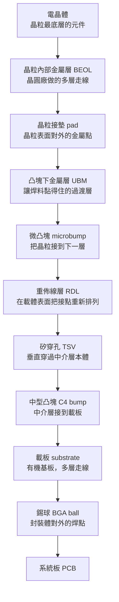
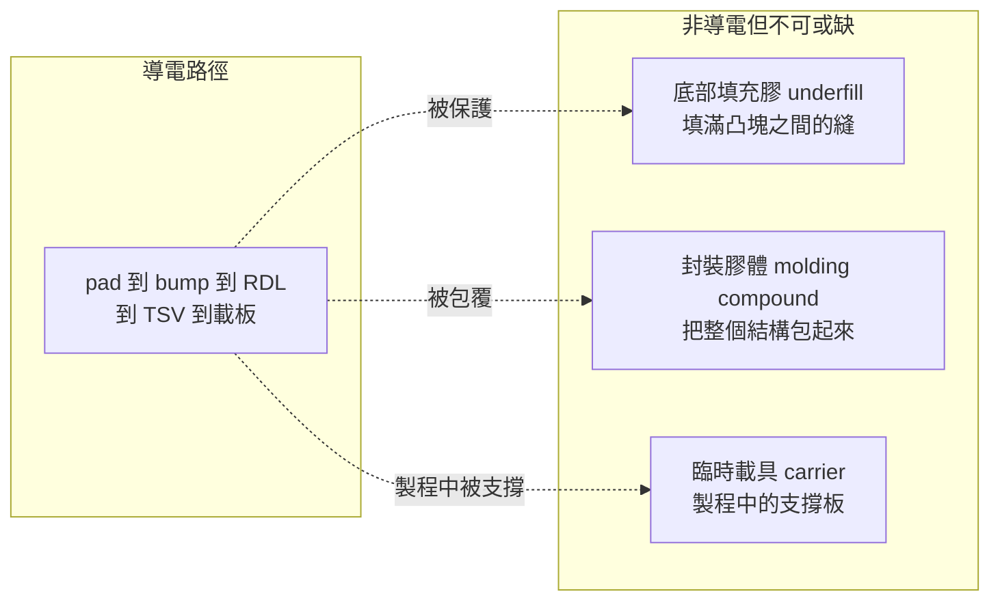
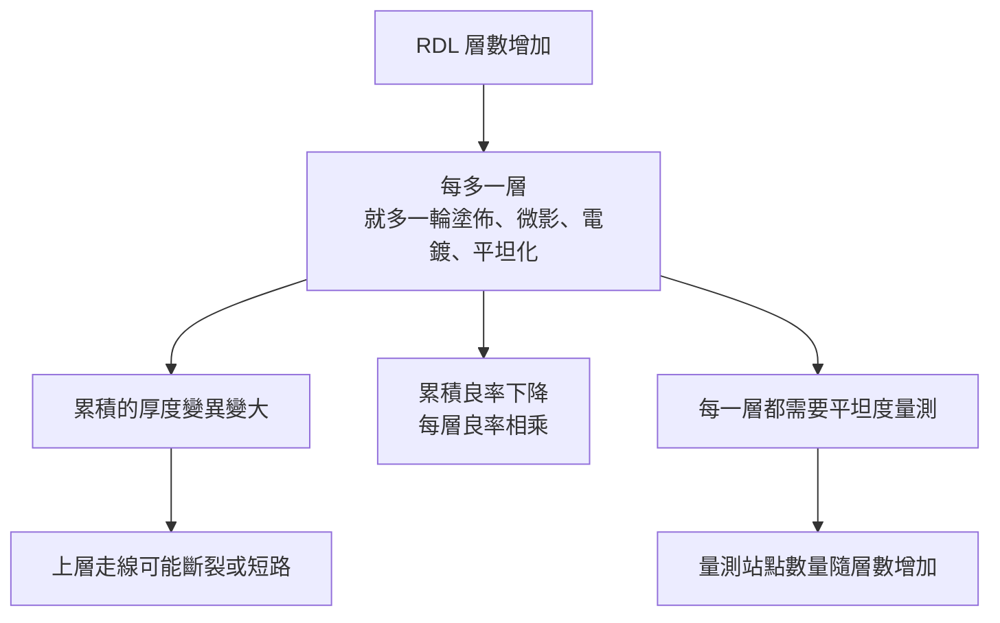
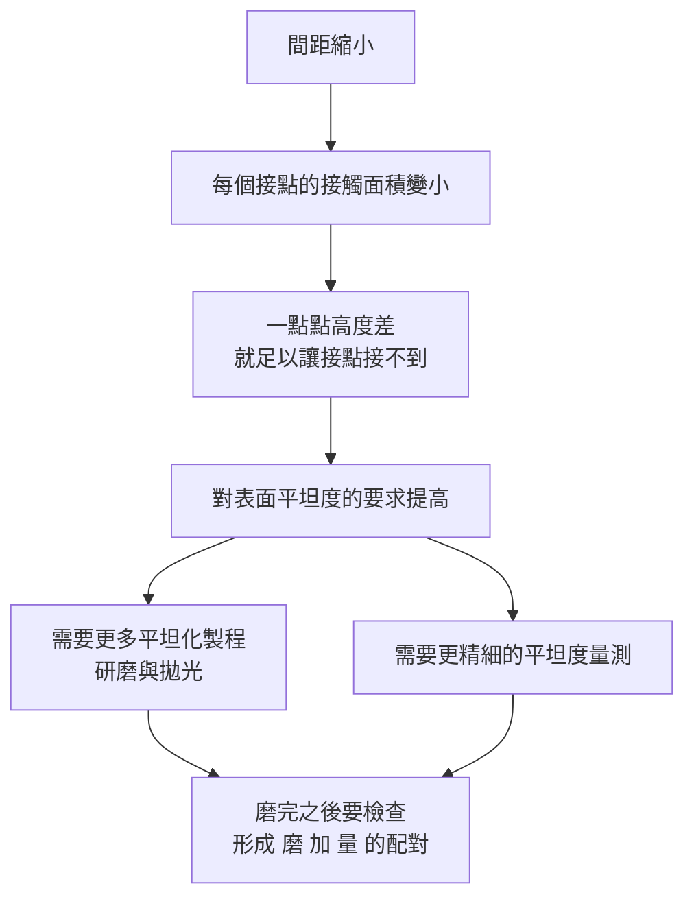

# 第 3 章：封裝材料與互連的共同語言

## 開場問題

你在一份技術簡報上看到這一行：

> 「RDL 層數由 3 層增至 5 層，microbump pitch 微縮，underfill 填充窗口收斂，需強化 warpage 控制。」

如果這句話對你來說是一串英文縮寫，那不是你的問題——**這句話裡的每一個詞，講的都是同一件事的不同段落：一個電子從電晶體出發，要怎麼走到 PCB 上。**

這一章不做名詞解釋。它做一件事：

**把一個訊號從晶粒最裡面走到 PCB 的完整路徑攤開，讓每個名詞在路徑上有一個位置。** 名詞只有掛在路徑上才記得住，而且掛上去之後，你會自動知道它壞掉會怎樣、要用什麼方法檢查它。

這章是後面所有章節的詞彙基礎。**第 4 到 14 章的每一個製程站點，都是在處理這條路徑上的某一段。**

---

## 先看結構：一條訊號的完整旅程

先看整體，再談名詞。下圖是一個典型 2.5D 封裝的**訊號路徑**，由上往下讀。

**圖 3-1**：一個訊號從電晶體走到 PCB 的完整路徑（以 2.5D 加矽中介層為例）。每一個箭頭都是一次「接合」，每一次接合都是一個可能的失效點，也都對應到後面章節的一個製程站點。

*Flip chip（覆晶）剖面：晶粒正面朝下，凸塊直接接到下面的載體。對應圖 3-1 的 pad → UBM → bump 那一段。*

*凸塊長在晶粒的接墊上。數量可以遠多於打線，因為整面都能放點，不必擠在邊緣。*

*接合前的對位：上面是已植球的晶粒，下面是載體上的墊。對歪了，有的凸塊碰不到、有的橋接到隔壁——這就是後面章節反覆出現的「對位」需求。*

*底部填充膠（underfill）把凸塊之間的空隙填滿。它不導電，但決定封裝能不能撐過熱脹冷縮——對應圖 3-2 右邊那一類材料。*

*BGA 封裝的金相截面：底部一顆顆是錫球，中間是通孔與銅層。這是圖 3-1 路徑最下面、間距已經變粗的那一段（C4／BGA → 載板 → PCB）。*

*BGA 移除後，PCB 上留下的焊球陣列。每一顆球對應一個 I/O 或電源腳——這就是「封裝體對外」的接點長什麼樣子。*

**立刻可以觀察到三件事：**

1. **這條路徑上有十次以上的材料轉換。** 矽 → 金屬 → 焊料 → 金屬 → 有機材料 → 焊料 → 有機材料。每一次轉換都牽涉不同的熱膨脹係數，這是所有封裝可靠度問題的根源。
2. **間距一路變粗。** 從晶粒表面的微米量級，一路擴大到 PCB 的數百微米。**先進封裝所做的，是讓「變粗」這件事發生得慢一點。**
3. **中介層那一段（RDL 加 TSV）是可以被抽換的。** 抽掉它，就是 MCM；換成別的做法，就是[第 2 章](02-packaging-taxonomy.md)講的各種平台。

### 還有一組沒有走訊號的東西

上面那條路徑只畫了「電往哪走」。但一個封裝體裡有一大半材料**根本不導電**，它們的工作是固定、保護與支撐：

**圖 3-2**：封裝體裡的兩類材料。左邊決定「能不能通」，右邊決定「能不能撐住與能不能做出來」。設備需求有很大一部分來自右邊——**因為它們是製程中被加工、被磨、被檢查的對象。**

其中 **carrier（載具）** 特別重要，因為它是**唯一一個不會留在成品裡、卻要被反覆使用與檢查的東西**。它會在[第 4 章](04-workpiece-flow.md)完整登場。

---

## 術語對照表：中英對照與所在位置

以下是本書全書使用的核心詞彙。**「在路徑的哪一段」這一欄比定義更重要**——它決定了這個名詞跟哪些製程、哪些缺陷、哪些設備有關。

### 一、工件與載體

| 中文 | 英文 | 在路徑的哪一段 | 一句話說明 |
|---|---|---|---|
| 晶圓 | wafer | 起點 | 未切割的整片矽片，晶粒的載體 |
| 晶粒／裸晶 | die | 起點 | 從晶圓切下來的單一功能單元 |
| 中介層 | interposer | 晶粒與載板之間 | 借用晶圓製程做出的高密度走線載體 |
| 載板 | substrate | 中介層與 PCB 之間 | 有機材料多層板，做間距放大 |
| 系統板 | PCB | 終點 | 整台機器的電路板 |
| 臨時載具 | carrier | **不在成品裡** | 製程中支撐薄工件的板子，用完解黏、**循環使用** |
| 重組晶圓 | reconstituted wafer | 中途形態 | 把已切割的晶粒重新排列並封膠後形成的圓片 |
| 條狀工件 | strip | 中途形態 | 多個封裝體連在一起的長條或方形陣列 |

### 二、互連結構（由細到粗）

| 中文 | 英文 | 典型間距量級 | 在路徑的哪一段 |
|---|---|---|---|
| 晶粒接墊 | pad | 微米量級 | 晶粒表面 |
| 凸塊下金屬層 | UBM（Under Bump Metallization） | 隨 bump | pad 與 bump 之間 |
| 微凸塊 | microbump（μbump） | **數十微米量級** | 晶粒接到中介層 |
| 銅柱凸塊 | copper pillar | 數十微米量級 | microbump 的一種常見形式 |
| 重佈線層 | RDL（Redistribution Layer） | 線寬**次微米至數微米** | 載體表面的走線 |
| 矽穿孔 | TSV（Through Silicon Via） | 直徑數微米、深度數十微米量級 | 垂直穿過矽本體 |
| 玻璃穿孔 | TGV（Through Glass Via） | 同量級 | 垂直穿過玻璃本體 |
| 中型凸塊 | C4 bump | **約百微米量級** | 中介層接到載板 |
| 錫球 | BGA ball（solder ball） | **數百微米至毫米量級** | 封裝體接到 PCB |
| 混合鍵合 | hybrid bonding | **無凸塊**，銅對銅直接接合 | 取代 microbump 的接法 |

!!! warning "這些數字是量級，不是規格"
    上表所有尺寸都是**量級示意**（來源 T3，通用教科書級材料，未於本次重新取用）。實際數值隨世代、平台、廠商差異很大，而且逐年微縮。**需要精確值時請回原廠技術文件核對，不要引用本表。** 本表的用途是讓你在看到一個數字時，能判斷「這合不合理、這是哪一段」。

### 三、非導電材料

| 中文 | 英文 | 功能 | 為什麼會製造麻煩 |
|---|---|---|---|
| 底部填充膠 | underfill | 填滿晶粒與下層之間的縫，分散應力 | 間距越小越難流進去；填不滿就留空洞 |
| 封裝膠體 | molding compound | 包覆整個結構，保護並提供機械強度 | 收縮率與矽差很多，是翹曲的主要來源 |
| 黏著層 | adhesive／bonding layer | 把工件暫時黏在 carrier 上 | 要黏得住又要解得掉，且不能殘留 |
| 鈍化層／介電層 | passivation／dielectric | RDL 各層之間的絕緣 | 平坦度不足會讓上層走線斷裂 |

### 四、一個關鍵幾何名詞

**間距（pitch）**：兩個相鄰接點中心之間的距離。

**這是全書出現頻率最高的數字。** 記住一件事：

> **間距縮小 → 每個接點變小 → 對位精度要求變高 → 表面平坦度要求變高 → 檢測解析度要求變高。**

這條鏈就是先進封裝設備需求的**主發電機**。後面每一章的設備需求，幾乎都能回推到「因為間距縮小了」。

---

## 逐步解釋：路徑上每一段在做什麼

以下把圖 3-1 的路徑拆成六段，每段寫明「輸入／操作／輸出／目的」。

!!! note "流程性質標示"
    以下是**跨來源教學整理**，用來建立可推理的心智模型。實際產線的站點順序會依平台、世代與廠商而不同，且各家多有未公開的細節。**不要把這裡的順序當成任何特定客戶的實際流程。**

### 第 1 段：晶粒表面（pad → UBM）

| 項目 | 內容 |
|---|---|
| **輸入** | 晶圓廠交出的完成晶圓，表面有一層鈍化層與露出的鋁或銅接墊 |
| **操作** | 在接墊上長一層金屬堆疊（UBM），通常包含黏著層、阻障層與可焊層 |
| **輸出** | 表面有可以承接焊料的金屬點 |
| **目的** | 焊料不會直接黏在鋁或介電材料上，需要一層**可焊、又能阻擋金屬互相擴散**的過渡結構 |

**為什麼要有阻障層**：銅與錫會互相擴散並形成介金屬化合物（IMC，intermetallic compound）。適量的 IMC 是接合成立的必要條件，但長太厚會變脆。UBM 裡的阻障層就是在控制這件事。

### 第 2 段：凸塊形成（microbump／copper pillar）

| 項目 | 內容 |
|---|---|
| **輸入** | 帶 UBM 的晶圓 |
| **操作** | 在 UBM 上長出凸出的金屬結構——常見做法是電鍍銅柱，頂端加一層焊料 |
| **輸出** | 表面布滿高度一致的凸塊 |
| **目的** | 提供**垂直方向的接合媒介**，並在接合後提供一定的機械順應性 |

**這一步的關鍵品質指標是「高度一致性」**，業界稱**共面性（coplanarity）**。因為接合時是整片壓下去的：只要有一顆特別矮，它就接不到；有一顆特別高，它會被壓扁甚至擠出去短路。

**共面性怎麼量？** 這正是白光干涉儀（SWLI）這類 3D 量測設備的用武之地——它量的是**高度分布**，不是有沒有東西。這個區別在[第 11 章](11-defect-aoi-metrology.md)很重要。

### 第 3 段：RDL——把接點重新排列

| 項目 | 內容 |
|---|---|
| **輸入** | 一個表面（中介層表面、封膠表面、或載具上的重組體表面） |
| **操作** | 塗介電層 → 微影開孔 → 濺鍍晶種層 → 電鍍銅 → 去除多餘部分 → 平坦化。重複數次形成多層 |
| **輸出** | 表面有一層或多層細線路，把原本的接點分布轉換成新的分布 |
| **目的** | **RDL 就是「重新佈線」四個字的字面意思**：把 A 位置的接點，接到 B 位置去 |

**RDL 是先進封裝的核心技術，也是本書出現最多次的縮寫。** 理解它只需要一句話：

> **RDL 是用晶圓製程的方法，在封裝層級做出來的走線。**

它的線寬能做到次微米至數微米，比有機載板細一到兩個數量級——這就是[第 2 章](02-packaging-taxonomy.md)說的「借用晶圓廠的線寬能力」。

**為什麼 RDL 層數增加是件大事**：

**圖 3-3**：RDL 層數增加的連鎖效應。注意最下面那條——**量測需求是隨層數線性增加的**，這是先進封裝檢量設備需求成長的直接來源之一。

### 第 4 段：TSV——垂直穿過本體

| 項目 | 內容 |
|---|---|
| **輸入** | 一片矽（中介層或晶粒本體） |
| **操作** | 深蝕刻出高深寬比的孔 → 鍍絕緣層與阻障層 → 填銅 → 移除表面多餘的銅 → **從背面磨薄直到孔露出來** |
| **輸出** | 一片正反兩面都能導通的矽 |
| **目的** | 讓訊號能**垂直穿過矽本體**，而不必繞到旁邊 |

**注意最後一個操作：「從背面磨薄直到孔露出來」。**

這是本書第一次出現「研磨」，而且它不是為了美觀或減重——**TSV 的孔是有底的，不磨掉背面那層矽，孔的另一端就不會露出來，整個結構不通。**

這件事有兩個直接後果：

1. **薄化是 TSV 製程的必要步驟，不是選配。**
2. **薄化的終點很難判斷**：磨少了不通，磨多了會把 TSV 磨壞或讓晶圓破裂。這需要**厚度量測與均勻度控制**。

厚度均勻度的常見指標是 **TTV（Total Thickness Variation，總厚度變異）**——同一片工件上最厚處與最薄處的差。這個詞會在[第 12 章](12-grinding-thinning.md)大量出現。

### 第 5 段：接合與底部填充

| 項目 | 內容 |
|---|---|
| **輸入** | 帶凸塊的晶粒，以及要接上去的下層載體 |
| **操作** | 對位 → 放置 → 加熱使焊料熔合（回流或熱壓）→ 從側邊注入 underfill，靠毛細現象吸進縫隙 → 固化 |
| **輸出** | 機械與電性都連上的結構 |
| **目的** | 建立電連接，並用 underfill 分散熱膨脹差造成的應力 |

**underfill 為什麼必要**：矽的熱膨脹係數跟有機載板差好幾倍。溫度一變，兩者伸縮不同步，所有應力就集中在細小的凸塊上——凸塊會裂。underfill 把縫隙填滿之後，應力由整個膠層分擔。

**underfill 為什麼越來越難做**：它靠毛細現象流進縫隙。**間距越小、縫隙越窄、流動阻力越大**；同時封裝面積越大，要流的距離越長。填不滿就是空洞（void），空洞就是應力集中點與潛在的可靠度失效。

### 第 6 段：封膠、載板與對外接出

| 項目 | 內容 |
|---|---|
| **輸入** | 已接合並填膠的結構 |
| **操作** | 用 molding compound 包覆 → 固化 → 視需要研磨頂面以露出結構或控制厚度 → 接到載板 → 植球 |
| **輸出** | 可以拿去焊在 PCB 上的封裝成品 |
| **目的** | 保護、控制外形尺寸、提供對外的粗間距焊點 |

**「研磨頂面」這件事在傳統封裝裡不存在或不重要，在先進封裝裡卻是關鍵站點。** 原因有兩個：

- **露出結構**：有些設計需要把封膠磨掉，讓晶粒背面或銅柱頂端露出來（例如為了散熱或為了做上層互連）。
- **控制總厚度與平坦度**：封膠固化後會收縮翹曲，後續還要在上面做 RDL 或接東西，表面必須夠平。

這條線會通到[第 5 章](05-fan-out.md)（Fan-Out 的封膠研磨）與[第 12 章](12-grinding-thinning.md)（研磨的分類）。

---

## 失敗會長什麼樣子

把路徑上的每一段對應到它的典型缺陷。**這張表是[第 11 章](11-defect-aoi-metrology.md)缺陷矩陣的簡化前身。**

| 路徑段落 | 典型缺陷 | 怎麼形成 | 影響什麼 |
|---|---|---|---|
| **pad／UBM** | 表面污染、氧化 | 清洗不完全、暴露時間過長 | 焊料不潤濕，接不上 |
| **凸塊** | 高度不一致（共面性不良） | 電鍍均勻性不足 | 部分接點虛接 |
| **凸塊** | 缺球、橋接 | 電鍍缺陷、焊料過量 | 開路或短路 |
| **接合** | 冷接（非潤濕） | 溫度不足、表面氧化 | 電性時好時壞，最難抓 |
| **接合** | 對位偏移 | 設備精度或工件變形 | 接錯位置或接觸面積不足 |
| **RDL** | 斷線、短路 | 微影缺陷、電鍍空洞、異物 | 直接功能失效 |
| **RDL** | 厚度不均、表面起伏 | 平坦化不足、下層形貌沿用 | 上層走線斷裂；多層累積放大 |
| **TSV** | 填充空洞 | 深孔電鍍不完全 | 電阻異常、可靠度失效 |
| **TSV** | 露出不足或過磨 | 薄化終點控制不良 | 不通，或破壞結構 |
| **underfill** | 空洞、填充不完全 | 間距太小、流動距離太長、黏度不匹配 | 應力集中，熱循環後開裂 |
| **molding** | 翹曲（warpage） | 膠體與矽的熱膨脹與收縮差 | 後續無法對位、無法接合、甚至破片 |
| **molding** | 分層（delamination） | 界面附著力不足、水氣 | 可靠度失效，常在使用後才出現 |
| **carrier 界面** | 解黏殘留、carrier 本身刮傷 | 黏著層殘留、載具重複使用劣化 | 污染下一片工件、影響後續製程 |

### 兩個貫穿全書的失效主題

**主題一：熱膨脹係數不匹配（CTE mismatch）**

翻回圖 3-1：那條路徑上有十幾次材料轉換。矽、銅、焊料、有機膠、有機載板——它們受熱時膨脹的幅度都不一樣。

**所以「溫度變化」是先進封裝最主要的應力來源。** 而製程本身充滿溫度變化（回流、固化、退火）；產品使用時也充滿溫度變化（開機、負載變動）。

underfill、molding compound 的存在，大半是為了處理這件事。翹曲、分層、凸塊開裂也都是它的後果。

**主題二：越平越好，而且越來越平**

**圖 3-4**：從間距縮小推導出「磨」與「量」的需求配對。**這張圖是本書把技術面接到設備面的關鍵一步**，後面第 11、12 章都是它的展開。

---

## 如何檢查與控制

路徑上的每一段有不同的「可見性」，這決定了要用什麼方法檢查。**選錯方法就是花錢買盲點。**

| 想檢查什麼 | 適用方法 | 為什麼 | 盲點 |
|---|---|---|---|
| 表面有沒有異物、刮傷、缺球 | **光學檢測（AOI）** | 表面缺陷會改變反射 | 看不到被遮住的東西、看不到高度 |
| 凸塊高度、共面性 | **白光干涉（SWLI）／3D 量測** | 量的是高度分布 | 慢、通常抽樣；看不到內部 |
| RDL 厚度、表面起伏 | **白光干涉／膜厚量測** | 同上 | 同上 |
| 接合後的內部空洞、對位 | **X-ray** | 穿透封裝看密度差異 | 對低密度差材料不敏感；解析度有限 |
| 分層、界面剝離 | **超音波掃描（SAT）** | 界面的空氣層反射超音波 | 需要耦合介質；解析度有限 |
| 電性到底通不通 | **電性測試** | 直接量 | 只知道好壞，不知道壞在哪一層 |
| 工件整體厚度與 TTV | **厚度量測** | 決定研磨的終點 | 只有厚度，沒有缺陷資訊 |

**一個貫穿本書的原則**：

> **沒有任何一種檢測方法能看到所有東西。** 選擇檢測方法，等於選擇你願意放過哪一類缺陷。

這正是為什麼一條先進封裝產線會同時需要 AOI、3D 量測、X-ray 與電測——它們不是競爭關係，是**互補的盲點覆蓋**。完整的「缺陷—形成站點—檢測方法—盲點」矩陣在[第 11 章](11-defect-aoi-metrology.md)。

### 一個容易被忽略的檢查對象：載具本身

上表所有項目都在檢查**產品**。但還有一類東西需要被檢查：**製程中用到的載具（carrier）**。

理由很簡單：

- 載具是**循環使用**的，用過幾十次之後表面會累積刮傷、殘膠、微小凹陷。
- 載具的表面形貌會**直接複製到工件上**——工件貼在它上面，它不平，工件就不平。
- 一片壞掉的載具，會連續毀掉好幾批工件才被發現。

**所以載具檢測是一個獨立的、與產品檢測分開的需求。** 這是[第 4 章](04-workpiece-flow.md)的重點，也是均豪 Carrier AOI 這項產品存在的理由。

---

## 與均豪的連結

本章的路徑上，有兩段能對上均豪的公開產品：**RDL 的平坦度與厚度量測**，以及**進入封裝廠前的來料狀態確認**。

### ✅ 已確認事實

- 均豪的白光干涉儀（SWLI）公開用途包含 **RDL 平坦度與厚度量測**；公司公開講的精度為 1 μm × 1 μm 級。`[公司自述]`（G1、G2）
- 白光干涉獲「國內 OSAT」認可，2026 Q2 進入量產放量並開始認列。`[公司自述]`（G2、G3）
- 均豪在 2026-08-12 法說中新增揭露「**前段來料檢查**」這個站點，說法是晶圓價值太高，封裝廠不再直接信任前段交出的工件狀態。`[公司自述]`（G3）
- 均豪自我定位為「檢、量、磨、拋」，其中「量」對應本章的高度與厚度類量測。`[公司自述]`（G1、G6）

### 🔶 合理推論

- 本章圖 3-3 顯示 **RDL 層數增加會讓平坦度量測站點線性增加**。這條推論與均豪把白光干涉列為 2026–2027 成長動能的說法方向一致。**但方向一致不等於因果證實**：本書無法從公開資料得知均豪的白光干涉被裝在哪一層 RDL 之後、每條線裝幾台。`[推論]`
- 「前段來料檢查」這個站點的出現，符合本書[第 1 章](01-why-advanced-packaging.md)推導的「封裝良率是乘法、後段失效代價高」的經濟邏輯。`[推論]`
- 圖 3-4 的「磨」與「量」配對，可以解釋為什麼一家設備商會同時做研磨與量測——但這是對**設備類別**的解釋，不是對均豪特定訂單的解釋。`[推論]`

### ❓ 尚待查證

- 「精度 1 μm × 1 μm」的**定義未明**：是橫向解析度、量測視野的取樣間距，還是高度解析度？這個差別很大，直接影響它能不能用在哪一段 RDL。公開資料未見說明。
- 均豪的白光干涉是**線上全檢**還是**抽樣量測**？兩者的機台數量需求差好幾倍。公開資料未見說明。
- 「前段來料檢查」使用的是哪一類設備（AOI？3D 量測？兩者？），以及是哪些客戶在用，公開資料均未揭露。
- 本章其餘段落（UBM、凸塊、TSV、underfill、molding）**沒有任何均豪公開證據**顯示其設備進入這些站點。**不要因為均豪有 AOI 與研磨設備，就把這些站點算進去。**

---

## 理解檢查

???+ question "Q1：為什麼 TSV 一定要搭配「從背面磨薄」這個步驟？如果不磨會怎樣？"
    因為 **TSV 的孔在製作時是有底的**——深蝕刻不會一路穿透整片矽，否則製程無法進行（工件會失去支撐、電鍍液會漏）。

    所以流程是：先做出有底的深孔並填銅，最後**從背面把矽磨掉，直到孔的底部露出來**，兩面才導通。

    不磨的後果：TSV 只是一根埋在矽裡、一端不通的銅柱，整個垂直互連不成立。

    **延伸判斷**：這代表薄化的終點控制是 TSV 製程的良率關鍵——磨少了不通，磨多了破壞結構或破片。因此「研磨」與「厚度量測」在這裡是綁在一起的，必須成對出現。

???+ question "Q2：一則新聞說「先進封裝的 underfill 填充窗口越來越窄」。這句話在說什麼物理現象？"
    underfill 靠**毛細現象**流進晶粒與下層之間的縫隙。決定它流不流得動的兩個幾何因素是：

    1. **縫隙高度**——由凸塊高度決定。間距微縮，凸塊也跟著變矮，縫隙變窄。
    2. **流動距離**——由封裝面積決定。封裝越大，膠要從邊緣流到中心的距離越長。

    先進封裝同時把這兩個因素往壞的方向推：**縫隙變窄、距離變長。** 於是可用的材料黏度、溫度、注入速度組合越來越少，這就是「窗口變窄」。

    後果是空洞率上升，而空洞是熱循環下的裂紋起點。所以這句話真正在講的是**可靠度風險**，不只是製程難度。

???+ question "Q3：某封裝的翹曲（warpage）在封膠固化後超標。為什麼這會讓後面的製程做不下去？請至少講兩個後果。"
    翹曲是工件不平，直接後果包括：

    1. **無法對位／無法接合**：後續要在上面放晶粒或做 RDL，需要工件是平的。翹了之後，中心與邊緣的高度差可能大過整個凸塊高度，部分區域根本接不到。
    2. **無法真空吸附與搬運**：多數設備靠真空吸盤固定工件，翹曲會漏氣，工件夾不住或在加工中位移。
    3. **微影失焦**：RDL 的微影有景深限制，工件起伏超過景深，圖案就模糊或斷線。
    4. **破片風險**：強行壓平會在薄工件上產生應力，導致裂片。

    **根因是熱膨脹係數不匹配**：molding compound 與矽的收縮率不同，固化降溫時整個結構被拉彎。

???+ question "Q4：AOI（光學檢測）能不能用來確認凸塊的共面性？為什麼？"
    **一般不能，這是能力邊界問題。**

    傳統 AOI 看的是**表面反射的二維影像**：有沒有東西、位置對不對、有沒有異物或缺球。它擅長「有／無」與「位置」。

    共面性問的是**高度分布**——每顆凸塊比鄰居高多少或矮多少。這是一個 Z 軸的量測問題，二維影像原則上答不出來（除非用結構光、干涉、共焦等額外手段把 Z 軸資訊帶進來）。

    所以產線上會有**兩類設備**：AOI 抓表面缺陷（快、可全檢），3D 量測（如白光干涉）抓高度（慢、常抽樣）。

    **這一題的訓練目的**：看到「某公司做檢測設備」時，要追問是哪一類——「檢」與「量」在均豪自己的四字定位裡也是分開的兩個字。

???+ question "Q5：本章說「間距縮小是設備需求的主發電機」。請從間距縮小推到「需要更多研磨設備」，把中間的步驟補完。"
    完整推導鏈：

    1. **間距縮小** → 每個接點的直徑與接觸面積變小。
    2. **接觸面積變小** → 同樣的高度差，占接點高度的比例變大；原本可容忍的起伏現在會造成虛接。
    3. **對平坦度的要求提高** → 工件表面允許的起伏範圍收窄。
    4. **表面起伏來自兩處**：下層結構的形貌沿用（RDL 逐層累積），以及材料收縮造成的翹曲。
    5. **要壓掉起伏，就要平坦化** → 研磨、拋光、CMP。
    6. **每多一層 RDL 就多一次平坦化** → 研磨站點數量隨層數增加。
    7. **磨完必須確認磨到位** → 每個研磨站點旁邊配一個厚度／平坦度量測站點。

    **注意第 7 步**：這解釋了為什麼「磨」與「量」在設備商的產品線裡經常綁在一起賣——它們在產線上本來就是配對出現的。

---

## 來源與待查事項

### 本章來源

| 主張 | 來源 | 等級 | 日期 |
|---|---|---|---|
| 訊號路徑各層結構與名詞定義 | T3 | 教科書級通用 | 未於本次重新取用 |
| 各級互連的間距量級 | T3 | **量級示意，非規格** | 未於本次重新取用 |
| RDL 製作流程（塗佈、微影、電鍍、平坦化） | T1、T3 | 跨來源教學整理 | 未於本次重新取用 |
| TSV 需背面薄化露出 | T1、T3 | 通用原理 | 未於本次重新取用 |
| underfill 毛細填充與空洞成因 | T3 | 通用原理 | 未於本次重新取用 |
| CTE 不匹配為主要應力來源 | T3 | 通用原理 | 未於本次重新取用 |
| 各檢測方法的能力與盲點 | E1、E2 | 設備商技術文件類 | 未於本次重新取用 |
| 均豪白光干涉量 RDL 平坦度／厚度、精度 1 μm × 1 μm | G1、G2 | `[公司自述]` | 2026-06-12 法說 |
| 白光干涉獲國內 OSAT 認可、Q2 量產放量 | G2、G3 | `[公司自述]` | 2026-06／08 法說 |
| 新增「前段來料檢查」站點 | G3 | `[公司自述]` | 2026-08-12 法說 |
| 「檢、量、磨、拋」定位 | G1、G6 | `[公司自述]` ＋ `[媒體報導]` | 2026-08-31 快照 |

各代號定義見[附錄 A 來源索引](appendix-sources.md)。

### 待查事項

| # | 問題 | 為什麼重要 | 會怎麼查 |
|---|---|---|---|
| 3-1 | 均豪白光干涉「1 μm × 1 μm」精確定義為何？橫向解析度、取樣間距，還是高度解析度？ | 決定它能用在哪一段 RDL 與哪一種缺陷 | 產品型錄、展場技術規格、法說 Q&A |
| 3-2 | 該設備是線上全檢還是離線抽樣？ | 兩者的機台需求量差好幾倍，直接影響營收推估 | 客戶端產線配置、法說 Q&A |
| 3-3 | 「前段來料檢查」用的是哪一類設備？ | 決定這個新站點該歸到「檢」還是「量」 | 法說簡報原檔、展場資料 |
| 3-4 | 目前世代的 microbump 與 C4 bump 間距實際數值？ | 本章只給量級；第 9 章討論混合鍵合時需要對照 | 平台白皮書、ECTC 論文 |
| 3-5 | 混合鍵合對表面粗糙度與潔淨度的量化要求？ | 決定第 9 章「磨與檢需求最硬」這個判斷的強度 | T5 原始論文、設備商文件 |

---

> 下一頁：[第 4 章 從晶圓到封裝成品](04-workpiece-flow.md)　｜　相關頁面：[第 2 章 封裝分類](02-packaging-taxonomy.md) ｜ [第 11 章 缺陷、AOI 與量測](11-defect-aoi-metrology.md) ｜ [第 12 章 研磨、薄化與表面品質](12-grinding-thinning.md) ｜ [附錄 B 術語表](appendix-glossary.md)
