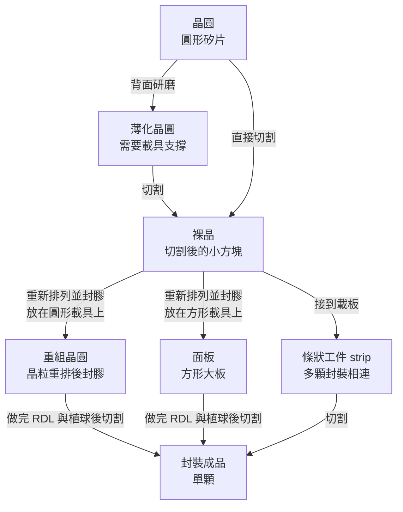
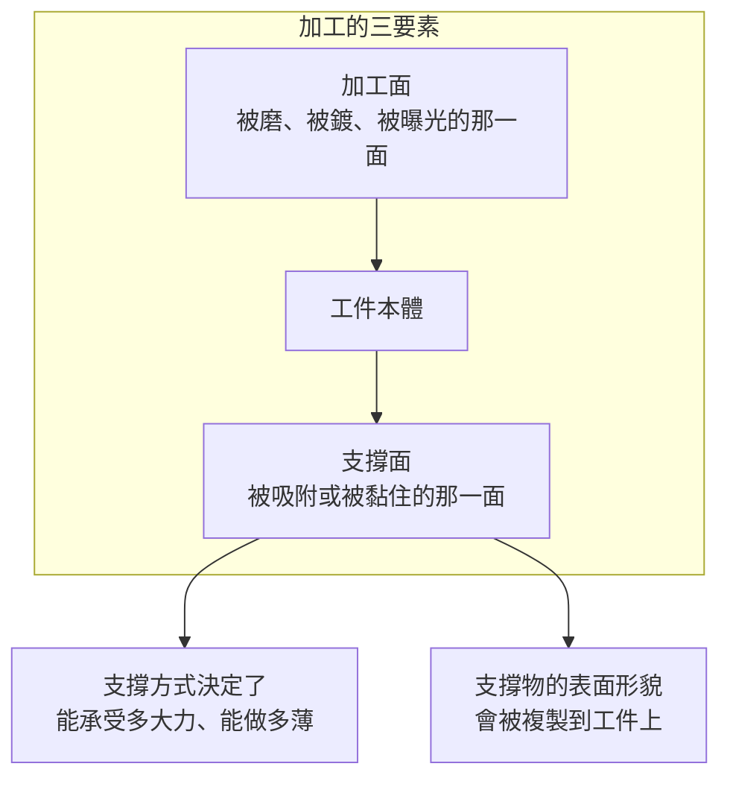
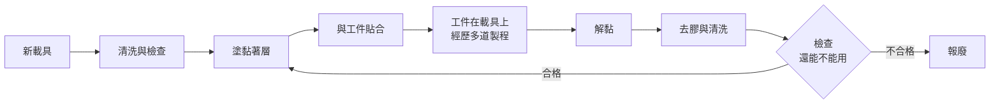
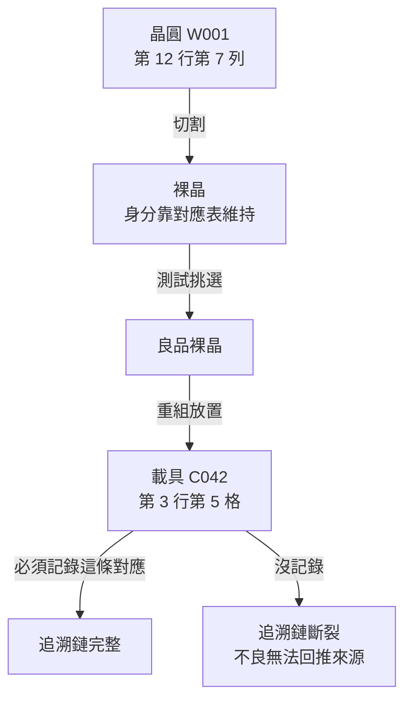
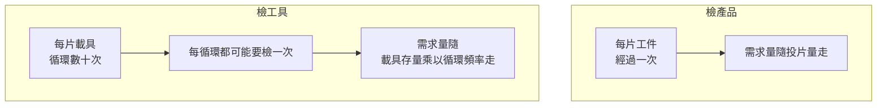

# 第 4 章：從晶圓到封裝成品

## 開場問題

假設你被帶進一座先進封裝廠，從入口走到出口，每經過一台機器就往旁邊的料盒看一眼。你會看到這樣的東西：

- 一開始：**一片圓形的矽晶圓**，直徑三百毫米，裝在卡匣裡
- 走幾站之後：**一盒盒切下來的小方塊**
- 再走幾站：**又變回一片圓的**，但表面是黑色的膠，不是矽
- 再往後：**一片方形的板子**，上面排著整齊的方格
- 最後：**一顆一顆獨立的封裝體**，裝在編帶或托盤裡

一個很自然的疑問是：

> 為什麼形狀一直變？而且中間怎麼會「切開了又變回一片」？

這一章要建立的，是**整本書最實用的一張心智圖：工件在工廠裡的形態變化。**

為什麼這件事重要？因為——

> **設備不是為「製程」設計的，是為「加工對象的形態」設計的。**

一台能磨 300 mm 圓形晶圓的機器，不會自動就能磨 600 mm 見方的面板；能檢查整片晶圓的 AOI，跟能檢查一顆顆裸晶的設備，是不同的機器。**你只要知道某一站的加工對象是什麼形狀、多厚、由什麼撐著，你就大致知道那站需要哪一類設備。**

而這一章還要引入一個到目前為止只提過名字的角色：**載具（carrier）**。它不會出現在成品裡，但它是這座工廠裡**唯一被反覆使用、會逐漸劣化、因此需要被獨立檢查的東西**。

---

## 先看結構：七種工件形態

先把所有可能出現的形態列出來。**「誰撐著它」這一欄是本章的重點**——它決定了工件能不能被搬、能不能被磨、會不會破。

| 形態 | 英文 | 外觀 | 厚度量級 | 誰撐著它 |
|---|---|---|---|---|
| **晶圓** | wafer | 圓形矽片，直徑 200／300 mm | 數百微米 | 自己（夠厚時） |
| **薄化晶圓** | thinned wafer | 同上但很薄 | **數十微米量級** | **必須靠載具或膠帶** |
| **裸晶** | die | 切下來的小方塊 | 隨晶圓 | 藍膜、載盤或吸嘴 |
| **重組晶圓** | reconstituted wafer | 圓形，但主體是封膠不是矽 | 數百微米 | 製程中靠載具 |
| **面板** | panel | 方形大板 | 數百微米 | 載具或框架 |
| **條狀工件** | strip | 長條或方形陣列，多顆封裝連在一起 | 數百微米至毫米 | 自己或框架 |
| **封裝成品** | unit／package | 單顆獨立封裝體 | 毫米量級 | 編帶或托盤 |

*工廠入口最常見的樣子：圓形矽晶圓。較大的約 300 mm（12 吋），較小的約 150 mm。表面還是鏡子，沒有電路——這是「晶圓」這個形態本身。*

*做完電路、準備切割的晶圓。格線就是之後會切開的晶粒邊界。同一片圓，下一站可能變成幾百顆小方塊。*

_tape._Few_chips_(dies)_from_the_wafer_have_already_been_picked_up_(removed)_for_further_manufacturing.png)
*切割之後：晶圓貼在藍色切割膜上，一部分晶粒已經被吸嘴取走。留下的空洞就是「裸晶」這個形態——小、脆、必須靠膜、載盤或吸嘴撐著。*

### 形態變化的主幹

**圖 4-1**：工件形態的主要轉換路徑。注意兩件事：**（一）「切割」不只出現一次**，晶圓會被切、重組晶圓會被切、strip 也會被切；**（二）中間有一次「切開了又合起來」**——裸晶被重新排列成重組晶圓或面板，這是 Fan-Out 的核心動作，[第 5 章](05-fan-out.md)會詳談。

### 加工面與支撐載具：本章的核心觀念

上面那張圖還缺一個維度。任何一次加工，都要回答兩個問題：

1. **加工面是哪一面？**（正面／背面／頂面）
2. **加工的時候，誰在另一面撐著？**

因為**工件越薄越脆，越需要支撐**；而支撐的東西本身會影響加工品質。

**圖 4-2**：任何加工站點的三要素。第三項「支撐」在傳統封裝裡幾乎不用想（工件夠厚），在先進封裝裡卻經常是製程能不能成立的關鍵。

三種常見的支撐方式：

| 支撐方式 | 怎麼做 | 用在哪 | 限制 |
|---|---|---|---|
| **真空吸附** | 吸盤把工件吸在平台上 | 工件夠厚、夠平時 | 工件翹曲會漏氣；吸附力有限 |
| **膠帶（tape）** | 貼在藍膜或研磨保護膠帶上 | 背磨、切割 | 膠帶本身有厚度變異；殘膠問題 |
| **臨時載具（carrier）** | 用黏著層把工件黏在一片剛性板上，做完再解黏 | **薄工件、重組工件、需要多道製程的場合** | 需要貼合與解黏兩道額外製程；載具本身要維護 |

**第三種是先進封裝的主角**，因為只有它能撐得住「非常薄」且「要經歷很多道製程」的工件。

---

## 逐步解釋：工件在產線上的旅程

以下把主要站點寫成「輸入／操作／輸出／目的」，並標明**加工面**與**支撐**。

!!! note "流程性質標示"
    以下是**跨來源教學整理與教學簡化**。站點順序經過合併與省略，不同平台、不同世代、不同廠商的實際流程差異很大。**這不是任何特定客戶的實際流程。**

### 站點 A：來料

| 項目 | 內容 |
|---|---|
| **輸入** | 晶圓廠交出的完成晶圓 |
| **操作** | 確認外觀、厚度、翹曲、表面潔淨度與批號 |
| **輸出** | 可進線的晶圓 ＋ 一筆來料狀態紀錄 |
| **目的** | **建立責任分界**：如果後面出問題，能判斷是不是進來時就有問題 |
| **加工面／支撐** | 不加工；晶圓在卡匣中 |

這一站在傳統封裝裡常常被省略或簡化。**在先進封裝裡它的重要性大幅上升**，理由是[第 1 章](01-why-advanced-packaging.md)的乘法效應：一片先進製程晶圓的價值極高，封裝廠不願意在事後才發現問題卻無法歸責。

均豪在 2026-08-12 法說中**新增揭露了這個站點**，說法是「晶圓太貴，封裝廠不再信任前段交出的東西」（`[公司自述]`，G3）。**這是一個站點需求被經濟結構逼出來的直接例子。**

### 站點 B：背面研磨（背磨）

| 項目 | 內容 |
|---|---|
| **輸入** | 完整厚度的晶圓 |
| **操作** | 正面貼保護膠帶 → 翻面 → 用磨輪把背面矽磨掉 |
| **輸出** | 薄化晶圓 |
| **目的** | 減少厚度（散熱、堆疊高度）；若有 TSV，則是**為了把 TSV 露出來** |
| **加工面／支撐** | **加工背面；正面靠膠帶或載具支撐** |

**這一站是形態變化的第一個關鍵轉折**：磨完之後，晶圓從「自己站得住」變成「非靠支撐不可」。

厚度從數百微米降到數十微米，一片 300 mm 的晶圓會變得像一張薄脆的餅——**任何搬運、翻面、吸附都可能讓它裂開。** 所以從這一站開始，工件的每一次移動都要有支撐策略。

### 站點 C：切割（singulation／dicing）

| 項目 | 內容 |
|---|---|
| **輸入** | 晶圓（或重組晶圓、面板、strip） |
| **操作** | 用刀輪、雷射或電漿沿著切割道分開 |
| **輸出** | 一顆顆分離的裸晶或封裝體 |
| **目的** | 把批次工件變成獨立單元 |
| **加工面／支撐** | 切割面為切割道；**整片貼在藍膜上，切完後晶粒還留在膜上** |

**切割是不可逆的**：切完之後，這批工件就再也不是「一片」了，追溯的粒度必須從「片」變成「顆」。

**崩邊（chipping）** 是這一站的典型缺陷：切割道邊緣產生微小裂口。裂口本身可能不影響功能，但它是後續熱應力下的裂紋起點。

### 站點 D：重組（reconstitution）

| 項目 | 內容 |
|---|---|
| **輸入** | 已切割並經過測試挑選的良品裸晶 |
| **操作** | 把裸晶一顆顆**重新排列**、以指定間距貼到一片載具上 |
| **輸出** | 載具上排滿裸晶的陣列 |
| **目的** | 建立一個「間距比原本大」的新陣列，好讓後續 RDL 能往外扇出 |
| **加工面／支撐** | 裸晶正面朝下貼在載具上（chip-first 面朝下的做法）；**支撐完全靠載具** |

**這是全書最反直覺的一步**：明明剛剛才把晶圓切開，現在又把晶粒排回一片圓的（或方的）上面。

為什麼要這樣做？因為**新陣列的間距是可以自己決定的**。原本晶圓上的晶粒是緊貼在一起的，重組之後每顆之間留出空隙，這些空隙就是 RDL 可以往外走線的空間——這就是「Fan-Out（扇出）」三個字的字面意思。詳見[第 5 章](05-fan-out.md)。

**這一站的核心風險是 die shift（晶粒位移）**：封膠時膠體流動與收縮會把已經排好的晶粒推歪。歪掉之後，後面 RDL 的圖案就對不上晶粒的接墊。這是 Fan-Out 最著名的良率問題。

### 站點 E：封膠（molding）

| 項目 | 內容 |
|---|---|
| **輸入** | 載具上的裸晶陣列 |
| **操作** | 注入或壓合 molding compound，包覆所有裸晶與空隙，加熱固化 |
| **輸出** | 一片「重組晶圓」或「面板」——外形是圓的或方的，主體是膠加矽 |
| **目的** | 把分散的晶粒固定成一個可以整片加工的工件 |
| **加工面／支撐** | 頂面被膠覆蓋；底面仍是載具 |

**封膠之後，工件在形態上重新變成「一片」**，於是又可以用晶圓級（或面板級）的設備來處理它。這正是 Fan-Out 的經濟價值：**用處理一片的成本，同時處理幾百顆。**

代價是：膠體固化收縮會造成**翹曲（warpage）**，而且膠與矽的熱膨脹係數差很多。翹曲會讓後續的微影對不準、吸附吸不住。

### 站點 F：封膠研磨

| 項目 | 內容 |
|---|---|
| **輸入** | 封膠後的重組晶圓或面板 |
| **操作** | 磨掉頂面多餘的膠，直到達到目標厚度，或直到把埋在膠裡的結構露出來 |
| **輸出** | 表面平整、厚度受控的工件 |
| **目的** | **控制總厚度**、**露出需要導通的結構**、**提供後續製程需要的平坦表面** |
| **加工面／支撐** | **加工頂面（膠面）；底面靠載具支撐** |

注意這裡磨的是**膠，不是矽**。膠與矽的硬度、磨耗行為完全不同，所以**「封膠研磨」與「晶圓背磨」是兩種不同的加工**，儘管都叫研磨。這個區分是[第 12 章](12-grinding-thinning.md)整章的主題。

### 站點 G：RDL 與植球

| 項目 | 內容 |
|---|---|
| **輸入** | 平整的重組晶圓／面板 |
| **操作** | 逐層做 RDL（見[第 3 章](03-materials-interconnect.md)），最後種上錫球 |
| **輸出** | 有完整對外互連的整片工件 |
| **目的** | 建立從晶粒到外界的走線 |
| **加工面／支撐** | 加工正面；**底面仍靠載具，直到 RDL 完成** |

### 站點 H：解黏（debonding）

| 項目 | 內容 |
|---|---|
| **輸入** | 載具上完成 RDL 的工件 |
| **操作** | 用雷射、加熱或機械方式讓黏著層失效，把工件與載具分開；清除殘膠 |
| **輸出** | 獨立的薄工件 ＋ **一片用過的載具** |
| **目的** | 取回工件；**同時取回載具，準備清洗後再次使用** |
| **加工面／支撐** | 解黏後工件必須立刻轉移到另一個支撐上，否則會破 |

**這一站產出兩樣東西**，而本書後面關心的其實是第二樣：那片用過的載具。

### 站點 I：最終切割與成品

| 項目 | 內容 |
|---|---|
| **輸入** | 完成 RDL 與植球的整片工件 |
| **操作** | 切割成單顆 |
| **輸出** | 封裝成品，裝入編帶或托盤 |
| **目的** | 交貨 |

---

## 主角登場：載具（carrier）

到這裡，載具已經在流程裡出現了五次。現在把它單獨拿出來講，因為**它的邏輯跟產品完全不同**。

### 載具是什麼

一片**剛性的平板**，材質常見為玻璃或矽（也有金屬與陶瓷方案），用途是在製程中支撐無法自立的薄工件。

它有三個和產品完全相反的性質：

| 性質 | 產品晶圓 | 載具 |
|---|---|---|
| **會不會留在成品裡** | 會 | **不會** |
| **用幾次** | 一次 | **反覆使用數十次以上** |
| **壞掉的後果** | 損失這一片 | **連續污染或毀掉之後好幾批工件** |

### 載具的生命週期

**圖 4-3**：載具的循環使用迴圈。**注意這是一個閉環**——每一圈都會累積一點劣化，而檢查那一格決定了它什麼時候該退出。這張圖是 Carrier AOI 這類設備存在的全部理由。

### 為什麼載具必須被檢查

三個獨立的理由，任何一個都足夠：

**理由一：載具的表面形貌會被複製到工件上。**

工件是黏在載具上加工的。載具上有一個微小凹陷，工件在那個位置就會低下去一點；載具不平，工件磨完就不平。**載具的平坦度是工件平坦度的上限。**

**理由二：殘膠與異物會造成局部隆起。**

解黏之後如果有殘膠沒清乾淨，下一次貼合時那一點就會凸起來。凸起的位置在後續研磨時會被多磨掉，在微影時會失焦。

**理由三：載具會劣化，而劣化是漸進的。**

刮傷、崩邊、微裂、熱循環造成的翹曲，都是一次一點點累積。**沒有一個明確的時刻讓它「壞掉」，只能靠檢查來判斷它什麼時候不能再用。**

而第三點正是關鍵：

> **如果不檢查載具，你會在產品出問題之後，才反推回去發現是某片載具的問題——而那時候它已經毀掉好幾批工件了。**

這正是[第 1 章](01-why-advanced-packaging.md)乘法效應的另一個版本。

### 載具的用量會有多大

均豪在 2026 年法說中引用過兩組市場數字（`[公司自述]`，引用外部市場資料，G1、G3）：

| 引用數字 | 內容 |
|---|---|
| 載具搭配比例 | **每片先進封裝晶圓約搭配 2.5 片循環使用載具** |
| 載具月產量 | 2022 年約 1 萬片 → 2026 年約 13 萬片 |

**怎麼讀這兩個數字**：

- 第一個是「存量比例」——產線上流動的載具數量，是晶圓投片量的倍數。它決定**檢測需求的規模**。
- 第二個是「新增流量」——每個月要生產多少新載具。它反映的是**載具本身的市場成長**，不完全等於檢測設備需求。

**兩者不可混用。** 而且兩者的原始出處都沒有在公開筆記中留下引用來源（見待查 4-2）。

!!! warning "一個容易被跳過的前提"
    「每片晶圓搭配 2.5 片載具」這句話成立的前提是**該封裝平台真的用載具**。用矽中介層的 CoWoS-S 流程與用載具的 Fan-Out 流程，載具用量差很多。這個比例適用於哪些平台、哪個世代，公開資料未見說明。**用它推估市場規模時，這是最脆弱的一環。**

---

## 追溯：切開之後，怎麼知道誰是誰

工件形態變化帶來一個管理問題：**追溯的粒度會改變。**

| 形態 | 追溯單位 | 怎麼標記 |
|---|---|---|
| 晶圓 | 一片 | 晶圓上的雷射刻號、卡匣位置 |
| 裸晶 | 一顆 | **切割後失去片上位置資訊**，靠切割前的座標對應表 |
| 重組晶圓 | 一片新的 | **新的編號，與原晶圓的關係要靠對應表維持** |
| 成品 | 一顆 | 封裝體表面的雷射打標 |

**最脆弱的環節是「重組」那一步。**

原本晶粒在晶圓上的位置是天然的身分證（第幾行第幾列）。重組之後，它被放到一片全新的載具上的全新位置——**如果放置設備沒有記錄「原晶圓的哪一顆，放到新載具的哪一格」，這條追溯鏈就斷了。**

追溯鏈斷掉的後果：後面發現某一批不良，無法回推是哪一片來料晶圓、哪一個區域的問題，也就無法改善。

**圖 4-4**：重組步驟的追溯風險。這是形態變化在管理層面的代價，也是為什麼放置設備需要具備座標記錄能力。

---

## 失敗會長什麼樣子

| 缺陷 | 發生在哪一站 | 怎麼形成 | 影響什麼 |
|---|---|---|---|
| **破片（crack／breakage）** | 背磨後、解黏後 | 薄工件失去支撐或受力不均 | 整片報廢 |
| **崩邊（chipping）** | 切割 | 刀輪磨損、切割參數不當 | 裂紋起點，可靠度風險 |
| **翹曲（warpage）** | 封膠後、解黏後 | 材料熱膨脹與收縮不匹配 | 後續無法吸附、對位、曝光 |
| **die shift（晶粒位移）** | 重組與封膠 | 膠體流動推移已放置的晶粒 | RDL 圖案對不上接墊 |
| **殘膠** | 解黏 | 黏著層去除不完全 | 污染下一片工件；載具局部隆起 |
| **載具刮傷／凹陷** | 載具循環使用累積 | 搬運碰撞、清洗磨蝕、熱循環 | **形貌複製到工件，連續影響多批** |
| **搬運刮傷** | 任何搬運站 | 機械手臂、吸嘴接觸 | 表面缺陷；薄工件可能直接裂 |
| **靜電損傷（ESD）** | 裸晶搬運 | 未接地、材料摩擦 | 電性失效，且外觀看不出來 |
| **追溯斷鏈** | 重組 | 座標對應未記錄 | 不良無法歸因，改善停擺 |

### 兩類完全不同的失效

上表可以分成兩堆，而這個分類決定了要用什麼方式處理：

| 類型 | 特徵 | 例子 | 處理方式 |
|---|---|---|---|
| **一次性失效** | 這一片壞了，下一片不受影響 | 破片、崩邊、單片翹曲 | 加強該站點的參數控制與檢查 |
| **連續性失效** | 一個壞的東西會連續毀掉很多片 | **載具劣化**、刀輪磨損、殘膠污染 | **必須檢查「工具」本身，不只檢查產品** |

> **本書之後在談檢測需求時，記得問一句：這台設備檢的是產品，還是檢的是工具？**

檢產品的設備，需求量隨產量走；**檢工具的設備，需求量隨工具的循環數與汰換率走**——這是兩條不同的成長曲線。Carrier AOI 屬於後者。

---

## 如何檢查與控制

| 想確認什麼 | 站點 | 方法 | 為什麼在這裡做 |
|---|---|---|---|
| 來料狀態是否合格 | 進線前 | 外觀檢查、厚度與翹曲量測 | 建立責任分界；避免昂貴晶圓在後段才報廢 |
| 磨到目標厚度了嗎 | 背磨後 | 厚度量測、TTV 量測 | 磨過頭不可逆 |
| 表面有無刮傷、微裂 | 背磨後 | 晶圓外觀光學檢查 | 微裂會在後續熱製程中擴大 |
| 崩邊有無超標 | 切割後 | 光學檢查 | 決定是否調整切割參數 |
| 晶粒放置位置對不對 | 重組後 | 位置量測、影像比對 | die shift 在封膠後就無法修正 |
| 封膠面平不平、厚度對不對 | 封膠研磨後 | 厚度量測、平坦度量測 | 決定後續 RDL 能不能做 |
| **載具還能不能用** | **解黏清洗後** | **載具表面光學檢測** | **避免連續性失效** |
| 追溯資料完不完整 | 全線 | 資料系統，非設備 | 決定不良能否歸因 |

### 檢產品與檢工具的節奏差異

**圖 4-5**：兩類檢測需求的成長邏輯不同。檢工具的需求量取決於「有多少載具在循環、多久檢一次」，而不只是產品產量——這是估算 Carrier AOI 市場時最容易搞錯的地方。

---

## 與均豪的連結

本章是**均豪公開產品對應最直接的一章**。載具檢測與來料檢查，是均豪公開講過的兩個站點。

### ✅ 已確認事實

- 均豪有 **Carrier AOI** 產品，用於檢查循環使用的載具表面缺陷；2026 年公開狀態為「獲國際封裝大廠認證並量產」，Q2 進入量產放量並開始認列營收。`[公司自述]`（G2、G3）
- 均豪的轉型起點就是載具檢測：2014–2016 年由面板技術平移，做出**玻璃載板（Glass Carrier）AOI**，2016 年正式出貨，被公司內部定位為轉型關鍵。`[媒體報導]`（G6，《今周刊》／《財訊》2026-01-29）
- 均豪在 2026-08-12 法說新增揭露「**前段來料檢查**」站點，對應本章的站點 A。`[公司自述]`（G3）
- 均豪有**晶圓外觀光學檢查**產品，公開說法中是再生晶圓產線的主力之一。`[公司自述]`（G1、G6）
- 均豪法說引用市場數字：每片先進封裝晶圓約搭配 2.5 片循環載具；載具月產量 2022 年約 1 萬 → 2026 年約 13 萬片。`[公司自述]`（引用行為）（G1、G3）
- 均豪的 Carrier AOI 客戶在公開資料中為「**國際封裝大廠**」，**未具名**。`[公司自述]`（G2）。「國內 OSAT」是白光干涉的認可對象，見[第 15 章](15-gpm-product-map.md)矩陣第 4 列，**不要與 Carrier AOI 合併**。

### 🔶 合理推論

- 本章圖 4-5 顯示，**載具檢測的需求量取決於載具存量與檢測頻率，而非單純的產品產量**。這解釋了為什麼一項「檢查非產品」的設備能形成獨立的市場，也解釋了均豪為何把 Carrier AOI 與產品檢測分開講。`[推論]`
- 均豪從**面板業玻璃基板 AOI** 平移到**半導體玻璃載具 AOI**，在技術上是合理的：兩者的加工對象都是大面積、剛性、以表面缺陷為主的透明或半透明板材。這條技術平移路徑與公司自述的轉型敘事一致。`[推論]`（轉型敘事本身為 `[媒體報導]` G6）
- 若先進封裝走向更大的面板尺寸，載具的面積會變大、單片價值變高、循環管理更嚴格，理論上會強化載具檢測需求。**但本書無法從公開資料驗證均豪的 Carrier AOI 是否已能處理面板級尺寸。**`[推論]`

### ❓ 尚待查證

- 均豪 Carrier AOI 的**可處理尺寸與載具材質範圍**（300 mm 圓形？面板級方形？玻璃、矽、還是兩者？）公開資料未見說明。這直接決定它能進入哪些平台的產線。
- 「國際封裝大廠」與其他報導中的「晶圓代工大廠先進封測廠區」（G5，`[媒體報導]`）**是否為同一家，沒有任何公開證據**。本書維持兩者未具名且不合併（與[第 15 章](15-gpm-product-map.md)矩陣第 2、7 列一致）。
- 「每片晶圓搭配 2.5 片載具」適用於哪些封裝平台與世代，未見說明；此比例是所有 Carrier AOI 市場推估的基礎，卻是最未經檢驗的一環。
- 均豪的載具檢測是**每次循環都檢**、還是**每隔 N 次檢**，公開資料未揭露。這個頻率直接決定機台需求量。
- 本章的其他站點——切割、重組放置、封膠、解黏——**沒有任何均豪公開證據**顯示其設備進入。**重組放置設備（Die Bonder 類）在 G2C+ 的分工中屬於均華（6640），不是均豪。** 見[第 15 章](15-gpm-product-map.md)矩陣第 9 列。

---

## 理解檢查

???+ question "Q1：為什麼要把已經切開的晶粒「重新排列成一片」？直接在原本的晶圓上做 RDL 不行嗎？"
    **不行，原因是幾何空間不夠。**

    晶圓上的晶粒是緊貼排列的，彼此之間只有很窄的切割道。RDL 要「往外扇出」——把接點從晶粒範圍內拉到晶粒範圍外——需要晶粒周圍有空地可以走線。原晶圓上沒有這塊空地。

    重組的動作就是**人為製造這塊空地**：把晶粒以較大的間距重新排列，空隙用膠填滿，於是每顆晶粒周圍都多出可以走線的區域。

    **附帶好處**：重組時只放良品裸晶（KGD），壞的晶粒不會被帶進後續昂貴的 RDL 製程。這是良率上的重要優勢。

    **附帶代價**：多了重組、封膠、載具貼合與解黏這幾道製程，以及 die shift 這個新的失效模式。

???+ question "Q2：為什麼載具需要被檢查，而一般的膠帶不需要（或需求低得多）？"
    因為**載具是循環使用的，膠帶是一次性的**。

    一次性耗材的品質風險由供應商的來料管控負責，用完就丟，不會累積劣化。

    循環使用的載具則不同：
    1. 每一次循環都會累積一點刮傷、殘膠、熱應力。
    2. 劣化是**漸進**的，沒有明確的失效時刻，只能靠檢查判斷是否該退出。
    3. 一片劣化的載具會**連續**影響它接下來承載的每一批工件。

    所以載具檢測本質上是**設備／治具管理**，不是產品檢測。它的需求量取決於載具存量與檢測頻率，跟產品產量不是同一條曲線。

???+ question "Q3：一片工件磨完之後厚度均勻度（TTV）不合格。除了研磨設備本身，還有哪個東西可能是元凶？"
    **支撐它的東西——載具或膠帶。**

    研磨時工件是黏在載具上、被壓在磨輪下加工的。研磨機參考的是**載具的背面**，磨出來的厚度均勻度因此取決於「載具本身的平坦度 ＋ 黏著層的厚度均勻度 ＋ 工件原本的厚度分布」。

    也就是說：
    - 載具不平 → 工件磨完不平
    - 黏著層厚薄不均 → 工件磨完不平
    - 載具上有殘膠造成局部凸起 → 該處被多磨掉

    **這一題的訓練目的**：不良發生在某一站，元凶不一定在那一站的主設備上。**「磨」的品質問題可能要回頭查「貼合」與「載具狀態」。** 這也是為什麼研磨與載具檢測在需求上會被綁在一起看。

???+ question "Q4：均豪說 Carrier AOI 已「獲國際封裝大廠認證並量產」。要把這句話變成可估算的營收貢獻，還缺哪些資訊？"
    至少缺四項：

    1. **客戶是誰、有幾家**：「國際封裝大廠」未具名，且不能與其他報導中的「晶圓代工大廠」合併（沒有公開證據顯示是同一家）。
    2. **那條產線上有多少載具在循環**：需求量取決於載具存量。
    3. **檢測頻率**：每次循環都檢，跟每十次檢一次，機台需求差一個數量級。
    4. **單機價格與該客戶的擴產計畫**：認證通過只代表可以買，不代表買多少、什麼時候買。

    公開資料四項都沒有。**所以「已認證量產」這句話能支持的最強結論是「這項產品已進入營收階段」，不足以支持任何數量級的營收推估。**

???+ question "Q5：本章把失效分成「一次性」與「連續性」兩類。這個分類對判斷設備商的成長性有什麼意義？"
    意義在於**需求曲線的形狀不同**。

    - **檢產品的設備**：需求量大致隨客戶的投片量走。客戶擴產，就多買幾台；客戶產能持平，需求也持平。
    - **檢工具的設備**：需求量隨「工具存量 × 檢測頻率」走。它有兩個額外的成長來源——工具存量隨製程複雜度上升（每片工件用到更多載具），以及檢測頻率隨品質要求上升（原本抽檢，改成全檢）。

    **所以檢工具類設備的成長，不完全綁在客戶產能上，也綁在製程複雜度與品質標準上。**

    但要注意反向風險：如果客戶找到延長載具壽命的方法、或改用不需要載具的平台，這條需求會直接縮小。**這是評估 Carrier AOI 長期需求時應該追蹤的觀察點。**

---

## 來源與待查事項

### 本章來源

| 主張 | 來源 | 等級 | 日期 |
|---|---|---|---|
| 工件形態分類與轉換路徑 | T1、T2、T3、B2 | 跨來源教學整理 | 未於本次重新取用 |
| 背磨、切割、封膠、解黏的原理與順序 | T2、T3 | **教學簡化流程** | 未於本次重新取用 |
| 重組（reconstitution）與 Fan-Out 的關係 | T2、B2 | 跨來源教學整理 | 未於本次重新取用 |
| die shift 為 Fan-Out 主要良率問題 | T2、B2 | 跨來源整理 | 未於本次重新取用 |
| 載具循環使用與劣化機制 | T3、E1 | 通用原理 ＋ `[推論]` | 未於本次重新取用 |
| 均豪 Carrier AOI 認證並量產 | G2、G3 | `[公司自述]` | 2026-06／08 法說 |
| 均豪 2014–2016 玻璃載板 AOI 為轉型起點 | G6 | `[媒體報導]` | 2026-01-29／02-01 |
| 新增「前段來料檢查」站點 | G3 | `[公司自述]` | 2026-08-12 法說 |
| 晶圓外觀光學檢查為再生晶圓線主力之一 | G1、G6 | `[公司自述]` ＋ `[媒體報導]` | 2026-08-31 快照 |
| 每片晶圓搭配 2.5 片載具、載具月產 1 萬 → 13 萬 | G1、G3 | `[公司自述]`（引用外部市場資料） | 2026 法說簡報 |
| 均華負責 Die 級設備（非均豪） | G1、G3 | `[公司自述]` | 2026-08-31 快照 |

各代號定義見[附錄 A 來源索引](appendix-sources.md)。

### 待查事項

| # | 問題 | 為什麼重要 | 會怎麼查 |
|---|---|---|---|
| 4-1 | 均豪 Carrier AOI 支援的載具尺寸與材質範圍？ | 決定能進入哪些平台（晶圓級／面板級、玻璃／矽） | 產品型錄、SEMICON 展場資料、法說 Q&A |
| 4-2 | 「每片晶圓搭配 2.5 片載具」的原始出處與適用平台？ | 所有 Carrier AOI 市場推估的基礎假設 | 法說簡報引用標註、原始市場報告 |
| 4-3 | 客戶端的載具檢測頻率是每循環一次還是抽檢？ | 機台需求量差一個數量級 | 客戶產線配置、業界訪談 |
| 4-4 | 載具的典型循環壽命（可用幾次）？ | 決定汰換率，也決定檢測需求的長期走勢 | 載具供應商公開資料、SEMI 相關文件 |
| 4-5 | 「國際封裝大廠」與「晶圓代工大廠先進封測廠區」是否為同一家？ | 決定第 15 章矩陣能否合併列 | 年報主要客戶揭露、雙方公告（與待查 15-1 同一題） |
| 4-6 | 各平台實際的載具使用比例差異？ | CoWoS-S 與 Fan-Out 用量不同，影響需求推估的平台歸屬 | 平台白皮書、ECTC 論文 |

---

> 下一頁：[第 5 章 Fan-Out 製程全解析](05-fan-out.md)　｜　相關頁面：[第 3 章 封裝材料與互連](03-materials-interconnect.md) ｜ [第 11 章 缺陷、AOI 與量測](11-defect-aoi-metrology.md) ｜ [第 12 章 研磨、薄化與表面品質](12-grinding-thinning.md) ｜ [第 15 章 均豪產品地圖](15-gpm-product-map.md)
