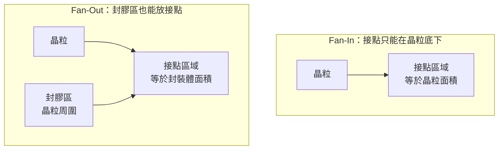
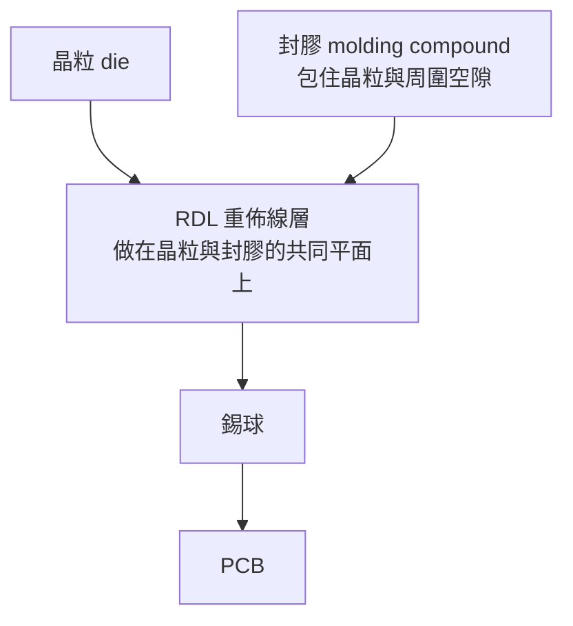
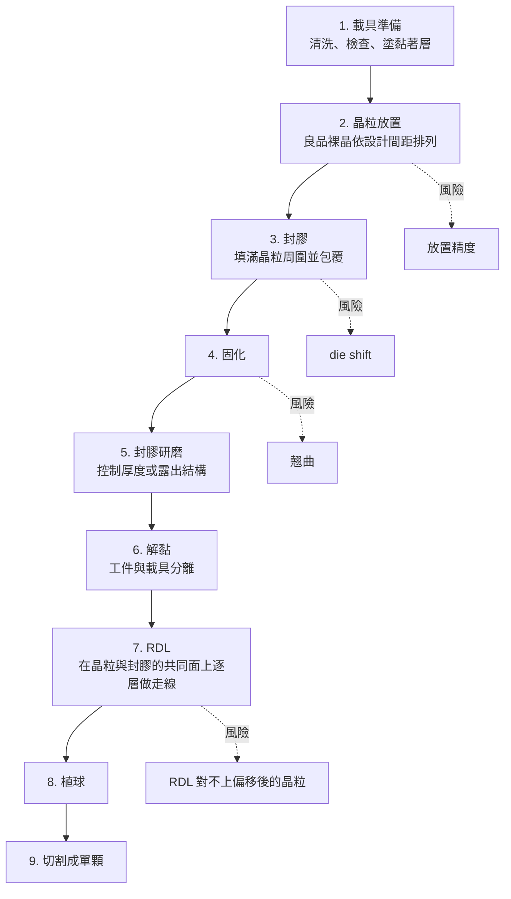
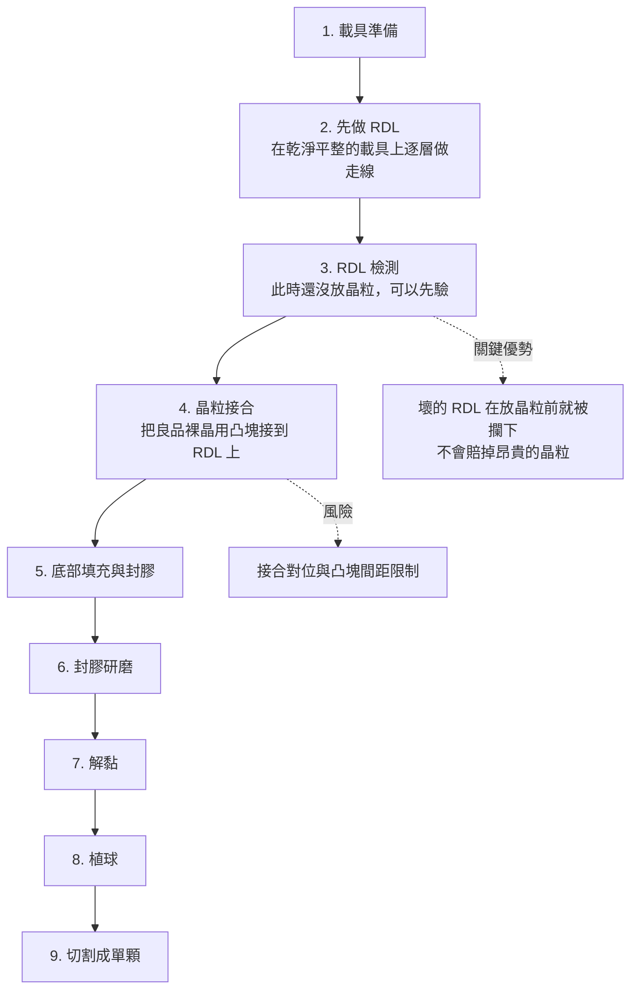
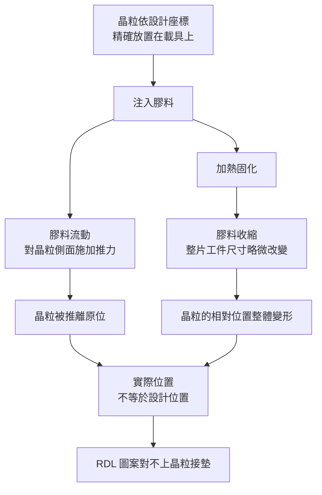
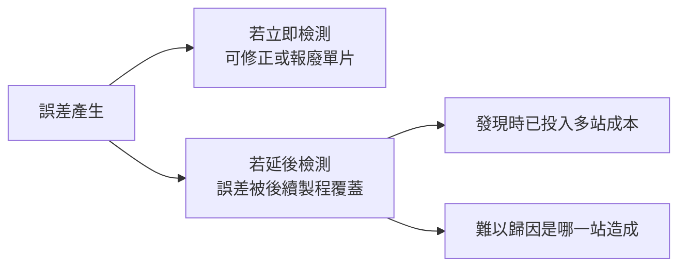

# 第 5 章：Fan-Out 製程全解析

## 開場問題

[第 2 章](02-packaging-taxonomy.md)說 2.5D 的定義特徵是「中間多一層中介物」。[第 3 章](03-materials-interconnect.md)說那層中介物之所以有價值，是因為它用晶圓製程做出來、線很細。

那麼一個很直接的問題是：

> **如果我不做中介層——不買矽晶圓、不做 TSV、不做那一整片載體——有沒有辦法讓晶粒的接點「往外長」到晶粒範圍以外？**

有。而且做法出乎意料地直接：

**把晶粒周圍用膠填滿，然後把膠當成走線的地面。**

這就是 Fan-Out（扇出型封裝）。它不需要另外準備一片中介物，因為**中介物是在製程中「長」出來的**——膠加上長在膠面上的 RDL，就是中介物本身。

這一章要拆的就是這個「長出來」的過程：它有兩條主要路線、一個最著名的失效模式（die shift），以及一整排新的加工站點——**而這些站點，幾乎每一個都需要研磨、量測或檢測。**

---

## 先看結構：扇出的空間是哪來的

### Fan-In 與 Fan-Out 的差別

先看一個最簡單的對照。

| | Fan-In（扇入） | Fan-Out（扇出） |
|---|---|---|
| **對外接點的位置** | 全部落在**晶粒範圍以內** | 可以落在**晶粒範圍以外** |
| **接點數量上限** | 受晶粒面積限制 | 受封裝體面積限制 |
| **多出來的空間從哪來** | 沒有 | **晶粒周圍的封膠區** |
| **需要載板嗎** | 常見做法是不需要 | 視設計而定，很多做法不需要 |

**圖 5-1**：Fan-In 與 Fan-Out 的接點可用面積差異。Fan-Out 多出來的接點空間，完全來自晶粒周圍那圈封膠——**這就是為什麼[第 4 章](04-workpiece-flow.md)的「重組」那一步要刻意把晶粒排得比原來鬆。**

.PNG)
*Fan-In 的日常例子：晶圓級晶片尺寸封裝（WLCSP）。錫球全部落在晶粒投影範圍裡面，封裝體幾乎跟晶粒一樣大。Fan-Out 要做的，就是在晶粒旁邊多長一圈封膠，讓錫球可以排到那圈外面。*

### Fan-Out 封裝的剖面

**圖 5-2**：Fan-Out 封裝的訊號路徑。與[第 3 章](03-materials-interconnect.md)圖 3-1 對照：**這裡沒有中介層、沒有 TSV、也可能沒有載板。** 訊號從晶粒直接進 RDL，再直接下到 PCB。路徑短、層數少，這是 Fan-Out 在功耗與厚度上的優勢來源。

### 這個結構隱含的三個要求

看懂剖面之後，三個製程要求會自己浮出來：

| 要求 | 為什麼 |
|---|---|
| **晶粒與封膠必須在同一個平面上** | RDL 要橫跨兩者做走線。如果晶粒表面比封膠面高或低，RDL 在交界處會斷裂 |
| **晶粒的位置必須非常精確** | RDL 的圖案是照設計檔案做的。晶粒放歪了，接點就對不上 |
| **整片工件必須夠平、翹曲夠小** | RDL 微影有景深限制；工件起伏超過景深就失焦 |

**這三個要求，就是 Fan-Out 全部製程難點的來源。** 後面每一個站點、每一種缺陷、每一台檢量設備，都是在服務這三件事的其中之一。

---

## 逐步解釋：兩條代表性流程

Fan-Out 有兩條主要路線，差別在於**先放晶粒還是先做 RDL**。

!!! note "流程性質標示"
    以下兩條流程是**跨來源教學整理與教學簡化**。實際產線的站點會更多、順序會依平台與世代不同，且各家有未公開的細節。**這不是任何特定客戶的實際流程，也不對應任何特定商標平台的官方流程。**

### 路線一：Chip-First（先放晶粒）

**圖 5-3**：Chip-First 流程與各站主要風險。注意風險的**傳遞方向**：第 2、3 站產生的位置誤差，要到第 7 站才會暴露出來——**中間隔了四個站，等於四站的加工成本已經投下去了。**

**逐站說明：**

| # | 站點 | 輸入 | 操作 | 輸出 | 目的 |
|---|---|---|---|---|---|
| 1 | 載具準備 | 循環使用的載具 | 清洗、檢查表面、塗黏著層 | 可承載工件的載具 | **建立整條流程的基準面** |
| 2 | 晶粒放置 | 良品裸晶（KGD） | 依設計座標逐顆貼到載具上 | 載具上的晶粒陣列 | 建立比原晶圓鬆的新間距 |
| 3 | 封膠 | 晶粒陣列 | 注入或壓合膠料，填滿空隙並包覆 | 一整片重組工件 | 把分散的晶粒固定成可整片加工的形態 |
| 4 | 固化 | 已封膠工件 | 加熱使膠交聯硬化 | 具機械強度的工件 | 定型 |
| 5 | 封膠研磨 | 固化後工件 | 磨掉頂面多餘的膠 | 厚度受控、表面平整的工件 | **控制總厚度、露出需導通的結構、提供平坦面** |
| 6 | 解黏 | 載具上的工件 | 雷射／加熱／機械方式使黏著層失效，清除殘膠 | 獨立工件 ＋ **一片用過的載具** | 取回工件與載具 |
| 7 | RDL | 露出晶粒接墊的工件面 | 塗介電層、微影、電鍍、平坦化，重複數層 | 有完整走線的工件 | 把接點從晶粒範圍拉到封裝體範圍 |
| 8 | 植球 | 完成 RDL 的工件 | 種上錫球 | 可焊接的工件 | 對外接出 |
| 9 | 切割 | 整片工件 | 沿設計道分開 | 單顆封裝成品 | 交貨 |

**Chip-First 的優點**：流程直觀、不需要在晶粒上做凸塊、路徑最短。

**Chip-First 的致命弱點**：**RDL 是做在「已經歪掉的」晶粒上的。** 第 3 站封膠時，膠體流動與收縮會把排好的晶粒推移；到了第 7 站，RDL 的設計圖案卻是照「理想位置」畫的。這就是 die shift 問題的結構性根源。

### 路線二：Chip-Last（先做 RDL，也叫 RDL-First）

**圖 5-4**：Chip-Last 流程。**與圖 5-3 的關鍵差異在第 3 站**——RDL 做完可以先檢測，不合格的區域在放上昂貴晶粒之前就被排除。這是良率經濟學上的重大差異。

**Chip-Last 的優點**：

1. **RDL 做在乾淨平整的載具上**，不受 die shift 影響，圖案精度較好。
2. **可以先驗 RDL 再放晶粒**——這直接回應了[第 1 章](01-why-advanced-packaging.md)的乘法效應：不要用壞的載體去賠掉好的晶粒。
3. RDL 線寬可以做得更細（因為底下是平整的載具，不是有起伏的封膠與晶粒混合面）。

**Chip-Last 的代價**：

1. **需要在晶粒上做凸塊**，多了凸塊製程，且對外互連的間距受凸塊能力限制。
2. **多了接合與底部填充站點**，站點數增加。
3. 晶粒與 RDL 之間多了一層界面，路徑略長。

### 兩條路線的對照

| 面向 | Chip-First | Chip-Last |
|---|---|---|
| **RDL 做在什麼上面** | 晶粒與封膠的混合面（有起伏） | 平整的載具（乾淨） |
| **die shift 影響** | **大**，RDL 要對已偏移的晶粒 | 小，RDL 先做好 |
| **良率攔截點** | RDL 做完才知道對不對 | **放晶粒前就能驗 RDL** |
| **需要凸塊嗎** | 通常不需要 | **需要** |
| **站點數** | 較少 | 較多 |
| **RDL 可達線寬** | 較粗 | **較細** |
| **主要適用** | 對密度要求中等、成本敏感 | 對密度要求高、晶粒昂貴 |

**一句話總結兩者的取捨**：

> **Chip-First 用「較低的製程成本」換「較高的良率風險」；Chip-Last 用「較多的站點」換「早一點知道是好是壞」。**

而**晶粒越貴，Chip-Last 越划算**——這跟[第 1 章](01-why-advanced-packaging.md)推導 KGD 的邏輯是同一條。

---

## die shift：Fan-Out 最著名的問題

值得單獨一節，因為它是理解 Fan-Out 良率的核心。

### 怎麼發生的

**圖 5-5**：die shift 的兩個成因。**注意這是兩件不同的事**：（一）流動推移是**局部、隨機**的；（二）收縮變形是**整體、系統性**的。兩者要用不同的方法對付。

### 為什麼它特別麻煩

三個原因疊在一起：

1. **誤差在放置站產生，卻在 RDL 站才暴露。** 中間隔了封膠、固化、研磨、解黏四站，等於誤差被「埋起來」帶著走。
2. **工件越大越嚴重。** 收縮是按比例的：一片 300 mm 的重組晶圓，邊緣的累積位移遠大於中心。**面板級（FOPLP）尺寸更大，這個問題也更嚴重**——這是面板級封裝最主要的技術門檻之一（詳見本書庫 [CoPoS 面板級先進封裝筆記](../../copos/html/index.html)，代號 B2）。
3. **每一片的偏移量都不一樣。** 這不是可以一次校正就解決的固定偏差。

### 怎麼對付

| 方法 | 針對哪一類 | 原理 | 限制 |
|---|---|---|---|
| **材料與製程調整** | 流動推移 | 調整膠料黏度、注入速度、固化曲線 | 窗口有限，且會影響其他性質 |
| **設計預補償** | 系統性收縮 | 放置時故意放在「預期會被推到正確位置」的地方 | 只能補償可預測的部分 |
| **量測後動態補償** | 兩者 | **量測封膠後每顆晶粒的實際位置，再據此調整 RDL 的曝光圖案** | 需要量測站點與可動態調整的微影設備 |

**第三種方法是本書要特別注意的**，因為它的存在直接創造了一個量測需求：

> **要做動態補償，就必須先量出「封膠後每顆晶粒的實際位置」。** 這是一個高精度、大面積、要在產線節拍內完成的位置量測任務。

這是 Fan-Out 特有的量測站點——**在中介層路線裡不存在**，因為中介層上的走線與接點都是微影一次做出來的，沒有「零件被推歪」的問題。

---

## 失敗會長什麼樣子：各站缺陷表

以下把兩條流程的站點合併，列出每一站的典型缺陷。**「什麼時候才會被發現」這一欄，是判斷檢測站點價值的關鍵。**

| 站點 | 缺陷 | 怎麼形成 | 影響什麼 | 什麼時候才會被發現 |
|---|---|---|---|---|
| **載具準備** | 載具刮傷、凹陷、殘膠 | 循環使用累積劣化、清洗不完全 | 形貌複製到工件；局部厚度異常 | **可能到研磨後或 RDL 後**；且會連續影響多批 |
| **載具準備** | 黏著層厚薄不均 | 塗佈均勻性不足 | 工件磨完 TTV 超標 | 研磨後 |
| **晶粒放置** | 放置座標偏移 | 設備精度、取放動作誤差 | 與 die shift 疊加 | RDL 對位時 |
| **晶粒放置** | 晶粒傾斜、貼合不良 | 吸嘴或黏著層問題 | 封膠後高度不齊 | 研磨後或 RDL 後 |
| **封膠** | **die shift** | 膠料流動推移、固化收縮 | RDL 對不上接墊 | **RDL 微影或電性測試** |
| **封膠** | 空洞（void） | 膠料填充不完全、氣泡未排出 | 強度不足、可靠度失效 | X-ray 或可靠度測試 |
| **封膠** | 膠料溢流到晶粒表面 | 封膠參數或晶粒貼合不良 | 接墊被蓋住，無法接觸 | RDL 後電性 |
| **固化** | **翹曲（warpage）** | 膠與矽熱膨脹不匹配、收縮 | 無法吸附、無法對位、微影失焦 | 下一站上機時 |
| **封膠研磨** | 厚度超標或不足 | 磨除量控制不良 | 總厚度不符；結構未露出 | 厚度量測 |
| **封膠研磨** | TTV 超標 | 載具不平、黏著層不均、磨輪磨損 | 後續 RDL 厚度不均 | 平坦度量測 |
| **封膠研磨** | 表面刮痕、磨粒殘留 | 磨輪選擇、清洗不足 | RDL 缺陷起點 | 表面檢測或 RDL 後 |
| **封膠研磨** | 磨到晶粒或磨破 | 過磨 | 整片報廢 | 立即 |
| **解黏** | 工件破裂 | 薄工件失去支撐、解黏應力 | 整片報廢 | 立即 |
| **解黏** | 殘膠 | 黏著層去除不完全 | 污染後續製程；載具無法再用 | 清洗後檢查 |
| **RDL** | 斷線、短路 | 微影缺陷、電鍍空洞、異物 | 功能失效 | RDL 檢測或電性 |
| **RDL** | 對位偏移 | die shift 未補償 | 接不到晶粒接墊 | RDL 檢測或電性 |
| **RDL** | 層間平坦度不足 | 平坦化不足、下層形貌沿用 | 上層走線斷裂；多層累積放大 | 平坦度量測 |
| **接合（僅 Chip-Last）** | 對位偏移、冷接、橋接 | 對位精度、溫度、焊料量 | 開路或短路 | X-ray 或電性 |
| **底部填充（僅 Chip-Last）** | 空洞、填充不完全 | 間距窄、流動距離長 | 應力集中，熱循環開裂 | X-ray 或可靠度測試 |
| **植球** | 缺球、球徑不一 | 植球設備、焊料量 | 焊接失效 | 外觀檢測、3D 量測 |
| **切割** | 崩邊、分層 | 刀輪磨損、參數不當 | 裂紋起點、可靠度風險 | 外觀檢測 |

### 從這張表能讀出的兩件事

**第一：暴露延遲最嚴重的三個缺陷，都跟「支撐」與「位置」有關。**

載具劣化、放置偏移、die shift——這三者的共同點是：**它們不會讓當下那一站的產出看起來有問題**，要等到好幾站之後才顯現。這正是為什麼 Fan-Out 產線需要在中途插入檢測與量測站點，而不是只在最後測電性。

**第二：研磨那一站有四種不同的缺陷模式。**

厚度、TTV、表面品質、過磨——這四項需要的量測方法都不一樣（厚度計、平坦度量測、表面檢測、目視或影像）。**「磨完之後要量什麼」不是一個單一答案**，這是[第 12 章](12-grinding-thinning.md)的主題。

---

## 如何檢查與控制

| 想控制什麼 | 站點 | 方法 | 為什麼放在這裡 |
|---|---|---|---|
| 載具還能不能用 | 載具準備前 | **載具表面光學檢測** | 避免連續性失效（[第 4 章](04-workpiece-flow.md)） |
| 黏著層厚度均勻性 | 塗佈後 | 厚度量測 | 決定研磨後的 TTV |
| 晶粒放置座標 | 放置後 | 位置量測、影像比對 | 放置誤差此時還可修正 |
| **封膠後的實際位置** | **封膠固化後** | **高精度位置量測** | **供 RDL 動態補償使用；這是 Fan-Out 特有站點** |
| 翹曲量 | 固化後、解黏後 | 形貌量測 | 決定能否進下一站 |
| 封膠內部空洞 | 封膠後 | X-ray | 光學看不到膠體內部 |
| 研磨後厚度與 TTV | 研磨後 | 厚度／平坦度量測 | 過磨不可逆 |
| 研磨後表面品質 | 研磨後 | 表面光學檢測 | 刮痕是 RDL 缺陷起點 |
| RDL 圖案完整性 | 每層 RDL 後 | 光學檢測 | 層數越多，越早攔截越省 |
| RDL 平坦度與厚度 | 每層 RDL 後 | **白光干涉／3D 量測** | 影響上層走線；逐層累積 |
| 接合品質（Chip-Last） | 接合後 | X-ray | 內部接點光學看不到 |
| 球高與共面性 | 植球後 | 3D 量測 | 二維影像看不到高度 |
| 最終電性 | 切割前後 | 電性測試 | 唯一的最終判定 |

### 一個貫穿的原則：檢測站點要放在「誤差還沒被埋起來」的地方

**圖 5-6**：檢測時機的價值。這解釋了 Chip-Last 流程為什麼要在放晶粒前插入 RDL 檢測——**那是整條流程中「攔截成本／挽回價值」比例最好的一個點。**

---

## 與均豪的連結

Fan-Out 是本書中**「設備類別需求」與「均豪已證實供應」落差最大的一章**，必須非常小心地分開講。

### ✅ 已確認事實

- 均豪有 **FOPLP（面板級封裝）設備**，公開狀態為**在客戶端驗證中、尚未成為主力營收**。`[媒體報導]`（G6，《今周刊》／《財訊》2026-01-29；公司也承認驗證中）
- 均豪有 **Carrier AOI**，2026 Q2 進入量產放量。`[公司自述]`（G2、G3）
- 均豪有**白光干涉儀（SWLI）**，公開用途包含 RDL 平坦度與厚度量測，對應本章的 RDL 站點；獲國內 OSAT 認可，2026 Q2 量產放量。`[公司自述]`（G2、G3）
- 均豪有**封裝端條狀研磨**與**載板方形輪磨**產品，2026 H1 起成為新成長線；也有 **Strip Grinder**（公開用詞為 strip 形態封裝體；另見的「晶圓減薄」定義未明，待查 12-2，**不是**元件晶圓背磨）。`[公司自述]`（G1、G3）
- 均豪在 2026-06-29 前後的媒體敘事中，題材被鎖定在「TGV／CoWoS／FOPLP AOI」。`[媒體報導]`（G8，理財周刊 2026-06-29）

### 🔶 合理推論

- Fan-Out 流程大量使用載具，載具檢測是本章站點 1 的**設備類別需求**；均豪有 Carrier AOI 這類產品，**不表示**已供應該站。`[推論]`
- 本章的站點需求中，**載具檢測、封膠研磨、RDL 平坦度量測、研磨後表面檢測**四項，在**設備類別**上與均豪「檢、量、磨、拋」的定位對得上。`[推論]`
- Fan-Out 走向面板級（FOPLP）會同時放大三件事：載具面積變大、翹曲與 die shift 更嚴重、平坦化更困難。這三者在**方向上**都會增加檢測、量測與研磨的需求。`[推論]`
- 均豪的技術路徑（面板設備 → 玻璃載板 AOI → 半導體）在面板級封裝上**理論上有形態上的優勢**，因為面板級的工件形態接近它原本熟悉的方形大板。**但這是結構性推論，不是任何公開證據所支持的競爭力宣稱。**`[推論]`

### ❓ 尚待查證

- **均豪的 FOPLP 設備是哪一類**（AOI？研磨？兩者？）、驗證進行到哪一階段、客戶是誰，公開資料**均未揭露**。「驗證中」是公司與媒體共同的用詞，本書不能把它讀成任何營收貢獻。
- **沒有任何公開證據顯示均豪的設備進入本章的封膠、解黏、晶粒放置、植球等站點。** 其中晶粒放置類設備（Die Bonder 類）在 G2C+ 的分工中屬於**均華（6640）**，不是均豪。
- 本章特別指出的「封膠後晶粒位置量測（供 RDL 動態補償）」站點，**沒有任何公開資料顯示均豪有對應產品**。這是本章推導出的需求，不是均豪的產品。
- 均豪的「封裝端條狀研磨」是否用於 Fan-Out 流程的封膠研磨，公開資料未說明。**條狀（strip）與重組晶圓、面板是三種不同的工件形態**（見[第 4 章](04-workpiece-flow.md)），不能互相代入。

!!! danger "本章最容易犯的錯"
    「Fan-Out 需要封膠研磨與載具檢測 → 均豪做研磨與載具檢測 → 均豪供應 Fan-Out 產線」。

    **無效。** 本章列出的是**製程需要什麼類別的設備**；均豪已被證實的是**它有哪些類別的設備、以及少數已公開的客戶與站點**。兩者之間缺的是「哪一家客戶的哪一條 Fan-Out 產線買了哪一台」，而公開資料在 Fan-Out 這條線上**只到「驗證中」為止**。

---

## 理解檢查

???+ question "Q1：為什麼 Chip-Last 流程能「先驗 RDL 再放晶粒」，而 Chip-First 不能？"
    因為**兩者的製作順序相反**。

    - **Chip-First**：先放晶粒 → 封膠 → 才在混合表面上做 RDL。RDL 完成時，晶粒早就在裡面了。RDL 若有缺陷，那些晶粒一起報廢。
    - **Chip-Last**：先在乾淨載具上做完整套 RDL → 此時工件上還沒有任何晶粒 → 檢測 RDL → 合格才把良品裸晶接上去。

    **價值差異用[第 1 章](01-why-advanced-packaging.md)的乘法效應就能算**：一個 RDL 缺陷在 Chip-First 裡會賠掉該封裝內所有晶粒；在 Chip-Last 裡只賠掉那塊 RDL。晶粒越貴，這個差異越大。

    **代價**：Chip-Last 需要凸塊、需要接合站點、站點數更多。所以它不是全面較優，是「用站點數換良率風險」。

???+ question "Q2：die shift 有兩個成因。為什麼「設計預補償」只能解決其中一部分？"
    兩個成因的性質不同：

    - **固化收縮造成的整體變形**：這是**系統性**的。同一種膠料、同一套製程參數，每片工件的收縮率相近，位移量隨距離中心的半徑放大——**可預測，因此可以預補償**（放置時故意往外放一點）。
    - **膠料流動造成的推移**：這是**局部且隨機**的。推力方向取決於膠在該處的流動方向與速度，每片、每個位置都不同——**不可預測，預補償無效**。

    所以預補償能把系統性那一半壓下去，剩下的隨機部分只能靠：材料與製程調整（縮小它），或**量測後動態補償**（每片量一次、據此調整曝光圖案）。

    **這一題的訓練目的**：把誤差分成「系統性」與「隨機」是製程控制的基本動作。**系統性誤差用校正解決，隨機誤差只能用量測與收窄製程窗口解決。** 而後者才會創造量測設備需求。

???+ question "Q3：為什麼面板級 Fan-Out（FOPLP）的 die shift 問題比晶圓級更嚴重？"
    因為**收縮造成的位移量隨距離中心的距離放大**。

    如果膠料固化收縮率是某個比例，那麼距離中心 150 mm 的位置（300 mm 晶圓的邊緣）與距離中心 400 mm 的位置（大型面板的角落），在同樣收縮率下的絕對位移量會差好幾倍。

    而 RDL 能容忍的對位誤差是**絕對值**（微米量級），不是比例值。所以工件越大，同樣的收縮率就越容易超出容忍範圍。

    **同樣的邏輯也適用於翹曲**：面積越大，同樣的彎曲曲率造成的高度差越大，微影失焦與吸附困難的問題也越嚴重。

    這就是為什麼面板級封裝「經濟上很誘人（單位面積成本低）、技術上很難」——兩者是同一個原因造成的：**面積大**。

???+ question "Q4：本章說封膠研磨那一站有四種缺陷模式，需要四種不同的量測。請列出來，並說明為什麼一台設備通常不能全包。"
    四種模式與對應量測：

    1. **厚度超標／不足** → 厚度量測（單點或多點的絕對厚度）
    2. **TTV 超標** → 平坦度／厚度分布量測（需要整片的厚度圖）
    3. **表面刮痕、磨粒殘留** → 表面光學檢測（二維影像找異常）
    4. **過磨、磨破、磨到晶粒** → 外觀檢查（可能連目視就能發現）

    **為什麼一台通常不全包**：因為 1、2 量的是**幾何量（Z 軸數值）**，3 找的是**影像異常（XY 平面的圖樣）**。前者要求高度解析度但可以抽樣；後者要求橫向解析度與速度，通常要全檢。**兩者的物理原理、取樣策略、節拍需求都不同。**

    這正是均豪把「檢」與「量」列為兩個字的原因——它們在產線上是兩類設備。

???+ question "Q5：某報導寫「均豪 FOPLP 設備在客戶端驗證」。這句話最強能支持什麼結論？最不能支持什麼？"
    **最強能支持**：均豪有一項面向面板級封裝的設備產品，且已進入客戶端的驗證階段。這代表產品存在、且有客戶願意花時間試。

    **最不能支持**：
    1. **不能推出營收。** 驗證到量產之間隔著完整的驗證與擴產週期，均豪自己在其他產品上就展示過這條時間軸（3D X-ray 認證中，目標 2027；矽晶圓邊緣研磨驗證中）。
    2. **不能推出客戶。** 「客戶端」未具名。
    3. **不能推出是哪一類設備。** 報導未說明是 AOI、研磨還是其他。
    4. **不能推出面板級封裝會採用。** 客戶驗證均豪的設備，不代表客戶已決定量產面板級封裝。

    **正確的處理方式**：把它記在「尚待查證」，並列出會改變判斷的觀察——例如法說中該產品從「驗證中」改口為「認證通過」或「開始認列」。

---

## 來源與待查事項

### 本章來源

| 主張 | 來源 | 等級 | 日期 |
|---|---|---|---|
| Fan-In 與 Fan-Out 的定義差異 | T2、T3 | 業界通用定義 | 未於本次重新取用 |
| Chip-First 與 Chip-Last 流程差異 | T2、B2 | **教學簡化流程，跨來源整理** | 未於本次重新取用 |
| die shift 的兩類成因與對策 | T2、B2 | 跨來源整理 | 未於本次重新取用 |
| 面板尺寸放大 die shift 與翹曲的機制 | B2 ＋ 本書推導 | `[推論]`（幾何關係） | 本書自建說明 |
| 各站缺陷表 | T2、T3、E1、E2 ＋ 本書整理 | **跨來源整理，非任一廠實際資料** | 未於本次重新取用 |
| 均豪 FOPLP 設備驗證中 | G6 | `[媒體報導]`，公司承認驗證中 | 2026-01-29／02-01 |
| 均豪 Carrier AOI 量產放量 | G2、G3 | `[公司自述]` | 2026-06／08 法說 |
| 均豪白光干涉量 RDL 平坦度與厚度 | G1、G2 | `[公司自述]` | 2026-06-12 法說 |
| 均豪封裝端條狀研磨、載板方形輪磨 | G3 | `[公司自述]` | 2026-08-12 法說 |
| 均豪 Strip Grinder | G1 | `[公司自述]` | 2026-08-31 快照 |
| TGV／CoWoS／FOPLP AOI 題材 | G8 | `[媒體報導]` | 2026-06-29 |

各代號定義見[附錄 A 來源索引](appendix-sources.md)。

### 待查事項

| # | 問題 | 為什麼重要 | 會怎麼查 |
|---|---|---|---|
| 5-1 | 均豪的「FOPLP 設備」具體是哪一類？AOI、研磨，還是其他？ | 決定它落在本章哪一個站點，也決定競爭對手是誰 | 法說 Q&A、SEMICON 展場資料、產品型錄 |
| 5-2 | 該設備的驗證階段與客戶類型？ | 「驗證中」到「認列」的時間差是設備業常態，需追蹤 | 後續法說用詞變化（驗證中／認證通過／放量） |
| 5-3 | 均豪的「封裝端條狀研磨」是否也能處理重組晶圓或面板形態？ | strip、重組晶圓、面板是三種形態，設備不通用 | 產品型錄的工件尺寸規格 |
| 5-4 | 封膠後晶粒位置量測（供 RDL 動態補償）由哪類設備負責？市場上有誰在做？ | 本章推導出的需求，尚未對上任何均豪產品 | 微影設備商技術文件、ECTC 論文 |
| 5-5 | 目前世代 Fan-Out 的 RDL 可達線寬與層數？Chip-First 與 Chip-Last 各是多少？ | 本章只給定性比較，缺量化基準 | T2 研討會論文、平台白皮書 |
| 5-6 | 面板級封裝的主流基板尺寸與載具規格？ | 決定設備的工件尺寸需求 | B2 既有整理、SEMI 標準、設備商公開規格 |

---

> 下一頁：[第 6 章 CoWoS-S 與矽中介層](06-cowos-s.md)　｜　相關頁面：[第 4 章 從晶圓到封裝成品](04-workpiece-flow.md) ｜ [第 11 章 缺陷、AOI 與量測](11-defect-aoi-metrology.md) ｜ [第 12 章 研磨、薄化與表面品質](12-grinding-thinning.md) ｜ [第 15 章 均豪產品地圖](15-gpm-product-map.md)
