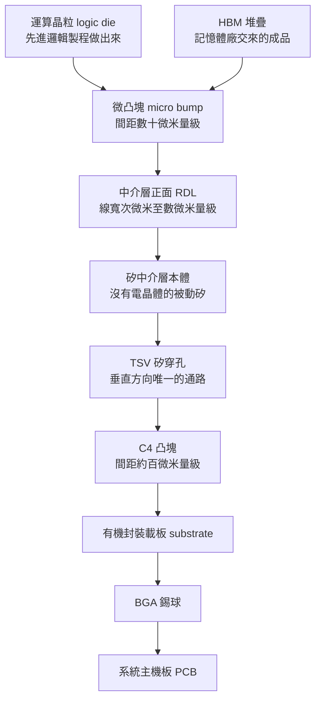
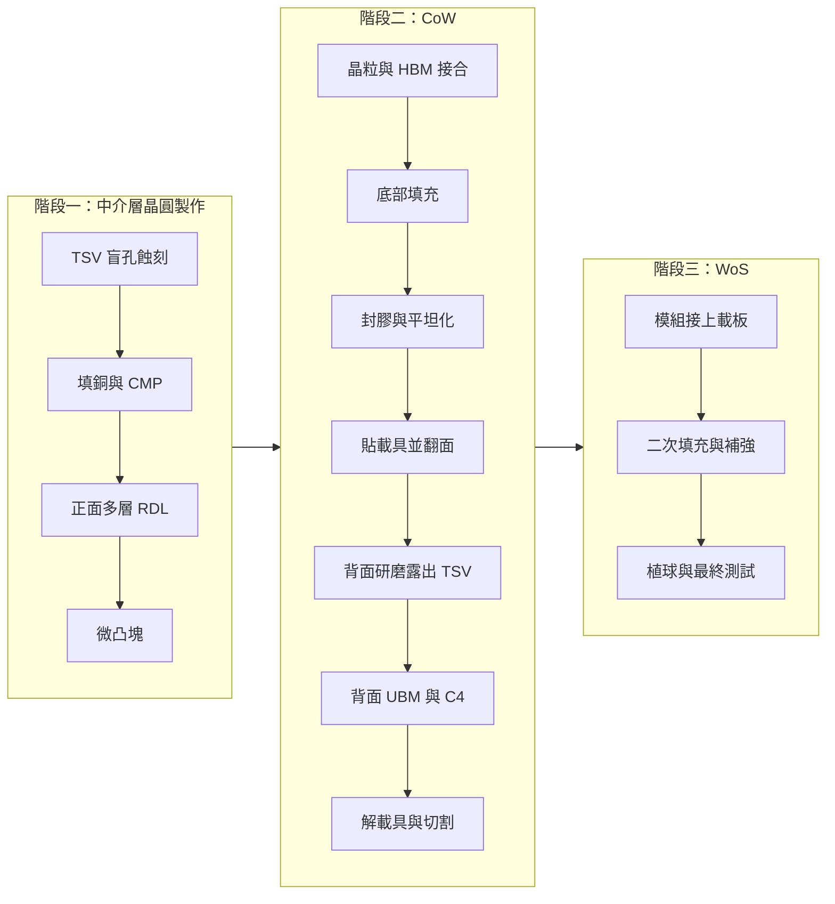
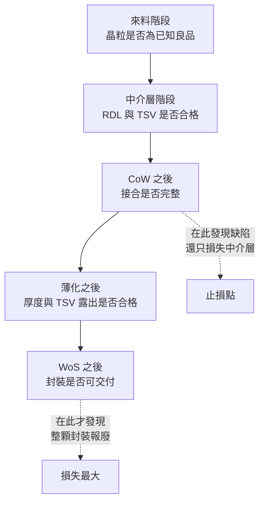

# 第 6 章：CoWoS-S — 矽中介層如何把邏輯與 HBM 綁在一起

## 開場問題

想像一個具體場景。

一座先進封裝廠區收到兩批來料：一批是已經測過的運算晶粒（logic die），一批是記憶體廠交來的 HBM 堆疊。客戶要求把它們組成一顆封裝，而且運算晶粒與每一顆 HBM 之間要有**上千條並行的線**。

工程師畫出設計，發現一件事：這麼多線，載板做不出來（[第 2 章](02-packaging-taxonomy.md)已經算過這筆帳，差了兩三個數量級）。於是解法變成——**再去晶圓廠做一片矽，這片矽上面不放任何電晶體，只用來走線**。

問題就從這裡開始：

> 多做這一片矽，讓工廠多了哪些站點？多了哪些會失敗的地方？「CoW」與「WoS」這兩個縮寫，各自在講哪一段？

本章只回答這三題。**本章不宣稱任何特定客戶的實際流程**——所有站點順序都是教學簡化的跨來源整理。

---

## 先看結構：由上往下切一刀

先看東西長什麼樣，再給名詞。

**圖 6-1**：CoWoS-S 的結構剖面，由上往下讀。每一層之間的接點間距是往下逐級變粗的——這道「間距階梯」是[第 3 章](03-materials-interconnect.md)訊號路徑的具體化。線寬與間距為量級示意，來自 B1 既有整理，**跨來源整理，未於本次重新取用原文**。

*把圖 6-1 攤開來看：中間大晶粒是運算（這裡是 2015 年的 GPU），四周是 HBM 堆疊，它們共同坐在矽中介層上。這是「Chip on Wafer on Substrate」裡 CoW 做完、WoS 也做完之後的成品。結構同類於 CoWoS-S（全矽中介層），不是台積電產線照片，也不是均豪客戶。*

*同一類結構拆開：運算晶粒還在，HBM 堆疊被拿掉，底下那片佈滿微接點的矽就是中介層。這張圖讓「中介層是一片被動矽、專門拿來走線」從名詞變成看得見的東西。*

*HBM 立方體的內部：DRAM 晶粒垂直堆疊，層間用 TSV 串起來，最底下用微凸塊接到中介層。本章的「HBM 來料」指的就是這一整顆已經堆好的立方體，不是單片 DRAM。*

*TSV 不是只有一種做法。Via-first 在做電晶體之前打孔，via-middle 在電晶體之後、金屬層之前，via-last 在金屬層之後。中介層是被動矽、沒有電晶體，時序選擇與邏輯晶圓不同；圖中要抓住的是：孔先做完，背面再磨穿。*

### 三個必須先講清楚的名詞

| 名詞 | 它實際上是什麼東西 | 為什麼存在 |
|---|---|---|
| **矽中介層（silicon interposer）** | 一片用晶圓製程做出來、但**不含電晶體**的矽 | 借用晶圓廠的線寬能力，來做封裝層級的走線 |
| **TSV（Through-Silicon Via，矽穿孔）** | 穿過矽本體的垂直銅柱 | 中介層是實心的矽，電源與訊號若不穿過去，就只能繞到邊緣——距離與電阻都不可接受 |
| **微凸塊（micro bump）** | 晶粒與中介層之間的小焊接點 | 在間距數十微米的尺度上，把上千條線一次接起來 |

!!! note "「被動」兩個字很重要"
    矽中介層上沒有電晶體，代表它**不需要跑前段的電晶體製程**，只需要蝕孔、填銅、做金屬層。這件事同時決定了兩件相反的事：一，它比邏輯晶圓便宜；二，它的面積可以做得比一般晶片大得多，因為沒有電晶體良率的拖累。但「便宜」是相對的——它仍然是一片走過晶圓廠的矽。

### 為什麼中介層必須被「薄化」

這是全章最容易略過、卻最關鍵的一點。

TSV 在製作時是**盲孔**（blind via）——從正面往下蝕出一個有底的洞，填銅，但它並沒有穿透整片矽晶圓。晶圓原本厚達數百微米，孔不可能一開始就打穿（深寬比會失控）。

所以流程一定是：**先做盲孔 → 做完正面的事 → 再把背面磨掉，直到 TSV 的底部露出來。**

「TSV」這個名字裡的「穿孔」，是**磨出來的**，不是鑽出來的。這一句話直接生出本書後面兩章的需求：磨到什麼厚度、厚度均勻度（TTV）如何、磨完的表面粗糙度如何（見[第 12 章](12-grinding-thinning.md)）。

---

## 逐步解釋製程：CoW 與 WoS 分別在講什麼

「CoWoS」= **Chip on Wafer on Substrate**。它其實是兩個動作接起來：

- **CoW（Chip-on-Wafer）**：把晶粒（chip）接到**中介層晶圓**（wafer）上。
- **WoS（Wafer-on-Substrate）**：把上一步做出來、再切下來的模組，接到**載板**（substrate）上。

!!! danger "最常見的誤解"
    CoW 裡的那個「Wafer」**不是運算晶粒的晶圓**，而是**中介層晶圓**。晶粒是被接上去的那一方，中介層是被接的那一方。搞反了，後面所有站點的加工對象都會推錯——而加工對象決定設備形態（[第 4 章](04-workpiece-flow.md)）。

### 教學簡化流程

以下站點順序是**跨來源教學整理**，經過合併與省略，不代表任何特定廠商的實際產線。

#### 階段一：中介層晶圓製作（純晶圓廠工作）

| # | 輸入 | 操作 | 輸出 | 目的 |
|---|---|---|---|---|
| 1 | 空白矽晶圓 | 深蝕刻出高深寬比的孔 | 帶盲孔的晶圓 | 為垂直通路開路 |
| 2 | 帶盲孔的晶圓 | 絕緣層、阻障層、種子層、電鍍填銅 | 填滿銅的盲孔 | 讓孔導電，且與矽電性隔離 |
| 3 | 填銅後的晶圓 | 平坦化（CMP），移除表面多餘銅 | 平整表面 | 讓後續 RDL 有可用的起始面 |
| 4 | 平整晶圓 | 逐層做 RDL（金屬＋介電層） | 多層細線走線面 | 把上千條 die 間連線佈出來 |
| 5 | RDL 完成 | 做 UBM 與微凸塊 | 可接合的正面 | 準備接晶粒 |

#### 階段二：CoW（Chip-on-Wafer）

| # | 輸入 | 操作 | 輸出 | 目的 |
|---|---|---|---|---|
| 6 | 中介層晶圓＋KGD 晶粒＋HBM 堆疊 | 取放、對位、接合（覆晶） | 晶粒已在晶圓上的組合體 | 完成 die 間互連 |
| 7 | 組合體 | 填入底部填充膠（underfill） | 凸塊被保護的組合體 | 分散熱應力，防凸塊疲勞 |
| 8 | 組合體 | 封膠（molding）並平坦化 | 表面平整的重組體 | 提供機械支撐與後續加工面 |
| 9 | 重組體 | 貼上暫時性載具，翻面 | 背面朝上的工件 | **薄化必須有支撐，否則破片** |
| 10 | 背面朝上的工件 | 背面研磨 → 露出 TSV → 背面介電與 UBM | TSV 已導通的背面 | 讓垂直通路真正貫穿 |
| 11 | 完成背面 | 植 C4 凸塊 → 解除載具 → 切割 | 一顆顆「中介層＋晶粒」模組 | 準備往載板走 |

#### 階段三：WoS（Wafer-on-Substrate）

| # | 輸入 | 操作 | 輸出 | 目的 |
|---|---|---|---|---|
| 12 | 模組＋有機載板 | 對位、回焊接合 | 載板上的封裝體 | 把訊號帶到系統層級 |
| 13 | 封裝體 | 二次底部填充、補強環／蓋板 | 機械穩定的封裝體 | 抑制翹曲、幫助散熱 |
| 14 | 封裝體 | 植 BGA 錫球、最終測試 | 出貨品 | 交付 |

**圖 6-2**：CoWoS-S 的製程站點圖，**教學簡化**。真實產線的站點更多，且各廠順序不同。這張圖的用途是定位「哪些站點需要磨、哪些需要檢」，不是拿來對照任何廠商的實際流程。

### 從流程讀出設備需求

把上面的流程重看一次，會發現三類需求密集出現：

| 需求類型 | 出現在哪些站點 | 為什麼 |
|---|---|---|
| **磨／平坦化** | 3、8、10 | TSV 填銅後要磨、封膠後要磨、背面要磨到露出 TSV |
| **載具處理** | 9、11 | 薄化必須有支撐；貼上與解除各是一個站點，載具本身循環使用 |
| **檢與量** | 幾乎每一站之後 | 接合後不可逆，缺陷愈晚發現愈貴 |

!!! note "循環載具是一個常被忽略的加工對象"
    步驟 9 貼上的暫時性載具（玻璃或矽）在解除之後**會被清洗、檢查、再次使用**。也就是說，這條產線上除了產品晶圓，還有一群「不是產品但必須合格」的載具在跑。載具的表面缺陷會直接印到產品上——這正是[第 4 章](04-workpiece-flow.md)強調工件形態的原因，也是本書後面談到 Carrier AOI 時的物理基礎。

---

## 失敗會長什麼樣子

CoWoS-S 的失敗有一個共同特徵：**大多數不可修復**。晶粒一旦接上並灌了底部填充膠，就拆不下來了（見 B1 對 rework 的討論；**跨來源整理，未於本次重新取用原文**）。

| 缺陷 | 怎麼形成 | 影響什麼 |
|---|---|---|
| **TSV 未填滿／空洞** | 高深寬比的孔電鍍不均，孔中段先封口 | 導通電阻異常，或溫度循環後開路 |
| **TSV 露出高度不一致** | 背面研磨的厚度均勻度（TTV）不足 | 部分 TSV 沒露出＝斷路；露太多＝後續 UBM 覆蓋不良 |
| **微凸塊冷接（non-wet）** | 對位偏差、表面氧化、共面性不足 | 某幾條線不通；上千條裡壞幾條就可能整顆報廢 |
| **微凸塊橋接短路** | 間距太小、焊料量過多或塌陷 | 相鄰訊號短路 |
| **底部填充膠空洞** | 膠流動受阻、排氣不良 | 應力集中，溫度循環後凸塊裂 |
| **翹曲（warpage）** | 矽、封膠、有機載板的熱膨脹係數不同 | 接合站對不準；嚴重時整片工件無法吸附或搬運 |
| **薄化破片／崩邊** | 晶圓磨到百微米量級後極脆，邊緣先崩 | 整片報廢，且碎屑污染設備 |
| **光罩拼接對準誤差** | 中介層面積超過單一曝光場，必須多次曝光拼接 | 拼接縫處的線接不上 |

### 面積放大帶來的那筆帳

中介層的面積不是想做多大就做多大。單一光罩曝光場約 26 × 33 mm，約 858 mm²（B1 整理；**跨來源整理，未於本次重新取用原文**）。超過這個面積，就必須用**光罩拼接（mask stitching）**——多次曝光把圖案接起來，而接縫的對準精度成為新的失敗來源。

同時，良率隨面積下降。一片面積是普通晶片好幾倍的矽，只要有一個致命缺陷就整片報廢。B1 的整理指出 CoWoS-S 的實務面積上限約在 3.3 至 3.5 倍光罩、約 2,700 mm² 量級（**跨來源整理，未於本次重新取用原文**；該書標為 [報導] 等級）。此處的 3.3–3.5× 是 **S 的天花板**，與[第 1 章](01-why-advanced-packaging.md)均豪法說引用的「2024 年約 3.3 倍 → 2029 年 14 倍」（G3，封裝面積相對光罩）**不是同一筆數字**；待查 1-2 結案前不可合併。

**這個天花板就是[第 7 章](07-cowos-r-l-icube.md)存在的全部理由。** 當面積需求超過全矽方案划算的範圍，就必須改變中介層的做法。

---

## 如何檢查與控制

CoWoS-S 的檢測難題可以濃縮成一句話：**要檢查的東西大部分埋在裡面，而外部看得到的只有表面。**

| 要確認什麼 | 方法 | 能力邊界 |
|---|---|---|
| 表面顆粒、刮傷、殘膠 | 光學檢測（AOI） | **只看得到表面**；埋在膠或矽下方的一律看不到 |
| 薄化後的厚度與均勻度 | 白光干涉、接觸式或非接觸式測厚 | 量的是幾何高度，不告訴你下方 TSV 有沒有斷 |
| 表面粗糙度、平坦度 | 白光干涉、原子力顯微鏡 | 取樣面積小，難以全片全檢 |
| TSV 內部空洞 | X-ray | 對**平行於射線方向的薄空洞**不敏感；解析度與穿透厚度互相拉扯 |
| 接合層剝離、空洞 | 超音波掃描（SAT） | 需要耦合介質；對非常薄的界面解析有限 |
| 矽底下的結構 | 紅外線穿透式檢測 | 矽對近紅外相對透明，但金屬層會擋住 |
| 電性是否真的通 | 晶圓級測試、中段測試、最終測試 | 探針扎不進太細的間距；全速測試在晶圓級受限 |

**最重要的觀念是「沒有一種方法能看穿一切」**。實務作法是把方法組合起來，並且在**還來得及止損**的節點插入檢查。這條原則在[第 11 章](11-defect-aoi-metrology.md)會展開成完整的矩陣。

### 控制邏輯：把錢花在前面

因為接合後不可修復，CoWoS-S 的品質策略是往前移的：

**圖 6-3**：檢查點與止損位置。每往右一格，一旦報廢所損失的累積價值就上升一個台階。這是所有先進封裝檢測需求的經濟基礎。

---

## 與均豪的連結

**本章沒有任何公開資料顯示均豪（5443）供應 CoWoS-S 產線的特定站點。** 以下只能指出製程需求的性質，以及均豪公開產品在能力上與哪些需求同類。

### ✅ 已確認事實

- 均豪的核心能力被公司自己歸納為「**檢、量、磨、拋**」。`[公司自述]`（G1、G6）
- 均豪公開產品包含 Carrier AOI、白光干涉量測、Strip Grinder、再生晶圓 CMP 與拋光。`[公司自述]`（G1、G2、G3）。**產品名在此只是清單**——Strip Grinder 的公開用詞含 strip 形態封裝體，**不是**公開證實的中介層背磨或 TSV 揭露；再生晶圓 CMP 是另一條市場，見[第 12 章](12-grinding-thinning.md)。
- 均豪在 2026-08-12 法說中**引用市場數字**：CoWoS 月產能 2023 年約 1.3 萬片、2027 年估約 20 萬片；每片先進封裝晶圓約搭配 2.5 片循環載具；載具月產量 2022 年約 1 萬、2026 年約 13 萬。`[公司自述]`（G3）——**這是均豪引用的市場預估，不是均豪自己的營收或訂單。**
- 均豪 Carrier AOI 於 2026 年獲「國際封裝大廠」認證並進入量產放量。`[公司自述]`（G2、G3）**該大廠未具名，本書維持未具名。**

### 🔶 合理推論

- 本章步驟 9、11 的暫時性載具是循環使用的，其表面品質會直接影響產品——**這說明了載具檢測這個站點在物理上為什麼必要**。均豪 Carrier AOI 屬於這個站點的設備類別。`[推論]`
- 本章步驟 3、8、10 需要研磨與平坦化，但均豪已公開放量的「磨」集中在再生晶圓與載板／封裝端。**不能**把這些站點寫成與均豪產品同類。形態與目的是否為晶圓級薄化，見[第 12 章](12-grinding-thinning.md)與待查 12-6。`[推論]`
- 均豪引用 CoWoS 月產能與載具數量的成長曲線，顯示公司自己是**用這條因果在對投資人解釋需求**。`[推論]`

### ❓ 尚待查證

- 均豪的公開資料**沒有按 CoWoS-S／R／L 分別揭露**設備對應關係。本書無法判斷其設備進入的是哪一個子平台，甚至無法確認是否進入 CoWoS 產線（待查 6-6／15-2，**P1**）。是否對應 CoW 或 WoS 是另一題（待查 6-5）。
- 「國際封裝大廠」與媒體所稱「晶圓代工大廠先進封測廠區」（G5，`[媒體報導]`）是否為同一家，無公開證據（待查 15-1）。

!!! danger "本章不能推出的結論"
    「CoWoS-S 需要背面研磨與載具檢測；均豪做研磨與載具 AOI；所以均豪供應 CoWoS-S」——**無效**。設備類別能用於某製程，與某公司已供應該製程，是兩件需要各自舉證的事。

---

## 理解檢查

???+ question "Q1：有人說「TSV 是在中介層上鑽穿的孔」。這句話哪裡不精確？為什麼這個不精確會導致設備需求推錯？"
    不精確在**時序**。TSV 在製作時是**盲孔**——從正面蝕出有底的洞並填銅，此時並沒有穿透晶圓。它之所以最後「穿」了，是因為**背面被磨掉**，把孔底磨出來。

    為什麼重要：如果以為 TSV 是一次鑽穿的，就會漏掉「背面研磨」這一整個站點，以及它帶來的厚度均勻度（TTV）、粗糙度、破片、支撐載具等需求。而這一站正是本書「磨」與「量」需求的主要來源之一。

???+ question "Q2：CoW 的「W」指的是哪一片晶圓？答錯會怎樣？"
    指的是**中介層晶圓**，不是運算晶粒的晶圓。晶粒是被接上去的一方。

    答錯的後果：會把加工對象認成「邏輯晶圓」，於是推導出的設備形態、尺寸、搬運方式全錯。加工對象決定設備——這是[第 4 章](04-workpiece-flow.md)的主線。

???+ question "Q3：為什麼中介層面積大到某個程度之後，全矽方案就不划算了？請講出兩個各自獨立的原因。"
    1. **良率隨面積下降**：一片幾千平方毫米的矽必須全區無致命缺陷，面積愈大，中獎機率愈高，而報廢的是整片。
    2. **光罩拼接**：單一曝光場約 858 mm² 量級，超過就得多次曝光拼接，接縫的對準精度成為新的失敗來源，且拼接次數增加會再疊上一層損失。

    這兩個原因是獨立的：就算拼接做得完美，良率仍然會隨面積掉；就算良率模型很好，拼接誤差仍然存在。兩者共同構成 CoWoS-S 的面積天花板，也是 [第 7 章](07-cowos-r-l-icube.md)各種替代中介層做法的動機。

???+ question "Q4：某新聞說「某廠導入新的 X-ray 檢測設備，可望大幅提升先進封裝良率」。請指出這句話至少需要補上的兩項資訊，並說明 X-ray 的能力邊界。"
    需要補上：
    1. **檢的是哪一個站點**（TSV 空洞？凸塊接合？封裝完成後？）——不同站點的止損價值差好幾個量級。
    2. **檢出的缺陷類型是什麼**，以及原本是用什麼方法檢的。

    能力邊界：X-ray 靠密度差成像，對**與射線方向平行的薄層空洞**不敏感；解析度與可穿透厚度互相拉扯，看得愈細通常穿得愈淺。所以它不是萬能，也不能單獨保證良率。詳見[第 11 章](11-defect-aoi-metrology.md)。

???+ question "Q5：CoWoS-S 產線上，除了產品晶圓之外還有一種「必須合格但不會出貨」的工件。它是什麼？為什麼它值得一整條檢測需求？"
    **循環使用的暫時性載具**（玻璃或矽 carrier）。薄化與搬運時工件需要支撐，載具貼上、加工、解除、清洗，然後再用。

    值得檢測的原因很直接：載具上的顆粒、刮傷或殘膠，會在貼合時**印到產品上**，或造成貼合不均而導致薄化厚度異常。一片壞載具可能連續毀掉多片產品。這是均豪 Carrier AOI 這類設備存在的物理理由——但**理由存在不等於供應關係存在**，見[第 15 章](15-gpm-product-map.md)。

---

## 來源與待查事項

### 本章來源

| 主張 | 來源 | 等級 | 日期 |
|---|---|---|---|
| CoWoS-S 結構、TSV 為盲孔後薄化露出 | T1、T3、B1 | 官方分類加既有整理；**跨來源整理，未於本次重新取用原文** | — |
| 光罩曝光場約 26 × 33 mm、約 858 mm² | B1 | 量級示意；**跨來源整理，未於本次重新取用原文** | — |
| CoWoS-S 實務面積上限約 3.3–3.5 倍光罩、約 2,700 mm² | B1（該書標為 [報導]） | **量級示意，非官方數字**；**跨來源整理，未於本次重新取用原文** | — |
| RDL 線寬、微凸塊與 C4 間距量級 | B1、T3 | 量級示意；**跨來源整理，未於本次重新取用原文** | — |
| 教學簡化流程（14 個站點） | 本書自建整理 | **教學簡化**，非任何廠商實際流程 | 2026-09-09 |
| 均豪檢量磨拋定位與公開產品 | G1、G2、G3、G6 | `[公司自述]` 為主 | 2026-08-31 快照 |
| CoWoS 月產能、載具數量成長曲線 | G3 | `[公司自述]`，但內容為**均豪引用的市場預估** | 2026-08-12 法說 |

各代號定義見[附錄 A 來源索引](appendix-sources.md)。

### 待查事項

| # | 問題 | 為什麼重要 | 會怎麼查 |
|---|---|---|---|
| 6-1 | CoWoS-S 目前的官方面積上限與世代對應為何？ | 本章用的是既有整理的量級，非官方值 | TSMC 官方技術頁與研討會論文（T1） |
| 6-2 | 中介層薄化後的目標厚度與 TTV 規格，有無可公開引用的數字？ | 直接決定研磨與量測設備的規格門檻 | 設備商技術文件（E3）、SEMI 標準 |
| 6-3 | 循環載具的實際循環次數與報廢判準為何？ | 決定 Carrier AOI 的需求量級推算是否合理 | 封裝廠或載具供應商技術資料 |
| 6-4 | 均豪引用的「每片先進封裝晶圓搭配約 2.5 片循環載具」原始出處為何？ | 這個係數是需求推算的關鍵乘數 | 法說簡報原檔（G3）的引用註記 |
| 6-5 | 均豪是否曾說明其設備對應 CoW 或 WoS 的哪一段？ | 與 P1（S／R／L）不同題。決定矩陣能否細到製程段 | 法說 Q&A、展場技術資料 |
| 6-6 | 均豪是否曾按 CoWoS 子平台（S／R／L）說明設備對應？（**P1**） | 與[第 15 章](15-gpm-product-map.md)待查 15-2 同源 | 法說 Q&A、展場技術資料、年報 |

---

> 下一頁：[第 7 章 CoWoS-R、CoWoS-L 與 I-Cube](07-cowos-r-l-icube.md)　｜　相關頁面：[第 2 章 封裝分類](02-packaging-taxonomy.md) ｜ [第 4 章 工件形態](04-workpiece-flow.md) ｜ [第 8 章 HBM](08-hbm.md) ｜ [第 11 章 缺陷與量測](11-defect-aoi-metrology.md) ｜ [第 12 章 研磨與薄化](12-grinding-thinning.md)
