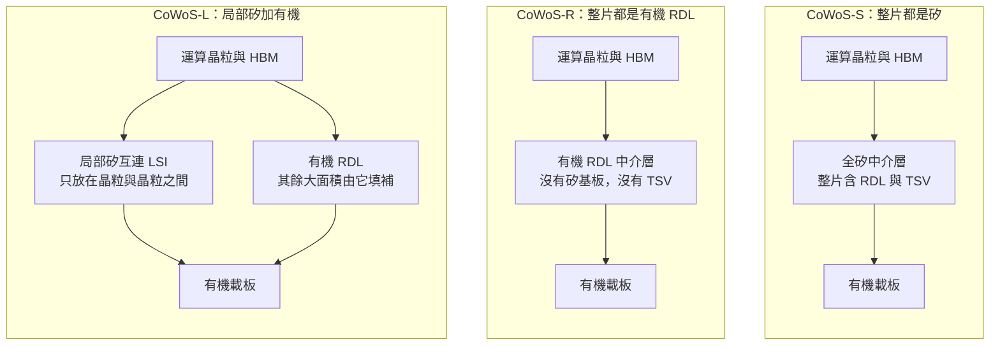
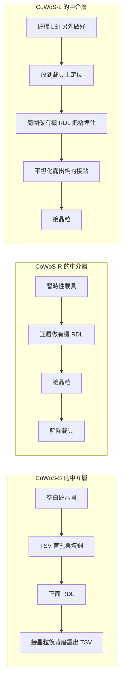
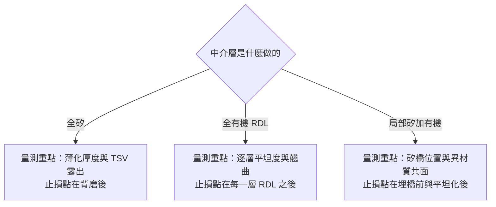

# 第 7 章：CoWoS-R、CoWoS-L 與 I-Cube — 中介層為什麼會出現不同做法

## 開場問題

[第 6 章](06-cowos-s.md)最後留下一個天花板：全矽中介層做到約 3.3 至 3.5 倍光罩、約 2,700 mm² 量級之後，就開始不划算（B1 整理，該書標為 [報導] 等級；**跨來源整理，未於本次重新取用原文**）。這是 **CoWoS-S 的面積上限**，與均豪法說引用的「2024 年約 3.3 倍 → 2029 年 14 倍」（G3，封裝面積相對光罩）不是同一筆；後者見待查 1-2／7-4。

現在假設一個具體情境。

一顆新一代加速器的設計送進來：兩顆大運算晶粒並排，旁邊要放 8 到 12 顆 HBM。把它們攤平量一量，需要的中介層面積是全矽方案上限的**一倍半以上**。

三條路擺在眼前：

1. 硬做更大的全矽中介層——良率與拼接次數同時惡化。
2. 不用矽，改用有機材料做中介層——便宜、可以做大，但線做不到那麼細。
3. **只在真正需要細線的地方用矽**，其餘用便宜的有機材料。

本章要回答的核心問題就是：**為什麼中介層會長出這麼多做法？每一種做法各自付出什麼代價？** 順帶處理一個實務問題——I-Cube 是 Samsung 的家族名稱，它的各個版本**必須按來源分列**，不可跨版本混寫。

---

## 先看結構：中介層那一層被換掉了

三種做法的差別，全部集中在圖 6-1 的**中間那一層**。晶粒在上、載板在下，這兩端不變。

**圖 7-1**：三種中介層做法的結構對照，上下順序與[圖 6-1](06-cowos-s.md) 一致。差別只在中間層的材料與範圍。

*這張是[第 6 章](06-cowos-s.md)的全矽方案（結構同類於 CoWoS-S）。本章要問的是：當面積再長、這片矽做不大時，中間那層換成什麼。CoWoS-R／L 的公開實物照很少，對照請用圖 7-1：R 把整片矽拿掉，L 只留晶粒與晶粒之間那一小塊。*

### 三個新名詞

| 名詞 | 是什麼 | 為什麼要它 |
|---|---|---|
| **RDL 中介層** | 直接在載具上逐層做出來的重佈線層，**沒有矽基板** | 不必買一片矽晶圓，也不必做 TSV；成本明顯低 |
| **LSI（Local Silicon Interconnect，局部矽互連）** | 一小塊嵌在有機層裡的矽，上面有極細的線 | 只在需要上千條連線的地方用矽 |
| **光罩倍數（reticle count）** | 封裝面積是單一曝光場的幾倍 | 比絕對面積更耐用的比較單位，因為曝光場尺寸是固定的 |

### 為什麼「局部」反而能做得更大

這是本章最反直覺的一點，值得停下來想清楚。

直覺會說：矽的線比較細，所以矽用得愈多愈好。但**良率不是這樣分配的**。

- 全矽方案：**整片幾千平方毫米的矽都必須無致命缺陷**。面積翻倍，中獎機率大幅上升。
- 局部矽方案：只有**幾片指甲大小的矽橋**必須是良品。小面積的良率極高；其餘大面積交給便宜、柔韌、容易做大的有機材料。

換句話說，局部矽把「必須完美的面積」縮小了一到兩個數量級。這就是為什麼最大面積的封裝反而走局部矽路線，而不是繼續放大全矽中介層。

!!! note "同樣的想法，別人更早做過"
    「只在需要的地方放一小塊矽」這個概念，Intel 的 EMIB 比 CoWoS-L 更早提出。兩者的差別不在想法，而在**橋接片埋在哪一層**——這正是[第 10 章](10-emib-bridge.md)的主題。

---

## 逐步解釋製程：三條路各自多做了什麼

以下流程為**教學簡化的跨來源整理**，站點經過合併與省略，不代表任何廠商的實際產線。三條路的階段二（CoW）與階段三（WoS）大致沿用[第 6 章](06-cowos-s.md)的骨架，差異集中在**中介層本身怎麼做出來**。

### CoWoS-R：把矽整片拿掉

| # | 輸入 | 操作 | 輸出 | 目的 |
|---|---|---|---|---|
| 1 | 暫時性載具 | 在載具上塗佈介電層 | 起始面 | RDL 需要一個平整的生長基礎 |
| 2 | 起始面 | 逐層做 RDL：微影、電鍍、介電、平坦化 | 多層有機 RDL | 建立 die 間走線 |
| 3 | RDL 層 | 做接合面（UBM／凸塊） | 可接晶粒的正面 | 準備 CoW |
| 4 | 完成的 RDL 中介層 | 接晶粒、填充、封膠 | 組合體 | 同第 6 章 |
| 5 | 組合體 | **解除載具**、做背面接點 | 可接載板的模組 | 這裡沒有「磨到露出 TSV」這一步 |

**關鍵差異**：沒有 TSV，就沒有「背面磨到露出 TSV」這個站點。但**多了載具的貼合與解除**，而且 RDL 的每一層都需要平坦度控制——因為它是一層層堆上去的，前一層的不平會被後面放大。

### CoWoS-L：把矽切成小塊埋進去

| # | 輸入 | 操作 | 輸出 | 目的 |
|---|---|---|---|---|
| 1 | 矽晶圓 | 做極細 RDL 與（視版本）TSV，切成小片 | 一片片 LSI 矽橋 | 提供局部高密度互連 |
| 2 | 載具 | 定位並固定矽橋 | 矽橋已就位的載具 | **位置精度直接決定後續能不能對上** |
| 3 | 已放矽橋的載具 | 在周圍與其上做有機 RDL，把矽橋埋起來 | 混合中介層 | 用便宜材料填滿其餘面積 |
| 4 | 混合中介層 | 平坦化，露出矽橋的接點 | 可接合的正面 | 矽橋與有機區必須共面 |
| 5 | — | 接晶粒、填充、封膠、解載具、接載板 | 封裝體 | 同第 6 章骨架 |

**關鍵差異**：多了「放矽橋」與「把矽橋埋起來後平坦化」兩件事。第 4 步的平坦化特別關鍵——**矽橋區與有機區的材料不同，磨起來的移除速率不同**，很容易磨出高低差。

**圖 7-2**：三種中介層的製作路徑差異，**教學簡化**。注意三條路各自需要的「磨」不同：S 是背磨露出 TSV，R 是每層 RDL 的平坦化，L 是異材質共面的平坦化。

---

## 比較表：S、R、L 與 I-Cube

**這張表的每一列都標了資料日期與來源。日期不同的列不可直接相減或推論趨勢。**

| 項目 | CoWoS-S | CoWoS-R | CoWoS-L | Samsung I-Cube4 |
|---|---|---|---|---|
| 廠商 | TSMC | TSMC | TSMC | Samsung |
| 中介層材料 | 全矽 | 全有機 RDL | 局部矽橋嵌入有機 RDL | 矽中介層 |
| 有無 TSV | 有 | **無** | 矽橋含 TSV，有機區無 | 有 |
| 最細線寬（量級） | 次微米至數微米 | 約數微米 | 矽橋區最細，有機區約數微米 | 未取得可引用的公開數字 |
| 面積上限（量級） | 約 3.3–3.5 倍光罩 | 較小 | 5.5 倍光罩量產中，路線圖指向更大 | 未取得 |
| 材料界面數 | 最少，CTE 最匹配 | 中 | **最多，翹曲管控最難** | 同 S 類 |
| 相對成本 | 高 | 低 | 中高 | 未取得 |
| 代表狀態 | 成熟量產 | 2023 年起量產 | 2024 年起量產，已為旗艦主力 | 量產中 |
| **資料日期** | B1 整理至 **2026-09** | B1 整理至 **2026-09** | B1 整理至 **2026-09** | B1 整理至 **2026-09** |
| **來源與等級** | B1／T1，**跨來源整理，未於本次重新取用原文** | B1（該書標 [報導]），**未於本次重新取用原文** | B1（該書標 [官方／報導] 混合），**未於本次重新取用原文** | B1（該書標 [官方]），**未於本次重新取用原文** |

**表 7-1**：中介層做法比較。所有數字為**量級示意**；需要精確值時請回 T1、T4 原廠文件核對（見待查 7-1、7-2）。

### 關於 I-Cube 的處理原則

I-Cube 是 Samsung 的 2.5D 家族名稱，數字後綴（如 I-Cube4）通常指**可整合的 HBM 顆數**。本書在此**只列出有來源可對應的版本**：

| 版本 | 本書取得的描述 | 來源 | 資料日期 |
|---|---|---|---|
| **I-Cube4** | 4 顆 HBM 加 1 顆邏輯晶粒，置於矽中介層上；量產中 | B1（標 [官方]），**未於本次重新取用原文** | B1 整理至 2026-09 |
| 其他 I-Cube 版本 | **本次未取得可引用的公開描述** | — | — |

**表 7-2**：I-Cube 版本表。空白就是空白，不從 I-Cube4 推論其他版本。

!!! danger "跨版本混寫是本章最容易犯的錯"
    常見的錯法有三種：

    1. 把 I-Cube4 的規格套到未具名的「I-Cube」。
    2. 把 CoWoS-L 的 5.5 倍光罩拿去描述 CoWoS-S。
    3. 把某一年的面積上限拿來解釋另一年的產品。

    處理原則：**每一個數字都要能講出「這是哪一版、哪一年的資料」**。講不出來，就降級成「量級示意」或標為待查。

---

## 失敗會長什麼樣子

三條路各自有各自的失敗模式。**把 S 的缺陷清單套到 L 上，是本章第二容易犯的錯。**

| 做法 | 特有缺陷 | 怎麼形成 | 影響什麼 |
|---|---|---|---|
| **CoWoS-S** | TSV 空洞、TSV 露出不均、光罩拼接錯位 | 見[第 6 章](06-cowos-s.md) | 斷路、良率隨面積衰減 |
| **CoWoS-R** | RDL 層間對準漂移、介電層裂、翹曲 | 有機材料的熱膨脹係數遠大於矽；逐層堆疊會累積誤差 | 細線斷路；大面積下翹曲更嚴重 |
| **CoWoS-R** | 解除載具時的殘膠與變形 | 沒有矽基板撐著，工件本身很軟 | 後續接合對不準 |
| **CoWoS-L** | 矽橋位置偏移 | 放置站的定位精度不足 | 橋上的線接不到晶粒的接點 |
| **CoWoS-L** | 矽橋區與有機區高低差（凹陷或凸起） | **兩種材料的研磨移除速率不同** | 接合時局部接不上或壓壞 |
| **CoWoS-L** | 多材料界面翹曲 | 矽橋、有機 RDL、封膠、載板四種熱膨脹係數疊在一起 | 接合站對位困難、可靠度下降 |

### 一個真實發生過的教訓

B1 的整理記錄了一段值得引用的歷史：2024 年下半有報導指出，某旗艦產品在導入局部矽橋方案時，遭遇**運算晶粒、矽橋、RDL 中介層與載板之間熱膨脹係數不匹配造成的翹曲**問題，需重新設計頂層金屬與凸塊才改善良率（B1，該書標 [報導] 等級；**跨來源整理，未於本次重新取用原文**）。

這件事的教學價值不在八卦，而在因果：**局部矽方案的好處（成本、面積）是用更複雜的材料界面換來的**。CoWoS-L 的中介層堆疊裡有四種不同熱膨脹係數的材料，CoWoS-S 只有兩種。省下的良率從一個地方拿回來，從另一個地方付出去。

---

## 如何檢查與控制

三條路對量測的需求不同，這是本章對設備最有意義的一段。

| 做法 | 最關鍵的量測項目 | 為什麼 | 能力邊界 |
|---|---|---|---|
| **CoWoS-S** | 薄化後厚度與 TTV、TSV 露出高度 | 決定垂直通路是否導通 | 表面量測看不到孔內空洞，須配合 X-ray |
| **CoWoS-R** | **每層 RDL 的厚度與平坦度**、層間對準 | 誤差會逐層累積放大 | 白光干涉量的是高度，不判斷線是否斷 |
| **CoWoS-R** | 大面積翹曲量 | 有機材料翹曲遠大於矽 | 需在不同溫度下量，室溫量測不代表回焊時的狀態 |
| **CoWoS-L** | **矽橋放置位置精度** | 錯位就是斷路 | 埋起來之後就看不到了，必須在埋之前檢 |
| **CoWoS-L** | 平坦化後的**異材質共面性** | 兩種材料磨速不同，容易磨出台階 | 白光干涉可量高低差，但對材料界線的判讀需要影像配合 |

**圖 7-3**：中介層做法決定量測重點與止損位置。這張圖說明了為什麼「CoWoS 擴產」這五個字不足以推導設備需求——**擴的是哪一種，需要的量測站點就不同**。

!!! note "這一點直接推翻一種常見的推論"
    「CoWoS 產能翻倍，所以 TSV 相關設備需求翻倍」——**錯**。CoWoS-R 完全沒有 TSV；CoWoS-L 的 TSV 只在小片矽橋上，面積遠小於全矽中介層。這是[第 2 章](02-packaging-taxonomy.md)「家族當單品」錯誤的具體版本。

---

## 與均豪的連結

**本章無均豪（5443）公開證據。**

均豪的公開資料**從未按 CoWoS 子平台（S／R／L）或 I-Cube 版本說明其設備對應關係**，也沒有任何公開來源指出均豪供應上述任一子平台的特定站點。本節只能指出製程需求的性質。

### ✅ 已確認事實

- 均豪公開產品線包含白光干涉量測（公開說明精度 1 μm × 1 μm 量級）、Carrier AOI、各類研磨與拋光設備。`[公司自述]`（G1、G2、G3）
- 均豪 2026-08-12 法說引用一組市場數字，解釋為何封裝要「更薄、更平、更會散熱」：**封裝面積相對光罩尺寸的倍數**，2024 年約 3.3 倍、2029 年估 14 倍以上。`[公司自述]`（G3）——**這是均豪引用的第三方路線圖，不是均豪的訂單。** 這組 G3 數字與表 7-1 的 CoWoS-S「3.3–3.5 倍光罩上限」（B1）來源不同：一個是 2024 起點、會走到 14×，一個是 S 的天花板。待查 1-2 結案前不可合併。

### 🔶 合理推論

- 圖 7-3 顯示不同中介層做法的量測重點不同：R 偏向**逐層平坦度**，L 偏向**位置精度與異材質共面性**。這兩者在能力類別上都落在「量」與「檢」，與均豪公開能力同類。`[推論]`
- 因為子平台決定站點，**任何從「CoWoS 擴產」直接推導均豪受惠程度的說法，都缺少一個必要環節**。`[推論]`

### ❓ 尚待查證

- 均豪設備對應的是哪一個子平台，公開資料無此層級揭露（[第 15 章](15-gpm-product-map.md)待查 15-2）。
- 均豪引用的「封裝面積相對光罩 3.3× → 14×」路線圖原始出處與適用範圍為何（本章待查 7-4；與待查 1-2 同源）。

!!! danger "本章不能推出的結論"
    「CoWoS-L 需要異材質平坦化與高精度量測；均豪做研磨與白光干涉；所以均豪受惠於 CoWoS-L 擴產」——**無效**。中間缺了「賣給誰、用在哪條線、是哪一個子平台」三個必須各自舉證的問題。

---

## 理解檢查

???+ question "Q1：為什麼「只在局部用矽」反而能把封裝做得比「整片都是矽」更大？"
    因為**良率的分配方式不同**。

    全矽方案要求整片幾千平方毫米的矽都無致命缺陷，面積愈大，報廢機率愈高，而報廢的是整片。局部矽方案只要求幾片指甲大小的矽橋是良品——小面積良率極高——其餘大面積用便宜、可做大、機械上更柔韌的有機材料填補。

    也就是說，局部矽把「必須完美的面積」縮小了一到兩個數量級。代價是材料界面變多，翹曲更難管。

???+ question "Q2：某分析師寫「CoWoS 產能三年內成長十倍，TSV 蝕刻與填充設備將同步受惠」。這句話的漏洞在哪？"
    漏在**沒有區分子平台**。

    - CoWoS-**R** 完全沒有 TSV。
    - CoWoS-**L** 的 TSV 只在小片矽橋上，總面積遠小於全矽中介層。
    - 只有 CoWoS-**S** 的 TSV 需求與中介層面積成正比。

    所以「CoWoS 產能成長」與「TSV 設備需求成長」之間不是等號，中間隔著「新增的產能屬於哪一種子平台」這個問題。這是[第 2 章](02-packaging-taxonomy.md)「家族當單品」錯誤的典型例子。

???+ question "Q3：CoWoS-L 的平坦化，比 CoWoS-S 的背面研磨多了哪一項物理難題？"
    **異材質共面**。

    CoWoS-S 的背磨面基本上是矽（加上封膠與 TSV 銅），而 CoWoS-L 的平坦化面同時有**矽橋**與**有機 RDL** 兩種材料，兩者的研磨移除速率不同。磨的時間一樣，磨掉的深度不一樣，於是磨出高低差。

    後果：接合時，凸出的區域先被壓到、凹陷的區域接不上。這是一個「同一站點、不同做法、需求完全不同」的具體例子——正是本書堅持不把子平台混寫的理由。

???+ question "Q4：你看到一份簡報寫「I-Cube 支援 8 顆 HBM」，但沒有註明版本與日期。你會怎麼處理這個數字？"
    **不採用，或降級為待查。**

    I-Cube 是家族名稱，數字後綴通常指可整合的 HBM 顆數，**不同版本的規格不同**。沒有版本與日期的規格，無法判斷它描述的是哪一代、是路線圖還是量產狀態。

    正確做法：回 Samsung 官方技術頁（T4）核對版本，並在引用時寫成「I-Cube〈版本〉，資料日期〈年月〉」。本書表 7-2 就是這樣處理的——只列有來源的 I-Cube4，其他留空。

???+ question "Q5：三種中介層做法各自的「止損點」在哪一站？為什麼這個問題對設備商比對投資人更重要？"
    - **CoWoS-S**：背面研磨之後（此時還只損失中介層與已接上的晶粒）。
    - **CoWoS-R**：每一層 RDL 完成之後（誤差會逐層累積，愈早發現省愈多）。
    - **CoWoS-L**：矽橋埋起來之前（埋了就看不到了），以及平坦化之後。

    對設備商更重要的原因：**止損點就是檢測與量測設備的插入位置**。客戶願意在哪一站買一台檢測機，取決於那一站往後的累積價值有多高。這條邏輯在[第 11 章](11-defect-aoi-metrology.md)與[第 14 章](14-yield-capacity-capex.md)會被完整展開。

---

## 來源與待查事項

### 本章來源

| 主張 | 來源 | 等級 | 日期 |
|---|---|---|---|
| CoWoS-S／R／L 的中介層材料與 TSV 有無 | T1、B1 | 官方分類加既有整理；**跨來源整理，未於本次重新取用原文** | B1 整理至 2026-09 |
| CoWoS-R 約 2023 年起量產、線寬量級 | B1（標 [報導]） | 量級示意；**未於本次重新取用原文** | B1 整理至 2026-09 |
| CoWoS-L 5.5 倍光罩量產、2024 年起量產 | B1（標 [官方／報導] 混合） | 量級示意；**未於本次重新取用原文** | B1 整理至 2026-09 |
| 局部矽橋方案的翹曲教訓 | B1（標 [報導]） | 事件性描述，未具名產品時本書維持未具名；**未於本次重新取用原文** | 2024 年下半事件，B1 整理至 2026-09 |
| I-Cube4 為 4 顆 HBM 加 1 顆邏輯晶粒、量產中 | B1（標 [官方]），對應 T4 | **僅此版本**；**未於本次重新取用原文** | B1 整理至 2026-09 |
| 三條路的製程站點差異 | 本書自建整理 | **教學簡化**，非任何廠商實際流程 | 2026-09-09 |
| 均豪白光干涉、Carrier AOI、研磨產品 | G1、G2、G3 | `[公司自述]` | 2026-08-31 快照 |
| 封裝面積相對光罩 3.3× → 14× 路線圖 | G3 | `[公司自述]`，內容為**均豪引用的第三方預估**；**不是**表 7-1 的 S 面積上限 | 2026-08-12 法說 |

各代號定義見[附錄 A 來源索引](appendix-sources.md)。

### 待查事項

| # | 問題 | 為什麼重要 | 會怎麼查 |
|---|---|---|---|
| 7-1 | CoWoS-R 與 CoWoS-L 的官方線寬／線距規格為何？ | 本章用的是既有整理的量級，非官方值 | TSMC 官方技術頁與研討會論文（T1） |
| 7-2 | I-Cube 除 I-Cube4 外的其他版本規格與時間點 | 本書表 7-2 目前是空白，無法做世代比較 | Samsung 官方技術頁（T4） |
| 7-3 | 局部矽橋的放置位置精度規格（量級）為何？ | 直接決定放置設備與檢測設備的門檻 | 設備商技術文件、ECTC 類論文 |
| 7-4 | 均豪引用的「封裝面積相對光罩 3.3× → 14×」原始出處為何？定義是封裝面積還是中介層面積？ | 與待查 1-2 同源。這條曲線是均豪對外解釋需求的主要依據 | 法說簡報原檔（G3）的引用註記 |
| 7-5 | 異材質平坦化（矽橋與有機 RDL 共面）有無可引用的規格或檢測標準？ | 這是 CoWoS-L 特有的量測需求，也是設備差異點 | 設備商技術文件（E3）、SEMI 標準 |

---

> 下一頁：[第 8 章 HBM：從 DRAM 晶粒到記憶體堆疊](08-hbm.md)　｜　相關頁面：[第 2 章 封裝分類](02-packaging-taxonomy.md) ｜ [第 6 章 CoWoS-S](06-cowos-s.md) ｜ [第 10 章 EMIB 與局部橋接](10-emib-bridge.md) ｜ [第 11 章 缺陷與量測](11-defect-aoi-metrology.md) ｜ [第 15 章 均豪產品地圖](15-gpm-product-map.md)
