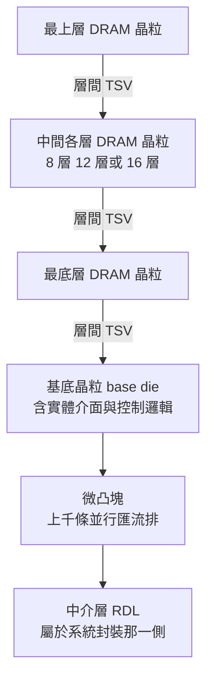
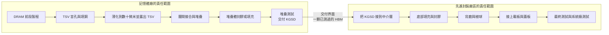
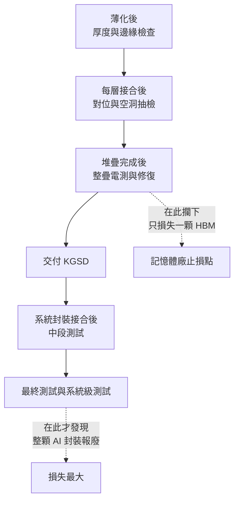

# 第 8 章：HBM — 從 DRAM 晶粒到記憶體堆疊

## 開場問題

[第 6 章](06-cowos-s.md)的流程裡有一句話被輕輕帶過：「HBM 堆疊——記憶體廠交來的成品」。

這句話藏了一整座工廠。

一顆 HBM 本身就是一個 **3D 封裝**：十幾層 DRAM 晶粒垂直疊起來，用 TSV 串接，底下再放一顆負責介面與控制的基底晶粒（base die）。它在被送進先進封裝廠區之前，已經走完了自己的薄化、堆疊、接合、封裝與測試。

於是本章的核心問題是：

> **「做出 HBM」與「把 HBM 裝進 AI 封裝」，是同一件事嗎？如果不是，責任分界線畫在哪裡？**

這個問題不是名詞學問。它直接決定：某一則「HBM 良率」新聞講的是誰家的工廠、某一台設備賣給誰、某一個缺陷該由誰負責。

---

## 先看結構：一個 3D（HBM）加一個 2.5D（系統封裝）

先看東西長什麼樣。

**圖 8-1**：一顆 HBM 的內部結構，由上往下讀。基底晶粒以上由記憶體廠完成，中介層那一層屬於系統封裝——**分界線的確切位置正是本章要處理的問題**，圖 8-2 會把它畫清楚。

*對應圖 8-1 的剖面。從上往下是 DRAM 晶粒，垂直銅柱是層間 TSV，最底下那排球是接到系統封裝中介層的微凸塊。虛線以上是記憶體廠的責任，虛線以下才進入 CoWoS／I-Cube 那類系統封裝。*

*系統封裝這一側看到的 HBM：已經是封好、測完的立方體，被擺在運算晶粒旁邊。這一張講的是「把 HBM 裝進去」，不是「做出 HBM」。*

*責任分界的另一個角度看：運算晶粒還在，HBM 的位置變成中介層上兩塊密密麻麻的接點。系統封裝廠要保證的，是這些接點與送來的 HBM 立方體對得準、接得上、測得過。*

### 名詞

| 名詞 | 是什麼 | 為什麼存在 |
|---|---|---|
| **DRAM 晶粒** | 記憶體陣列本身 | 儲存資料 |
| **基底晶粒（base die）** | 堆疊最底下那一顆，含介面電路與控制邏輯 | 把整疊 DRAM 的訊號整理成對外的一組匯流排 |
| **層間 TSV** | 穿過每一層 DRAM 的垂直銅柱 | 上層的訊號必須垂直穿到底部才能出去 |
| **HBM 立方體（HBM cube／stack）** | 堆好、封好、測完的一整顆 | 這是記憶體廠交付的單位 |

### 為什麼 HBM 一定要被薄化

這是理解整章的關鍵因果。

一疊 12 層 DRAM，如果每層都是原始晶圓厚度（數百微米），總高度會是數毫米——**根本放不進封裝的厚度預算**，而且底層的熱完全出不去。

所以每一層 DRAM 都必須被磨到**數十微米量級**。這個厚度有多薄？薄到晶圓自己撐不住自己，任何搬運都必須有支撐載具。

而且薄化還有第二個目的：**讓 TSV 露出來**。與[第 6 章](06-cowos-s.md)的中介層一樣，DRAM 的 TSV 也是先做盲孔、後從背面磨出來的。

> **一句話**：HBM 的「堆得高」與「磨得薄」是同一件事的兩面。要堆 16 層，就得磨到更薄；磨到更薄，破片與翹曲的風險就更高。

---

## 逐步解釋製程：兩段工廠

以下流程為**教學簡化的跨來源整理**，站點經過合併與省略，不代表任何廠商的實際產線。**各廠商的接合方法差異在下一節按廠商分列，此處先講共同骨架。**

### 第一段：記憶體廠（做出一顆 HBM）

| # | 輸入 | 操作 | 輸出 | 目的 |
|---|---|---|---|---|
| 1 | DRAM 晶圓 | 前段製程完成記憶體陣列 | 有電路的晶圓 | 這仍是傳統 DRAM 製造 |
| 2 | 有電路的晶圓 | 蝕孔、填銅，做 TSV 盲孔 | 帶盲孔的晶圓 | 為垂直通路開路 |
| 3 | 帶盲孔的晶圓 | 貼暫時性載具，背面研磨到數十微米量級 | **極薄的晶圓，TSV 已露出** | 控制堆疊總高度並讓 TSV 導通 |
| 4 | 極薄晶圓 | 背面做接點與微凸塊（或做混合鍵合用的平整面） | 可堆疊的一層 | 準備層間接合 |
| 5 | 各層 DRAM＋基底晶粒 | 逐層對位、堆疊、接合 | 一疊 DRAM | **這是良率相乘最劇烈的一步** |
| 6 | 堆疊體 | 填充或封膠，把層間空隙填滿 | 機械穩定的堆疊體 | 保護接點、傳導熱 |
| 7 | 堆疊體 | 測試（含修復與備援切換） | **KGSD（已知良品堆疊）** | 交付前確認整疊可用 |

### 第二段：先進封裝廠區（把 HBM 裝進系統）

| # | 輸入 | 操作 | 輸出 | 目的 |
|---|---|---|---|---|
| 8 | KGSD＋中介層晶圓 | 對位、覆晶接合到中介層 | CoW 組合體 | 見[第 6 章](06-cowos-s.md)步驟 6 |
| 9 | 組合體 | 底部填充、封膠、平坦化 | 重組體 | 同第 6 章 |
| 10 | 重組體 | 背磨、C4、切割、接載板、蓋板 | 封裝體 | 同第 6 章 |
| 11 | 封裝體 | 最終測試與系統級測試 | 出貨品 | 驗證整體 |

### 責任分界圖

**圖 8-2**：HBM 製造與系統封裝的責任分界。**分界點是「一顆已測試的 HBM 堆疊」**。左邊的良率問題屬於記憶體廠，右邊屬於封裝方——但一旦右邊接合完成，左邊的隱性缺陷就會變成右邊的報廢。

!!! danger "分界不等於免責"
    分界線畫清楚，是為了知道**誰在哪一段有能力止損**，不是為了推責任。

    實務上最貴的情況是：記憶體廠交出的 HBM 通過了自己的測試，但在系統封裝完成後才顯現問題——這時報廢的是**整顆封裝**，包含運算晶粒、中介層與其他所有良品 HBM。這正是[第 6 章](06-cowos-s.md)「良率相乘」討論的核心情境。

---

## 層間接合：**必須按廠商分列**

這是本章紀律最嚴的一節。HBM 的層間接合方法**不同廠商採用不同做法，且各家的路線圖時程不一致**。以下按廠商分列，**不得互相代入**。

| 方法 | 主張採用的廠商 | 本書取得的描述 | 來源與等級 | 資料日期 |
|---|---|---|---|---|
| **MR-MUF**（Mass Reflow Molded Underfill） | **SK hynix** | 該公司的 HBM 堆疊接合／封裝方法；B1 整理指出該公司表示混合鍵合要到 HBM5 才導入，HBM4E 之前仍延用 MR-MUF | M1 對應；B1 該段標 [報導]，**跨來源整理，未於本次重新取用原文** | B1 整理至 2026-09 |
| **TC-NCF**（Thermal Compression with Non-Conductive Film） | **Samsung、Micron** 一側的做法 | 以熱壓接合搭配非導電膜的層間接合 | M2 對應；**跨來源整理，未於本次重新取用原文** | B1 整理至 2026-09 |
| **混合鍵合**（hybrid bonding） | **Samsung**（原型）／各家路線圖不同 | B1 整理指出 Samsung 已在推混合鍵合的 HBM4 原型，但**據報良率僅約 10%** | B1 該段標 [報導]，**未於本次重新取用原文** | B1 整理至 2026-09 |

**表 8-1**：HBM 層間接合方法，按廠商分列。**空格與「未取得」就是未取得**，不從一家推另一家。混合鍵合的原理與製程要求見[第 9 章](09-soic-hybrid-bonding.md)。

!!! warning "三個不可以做的代入"
    1. **不可以**把 MR-MUF 的特性寫成「HBM 的接合方式」——那是特定廠商的做法。
    2. **不可以**把 Samsung 的混合鍵合時程套到 SK hynix，反之亦然。B1 明確記錄兩家路線圖不同，這是目前記憶體業最關鍵的製程分歧之一。
    3. **不可以**把「某家的原型良率約 10%」寫成「混合鍵合 HBM 良率約 10%」——那是特定廠商、特定時點、報導等級的數字。

---

## 世代：規格必須標明是哪一代

下表為 B1 的既有整理，**跨來源整理，未於本次重新取用原文**，資料日期為 B1 整理至 2026-09。所有數字視為**量級示意**。

| 世代 | 介面寬度 | 每堆疊頻寬（量級） | 堆疊高度 | 單堆疊容量上限 |
|---|---|---|---|---|
| HBM2e | 1024-bit | 數百 GB/s | 8 至 12 層 | 十餘 GB |
| HBM3 | 1024-bit | 約 800 GB/s 量級 | 最高 12 層 | 二十餘 GB |
| HBM3e | 1024-bit | 約 1 TB/s 量級 | 8 或 12 層 | 三十餘 GB |
| **HBM4** | **2048-bit** | 約 2 TB/s 量級 | 4／8／12／**16 層** | 六十餘 GB |

**表 8-2**：HBM 世代比較。B1 記錄 HBM4 標準 JESD270-4 由 JEDEC 於 **2025-04-16** 正式發布（**未於本次重新取用原文**）。

### HBM4 最容易被誤解的一點

B1 的整理特別點出一件對本書非常重要的事：**HBM4 的頻寬翻倍，主要不是靠訊號跑得更快，而是靠匯流排從 1024-bit 加寬到 2048-bit。**

換句話說——

> **HBM4 的進步，本質上是一次「封裝互連密度」的進步。**

要在同樣的晶粒邊緣塞進兩倍的線，對中介層 RDL 的線寬、微凸塊的間距、以及接合的對位精度，全部直接提高一級要求。**沒有先進封裝，HBM4 的規格根本無法落地。** 這是本書把 HBM 章節放在中介層章節之後的原因。

---

## 失敗會長什麼樣子

HBM 的失敗有兩個特色：**良率是相乘的**，而且**堆完之後幾乎無法拆**。

| 缺陷 | 形成在哪一段 | 怎麼形成 | 影響什麼 |
|---|---|---|---|
| **薄化破片、崩邊** | 記憶體廠步驟 3 | 磨到數十微米後晶圓極脆，邊緣先崩 | 整片報廢，碎屑污染設備 |
| **TSV 露出高度不均** | 記憶體廠步驟 3 | 背磨厚度均勻度不足 | 部分層接不上，整疊報廢 |
| **層間對位偏移** | 記憶體廠步驟 5 | 逐層堆疊會累積誤差 | 上層歪掉，接點錯位 |
| **層間接合空洞、冷接** | 記憶體廠步驟 5 | 溫度、壓力、共面性不足 | 該層失效；若無備援則整疊報廢 |
| **填充或封膠空洞** | 記憶體廠步驟 6 | 層間縫隙極窄，膠流不進去或排氣不良 | 熱阻上升、應力集中 |
| **堆疊翹曲** | 記憶體廠步驟 5、6 | 極薄晶粒加上封膠，熱膨脹係數不匹配 | 後續接合對不準 |
| **隱性缺陷在系統封裝後才顯現** | 跨越分界線 | 記憶體廠的測試無法覆蓋所有情境 | **報廢整顆 AI 封裝**，損失最大 |

### 堆疊良率為什麼這麼致命

一疊 12 層，每層的接合都要成功。就算每層成功率很高，12 次連乘之後仍會掉下來——而且**這一疊裡任何一層壞掉，整疊都報廢**，包含其他 11 層良品。

這也是為什麼 DRAM 產業長年累積的**備援（redundancy）與修復**能力在 HBM 上如此關鍵：陣列裡多做一些備用的行與列，測到壞的就切換過去；TSV 也做冗餘。B1 的整理指出，這正是 HBM 能堆到 12 層、16 層還維持可用良率的根本原因（**跨來源整理，未於本次重新取用原文**）。

### 散熱：一個違反直覺的結論

堆疊的第二個代價是熱。

最底層 DRAM 的熱，必須穿過上面所有層才能散出去，而層間的接合材料與填充膠導熱都遠不如矽。同時 DRAM 對溫度特別敏感——溫度高則漏電快、更新（refresh）要更頻繁，**有效頻寬直接下降**。

於是產生一個違反直覺的結論：

> 在超大 AI 封裝上，**HBM 的溫度上限往往比運算晶粒更早成為系統瓶頸**。

這條因果推著兩件事：一是封裝厚度與散熱結構的設計（[第 12 章](12-grinding-thinning.md)的薄化需求有一部分來自這裡），二是層間接合往混合鍵合演進的動機——拿掉凸塊與填充膠，同時省下高度與熱阻（[第 9 章](09-soic-hybrid-bonding.md)）。**但各廠導入時程不同，見表 8-1。**

---

## 如何檢查與控制

HBM 的檢測難題比 CoWoS 更嚴苛，因為**要檢的東西夾在十幾層矽中間**。

| 要確認什麼 | 方法 | 能力邊界 |
|---|---|---|
| 薄化後厚度與均勻度 | 白光干涉、非接觸測厚 | 只量幾何，不判斷 TSV 是否導通 |
| 極薄晶圓的邊緣崩裂、裂紋 | 光學檢測、邊緣專用檢測 | 內部微裂難以由表面判定 |
| 層間接合空洞 | 超音波掃描、X-ray | 層數愈多，訊號衰減與重疊愈嚴重 |
| 層間對位偏移 | X-ray（可看金屬結構） | 對位偏差小於解析度時測不出 |
| 堆疊翹曲 | 光學形貌量測 | 室溫量測不代表回焊或運作時的狀態 |
| 整疊電性 | 堆疊後測試、內建自我測試 | 探針無法直接接觸層間；必須靠設計進去的測試通道 |

**控制邏輯**：因為外部探測受限，HBM 高度依賴**把測試能力設計進晶片裡**（內建自我測試、記憶體內建自我測試、堆疊測試存取標準），再加上前述的備援與修復。這是「檢測」與「設計」互相補位的典型案例，[第 11 章](11-defect-aoi-metrology.md)會把它併入完整的檢測能力矩陣。

**圖 8-3**：HBM 的檢查點與止損位置。**跨過交付界面之後，同一個缺陷的代價會跳好幾個量級**——這是 KGSD 這個概念存在的全部理由。

---

## 與均豪的連結

**本章無均豪（5443）公開證據。**

沒有任何公開來源顯示均豪供應 HBM 製造或 HBM 系統封裝的任何站點。本節只能指出製程需求的性質，並處理一個容易誤讀的年報線索。

### ✅ 已確認事實

- 均豪公開產品線包含 Strip Grinder、研磨拋光、白光干涉量測與各類 AOI。`[公司自述]`（G1、G2、G3）。Strip Grinder 的公開用詞是 strip 形態封裝體；**不是**公開證實的 HBM 晶圓級薄化（見[第 12 章](12-grinding-thinning.md)待查 12-6）。
- 均豪 2026-06-12 法說中，陳政興列出三條戰線，其中第一條為「先進封裝（Interposer、HBM）」。`[公司自述]`（G2）——**這是公司對市場方向的描述，不是任何客戶或訂單的揭露。**
- 均豪 2026-08-12 法說引用 GPU 功耗成長曲線（2025 年約 1,400 W，2027 年估約 3,600 W）解釋散熱與供電需求。`[公司自述]`（G3）——**引用的市場預估，不是均豪的營收。**

### 🔶 合理推論

- 本章步驟 3 的「薄化到數十微米量級並露出 TSV」是**晶圓級**站點。均豪公開的 Strip Grinder **沒有**被證實對應這一站；厚度與邊緣檢查在方法類別上落在「量」「檢」，同樣不構成供應關係。`[推論]`
- HBM 往更高層數演進，會同時推高薄化精度與檢測需求——這說明**需求的方向**，但完全不說明**供應關係**。`[推論]`

### ❓ 尚待查證

- 均豪是否有任何設備進入 HBM 相關產線，公開資料無任何線索。
- 法說提到的「先進封裝（Interposer、HBM）」戰線，具體對應哪些產品與站點，未見公開說明（本章待查 8-4）。

!!! danger "一個非常容易踩的主體陷阱"
    2026 年報英文版列出的 2026 開發清單包含 **Thermo-Compression Die Bonder**（熱壓接合機）。熱壓接合正是表 8-1 中 TC-NCF 路線的設備類別，**看起來很像可以連到 HBM**。

    但兩件事必須先分清楚：

    1. **主體**：Die Bonder、Chip Sorter 是**均華（6640）**的產品線，不是均豪（5443）。年報英文版的口徑是否含均華，本身就是待查項（[第 15 章](15-gpm-product-map.md)待查 15-7）。
    2. **用途**：一台熱壓接合機可以用在很多地方，**「設備類別可用於某製程」不等於「已用於該製程」**，更不等於「已賣給某記憶體廠」。

    本書因此**不把這條線索計入均豪與 HBM 的任何連結**。

---

## 理解檢查

???+ question "Q1：「做出 HBM」與「把 HBM 裝進 AI 封裝」的責任分界點在哪裡？為什麼這條線的位置很重要？"
    分界點是**一顆已經堆好、封好、測過的 HBM 堆疊（KGSD）交付出去的那一刻**。

    左邊（記憶體廠）：DRAM 前段、TSV、薄化、層間堆疊接合、堆疊封膠、堆疊測試。
    右邊（先進封裝廠區）：把 KGSD 接到中介層、底部填充、封膠、背磨、接載板、最終測試。

    重要性有三層：
    1. **良率歸屬**：同一個缺陷，在分界左邊被攔下只損失一顆 HBM，跨過去才發現就報廢整顆 AI 封裝。
    2. **設備歸屬**：某台設備賣給誰，取決於它插在分界的哪一側。
    3. **新聞判讀**：一則「HBM 良率」新聞講的是哪一段工廠，結論完全不同。

???+ question "Q2：某報導寫「HBM 採用 MR-MUF 製程」。這句話哪裡不夠嚴謹？"
    **少了主詞**。MR-MUF 是特定廠商的做法，不是 HBM 的通用製程。另一條路線是 TC-NCF，也有廠商在推混合鍵合，而各家的導入時程並不一致。

    正確寫法必須包含三件事：**哪一家廠商、哪一個世代、資料日期**。例如「〈某公司〉在 HBM〈某代〉採用 MR-MUF，資料日期〈年月〉」。

    本書表 8-1 就是為了強制這件事而存在的——空格就是空格，不從一家推另一家。

???+ question "Q3：HBM 的層數增加，為什麼同時推高了「磨」與「散熱」兩種完全不同的需求？"
    因為兩者都被同一個限制綁住：**封裝的總厚度預算是固定的**。

    - 要在固定高度內堆更多層，**每一層就必須磨得更薄**（磨的需求：厚度更薄、均勻度更嚴、破片風險更高）。
    - 層數愈多，**最底層的熱要穿過的路徑愈長**，而層間材料導熱差；同時 DRAM 溫度一高，漏電與更新頻率上升，有效頻寬下降（散熱的需求）。

    這兩條需求在同一個方向上互相加壓，於是產生一個違反直覺的結論：在超大 AI 封裝上，HBM 的溫度上限常常比運算晶粒更早成為系統瓶頸。

???+ question "Q4：一疊 12 層 HBM，任何一層接合失敗就整疊報廢。既然如此，為什麼業界還敢堆到 12 層甚至 16 層？"
    因為 DRAM 產業有一套**接受缺陷、而不是消滅缺陷**的成熟做法：

    - **備援行與列**：陣列裡多做一批備用單元，測到壞的就用熔絲切換過去。
    - **TSV 冗餘**：TSV 數量多於邏輯所需，部分失效可切換。
    - **堆疊後測試與修復**：在交付前把能救的救回來。

    也就是說，堆疊良率不是靠「每一步都不出錯」達成的，而是靠「出錯了還能換一條路」。這也解釋了為什麼堆疊測試（步驟 7）在 HBM 產線上的地位如此關鍵——它同時是檢測站與修復站。

???+ question "Q5：某設備商的年報開發清單裡有「熱壓接合機」，而熱壓接合正是某條 HBM 層間接合路線的設備。可以推論這家公司要打進 HBM 供應鏈嗎？"
    **不可以，至少要先問三個問題**：

    1. **主體**：這台設備屬於哪一個法人主體？在本書的脈絡下，Die Bonder 類產品是**均華（6640）**的線，不是均豪（5443）；年報英文版的口徑是否含子公司本身就是待查項。
    2. **用途**：熱壓接合機可用於多種封裝場景，開發清單上有這個品項，不代表它針對 HBM 層間接合設計。
    3. **證據等級**：「開發清單」是 `[公司自述]` 的計畫，不是出貨、不是認證、更不是客戶關係。

    這正是[第 2 章](02-packaging-taxonomy.md)與[第 15 章](15-gpm-product-map.md)反覆強調的：**設備類別能做什麼，與某公司已供應什麼，是兩件要各自舉證的事。**

---

## 來源與待查事項

### 本章來源

| 主張 | 來源 | 等級 | 日期 |
|---|---|---|---|
| HBM 結構：DRAM 堆疊、層間 TSV、基底晶粒 | M1、M2、B1 | **跨來源整理，未於本次重新取用原文** | B1 整理至 2026-09 |
| 薄化到數十微米量級以控制堆疊高度並露出 TSV | T3、B1 | **量級示意**；**未於本次重新取用原文** | — |
| MR-MUF 對應 SK hynix；該公司混合鍵合規劃至 HBM5 | M1、B1（該段標 [報導]） | **按廠商分列，不可代入他家**；**未於本次重新取用原文** | B1 整理至 2026-09 |
| TC-NCF 對應 Samsung／Micron 一側 | M2、B1 | **按廠商分列**；**未於本次重新取用原文** | B1 整理至 2026-09 |
| Samsung 混合鍵合 HBM4 原型、良率據報約 10% | B1（標 [報導]） | **特定廠商、特定時點、報導等級** | B1 整理至 2026-09 |
| HBM 世代規格表（表 8-2） | B1 | **量級示意**；**未於本次重新取用原文** | B1 整理至 2026-09 |
| HBM4 標準 JESD270-4 於 2025-04-16 發布 | B1 轉述 JEDEC | 標準發布事實，**未於本次重新取用原文** | 2025-04-16 |
| 備援、修復、TSV 冗餘 | B1 | **未於本次重新取用原文** | — |
| 教學簡化流程（11 個站點） | 本書自建整理 | **教學簡化**，非任何廠商實際流程 | 2026-09-09 |
| 均豪三條戰線含「先進封裝（Interposer、HBM）」 | G2 | `[公司自述]`，為方向描述 | 2026-06-12 法說 |
| GPU 功耗 1,400 W → 3,600 W | G3 | `[公司自述]`，內容為**均豪引用的市場預估** | 2026-08-12 法說 |
| 年報英文版開發清單含熱壓接合機 | G1／[第 15 章](15-gpm-product-map.md) | `[公司自述]`，**口徑待查，疑為均華產品線** | 2026 年報英文版 |

各代號定義見[附錄 A 來源索引](appendix-sources.md)。

### 待查事項

| # | 問題 | 為什麼重要 | 會怎麼查 |
|---|---|---|---|
| 8-1 | 各廠商目前實際採用的層間接合方法與世代對應，最新狀態為何？ | 表 8-1 是既有整理，時效上限為 B1 的 2026-09 | SK hynix（M1）、Samsung／Micron（M2）官方技術頁 |
| 8-2 | HBM 各世代的 DRAM 單層薄化目標厚度，有無可公開引用的數字？ | 直接決定薄化與量測設備的規格門檻 | 記憶體廠技術論文、設備商文件（E3） |
| 8-3 | 混合鍵合導入 HBM 的各廠時程，2026-09 之後是否已更新？ | 這是記憶體業最關鍵的製程分歧 | 各廠官方發布、ECTC／ISSCC 類論文 |
| 8-4 | 均豪法說所稱「先進封裝（Interposer、HBM）」戰線，具體對應哪些產品與站點？ | 目前只有方向描述，無法對應到站點 | 法說 Q&A、展場技術資料、年報 |
| 8-5 | 年報英文版開發清單的主體歸屬（均豪或均華）為何？ | 與[第 15 章](15-gpm-product-map.md)待查 15-7 同源。**不是** 485／714 套數題 | 年報英文版原文定義段落 |

---

> 下一頁：[第 9 章 SoIC 與混合鍵合](09-soic-hybrid-bonding.md)　｜　相關頁面：[第 6 章 CoWoS-S](06-cowos-s.md) ｜ [第 11 章 缺陷與量測](11-defect-aoi-metrology.md) ｜ [第 12 章 研磨與薄化](12-grinding-thinning.md) ｜ [第 15 章 均豪產品地圖](15-gpm-product-map.md)
