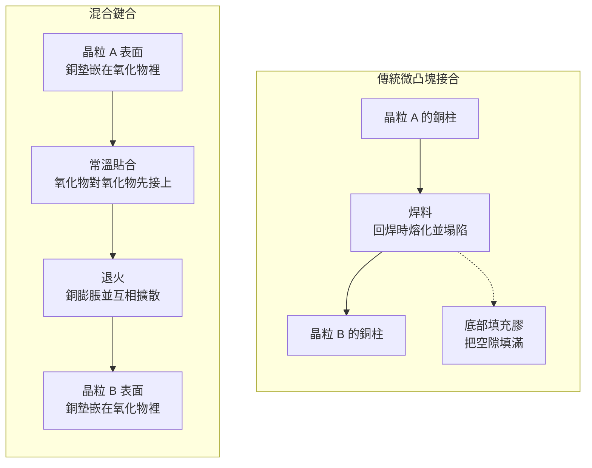
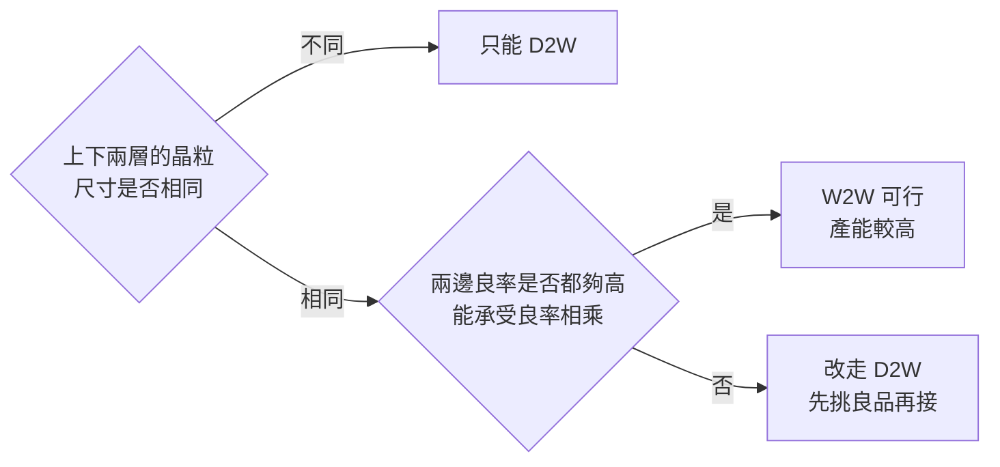
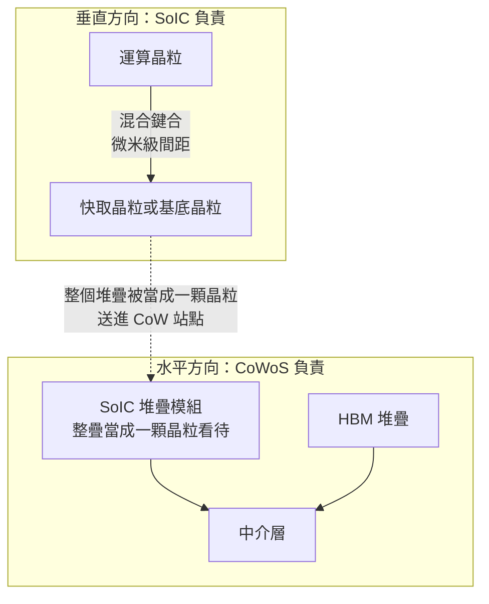
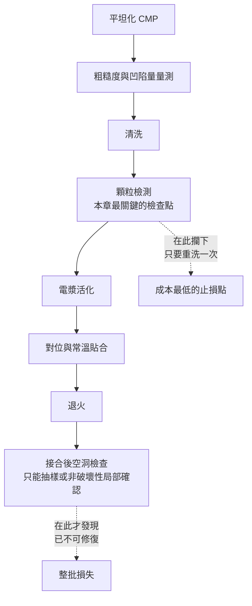

# 第 9 章：SoIC 與混合鍵合 — 互連間距縮小之後，製程要求怎麼變

## 開場問題

前面三章的晶粒都是**並排**的。這一章換一個方向：把晶粒**疊起來**。

先看一個具體情境。

一顆運算晶粒的邏輯電路已經做到很快，但它要的資料放在快取記憶體裡，而快取放在旁邊——訊號得橫向跑過去再跑回來。如果把快取**直接疊在運算晶粒正上方**，距離會從毫米級縮短到微米級。

問題是：怎麼接？

用[第 6 章](06-cowos-s.md)那種微凸塊嗎？微凸塊是**焊料**，回焊時會熔化、塌陷、往外擴散。間距太小，相鄰的凸塊會黏在一起短路。這給了它一個物理下限。

要突破這道牆，**唯一的辦法是把焊料整個拿掉**——讓銅直接對銅。

於是本章的核心問題變成：

> **當接點的間距從數十微米縮到個位數微米，製程要求會從「對得準」變成什麼？**

答案會把本書的「磨」與「檢」推到最嚴苛的地方。**這一章是全書設備需求最硬的一章。**

---

## 先看結構：兩種接法，差在有沒有焊料

**圖 9-1**：兩種接合方法的對照。左邊有焊料與填充膠兩種額外材料，右邊完全沒有——上下兩片矽是**直接長在一起**的。

*這張是圖 9-1 左邊那條路的實物示意：凸塊之間有空隙，必須灌膠。混合鍵合把焊料和這層膠都拿掉，上下兩片氧化物直接貼合——Commons 上幾乎沒有對得上的剖面照片，因為接面在奈米尺度、從外面看就是兩片矽黏在一起。*

### 「混合」鍵合的「混合」是什麼意思

名字裡的「混合」指的是：**同一個表面上同時有兩種材料在接合**。

- **氧化物對氧化物**：提供機械強度與密封。
- **銅對銅**：提供電性導通。

兩者必須在同一個平面上、同一道製程裡一起接好。這句話聽起來簡單，但它是本章所有嚴苛要求的根源——**你必須讓兩種硬度、兩種熱膨脹係數、兩種化學性質不同的材料，在奈米尺度上共面。**

### 兩種接合對象：D2W 與 W2W

| 做法 | 全名 | 怎麼做 | 特性 |
|---|---|---|---|
| **W2W** | Wafer-to-Wafer，晶圓對晶圓 | 兩片完整晶圓整片貼合，再一起切割 | 產能高；但**兩片晶圓上的晶粒尺寸必須一樣**，且無法只挑良品 |
| **D2W** | Die-to-Wafer，晶粒對晶圓 | 先把上層晶圓切成一顆顆，逐顆放到下層晶圓上接合 | **可以只放良品**，尺寸也可不同；但一顆一顆放，節拍慢 |

這個選擇有一個直接的經濟後果：

> **W2W 無法挑良品**。上片晶圓的壞晶粒會接到下片晶圓的好晶粒上，兩顆一起報廢。所以 W2W 只在「兩邊良率都很高」或「單顆晶粒面積很小」時才划算。
>
> **D2W 可以挑良品**，但每一顆都要對位、放置、接合，節拍成為瓶頸。

**圖 9-2**：D2W 與 W2W 的選擇邏輯。這條邏輯與[第 8 章](08-hbm.md)的 KGSD、[第 6 章](06-cowos-s.md)的良率相乘是同一套算術。

### SoIC 是什麼

**SoIC（System on Integrated Chips）** 是 TSMC 把混合鍵合產品化的 3D 堆疊平台。B1 的整理記錄它有兩種形態（**跨來源整理，未於本次重新取用原文**）：

| 形態 | 接法 | 密度與門檻 |
|---|---|---|
| **SoIC-X** | 無凸塊的混合鍵合 | 密度最高，製程門檻最高 |
| **SoIC-P** | 使用細間距凸塊 | 密度低於 -X，門檻與成本較低 |

**表 9-1**：SoIC 的兩種形態。**這是兩個不同的東西，不可混寫**——SoIC-P 仍有凸塊，本章大部分嚴苛要求只適用於 SoIC-X 這一類的無凸塊接合。

### SoIC 與 CoWoS 的組合：垂直給 SoIC，水平給 CoWoS

一個關鍵觀念：**SoIC 不是 CoWoS 的替代品，而是它的補充。**

**圖 9-3**：SoIC 與 CoWoS 的分工。先用 SoIC 把晶粒垂直整合成一個模組，再把這個模組當成[第 6 章](06-cowos-s.md)流程步驟 6 的「一顆晶粒」，送進 CoW。

**這件事對設備需求的意義是**：SoIC 站點在 CoWoS 站點**之前**，加工對象是晶圓與晶粒，不是中介層組合體。搞錯順序，就會把兩段完全不同的產線需求混在一起。

---

## 逐步解釋製程：混合鍵合的每一步在做什麼

以下為**教學簡化的跨來源整理**，不代表任何廠商的實際產線。

| # | 輸入 | 操作 | 輸出 | 目的 |
|---|---|---|---|---|
| 1 | 完成後段金屬層的晶圓 | 做接合層：氧化物介電＋嵌在其中的銅墊 | 帶接合面的晶圓 | 建立「兩種材料共面」的表面 |
| 2 | 帶接合面的晶圓 | **平坦化（CMP）**，同時磨氧化物與銅 | 奈米級平整的表面 | **本章最關鍵的一步**，詳見下節 |
| 3 | 平整表面 | 清洗，移除顆粒、研磨殘留與金屬離子 | 極度潔淨的表面 | 一顆微塵就能造成一個空洞 |
| 4 | 潔淨表面 | 電漿活化 | 化學上「想接合」的表面 | 讓氧化物在常溫下就能貼合 |
| 5 | 兩片活化表面 | 對位，常溫貼合 | 已初步接合的組合體 | 氧化物先接上，銅此時**還沒接** |
| 6 | 組合體 | 退火（升溫） | 銅擴散、接合完成 | 銅受熱膨脹填滿間隙並互相擴散成一體 |
| 7 | 接合完成 | （D2W 或視流程）薄化上層、做背面接點 | 可繼續往上疊或送往 CoW | 銜接[第 6 章](06-cowos-s.md)流程 |

### 為什麼銅要「凹一點」

步驟 2 有一個違反直覺的設計：**銅墊在平坦化後必須比周圍的氧化物稍微凹下去**，這個凹陷量叫 **dishing（碟形凹陷）**。

原因在步驟 6：銅的熱膨脹係數遠大於氧化物。退火升溫時，銅會膨脹凸起，剛好把凹陷填滿並頂到對面的銅墊。

於是產生一個非常窄的製程窗口：

| 凹陷量 | 結果 |
|---|---|
| **太凹** | 退火時銅膨脹不足以接觸，接點開路 |
| **剛好** | 氧化物先貼合密封，銅隨後擴散接合 |
| **太凸（或不夠凹）** | 銅先頂住，氧化物貼不緊，接合面出現縫隙 |

**這是全書「磨」的要求最極端的地方**：不只要磨得平，還要讓兩種材料磨出**指定的、極小的高度差**——而且兩種材料的移除速率本來就不同。

---

## 四項硬要求：粗糙度、潔淨度、平坦度、對位精度

這一節是本章的核心。四項要求的量級來自 T5 與 B1 的既有整理，**跨來源整理，未於本次重新取用原文**，一律視為**量級示意**。

| 要求 | 量級 | 為什麼致命 | 沒達到會怎樣 |
|---|---|---|---|
| **表面粗糙度** | **奈米量級，關鍵區域須到次奈米量級** | 兩個表面要靠原子間作用力在常溫下貼合，表面若不夠光滑就貼不牢 | 接合面出現大量微空隙，退火後仍是弱接合 |
| **潔淨度** | 需達無塵室最高等級；**單顆微塵即可致命** | 一顆顆粒會把兩片表面在局部撐開 | 顆粒周圍形成一片遠大於顆粒本身的**空洞（void）**，該區域全部失效 |
| **平坦度／共面性** | 全片高度變化須控制在奈米至數十奈米量級；銅凹陷量須落在窄窗口內 | 局部凸起會讓周圍一大片貼不上 | 大面積未接合；銅凹陷失控則開路或密封失敗 |
| **對位精度** | **次微米量級** | 接合墊本身只有數微米寬 | 對不準就是斷路，且**接合後無法拆開重來** |

!!! danger "「一顆微塵」不是誇飾"
    這是混合鍵合與其他所有封裝製程最不一樣的地方。

    在傳統凸塊接合裡，一顆微塵可能被焊料或填充膠吸收掉。在混合鍵合裡，兩片表面是**直接貼合**的——一顆數微米的顆粒會像枕頭下的豌豆一樣，把周圍**幾百微米甚至更大範圍**撐開，形成一個肉眼可見的空洞。

    因此混合鍵合產線的潔淨度要求，實際上比接合本身的規格更難達成。

### 為什麼這一章對「磨」與「檢」的要求最硬

把上面四項對應回設備需求：

| 要求 | 對應的設備能力 | 與前面幾章的差別 |
|---|---|---|
| 粗糙度、平坦度、銅凹陷量 | **平坦化（CMP）** | [第 6 章](06-cowos-s.md)的背磨只要求厚度與 TTV；這裡要求的是**表面本身的奈米級形貌** |
| 潔淨度 | **清洗＋顆粒檢測** | 其他章節的顆粒是良率問題；這裡是**單顆致命** |
| 平坦度量測 | **奈米級表面形貌量測** | 白光干涉這類方法量的是高度，能不能達到所需解析度是關鍵問題 |
| 對位精度 | **接合設備本身** | 這是接合機的能力，不是檢測設備的能力 |

**一句話**：混合鍵合把「磨」從尺寸控制變成**表面品質控制**，把「檢」從缺陷計數變成**單顆顆粒偵測**。

---

## 失敗會長什麼樣子

| 缺陷 | 怎麼形成 | 影響什麼 | 可否修復 |
|---|---|---|---|
| **顆粒引起的空洞** | 接合前表面殘留一顆微塵 | 空洞範圍遠大於顆粒本身，該區接點全失效 | **否** |
| **銅接點開路** | 凹陷量過大，退火時銅未接觸 | 該接點斷路；接點極多時難以定位 | **否** |
| **氧化物密封不良** | 銅凸起或表面粗糙 | 接合強度不足，後續熱循環時剝離 | **否** |
| **對位偏移** | 接合機精度不足或熱漂移 | 接點錯位，整批可能報廢 | **否** |
| **接合後翹曲** | 兩片材料應力不平衡 | 後續薄化或搬運破片 | 部分可靠製程補償 |
| **W2W 的良率相乘** | 好晶粒被接到壞晶粒上 | 兩顆一起報廢 | **否**，只能改走 D2W |

### 三個先天限制

混合鍵合並不是無條件優於凸塊接合。B1 的整理指出三個結構性限制（**跨來源整理，未於本次重新取用原文**）：

1. **散熱**：疊起來之後，下層晶粒的熱必須穿過上層才能出去。於是產生一條硬規則——**高功率的晶粒放上面，低功率的放下面**。這解釋了為什麼「運算晶粒＋大容量快取」是理想組合，而兩顆高功耗運算晶粒疊在一起在現有散熱條件下幾乎不可行。
2. **良率不可修復**：混合鍵合是永久性的原子級接合，接合後無法拆開。堆疊把良率相乘，且沒有補救機會——這把[第 8 章](08-hbm.md)談的「已知良品」要求推到極致。
3. **設計耦合**：兩顆晶粒是在微米尺度上逐點對齊的，必須共同設計佈局、供電與熱模擬。這讓 3D 堆疊實務上幾乎只出現在同一家公司內部的產品裡。

---

## 如何檢查與控制

混合鍵合的檢查有一個結構性難題：**最該檢查的東西，在接合前是「沒有缺陷」，在接合後是「看不到」。**

### 接合前後檢查項目表

| 時機 | 檢查項目 | 方法 | 能力邊界 |
|---|---|---|---|
| **接合前** | 表面粗糙度 | 白光干涉、原子力顯微鏡 | 原子力顯微鏡解析度夠但取樣面積極小；白光干涉覆蓋面大但解析度受限 |
| **接合前** | 全片平坦度、厚度均勻度 | 白光干涉、非接觸測厚 | 量的是幾何，不判斷化學狀態 |
| **接合前** | **銅凹陷量（dishing）** | 高解析表面形貌量測 | 必須在銅與氧化物的交界處量，量測點的選取本身是難題 |
| **接合前** | **顆粒與異物** | 高靈敏度顆粒檢測 | **必須偵測到接近致命尺寸的顆粒**，這是靈敏度的極限競賽 |
| **接合前** | 刮傷、殘留、金屬污染 | 光學檢測、化學分析 | 光學看不到分子級殘留 |
| **接合中** | 對位偏差 | 接合設備內建量測 | 屬設備本身能力，非外掛檢測 |
| **接合後** | **接合空洞** | 超音波掃描、紅外線穿透 | 矽對近紅外相對透明，但金屬層會擋住；超音波對極薄界面解析有限 |
| **接合後** | 接合強度 | 破壞性測試（抽樣） | **破壞性**，只能抽樣，不能全檢 |
| **接合後** | 電性導通 | 測試結構、堆疊測試 | 接點數量極多，難以逐點定位 |

**表 9-2**：混合鍵合的接合前後檢查項目。**注意這張表的重心在「接合前」**——因為接合後不可修復，所有有效的控制手段都必須發生在接合之前。

**圖 9-4**：混合鍵合的檢查點分布。**止損點極度前移**——顆粒檢測站是整條流程裡投資報酬最高的檢查點，因為它後面所有站點都是不可逆的。

### 產業進度：各家間距與時程必須分列

| 廠商 | 平台 | 本書取得的間距描述 | 狀態 | 來源與等級 | 資料日期 |
|---|---|---|---|---|---|
| TSMC | SoIC | 2025 年達 6 μm 量級，2029 年目標 4.5 μm 量級 | 路線圖 | B1（標 [官方]），**未於本次重新取用原文** | B1 整理至 2026-09 |
| Intel | Foveros Direct 3D | 約 9 μm 量級 | 已導入產品 | B1（標 [報導]），**未於本次重新取用原文** | B1 整理至 2026-09 |
| Samsung | SAINT | 未取得可引用的間距數字 | 產線建置中，B1 記錄全面部署預期於 2029–2030 | B1（標 [報導]），**未於本次重新取用原文** | B1 整理至 2026-09 |

**表 9-3**：混合鍵合間距與時程，**按廠商與平台分列**。不同廠商的數字不可互相代入，也不可拿來直接比較「誰比較強」——量測與定義方式未必一致。

---

## 與均豪的連結

**本章無均豪（5443）公開證據。**

沒有任何公開來源顯示均豪供應混合鍵合或 SoIC 相關產線的任何站點。本節指出製程需求的性質，並處理本書最容易踩的主體陷阱。

### ⚠️ 先處理主體：接合設備不是均豪的產品

!!! danger "本章最容易踩的坑"
    談到 3D 堆疊與接合，很容易聯想到「Die Bonder」。必須先釘死三件事：

    1. **Die Bonder、Chip Sorter 是均華（6640）的產品線，不是均豪（5443）的。** 均豪的定位是 **Wafer 級的檢、量、磨、拋**；均華是 **Die 級的分選與接合**。`[公司自述]`（G1、G6）
    2. **即使是均華，公開資料也沒有說它做的是混合鍵合設備。** 均華公開的是 Die Bonder 與 Chip Sorter；混合鍵合需要的是完全不同等級的對位與潔淨環境能力，**不可從「做接合機」推論「做混合鍵合機」**。
    3. **均華的營收不是均豪的營收。** 均豪持股約 56.8%，均華進合併報表，但**歸屬母公司的部分要扣掉非控制權益**。看到均華接合設備的好消息，不等於均豪的設備賣得好。

    附帶：均豪 2026 年報英文版的開發清單裡有 High-Precision Die Bonder、Thermo-Compression Die Bonder，**口徑待查、疑為均華產品線**（[第 15 章](15-gpm-product-map.md)待查 15-7），本書不計入均豪。

### ✅ 已確認事實

- 均豪的定位是 Wafer 級的檢、量、磨、拋；均華是 Die 級的 Chip Sorter 與 Die Bonder。`[公司自述]`（G1、G6）
- 均豪公開產品包含再生晶圓 CMP、先進封裝平整化拋光、白光干涉量測（公開說明精度 1 μm × 1 μm 量級）。`[公司自述]`（G1、G2、G3）
- 均華 2026 H1 營收 16.5 億、年增 41%，Bonder 占比已超過 Sorter。`[公司自述]`（G3）——**這是均華的數字**。

### 🔶 合理推論

- 本章的四項硬要求（粗糙度、潔淨度、平坦度、對位精度）中，前三項在**能力類別**上落在「磨」「拋」「檢」「量」，與均豪公開能力同類。`[推論]`
- 公開規格為 1 μm × 1 μm（`[公司自述]` G2），定義未明（待查 11-3／P4）。本章要的是**奈米量級的 Z 向形貌**（粗糙度、銅凹陷）。**若**該數字是垂直解析度，落差約三個數量級；**若**是橫向取樣間距（[第 11 章](11-defect-aoi-metrology.md)指出這是較常見的讀法），則 Z 能力未知。無論哪一種，都不能把 SWLI **方法**能做到次奈米，算成均豪**已揭露**的混合鍵合規格。`[推論]`

### ❓ 尚待查證

- 均豪的 CMP 與量測設備能力是否曾對外揭露適用於混合鍵合等級的規格？公開資料未見（本章待查 9-4）。
- 均華的接合設備是否涉及混合鍵合？公開資料未見（本章待查 9-5）。

!!! danger "本章不能推出的結論"
    「混合鍵合需要極致的 CMP 與顆粒檢測；均豪做 CMP 與 AOI；所以均豪是混合鍵合概念股」——**無效**，而且比前幾章更無效：公開的 `1 μm × 1 μm` 過不了待查 P4 之前，不能當成已對上混合鍵合的量測需求。SWLI 作為方法可以量到次奈米 Z，**不是**均豪已揭露的產品規格。

---

## 理解檢查

???+ question "Q1：為什麼混合鍵合可以把接點間距做到個位數微米，而微凸塊做不到？"
    因為微凸塊是**焊料**。焊料在回焊時會熔化、塌陷、往外擴散，間距太小就會與相鄰凸塊橋接短路。此外焊料與銅之間會生成介金屬化合物，凸塊愈小，這層佔比愈高、機械性質愈脆。

    混合鍵合把焊料整個拿掉，改成銅直接對銅、氧化物直接對氧化物。沒有會流動的材料，就沒有塌陷與橋接的下限，接點間距因此可以推進到個位數微米甚至更小。

    代價：焊料原本能吸收表面的高低差與微小顆粒，拿掉之後，這些容忍度全部消失——這就是本章四項硬要求的由來。

???+ question "Q2：混合鍵合要求銅墊在平坦化後「稍微凹下去」。為什麼不是磨到完全齊平？"
    因為接合分兩步：**常溫貼合時是氧化物先接上，銅要等到退火升溫才接**。

    銅的熱膨脹係數遠大於氧化物，退火時會膨脹凸起。設計上就是要讓這個膨脹量剛好填滿凹陷並頂到對面的銅墊。

    - 磨到完全齊平甚至凸起 → 銅先頂住，氧化物貼不緊，接合面留下縫隙。
    - 凹太多 → 退火時銅膨脹不足以接觸，接點開路。

    所以製程窗口是一個**很窄的區間**，而且要在兩種移除速率不同的材料之間磨出這個指定的高度差。這是本書「磨」的要求最極端的一點。

???+ question "Q3：W2W 產能比 D2W 高，為什麼還是有大量產品選 D2W？"
    因為 **W2W 無法挑良品**。整片對整片貼合，上片的壞晶粒會被接到下片的好晶粒上，兩顆一起報廢——良率是相乘的，而且沒有補救機會。

    此外 W2W 要求兩片晶圓上的晶粒尺寸一致，這在異質整合（不同製程、不同尺寸的晶粒）情境下往往做不到。

    D2W 先把上層切開、挑出良品，再一顆顆放上去，於是良率損失可控、尺寸也可不同。代價是節拍——每一顆都要對位與接合，產出速度成為瓶頸。這條取捨與[第 8 章](08-hbm.md)的 KGSD、[第 14 章](14-yield-capacity-capex.md)的節拍與瓶頸是同一套算術。

???+ question "Q4：某設備商說「我們的白光干涉量測精度達 1 μm × 1 μm，可用於先進封裝」。這句話能不能支持「可用於混合鍵合」？"
    **不能直接支持。**

    混合鍵合要的是奈米量級的 Z 向形貌（粗糙度、銅凹陷）。公開的「1 μm × 1 μm」**定義未明**（待查 11-3／P4）：若是垂直解析度，與需求差約三個數量級；若是橫向取樣間距（第 11 章指出這是較常見的讀法），則 Z 能力未知。兩種讀法都**不能**把這句話升級成「已揭露可用於混合鍵合」。

    「可用於先進封裝」本身很寬：RDL 厚度、封膠平坦度這類微米級站點可以成立；混合鍵合不在其中，除非另有奈米級規格。正確的追問是[第 2 章](02-packaging-taxonomy.md)那三題，再加上：**這個數字講的是 X-Y 還是 Z？**

???+ question "Q5：SoIC 與 CoWoS 是競爭關係嗎？它們在產線上的先後順序是什麼？"
    **不是競爭，是互補。**

    - **SoIC 解決「密度」**：把需要極高頻寬、極低延遲，且其中一方功耗較低的晶粒垂直整合（運算晶粒＋快取）。
    - **CoWoS 解決「面積」**：把多個各自都要散熱的高功耗元件並排放在同一個載體上（運算模組＋多顆 HBM）。

    順序上，**SoIC 在前，CoWoS 在後**：先把晶粒堆成一個模組，這個模組再被當成「一顆晶粒」送進 CoW 站點（[第 6 章](06-cowos-s.md)步驟 6）。

    對設備需求的意義：SoIC 站點的加工對象是**晶圓與晶粒**，CoWoS 站點的加工對象是**中介層與組合體**。搞錯順序，就會把兩段完全不同的產線需求混在一起。

---

## 來源與待查事項

### 本章來源

| 主張 | 來源 | 等級 | 日期 |
|---|---|---|---|
| 微凸塊的物理下限、焊料塌陷與介金屬化合物 | T3、B1 | **跨來源整理，未於本次重新取用原文** | — |
| 混合鍵合原理：氧化物常溫貼合＋退火銅擴散 | T5、B1 | **未於本次重新取用原文** | — |
| 四項要求（粗糙度、潔淨度、平坦度、對位精度）的量級 | T5、B1 | **量級示意**，非規格數字；**未於本次重新取用原文** | — |
| 銅凹陷量（dishing）的製程窗口 | T5、B1 | **未於本次重新取用原文** | — |
| D2W 與 W2W 的取捨 | T5、B1 | **未於本次重新取用原文** | — |
| SoIC-X 與 SoIC-P 的區分 | T1、B1 | **兩者不可混寫**；**未於本次重新取用原文** | B1 整理至 2026-09 |
| SoIC 與 CoWoS 的組合關係 | T1、B1 | **未於本次重新取用原文** | B1 整理至 2026-09 |
| 3D 堆疊的三個先天限制 | B1 | **未於本次重新取用原文** | — |
| 各廠混合鍵合間距與時程（表 9-3） | B1（標 [官方]／[報導] 混合） | **按廠商分列，量級示意** | B1 整理至 2026-09 |
| 教學簡化流程（7 個站點） | 本書自建整理 | **教學簡化**，非任何廠商實際流程 | 2026-09-09 |
| 均豪 Wafer 級、均華 Die 級的分工 | G1、G6 | `[公司自述]` ＋ `[媒體報導]` | 2026-08-31 快照 |
| 均豪白光干涉精度 1 μm × 1 μm | G2 | `[公司自述]` | 2026-06-12 法說 |
| 均華 2026 H1 營收與 Bonder 占比 | G3 | `[公司自述]`，**均華數字** | 2026-08-12 法說 |

各代號定義見[附錄 A 來源索引](appendix-sources.md)。

### 待查事項

| # | 問題 | 為什麼重要 | 會怎麼查 |
|---|---|---|---|
| 9-1 | 混合鍵合的表面粗糙度與銅凹陷量，有無可公開引用的規格數字（而非量級）？ | 本章目前只能用量級表達 | 原始論文與設備商技術文件（T5） |
| 9-2 | 「致命顆粒尺寸」與對應的檢測靈敏度要求為何？ | 決定顆粒檢測設備的門檻，是本章投報最高的站點 | 設備商技術文件（E1）、SEMI 標準 |
| 9-3 | 各廠混合鍵合間距的量測與定義方式是否一致？ | 表 9-3 目前不宜跨廠比較 | 各廠官方技術頁與論文 |
| 9-4 | 均豪的 CMP 與量測設備，是否曾對外揭露奈米級規格？ | 決定本章的「能力等級落差」推論能否被修正 | 法說簡報、產品型錄、展場資料 |
| 9-5 | 均華（**非均豪**）的接合設備是否涉及混合鍵合？ | 避免主體混淆，也是[第 15 章](15-gpm-product-map.md)第 9 列的細化 | 均華法說與年報 |

---

> 下一頁：[第 10 章 EMIB 與局部橋接](10-emib-bridge.md)　｜　相關頁面：[第 6 章 CoWoS-S](06-cowos-s.md) ｜ [第 8 章 HBM](08-hbm.md) ｜ [第 11 章 缺陷與量測](11-defect-aoi-metrology.md) ｜ [第 12 章 研磨與薄化](12-grinding-thinning.md) ｜ [第 15 章 均豪產品地圖](15-gpm-product-map.md)
