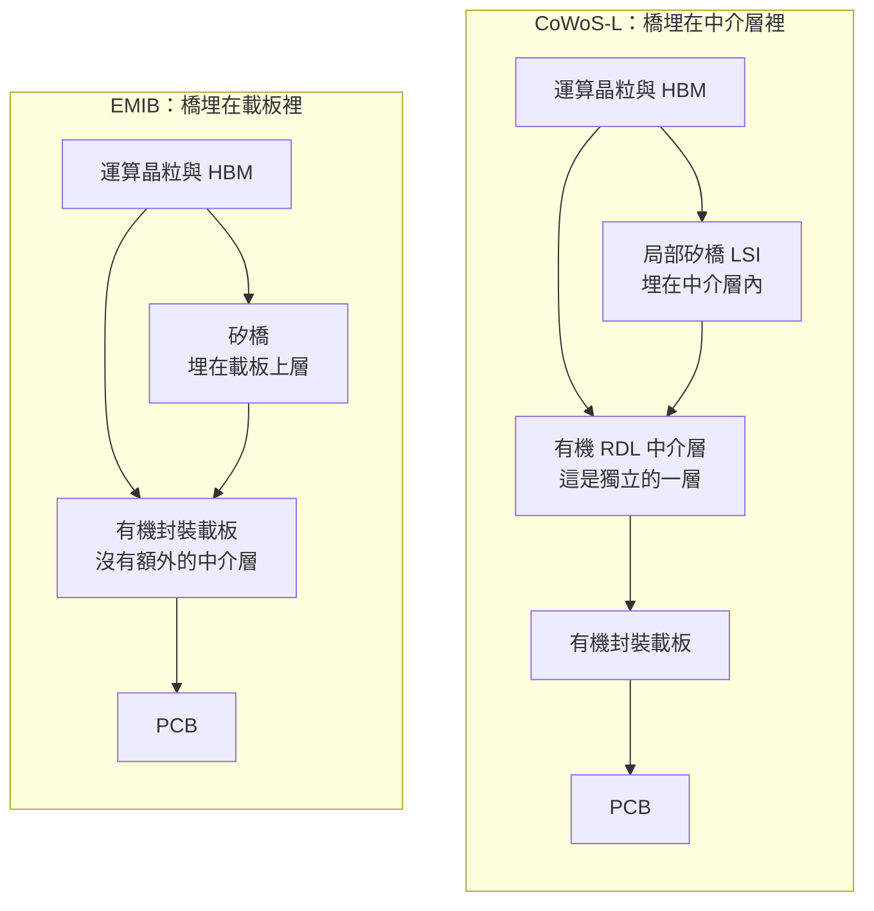
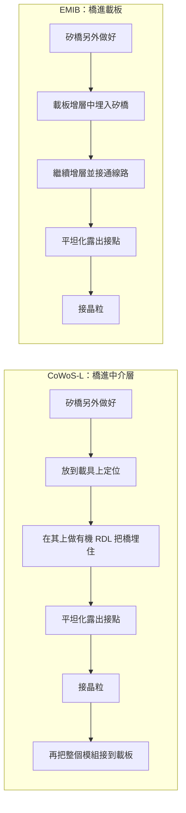
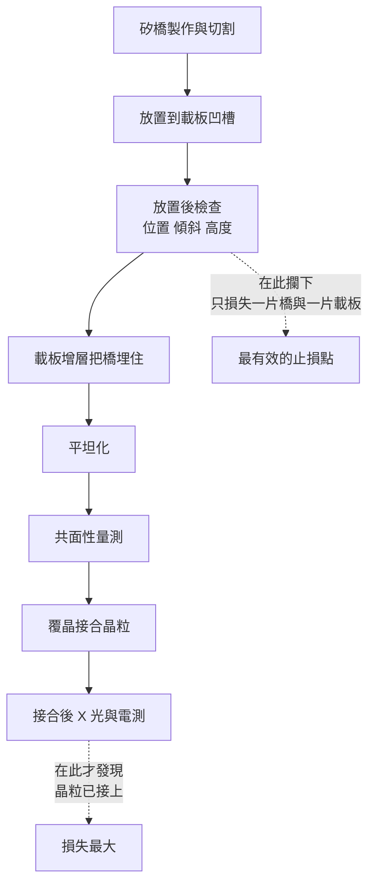

# 第 10 章：EMIB 與局部橋接 — 為什麼只在晶粒之間放一小塊矽

## 開場問題

[第 7 章](07-cowos-r-l-icube.md)已經給過一次答案：因為良率不喜歡大面積的矽。

但那一章的解法是「在有機 RDL 中介層裡埋矽橋」。這一章要問一個更基本的問題：

> **既然矽橋只負責晶粒與晶粒之間那一小段，為什麼還需要一整層中介層？能不能直接把矽橋埋進封裝載板裡，中介層整層省掉？**

這正是 Intel 的 **EMIB（Embedded Multi-die Interconnect Bridge，嵌入式多晶粒互連橋接）** 給出的答案。它和 CoWoS-L 的想法同源——B1 的整理指出 EMIB 比 CoWoS-L 更早提出（**跨來源整理，未於本次重新取用原文**）——但**埋的位置不同**。

而「埋在哪一層」這件事，決定了：

- 這一步在哪個工廠做（載板廠？封裝廠？）
- 加工對象是什麼形態（晶圓？載板 strip？）
- 需要哪一類設備

換句話說，本章是[第 2 章](02-packaging-taxonomy.md)那句「商標當結構」錯誤的最終考題：**EMIB 與 CoWoS-L 在結構分類上都是「2.5D 加橋接」，但製程站點完全不同。**

---

## 先看結構：剖面對照

先把兩者切開來並排看。

**圖 10-1**：EMIB 與 CoWoS-L 的剖面對照，上下順序與[圖 6-1](06-cowos-s.md)一致。**最重要的差別是右邊少了一整層**——晶粒直接接到含有矽橋的載板上，中間沒有獨立的中介層。

### 三個結構差異，三串後果

| 差異 | CoWoS-L | EMIB | 後果 |
|---|---|---|---|
| **橋埋在哪** | 埋在**中介層**裡 | 埋在**封裝載板**裡 | 決定這一步由誰做、在哪個廠做 |
| **有沒有獨立中介層** | 有 | **沒有** | EMIB 少一層，理論上少一段良率與成本；但載板本身變複雜 |
| **加工對象形態** | 晶圓或載具上的重組體 | **載板 strip 或 panel** | **設備形態完全不同**——見[第 4 章](04-workpiece-flow.md) |

!!! danger "這就是「商標當結構」錯誤的解藥"
    有人會說：「EMIB 跟 CoWoS-L 一樣，都是局部矽橋，所以製程一樣、設備供應商也一樣。」

    **前半句對，後半句錯。** 結構分類確實相同（2.5D 加橋接），但埋在中介層裡與埋在載板裡，是兩個不同的工廠、不同的加工對象、不同的設備形態。

    這是[第 2 章](02-packaging-taxonomy.md)表格裡「商標當結構」那一列的具體版本。

### 為什麼只要一小塊矽就夠

回到最根本的因果。

晶粒與晶粒之間需要上千條線，但**這些線只需要跨越晶粒之間那一小段距離**。晶粒的其他方向要接的是電源與相對低速的對外訊號——那些用載板的線寬就夠了。

於是需求自然分成兩類：

| 需求 | 需要什麼 | 用什麼做 |
|---|---|---|
| 晶粒對晶粒的高密度互連 | 極細線寬，短距離 | **一小塊矽** |
| 電源、對外訊號 | 粗線即可，但要能承載電流 | 有機載板 |

**橋接方案就是把這兩類需求分開處理。** 這也解釋了為什麼矽橋只要「指甲大小」——它只需要覆蓋兩顆晶粒相鄰的那條邊。

---

## 版本必須分列：EMIB 與 EMIB-T 不是同一個東西

這是本章紀律最嚴的一節。

| 版本 | 橋接片裡有沒有 TSV | 橋能做什麼 | 本書取得的描述 | 來源與等級 | 資料日期 |
|---|---|---|---|---|---|
| **EMIB** | **無** | **只能做橫向互連**——訊號從晶粒 A 橫向走到晶粒 B | 把小矽橋嵌在有機載板中，只在需要高密度互連的區域用矽 | I1；B1 整理，**未於本次重新取用原文** | B1 整理至 2026-09 |
| **EMIB-T** | **有** | 橫向互連**加上**縱向供電與訊號穿透 | B1 記錄為 2026 年的新版本；描述可擴展至 120 × 180 mm 量級封裝、支援超過 38 個橋接與 12 顆以上光罩尺寸晶粒；記憶體支援涵蓋 HBM3／HBM3E／HBM4 乃至規劃中的 HBM5；2026 年進入導入階段 | B1（該段標 [報導]），**未於本次重新取用原文** | B1 整理至 2026-09 |

**表 10-1**：EMIB 版本分列。**所有 EMIB-T 的數字都是報導等級的量級示意，且日期上限為 B1 的 2026-09**，需要精確值請回 I1 原廠文件核對（待查 10-1）。

### 加了 TSV 為什麼是一件大事

EMIB 沒有 TSV，代表**橋接片是一片「不通的」矽**——電源沒辦法從它底下穿上來。

於是原始 EMIB 有一個結構限制：晶粒正上方橋接片覆蓋的區域，供電必須繞道。當晶粒功耗愈來愈高（[第 8 章](08-hbm.md)引用的 GPU 功耗曲線就是這個趨勢），供電路徑的品質變成瓶頸。

EMIB-T 在橋接片裡加上 TSV，讓橋不只走橫向的訊號，也能讓電源垂直穿過去。

> **一句話**：EMIB 是「一塊只會橫向走線的矽片」，EMIB-T 是「一塊也能垂直導通的矽片」。**兩者的製造流程差一整套 TSV 製程**——[第 6 章](06-cowos-s.md)談過的蝕孔、填銅、平坦化、薄化露出，全部要在這塊小矽片上做一遍。

!!! warning "不可以混寫的三種說法"
    1. 把 EMIB-T 的封裝尺寸與橋接數量拿來描述 EMIB。
    2. 把「EMIB 有 TSV」寫成 EMIB 的通用特性——只有 -T 版本有。
    3. 把 2026 年的 EMIB-T 導入時程，寫成「EMIB 已支援 HBM4」——那是不同版本的能力。

---

## 逐步解釋製程：橋接片怎麼進到載板裡

以下為**教學簡化的跨來源整理**，不代表任何廠商的實際產線。與[第 7 章](07-cowos-r-l-icube.md) CoWoS-L 的流程並排比較最能看出差異。

### EMIB 的流程骨架

| # | 輸入 | 操作 | 輸出 | 目的 |
|---|---|---|---|---|
| 1 | 矽晶圓 | 做極細 RDL；**EMIB-T 另需做 TSV** | 橋接晶圓 | 建立高密度互連圖案 |
| 2 | 橋接晶圓 | 薄化、切割 | 一片片小矽橋 | 縮到能埋進載板的厚度 |
| 3 | 載板（增層製程中） | 在載板上層挖出凹槽或預留空腔 | 帶凹槽的載板 | 給矽橋一個位置 |
| 4 | 帶凹槽的載板＋矽橋 | **把矽橋放進去並固定** | 矽橋已就位的載板 | **位置精度直接決定後續能否對上** |
| 5 | 已放橋的載板 | 繼續做載板的增層：介電、鑽孔、電鍍 | 矽橋被埋起來的載板 | 把橋與載板的線路接通 |
| 6 | 埋好橋的載板 | **平坦化**，露出橋的接點 | 可接合的載板表面 | 橋區與載板區必須共面 |
| 7 | 載板＋晶粒 | 對位、覆晶接合 | 封裝體 | 完成互連 |
| 8 | 封裝體 | 底部填充、補強／蓋板、植球、測試 | 出貨品 | 同[第 6 章](06-cowos-s.md)階段三 |

### 與 CoWoS-L 並排比較

**圖 10-2**：CoWoS-L 與 EMIB 的流程差異，**教學簡化**。左邊比右邊多了「先做一層中介層、再把中介層接到載板」這一整段（A6）；右邊則把複雜度推進了載板製程本身（B2、B3）。

### 三個一定要分清楚的後果

| 面向 | CoWoS-L | EMIB |
|---|---|---|
| **埋橋這一步在哪裡做** | 在封裝廠的中介層製作段（晶圓或載具形態） | 在**載板製造流程中**（strip 或 panel 形態） |
| **加工對象** | 晶圓、載具上的重組體 | **載板 strip 或 panel** |
| **設備形態** | 晶圓級為主 | **條狀或方形工件為主** |
| **失敗的責任歸屬** | 封裝廠 | 大幅落在**載板供應鏈** |

**最後一列值得停下來想**：EMIB 把一部分先進封裝的難度，從封裝廠推給了**載板廠**。這是一個供應鏈重心的轉移，不只是技術選擇。

---

## 失敗會長什麼樣子

橋接方案的失敗模式，與[第 7 章](07-cowos-r-l-icube.md) CoWoS-L 有一半重疊（都是「放一小塊矽再埋起來」），但因為埋在載板裡，多了一組載板特有的問題。

| 缺陷 | 怎麼形成 | 影響什麼 |
|---|---|---|
| **矽橋位置偏移** | 放置站定位精度不足 | 橋上的線接不到晶粒接點；埋起來後看不到，只能事後電測發現 |
| **矽橋傾斜或下沉** | 凹槽深度不均、黏著材料厚度不一 | 橋面與載板面不共面，接合時局部接不上 |
| **異材質共面失控** | 矽與有機載板的**研磨移除速率不同** | 磨出台階；橋區凸起會壓壞晶粒接點，凹陷則接不上 |
| **載板翹曲** | 有機載板的熱膨脹係數遠大於矽，且面積大 | 覆晶接合時對不準；大尺寸封裝更嚴重 |
| **橋與載板線路接不通** | 埋橋後的鑽孔／電鍍對位偏差 | 訊號路徑斷開 |
| **矽橋破裂** | 橋很薄，載板增層過程有壓合與熱循環 | 直接斷路 |
| **TSV 相關缺陷（僅 EMIB-T）** | 空洞、露出不均——與[第 6 章](06-cowos-s.md)同源 | 供電路徑異常 |

!!! note "為什麼「埋起來就看不到」是核心難題"
    矽橋一旦被載板的增層製程覆蓋，光學檢測就完全失效——上面蓋著介電層與銅。

    這推導出一條很硬的規則：**橋的位置與姿態，必須在埋起來之前檢查完畢。** 埋完之後只剩下 X-ray（看得到金屬結構，但解析度與穿透厚度互相拉扯）與電測（能發現斷路，但已經是很後面的站點）。

    這與[第 9 章](09-soic-hybrid-bonding.md)「止損點前移」是同一個道理，只是換了一個工件形態。

---

## 如何檢查與控制

| 時機 | 檢查項目 | 方法 | 能力邊界 |
|---|---|---|---|
| 橋接晶圓階段 | RDL 線寬與缺陷；EMIB-T 另加 TSV 品質 | 晶圓級 AOI、X-ray | 同[第 6 章](06-cowos-s.md)的限制 |
| 橋切割後 | 崩邊、厚度、翹曲 | 光學檢測、測厚 | 小工件的搬運與檢測本身有難度 |
| **放置後、埋起來之前** | **矽橋位置、傾斜、高度** | 光學檢測、3D 形貌量測 | **這是最後一次看得到橋的機會** |
| 增層完成後 | 橋與載板線路是否接通 | X-ray、電測 | X-ray 對薄空洞不敏感；電測已在很後面 |
| 平坦化後 | **異材質共面性、高低差** | 白光干涉、3D 量測 | 需在材料界線處量，量測點選取是難題 |
| 載板整體 | 翹曲量 | 光學形貌量測 | 室溫量測不代表回焊時的狀態 |
| 接合後 | 凸塊接合完整性 | X-ray、超音波掃描 | 大面積載板的掃描時間長 |

**圖 10-3**：EMIB 的檢查點與止損位置。**C 站點是全流程投報最高的一站**，因為它是最後一次能直接看到矽橋的機會。

### 對設備需求的意義：工件形態變了

這一章對本書最重要的貢獻，是它示範了「同一個結構分類、完全不同的設備需求」：

| 站點 | CoWoS-L 的加工對象 | EMIB 的加工對象 |
|---|---|---|
| 埋橋 | 載具上的晶圓級工件 | **載板 strip 或 panel** |
| 平坦化 | 晶圓級 | **條狀或方形工件** |
| 檢測 | 晶圓級檢測設備 | **strip／panel 檢測設備** |

**加工對象決定設備形態**——這是[第 4 章](04-workpiece-flow.md)建立、本書反覆使用的推導鏈。看到「橋接技術」四個字就以為設備需求相同，會直接推錯。

---

## 與均豪的連結

**本章無均豪（5443）公開證據。**

沒有任何公開來源顯示均豪供應 EMIB 或任何橋接方案的產線站點。本節只能指出製程需求的性質。

### ✅ 已確認事實

- 均豪公開產品線中，加工對象為**條狀或方形工件**的包括：Strip Grinder、載板方形輪磨、封裝端條狀研磨。`[公司自述]`（G1、G3）
- 均豪 2026-08-12 法說指出，**載板方形輪磨與封裝端條狀研磨**在 2026 H1 起成為新成長線，客戶描述為「歐美 PMIC 廠」，擴產地在馬來西亞與德國，**後段封裝仍在台灣**。`[公司自述]`（G3）
- PMIC 占母公司半導體營收由 2025 年約 1% 升至 2026 H1 的 19%，在手訂單占 12%。`[公司自述]`（G3）

### 🔶 合理推論

- 本章顯示 EMIB 這一類方案的加工對象是**載板 strip 或 panel**，而均豪公開產品中確實有以 strip 與方形載板為對象的研磨設備——**這是形態上的同類，不是應用上的證據**。`[推論]`
- 均豪目前公開的載板研磨需求，來源是 **PMIC 的高導熱厚銅載板**（G3），與本章的橋接載板**是完全不同的應用**。`[推論]`

### ❓ 尚待查證

- 均豪的載板研磨設備是否曾應用於**含嵌入式橋接的載板**？公開資料完全沒有線索（本章待查 10-4）。
- 均豪的客戶群中是否有載板廠？公開資料只出現「歐美 PMIC 廠」，未見載板供應鏈客戶（待查 10-5）。

!!! danger "本章不能推出的結論"
    「EMIB 的橋埋在載板裡，載板需要研磨；均豪做載板方形輪磨；所以均豪可望受惠於 EMIB」——**無效**。

    這個推論同時犯了兩個錯：
    1. **應用混用**：均豪公開的載板研磨需求來自 PMIC 厚銅載板，與嵌入橋接的高階載板是不同應用、不同客戶、不同規格。
    2. **能力等於供應**：加工形態相同，不代表已供應該產線。

---

## 理解檢查

???+ question "Q1：EMIB 與 CoWoS-L 都是「局部矽橋」。在結構分類上它們相同，那到底哪裡不一樣？為什麼這個差別對設備商是決定性的？"
    差在**橋埋在哪一層**：

    - **CoWoS-L**：橋埋在**中介層**裡，中介層再整個接到載板上。
    - **EMIB**：橋埋在**封裝載板**裡，沒有獨立的中介層，晶粒直接接到載板上。

    對設備商是決定性的，因為這決定了**加工對象的形態**：CoWoS-L 的埋橋與平坦化發生在晶圓或載具形態的工件上；EMIB 則發生在**載板 strip 或 panel** 上。工件形態不同，設備的搬運、夾持、加工尺寸全部不同。

    這也意味著責任歸屬不同：EMIB 把一部分先進封裝的難度推給了**載板供應鏈**。

???+ question "Q2：EMIB 與 EMIB-T 差在哪？為什麼這個差別不能被寫成「EMIB 的新規格」？"
    差在**橋接片裡有沒有 TSV**。

    - **EMIB**（無 TSV）：橋只能做橫向互連，電源無法從橋底下穿上來，供電必須繞道。
    - **EMIB-T**（有 TSV）：橋同時能做縱向的供電與訊號穿透。

    不能寫成「EMIB 的新規格」，因為這是**兩套不同的製造流程**——EMIB-T 的橋接片要多做一整套 TSV 製程（蝕孔、填銅、平坦化、薄化露出）。把 -T 的能力與尺寸數字掛在 EMIB 名下，會讓讀者推錯製程站點與設備需求。

    本書表 10-1 分列兩行，就是為了強制這件事。

???+ question "Q3：矽橋埋進載板之後，為什麼幾乎不可能再用光學方法檢查？這推出什麼站點設計原則？"
    因為橋上面蓋著載板增層的介電層與銅箔，光線穿不過去。

    推出的原則是：**橋的位置、傾斜與高度，必須在埋起來之前檢查完畢。** 埋完之後只剩兩種手段——X-ray（能看金屬結構，但解析度與穿透厚度互相拉扯）與電測（能發現斷路，但已經在很後面的站點，損失大得多）。

    這與[第 9 章](09-soic-hybrid-bonding.md)「止損點極度前移」是同一個道理：**當後續步驟不可逆或不可觀測時，檢測價值全部集中在最後一個可觀測的節點。**

???+ question "Q4：某新聞寫「橋接式先進封裝需求大增，載板研磨設備供應商受惠」。你會怎麼拆解這句話？"
    至少拆成四題：

    1. **哪一種橋接方案**？EMIB 的橋在載板裡，CoWoS-L 的橋在中介層裡——只有前者的需求會落到載板端。
    2. **哪一個站點**？埋橋後的平坦化、載板增層、還是封裝完成後的研磨？加工對象與規格都不同。
    3. **是哪一種載板**？含嵌入橋接的高階載板，與 PMIC 的厚銅載板，是完全不同的應用與客戶。
    4. **證據等級**？「受惠」是分析語言，不是供應關係。有沒有任何一家設備商被具名，或有雙方公告可對帳？

    答不出來的部分就標為待查，不要讓它們默默升格成事實。這是[第 16 章](16-reading-news.md)分析模板的標準動作。

???+ question "Q5：為什麼「只在晶粒之間放一小塊矽」這個想法，同時出現在 Intel 與 TSMC 的產品線裡？它解決的是什麼共同問題？"
    因為兩家面對的是同一條物理與經濟的限制：

    - **需求是局部的**：上千條高密度連線，只需要跨越晶粒與晶粒相鄰的那一小段距離。其他方向要走的是電源與相對低速的對外訊號，用載板的線寬就夠。
    - **良率不喜歡大面積的矽**：整片幾千平方毫米的矽必須全區無致命缺陷；而幾片指甲大小的矽橋良率極高。

    把「必須完美的面積」縮小一到兩個數量級，同時把便宜、可做大、機械上更柔韌的有機材料用在其餘區域——這個算術對誰都成立，所以兩家都走上了同一條路。

    差別只在**埋在哪一層**，而那個差別決定了製程站點與供應鏈重心。

---

## 來源與待查事項

### 本章來源

| 主張 | 來源 | 等級 | 日期 |
|---|---|---|---|
| EMIB 為嵌入載板的局部矽橋；概念早於 CoWoS-L | I1、B1 | **跨來源整理，未於本次重新取用原文** | B1 整理至 2026-09 |
| EMIB-T 在橋接片中加入 TSV | I1、B1（該段標 [報導]） | **僅適用 -T 版本** | B1 整理至 2026-09 |
| EMIB-T 的封裝尺寸、橋接數量、記憶體支援、導入時程 | B1（標 [報導]） | **量級示意，報導等級**；**未於本次重新取用原文** | B1 整理至 2026-09 |
| EMIB 與 CoWoS-L 的剖面差異 | I1、T1、B1 | **未於本次重新取用原文** | B1 整理至 2026-09 |
| 教學簡化流程（8 個站點） | 本書自建整理 | **教學簡化**，非任何廠商實際流程 | 2026-09-09 |
| 均豪載板方形輪磨、封裝端條狀研磨、Strip Grinder | G1、G3 | `[公司自述]` | 2026-08-12 法說 |
| PMIC 占母公司半導體 19%、在手訂單 12%、歐美 PMIC 廠客戶 | G3 | `[公司自述]`，客戶**未具名** | 2026-08-12 法說 |

各代號定義見[附錄 A 來源索引](appendix-sources.md)。

### 待查事項

| # | 問題 | 為什麼重要 | 會怎麼查 |
|---|---|---|---|
| 10-1 | EMIB 與 EMIB-T 的官方規格（尺寸、橋接數、支援記憶體世代）為何？ | 本章數字為報導等級的量級示意 | Intel 官方技術頁（I1） |
| 10-2 | 矽橋埋入載板的位置精度規格（量級）為何？ | 直接決定放置與檢測設備的門檻 | Intel 技術文件、載板供應商資料 |
| 10-3 | 嵌入橋接載板的平坦化規格與異材質共面要求為何？ | 這是與 CoWoS-L 共通、但工件形態不同的需求 | 設備商技術文件（E3）、SEMI 標準 |
| 10-4 | 均豪的載板研磨設備是否曾應用於含嵌入式橋接的載板？ | 目前完全沒有公開線索，是本章唯一可能的連結點 | 法說 Q&A、展場技術資料、年報 |
| 10-5 | 均豪的客戶群中是否有載板廠？ | 公開資料只出現「歐美 PMIC 廠」，未見載板供應鏈客戶 | 年報主要客戶揭露、法說 |
| 10-6 | 2026-09 之後 EMIB 系列的最新狀態為何？ | B1 的時間錨點是 2026-09，版本更迭很快 | Intel 官方發布，建議每半年核對 |

---

> 下一頁：[第 11 章 缺陷、AOI 與量測](11-defect-aoi-metrology.md)　｜　相關頁面：[第 2 章 封裝分類](02-packaging-taxonomy.md) ｜ [第 4 章 工件形態](04-workpiece-flow.md) ｜ [第 7 章 CoWoS-R、L 與 I-Cube](07-cowos-r-l-icube.md) ｜ [第 12 章 研磨與薄化](12-grinding-thinning.md) ｜ [第 15 章 均豪產品地圖](15-gpm-product-map.md)
