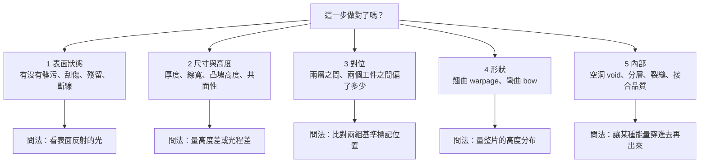
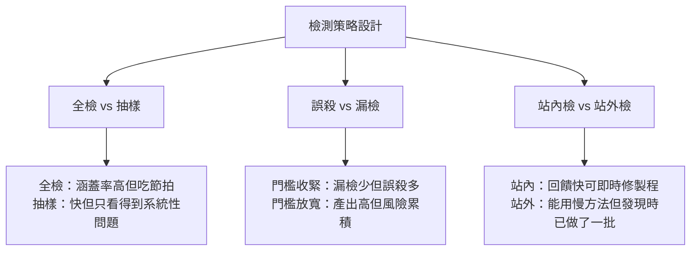

# 第 11 章：缺陷、AOI 與量測——怎麼知道這一步做對了？

## 開場問題

一片重組晶圓（reconstituted wafer）剛做完三層 RDL，準備送進下一站。

品保站的紀錄是這樣的：

- 光學檢測：**通過**，表面無異常
- 厚度量測：**通過**，在規格中心值附近
- 電性測試：**通過**，daisy chain 導通

三個月後，這批貨變成模組裝到系統裡，在客戶端的高溫循環測試中出現間歇性失效。切片分析發現：某一層 RDL 與封膠介面之間有一片**分層（delamination）**，面積不到一平方毫米。

問題來了：**上面三道檢查，為什麼一道都沒攔下來？**

答案不是「檢查沒做好」，而是**這三種方法在物理上都看不到那個缺陷**。光學檢測只看得到表面反射回來的光；厚度量測回答的是「多厚」不是「裡面有沒有裂開」；電性測試在室溫下量，而那個分層要在熱脹冷縮之後才會把線扯斷。

這一章要建立的，是全書最實用的一個工具：**每一種檢測方法，除了「能看到什麼」，更重要的是「看不到什麼」。** 沒有任何單一方法能覆蓋全部缺陷，所以產線上的檢測是一組方法的**組合**，而組合設計的依據，就是本章最後那張矩陣。

---

## 先看結構：先分「要問什麼」，再分「用什麼問」

檢測與量測經常被混為一談。先把它們拆開：

| 動作 | 問題形式 | 輸出 | 典型判準 |
|---|---|---|---|
| **檢測（inspection）** | 「這裡有沒有不該有的東西？」 | 是／否，加上位置與分類 | 缺陷數量、尺寸門檻 |
| **量測（metrology）** | 「這個東西有多大／多高／多平？」 | 數值 | 規格上下限、分布 |
| **測試（test）** | 「它會不會動？」 | 電性行為 | 導通、電阻、時序 |

三者不能互相取代。**檢測到的缺陷不一定影響功能，功能正常也不代表沒有缺陷**——後者正是開場那個案例。

### 五類要回答的問題

把先進封裝產線上需要知道的事收斂成五類，之後所有方法都掛在這五類下面：

**圖 11-1**：檢測需求的五分類，以及各自對應的物理問法。**第 5 類是分水嶺**——前四類都能從外面看，第 5 類必須有東西穿進材料內部。這也是為什麼 X-ray 與超音波這類設備價格與技術門檻明顯不同。

### 物理問法決定能力邊界

這是本章最重要的一句話：**一種方法能看到什麼，完全由它用什麼物理量去問決定，跟設備多貴無關。**

| 物理量 | 特性 | 天生看得到 | 天生看不到 |
|---|---|---|---|
| **可見光反射** | 只回應表面 | 表面顏色／形貌對比 | 不透明材料底下的一切 |
| **光的干涉／光程差** | 對高度極敏感 | 奈米級高度變化 | 透明多層膜會混疊訊號 |
| **近紅外光穿透** | 能穿過矽 | 矽內部與矽下介面 | 金屬遮蔽處 |
| **X 光衰減** | 對密度差敏感 | 金屬中的空洞、內部走線 | 密度接近的材料界面（例如兩層有機材料） |
| **超音波反射** | 對介面阻抗差敏感 | 分層、裂縫、空氣間隙 | 需要耦合液，且對非常薄的層解析有限 |
| **電流／電壓** | 只回應導通路徑 | 開路、短路、電阻異常 | 尚未斷但已劣化的結構 |

!!! note "為什麼超音波特別擅長找分層"
    分層的本質是**兩層材料中間多了一層空氣**。空氣與固體的聲阻抗差極大，超音波打過去幾乎全反射，訊號非常明顯。反過來，X 光看的是密度累積，一層極薄的空氣對總衰減幾乎沒貢獻——**所以開場那個分層，X-ray 也很可能漏掉。** 這不是設備等級問題，是物理。

---

## 逐步解釋方法：輸入 / 操作 / 輸出 / 目的

以下七種方法涵蓋先進封裝產線上絕大多數的檢查站。每一種都寫明能力邊界。

### 方法一：AOI（automated optical inspection，自動光學檢測）

| 項目 | 內容 |
|---|---|
| **輸入** | 工件表面（晶圓、載具、strip、面板），加上一組已知的「良品長什麼樣」 |
| **操作** | 用可見光照明（明場、暗場、環形、同軸等不同角度），相機取像，與參考影像或設計規則比對 |
| **輸出** | 缺陷位置座標、尺寸、分類代碼，以及缺陷密度地圖 |
| **目的** | 在缺陷擴大成整批報廢之前，把異常站點揪出來 |

**照明角度就是它的靈魂。** 明場（bright field）看的是正反射，適合找顏色／材質差異；暗場（dark field）只收散射光，適合找刮痕、顆粒這種會散射的結構。**同一顆顆粒，換一個照明就可能從清晰變成完全消失。**

*AOI 的物理：相機在頂上，燈從不同角度打。直打（明場）收的是鏡子般的反射，斜打（暗場）只收被刮痕、顆粒散射的光。這張圖解釋為什麼「換一個照明配方，缺陷數可以完全不同」——不是軟體玄學，是光學。示意來自 SMT 產線，先進封裝的 AOI 原理相同，加工對象換成晶圓、載具或 strip。*

**能力邊界與盲點：**

- 看不到不透明材料底下的任何東西（封膠內、金屬層下、die 底下）
- 高度資訊只能靠陰影與亮度間接推測，**無法給可靠數值**
- 對「有沒有」很強，對「差多少」很弱
- 表面粗糙或反射率不均時，誤判率（overkill）快速上升
- 判定門檻由參數決定，**同一片晶圓換一組配方可以得到完全不同的缺陷數**

### 方法二：3D 光學量測（雷射共焦、結構光）

| 項目 | 內容 |
|---|---|
| **輸入** | 有高度落差的表面（凸塊陣列、銅柱、RDL、封膠露銅面） |
| **操作** | 用共焦掃描或投影條紋的變形，重建一張高度圖 |
| **輸出** | 高度值、共面性（coplanarity）、體積、傾斜 |
| **目的** | 確認凸塊高度一致、確認研磨後平整、確認銅柱都露出來了 |

**能力邊界與盲點：**

- 側壁陡峭或有遮蔽的結構會產生**量測陰影**，資料缺角
- 透明或半透明材料（光阻、部分介電層）會讓「表面」的定義變模糊
- 高反差表面（亮銅旁邊是黑封膠）常需要多次曝光合成，拖慢節拍
- 解析度與視野互相拉扯：**看得細就看得慢**，這直接影響第 14 章的節拍計算

### 方法三：白光干涉（scanning white light interferometry，SWLI）

| 項目 | 內容 |
|---|---|
| **輸入** | 需要奈米級高度解析的表面（RDL 平坦度、研磨後表面、鍵合前的平整度） |
| **操作** | 白光分成參考光與量測光，掃描高度時在等光程位置出現干涉條紋峰值，逐點記錄峰值位置 |
| **輸出** | 高解析度高度圖、粗糙度（Ra、Rq）、階高、平坦度 |
| **目的** | 回答「夠不夠平」——這是混合鍵合與研磨站最關鍵的問題（見[第 9 章](09-soic-hybrid-bonding.md)、[第 12 章](12-grinding-thinning.md)） |

白光干涉的垂直解析度可以到**次奈米量級**，遠優於一般 3D 光學量測；代價是**橫向視野小、量測慢**，所以幾乎都是抽樣量測，不是全檢。

**能力邊界與盲點：**

- **視野小**，無法用來找隨機分布的表面缺陷（那是 AOI 的工作）
- 遇到透明薄膜會有**多重反射造成的假訊號**
- 表面斜率太大會失去干涉訊號，形成資料空洞
- 只量表面，對次表面損傷（subsurface damage）完全無感

!!! note "垂直解析度與橫向視野是兩件事"
    「精度 1 μm × 1 μm」這種寫法講的通常是**橫向取樣間距**，不是垂直解析度。看到量測設備的規格數字，要先問它是講 X-Y 還是 Z。混淆這兩者是設備規格閱讀中最常見的錯誤之一。

### 方法四：翹曲量測（shadow moiré、干涉法、影像相關法）

| 項目 | 內容 |
|---|---|
| **輸入** | 整片晶圓、面板或封裝體，通常還要配一組溫度條件 |
| **操作** | 投影光柵產生莫爾條紋，或用干涉法量整片高度分布；隨溫度變化重複量測 |
| **輸出** | 翹曲量（warpage）、彎曲（bow）、以及**隨溫度的變化曲線** |
| **目的** | 判斷工件能不能被真空吸盤吸平、能不能進下一站的載台、回焊時會不會頂開 |

翹曲是先進封裝的核心痛點，因為它來自**材料熱膨脹係數（CTE）不匹配**：矽、銅、封膠、有機載板的膨脹率差好幾倍，任何一次升溫降溫都會留下應力。

**能力邊界與盲點：**

- **常溫量的翹曲不代表製程溫度下的翹曲**，只量室溫等於沒量到真正的問題
- 給的是整體形狀，**不告訴你應力來自哪一層**
- 對局部的微小凹凸不敏感

### 方法五：X 光檢測（2D 穿透與 3D CT）

| 項目 | 內容 |
|---|---|
| **輸入** | 已經被封起來、看不到內部的結構（焊點、銅柱接合、TSV、封裝體內部） |
| **操作** | X 光穿過工件，密度高的地方衰減多，在偵測器上成像；旋轉工件多角度取像可重建 3D（CT） |
| **輸出** | 內部影像、空洞（void）比例、接點形狀、走線斷裂 |
| **目的** | 檢查焊點與接合處的內部完整性——**這是接合之後唯一能非破壞看到內部的主流方法之一** |

*X 光看見的是密度差：金屬亮、塑膠幾乎消失。所以它擅長找焊點空洞、斷線，不擅長找兩層有機材料之間的分層——開場那個案例，X 光也很可能漏掉。*

*把封裝切開才能同時看到焊球內部、通孔與層間。這是破壞性分析，不是產線全檢。X 光想非破壞地接近這張圖，代價是解析度與節拍。*

**能力邊界與盲點：**

- **對密度差敏感，對材料界面不敏感**。兩層有機材料之間的分層在 X 光下幾乎沒有對比
- 2D 穿透會把整條路徑上的所有結構疊在一起，多層堆疊時**訊號互相遮蔽**
- 3D CT 解析度好但**慢**，通常只用於失效分析或抽樣，不用於全檢
- 高密度金屬（例如厚銅、大面積銲料）會造成假影（artifact）

### 方法六：超音波掃描（scanning acoustic tomography／microscopy，SAT／SAM）

| 項目 | 內容 |
|---|---|
| **輸入** | 有可能發生分層、裂縫、空氣間隙的封裝體 |
| **操作** | 探頭發射高頻超音波，透過耦合液進入工件，接收各層介面的反射回波，依飛行時間分層成像 |
| **輸出** | 分層地圖、裂縫位置、封膠空洞、die attach 空洞 |
| **目的** | 找出所有「中間多了一層空氣」的缺陷——這正是 X 光的盲區 |

**能力邊界與盲點：**

- **需要耦合液（通常是水）**，工件必須能碰水或能被妥善保護，這限制了它在某些站點的使用
- 非常薄的層（次微米級）超出一般頻率的解析能力
- 表面粗糙會散射聲波，降低訊噪比
- 幾乎都是離線或抽樣，很難做成產線內全檢

### 方法七：電性測試（open／short、daisy chain、參數量測）

| 項目 | 內容 |
|---|---|
| **輸入** | 已完成互連的結構，加上探針或測試座 |
| **操作** | 對測試結構施加電壓／電流，量測導通與電阻 |
| **輸出** | 開路／短路位置、串聯電阻值、良率地圖 |
| **目的** | 回答「電流走得通嗎」——這是唯一直接驗證功能的方法 |

**能力邊界與盲點：**

- **只在測試當下、當前溫度成立**。開場案例的分層在室溫下電阻正常，溫度循環後才斷
- 只覆蓋有拉出測試線的節點，**沒接到測試結構的地方等於沒測**
- 探針本身會在墊上留下痕跡，可能成為後續站點的缺陷源
- 告訴你「壞了」，不告訴你「為什麼壞、在哪一站壞的」

---

## 失敗會長什麼樣子：缺陷目錄

在做矩陣之前，先把缺陷本身分類。**缺陷的名字不重要，重要的是它在哪一站生出來、以及它破壞了什麼。**

| 缺陷 | 物理描述 | 直接後果 |
|---|---|---|
| **顆粒（particle）** | 外來微粒附著在表面 | 後續鍍層或接合出現凸點、局部不接合 |
| **刮傷（scratch）** | 機械接觸造成的線狀損傷 | 破壞圖案、成為裂縫起點 |
| **殘留（residue）** | 光阻、漿料、蝕刻副產物沒清乾淨 | 接合不良、電阻異常、後續層附著不良 |
| **RDL 斷線／短路** | 線路開路或相鄰線導通 | 直接功能失效 |
| **凸塊缺失／高度不齊** | 電鍍不均或掉塊 | 接合時部分接點沒碰到，形成開路 |
| **非潤濕（non-wet）** | 銲料未在墊面鋪開 | 接點強度不足，熱循環後開路 |
| **空洞（void）** | 銲料、封膠或黏著層內部的氣泡 | 導熱與導電路徑變窄，應力集中 |
| **分層（delamination）** | 兩層之間失去附著，形成空氣間隙 | 熱循環放大後扯斷互連 |
| **微裂（microcrack）** | 矽或介電層的細裂縫 | 在後續熱／機械應力下擴展 |
| **次表面損傷** | 研磨造成、肉眼與表面量測看不到的晶格破壞層 | 薄化後強度不足、破片 |
| **die shift** | 重組製程中晶粒位置偏離設計值 | 後續 RDL 對不上（見[第 5 章](05-fan-out.md)） |
| **翹曲（warpage）** | 整片工件彎曲 | 吸不平、對位失準、接合壓力不均 |
| **對位偏移（overlay error）** | 兩層之間的相對位置偏差 | 接觸面積縮小、極端時完全錯開 |

### 三個容易被忽略的失效模式

1. **潛伏型缺陷**：次表面損傷、微裂、輕微分層。**當下所有檢查都通過**，在後續熱循環或機械應力後才顯現。這類缺陷是所有 in-line 檢測方法的共同盲區，只能靠可靠度試驗與破壞性抽樣補。
2. **檢測本身造成的缺陷**：探針壓痕、載台夾持痕、超音波耦合液殘留。**檢查站不是零成本的。**
3. **參數漂移而非缺陷**：厚度慢慢往規格邊緣滑動，每一片都「通過」，但趨勢已經失控。這要靠統計製程管制（SPC）看趨勢，不是靠單片合格判定。

---

## 如何檢查與控制

### 核心工具：缺陷—形成站點—檢測方法—盲點矩陣

**這是本章的主要交付物。** 用法：拿到一個缺陷或一個站點，橫著讀，就知道該配哪些方法、以及配完之後還漏了什麼。

!!! warning "本表性質"
    本表為**跨來源教學整理**，用於推理訓練，**未於本次重新取用原廠文件核對**。所有能力描述均為量級與定性描述，不含規格數字。實際產線的方法選擇取決於材料、結構與節拍要求。

| 缺陷 | 主要形成站點（本書章節） | 首選檢測方法 | 補充方法 | **首選方法的盲點** |
|---|---|---|---|---|
| **顆粒** | 幾乎所有站，尤其濕製程與搬運（[13](13-wet-process.md)） | AOI 暗場 | 顆粒計數器 | 透明膜下的顆粒；與圖案重疊時被當成正常結構 |
| **刮傷** | 研磨、拋光、搬運夾持（[12](12-grinding-thinning.md)） | AOI 暗場 | SWLI 量深度 | 只知有痕，**不知深度**；淺刮與深刮在 2D 影像上可能一樣 |
| **殘留（光阻／漿料）** | 顯影、去膠、CMP 後清洗（[13](13-wet-process.md)） | AOI 明場 | 表面分析、接觸角 | **極薄的分子級殘留在光學上不可見**，卻足以破壞後續接合 |
| **RDL 斷線／短路** | RDL 微影與電鍍（[5](05-fan-out.md)、[7](07-cowos-r-l-icube.md)） | AOI 圖案比對 | 電性測試 daisy chain | 被上層材料蓋住之後 AOI 無效；細到接近解析極限的線寬易漏判 |
| **凸塊高度不齊** | 電鍍、回焊（[3](03-materials-interconnect.md)） | 3D 光學量測 | SWLI 抽樣 | 陡峭側壁的量測陰影；**只量頂面高度不代表接合後高度** |
| **非潤濕** | 接合、回焊（[3](03-materials-interconnect.md)） | X-ray | 電性測試 | X-ray 看形狀，**輕微非潤濕的形狀差異可能低於判別門檻** |
| **銲點內部空洞** | 回焊、TCB（[8](08-hbm.md)、[9](09-soic-hybrid-bonding.md)） | X-ray | 3D CT 抽樣 | 2D X-ray 多層堆疊時訊號互相遮蔽；**小空洞在密集陣列中難以定位** |
| **分層** | 封膠、固化、熱循環（[5](05-fan-out.md)） | **SAT 超音波** | 熱阻量測 | **X-ray 與 AOI 幾乎都看不到**；SAT 需耦合液，且對極薄層解析有限 |
| **微裂** | 薄化、切割、搬運（[12](12-grinding-thinning.md)） | SAT | 紅外穿透、破壞性切片 | 表面方法完全無感；**閉合的裂縫可能連 SAT 都反射不足** |
| **次表面損傷** | 粗磨（[12](12-grinding-thinning.md)） | **無 in-line 方法** | 破壞性截面分析、強度試驗 | **這是最典型的檢測盲區**：只能靠後續應力釋放製程預防，不能靠檢查發現 |
| **die shift** | 重組貼片（[5](05-fan-out.md)、[4](04-workpiece-flow.md)） | AOI 量標記位置 | 對位量測 | 量的是**貼片後**的位置；後續封膠固化還會再位移一次 |
| **翹曲** | 封膠固化、薄化、任何升降溫（[12](12-grinding-thinning.md)） | 翹曲量測 | 高溫翹曲量測 | **室溫量測不代表製程溫度下的行為**——這是最常見的規格陷阱 |
| **對位偏移** | 微影、接合（[9](09-soic-hybrid-bonding.md)） | 對位量測、AOI | 電性測試 | 只量得到有基準標記的位置，**標記之間的局部畸變量不到** |
| **載具本身的缺陷** | 載具循環使用之間（[4](04-workpiece-flow.md)） | AOI | SWLI 量平坦度 | 載具的**累積疲勞與內部微裂**看不到；表面乾淨不代表還能用 |
| **TSV／內部走線異常** | TSV 蝕刻與填充（[6](06-cowos-s.md)） | X-ray | 紅外穿透、破壞性分析 | 高深寬比結構的側壁狀態；填充中的細小孔隙 |

### 讀這張矩陣的三個原則

1. **從最後一欄開始讀。** 選定方法之後真正該問的是「我還瞎在哪裡」。開場案例的錯誤不是選錯方法，是**沒有人問過那三種方法的共同盲區是什麼**。
2. **盲區要靠互補的物理量填補，不是靠更貴的同類設備。** 分層看不到，買解析度更高的 AOI 沒有用，要換成超音波。
3. **有些盲區填不起來，只能靠製程設計避開。** 次表面損傷就是最好的例子——沒有 in-line 方法能看到它，所以正確做法是在研磨流程裡加上應力釋放步驟（見[第 12 章](12-grinding-thinning.md)），而不是加一道檢查。

### 檢測策略的三個工程取捨

**圖 11-2**：檢測策略的三組取捨。三組都沒有標準答案，取決於該站的缺陷成本與節拍預算——這條線索直接接到[第 14 章](14-yield-capacity-capex.md)的產能計算。

| 指標 | 定義 | 為什麼重要 |
|---|---|---|
| **漏檢（escape）** | 有缺陷但判為良品 | 缺陷流到下游，越晚發現代價越高 |
| **誤殺（overkill）** | 沒缺陷但判為不良 | 直接吃掉良率，且會讓產線不信任檢測結果 |
| **捕獲率** | 真缺陷被抓到的比例 | 用來評估一組方法組合的實際效果 |

!!! danger "越晚發現越貴"
    這是檢測站配置的唯一經濟學原理。一片晶圓在 RDL 第一層就報廢，損失是那一層的成本；同樣的缺陷流到接合完成之後才發現，**連同上面所有已投入的良品晶粒一起報廢**。[第 1 章](01-why-advanced-packaging.md)講的 known good die 概念就是這個原理的延伸——這也是為什麼封裝廠會在流程越前面的地方加檢查站。

---

## 與均豪的連結

本章談的是檢測與量測方法本身。均豪（5443）的公開產品線中，「檢」與「量」兩項都有對應產品，是全書與均豪對應最直接的一章。以下嚴格依證據等級分列，並與[第 15 章](15-gpm-product-map.md)矩陣保持相同等級，不做升級。

### ✅ 已確認事實

- 均豪把自己的核心能力歸納為「**檢、量、磨、拋**」四個字。`[公司自述]`（G1、G6）
- 均豪公開的「檢」類產品包含：**Carrier AOI**（循環載具檢測）、**晶圓外觀光學檢查**、**3D X-ray**（用於 CPO 模組）。`[公司自述]`（G1、G2、G3）。**3D NIR**（近紅外，用於 TGV／CoWoS 相關非破壞檢查）目前只有媒體題材，不是 IR 產品清單。`[媒體報導]`（G8，2026-06-29 理財周刊）
- 2026-08 法說新增揭露「**前段來料檢查**」**站點**（不是已對上的機種）；設備類別未公布。`[公司自述]`（G3）
- 均豪公開的「量」類產品為**白光干涉儀（SWLI）**，用途公開表述為量測 RDL 平坦度與厚度；公司公開講的規格數字為 1 μm × 1 μm。`[公司自述]`（G2、G3）
- **Carrier AOI** 獲「國際封裝大廠」認證，2026 Q2 進入量產放量並開始認列營收。**白光干涉**獲「國內 OSAT」認可，同期量產放量。兩個未具名對象、兩種產品，**不可合併**。`[公司自述]`（G2、G3）
- **3D X-ray 處於「國際封裝大廠認證中」階段，公司自述目標 2027 貢獻營收**——即在本書快照日（2026-08-31）尚未進入營收階段。`[公司自述]`（G2）
- 「AOI 打進晶圓代工大廠先進封測廠區與日月光高雄廠」為媒體報導；「部分製程取代 KLA」為該報導中的**業界消息**，未經公司證實。`[媒體報導]`／`[業界消息]`（G5）

### 🔶 合理推論

- 本章「五類問題」與均豪產品線的對應關係，可以推得相當整齊：**表面狀態 → AOI；尺寸與高度／平坦度 → 白光干涉；內部 → 3D X-ray 與 3D NIR**。這說明均豪的產品組合在**方法涵蓋面上是互補的**，不是同一類方法的堆疊。`[推論]`
- 均豪 2026-08 法說新增「前段來料檢查」站點，其產業邏輯可以推導：先進製程晶圓單價高，封裝廠不願意在自己的產線上才發現前段交來的東西有問題，因此把檢查往上游推。這與本節「越晚發現越貴」的經濟學一致。`[推論]`（站點本身是 `[公司自述]` G3，動機解釋是本書推論）
- 均豪法說引用的市場數字「每片先進封裝晶圓約搭配 2.5 片循環載具」若成立，則**載具檢測需求會隨先進封裝產能放大**，且倍率大於 1。`[公司自述]` 的引用數字加上 `[推論]` 的需求推導。**注意：這推導的是載具檢測的市場需求，不是均豪的訂單。**

### ❓ 尚待查證

- 均豪的 AOI 在客戶產線上實際被配置在**哪些站點**，公開資料未揭露。本章矩陣中列出的十五種缺陷，沒有任何一種可以由公開資料確認是均豪設備負責的檢查項目。
- **白光干涉的「1 μm × 1 μm」是橫向取樣還是垂直解析度，公開來源未明確界定。** 依本章的物理討論，這兩者意義完全不同，不應混用。（待查 11-3／P4）。P4 結案前，**不得**把上面「SWLI 垂直解析可以到次奈米」的方法論能力，套到均豪產品，也不能用來填補[第 9 章](09-soic-hybrid-bonding.md)的混合鍵合量測需求。
- 「3D NIR」與「3D X-ray」是兩條獨立產品線還是同一平台的不同配置，公開資料不足以判斷。
- 均豪的檢測設備是否具備本章矩陣中的**超音波（SAT）能力**，公開產品線中未見。分層與微裂這一大類缺陷是否在其產品覆蓋範圍內，無公開證據。

!!! danger "本章不能推出的結論"
    「先進封裝需要 AOI 與 3D 量測 → 均豪做 AOI 與白光干涉 → 均豪已供應先進封裝檢測」——**這個三段論在本書全程無效。**

    正確的說法只有兩句：（1）均豪自述 **Carrier AOI** 獲「國際封裝大廠」認證並於 2026 Q2 量產放量，**白光干涉**獲「國內 OSAT」認可並同期放量，皆未具名、且不是同一列；（2）媒體報導其 **AOI** 進入「晶圓代工大廠先進封測廠區」與日月光高雄廠。**未具名者本書一律維持未具名。**

---

## 理解檢查

???+ question "Q1：開場案例的分層，若要在出貨前攔下來，你會在流程的哪裡、加什麼方法？加了之後還剩什麼風險？"
    **加在封膠固化之後、進入下一段加工之前，方法用超音波掃描（SAT）。** 理由：分層的物理本質是兩層之間多了一層空氣，聲阻抗差極大，超音波是對它最敏感的方法；X-ray 對密度差敏感，一層極薄空氣幾乎不改變衰減，所以看不到。

    **剩下的風險有三個：**

    1. SAT 需要耦合液，且通常是抽樣不是全檢——**抽樣沒抽到的批次仍會漏**。
    2. 出貨當下還沒發生、要在熱循環之後才長出來的分層，任何 in-line 方法都攔不到，只能靠可靠度試驗預測。
    3. 極薄的分層可能低於該頻率的解析能力。

    這題的重點不是「找到正確答案」，而是**任何方法組合都要能說出殘餘風險**。

???+ question "Q2：某設備商說「我們的 3D 量測精度達 0.1 μm」。你至少要追問哪三件事，才能判斷這句話有沒有用？"
    1. **這是 X-Y 橫向解析還是 Z 垂直解析？** 兩者差距可以到好幾個數量級，混用是規格閱讀最常見的錯誤。
    2. **在什麼視野與什麼節拍下達到？** 高解析通常伴隨小視野與慢速度；能不能用於產線全檢，取決於這個組合而不是單一數字。
    3. **在什麼材料與表面條件下？** 高反差表面（亮銅旁黑封膠）、透明膜、陡峭側壁都會讓實際表現遠低於規格值。

    追問完這三題，才知道這台機器能放在哪一個站。

???+ question "Q3：一片工件在常溫下量翹曲完全合格，卻在接合站被判定吸不平。可能發生了什麼？"
    **最可能是溫度。** 翹曲來自材料熱膨脹係數不匹配，室溫下的形狀與製程溫度下的形狀可以差很多，甚至方向相反（常溫凸、高溫凹）。只量室溫翹曲，等於沒有量到真正會出事的那個狀態。

    次要可能：翹曲量測給的是整體形狀，**局部的高頻起伏可能在整體指標裡被平均掉**，但真空吸盤在乎的是局部貼合。

    對應動作：改用帶溫度掃描的翹曲量測，並確認規格是在哪個溫度下定義的。

???+ question "Q4：為什麼「次表面損傷」在本章矩陣裡的首選檢測方法欄位寫「無 in-line 方法」？這代表產線只能認命嗎？"
    因為次表面損傷是**表面底下的晶格破壞層**：表面量測看不到（表面可能非常平整），光學看不進去，X-ray 的密度差不足，SAT 對這種尺度的解析也不夠。

    **不是認命，而是換策略**：既然無法「檢出」，就改成「以製程保證」——在粗磨之後加上細磨與應力釋放步驟（乾式拋光、CMP 或濕蝕刻），把損傷層本身移除；再用破壞性抽樣與強度試驗定期驗證這個流程仍然有效。

    這是本章最重要的觀念之一：**檢測不能解決的問題，要回到製程設計去解決。** 詳見[第 12 章](12-grinding-thinning.md)。

???+ question "Q5：某封裝廠決定把某站的 AOI 判定門檻放寬，理由是「誤殺太多，產出上不去」。這個決策的風險是什麼？你會要求他們同時準備什麼？"
    **風險是漏檢率上升，而且後果延遲出現。** 門檻放寬會同時降低誤殺與捕獲率；被放過的缺陷不會消失，只會流到下游，在越後面的站被發現時報廢成本越高（越晚發現越貴）。更麻煩的是，這個代價要一段時間才會反映在最終良率上，中間很容易被誤判為「放寬門檻沒有副作用」。

    **應該同時要求的配套：**

    1. **下游驗證**：在放寬前後，用相同批次做下游站點或可靠度試驗的比對，量出實際漏檢代價。
    2. **趨勢監控**：用統計製程管制看缺陷密度趨勢，而不是只看單片合格率——參數漂移不會觸發單片判定。
    3. **回頭查誤殺的來源**：誤殺高通常代表**製程或照明配方有問題**，不是門檻設太嚴。先修根因，往往比調門檻更有效。

---

## 來源與待查事項

### 本章來源

| 主張 | 來源 | 等級 | 日期 |
|---|---|---|---|
| AOI／3D 光學／白光干涉的原理與盲點 | E1 | 跨來源教學整理，**未於本次重新取用原文** | — |
| X-ray／超音波掃描的物理限制 | E2 | 跨來源教學整理，**未於本次重新取用原文** | — |
| 缺陷分類與形成站點對應 | E1、E2、B1、B2 | 跨來源整理 | — |
| 缺陷—站點—方法—盲點矩陣 | 本書自建（見附錄 A 第四節） | **本書整理，非產業標準** | 2026-09-09 |
| 均豪「檢、量、磨、拋」定位 | G1、G6 | `[公司自述]`＋`[媒體報導]` | 2026-08-31 快照 |
| Carrier AOI 認證並量產、白光干涉獲國內 OSAT 認可 | G2 | `[公司自述]` | 2026-06-12 法說 |
| Carrier AOI／白光干涉 Q2 量產放量、前段來料檢查站點 | G3 | `[公司自述]` | 2026-08-12 法說 |
| 3D X-ray 認證中、目標 2027 | G2 | `[公司自述]` | 2026-06-12 法說 |
| 3D NIR／TGV 題材 | G8 | `[媒體報導]` | 2026-06-29 |
| AOI 進入未具名晶圓代工大廠先進封測廠區與日月光高雄廠 | G5 | `[媒體報導]` | 2026-04-27 |
| 「部分製程取代 KLA」 | G5 | `[業界消息]`，**本書所引證據最弱的一條** | 2026-04-27 |
| 每片先進封裝晶圓約搭配 2.5 片循環載具 | G3 | `[公司自述]` 引用之市場數字，**非均豪營收數字** | 2026-08-12 法說 |

各代號定義見[附錄 A 來源索引](appendix-sources.md)。

### 待查事項

| # | 問題 | 為什麼重要 | 會怎麼查 |
|---|---|---|---|
| 11-1 | 各檢測方法的實際能力邊界數值（解析度、最小可檢缺陷尺寸）為何？ | 本章全部以量級與定性描述，無法用於規格比較 | 設備商技術文件、SEMI 相關標準 |
| 11-2 | 產線上「分層」這一類缺陷的主流檢查配置為何？是全檢還是抽樣？ | 決定 SAT 類設備的市場規模量級 | OSAT 技術論文、設備商應用說明 |
| 11-3 | 均豪白光干涉「1 μm × 1 μm」是橫向取樣間距還是垂直解析度？ | 兩者意義完全不同，直接影響能對應到哪些站點 | 法說簡報原檔、產品型錄、展場資料 |
| 11-4 | 均豪的 3D NIR 與 3D X-ray 是否為同一產品平台的不同配置？ | 影響第 15 章矩陣是否應合併列 | 官網產品頁、年報產品分類 |
| 11-5 | 均豪產品線中是否有超音波（SAT）類設備？ | 分層／微裂是本章最大的一塊缺陷類別，公開產品線未見對應 | 官網產品頁、展場資料 |
| 11-6 | 「前段來料檢查」在客戶流程中的實際位置與檢查項目為何？ | 這是 2026-08 才揭露的新站點，是判斷成長性的關鍵 | 後續法說 Q&A、客戶端技術發表 |

---

> 上一頁：[第 10 章 EMIB 與嵌入式橋接](10-emib-bridge.md)　｜　下一頁：[第 12 章 研磨、薄化與表面品質](12-grinding-thinning.md)　｜　相關頁面：[第 9 章 SoIC 與混合鍵合](09-soic-hybrid-bonding.md) ｜ [第 13 章 濕製程與清洗](13-wet-process.md) ｜ [第 14 章 良率、產能與設備採購](14-yield-capacity-capex.md) ｜ [第 15 章 均豪產品地圖](15-gpm-product-map.md)
