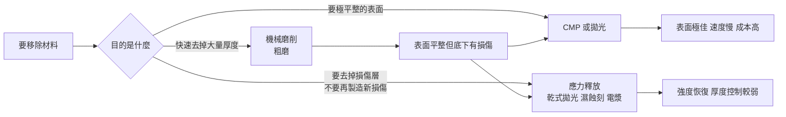

# 第 12 章：研磨、薄化與表面品質——都叫研磨，做的是同一件事嗎？

## 開場問題

一家設備商的業務同一週收到三封詢價信，主旨都寫著「研磨設備」：

- A 客戶：**12 吋矽晶圓要從 775 μm 磨到 50 μm 以下**，要求不能破片
- B 客戶：**Fan-Out 封膠面要磨到剛好露出銅柱**，磨過頭就報廢
- C 客戶：**一片方形有機載板上的厚銅要磨平**，面積比晶圓大、材料完全不同

業務把三封信轉給工程部，附註「都是研磨，應該可以用同一台」。

**這個判斷錯得非常徹底。** 三個案子的加工對象形態不同（圓片／重組體／方板）、材料不同（矽／封膠加銅／有機基材加厚銅）、要控制的指標不同（厚度均勻性／露出深度／平坦度）、失敗模式也不同（破片／過磨／翹曲）。它們需要的是三種不同的機器。

這一章要建立的是：**「研磨」是一個動詞，不是一個設備類別。** 判斷一個研磨需求，必須先問四個問題——加工什麼、為什麼磨、量什麼、然後才輪到用什麼機器。

這也是本書與均豪對應最密集的一章：[第 15 章](15-gpm-product-map.md)矩陣裡，「磨」的產品線是所有能力中最多的。

---

## 先看結構：材料是怎麼被移除的

所有「把材料弄掉一點」的方法，都可以按**移除機制**分成三類。機制決定了速度、表面品質與損傷深度，這三者永遠互相拉扯。

| 機制 | 怎麼移除 | 速度 | 表面品質 | 底下留下的損傷 |
|---|---|---|---|---|
| **機械磨削（grinding）** | 固定在砂輪上的磨粒直接切削材料 | 快 | 有規律磨痕 | **深**，會留下次表面損傷層 |
| **化學機械平坦化（CMP）** | 化學漿料軟化表面，墊布加壓相對運動帶走 | 慢 | 極佳 | 淺 |
| **化學移除（濕蝕刻、電漿）** | 純化學反應溶解材料 | 中 | 依材料而異 | 幾乎無機械損傷 |

**圖 12-1**：三種移除機制與各自的用途。**注意 C 往 D 與 E 的箭頭**：粗磨永遠不會是最後一步，因為它留下的次表面損傷會讓工件在後續搬運或熱循環時破裂。這條「粗磨 → 細磨 → 應力釋放」的鏈條是薄化製程的骨架。

### 為什麼「越薄越難」不是線性的

薄化的困難不是隨厚度線性增加，而是**在某個厚度之後急遽惡化**，原因有三個同時發生：

1. **剛性隨厚度的三次方下降。** 厚度減半，抗彎剛度掉到八分之一。工件從「一片盤子」變成「一張紙」。
2. **次表面損傷層的相對占比上升。** 損傷層深度大致由磨粒尺寸決定，不會隨工件變薄而變薄。工件 700 μm 時損傷層占比可忽略，工件 30 μm 時它可能占了相當比例的截面，直接決定破裂強度。
3. **內建應力被釋放出來。** 晶圓正面有金屬層、介電層，各層的熱膨脹係數不同，原本被厚基材壓住的應力，在基材變薄後就把整片工件拱起來。**薄化本身會製造翹曲。**

所以薄化製程幾乎一定要配一個**支撐系統**：背磨膠帶（BG tape）、臨時黏合的載具（carrier），或是保留晶圓外圈厚環的做法（俗稱 TAIKO 型式）。**支撐怎麼上、怎麼拆，往往比磨本身更決定良率。**

---

## 逐步解釋：六種「研磨」

以下六種製程在中文裡都可能被叫做「研磨」。每一種都寫明輸入／操作／輸出／目的。

### 一、晶圓背磨（backgrinding）

| 項目 | 內容 |
|---|---|
| **輸入** | 正面已完成製程的晶圓，正面貼上保護膠帶或黏到臨時載具上 |
| **操作** | 真空吸盤固定晶圓，粗磨砂輪快速去除大部分厚度，換細磨砂輪改善表面，最後做應力釋放（乾式拋光、CMP 或濕蝕刻） |
| **輸出** | 目標厚度的薄晶圓，表面粗糙度低、次表面損傷已移除 |
| **目的** | 縮短垂直互連距離（3D 堆疊）、降低封裝高度、降低熱阻、露出 TSV 的另一端 |

**這是先進封裝薄化需求的主體。** 在 CoWoS 這類結構中，中介層要薄化到讓 TSV 露出；在 HBM 中，每一層 DRAM 都要薄化才能堆得起來（見[第 8 章](08-hbm.md)）。

!!! note "TSV 揭露（reveal）是一種特別的背磨"
    當薄化的目的是「把埋在矽裡的銅柱露出來」時，最後一段不能用純機械磨削——會把銅拖出來塗抹整個表面。標準做法是磨到接近，再用**對矽選擇性高的濕蝕刻或電漿**把矽退掉，讓銅自然凸出，然後補一層絕緣層再平坦化。這一步同時牽涉[第 13 章](13-wet-process.md)的選擇比概念。

### 二、封膠研磨（mold grinding）

| 項目 | 內容 |
|---|---|
| **輸入** | 已完成封膠的工件（重組晶圓、strip 或面板），表面是環氧封膠，裡面埋著晶粒與銅柱 |
| **操作** | 磨掉封膠層，直到銅柱頂端或晶粒背面剛好露出，並磨到共平面 |
| **輸出** | 平整、銅柱均勻露出的表面，可以直接在上面做 RDL |
| **目的** | 建立後續 RDL 的基準面；降低封裝高度；改善散熱 |

**這一站的難點是「磨到剛好」。** 磨不夠，銅柱沒露出來，後面 RDL 接不上；磨過頭，銅柱變短甚至傷到晶粒，整片報廢。而且封膠與銅的硬度差很大，同一個砂輪同時磨兩種材料，容易產生高度差與拖痕。

**磨完的表面直接決定 RDL 的品質**，這是 Fan-Out 平台（見[第 5 章](05-fan-out.md)）最關鍵的一個站點。

### 三、strip 與 panel 加工

| 項目 | 內容 |
|---|---|
| **輸入** | 條狀（strip）或方形面板（panel）形態的工件——載板、封裝完成的條狀基板、面板級重組體 |
| **操作** | 用適配方形工件的載台與吸附方式進行磨削；路徑規劃要避開四個角 |
| **輸出** | 厚度與平坦度符合規格的方形工件 |
| **目的** | 與晶圓級相同的薄化與平坦化目的，但加工對象換成方形 |

**方形工件不是「大一點的圓片」。** 差異來自幾何：

| 差異點 | 圓形晶圓 | 方形 strip／panel |
|---|---|---|
| **真空吸附** | 圓對稱，吸力分布均勻 | 四角容易漏氣、翹起 |
| **磨削路徑** | 旋轉對稱，砂輪與工件的相對速度分布規律 | 進出邊界時受力突變，**四角是應力集中點** |
| **翹曲行為** | 對稱彎曲（bow） | 可能是馬鞍形或扭曲，難以吸平 |
| **邊界效應** | 只有一圈邊緣 | 四條邊加四個角，邊緣效應占比高 |

面板級封裝（見 B2《CoPoS 面板級先進封裝筆記》）之所以在設備上是另一個生態，這是主要原因之一。

### 四、CMP（chemical mechanical planarization，化學機械平坦化）

| 項目 | 內容 |
|---|---|
| **輸入** | 表面有高低起伏的工件（沉積後的介電層、電鍍後的銅 RDL、再生晶圓） |
| **操作** | 工件壓在旋轉的拋光墊上，中間持續供應含研磨顆粒與化學品的漿料；化學反應軟化表面，機械作用選擇性地帶走凸起處 |
| **輸出** | 全域平坦、粗糙度極低的表面 |
| **目的** | 讓下一層微影有平整的焦平面；把電鍍多出來的銅移除只留在溝槽裡；再生晶圓的表面重建 |

CMP 的特別之處在於**它同時是化學的與機械的**：純機械會刮傷，純化學無法選擇性移除凸起。兩者搭配才能達成「只磨高的地方」。

*CMP 不是砂輪磨削。工件正面朝下壓在墊布上，中間流過含磨粒與化學品的漿料。這張圖對應「四、CMP」那一列的操作，也解釋為什麼它的表面品質遠好於粗磨、速度卻慢得多。*

*CMP 機台長這樣：圓形拋光盤、上面的承載頭把晶圓壓下去。這是前段與先進封裝都會用到的設備類別，不是均豪產品照。*

.jpg)
*墊布會被磨平、孔隙被塞住，必須定期用修整器（conditioner）把墊面重新打出粗糙度。CMP 的穩定度有很大一部分不在「磨本身」，而在墊布有沒有被養好。*

CMP 的兩個特有缺陷值得記住，因為它們是**平坦化的內在代價**：

- **碟陷（dishing）**：大面積的軟材料（銅）被磨得比周圍硬材料低，形成凹陷
- **侵蝕（erosion）**：高密度圖案區整體被磨得比稀疏區低

兩者都不是「操作失誤」，而是圖案密度不均時必然發生的物理現象，只能靠製程參數與圖案設計（dummy pattern）緩解。

### 五、晶圓邊緣研磨（edge trimming）

| 項目 | 內容 |
|---|---|
| **輸入** | 準備薄化的晶圓，邊緣是斜角（bevel）形狀 |
| **操作** | 薄化**之前**，先把晶圓最外圈一小圈連同斜角切除，讓邊緣變成垂直面 |
| **輸出** | 邊緣為垂直壁的晶圓 |
| **目的** | 防止薄化到後期時，斜角處變成極薄的刀刃狀而崩裂 |

**這一步的因果非常直覺**：晶圓邊緣原本是斜的，當整片磨到只剩幾十微米時，斜角的最外圈會先變成刀鋒般的薄邊，一碰就碎，碎片還會污染整台機器與後續工件。事先把那一圈切掉，就沒有刀鋒可以碎。

這是一個典型的「**用製程設計解決檢測看不到的問題**」的例子——見[第 11 章](11-defect-aoi-metrology.md)關於次表面損傷的討論。

### 六、再生晶圓（reclaim wafer）的研磨與拋光

| 項目 | 內容 |
|---|---|
| **輸入** | 用過的測試晶圓、擋片（dummy wafer）、監控片，表面帶有各種膜層與圖案 |
| **操作** | 剝除膜層 → 研磨去除表層 → 拋光重建表面 → 清洗與檢測 |
| **輸出** | 表面品質可再次進廠使用的晶圓，厚度比原本薄 |
| **目的** | 降低晶圓廠的耗材成本；一片晶圓通常可再生若干次直到厚度不足 |

再生晶圓不是先進封裝製程，但它是**同一批研磨、拋光、檢測能力的另一個市場**。它的需求量與晶圓廠的產能直接掛鉤：先進製程用到的監控片與擋片比例高，所以先進製程擴產會拉動再生晶圓需求。

均豪自述的市場數字：「2 nm 以下每片生產晶圓約搭配 2.7 片再生晶圓」`[公司自述]`（G1，透過 G6 媒體轉述）。**這是引用的市場假設，不是均豪的營收數字。**

---

## 失敗會長什麼樣子

| 失效 | 物理成因 | 出現在哪些製程 | 直接後果 |
|---|---|---|---|
| **破片（breakage）** | 剛性不足加上應力集中 | 背磨後期、搬運、解黏 | 整片報廢，碎片污染設備 |
| **邊緣崩裂（chipping）** | 斜角處變成刀鋒；或砂輪進出邊界時受力突變 | 背磨、strip 四角 | 裂縫向內擴展，最終破片 |
| **次表面損傷** | 粗磨磨粒在晶格中留下的破壞層 | 粗磨後未做應力釋放 | **檢查看不到**，後續熱／機械應力下破裂 |
| **TTV 超標** | 吸盤不平、砂輪磨耗、工件本身翹曲 | 所有磨削與 CMP | 後續微影焦深不足；接合壓力不均 |
| **翹曲增加** | 薄化後內建應力被釋放 | 背磨、封膠研磨 | 吸不平、對位失準、進不了下一站 |
| **磨痕與拖痕** | 砂輪磨粒脫落、堵塞、或軟硬材料混磨 | 封膠研磨、粗磨 | 表面粗糙度超標；成為裂縫起點 |
| **過磨（over-grind）** | 終點判定失準 | 封膠研磨、TSV 揭露 | 銅柱過短或晶粒受損，**不可逆** |
| **磨不足（under-grind）** | 同上 | 封膠研磨 | 銅柱未露出，RDL 接不上 |
| **碟陷／侵蝕** | 圖案密度不均下的必然物理現象 | CMP | 局部厚度不足，電阻異常 |
| **金屬拖抹（smearing）** | 軟金屬被機械磨削拖過表面 | TSV 揭露、含銅表面粗磨 | 表面短路、污染 |
| **吸附失效** | 工件翹曲超過吸盤能吸平的範圍 | strip／panel、薄晶圓 | 加工中滑動或飛出 |

### 兩個最貴的失效

1. **不可逆的過磨。** 材料一旦被磨掉就回不來。這就是為什麼封膠研磨與 TSV 揭露站點需要**即時厚度回饋**，而不是磨完再量。
2. **潛伏的次表面損傷。** 磨完當下所有檢查都通過，貨都出去了，在客戶端才破。這類損失不只是報廢成本，還包含客戶信任。

---

## 如何檢查與控制

### 四個核心指標

| 指標 | 定義 | 為什麼有人在乎 | 怎麼量 |
|---|---|---|---|
| **厚度（thickness）** | 目標值本身 | 決定電性、熱阻、封裝高度 | 接觸式探針、紅外干涉、電容式 |
| **TTV（total thickness variation，總厚度變異）** | 整片工件上最厚點與最薄點的差 | 決定後續微影焦深、接合壓力均勻性 | 多點厚度量測後取極差 |
| **粗糙度（Ra／Rq／Rz）** | 表面高度起伏的統計量 | 決定能不能做混合鍵合、能不能長膜 | 白光干涉、原子力顯微鏡 |
| **翹曲（warpage／bow）** | 整片工件的彎曲程度 | 決定能不能被吸平、能不能進下一站 | 光學翹曲量測，需帶溫度條件 |

!!! warning "TTV 與翹曲是兩件事"
    **TTV 是「厚度」的變異，翹曲是「形狀」的變異。** 一片工件可以厚度處處相同（TTV 極小）但整片彎得像洋芋片（翹曲極大）；也可以完全平整但一邊厚一邊薄。兩者要分開量、分開規格。把它們混為一談是研磨規格閱讀最常見的錯誤。

### 核心工具：加工對象—加工目的—指標—設備類型表

**這是本章的主要交付物**，與[第 11 章](11-defect-aoi-metrology.md)的矩陣配套使用。

!!! warning "本表性質"
    本表為**跨來源教學整理**，用於建立判斷框架，**未於本次重新取用原廠文件核對**。設備類型欄位描述的是**設備類別的一般能力**，不代表任何特定公司已供應該站點——後者見[第 15 章](15-gpm-product-map.md)的證據矩陣。

| # | 加工對象 | 加工目的 | 首要控制指標 | 次要指標 | 設備類型 | 最怕什麼 |
|---|---|---|---|---|---|---|
| 1 | **矽晶圓背面**（元件晶圓） | 薄化以降低封裝高度與熱阻 | 厚度、TTV | 粗糙度、翹曲 | 晶圓背磨機（粗磨＋細磨＋應力釋放） | 破片、次表面損傷 |
| 2 | **矽中介層背面** | 薄化至 TSV 露出 | 厚度、TSV 露出高度 | 表面平坦度 | 背磨機＋選擇性蝕刻＋CMP | 過磨、金屬拖抹 |
| 3 | **HBM 堆疊用 DRAM 晶圓** | 極薄化以便多層堆疊 | 厚度、TTV、強度 | 翹曲 | 背磨機（含支撐與載具處理） | 破片、堆疊後累積翹曲 |
| 4 | **封膠表面**（重組晶圓） | 磨到銅柱或晶粒剛好露出 | **露出深度**、共面性 | 粗糙度、翹曲 | 封膠研磨機（需即時終點控制） | 過磨／磨不足、拖痕 |
| 5 | **封膠 strip／條狀封裝體** | 降低封裝高度、露出散熱面 | 厚度、共面性 | 邊緣完整性 | 條狀研磨機（strip grinder） | 四角崩裂、吸附失效 |
| 6 | **有機載板厚銅面** | 把厚銅磨平至目標厚度 | 平坦度、厚度 | 銅面粗糙度 | 方形輪磨機（大面積方形載台） | 載板翹曲、軟銅拖抹 |
| 7 | **面板級重組體（panel）** | 薄化與平坦化 | TTV、翹曲 | 邊緣完整性 | 面板級研磨設備 | 大面積翹曲、四角應力 |
| 8 | **電鍍後的銅 RDL** | 移除多餘銅、只留溝槽內 | 剩餘厚度、碟陷量 | 侵蝕、刮傷 | CMP | 碟陷與侵蝕、圖案密度不均 |
| 9 | **沉積後的介電層** | 全域平坦化供下一層微影 | TTV、局部平坦度 | 缺陷密度 | CMP | 圖案密度效應 |
| 10 | **晶圓邊緣（薄化前）** | 切除斜角防止薄化後崩邊 | 切除寬度與深度、垂直度 | 邊緣粗糙度 | 邊緣研磨／修邊機 | 切太多損失面積、切面裂縫 |
| 11 | **再生晶圓** | 剝膜、去除表層、重建表面 | 厚度、粗糙度、缺陷密度 | 平坦度 | 研磨＋CMP＋拋光＋清洗＋檢測整線 | 再生次數上限、殘留污染 |
| 12 | **SiC 等硬脆晶圓** | 平坦化 | 平坦度、加工效率 | 次表面損傷 | 專用 CMP（材料硬度遠高於矽） | 加工速度低、耗材成本高 |

### 讀這張表的三個原則

1. **先鎖定第 2 欄「目的」，設備類型自然浮現。** 同樣是矽晶圓，「薄化到 50 μm」與「薄化到 TSV 露出」是兩個不同的站，後者一定要接選擇性移除。
2. **第 1 欄的形態決定機台架構。** 圓形／方形／條狀是設備結構層次的差異，不是選配。看到「某公司做研磨設備」，第一個要問的是**做哪一種形態**。
3. **最後一欄是接[第 11 章](11-defect-aoi-metrology.md)的接口。** 每一種「最怕什麼」都要回到第 11 章矩陣去查：這個缺陷用什麼方法檢查、盲點在哪。

### 站內控制：為什麼研磨設備越來越需要整合量測

研磨的兩個特性讓「磨完再量」變得不夠：

- **不可逆**：磨過頭沒有補救
- **漂移**：砂輪會磨耗，同一組參數在第 1 片與第 500 片上的移除量不同

因此現代研磨設備普遍走向**在製程中量測（in-situ）或站內量測（in-line）加即時回饋**：邊磨邊量厚度，接近目標時降速或切換砂輪。這條技術路線把「磨」與「量」綁在同一台機器上，也是為什麼具備量測能力的研磨設備商在議價上處於較有利的位置。`[推論]`

---

## 與均豪的連結

均豪（5443）在本書所有章節中，與本章的對應最密集——「磨」與「拋」是其公開產品線中項目最多的兩項，也是其自述的歷史營收主力。以下嚴格對應[第 15 章](15-gpm-product-map.md)矩陣的具體列次，**證據等級與該矩陣保持一致，不做升級**。

### ✅ 已確認事實

對應第 15 章矩陣**第 1、5、8 列**，以及該章「磨」與「拋」兩張產品表：

- 均豪公開的「磨」類產品包含：**再生晶圓 CMP**、**Strip Grinder**（公開用詞：strip 形態封裝體、晶圓減薄；定義見待查 12-2，**不是**本章第 1–3 列的晶圓級薄化）、**載板方形輪磨**、**封裝端條狀研磨**、**晶圓邊緣研磨**、**8 吋 SiC 全自動 CMP**。「拋」類包含**再生晶圓拋光**與**先進封裝平整化**。`[公司自述]`（G1、G3、G4）
- **再生晶圓 CMP 的客戶為昇陽半導體（8028）**，且均豪是昇陽半的最大法人股東。這是[第 15 章](15-gpm-product-map.md)矩陣**第 1 列**，也是全書證據等級最高的一條供應關係。`[公司自述]`（G1）＋`[媒體報導]`（G6）＋昇陽半 2025-08-05 設備取得公告 5.51 億——**但該公告未點名供應商**，故仍未達 `[雙方公告]`。
- **2025 是再生晶圓 CMP 的放量元年**；**研磨拋光曾占均豪半導體營收逾六成**。`[公司自述]`（G4）＋`[媒體報導]`（G6）
- **載板方形輪磨與封裝端條狀研磨在 2026 H1 成為新成長線**，客戶為「歐美 PMIC 廠」（未具名），該客戶在馬來西亞與德國擴產，後段封裝仍在台灣。這是矩陣**第 5 列**。`[公司自述]`（G3，2026-08-12 法說）
- **PMIC 相關營收占母公司半導體營收，從 2024 年約 0.5%、2025 年約 1%，升至 2026 H1 的 19%**，在手訂單占 12%。`[公司自述]`（G3）
- **晶圓邊緣研磨處於「驗證中、對標日系」階段，尚未放量。** `[公司自述]`（G1）＋`[媒體報導]`（G6）
- **8 吋 SiC 全自動 CMP 與「矽晶圓大廠」（未具名）共同開發**，公司宣稱為台灣第一家大尺寸自製。這是矩陣**第 8 列**，等級為 `[媒體報導]`、開發中。（G5）
- 均豪自述引用的市場假設：「2 nm 以下每片生產晶圓約搭配 2.7 片再生晶圓」。`[公司自述]`，**這是市場假設，不是營收數字**。（G1、G6）

### 🔶 合理推論

- 均豪的「磨」產品線橫跨本章表格的**第 5、6、8、10、11、12 列**（strip／載板／CMP／邊緣／再生／SiC），但**第 1、2、3 列（元件晶圓背磨、中介層 TSV 揭露、HBM 極薄化）在公開資料中沒有對應產品**。這意味著：從「先進封裝需要大量背磨」推導均豪受惠，方向並不成立——**均豪公開的磨，主要不在元件晶圓薄化這條線上。** `[推論]`
- PMIC 載板研磨需求的物理因果可以推導：AI 伺服器 GPU 功耗上升 → 供電走向高電流 → 載板需要更厚的銅以承載電流並導熱 → 厚銅需要大面積平坦化 → 方形輪磨需求。均豪法說引用的功耗數字（2025 年約 1,400 W → 2027 年估 3,600 W）是這條推導的起點。`[公司自述]` 的引用數字加上 `[推論]` 的因果鏈。**注意：這推導的是需求方向，不是均豪的訂單金額。**
- 均豪從面板設備平移到半導體的路徑，在本章的技術語言下是可解釋的：面板的**大面積方形工件處理**與**邊角研磨**經驗，對應的正是本章表格第 6、7、10 列的難點（四角應力、大面積翹曲、邊緣完整性）。`[推論]`（轉型敘事本身是 `[媒體報導]` G6）
- 本章「研磨設備越來越需要整合量測」的趨勢，與均豪同時擁有「磨」與「量」兩條產品線的組合方向一致。但**公開資料未說明其研磨設備是否整合了自家量測模組**。`[推論]`

### ❓ 尚待查證

- 均豪的 **Strip Grinder 是否用於封膠研磨（本章第 4 列）**，或僅用於封裝完成後的減薄，公開資料的用詞是「strip 形態的封裝體、晶圓減薄」，不足以判斷。（待查 12-2）
- **均豪的研磨設備是否進入任何先進封裝（CoWoS／SoIC／HBM）的產線**，沒有任何公開證據。[第 15 章](15-gpm-product-map.md)矩陣中，均豪與先進封裝的公開關聯集中在「檢」與「量」，不在「磨」。
- 「載板方形輪磨」的加工對象是**有機載板本身**還是**載板上的厚銅層**，公開表述為「高導熱厚銅載板」，未進一步界定。這影響它落在本章表格的第 6 列還是別的位置。（待查 12-3）
- 均豪的 CMP 產品線目前公開對應的是**再生晶圓**與**SiC**，**沒有公開證據顯示其進入先進封裝的介電層或銅 RDL 平坦化**（本章表格第 8、9 列）。這是兩個技術要求差異很大的市場。
- 「研磨拋光曾占半導體營收逾六成」是媒體轉述的歷史數字，**適用年度未明確界定**，也未說明是個體還是合併口徑。（待查 12-4）

!!! danger "本章不能推出的結論"
    「先進封裝需要大量研磨 → 均豪的研磨產品線最完整 → 均豪是先進封裝研磨的主要供應商」——**無效。**

    公開資料顯示的是相反的分布：均豪已放量的「磨」集中在**再生晶圓與載板／封裝端**，而先進封裝晶圓級薄化（背磨、TSV 揭露、HBM）在公開產品線中**沒有對應項目**。把研磨產品線的數量當成先進封裝滲透度的證據，是本章要防的主要誤判。

---

## 理解檢查

???+ question "Q1：開場那三封詢價信，如果你是工程主管，你會怎麼向業務解釋「不能用同一台」？請用本章的四個問題回答。"
    **四個問題依序問：**

    1. **加工什麼形態？** A 是圓形晶圓、B 是重組晶圓（圓形但材料混合）、C 是方形載板。形態決定載台與吸附架構，是**機台結構層次的差異**，不是換個程式就好。
    2. **為什麼磨？** A 是薄化到目標厚度、B 是磨到剛好露出銅柱、C 是把厚銅磨平。B 需要**即時終點判定**，A 需要**厚度均勻性控制**，C 需要**大面積平坦度**。
    3. **量什麼？** A 量厚度與 TTV、B 量露出深度與共面性、C 量平坦度。三套量測系統不同。
    4. **怕什麼？** A 怕破片與次表面損傷、B 怕過磨（不可逆）、C 怕載板翹曲與軟銅拖抹。三套製程保護策略不同。

    四題答完，結論很清楚：這是三個不同的產品，不是三個訂單。

???+ question "Q2：為什麼粗磨之後一定要接應力釋放，不能直接出貨？如果客戶說「我們的檢查都過了」，你怎麼回應？"
    因為粗磨的磨粒在矽的晶格中留下**次表面損傷層**，深度大致由磨粒尺寸決定。這層損傷**在表面量測與光學檢測上都看不到**（表面可能非常平整），但它大幅降低工件的破裂強度。

    對客戶的回應：「檢查都過了」正好是問題所在——**這是一個沒有 in-line 檢測方法的缺陷類別**（見[第 11 章](11-defect-aoi-metrology.md)矩陣）。工件會在後續搬運、堆疊或熱循環中破裂，而破裂發生在下游，成本更高。

    正確做法是**以製程保證**：粗磨後接細磨與應力釋放（乾式拋光、CMP 或濕蝕刻），把損傷層本身移除，再用破壞性抽樣與強度試驗定期驗證流程有效。

???+ question "Q3：一片工件量出 TTV 極小但翹曲極大。這片工件能不能進行下一站的微影？"
    **TTV 小不代表能進微影。** 兩者量的是不同東西：TTV 是厚度的變異，翹曲是形狀的變異。一片洋芋片可以厚度處處相同，但整片彎曲。

    對微影而言，關鍵是**工件被吸盤吸住之後的表面平整度**。翹曲大的工件如果能被真空吸盤吸平，且吸平後不產生額外應力或滑移，那 TTV 小確實有幫助；如果翹曲超過吸盤能吸平的範圍，工件根本吸不住，或吸住後局部仍有離焦。

    所以正確的追問是：**這片工件在吸附狀態下的平整度是多少？在製程溫度下呢？** 這正好接回第 11 章「室溫量翹曲不代表製程溫度下的翹曲」。

???+ question "Q4：某報導寫「均豪研磨產品線最完整，是先進封裝研磨的主要受惠者」。用本章的表格，指出這句話的問題。"
    **問題在於「產品線數量」與「進入哪個站點」被混為一談。**

    對照本章的十二列表格與[第 15 章](15-gpm-product-map.md)矩陣，均豪已公開對應的是：**再生晶圓（第 11 列）、strip／條狀（第 5 列）、載板厚銅（第 6 列）、邊緣研磨（第 10 列，驗證中）、SiC CMP（第 12 列，開發中）**。

    而先進封裝晶圓級薄化的三個核心站點——**元件晶圓背磨（第 1 列）、中介層 TSV 揭露（第 2 列）、HBM 極薄化（第 3 列）**——在均豪的公開產品線中**沒有對應項目**。

    正確的說法：均豪的研磨產品線在**加工對象形態上**確實橫跨多種（圓形晶圓、strip、方形載板），但**已被公開證實放量的部分集中在再生晶圓與載板／封裝端**，不在先進封裝的晶圓級薄化。這兩件事的證據等級差距很大，不能合併敘述。

???+ question "Q5：PMIC 載板研磨這條線，2026 H1 從 1% 跳到 19%。作為讀者，你會用哪兩個後續觀察來檢驗「這是結構性成長」而不是「一次性大單」？"
    **觀察一：在手訂單占比與營收占比的關係。** 法說同時揭露 PMIC 占母公司半導體營收 19%、在手訂單占 12%。如果後續季度營收占比持續高於在手訂單占比，代表消化速度快於補進速度，成長可能是一次性的；反之若在手訂單占比也往上走，才是需求延續。

    **觀察二：客戶端的擴產進度是否兌現。** 公司自述客戶（歐美 PMIC 廠，未具名）在馬來西亞與德國擴產，後段封裝仍在台灣。要檢驗的是這些擴產計畫是否按期推進——設備需求跟隨的是**客戶的資本支出**，不是終端 PMIC 市場規模。

    **附帶提醒**：法說引用的 GPU 功耗（2025 年約 1,400 W → 2027 年估 3,600 W，G3）是**市場假設**，不是均豪的訂單能見度。這條因果推導方向合理，但推不出金額。

---

## 來源與待查事項

### 本章來源

| 主張 | 來源 | 等級 | 日期 |
|---|---|---|---|
| 三種材料移除機制與各自代價 | E3 | 跨來源教學整理，**未於本次重新取用原文** | — |
| 背磨流程、支撐方式、次表面損傷 | E3、B1 | 跨來源整理 | — |
| TSV 揭露的選擇性移除 | E3、E4、B1 | 跨來源整理 | — |
| CMP 的碟陷與侵蝕 | E3 | 跨來源整理 | — |
| 方形工件與圓形晶圓的加工差異 | E3、B2 | 跨來源整理 | — |
| 厚度／TTV／粗糙度／翹曲的定義 | E3 | 跨來源整理，**未填規格數值** | — |
| 加工對象—目的—指標—設備類型表 | 本書自建（見附錄 A 第四節） | **本書整理，非產業標準** | 2026-09-09 |
| 均豪「磨」「拋」產品線清單 | G1、G3、G4 | `[公司自述]` | 2026-03／06／08 法說 |
| 再生晶圓 CMP 與昇陽半關係 | G1、G6 ＋ 昇陽半 2025-08-05 公告 | `[公司自述]`＋`[媒體報導]`；公告未點名供應商 | 2025-08／2026-01 |
| 2025 為 CMP 放量元年 | G4 | `[公司自述]` | 2026-03-03 法說 |
| 研磨拋光曾占半導體營收逾六成 | G6 | `[媒體報導]`，**年度與口徑未界定** | 2026-01-29 |
| 載板方形輪磨、封裝端條狀研磨、PMIC 占母公司半導體 2024 約 0.5%／2025 約 1%／2026 H1 19% | G3 | `[公司自述]` | 2026-08-12 法說 |
| 晶圓邊緣研磨驗證中、對標日系 | G1、G6 | `[公司自述]`＋`[媒體報導]` | 2026-08-31 快照 |
| 8 吋 SiC 全自動 CMP | G5 | `[媒體報導]`，開發中 | 2026-04-27 |
| 2 nm 以下每片搭配 2.7 片再生晶圓 | G1、G6 | `[公司自述]` 引用之市場假設 | 2025-09／2026-01 |
| GPU 功耗 1,400 W → 3,600 W | G3 | `[公司自述]` 引用之市場數字，**非均豪營收** | 2026-08-12 法說 |

各代號定義見[附錄 A 來源索引](appendix-sources.md)。

### 待查事項

| # | 問題 | 為什麼重要 | 會怎麼查 |
|---|---|---|---|
| 12-1 | 各類研磨的實際厚度、TTV、粗糙度規格量級為何？ | 本章全部以定性描述，無法用於規格比較 | 設備商技術文件、SEMI 標準 |
| 12-2 | 均豪 Strip Grinder 是否用於封膠研磨（磨到露銅柱），還是僅封裝後減薄？ | 決定它落在本章表格第 4 列還是第 5 列，兩者技術難度不同 | 官網產品頁、展場資料、法說 Q&A |
| 12-3 | 「載板方形輪磨」的加工對象是載板基材還是其上的厚銅層？ | 影響材料相容性與競爭對手判斷 | 法說簡報原檔、產品型錄 |
| 12-4 | 「研磨拋光曾占半導體營收逾六成」是哪一年、個體還是合併？ | 這是判斷均豪營收結構的關鍵數字，目前口徑不明 | 年報營收分類、原文報導 |
| 12-5 | 均豪的研磨設備是否整合自家量測模組？ | 決定其在「磨＋量」整合趨勢上的位置 | 產品型錄、展場實機資料 |
| 12-6 | 均豪是否有進入晶圓級薄化（背磨、TSV 揭露、HBM）的公開紀錄？ | 這是本章指出的最大空白，直接影響先進封裝敘事的可信度 | 法說 Q&A、年報產品清單、展場資料 |

---

> 上一頁：[第 11 章 缺陷、AOI 與量測](11-defect-aoi-metrology.md)　｜　下一頁：[第 13 章 濕製程、清洗與製程整合](13-wet-process.md)　｜　相關頁面：[第 4 章 工件形態的變化](04-workpiece-flow.md) ｜ [第 9 章 SoIC 與混合鍵合](09-soic-hybrid-bonding.md) ｜ [第 14 章 良率、產能與設備採購](14-yield-capacity-capex.md) ｜ [第 15 章 均豪產品地圖](15-gpm-product-map.md)
