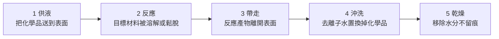
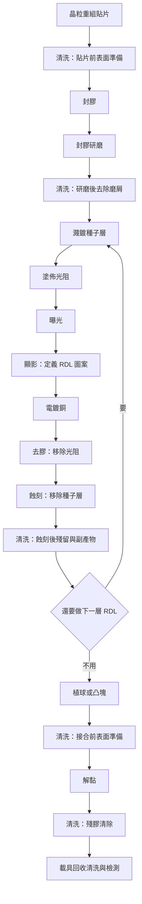

# 第 13 章：濕製程、清洗與製程整合——哪裡要移除，哪裡要保留？

## 開場問題

你站在一條 Fan-Out 產線上，看到三台外觀幾乎一模一樣的機台：同樣是旋轉夾盤、同樣有噴嘴、同樣噴出透明液體、同樣接排風與廢液管路。

你問操作員這三台在做什麼，得到三個答案：

- 第一台：「顯影。」
- 第二台：「去膠。」
- 第三台：「蝕刻。」

看起來完全相同的動作，為什麼要分成三個站、三種化學品、三套廢液系統？

答案在一個問題上：**這一步「想移除什麼」，以及更重要的，「想保留什麼」。**

濕製程的本質不是「洗東西」，而是**在一個由多種材料構成的表面上，選擇性地只移除其中一種**。它的成敗全部押在「選擇性」這三個字上——移除得不夠，殘留；移除得太多，把不該動的東西一起吃掉。

這一章要建立的判斷是：**看到「清洗設備」四個字，不能推導出任何東西**。要先問它移除什麼、保留什麼、在哪一站。

---

## 先看結構：所有濕製程的共同骨架

不論叫什麼名字，濕製程都是同一組五個動作：

**圖 13-1**：濕製程的五段共同骨架。**每一段都有自己的失效模式**：供液不均導致中心與邊緣差異、反應不足導致殘留、帶走不良導致再沉積、沖洗不淨導致腐蝕、乾燥不當導致水痕。多數濕製程問題不是出在第 2 段的化學反應，而是出在其他四段。

### 兩種硬體架構

| 架構 | 怎麼做 | 優點 | 缺點 |
|---|---|---|---|
| **批次槽式（batch）** | 一次把數十片工件浸在化學槽中 | 產出高、單位成本低 | 交叉污染、化學液隨使用次數劣化、均勻性難控 |
| **單片式（single wafer，spin）** | 一次一片，旋轉中噴灑化學品 | 每片條件一致、可精確控時、化學品用量少 | 節拍長、設備台數需求高 |

**先進封裝越往高階走，越傾向單片式**，原因有三：工件價值高，不能承受交叉污染；製程窗口窄，需要逐片控時；工件形態多樣（重組晶圓、薄晶圓、載具），批次夾具難以通用。

*濕製程發生在這種環境裡，不是普通的「洗東西」。人員穿無塵服，空氣、顆粒與化學品都被管制。開場那三台外觀相似的單片機，差別全部在管路裡的化學品與配方，從走廊上看不出來。這張是一般無塵室照片，不是均豪廠區。*

這個趨勢對設備需求的意義很直接：**單片式的節拍比批次式長得多，同樣產能需要更多台機器**——這條線索接到[第 14 章](14-yield-capacity-capex.md)的產能計算。

### 濕製程的核心語言：選擇比

**選擇比（selectivity）** 是「想移除的材料被移除的速率」除以「想保留的材料被移除的速率」。

| 選擇比 | 意義 | 後果 |
|---|---|---|
| **極高** | 幾乎只吃目標材料 | 製程窗口寬，可以多做一點確保清乾淨 |
| **中等** | 會順便吃掉一些保留材料 | 必須精確控時，過與不及都出事 |
| **接近 1** | 兩種材料一起被吃 | 這個化學品不能用在這一站 |

**選擇比不是化學品的固有屬性，而是「化學品 × 材料組合 × 溫度 × 濃度」的函數。** 同一瓶藥水，在矽上是高選擇比，在銅上可能就是災難。這就是為什麼開場那三台機器不能共用。

---

## 逐步解釋：五類濕製程

### 一、清洗（cleaning）

| 項目 | 內容 |
|---|---|
| **輸入** | 表面帶有非預期異物的工件 |
| **操作** | 依污染類型選用化學品與物理輔助（超音波／百萬赫超音波、毛刷刷洗、高壓噴流） |
| **輸出** | 表面污染量降到下一站可接受的水準 |
| **目的** | 讓下一站的沉積、接合或微影能正常進行 |

**清洗要先分清楚「洗什麼」**，因為四類污染需要完全不同的化學：

| 污染類型 | 來源 | 移除原理 |
|---|---|---|
| **顆粒（particle）** | 搬運、研磨、切割、環境 | 讓顆粒與表面同帶負電互相排斥，或用機械力剝離 |
| **有機物** | 光阻殘留、人為污染、包材揮發物 | 氧化分解成小分子帶走 |
| **金屬離子** | 化學品帶入、設備磨耗 | 用酸性溶液螯合帶走 |
| **原生氧化層** | 暴露在空氣中自然生成 | 用含氟化學品溶解 |

!!! note "為什麼清洗常常是「一組」而不是「一步」"
    因為四類污染的移除化學互相衝突：去有機的鹼性氧化環境會促進原生氧化層生成，去氧化層的含氟化學品又會讓表面變疏水而容易吸附顆粒。所以標準做法是**依固定順序串接數個槽或數個噴灑步驟**，中間夾沖洗。這使得「清洗站」在流程圖上是一個方塊，在設備上卻是一整套。

**接合前清洗是最嚴苛的一種。** 混合鍵合（見[第 9 章](09-soic-hybrid-bonding.md)）要求兩個表面直接接觸就要鍵結，任何一顆殘留顆粒都會在周圍造成一片不接合區——**顆粒的影響半徑遠大於顆粒本身。**

### 二、顯影（development）

| 項目 | 內容 |
|---|---|
| **輸入** | 已曝光的光阻層（或感光介電層） |
| **操作** | 用鹼性顯影液溶解曝光區（正型）或未曝光區（負型），沖洗後乾燥 |
| **輸出** | 帶有圖案開口的光阻層 |
| **目的** | 把光學曝光的潛像轉換成實體的立體圖案，供後續電鍍或蝕刻使用 |

顯影不是「洗掉光阻」，而是**利用曝光造成的溶解度差異做選擇性移除**。它的選擇比來自曝光本身，不是化學品。

**先進封裝的顯影有一個特別的難點**：RDL 用的光阻通常很厚（相對於前段製程），深寬比高，顯影液要進得去、產物要出得來。開口底部的殘留（俗稱 scum）是最常見的問題，且**在光學檢測下往往看不出來**——直到電鍍後才發現該長銅的地方沒長。

### 三、去膠（stripping）

| 項目 | 內容 |
|---|---|
| **輸入** | 任務已完成、必須整片移除的光阻或乾膜 |
| **操作** | 用溶劑溶解，或先用氧電漿灰化再用濕式清除殘渣 |
| **輸出** | 光阻完全移除、底下的結構完好 |
| **目的** | 讓底下已完成的圖案（電鍍好的銅線、蝕刻好的溝槽）暴露出來，進入下一層 |

**去膠與顯影的差別在於選擇性的來源**：顯影靠曝光差異做局部移除，去膠是**全面移除**——所以它對「保留什麼」的要求反而更高，因為底下已經有做好的金屬圖案，化學品絕對不能碰。

去膠的難點是**電鍍後或蝕刻後的光阻會變性**：經過電鍍液、高溫或電漿的光阻會硬化交聯，一般溶劑溶不動，需要更強的化學或更長的時間，而更強的化學又威脅底下的金屬。這是典型的選擇比困境。

### 四、蝕刻（wet etching）

| 項目 | 內容 |
|---|---|
| **輸入** | 需要移除某一層材料的工件，通常上面有光阻或已完成的圖案作為遮罩 |
| **操作** | 用對目標材料選擇比高的酸或鹼溶解該層 |
| **輸出** | 目標層被移除，其餘結構保留 |
| **目的** | 圖案轉移、去除犧牲層、露出下層結構 |

先進封裝中最關鍵的一個蝕刻站是 **種子層蝕刻（seed layer etch）**：

RDL 的做法通常是先在整面濺鍍一層很薄的金屬（種子層）以便導電，再用光阻定義圖案、電鍍加厚，最後去膠。這時整片表面除了電鍍好的線路以外，**線與線之間還鋪著那層薄種子層——它會讓所有線短路。** 必須把它蝕掉，而且：

- **蝕不乾淨** → 線間漏電或短路
- **蝕過頭** → 連電鍍好的線路一起被吃，線寬變窄、電阻上升，嚴重時斷線

因為種子層與電鍍層通常是同一種或相近的金屬，**這一站的選擇比天生就低**，只能靠時間與均勻性控制。這是 Fan-Out 與 RDL 中介層（見[第 5 章](05-fan-out.md)、[第 7 章](07-cowos-r-l-icube.md)）最容易出良率問題的站點之一。

!!! warning "濕蝕刻是等向性的"
    液體不分方向，所以濕蝕刻會**往下也往旁邊吃**，在遮罩底下形成**側蝕（undercut）**。側蝕量大致與蝕刻深度同量級，這決定了濕蝕刻能做到的最小線寬。要做更細的圖案，就必須改用有方向性的乾式（電漿）蝕刻——但乾式的設備與運行成本高得多。**這個取捨是「哪些站用濕、哪些站用乾」的主要判準之一。**

### 五、去黏與後續清除（debonding and residue removal）

| 項目 | 內容 |
|---|---|
| **輸入** | 已完成加工、還黏在臨時載具上的薄工件 |
| **操作** | 用雷射、加熱、機械剝離或溶劑解除黏著層，再用濕製程清除殘膠 |
| **輸出** | 與載具分離、表面無殘膠的薄工件 |
| **目的** | 把載具回收再利用，並讓工件進入後續站點 |

這一步在 Fan-Out 與 RDL 中介層流程裡是必經站。難點有二：

1. **工件此時最脆弱**——已經很薄，又剛失去載具支撐
2. **殘膠必須完全清除**，但可用的化學品受限於工件上已有的材料（封膠、有機介電層、金屬）都不能被傷害

**載具在這裡回到流程**：解下來的載具要清洗、檢查，確認可以再用一次。這正是[第 4 章](04-workpiece-flow.md)講的載具循環，也是載具檢測需求的來源。

---

## 濕製程站點圖：它們散布在哪裡

濕製程不是一個階段，而是**穿插在整條流程裡的一組站點**。下圖以 Fan-Out／RDL 類流程為例（**教學簡化，站點順序經過合併與省略**）：

**圖 13-2**：濕製程站點在 Fan-Out 類流程中的分布（**教學簡化流程**，不代表任何公司的實際產線）。方塊 W1–W8 是濕製程站點。**注意 RDL 的迴圈**：每多做一層 RDL，就多跑一次「顯影 → 去膠 → 蝕刻 → 清洗」。這是為什麼 RDL 層數是先進封裝成本與良率的主要驅動因子之一。

### 從這張圖能讀出的三件事

1. **濕製程站點的數量大致與 RDL 層數成正比。** 一個四層 RDL 的產品，光是這個迴圈就跑四次，每次至少四個濕站。
2. **清洗永遠夾在有污染風險的動作之後。** 研磨後、蝕刻後、解黏後——這三處都是必然產生殘留物的地方。
3. **載具的循環在最後回到起點。** 載具清洗與檢測不是流程的附屬，而是一個獨立的循環子系統。

---

## 失敗會長什麼樣子

### 失效原因與控制參數表

**這是本章的主要交付物**，與[第 11 章](11-defect-aoi-metrology.md)的檢測矩陣配套使用。

!!! warning "本表性質"
    本表為**跨來源教學整理**，用於建立判斷框架，**未於本次重新取用原廠文件核對**。所有描述均為定性與量級，不含具體化學配方或製程參數數值。

| # | 失效 | 發生在哪一步（圖 13-2） | 物理／化學成因 | 主要控制參數 | 怎麼發現（見[第 11 章](11-defect-aoi-metrology.md)） |
|---|---|---|---|---|---|
| 1 | **光阻底部殘留（scum）** | W3 顯影 | 深寬比高，顯影液進不去、產物出不來 | 顯影時間、噴灑方式、溫度、光阻厚度 | 電鍍後才發現（AOI 看不到極薄殘留） |
| 2 | **種子層殘留** | W5 蝕刻 | 蝕刻時間不足或均勻性差 | 蝕刻時間、溫度、液流分布 | AOI 難判；**電性測試線間漏電才會顯現** |
| 3 | **線路過蝕變窄／斷線** | W5 蝕刻 | 選擇比低，連電鍍層一起吃 | 蝕刻時間、化學品配方、終點判定 | AOI 可見斷線；線寬變窄需量測 |
| 4 | **側蝕（undercut）** | W5 蝕刻 | 濕蝕刻的等向性本質 | 蝕刻深度、遮罩設計；必要時改乾式 | 截面分析（破壞性） |
| 5 | **去膠不淨** | W4 去膠 | 電鍍或高溫後光阻交聯硬化 | 溶劑種類、溫度、時間；前置電漿灰化 | 後續層附著不良、電阻異常 |
| 6 | **底層金屬被去膠液攻擊** | W4 去膠 | 選擇比不足 | 化學品選擇、時間、溫度 | 表面變色、線寬變化 |
| 7 | **電偶腐蝕（galvanic corrosion）** | W4、W5、W6 | 兩種不同金屬在電解液中接觸形成電池 | 化學品 pH、暴露時間、沖洗速度 | AOI 可見變色與蝕孔 |
| 8 | **水痕（watermark）** | 所有 W 的乾燥段 | 殘留水滴蒸發後留下溶解物 | 乾燥方式、去離子水品質、旋乾轉速 | AOI 明場 |
| 9 | **圖案倒塌（pattern collapse）** | W3、W4 乾燥段 | 高深寬比結構在乾燥時被液體表面張力拉倒 | 乾燥方式、表面張力、結構深寬比 | AOI；嚴重時電性測試 |
| 10 | **顆粒再沉積** | 所有 W 的帶走與沖洗段 | 已剝離的顆粒沒被帶走，重新附著 | 液流量、旋轉轉速、沖洗時間、化學品壽命 | AOI 暗場 |
| 11 | **金屬離子污染** | 批次槽、化學品帶入 | 化學液累積使用後金屬離子濃度上升 | 化學液更換週期、槽體材質、過濾 | 表面分析（離線） |
| 12 | **交叉污染** | 批次槽式尤其嚴重 | 前一批的殘留帶到下一批 | 批次隔離、單片式架構、沖洗設計 | 良率地圖出現批次相關性 |
| 13 | **材料相容性失效** | 任何 W | 化學品攻擊封膠、有機介電層或臨時黏著層 | 化學品與所有暴露材料的相容性驗證 | 表面起泡、變形、分層（**用 SAT**） |
| 14 | **薄工件破損** | W7、W8 解黏前後 | 剛失去支撐，剛性極低 | 搬運設計、旋轉轉速、液流衝擊力 | 直接可見 |
| 15 | **均勻性不足（中心與邊緣差異）** | 所有 W | 供液分布、旋轉造成的離心效應 | 噴嘴設計與掃描、轉速、溫度均勻性 | 多點量測後看空間分布 |

### 三個最容易被低估的失效

1. **極薄的分子級殘留。** 它在光學上完全不可見，卻足以讓混合鍵合完全失敗。**「AOI 看起來很乾淨」不等於「乾淨到可以鍵合」**——這兩者的潔淨度標準差好幾個數量級。
2. **材料相容性。** 前段製程的世界只有矽、氧化物、金屬；先進封裝多了封膠、有機介電層、臨時黏著劑、載具膠帶。**一個在晶圓廠用了二十年的清洗配方，搬到封裝廠可能第一片就把封膠泡壞。** 這是製程整合最常出事的地方。
3. **化學液壽命造成的緩慢漂移。** 每一片都在規格內，但蝕刻速率隨著槽液使用次數慢慢下降，殘留風險逐批上升。這是統計製程管制要抓的趨勢問題，不是單片判定抓得到的。

---

## 如何檢查與控制

### 濕製程的五個控制維度

| 維度 | 要控什麼 | 失控的樣子 |
|---|---|---|
| **選擇比** | 對目標材料快、對保留材料慢 | 殘留（比太低不夠力）或過蝕（比不夠高） |
| **均勻性** | 片內（中心 vs 邊緣）與片間（第 1 片 vs 第 500 片） | 良率地圖出現同心圓或批次趨勢 |
| **終點判定** | 什麼時候停 | 過蝕或不足；不可逆 |
| **殘留控制** | 沖洗與乾燥要把東西真的帶走 | 水痕、再沉積、殘膠 |
| **材料相容性** | 所有暴露材料都不被攻擊 | 起泡、變形、分層 |

### 檢查手段與各自的限制

| 想確認什麼 | 常用手段 | 限制 |
|---|---|---|
| 移除量是否正確 | 前後厚度量測、線寬量測 | 抽樣點有限，量不到局部異常 |
| 有沒有顆粒 | AOI 暗場、顆粒計數 | 看不到透明膜下與圖案內的顆粒 |
| 有沒有極薄殘留 | 接觸角量測、表面分析 | **多為離線與破壞性**，無法全檢 |
| 有沒有短路／漏電 | 電性測試（daisy chain、線間漏電） | 只覆蓋有測試結構的位置 |
| 有沒有分層／起泡 | 超音波掃描（SAT） | 需耦合液、通常抽樣 |
| 均勻性 | 多點量測後做空間統計 | 點數與節拍互相拉扯 |
| 化學液狀態 | 濃度分析、金屬離子監控、使用次數計數 | 監控頻率不足時漂移已經發生 |

!!! danger "濕製程最危險的組合"
    **「不可逆的移除」加上「檢測看不到的殘留」。**

    蝕刻過頭救不回來，而蝕刻不足留下的極薄殘留在 in-line 檢測中看不到——**兩個方向的錯誤都很難即時發現**。所以濕製程的品質幾乎完全押在**製程窗口的設計與參數的穩定性**上，而不是押在檢查站。這與[第 12 章](12-grinding-thinning.md)的「次表面損傷靠製程保證、不靠檢查」是同一個道理。

---

## 與均豪的連結

**本章是本書與均豪（5443）公開產品線對應最弱的一章，必須明說。**

### ✅ 已確認事實

- **均豪的公開產品線中，沒有獨立的濕製程設備項目。** 其自述的核心能力是「檢、量、磨、拋」四項（G1、G6），公開的產品清單（見[第 15 章](15-gpm-product-map.md)四張產品表）中，「檢」為 AOI／X-ray／NIR 類，「量」為白光干涉與 3D 檢測，「磨」與「拋」為研磨、CMP、拋光類。**清洗、蝕刻、去膠、顯影均不在其中。** `[公司自述]`（G1、G2、G3、G4）
- 均豪公開的產品中，**唯一與濕製程有必然接觸的是再生晶圓產線與 CMP**：CMP 使用漿料，製程後必須清洗；再生晶圓的流程本身包含剝膜與清洗步驟。均豪自述再生晶圓業務為「研磨、拋光、AOI」整線相關。`[公司自述]`（G1、G4）
- 均豪的聯盟夥伴**志聖工業（2467）**的公開定位是「前段製程設備（曝光、壓合等）」。**志聖與均豪是交叉持股關係，不是母子公司，營收不併入均豪。** `[公司自述]`（G1、G6）

### 🔶 合理推論

- CMP 設備與後續清洗在實務上經常整合在同一台機或同一條線上（因為漿料殘留必須立刻清除，不能讓工件帶著漿料離開）。因此均豪的 CMP 產品**可能包含清洗模組**，但**這是設備類別的一般做法，不是均豪公開揭露的事實**。`[推論]`
- 本章圖 13-2 顯示濕製程站點數量大致與 RDL 層數成正比。若先進封裝的 RDL 層數持續增加，濕製程站點的絕對數量會上升——**但這推導的是濕製程設備市場，與均豪的公開產品線沒有交集。** `[推論]`
- 本章圖 13-2 最後的「載具回收清洗與檢測」是均豪 Carrier AOI 的接口所在：**檢測發生在清洗之後**。這意味著載具清洗品質會直接影響 AOI 的誤判率——洗不乾淨的載具會被判為有缺陷。這條關聯是製程邏輯上的，**均豪公開資料未討論此議題**。`[推論]`

### ❓ 尚待查證

- 均豪的 CMP 設備是否整合清洗模組、清洗規格如何，公開資料未揭露。（待查 13-2）
- 均豪的再生晶圓整線方案中，剝膜與清洗是自製、外購還是由客戶自備，公開資料未揭露。
- 志聖（2467）的產品線中是否包含濕製程設備，本書未查證，**且即使包含也不屬於均豪的營收**。

!!! danger "本章不能推出的結論"
    「先進封裝的濕製程站點很多 → 均豪做半導體設備 → 均豪受惠於濕製程需求」——**無效，而且方向錯誤。**

    公開資料顯示均豪沒有濕製程產品線。**本書明確記錄：本章的技術內容與均豪的公開產品線沒有直接對應。** 保留這一章的理由有兩個：（1）濕製程是理解第 11 章缺陷來源與第 12 章製程整合的必要背景；（2）它示範了「某個製程需求很大」與「某家公司受惠」之間沒有必然關係——這正是全書要反覆訓練的判斷。

---

## 理解檢查

???+ question "Q1：開場那三台外觀相同的機器，如果強行共用一台，最可能先出什麼事？"
    **最可能是化學交叉污染與材料相容性失效。**

    顯影用鹼性顯影液、去膠用溶劑或強鹼、蝕刻用酸——三者的化學性質不同甚至互相反應。共用同一套管路與槽體會造成：

    1. **殘留化學品互相中和或反應**，產生沉澱物污染工件表面。
    2. **蝕刻用的酸殘留在管路中，下一片做顯影時攻擊已完成的金屬圖案**——這是本章表格第 6、7 列的失效。
    3. **廢液系統混合可能產生危險反應**，這是安全問題不只是良率問題。

    更根本的原因：三站的**選擇比要求完全不同**，用同一套化學品不可能同時滿足三個「保留什麼」的要求。

???+ question "Q2：種子層蝕刻這一站，為什麼特別容易出問題？如果良率不佳，你會先調哪三個參數？"
    **特別容易出問題的原因：選擇比天生就低。** 種子層與電鍍上去的線路通常是同一種或相近的金屬，化學品無法區分兩者，只能靠「種子層很薄、線路很厚」這個厚度差來爭取時間窗口。蝕刻不足留下短路，蝕刻過頭把線吃細。

    **會先調的三個參數：**

    1. **蝕刻時間**——最直接，但窗口窄。
    2. **均勻性相關參數（液流分布、旋轉轉速、溫度均勻性）**——如果良率地圖呈現同心圓或單邊分布，問題在均勻性不在時間，調時間只會把好的區域也弄壞。
    3. **化學液狀態（濃度、使用次數）**——如果失效是隨批次逐漸惡化，那是液體壽命問題，換液比調參數有效。

    **判斷順序很重要**：先看良率地圖的**空間分布與時間趨勢**，再決定調哪一個。空間分布異常調均勻性，時間趨勢異常調化學液，兩者都正常才調時間。

???+ question "Q3：為什麼「AOI 看起來很乾淨」不代表可以進行混合鍵合？"
    因為**兩者的潔淨度標準差好幾個數量級**。

    AOI 用可見光看表面反射，能分辨的最小尺度受限於光學解析度；而混合鍵合要求兩個表面直接接觸就形成銅－銅與介電層－介電層的鍵結，**任何分子級的有機殘留都會阻斷鍵結**。更麻煩的是，一顆顆粒造成的不接合區域**遠大於顆粒本身**——它會把周圍一整片撐開。

    所以接合前的潔淨度驗證不能只靠 AOI，需要接觸角量測、表面分析這類方法，而這些**多為離線與破壞性**，只能抽樣。這是[第 11 章](11-defect-aoi-metrology.md)矩陣中「極薄殘留」那一列的實際後果。

???+ question "Q4：一個在晶圓廠用了二十年、非常成熟的清洗配方，直接搬到封裝廠用。你會擔心什麼？"
    **擔心材料相容性。**

    前段製程的表面主要是矽、氧化物、氮化物與少數金屬；先進封裝的表面多了**環氧封膠、有機介電層、臨時黏著劑、載具膠帶、大面積的銅**。一個為矽與氧化物設計的配方，完全沒有義務對這些材料友善。

    可能的後果：封膠被溶劑泡到膨脹或起泡、有機介電層變性、臨時黏著層提前失效導致工件在製程中脫落、大面積銅被腐蝕。

    **正確做法**：把工件上**所有會暴露的材料**列成清單，逐一驗證與該化學品的相容性——包含浸泡後的外觀、重量變化、附著力，並做溫度與時間的加速測試。這件事沒有捷徑，也是製程整合工程師最耗時的工作之一。

???+ question "Q5：某分析寫「先進封裝 RDL 層數增加，濕製程設備需求大增，均豪身為半導體設備廠將受惠」。指出這段推論斷在哪裡。"
    **前半段成立，後半段斷裂。**

    **成立的部分**：RDL 層數增加確實會讓濕製程站點數量近乎等比例上升（本章圖 13-2 的迴圈），所以濕製程設備的市場需求方向是對的。

    **斷裂的部分有兩處：**

    1. **均豪的公開產品線中沒有濕製程設備。** 「半導體設備廠」是一個過寬的類別——設備業內部的分工非常細，做研磨的不會因為濕製程需求上升而受惠。這是[第 2 章](02-packaging-taxonomy.md)「層次混用」錯誤的另一種形式。
    2. **即使有產品，還要證明賣給誰、用在哪條線。** 這是[第 15 章](15-gpm-product-map.md)矩陣存在的理由。

    **正確的問法**：RDL 層數增加，會讓哪些站點的設備需求上升？均豪的公開產品線與這些站點有沒有交集？有交集的話證據等級是什麼？——本章的答案是「沒有交集」，而**明確記錄「沒有」，與記錄「有」同等重要**。

---

## 來源與待查事項

### 本章來源

| 主張 | 來源 | 等級 | 日期 |
|---|---|---|---|
| 濕製程五段骨架與兩種硬體架構 | E4 | 跨來源教學整理，**未於本次重新取用原文** | — |
| 清洗的四類污染與移除原理 | E4 | 跨來源整理，**未列具體配方** | — |
| 顯影、去膠、蝕刻的區別與選擇比概念 | E4 | 跨來源整理 | — |
| 種子層蝕刻的良率困境 | E4、B2 | 跨來源整理 | — |
| 濕蝕刻等向性與側蝕 | E4 | 通用物理原理 | — |
| 濕製程站點圖（圖 13-2） | 本書自建 | **教學簡化流程**，站點經合併與省略 | 2026-09-09 |
| 失效原因與控制參數表 | 本書自建（見附錄 A 第四節） | **本書整理，非產業標準** | 2026-09-09 |
| 均豪核心能力為「檢、量、磨、拋」 | G1、G6 | `[公司自述]`＋`[媒體報導]` | 2026-08-31 快照 |
| 均豪公開產品線不含濕製程設備 | G1、G2、G3、G4 | 依公開產品清單推得之**否定陳述**；受限於公開揭露完整度 | 2026-03／06／08 法說 |
| 志聖定位為前段製程設備、交叉持股不併表 | G1、G6 | `[公司自述]`＋`[媒體報導]` | 2026-08-31 快照 |

各代號定義見[附錄 A 來源索引](appendix-sources.md)。

### 待查事項

| # | 問題 | 為什麼重要 | 會怎麼查 |
|---|---|---|---|
| 13-1 | 各濕製程站點的實際選擇比、均勻性規格量級為何？ | 本章全為定性描述，無法用於規格比較 | 化學品供應商與設備商技術文件 |
| 13-2 | 均豪的 CMP 設備是否整合清洗模組？ | 決定其產品是否有濕製程的技術接觸面 | 產品型錄、展場實機、法說 Q&A |
| 13-3 | 均豪的再生晶圓整線中，剝膜與清洗由誰提供？ | 影響其在該客戶產線上的價值占比 | 法說 Q&A、客戶端公開資料 |
| 13-4 | 均豪的公開產品清單是否已窮盡其實際產品線？ | 本章的否定陳述完全建立在公開揭露的完整度上 | 官網產品頁全覽、年報產品分類、展場攤位資料 |
| 13-5 | 載具清洗品質對 Carrier AOI 誤判率的實際影響為何？ | 若影響顯著，代表洗與檢是需要一起賣的組合 | 客戶端技術發表、設備商應用說明 |

---

> 上一頁：[第 12 章 研磨、薄化與表面品質](12-grinding-thinning.md)　｜　下一頁：[第 14 章 良率、產能與設備採購](14-yield-capacity-capex.md)　｜　相關頁面：[第 5 章 Fan-Out](05-fan-out.md) ｜ [第 9 章 SoIC 與混合鍵合](09-soic-hybrid-bonding.md) ｜ [第 11 章 缺陷、AOI 與量測](11-defect-aoi-metrology.md) ｜ [第 15 章 均豪產品地圖](15-gpm-product-map.md)
