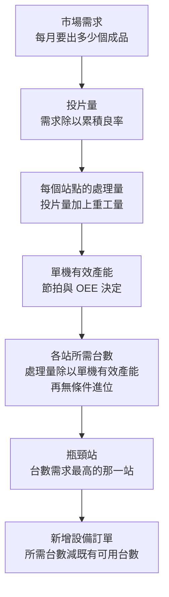
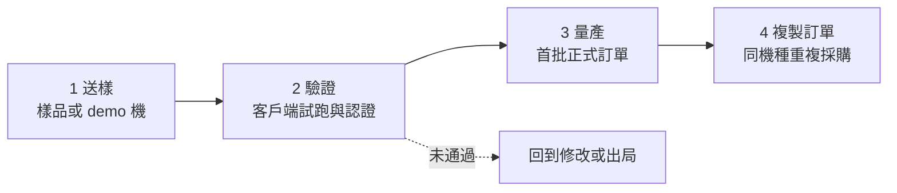

# 第 14 章：良率、產能與設備採購——需求增加，為什麼設備不一定等比例增加？

## 開場問題

某封裝廠對外宣布：**未來三年產能要翻倍。**

隔天，一家設備商的業務主管把團隊叫來開會，開場白是：「客戶產能翻倍，我們的訂單也該翻倍，今年目標往上調。」

工程主管舉手問了三個問題：

1. **翻倍的是哪一段產能？** 是整條線，還是只有幾個站點的產能不足？
2. **他們現有的機台，稼動率是多少？** 如果目前只跑到七成，那前面兩成的成長不需要買任何新機器。
3. **他們的良率與重工率打算改善多少？** 如果重工率從一成五降到百分之四，同一批機器能多出的有效產出可能就吃掉一大塊新增需求。

三個問題問完，業務主管的目標數字沒了依據。

**這一章要做的事，是把「需求」翻譯成「設備台數」的完整計算過程，並且讓你能自己代入不同數字重算。** 這條計算鏈是[第 16 章](16-reading-news.md)分析擴產新聞的骨架——沒有它，任何「產能翻倍所以訂單翻倍」的推論都只是修辭。

!!! danger "本章所有數字均為假設值"
    **本章算例中出現的所有數字（節拍、稼動率、良率、重工率、台數、需求量）都是為了示範計算方法而設定的假設值，不是任何公司的實際數據，也不代表任何產品或站點的真實表現。**

    讀者應該做的是：把自己手上的數字代進同樣的公式重算，而不是引用本章的數字。每個算例都會明列假設，方便代換。

---

## 先看結構：從需求到台數的計算鏈



**圖 14-1**：從市場需求推導設備訂單的完整計算鏈。**七個方塊之間有六個環節，每一個都可能吸收掉需求成長，讓最後的訂單增幅遠小於需求增幅。** 這張圖是本章的骨架，後面每一節填一個方塊。

[](https://commons.wikimedia.org/wiki/File:Wafermap_showing_fully_and_partially_patterned_dies.svg)
*為什麼「投片量」不是「晶圓面積 ÷ 晶粒面積」那麼簡單：邊緣那些切到圓弧的半顆（圖中較淡的格子）不能出貨。良率計算的分母，是完整晶粒數，不是幾何面積。*

[](https://commons.wikimedia.org/wiki/File:ICC_2008_Poland_Silicon_Wafer_1_edit.png)
*把上圖對回實物：每一小格是一顆 die。累積良率掉一個百分點，整片上「能出貨的格子」就少一圈——這就是後面算例裡，投片量必須先除以良率的原因。*

### 五個必須先定義清楚的名詞

| 名詞 | 定義 | 常見誤用 |
|---|---|---|
| **節拍（tact time／cycle time）** | 一台機器處理一個工件所需的時間 | 只算加工時間，忘了裝卸、對位、量測 |
| **UPH（units per hour）** | 每小時產出數 = 3600 秒 ÷ 節拍秒數 | 用理論 UPH 當實際產出 |
| **稼動率／可用率（availability）** | 機器可運轉時間 ÷ 日曆時間 | 與 OEE 混用 |
| **OEE（overall equipment effectiveness，設備綜合效率）** | 可用率 × 性能率 × 良品率 | 只用可用率就當成 OEE |
| **瓶頸（bottleneck）** | 整條線上產能最低的那一站 | 以為每一站都需要等比例擴充 |

!!! warning "稼動率不等於 OEE"
    **稼動率只回答「機器有沒有在動」，OEE 回答「機器有沒有產出好東西」。**

    一台機器可以 95% 的時間都在動（可用率高），但因為配方保守而跑得比設計節拍慢（性能率低），做出來的東西還有一成要重工（良品率低）。三個乘起來，OEE 可能只有六成多。**看到「稼動率九成五」不要直接當成產能利用率九成五。**

---

## 逐步計算：五個算例

以下五個算例層層相接，每一個都先列假設、再列算式、再列結果。**所有假設都可以替換。**

### 算例 1：單機理論月產能

**假設：**

| 參數 | 假設值 |
|---|---|
| 每片工件的節拍 | **60 秒** |
| 每月運轉日曆時間 | **30 天 × 24 小時 = 720 小時** |

**算式：**

```
理論 UPH   = 3600 秒 ÷ 60 秒 = 60 片／小時
理論月產能 = 60 片／小時 × 720 小時 = 43,200 片／月
```

**結果：43,200 片／月。**

**這個數字沒有任何實務意義**，因為它假設機器一秒都不停。它的用途只有一個：**當分母，用來衡量後面所有損失。**

### 算例 2：把 OEE 算進去

**假設：**

| 參數 | 假設值 | 這個數字代表什麼 |
|---|---|---|
| 可用率 A | **85%** | 保養、故障、待料、換料佔掉 15% |
| 性能率 P | **90%** | 實際跑的節拍比設計值慢 10% |
| 良品率 Q | **98%** | 該站產出有 2% 不良 |

**算式：**

```
OEE        = 0.85 × 0.90 × 0.98 = 0.7497 ≈ 75%
有效月產能 = 43,200 片 × 0.75 = 32,400 片／月
```

**結果：單機有效月產能 32,400 片。**

**觀察**：三個看起來都「還不錯」的數字（85%、90%、98%）乘起來只剩 75%。**OEE 是乘法，不是加法**——這是產能估算最常被低估的地方。

### 算例 3：一條線上三個站需要幾台

**假設：**

| 參數 | 假設值 |
|---|---|
| 該站每月要處理的投片量 | **100,000 片** |
| 站 A 節拍 | **60 秒**（同算例 1） |
| 站 B 節拍 | **180 秒** |
| 站 C 節拍 | **30 秒** |
| 三站的 OEE | 都假設為 **75%** |

**算式（以站 B 為例）：**

```
站 B 理論 UPH   = 3600 ÷ 180 = 20 片／小時
站 B 理論月產能 = 20 × 720 = 14,400 片／月
站 B 有效月產能 = 14,400 × 0.75 = 10,800 片／月
站 B 所需台數   = 100,000 ÷ 10,800 = 9.26 台 → 進位為 10 台
```

**三站結果：**

| 站 | 節拍 | 理論 UPH | 有效月產能 | 需求 ÷ 有效產能 | **需要台數** | 台數確定後的利用率 |
|---|---|---|---|---|---|---|
| **A** | 60 秒 | 60 | 32,400 | 3.09 | **4 台** | 77% |
| **B** | 180 秒 | 20 | 10,800 | 9.26 | **10 台** | 93% |
| **C** | 30 秒 | 120 | 64,800 | 1.54 | **2 台** | 77% |

**結果：站 B 是瓶頸，需要 10 台，是站 C 的五倍。**

**兩個關鍵觀察：**

1. **台數必須無條件進位。** 你不能買 9.26 台。進位造成的餘裕（站 A 與站 C 都只用到 77%）是後面吸收需求成長的第一個緩衝。
2. **節拍差三倍，台數就差三倍。** 站 B 的節拍是站 A 的三倍，台數也接近三倍。**節拍是設備需求量最直接的驅動因子**——這也是為什麼「一台機器一次能處理幾片、要不要逐片量測」對設備商的營收量體影響巨大（見[第 11 章](11-defect-aoi-metrology.md)全檢與抽樣的取捨、[第 13 章](13-wet-process.md)單片式與批次式的取捨）。

### 算例 4：累積良率——為什麼要多投片

一條線上每一站都會損失一點良率，而**良率是連乘的**。

**假設：**

| 情境 | 假設 |
|---|---|
| 情境一 | 10 個站，每站良率 **99%** |
| 情境二 | 20 個站，每站良率 **99%** |
| 情境三 | 10 個站，其中 9 站 99%、**1 站掉到 95%** |

**算式與結果：**

```
情境一：0.99^10                = 0.9044 → 累積良率 90.4%
情境二：0.99^20                = 0.8179 → 累積良率 81.8%
情境三：0.99^9 × 0.95 = 0.9135 × 0.95 = 0.8678 → 累積良率 86.8%
```

**三個結論：**

1. **站點數量本身就是良率成本。** 從 10 站到 20 站，每站良率完全不變，累積良率就掉了 8.6 個百分點。這是先進封裝「多做一層 RDL 就多一輪濕製程」（見[第 13 章](13-wet-process.md)圖 13-2）的真實代價。
2. **一個壞站的破壞力很大。** 情境三只有一站從 99% 掉到 95%，整條線就掉 3.6 個百分點。
3. **反推：要達到 95% 的累積良率，10 站的每站良率要多少？**

```
每站良率 = 0.95 的 10 次方根 = 0.9949 → 每站要 99.49%
```

**每站 99% 不夠，要 99.5% 才行。** 這就是為什麼先進封裝的良率討論永遠停留在小數點後面。

**回到投片量：** 如果要每月產出 90,000 個良品，累積良率 90.4%，則：

```
所需投片量 = 90,000 ÷ 0.904 = 99,558 ≈ 100,000 片／月
```

——這正是算例 3 用的那個 100,000。**投片量是需求除以累積良率，不是需求本身。**

### 算例 5：重工怎麼吃掉產能

重工（rework）是一種特殊的損失：**它不減少最終產出，但它佔用機台時間。**

**假設（以瓶頸站 B 為例）：**

| 情境 | 投入 100 片後的結果 |
|---|---|
| 情境一（重工率低） | 一次通過 95 片、**重工 4 片**、報廢 1 片 |
| 情境二（重工率高） | 一次通過 84 片、**重工 15 片**、報廢 1 片 |
| 兩情境共同假設 | 重工品再跑一次該站後**全部通過**（簡化假設） |

**算式（情境一）：**

```
該站總處理次數 = 100 + 4 = 104 次
該站有效產出   = 95 + 4 = 99 片
重工折損係數   = 99 ÷ 104 = 0.9519

站 B 有效月產能（含重工）= 10,800 × 0.9519 = 10,281 片／月
所需台數 = 100,000 ÷ 10,281 = 9.73 → 進位 10 台
```

**算式（情境二）：**

```
該站總處理次數 = 100 + 15 = 115 次
該站有效產出   = 84 + 15 = 99 片
重工折損係數   = 99 ÷ 115 = 0.8609

站 B 有效月產能（含重工）= 10,800 × 0.8609 = 9,298 片／月
所需台數 = 100,000 ÷ 9,298 = 10.75 → 進位 11 台
```

**結果：重工率從 4% 升到 15%，同樣的需求，瓶頸站要多買一台。**

**反過來讀，這句話更重要：把重工率從 15% 降到 4%，客戶可以少買一台。** 這就是為什麼「良率改善」與「設備採購」是相互替代的——客戶隨時可以用製程改善去取代資本支出。

---

## 核心算例：為什麼「產能翻倍」不等於「設備訂單翻倍」

這是本章的主要交付物，也是[第 16 章](16-reading-news.md)分析擴產新聞的核心工具。

**基準情境（沿用算例 3 與算例 5 情境一）：**

| 站 | 需求 100,000 片／月 | 需要台數 |
|---|---|---|
| A | 節拍 60 秒、OEE 75%、無重工 | 4 台 |
| B | 節拍 180 秒、OEE 75%、重工 4% | 10 台 |
| C | 節拍 30 秒、OEE 75%、無重工 | 2 台 |
| **合計** | | **16 台** |

**現在需求翻倍到 200,000 片／月。**

### 天真估算

```
16 台 × 2 = 32 台，新增 16 台
```

### 實際計算：四個吸收因子逐一套用

**吸收因子一：既有機台的餘裕（整數化的緩衝）**

站 A 與站 C 原本只用到 77%，翻倍後不需要剛好兩倍的機器：

```
站 A：200,000 ÷ 32,400 = 6.17 → 7 台（不是 8 台）
站 C：200,000 ÷ 64,800 = 3.09 → 4 台（正好兩倍）
站 B：200,000 ÷ 10,281 = 19.45 → 20 台
合計 = 7 + 20 + 4 = 31 台，新增 15 台
```

只靠整數化就省下 1 台。**站點越多、每站餘裕越大，這個效應累積起來越可觀。**

**吸收因子二：稼動率提升**

**假設**：產線成熟後，透過保養最佳化與換料流程改善，OEE 從 **75% 提升到 82%**。**只套瓶頸站 B**；站 A、C 仍用 75%。本算例把重工係數與 OEE 的良品率分開處理、不重疊。

```
站 B 理論月產能不變 = 14,400 片
站 B 有效月產能 = 14,400 × 0.82 = 11,808 片
含重工 4% = 11,808 × 0.9519 = 11,240 片／月
所需台數 = 200,000 ÷ 11,240 = 17.79 → 18 台
```

**光是 OEE 從 75% 到 82%，瓶頸站就從 20 台降到 18 台。**

**吸收因子三：節拍改善**

**假設**：製程優化與軟體升級把站 B 的節拍從 **180 秒縮短到 150 秒**（例如減少不必要的量測點、平行化裝卸動作）。

```
新理論 UPH = 3600 ÷ 150 = 24 片／小時
新理論月產能 = 24 × 720 = 17,280 片
有效月產能 = 17,280 × 0.82 = 14,170 片
含重工 4% = 14,170 × 0.9519 = 13,488 片／月
所需台數 = 200,000 ÷ 13,488 = 14.83 → 15 台
```

**節拍改善 17%（180→150 秒），台數再從 18 台降到 15 台。**

**吸收因子四：重工率下降**

**假設**：良率改善讓重工率從 **4% 降到 1%**（投入 100 片：通過 98、重工 1、報廢 1）。

```
重工折損係數 = 99 ÷ 101 = 0.9802
有效月產能 = 14,170 × 0.9802 = 13,889 片／月
所需台數 = 200,000 ÷ 13,889 = 14.40 → 15 台
```

**結果不變，仍是 15 台。** 這個算例故意留著，因為它示範了一個重要現象：**當重工率已經很低時，再降低的邊際效果很小。** 吸收因子有先後順序，不是每一個都同等重要。

**吸收因子五：既有設備複用**

現有的 10 台站 B 設備並沒有消失。若它們仍在規格內、仍能跑新產品：

```
站 B 新增訂單 = 15 台 − 10 台 = 5 台
```

這 5 台**只算站 B**。全線新增見下表：26 − 16 = **+10 台**（A +3、B +5、C +2）。不要把站 B 的 +5 當成全線答案。

### 總結：需求翻倍，設備訂單增加多少

| 情境 | 站 A | 站 B | 站 C | 合計台數 | **新增訂單** |
|---|---|---|---|---|---|
| **基準（需求 100,000）** | 4 | 10 | 2 | 16 | — |
| **天真估算（台數 ×2）** | 8 | 20 | 4 | 32 | **+16 台** |
| **只算整數化** | 7 | 20 | 4 | 31 | **+15 台** |
| **加上 OEE 提升到 82%** | 7 | 18 | 4 | 29 | **+13 台** |
| **再加上節拍 180→150 秒** | 7 | 15 | 4 | 26 | **+10 台** |

**需求翻倍（+100%），新增設備訂單只有 +10 台，相對於基準的 16 台是 +62.5%，相對於天真估算的 +16 台只有 62.5%。**

!!! danger "這個算例的唯一結論"
    **產能成長率與設備訂單成長率之間，沒有固定的換算比例。**

    中間隔著至少五個吸收因子：整數化餘裕、稼動率、節拍、重工率、既有設備複用。**每一個因子都由客戶控制，不由設備商控制**，而且客戶有強烈動機把它們用滿——因為每一個都比買新機器便宜。

    反過來說，也有**放大因子**：新製程需要既有設備做不到的規格（既有設備不能複用）、新增站點（原本沒有的檢查站）、良率下降（要多投片）、更嚴的規格造成節拍變長。**放大因子與吸收因子哪一邊贏，要逐案判斷，不能預設。**

### 什麼時候訂單會超過需求成長

為了對稱，這裡列出四種**設備訂單成長快於產能成長**的情況：

| 情況 | 為什麼會放大 | 對應章節 |
|---|---|---|
| **新增站點** | 原本沒有的檢查或製程站被加進流程 | [第 11 章](11-defect-aoi-metrology.md)「前段來料檢查」是這類例子 |
| **規格升級導致節拍變長** | 從抽樣改全檢、從 2D 改 3D 量測 | [第 11 章](11-defect-aoi-metrology.md) |
| **既有設備無法複用** | 新產品的工件形態或規格超出舊機能力 | [第 12 章](12-grinding-thinning.md)工件形態差異 |
| **每片工件對應的次要工件變多** | 例如每片成品要搭配數片載具或監控片 | [第 4 章](04-workpiece-flow.md)、[第 12 章](12-grinding-thinning.md) |

**最後一項特別值得注意**：如果一個站點處理的是「每片成品要搭配 N 片的次要工件」，那該站的需求成長是主線需求的 N 倍——**這種倍率關係比主線的產能數字更能決定設備需求。**

---

## 失敗會長什麼樣子：產能規劃的六種誤判

| 誤判 | 長什麼樣子 | 後果 |
|---|---|---|
| **用理論產能規劃** | 直接拿 43,200 當單機產能 | 買太少，量產後開天窗 |
| **稼動率當 OEE** | 「稼動 95%」直接乘上理論產能 | 高估產能約兩成到三成 |
| **每站等比例擴充** | 瓶頸與非瓶頸一起加 | 非瓶頸站買太多，資金閒置 |
| **忽略重工佔用機時** | 只算最終良率不算處理次數 | 瓶頸站台數低估 |
| **用峰值月推算全年** | 拿單月最高產出年化 | 設備業單月波動極大，這種年化幾乎必錯 |
| **忘記驗證期佔用機台** | 新產品導入時佔用產線機台做驗證 | 量產產能被驗證吃掉 |

---

## 如何檢查與控制：送樣、驗證、量產、複製訂單

**產能計算算出的是「客戶需要幾台」，不是「設備商今年會出幾台」。** 中間隔著一個四階段的過程，每個階段對設備商的意義完全不同。



**圖 14-2**：設備導入的四個階段。**虛線代表驗證失敗的分支**——這個分支的存在是設備業與一般製造業最大的差別：前兩階段的投入可能完全歸零。

| 階段 | 客戶在做什麼 | 設備商的營收意義 | 時間量級 | 關鍵風險 |
|---|---|---|---|---|
| **1 送樣** | 用樣品或 demo 機評估基本能力 | **幾乎沒有營收**，是投入 | 數月 | 連入場資格都拿不到 |
| **2 驗證** | 在自己的產線上試跑，驗規格、驗穩定性、驗維護性 | **可能有一台的營收，也可能沒有** | 數季到一年以上 | **驗證失敗則前面全部歸零** |
| **3 量產** | 首批正式採購，開始跑真實產品 | **第一次有可觀營收**，但量不大 | 數季 | 初期問題會影響後續採購 |
| **4 複製訂單** | 同機種重複採購，擴充或複製新廠 | **真正的營收主體**，毛利也最好 | 持續 | 被競爭對手在下一輪切入 |

### 這張表怎麼用來讀新聞

| 新聞用詞 | 對應階段 | 對營收的意義 |
|---|---|---|
| 「送樣」「demo」「評估中」 | 1 | **無**。只代表有機會 |
| 「驗證中」「認證中」「導入中」 | 2 | **極少或無**。可能失敗 |
| 「通過認證」「獲認可」 | 2 完成 | **仍未必有營收**。認證與下單是兩件事 |
| 「進入量產」「開始出貨」「開始認列」 | 3 | **開始有營收**，但通常不大 |
| 「放量」「重複訂單」「擴大採購」 | 4 | **這才是營收主體** |

!!! warning "「認證」與「認列營收」之間隔著一整個週期"
    這是設備業最常被誤讀的一件事。通過客戶認證代表**技術上被接受**，但客戶何時下單取決於他們的擴產時程與資本支出計畫，而那是另一件事。

    **在讀任何設備商消息時，先把它歸到這四個階段的哪一階段，再談營收。**

### 三個補充概念

- **FAT／SAT（廠內驗收／現場驗收）**：設備商在自己廠內先驗一次，運到客戶端再驗一次。**營收認列時點通常在現場驗收通過之後**，這造成出貨與認列之間有時間差，也是設備業單月營收波動大的結構原因之一。
- **驗證期佔用機台**：客戶做新製程驗證時，通常要佔用產線上的機台，這段時間該機台不產出良品。**驗證本身會吃掉產能**，是規劃時容易漏掉的一項。
- **複製訂單的門檻在於「同機種」**：客戶蓋新廠時，複製既有已驗證的機種最省事。這給了既有供應商很強的續留優勢，也意味著**第一次驗證進不去，後面幾年都很難進去**。

---

## 與均豪的連結

本章的計算框架可以直接套在均豪（5443）2026 年的公開資訊上——而套完的結果，正好解釋了為什麼「先進封裝擴產」與「均豪營收」之間不是簡單的比例關係。以下對應[第 15 章](15-gpm-product-map.md)矩陣的具體列次，**證據等級與該矩陣保持一致**。

### ✅ 已確認事實

- 均豪的公開產品現況橫跨圖 14-2 的**四個階段**，公司自己就是這樣分開表述的（`[公司自述]`，G2、G3）：

    | 產品 | 圖 14-2 階段 | 公司公開用詞 | 對應矩陣列 |
    |---|---|---|---|
    | Carrier AOI | **3 → 4** | 「認證並量產」「2026 Q2 量產放量、開始認列」 | 第 7 列 |
    | 白光干涉儀 | **3** | 「國內 OSAT 認可」「Q2 進入量產放量」 | 第 4 列 |
    | 再生晶圓 CMP | **4** | 「2025 是放量元年」，之後跟客戶資本支出走 | 第 1 列 |
    | 載板方形輪磨 | **3 → 4** | 2026 H1 起成為新成長線 | 第 5 列 |
    | 3D X-ray | **2** | 「國際封裝大廠認證中」，目標 2027 貢獻營收 | 第 6 列 |
    | 晶圓邊緣研磨 | **2** | 「驗證中，對標日系」 | 第 15 章「磨」表 |
    | 8 吋 SiC 全自動 CMP | **1 → 2** | 與「矽晶圓大廠」共同開發中 | 第 8 列 |

- 均豪自述 CMP 業務「之後跟客戶 CapEx 走」`[公司自述]`（G2）——這是本章「設備訂單跟隨客戶資本支出，不跟隨終端市場規模」的公司自己版本。
- 均豪自述 2026 年營收成長主要來自研磨與再生晶圓，2027 年才看 AOI 隨先進封裝放量。`[公司自述]`（G4、G2）
- **2026 上半年是本章框架的一個現成案例**：前 6 月累計營收年增僅 **+1.3%**，7 月單月 8.37 億、年增 **+165.6%**，把前 7 月拉到 **+22.4%**。`[公司自述]`＋`[媒體報導]`（G7）
- **出貨套數存在口徑衝突且未解**：G5（媒體，2026-04-27）稱個體不含均華的半導體製程設備出貨 2025 年估 162 套、2026 年估 485 套；2026 年報英文版另有 714 套（加顯示器 14 套）的數字，**口徑不明**。`[媒體報導]`／`[公司自述]`，**兩組數字不可混用、不可相減**（見[附錄 A](appendix-sources.md)與待查 15-3）。
- **PMIC 相關營收占母公司半導體營收 19%，在手訂單占 12%**。`[公司自述]`（G3）
- 均豪法說引用的市場數字：CoWoS 月產能 2023 年約 1.3 萬片 → 2027 年估 20 萬片。`[公司自述]` 引用之**市場數字，不是均豪的營收或訂單**。（G3）

### 🔶 合理推論

- **7 月單月營收年增 165.6%、上半年累計只有 +1.3%，本身就是圖 14-2 的證據**：設備業的營收認列集中在現場驗收通過的時點，導致單月波動極大。**任何用單月營收年化推估全年的做法，在這種波動下都不可靠。** `[推論]`
- **均豪 2026 年的營收空窗，可以用本章框架解釋**：舊現金流（再生晶圓 CMP，處於階段 4）在客戶新廠興建期間出貨淡化——**客戶正在蓋廠，不是正在買設備**，這正是「訂單跟隨客戶資本支出時程，而非終端需求」的表現；同時新產品（Carrier AOI、白光干涉）2026 Q2 才進入階段 3，兩者中間出現時間差。`[推論]`（各段事實為 G3、G5、G7 的 `[公司自述]` 與 `[媒體報導]`，因果串接為本書推論）
- **「CoWoS 月產能 2023 年 1.3 萬片 → 2027 年 20 萬片」約 15 倍的成長，不能推導出均豪相關設備需求 15 倍。** 依本章的五個吸收因子：客戶會提升稼動率、改善節拍、降低重工、複用既有設備，而且**成長只發生在瓶頸站與新增站點**。更根本的問題是：**均豪的設備是否在那條產線上，本書沒有任何公開證據可以確認**（見[第 15 章](15-gpm-product-map.md)矩陣第 2 列，等級僅 `[媒體報導]` 且客戶未具名）。`[推論]`
- **載具檢測是本章「放大因子」的一個候選例子**：均豪法說引用「每片先進封裝晶圓約搭配 2.5 片循環載具」`[公司自述]`（G3）。若此假設成立，載具檢測站的處理量成長率會是主線的 2.5 倍——**這是需求推導，不是均豪的訂單推導。** `[推論]`
- 均豪自述「不做單一設備殺價市占，走製程共同開發」`[公司自述]`（G1、G6）。以本章框架解釋，共同開發是**設法把自己綁進階段 4 的複製訂單**——因為一旦客戶複製新廠時沿用同機種，供應商的續留優勢很強。`[推論]`

### ❓ 尚待查證

- 均豪任一設備在客戶端的**節拍、稼動率、單機產能**，公開資料完全沒有揭露。本章的算例**與均豪的任何實際數字無關**。
- 均豪的設備在客戶產線上是否位於**瓶頸站**，無公開資料。這直接決定客戶擴產時該設備的採購倍率。
- 「485 套」與「714 套」的口徑差異未解，**因此無法用套數推算單機平均售價，也無法用套數推算營收**。（待查 15-3）
- 均豪的營收認列時點是出貨、現場驗收通過，還是其他基準，公開資料未說明。這影響對月營收波動的解讀。（待查 14-4）
- PMIC 在手訂單占 12%、營收占 19%，**兩者的時間對應關係未揭露**，無法判斷是消化既有訂單還是持續補進。

!!! danger "本章不能推出的結論"
    「CoWoS 月產能從 1.3 萬片成長到 20 萬片 → 相關設備需求跟著成長 → 均豪營收跟著成長」——**這條推論鏈有兩處斷裂。**

    **第一處**：產能成長率不等於設備訂單成長率，中間隔著本章的五個吸收因子與四個放大因子，方向與倍率都要逐案計算。

    **第二處，也是更根本的**：均豪的設備是否在該產線上、在哪一站，公開證據只到 `[媒體報導]` 等級且客戶未具名。**沒有這一步，前面的所有計算都沒有著力點。**

---

## 理解檢查

???+ question "Q1：某站的稼動率是 95%，節拍 40 秒。若每月以 720 小時計算，這一站的單機月產能是多少？請說明你需要補哪些資訊。"
    **只用稼動率算出來的數字會高估。**

    先算能算的部分：

    ```
    理論 UPH   = 3600 ÷ 40 = 90 片／小時
    理論月產能 = 90 × 720 = 64,800 片／月
    只乘稼動率 = 64,800 × 0.95 = 61,560 片／月
    ```

    **但 61,560 不是有效產能**，因為稼動率只是 OEE 的第一項。還需要：

    1. **性能率**：實際節拍是否真的跑到 40 秒？
    2. **良品率**：該站產出有多少不良？
    3. **重工率**：有多少工件要再跑一次，佔用機時但不增加產出？

    假設性能率 90%、良品率 98%、重工率 4%：

    ```
    OEE = 0.95 × 0.90 × 0.98 = 0.8379
    有效產能 = 64,800 × 0.8379 = 54,296
    含重工 = 54,296 × （99 ÷ 104） = 51,685 片／月
    ```

    **從 61,560 掉到 51,685，差了約 16%。** 這 16% 就是「稼動率當 OEE」造成的高估。

???+ question "Q2：一條線有 15 個站，客戶希望累積良率達到 92%。平均每站良率至少要多少？如果其中一站只有 96%，其餘各站要多少才能補回來？"
    **第一問：**

    ```
    每站良率 = 0.92 的 15 次方根 ≈ 0.9945 → 99.45%
    ```

    **第二問：** 設其餘 14 站良率為 y：

    ```
    y^14 × 0.96 = 0.92
    y^14 = 0.92 ÷ 0.96 = 0.9583
    y = 0.9583 的 14 次方根 ≈ 0.99696 → 99.70%
    ```

    **從 99.45% 提高到 99.70%。** 這個數字看起來只差 0.25 個百分點，但在良率工程上，**從 99.45% 到 99.70% 意味著缺陷密度要降低約一半**——這通常需要一整輪的製程改善，不是調參數就能達成。

    **這題的重點**：一個落後的站，代價不是它自己那幾個百分點，而是**強迫所有其他站都要更好**。這也是為什麼封裝廠對單一站點的良率極度敏感。

???+ question "Q3：客戶說「產能要從每月 5 萬片增加到 8 萬片」。你負責的站點節拍 120 秒、目前 OEE 70%、重工率 8%、客戶現有 6 台。請估算新增訂單台數，並列出你所有的假設。"
    **先列假設**（每月 720 小時、重工品再跑一次後全部通過、OEE 與節拍維持不變）：

    ```
    理論 UPH   = 3600 ÷ 120 = 30 片／小時
    理論月產能 = 30 × 720 = 21,600 片
    有效月產能 = 21,600 × 0.70 = 15,120 片
    ```

    重工係數要先把情境定義清楚，因為「重工率 8%」這句話不足以計算。**補上假設：投入 100 片，一次通過 91、重工 8、報廢 1**：

    ```
    總處理次數 = 100 + 8 = 108
    有效產出   = 91 + 8 = 99
    重工係數   = 99 ÷ 108 = 0.9167
    含重工有效月產能 = 15,120 × 0.9167 = 13,860 片／月
    ```

    **台數：**

    ```
    目前需求 50,000 ÷ 13,860 = 3.61 → 4 台（客戶有 6 台，代表有餘裕或有其他用途）
    新需求   80,000 ÷ 13,860 = 5.77 → 6 台
    新增訂單 = 6 − 6 = 0 台
    ```

    **結論：在這組假設下，需求成長 60%，新增訂單是零。** 因為客戶現有 6 台原本就有餘裕。

    **這題的重點不是算出零，而是三件事：**

    1. **必須先問客戶現有幾台、目前跑到多滿**，否則無法估算。
    2. **每一個假設都要寫出來**（OEE、重工、每月時數），因為它們全都可以被質疑。
    3. **如果客戶要提升 OEE 或改善重工，缺口還會更小**；反之如果新產品規格更嚴導致節拍變長或 OEE 下降，就會反過來。

???+ question "Q4：某設備商宣布「產品獲國際大廠認證」，股價大漲。用本章的四階段表，說明這則消息實際告訴你什麼、沒告訴你什麼。"
    **告訴你的：** 產品在技術上通過了客戶的規格與穩定性要求，**從階段 2 走到了階段 2 的完成**。這確實是門檻——大多數設備在階段 1 或 2 就出局了。

    **沒告訴你的（四件）：**

    1. **客戶什麼時候下單。** 認證與採購是兩個決策，後者取決於客戶的擴產時程與資本支出計畫。
    2. **會下多少台。** 取決於該站是不是瓶頸、客戶現有設備的餘裕、以及本章的所有吸收因子。
    3. **會不會是獨家。** 客戶通常會認證多家供應商以分散風險，認證通過不等於拿到全部份額。
    4. **營收認列在什麼時候。** 出貨到現場驗收通過之間還有時間差。

    **正確的動作**：把這則消息標為「階段 2 完成」，然後把「首批量產訂單」與「複製訂單」列為後續要追蹤的觀察點——**這兩者才是營收事件。**

???+ question "Q5：一家設備商 7 月單月營收年增 165%，前 7 月累計年增 22%。有分析師用 7 月數字年化推估全年。這個做法的問題是什麼？你會改用什麼方法？"
    **問題有三：**

    1. **設備業的營收認列是離散事件，不是連續流。** 營收通常在現場驗收通過時認列，一台大機台的認列就能讓單月營收翻倍。單月數字反映的是「這個月剛好驗收了幾台」，不是產能或需求的月度水準。
    2. **年化會把一次性事件放大 12 倍。** 如果 7 月剛好集中認列了原本分散在數月的機台，年化就是把同一批機器算了很多次。
    3. **累計數字已經給了更好的答案。** 前 7 月累計 +22% 是 7 個月的平均，比單月穩定得多。

    **改用的方法：**

    - **看累計年增率與其趨勢**，而不是單月。
    - **看在手訂單與能見度**，這比營收更接近未來。
    - **看四階段分布**：有多少產品在階段 4（複製訂單，可預測），有多少還在階段 2（可能歸零）。
    - **若要做全年推估，要分別假設下半年各月的認列節奏**，並把假設寫出來——而不是用單一個月當代表。

    **附帶提醒**：本題描述的情境與均豪 2026 年的公開數字相符（G7），但**均豪的公開資料中，公司本身並未提供全年財測**，法人預估的 EPS 4–5 元是**法人預估，不是公司財測**（見[附錄 A](appendix-sources.md) G7）。

---

## 來源與待查事項

### 本章來源

| 主張 | 來源 | 等級 | 日期 |
|---|---|---|---|
| 節拍、UPH、稼動率、OEE、瓶頸的定義 | 通用工業工程定義；B3 | 通用定義 | — |
| **本章全部算例的數字** | **本書自建**（見[附錄 A](appendix-sources.md)第四節） | **假設值，非任何公司實際數據** | 2026-09-09 |
| 四階段（送樣／驗證／量產／複製訂單）框架 | 本書自建，參考 B3 對設備業職務的描述 | **本書整理，非產業標準** | 2026-09-09 |
| 均豪各產品的階段歸屬用詞 | G2、G3、G4 | `[公司自述]` | 2026-03／06／08 法說 |
| CMP「跟客戶 CapEx 走」 | G2 | `[公司自述]` | 2026-06-12 法說 |
| 2026 前 6 月 +1.3%、7 月 +165.6%、前 7 月 +22.4% | G7 | `[公司自述]`＋`[媒體報導]` | 2026-08-10 |
| 出貨套數 162／485 | G5 | `[媒體報導]`，個體口徑 | 2026-04-27 |
| 出貨套數 714（＋顯示器 14） | 2026 年報英文版，經筆記轉述 | **口徑不明，與 485 不可混用** | 2026 年報 |
| PMIC 占母公司半導體 19%、在手訂單 12% | G3 | `[公司自述]` | 2026-08-12 法說 |
| CoWoS 月產能 1.3 萬 → 20 萬片 | G3 | `[公司自述]` 引用之**市場數字，非均豪營收** | 2026-08-12 法說 |
| 每片先進封裝晶圓搭配約 2.5 片循環載具 | G3 | `[公司自述]` 引用之市場假設 | 2026-08-12 法說 |
| 「不做單一設備殺價市占，走製程共同開發」 | G1、G6 | `[公司自述]`＋`[媒體報導]` | 2026-08-31 快照 |
| 法人預估 EPS 4–5 元 | G7 | `[媒體報導]`，**法人預估非公司財測** | 2026-08-10 |

各代號定義見[附錄 A 來源索引](appendix-sources.md)。

### 待查事項

| # | 問題 | 為什麼重要 | 會怎麼查 |
|---|---|---|---|
| 14-1 | 先進封裝各站點的實際節拍量級為何？ | 本章算例全為假設值，無法用於任何實際估算 | 設備商規格書、客戶端技術發表 |
| 14-2 | 先進封裝產線的典型 OEE 與重工率量級為何？ | 決定吸收因子的實際大小 | 產業研究報告、OSAT 技術論文 |
| 14-3 | 均豪的設備在客戶產線上是否為瓶頸站？ | 直接決定客戶擴產時的採購倍率 | 法說 Q&A、客戶端揭露 |
| 14-4 | 均豪的營收認列基準是出貨還是現場驗收通過？ | 決定如何解讀月營收波動 | 年報會計政策段落 |
| 14-5 | 「485 套」與「714 套」的口徑定義為何？ | 未解之前，套數無法轉換為營收或單價 | 年報英文版原文定義段落（同待查 15-3） |
| 14-6 | 均豪在手訂單的能見度期間為何？ | 這是比單月營收更可靠的前瞻指標 | 法說 Q&A、櫃買業績發表會 |

---

> 上一頁：[第 13 章 濕製程、清洗與製程整合](13-wet-process.md)　｜　下一頁：[第 15 章 均豪的產品與客戶需求地圖](15-gpm-product-map.md)　｜　相關頁面：[第 11 章 缺陷、AOI 與量測](11-defect-aoi-metrology.md) ｜ [第 12 章 研磨、薄化與表面品質](12-grinding-thinning.md) ｜ [第 16 章 如何讀懂一則先進封裝消息](16-reading-news.md) ｜ [附錄 A 來源索引](appendix-sources.md)
