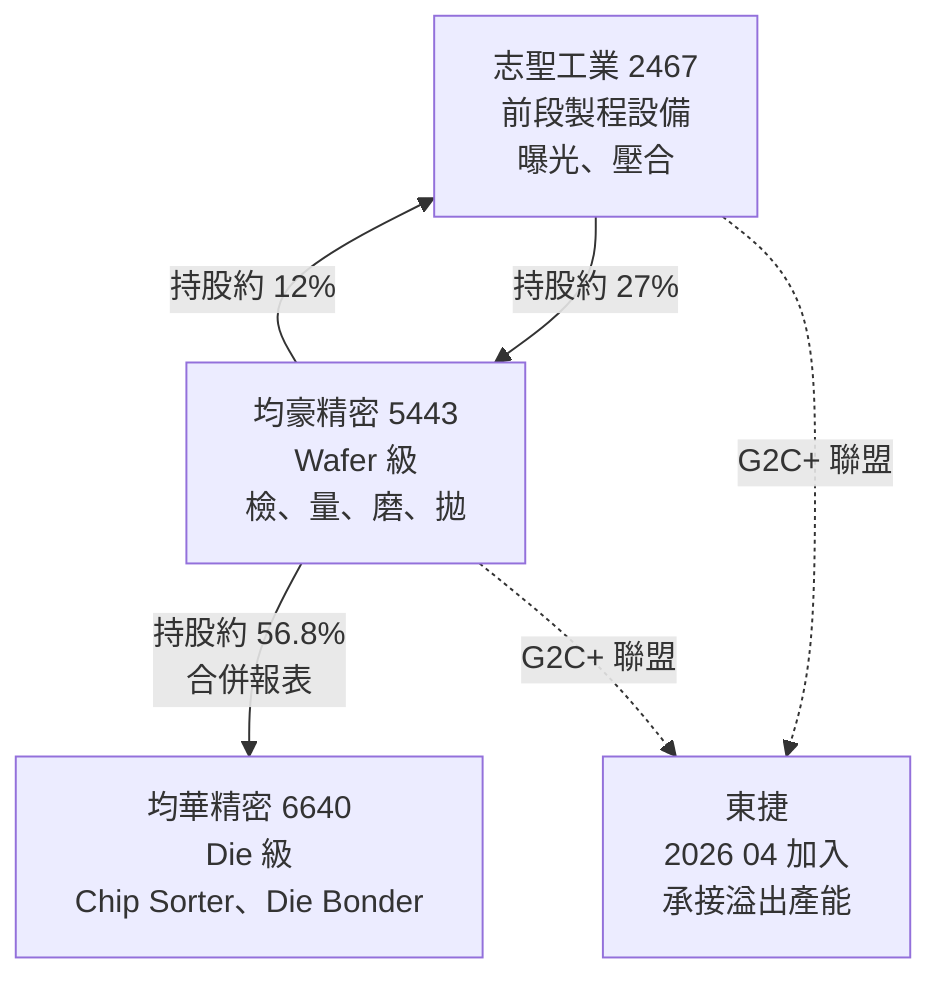
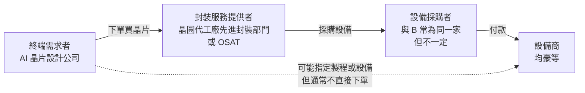

# 第 15 章：均豪的產品與客戶需求地圖

## 開場問題

前面十四章建立了一套推理：從產品需求推到封裝結構，從結構推到製程步驟，從步驟推到缺陷，從缺陷推到量測與設備需求。

現在把最後一段接上：**這些設備需求，哪些能對上均豪的產品？證據到哪裡？**

這一章要抵抗一個非常強的誘惑。誘惑長這樣：

> CoWoS 需要載具檢測 → 均豪做 Carrier AOI → 均豪是 CoWoS 概念股。

三句話都對，合起來卻不成立。因為中間跳過了兩個必須各自舉證的問題：**均豪的 Carrier AOI 賣給誰？那個買主拿去做哪一條產線？**

本章的方法是：先把「設備類別能做什麼」與「均豪已被證實供應什麼」拆成兩張表，最後才允許它們在有證據的地方相接。

---

## 先看結構：四個公司主體，不能混講

這是全書最容易出錯的地方。台灣媒體報導設備業時，經常把集團當成一家公司。

**圖 15-1**：G2C+ 聯盟的持股與分工。實線為持股關係，虛線為聯盟關係。持股比例為公開報導所載，快照日 2026-08-31（G1、G6）。

| 主體 | 代號 | 在聯盟裡做什麼 | 在本書的意義 |
|---|---|---|---|
| **均豪精密** | 5443 | Wafer 級：檢、量、磨、拋 | **本書的主角**。所有「均豪」二字專指此主體 |
| **均華精密** | 6640 | Die 級：Chip Sorter、Die Bonder | 均豪的子公司（持股約 56.8%），**合併報表看得到，但不是均豪的產品** |
| **志聖工業** | 2467 | 前段製程設備（曝光、壓合等） | 交叉持股，非母子關係。**營收完全不併入均豪** |
| **東捷** | — | 2026-04 加入，承接志聖／均華溢出產能 | 聯盟成員，非持股關係 |

!!! danger "三個必須隨時區分的口徑"
    1. **均豪個體 vs 合併（含均華）**：2026 H1「半導體占比 87%」是**合併**數字。個體數字更低。
    2. **均豪產品 vs 集團能力**：Die Bonder、Chip Sorter、Thermo-Compression Die Bonder 是**均華**的產品線。看到年報英文版的開發清單提到這些，不代表均豪本身在做。
    3. **聯盟敘事 vs 個別公司訂單**：G2C+ 聯合法說會上三家一起講，第三方整理（BigGo、Vocus）常把數字混在一篇。引用前要確認是誰在講。

---

## 均豪的公開產品線：檢、量、磨、拋

以下四張表只收**公開來源出現過的**產品與應用。內部專案、未公開的客戶名不列入。

### 檢（光學檢測，AOI）

| 產品 | 檢什麼 | 對應本書章節 | 公開現況 | 證據 |
|---|---|---|---|---|
| **Carrier AOI** | 循環使用的載具（玻璃／矽 carrier）表面缺陷 | [第 4 章](04-workpiece-flow.md)、[第 11 章](11-defect-aoi-metrology.md) | 2026 Q2 進入量產放量；獲「國際封裝大廠」認證 | `[公司自述]` G2、G3 |
| **晶圓外觀光學檢查** | 晶圓表面缺陷 | [第 11 章](11-defect-aoi-metrology.md) | 再生晶圓線的主力之一 | `[公司自述]` G1、G6 |
| **3D NIR 檢測** | TGV／CoWoS 相關的非破壞性內部檢查 | [第 11 章](11-defect-aoi-metrology.md) | 題材階段，媒體報導為主 | `[媒體報導]` G8（理財周刊 2026-06-29） |
| **3D X-ray** | CPO 模組內部缺陷 | [第 11 章](11-defect-aoi-metrology.md) | 國際封裝大廠認證中，**目標 2027 貢獻營收** | `[公司自述]` G2 |

### 量（量測）

| 產品 | 量什麼 | 對應章節 | 公開現況 | 證據 |
|---|---|---|---|---|
| **白光干涉儀（SWLI）** | RDL 平坦度、厚度 | [第 11 章](11-defect-aoi-metrology.md)、[第 12 章](12-grinding-thinning.md) | 國內 OSAT 認可；2026 Q2 進入量產放量；公開講精度 1 μm × 1 μm | `[公司自述]` G2、G3 |
| **3D 檢測** | 高度、共面性 | [第 11 章](11-defect-aoi-metrology.md) | 與 AOI 綁在一起 | `[公司自述]` G1 |

### 磨（研磨、薄化）

| 產品 | 加工對象 | 對應章節 | 公開現況 | 證據 |
|---|---|---|---|---|
| **再生晶圓 CMP** | 再生（reclaim）晶圓 | [第 12 章](12-grinding-thinning.md) | **2025 是放量元年**；研磨拋光曾占半導體營收逾六成 | `[公司自述]` G4、`[媒體報導]` G6 |
| **Strip Grinder** | strip 形態的封裝體（公開用詞另有「晶圓減薄」；**不是**公開證實的元件晶圓背磨／TSV 揭露／HBM 薄化，待查 12-2、P5） | [第 12 章](12-grinding-thinning.md) | 公開產品 | `[公司自述]` G1 |
| **載板方形輪磨** | 高導熱厚銅載板（PMIC 相關） | [第 12 章](12-grinding-thinning.md) | 2026 H1 起成為新成長線 | `[公司自述]` G3 |
| **封裝端條狀研磨** | 封裝完成後的條狀工件 | [第 12 章](12-grinding-thinning.md) | 同上 | `[公司自述]` G3 |
| **晶圓邊緣研磨** | 晶圓邊緣 | [第 12 章](12-grinding-thinning.md) | **驗證中，對標日系**，尚未放量 | `[公司自述]` G1、`[媒體報導]` G6 |
| **8 吋 SiC 全自動 CMP** | SiC 晶圓 | [第 12 章](12-grinding-thinning.md) | 與「矽晶圓大廠」共同開發；宣稱台灣第一家大尺寸自製 | `[媒體報導]` G5 |

### 拋（拋光）

| 產品 | 加工對象 | 公開現況 | 證據 |
|---|---|---|---|
| **再生晶圓拋光** | 再生晶圓 | 與「磨」綁在一起銷售 | `[公司自述]` G1 |
| **先進封裝平整化** | 封裝面 | 同上 | `[公司自述]` G1 |

### 公司揭露、但尚未對上產品的站點

法說講的是**站點**，不是機種。設備類別未公布之前，不列入上面的產品列（待查 3-3）。

| 站點 | 公開現況 | 證據 |
|---|---|---|
| **前段來料檢查** | 2026-08 法說新增揭露；對應[第 4 章](04-workpiece-flow.md)站點 A。是 AOI、量測、還是兩者，公開資料未說明 | `[公司自述]` G3 |

### 尚未成為主力營收的項目

公司自己承認「驗證中／尚未放量」的：

- FOPLP（面板級封裝）設備 `[媒體報導]` G6
- 矽晶圓邊緣研磨 `[媒體報導]` G6
- CPO 用 3D X-ray（目標 2027）`[公司自述]` G2
- 8 吋 SiC 全自動 CMP `[媒體報導]` G5

!!! warning "年報開發清單的口徑陷阱"
    2026 年報英文版列出的 2026 開發項目還包括 **CPO Module Sorter、High-Precision Die Bonder、Thermo-Compression Die Bonder**。這些在分工上比較像**均華**的產品線，只有合併報表才看得到。不要把它們算成均豪本身的產品。`[公司自述]`，口徑待查（見待查 15-7）。

---

## 核心交付：公司主體—設備—站點—客戶—證據矩陣

這是本章的主要成果。**每一列都必須能單獨被查核**；證據等級低的列不因為「聽起來合理」而升級。

| # | 主體 | 設備 | 製程站點（本書章節） | 客戶 | 證據等級 | 來源與日期 |
|---|---|---|---|---|---|---|
| 1 | 均豪 | 再生晶圓 CMP、AOI、拋光 | 再生晶圓產線（[12](12-grinding-thinning.md)） | **昇陽半導體（8028）** | **高但未達雙方公告**：`[公司自述]` ＋客戶端未點名公告（**強推論**） | G1、G6；昇陽半 2025-08-05 設備取得公告 5.51 億（**雙方皆未點名對方**） |
| 2 | 均豪 | AOI | 先進封裝檢測（[11](11-defect-aoi-metrology.md)） | 「**晶圓代工大廠**先進封測廠區」 | **中**：`[媒體報導]` | G5，鉅亨網 2026-04-27。**只講 AOI，不含白光干涉**；媒體未印出公司全名，本書維持未具名 |
| 3 | 均豪 | AOI | 先進封裝檢測（[11](11-defect-aoi-metrology.md)） | **日月光投控（3711）高雄廠** | **中**：`[媒體報導]` | G5，鉅亨網 2026-04-27。同一篇的「部分製程取代 KLA」才是 `[業界消息]`，不連坐到本列 |
| 4 | 均豪 | 白光干涉 | RDL 量測（[11](11-defect-aoi-metrology.md)） | 「**國內 OSAT**」 | **中**：`[公司自述]` | G2 法說；未具名。**不要與第 7 列 Carrier AOI 合併** |
| 5 | 均豪 | 高階載板研磨 | 載板厚銅研磨（[12](12-grinding-thinning.md)） | 「**歐美 PMIC 廠**」 | **中**：`[公司自述]` | G3，2026-08-12 法說。擴產地在馬來西亞、德國；**後段封裝仍在台灣** |
| 6 | 均豪 | 3D X-ray | CPO 模組內部檢測（[11](11-defect-aoi-metrology.md)） | 「**國際封裝大廠**」 | **低至中**：`[公司自述]`，認證階段 | G2；目標 2027 貢獻營收 |
| 7 | 均豪 | Carrier AOI | 載具檢測（[4](04-workpiece-flow.md)） | 「**國際封裝大廠**」 | **中**：`[公司自述]`，已認證並量產 | G2，2026-06-12 法說 |
| 8 | 均豪 | 8 吋 SiC 全自動 CMP | SiC 晶圓平坦化（[12](12-grinding-thinning.md)） | 「**矽晶圓大廠**」 | **低至中**：`[媒體報導]`，開發中 | G5 |
| 9 | 均華（**非均豪**） | Die Bonder、Chip Sorter | Die 級接合與分選（[9](09-soic-hybrid-bonding.md)） | 未於本書引用之來源具名 | — | G3；2026 H1 營收 16.5 億、年增 41%，Bonder 占比已超過 Sorter |
| 10 | 志聖（**非均豪**） | 曝光、壓合 | 前段製程 | 未於本書引用之來源具名 | — | G1；聯盟成員，營收不併入均豪 |

### 這張矩陣怎麼用

1. **從右往左讀**：先看證據等級。等級「低」的列，不能拿來支撐任何營收推估。
2. **不要跨列合併**：第 2 列與第 7 列都提到「大廠」，但一個是媒體寫的「晶圓代工大廠」，一個是公司自己講的「國際封裝大廠」——**沒有任何公開證據說它們是同一家**。
3. **第 4 列與第 7 列也不要合併**：一個是白光干涉 ×「國內 OSAT」，一個是 Carrier AOI ×「國際封裝大廠」。產品不同、未具名對象不同。
4. **第 9、10 列存在的目的是排除**：看到 Die Bonder 相關新聞時，先確認那是均華不是均豪。

!!! note "為什麼第 1 列仍是全書最硬的一條（卻還不到雙方公告）"
    因為它是唯一有**雙向可對帳基礎**的關係：均豪公開講再生晶圓是主力，昇陽半也有設備取得公告，而且均豪是昇陽半的最大法人股東。即使如此，昇陽半 2025-08-05 那筆 5.51 億的設備取得公告**並未點名供應商**，均豪自己的公告也未點名昇陽半——市場解讀與均豪有關，但這一步仍是強推論，**不是** `[雙方公告]`。

---

## 三種角色：誰買設備、誰做封裝、誰要產品

分析設備需求時，最常見的混淆是把「誰需要這個技術」當成「誰會買這台機器」。這三者經常不是同一家。

**圖 15-2**：需求、服務與採購三種角色的金流方向。虛線代表「有影響力但沒有金流」的關係——終端客戶可能指定製程規格，卻不會直接向設備商下單。

| 角色 | 誰 | 對設備商的意義 |
|---|---|---|
| **終端需求者** | AI 晶片設計公司、系統廠 | 決定技術路線與量。但**通常不是設備的付款方** |
| **封裝服務提供者** | 晶圓代工廠的先進封裝廠區、OSAT | 決定用哪些站點、什麼規格 |
| **設備採購者** | 多半同上，但擴產專案可能由客戶出資 | **真正的訂單來源** |

**判斷練習**：新聞寫「某 AI 巨頭擴大 CoWoS 訂單」，這不直接等於設備訂單。要問的是：擴的產能由誰蓋？蓋在哪個廠？那個廠的既有設備供應商是誰？新產線是複製既有機種還是重新驗證？——這正是[第 14 章](14-yield-capacity-capex.md)「送樣→驗證→量產→複製訂單」四階段的用處。

---

## 失敗會長什麼樣子：五種常見誤判

| 誤判 | 例子 | 為什麼錯 | 正確做法 |
|---|---|---|---|
| **能力等於供應** | 「均豪做 AOI，CoWoS 需要 AOI，所以均豪供應 CoWoS」 | 跳過了「賣給誰、用在哪條線」 | 回矩陣查有沒有對應列 |
| **合併當個體** | 用合併半導體占比 87% 描述均豪本身的轉型程度 | 87% 含均華 | 標明口徑 |
| **未具名補實名** | 把「晶圓代工大廠」寫成台積電 | 媒體刻意未具名 | 全書維持未具名 |
| **認證當放量** | 「獲國際封裝大廠認證」讀成「已貢獻營收」 | 認證到放量有時間差 | 見下節 |
| **研磨線完整＝先進封裝薄化受惠** | 「均豪研磨產品最多，所以吃到 CoWoS／HBM 背磨」 | 公開放量的「磨」在再生晶圓與載板／封裝端；元件晶圓背磨、TSV 揭露、HBM 極薄化**沒有對應產品** | 見[第 12 章](12-grinding-thinning.md)與待查 P5 |

### 認證、驗證、放量的差別

均豪自己的公開說法就展示了這條時間軸：

| 產品 | 2026 年狀態 | 用詞 |
|---|---|---|
| Carrier AOI | 認證並**量產放量**，開始認列 | 已到營收階段 |
| 白光干涉 | 國內 OSAT **認可**，Q2 進入量產放量 | 剛到營收階段 |
| 3D X-ray | 國際封裝大廠**認證中**，目標 2027 | 尚未到營收階段 |
| 矽晶圓邊緣研磨 | **驗證中** | 尚未到營收階段 |

`[公司自述]`，來源 G2、G3。**「認證」與「認列營收」之間隔著一整個驗證與擴產週期**，這在設備業是常態，不是壞消息，但也不能提前計入。

---

## 一個公開的反例：2026 上半年發生了什麼

均豪 2026 年的公開數字本身就是「產品組合轉換有代價」的教材。

| 指標 | 數字 | 意義 |
|---|---|---|
| 2026 前 6 月累計營收年增 | **+1.3%** | 幾乎持平 |
| 2026 年 7 月單月 | 8.37 億，年增 **+165.6%** | 一筆把前 7 月拉到 +22.4% |
| 2026 Q2 合併營益率 | **1.9%** | 本業幾乎沒賺 |
| 2026 Q2 稅前純益率 | 21% | 主因業外 1.66 億 |

`[公司自述]` ＋ `[媒體報導]`，來源 G7。

**怎麼讀這組數字**（分成三段，見[第 16 章](16-reading-news.md)的模板）：

- **事實**：上半年本業營益率很低；7 月單月營收創高；業外貢獻大。
- **推論**：舊現金流（昇陽半 CMP）在客戶新廠興建期間出貨淡化，新產品（AOI、白光）Q2 才開始認列，中間有空窗。`[推論]`
- **未知**：7 月那筆高營收的產品組合為何？空窗是一次性還是結構性？

**會推翻「轉換順利」判斷的觀察**：如果 2026 下半年單月營收回落到上半年水準，且營益率沒有回升，就代表新產品放量不如法說預期。

---

## 與均豪的連結（本章即為此主題，改列限制）

本章通篇在談均豪，因此這一節改為列出**本章不能做到的事**：

### ❓ 本章的證據上限

1. **本書無法判斷均豪設備進入的是 CoWoS 的哪一個子平台**（S／R／L）。公開資料沒有這個層級的揭露。
2. **本書無法量化任一客戶的營收貢獻**，除了「再生晶圓／研磨拋光曾占半導體營收逾六成」這一句媒體轉述（G6）。
3. **本書無法驗證「部分製程取代 KLA」**。這是 `[業界消息]`（G5），是本章所有主張中證據最弱的一條，卻是市場敘事中最大膽的一句。
4. **快照日限制**：所有 G 系列資料的時效上限為 **2026-08-31**。
5. **公開產品線沒有晶圓級薄化**（元件晶圓背磨、中介層 TSV 揭露、HBM 極薄化）。磨表的 Strip Grinder 不能讀成這三站。見[第 12 章](12-grinding-thinning.md)、待查 P5。

---

## 理解檢查

???+ question "Q1：某報導寫「G2C 聯盟拿下先進封裝大單」。要判斷均豪（5443）能分到多少，你需要先問什麼？"
    **先問是誰拿的。** G2C+ 有四個主體，其中只有均華併入均豪的合併報表（持股約 56.8%），志聖與東捷不併入。

    所以：
    - 若是志聖拿的 → 對均豪的損益幾乎沒有直接影響（僅有約 12% 交叉持股的投資評價）。
    - 若是均華拿的 → 進合併營收，但**歸屬母公司的部分要扣掉非控制權益**。
    - 若是均豪拿的 → 才是均豪本身的設備營收。

    附帶提醒：2026 Q1 觀測站稅後 0.93 億、歸母自結只有 0.31 億（G7），差距就是這個機制造成的。

???+ question "Q2：「均豪 AOI 打進晶圓代工大廠先進封測廠區」——這句話的證據等級是什麼？可以寫成台積電嗎？"
    等級是 **`[媒體報導]`**（G5，鉅亨網 2026-04-27）。

    **不可以寫成台積電。** 台灣媒體慣用「晶圓代工大廠」指涉台積電，但均豪的稿件極少直接印出三個字，而公司本身也未證實。把慣例推論寫成事實，就是把 `[媒體報導]` 偷偷升級成 `[雙方公告]`。

    正確寫法：維持未具名，並在待查清單中列出「是否有雙方公告或年報揭露可將此關係升級」。

???+ question "Q3：均豪 2026 H1 半導體營收占比 87%。用這個數字說「均豪已經完成半導體轉型」有什麼問題？"
    兩個問題：

    1. **口徑**：87% 是**合併**數字，含均華。均華做 Die 級分選與接合，營收併入合併報表，會把合併的半導體占比拉高。均豪個體的數字更低。公開來源沒有給出一個可引用的「均華先進封裝占比」精確值，本書不填。
    2. **占比不等於獲利品質**：同一期間（2026 Q2）合併營益率只有 1.9%，稅前靠業外 1.66 億撐起來。營收結構轉了，本業獲利能力當季並沒有同步兌現。

    正確說法：合併口徑下的半導體營收占比已達 87%，但個體占比與本業獲利率需分開檢視。

???+ question "Q4：均豪說「Carrier AOI 已獲國際封裝大廠認證並量產」，另一則媒體說「AOI 打進晶圓代工大廠先進封測廠區」。可以合併成「均豪的 Carrier AOI 賣進台積電先進封裝廠」嗎？"
    **不可以，這句話犯了三個錯：**

    1. **跨來源合併未具名對象**：「國際封裝大廠」（公司自述）與「晶圓代工大廠」（媒體）沒有任何公開證據顯示是同一家。
    2. **未具名補實名**：把「晶圓代工大廠」寫成台積電。
    3. **產品混用**：媒體那則講的是「AOI」，公司那則講的是「Carrier AOI」，兩者是否為同一機種未經證實。

    這是本章矩陣「不要跨列合併」規則要防的典型錯誤。

???+ question "Q5：若你想把矩陣中某一列的證據等級從 `[媒體報導]` 升級到 `[雙方公告]`，你會去找什麼？"
    找**交易雙方各自的正式揭露**，並且要能對帳：

    - 均豪的公開資訊觀測站重大訊息（是否有取得／處分資產、重大合約公告）
    - 客戶端的設備取得公告（金額、期間）
    - 雙方年報中的主要客戶／供應商揭露（通常只列占比達門檻者，且常以代號表示）
    - 法說簡報中具名的合作案

    注意：即使找到金額吻合的兩份公告，若雙方都未點名對方（如昇陽半 2025-08-05 那筆），仍只是強推論，不是 `[雙方公告]`。

---

## 來源與待查事項

### 本章來源

| 主張 | 來源 | 等級 | 日期 |
|---|---|---|---|
| 四主體分工與持股 | G1、G6 | `[公司自述]` ＋ `[媒體報導]` | 2026-08-31 快照；志聖持均豪約 27%、均豪持志聖約 12%、均豪持均華約 56.8% |
| 檢量磨拋產品線 | G1、G2、G3、G6 | `[公司自述]` 為主 | 2026-03／06／08 法說 |
| 昇陽半關係 | G1、G6 ＋ 昇陽半 2025-08-05 公告 | `[公司自述]` ＋強推論；**未達** `[雙方公告]` | 2025-08／2026-01 |
| AOI 進入未具名大廠與日月光高雄廠 | G5 | `[媒體報導]` | 2026-04-27 |
| 「部分製程取代 KLA」 | G5 | `[業界消息]` | 2026-04-27 |
| 白光干涉 × 國內 OSAT | G2 | `[公司自述]` | 2026-06-12 |
| Carrier AOI × 國際封裝大廠 | G2、G3 | `[公司自述]` | 2026-06／08 法說 |
| 3D NIR／TGV 題材 | G8 | `[媒體報導]` | 2026-06-29 |
| 前段來料檢查（站點，非產品） | G3 | `[公司自述]` | 2026-08-12 |
| PMIC 載板研磨 | G3 | `[公司自述]` | 2026-08-12 |
| 出貨套數 162／485 | G5 | `[媒體報導]`，個體口徑 | 2026-04-27 |
| 均華 2026 H1 營收 16.5 億、年增 41% | G3 | `[公司自述]`，**均華數字** | 2026-08-12 |
| 2026 財務數字 | G7 | `[公司自述]` ＋ `[媒體報導]` | 2026-01 至 2026-08；含 Q1 觀測站稅後 0.93 億／歸母自結 0.31 億；Q2 合併營收 11.44 億、毛利率 35.4%、營益率 1.9%、業外 1.66 億 |

各代號定義見[附錄 A 來源索引](appendix-sources.md)。

### 待查事項

| # | 問題 | 為什麼重要 | 會怎麼查 |
|---|---|---|---|
| 15-1 | 「晶圓代工大廠先進封測廠區」與「國際封裝大廠」是否為同一家？ | 決定矩陣第 2、6、7 列能否合併 | 年報主要客戶揭露、雙方公告 |
| 15-2 | 均豪設備對應的是 CoWoS 的哪一個子平台？ | 決定能否從 CoWoS 擴產新聞推導均豪需求 | 法說 Q&A、展場技術資料 |
| 15-3 | 2026 年報英文版的「714 套」口徑為何？是否含均華？ | 與 G5 的 485 套衝突，兩者不可混用（**P3**，同 14-5） | 年報英文版原文定義段落 |
| 15-4 | 「部分製程取代 KLA」有無任何可查核依據？ | 本章證據最弱、市場影響最大的一句 | 客戶端揭露、KLA 財報中的競爭敘述 |
| 15-5 | 昇陽半 2025-08-05 的 5.51 億設備取得，供應商是否曾被任一方具名？ | 決定矩陣第 1 列能否標為 `[雙方公告]` | 兩家的公開資訊觀測站歷史公告 |
| 15-6 | 2026 下半年營收與營益率走勢 | 直接檢驗「產品組合轉換順利」的推論 | 月營收公告、Q3／Q4 財報 |
| 15-7 | 年報英文版開發清單（Die Bonder、CPO Module Sorter 等）的主體是均豪還是均華？ | 與待查 8-5 同源。**不是**套數口徑題 | 年報英文版原文定義段落 |

---

> 下一頁：[第 16 章 如何讀懂一則先進封裝消息](16-reading-news.md)　｜　相關頁面：[第 11 章 缺陷、AOI 與量測](11-defect-aoi-metrology.md) ｜ [第 12 章 研磨、薄化與表面品質](12-grinding-thinning.md) ｜ [第 14 章 良率、產能與設備採購](14-yield-capacity-capex.md) ｜ [附錄 A 來源索引](appendix-sources.md)
