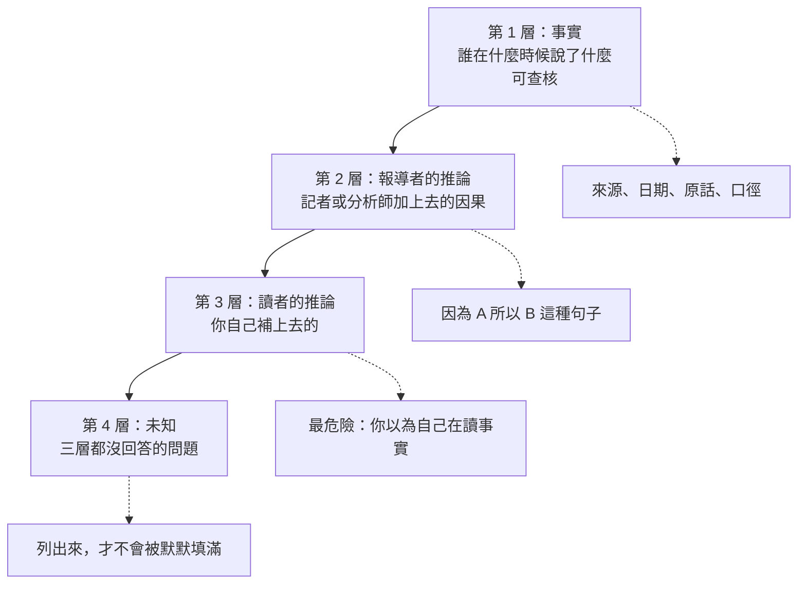
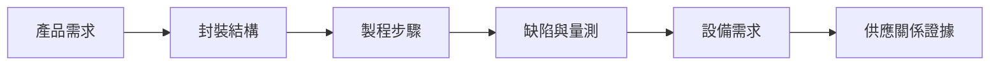

# 第 16 章：如何讀懂一則先進封裝消息？

## 開場問題

2026 年 4 月 27 日，鉅亨網刊出一則報導，大意是：

> 均豪 AOI 打進晶圓代工大廠先進封測廠區與日月光高雄廠，部分製程取代美商科磊（KLA）。2026 年個體半導體設備出貨估 485 套，2025 年估 162 套。

這一則裡有多少事實、多少推論、多少純粹的未知？

如果你的答案是「看起來都是事實，因為都有數字」，這一章就是為你寫的。**這則報導裡至少有四個不同的證據等級混在同一段文字裡**，而它們會導向完全不同的判斷。

前面十五章建立了推理鏈的每一段。這一章把它變成一個**可以重複執行的動作**。

---

## 先看結構：一則消息的四個層次

任何一則設備或封裝的消息，都可以拆成四層。**混層是所有誤判的來源。**



**圖 16-1**：一則消息的四層結構。第 3 層最危險，因為它在讀的當下感覺不出來——你以為自己在複述報導，其實在複述自己的補完。

### 四種消息類型，意義完全不同

新聞常用同一種語氣報導四種本質不同的事件。對設備需求而言，它們的意義差很多：

| 類型 | 典型措辭 | 對設備需求的意義 | 時間差 |
|---|---|---|---|
| **送樣／認證** | 「獲某大廠認證」「通過驗證」 | **尚未產生營收**。證明技術可行，不證明有訂單 | 到放量常以季甚至年計 |
| **驗證中** | 「客戶端驗證」「導入中」 | 同上，且**可能失敗** | 不確定 |
| **量產／出貨** | 「進入量產放量」「開始認列」 | 已經或即將產生營收 | 當期至次期 |
| **擴產** | 「產能翻倍」「新廠投產」 | **不等比例**轉成設備訂單（見[第 14 章](14-yield-capacity-capex.md)） | 依建廠週期，常一年以上 |

!!! warning "最常見的偷換"
    把「獲認證」讀成「已出貨」。均豪自己的公開說法就同時存在這四種狀態的產品（見[第 15 章](15-gpm-product-map.md)的認證／驗證／放量對照表），混讀會嚴重高估當期營收。

---

## 逐步操作：消息分析模板

以下是可重複使用的六步驟。建議實際照著填，不要在腦中跳步。

### 步驟 1：鎖定來源與日期

| 要填 | 為什麼 |
|---|---|
| 原始出處（媒體名／法說／公告） | 決定證據等級 |
| 發布日期 | 決定時效 |
| 是誰在說（公司／記者／未具名消息來源／法人） | 決定可信度 |
| 主體是誰（均豪／均華／志聖／聯盟） | **最常出錯的一格** |

### 步驟 2：拆出「事實」

只保留**可以回去查核**的句子。判準：如果這句話錯了，有人可以拿文件反駁。

- ✅「均豪 2026 年 7 月合併營收 8.37 億元」——可查公告
- ❌「均豪展現強勁動能」——不可查核

### 步驟 3：分類消息類型

用上表的四類歸位。**歸不進去的，多半是敘事而非事件。**

### 步驟 4：走技術推理鏈

這是前十四章的用處。依序問：



**圖 16-2**：本書的六段推理鏈。每一段都可能斷掉；斷在哪裡，就是這則消息的資訊上限。

| 段 | 要問的問題 | 對應章節 |
|---|---|---|
| 產品需求 | 這個產品為什麼需要先進封裝？ | [第 1 章](01-why-advanced-packaging.md) |
| 封裝結構 | 是哪一層結構、哪一個製程平台、哪一個商標？ | [第 2 章](02-packaging-taxonomy.md) |
| 製程步驟 | 加工對象是什麼形態？經過哪些站點？ | [第 4 章](04-workpiece-flow.md)、[5](05-fan-out.md)–[10](10-emib-bridge.md) |
| 缺陷與量測 | 這個站點會出什麼問題？要怎麼檢查？ | [第 11 章](11-defect-aoi-metrology.md) |
| 設備需求 | 需要哪一類設備？需求會等比例增加嗎？ | [第 12](12-grinding-thinning.md)–[14 章](14-yield-capacity-capex.md) |
| 供應關係證據 | 有沒有證據說某家公司供應了這個站點？ | [第 15 章](15-gpm-product-map.md) |

### 步驟 5：列出未知

**沒有寫下來的未知，會被你的直覺默默填滿。** 這一步不能省。

### 步驟 6：寫下會推翻判斷的證據

這是整個模板的靈魂。如果你想不出任何一件事能推翻你的判斷，那你得到的不是判斷，是立場。

---

## 八個完整案例

以下案例全部取自 Obsidian 筆記整理的公開消息，快照日 **2026-08-31**，來源代號見[附錄 A](appendix-sources.md)。

**兩類不要混讀：** 案例 1、2、4、6 走六段技術鏈；案例 3、5、7、8 是口徑／財務拆解，不適用技術鏈。

---

### 案例 1：AOI 打進未具名大廠（G5，2026-04-27）

**原始說法**：均豪 AOI 打進「晶圓代工大廠先進封測廠區」與日月光高雄廠，「部分製程取代美商科磊（KLA）」；2026 個體半導體設備出貨估 485 套，2025 估 162 套。

| 層次 | 內容 |
|---|---|
| **事實** | 鉅亨網於 2026-04-27 刊出上述內容。出貨套數為報導所載之估計值，口徑為**個體、不含均華**。 |
| **報導者推論** | 「部分製程取代 KLA」——這句在原文中來自**未具名業界消息**，不是公司公告。 |
| **常見讀者推論（要擋掉）** | ①「晶圓代工大廠」＝台積電；②「打進」＝已大量出貨；③「取代 KLA」＝均豪在檢測市場全面替代國際大廠。**三個都沒有依據。** |
| **未知** | 進入的是哪一個站點？是哪一種 AOI 機種？出貨金額多少？「取代」是指同一站點的替換，還是新增站點？ |
| **消息類型** | 混合：「打進」偏出貨，「取代」偏敘事 |
| **證據等級** | `[媒體報導]`，其中「取代 KLA」為 `[業界消息]`（全書最弱的一條） |
| **會推翻的證據** | 若後續財報顯示 AOI 相關營收未如期成長；若客戶端揭露的供應商名單中沒有均豪；若 KLA 在同期財報中未見對應市占損失 |

**技術推理鏈走到哪裡斷掉**：斷在「製程步驟」。報導沒說是哪個站點，所以無法往下推設備類型與需求量。

---

### 案例 2：Carrier AOI 獲認證並量產（G2，2026-06-12 法說）

**原始說法**：Carrier AOI 獲國際封裝大廠認證並量產。

| 層次 | 內容 |
|---|---|
| **事實** | 公司在 2026-06-12 法說會上如此表述。`[公司自述]` |
| **技術推理鏈** | 載具（carrier）是先進封裝中**循環使用**的支撐工件（見[第 4 章](04-workpiece-flow.md)）→ 每次循環都可能累積刮傷、殘膠、破損 → 載具帶著缺陷進線會污染整批工件 → 需要在循環回線前檢測 → Carrier AOI。**這條鏈是完整的，技術需求成立。** |
| **但供應關係證據到哪** | 只到「某國際封裝大廠」。是誰、幾台、多少金額，都未揭露。 |
| **未知** | 這家「國際封裝大廠」與案例 1 的「晶圓代工大廠」是否為同一家？（[第 15 章](15-gpm-product-map.md)待查 15-1） |
| **消息類型** | 認證 ＋ 量產（已到營收階段） |
| **會推翻的證據** | 若後續季度未見對應營收認列 |

**這個案例示範了一件重要的事**：技術推理鏈可以完整成立，供應關係卻仍然只有中等證據。**兩者是獨立的。**

---

### 案例 3：7 月營收 8.37 億、年增 166%（G7，2026-08-10）

| 層次 | 內容 |
|---|---|
| **事實** | 2026 年 7 月合併營收 8.37 億元，年增 165.61%、月增 79.53%；前 7 月累計 30.09 億、年增 22.38%。 |
| **要立刻補上的脈絡** | 同一年的 1 月月減 51.5%、5 月月減 39.5%（G7）。**設備業單月營收本來就大幅波動**，因為認列與出貨綁在一起。 |
| **讀者最容易犯的錯** | 用 7 月年化。8.37 × 12 = 100 億，遠超公司任何公開規模。 |
| **更有訊息量的問題** | 上半年累計年增只有 **+1.3%**，7 月一筆就把前 7 月拉到 +22.4%。**所以真正的問題是：這是遞延出貨的一次性認列，還是新產品放量的起點？** |
| **未知** | 7 月營收的產品組合（研磨？AOI？PMIC 相關？）；是否含均華比重變化 |
| **消息類型** | 出貨／認列 |
| **會推翻「放量起點」判斷的證據** | 若 8、9 月回落到 3–4 億水準，則 7 月是一次性；若維持在 6 億以上，才支持結構性成長 |

**技術推理鏈**：本則是口徑／財務案例，不走六段技術鏈——單月營收沒有製程步驟可推。

---

### 案例 4：PMIC 從 1% 跳到 19%（G3，2026-08-12 法說）

**原始說法**：PMIC 占母公司半導體營收從 2025 年的 1% 升至 2026 H1 的 19%，在手訂單占 12%。

| 層次 | 內容 |
|---|---|
| **事實** | 公司自述，口徑明確標為**母公司半導體營收**（不是合併、不是全公司）。`[公司自述]` |
| **技術推理鏈** | GPU 功耗持續上升（法說引用 2025 年 1,400W → 2027 年估 3,600W）→ 供電走高壓低電流 → 電源管理需要**高導熱厚銅載板** → 厚銅載板需要大面積方形輪磨；封裝完成後需要條狀研磨 → 對應均豪「磨」的產品線。**鏈是完整的。** |
| **這個案例的價值** | 它示範了一條**與 CoWoS 無關**的成長線。市場敘事集中在先進封裝，但 2026 H1 實際貢獻最快的是 PMIC。**單一敘事會漏掉真正在動的東西。** |
| **未知** | 「歐美 PMIC 廠」是誰；19% 的絕對金額；在手訂單 12% 的交付期間 |
| **消息類型** | 出貨／認列（已在營收裡） |
| **會推翻的證據** | 若在手訂單占比在後續季度下滑，代表這是一波性專案而非持續需求 |

---

### 案例 5：昇陽半取得設備 5.51 億（2025-08-05 昇陽半公告）

| 層次 | 內容 |
|---|---|
| **事實** | 昇陽半導體（8028）公告 2024-10-04 至 2025-08-05 期間取得機器設備一批，金額 5.51 億元。**公告未點名供應商。** |
| **市場推論** | 與均豪出貨有關。理由：均豪公開表示再生晶圓 CMP／AOI 是半導體營收主力，且是昇陽半最大法人股東。 |
| **證據等級** | 這是**強推論**，不是 `[雙方公告]`。均豪自己的公告未點名昇陽半。 |
| **未知** | 5.51 億中有多少來自均豪；機種組合為何 |
| **消息類型** | 出貨 |
| **會推翻的證據** | 若期間內有其他設備商公告對昇陽半的大額出貨 |

**技術推理鏈**：本則是證據等級演練，不走六段技術鏈。再生晶圓產線見[第 12 章](12-grinding-thinning.md)；斷在「雙方是否點名」。

**這個案例示範**：即使雙方關係公開、金額吻合、方向合理，**只要沒有任一方點名對方，就不能標成最高等級**。這是全書證據紀律最具體的一次演練。

---

### 案例 6：CoWoS 月產能 1.3 萬 → 20 萬片（G3 法說引用）

| 層次 | 內容 |
|---|---|
| **事實** | 均豪在法說簡報中**引用**此市場數字（2023 年約 1.3 萬片／月 → 2027 年約 20 萬片／月）。 |
| **關鍵區分** | 這是**市場數字，不是均豪的營收**。公司引用它是為了說明市場方向，不構成任何均豪的業績指引。 |
| **技術推理鏈的斷點** | ① 這 20 萬片是 CoWoS-S、R 還是 L？（[第 2 章](02-packaging-taxonomy.md)：家族當單品的錯誤）② 產能增加不等於設備訂單等比例增加（[第 14 章](14-yield-capacity-capex.md)：瓶頸站點、稼動率提升、既有設備複用都會吸收需求）③ 即使有設備訂單，也未證明由誰供應。**三個斷點，任何一個都足以讓推論失效。** |
| **消息類型** | 擴產（市場層級） |
| **會推翻的證據** | 產能規劃本身即為預估，隨市場修正 |

---

### 案例 7：出貨套數 162 → 485 套（G5，2026-04-27）

| 層次 | 內容 |
|---|---|
| **事實** | 媒體報導所載的公司預估：2026 年個體半導體製程設備出貨約 485 套，2025 年約 162 套。 |
| **口徑衝突（未解）** | 2026 年報英文版另有一組數字：半導體製程設備 714 套、顯示器 14 套。**口徑不明**，可能含均華或採不同產品定義。 |
| **必須做的事** | **兩組數字不可混用，也不可相減。** 在口徑釐清前，只能各自標註來源。 |
| **另一個陷阱** | 套數不等於金額。不同機種單價差距可能很大，套數成長 3 倍不代表營收成長 3 倍。 |
| **未知** | 「套」的定義；機種組合與單價分布 |
| **會推翻的證據** | 若 2026 全年營收成長幅度遠低於套數成長，代表機種組合往低單價傾斜 |

**技術推理鏈**：本則是口徑案例，不走六段技術鏈。斷在「套的定義未明」（待查 16-4／P3）。

---

### 案例 8：Q2 營益率 1.9%，稅前純益率 21%（G7）

| 層次 | 內容 |
|---|---|
| **事實** | 2026 Q2 合併營收 11.44 億、毛利率 35.4%、**營業利益率 1.9%**；稅前純益率約 21%，主因業外收益 1.66 億。 |
| **推論** | 毛利率不低但營益率極低 → 費用（研發、管銷）吃掉本業獲利；同期公司正在多條新產品線驗證與擴產。`[推論]` |
| **這則消息與設備分析的關係** | 它提醒讀者：**營收占比轉型成功，不等於本業獲利能力已經兌現。** 新產品在驗證與導入期會先產生費用、後產生營收。 |
| **未知** | 業外 1.66 億的組成；費用中有多少是一次性 |
| **會推翻「這是轉型陣痛」判斷的證據** | 若營益率在後續兩個季度未回升，就不是陣痛而是結構問題 |

**技術推理鏈**：本則是獲利結構案例，不走六段技術鏈。它檢驗的是「營收轉型 ≠ 本業獲利已兌現」。

---

## 失敗會長什麼樣子：七種可預期的誤讀

| 誤讀 | 典型句子 | 在哪一章被擋掉 |
|---|---|---|
| **家族當單品** | 「CoWoS 擴產所以所有相關設備商受惠」 | [第 2 章](02-packaging-taxonomy.md) |
| **主體混淆** | 用聯盟或子公司的成績描述均豪 | [第 15 章](15-gpm-product-map.md) |
| **口徑混用** | 合併數字當個體、套數當金額 | [第 15 章](15-gpm-product-map.md)、本章案例 7 |
| **認證當放量** | 「獲認證」讀成「已貢獻營收」 | [第 15 章](15-gpm-product-map.md) |
| **擴產等比例** | 「產能翻倍所以設備訂單翻倍」 | [第 14 章](14-yield-capacity-capex.md) |
| **未具名補實名** | 把「晶圓代工大廠」寫成特定公司 | 全書 |
| **研磨線完整＝先進封裝薄化受惠** | 「均豪研磨產品最多，所以吃到背磨／HBM 薄化」 | [第 12 章](12-grinding-thinning.md)、[第 15 章](15-gpm-product-map.md) |

---

## 如何檢查與控制：一頁式檢核表

把這張表存起來，每讀一則消息填一次。

```text
【消息分析卡】
出處：____________  日期：________  說話者：____________
主體：□均豪(5443) □均華(6640) □志聖(2467) □東捷 □聯盟 □其他

1. 事實（可查核的句子）：
   -
2. 消息類型：□送樣/認證 □驗證中 □量產/出貨 □擴產 □敘事
3. 技術推理鏈走到哪裡斷掉：
   產品需求 → 封裝結構 → 製程步驟 → 缺陷與量測 → 設備需求 → 供應關係
   斷點在：____________ 原因：____________
4. 證據等級：□雙方公告 □公司自述 □媒體報導 □業界消息 □推論 □未證實
5. 口徑檢查：□合併/個體已確認 □套數vs金額已區分 □世代/子平台已確認
6. 未知（至少列三項）：
   -
7. 會推翻此判斷的觀察：
   -
```

---

## 與均豪的連結

本章通篇以均豪的公開消息為練習材料，因此這一節改列**本章的方法論限制**：

### ✅ 已確認事實

- 八個案例的原始說法均出自[附錄 A](appendix-sources.md) 所列來源，快照日 2026-08-31。

### 🔶 合理推論

- 本章的四層拆解與六步驟模板是**本書自建的分析框架**，不是產業標準方法。它的價值在於強迫顯性化，不在於權威性。`[推論]`

### ❓ 尚待查證

- 所有案例的「會推翻的證據」欄位都指向 2026 年 8 月之後的資料，本書無法驗證。**讀者應自行以更新的資料重跑一次模板。**

---

## 理解檢查

???+ question "Q1：一則新聞說「某封裝大廠 CoWoS 產能 2027 年將達每月 20 萬片」。要把這句話轉成某設備商的營收推估，中間至少要補幾個環節？"
    至少四個，任一個缺失都讓推估失效：

    1. **子平台**：S／R／L 的站點不同，設備需求結構不同（[第 2 章](02-packaging-taxonomy.md)）。
    2. **瓶頸站點**：新增產能主要卡在哪一站？非瓶頸站點的設備不需等比例增加（[第 14 章](14-yield-capacity-capex.md)）。
    3. **既有產能的吸收**：稼動率提升、重工減少、良率改善都能在不買設備的情況下增加產出。
    4. **供應關係證據**：即使確定需要 N 台某類設備，也沒有任何證據說由誰供應（[第 15 章](15-gpm-product-map.md)）。

    結論：這則新聞能支持「市場方向向上」，不能支持任何單一公司的營收數字。

???+ question "Q2：「均豪 7 月營收年增 166%」與「均豪上半年累計營收年增 1.3%」，哪一個更有資訊量？"
    **後者。**

    單月年增 166% 主要反映的是設備業的認列時點——出貨集中在某個月，去年同期基期又低。累計數字才反映真實的業務量變化。

    更完整的讀法是把兩者並列：上半年幾乎持平、7 月一筆拉高，這個形狀本身就是問題的來源——它可能是遞延認列的一次性補回，也可能是新產品放量的起點。**要區分這兩種解釋，得看 8、9 月是否維持。**

???+ question "Q3：如果你想把「均豪供應某晶圓代工大廠的先進封裝檢測設備」從 `[媒體報導]` 升級到 `[雙方公告]`，你會去找什麼？找不到的話該怎麼寫？"
    會去找：
    - 均豪在公開資訊觀測站的重大訊息（重大合約、取得或處分資產）
    - 客戶端的設備取得公告，且金額與期間能對上
    - 任一方年報中的主要客戶／供應商揭露
    - 法說簡報中具名的合作案

    **找不到就維持 `[媒體報導]`，並在待查清單中列出來。** 不可以因為「合理」「大家都這麼說」而升級。案例 5（昇陽半 5.51 億）示範了即使方向與金額都吻合、雙方關係公開，只要沒有點名，仍只能標成強推論。

???+ question "Q4：某則消息說「均華 Bonder 訂單能見度到 2027 Q3」。這對均豪（5443）的投資判斷有什麼影響？請說明機制。"
    有影響，但**不是直接的營收影響**，機制要說清楚：

    - 均豪持有均華約 56.8%，均華營收**併入**均豪的合併報表 → 合併營收與毛利會反映。
    - 但淨利要扣掉**非控制權益**。2026 Q1 的例子：觀測站稅後 0.93 億，歸屬母公司自結只有 0.31 億（G7）。
    - 均華的成績**不代表均豪本身設備賣得好**。均豪的 Wafer 級檢量磨拋要另外看。

    所以正確寫法是：這則消息支撐合併營收，但要看均豪股東分到多少，得用歸屬母公司的數字；要看均豪本身的產品競爭力，這則消息幾乎沒有資訊。

???+ question "Q5：本章的模板要求列出「會推翻判斷的證據」。為什麼這一步不能省？"
    因為不寫下來，判斷就無法被證偽，只能被情緒修正。

    具體來說，它強迫你做三件事：
    1. **把判斷寫得夠具體**——模糊的判斷想不出反證。
    2. **預先設定檢查點**——例如「若 8、9 月營收回落到 4 億以下」，之後就有客觀的對照。
    3. **區分立場與判斷**——想不出任何反證的，是立場。

    這一步也是本書所有「待查事項」表格存在的理由。

---

## 來源與待查事項

### 本章來源

| 案例 | 來源 | 等級 | 日期 |
|---|---|---|---|
| 1 AOI 打進未具名大廠 | G5 | `[媒體報導]` ／ `[業界消息]` | 2026-04-27 |
| 2 Carrier AOI 認證量產 | G2 | `[公司自述]` | 2026-06-12 |
| 3 7 月營收 | G7 | `[公司自述]` ＋ `[媒體報導]` | 2026-08-08／08-10；含 1 月月減 51.5%、5 月月減 39.5% |
| 4 PMIC 占比 | G3 | `[公司自述]` | 2026-08-12 |
| 5 昇陽半設備取得 | 昇陽半公告 | 公告未點名供應商 | 2025-08-05 |
| 6 CoWoS 產能 | G3（法說引用之市場數字） | 引用，非公司業績 | 2026-08-12 |
| 7 出貨套數 | G5 ＋ 2026 年報英文版 | `[媒體報導]`，口徑衝突未解 | 2026-04-27 |
| 8 Q2 獲利結構 | G7 | `[公司自述]` ＋ 公開資訊觀測站 | 2026-07-13；11.44 億／毛利率 35.4%／營益率 1.9%／業外 1.66 億 |

各代號定義見[附錄 A 來源索引](appendix-sources.md)。

### 待查事項

| # | 問題 | 為什麼重要 | 會怎麼查 |
|---|---|---|---|
| 16-1 | 2026 年 8 月之後的月營收走勢 | 檢驗案例 3「一次性 vs 放量起點」 | 月營收公告 |
| 16-2 | 2026 Q3／Q4 營益率是否回升 | 檢驗案例 8「轉型陣痛 vs 結構問題」 | 季報 |
| 16-3 | PMIC 在手訂單占比的後續變化 | 檢驗案例 4 是專案性或持續性需求 | 法說簡報 |
| 16-4 | 出貨套數的定義與口徑 | 案例 7 的兩組數字衝突未解 | 年報英文版原文 |
| 16-5 | 本模板在其他公司的消息上是否同樣適用 | 決定本章是否為通用工具 | 以其他設備商的消息實測 |

---

> ← 上一頁：[第 15 章 均豪的產品與客戶需求地圖](15-gpm-product-map.md)　｜　相關頁面：[附錄 A 來源索引](appendix-sources.md) ｜ [附錄 C 待查事項總表](appendix-open-questions.md) ｜ [第 14 章 良率、產能與設備採購](14-yield-capacity-capex.md)
