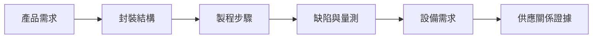

# 導讀：為什麼要從先進封裝的角度看一家設備公司

市場上關於均豪精密（5443）最常見的一句話是：

> 均豪做 AOI 和研磨，先進封裝需要 AOI 和研磨，所以均豪是先進封裝概念股。

三句話都對，合起來卻不成立。中間跳過了整整十四章的內容。

這本筆記做的事情，是把那十四章補回來——**先把封裝的物理與流程建立起來，再把設備需求推導出來，最後才拿公開證據去對號。順序不能倒過來。**

---

## 這本書要回答的五個問題

讀完之後，你應該能回答：

1. 一種封裝技術**解決什麼問題**，為什麼客戶需要它？
2. 它實際經過**哪些製程**，每一步加工的是什麼？
3. 哪裡容易出現**缺陷**，需要什麼設備檢測或改善？
4. 均豪哪項產品**可能**對應這個需求？**目前證據到哪裡？**
5. 新聞中的擴產、送樣、驗證與量產，對設備需求**分別代表什麼**？

第 4 題裡的「可能」和「證據到哪裡」是這本書的重點。**這不是一本告訴你答案的書，是一本告訴你答案有多硬的書。**

---

## 讀之前，先擋掉三個誤解

!!! warning "誤解一：能力等於供應"
    「某設備類別可用於 CoWoS」與「某公司已供應 CoWoS 產線」，是兩件需要**各自舉證**的事。本書全程不允許用前者推出後者。第 15 章的證據矩陣就是為了讓這條界線隨時可查。

!!! warning "誤解二：CoWoS 是一個技術"
    CoWoS 是一個**家族**。CoWoS-S 用矽中介層，CoWoS-R 用 RDL 中介層（沒有 TSV），CoWoS-L 用局部矽橋接。三者的製程站點與設備需求不同。看到「CoWoS 擴產」的新聞，第一個問題永遠是：**擴的是哪一個？**

!!! warning "誤解三：均豪就是那個集團"
    **均豪（5443）**做 Wafer 級的檢、量、磨、拋。**均華（6640）**是它持股約 56.8% 的子公司，做 Die 級的 Chip Sorter 與 Die Bonder。**志聖（2467）**是交叉持股的聯盟成員，營收完全不併入。合併報表的數字不等於均豪本身產品的成績——2026 Q1 觀測站稅後 0.93 億，歸屬母公司只有 0.31 億（G7），差的就是這個。

---

## 六段推理鏈：全書的骨架

每一章、每一個案例，都要走完這條鏈：

**圖 0-1**：全書共用的六段推理鏈。任何一段斷掉，後面的結論就只是推測——本書要求你說出斷在哪裡。

| 段 | 主要章節 |
|---|---|
| 產品需求 | [第 1 章](01-why-advanced-packaging.md) |
| 封裝結構 | [第 2](02-packaging-taxonomy.md)、[3 章](03-materials-interconnect.md) |
| 製程步驟 | [第 4](04-workpiece-flow.md)–[10 章](10-emib-bridge.md) |
| 缺陷與量測 | [第 11 章](11-defect-aoi-metrology.md) |
| 設備需求 | [第 12](12-grinding-thinning.md)–[14 章](14-yield-capacity-capex.md) |
| 供應關係證據 | [第 15](15-gpm-product-map.md)、[16 章](16-reading-news.md) |

---

## 全書結構

| 篇 | 章 | 做什麼 |
|---|---|---|
| **一、建立封裝地圖** | 1–3 | 為什麼需要先進封裝、術語如何分層、訊號怎麼走 |
| **二、看懂實際製程** | 4–10 | 工件形態變化、Fan-Out、CoWoS 家族、HBM、SoIC、EMIB |
| **三、從製程走向設備** | 11–14 | 缺陷與檢測、研磨與薄化、濕製程、良率與產能 |
| **四、回到均豪與公司消息** | 15–16 | 證據矩陣、消息分析模板 |

完整章節地圖與知識依賴見[全書地圖](00-map.md)。

> 📷 **圖片來源**：各章插入的照片與示意圖來自 [Wikimedia Commons](https://commons.wikimedia.org/)，依各自的自由授權使用。完整版權聲明見[圖片來源頁](99-image-credits.md)。這些圖用來讓晶圓、晶粒、中介層、HBM、凸塊與檢測長什麼樣子可被看見，**不是均豪產品照，也不表示圖中公司是均豪客戶**。

---

## 建議閱讀路線

| 你的情況 | 建議起點 |
|---|---|
| 零製程背景，要從頭建立 | 依序 [01](01-why-advanced-packaging.md) → [16](16-reading-news.md) |
| 只想看得懂公司消息 | [01](01-why-advanced-packaging.md) → [02](02-packaging-taxonomy.md) → [04](04-workpiece-flow.md) → [11](11-defect-aoi-metrology.md) → [14](14-yield-capacity-capex.md) → [15](15-gpm-product-map.md) → [16](16-reading-news.md) |
| 已讀過本書庫的《CoWoS 技術精讀筆記》 | 從 [04](04-workpiece-flow.md) 開始，第 6–10 章可略讀 |
| 製程／設備取向 | [03](03-materials-interconnect.md) → [05](05-fan-out.md) → [09](09-soic-hybrid-bonding.md) → [12](12-grinding-thinning.md) → [13](13-wet-process.md) |
| 只有十分鐘 | 本頁三個誤解 ＋ [第 15 章的證據矩陣](15-gpm-product-map.md) ＋ [第 16 章的分析卡](16-reading-news.md) |

---

## 每章的固定結構

每一章都照同一個順序走，方便你跳讀：

1. 開場問題 → 2. 先看結構 → 3. 逐步解釋製程 → 4. 失敗會長什麼樣子 → 5. 如何檢查與控制 → **6. 與均豪的連結** → 7. 理解檢查 → 8. 來源與待查事項

**第 6 段永遠分成三欄**：`✅ 已確認事實` / `🔶 合理推論` / `❓ 尚待查證`。沒有證據的章節會直接寫「本章無均豪公開證據」——這比硬扯有用。

---

## 三個必須知道的限制

這本書的可信度取決於你知道它的邊界在哪裡。

!!! danger "限制一：均豪資料是 2026-08-31 的快照"
    所有均豪相關數字來自個人整理的公開資訊快照，**快照日 2026-08-31**。之後的法說、月營收、財報都不在其中。第 15、16 章的許多「待查事項」正是指向這個日期之後的資料。

!!! danger "限制二：技術章節是跨來源教學整理"
    第 1–14 章的製程流程為**教學簡化與跨來源整理**，不是任何一家公司的實際產線流程。本次寫作期間並未逐份重新開啟晶圓廠與設備商的原廠文件（詳見[附錄 A](appendix-sources.md)）。書中的數值請當作**量級示意**，需要精確值時回原廠文件核對。

!!! danger "限制三：多數客戶關係只有中等證據"
    第 15 章矩陣中，證據等級達到最高的只有一條線。「晶圓代工大廠」「國際封裝大廠」「歐美 PMIC 廠」在公開資料中都未具名，**本書全程維持未具名**，不做慣例推論。

---

## 這本書不做的事

- 不做投資建議、不給目標價、不做營收預估
- 不把未具名客戶補成特定公司
- 不用「某設備可用於某製程」推出「某公司已供應該製程」
- 不把不同世代（CoWoS-S/R/L、HBM 各代、I-Cube 各版）的規格混寫
- 不在沒有來源時填入看似精確的數字

---

## 一個值得記住的錨點

截至本書的資料快照日（2026-08-31）：

> **均豪與客戶關係中，唯一有雙向可對帳基礎的是再生晶圓那條線。**
> 而即使是這一條，客戶端 2025-08-05 那筆 5.51 億的設備取得公告，**也沒有點名供應商**。

如果連最強的一條線都停在這裡，那麼所有比它弱的線，就更需要標清楚證據等級。這就是這本書存在的理由。

---

> 下一頁：[全書地圖](00-map.md)　｜　直接跳到重點：[第 15 章 證據矩陣](15-gpm-product-map.md) ｜ [第 16 章 消息分析模板](16-reading-news.md)
