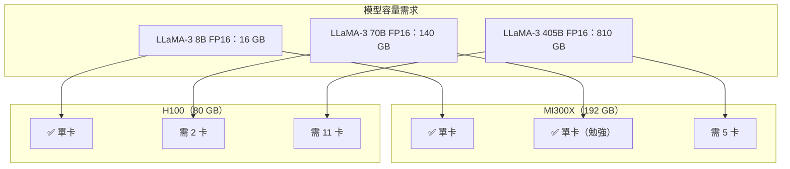

# AMD MI300X 推論優勢

MI300X 是 AMD 在 AI 加速器市場最重要的產品。它在**推論場景**的競爭力，來自一個清楚的優勢：192 GB HBM3 讓它能單卡運行比 H100 更大的模型。

## 核心規格

| 規格 | MI300X | H100 SXM | H200 SXM |
|------|-------|---------|---------|
| 架構 | CDNA 3 | Hopper | Hopper |
| FP8 TFLOPS | 5,220 | 3,958 | 3,958 |
| HBM 容量 | 192 GB | 80 GB | 141 GB |
| HBM 頻寬 | 5.3 TB/s | 3.35 TB/s | 4.8 TB/s |
| GPU 間互連 | Infinity Fabric | NVLink | NVLink |
| 售價（估計） | ~\$15,000 | ~\$25,000 | ~\$30,000 |

## 192 GB HBM 的推論優勢

單卡裝載 70B 模型意味著：

- 省去 GPU 間通訊（All-Reduce）開銷
- 降低延遲（First Token 時間）
- 整體系統成本更低

## 推論吞吐量測試

根據 Together AI、Anyscale 的公開測試（2024 Q3–Q4）：

| 模型 | 場景 | MI300X | H100 | 比較 |
|------|------|-------|------|------|
| LLaMA-3 70B | Batch 64, FP8 | ~2,800 tok/s | ~2,100 tok/s | MI300X +33% |
| Mixtral 8x7B | Batch 32 | ~3,200 tok/s | ~2,500 tok/s | MI300X +28% |
| LLaMA-3 8B | Batch 128 | ~8,000 tok/s | ~8,500 tok/s | H100 +6% |

**結論**：在大模型 Memory Bound 場景，MI300X 有優勢；小模型 Compute Bound 場景，H100 回頭略勝。

## 雲端可用性

| 供應商 | 狀態 |
|-------|------|
| Microsoft Azure | ND MI300X v5 系列，已 GA |
| Oracle Cloud | BM.GPU.MI300X，已 GA |
| AWS | 尚未提供 |
| Google Cloud | 尚未提供 |

## 局限性

- **RCCL vs NCCL**：多 GPU 訓練的通訊效率仍低於 NVIDIA
- **缺乏 NVLink**：多節點訓練擴展性不如 NVIDIA GB200 系統
- **ROCm 軟體成熟度**：某些訓練工作負載需要調整才能跑

## 延伸閱讀

- [推論效能基準](../performance/inference-benchmarks.md) — 推論場景的詳細數字
- [加速器取捨總覽](tradeoffs.md) — 何時選 MI300X 而非 H100
