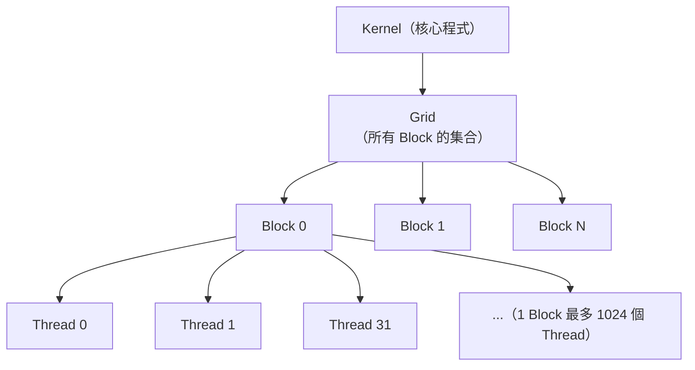
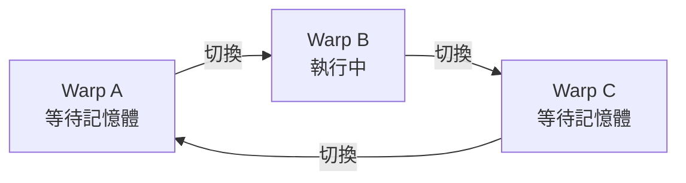

# CUDA 程式設計模型

CUDA（Compute Unified Device Architecture）是 NVIDIA 在 2006 年推出的平行運算平台。理解 CUDA 的執行模型，是看懂 GPU 效能數字的前提。

## 執行層次：Grid → Block → Thread

CUDA 用三層結構組織計算：

| 層次 | 對應硬體 | 共享記憶體 |
|------|---------|-----------|
| Thread | 單一 CUDA Core | 私有 Register |
| Block（由若干 Warp 組成） | 單一 SM | Shared Memory（共用） |
| Grid | 整個 GPU | Global Memory（HBM） |

## Warp：真正的排程單位

GPU 不以單一 Thread 為排程單位，而是以 **Warp（32 個 Thread）** 為最小調度單位。

- 同一 Warp 內的 32 個 Thread **同時執行相同指令**（SIMT）
- 若有條件分支（if/else），不同 Thread 走不同路徑時會發生 **Warp Divergence**，效率下降
- 記憶體存取最好是**合併存取（Coalesced Access）**，否則多次 Transaction 拖慢速度

## Occupancy：決定效能的關鍵

Occupancy 是「SM 實際使用的 Warp 數 ÷ SM 最大支援 Warp 數」。

高 Occupancy 讓 GPU 在一個 Warp 等待記憶體時，立即切換到另一個 Warp 繼續計算，**隱藏記憶體延遲**。

## CUDA 生態的護城河

CUDA 不只是程式語言擴充，它背後是一整個生態：

- **cuBLAS**：線性代數加速（矩陣乘法）
- **cuDNN**：深度學習算子（Convolution、Attention）
- **NCCL**：多 GPU / 多節點通訊
- **TensorRT**：推論最佳化引擎

這些函式庫累積了數年的最佳化，是 AMD ROCm 短期內難以追趕的主因。

## 延伸閱讀

- [記憶體層次結構](memory-hierarchy.md) — Global Memory 的延遲如何被 Warp 切換隱藏
- [NVIDIA 生態系護城河](../competitive/nvidia-moat.md) — 為何軟體才是真正的護城河
