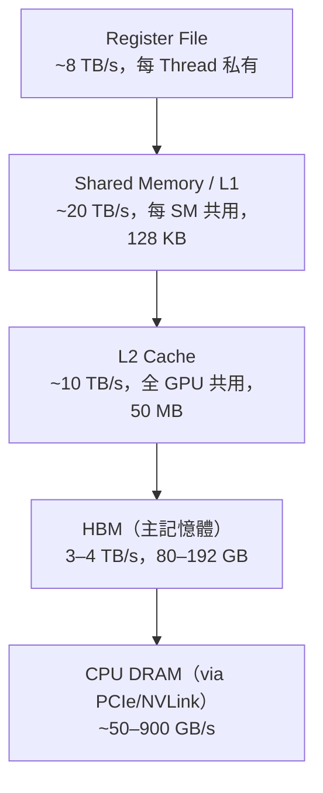

# 記憶體層次結構

GPU 的效能瓶頸常常不在計算，而在**記憶體頻寬**。理解記憶體層次，才能理解為什麼 MI300X 的 192 GB HBM3 是推論場景的競爭優勢。

## 層次從快到慢

## HBM 為何重要

傳統 GDDR6X 雖然便宜，但頻寬約 1 TB/s 且容量有限。HBM（High Bandwidth Memory）透過 **3D 堆疊 + 矽中介板（Interposer）** 實現：

- HBM2e：2 TB/s，最多 80 GB（A100 80GB）
- HBM3：3.35 TB/s（H100）
- HBM3e：4.8 TB/s（H200），容量達 141 GB

容量影響推論的**最大可裝載模型大小**；頻寬影響每次生成 Token 的速度（Memory Bound 場景）。

## Compute Bound vs Memory Bound

| 情境 | 瓶頸 | 例子 |
|------|------|------|
| Compute Bound | FLOPS 不足 | 大 Batch 訓練、矩陣乘法 |
| Memory Bound | 頻寬不足 | 推論（小 Batch）、KV Cache 讀取 |

LLM 推論通常是 **Memory Bound**：每次前向傳播需要把整個模型權重從 HBM 讀入計算單元，計算量相對少，等記憶體才是真正的瓶頸。這正是 MI300X 192 GB HBM3 在推論場景能與 H100 競爭的原因。

## Shared Memory 的使用技巧

開發者可以手動控制 Shared Memory（`__shared__`）：把常用資料載入 SM 內部快取，避免反覆存取 HBM。這是優化 CUDA Kernel 效能的核心技巧之一。

## 延伸閱讀

- [AMD MI300X 推論優勢](../ai-accelerators/mi300x.md) — 記憶體容量如何決定推論競爭力
- [平行運算原理](parallel-computing.md) — Warp 切換如何隱藏記憶體延遲
