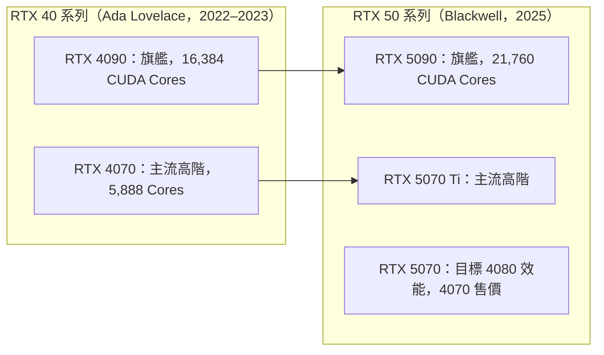

# GeForce 系列現況

NVIDIA 的消費級 GPU 品牌 GeForce，長期主導桌機與筆電的高效能繪圖市場。2025 年的 RTX 50 系列面臨 AMD 的正面挑戰。

## RTX 40 → RTX 50 世代更替

## RTX 50 系列的新特性

- **DLSS 4 Multi Frame Generation**：一次生成最多 3 幀中間幀（RTX 40 最多 1 幀）
- **Blackwell Tensor Core**：支援 FP4，本地 AI 推論效率大幅提升
- **Ada → Blackwell 效能提升**：遊戲效能約 +30–50%，AI 算力提升 3×
- **VRAM**：RTX 5090 提升至 32 GB GDDR7

## 定價策略爭議

RTX 50 系列在 CES 2025 宣布時，帳面上的建議售價其實比前代更低：

- RTX 5080：\$999（vs RTX 4080 \$1,199）
- RTX 5070 Ti：\$749（vs RTX 4070 Ti Super \$799）

真正的爭議在於「買不到建議售價」：實際到貨後供應緊張，市場售價遠高於 MSRP，帳面降價形同虛設，這給 AMD 創造了機會。

## 延伸閱讀

- [AMD RX 9070 XT 的市場突破](rx9070xt.md) — NVIDIA 定價策略的代價
- [消費級市場格局轉變](market-shift.md) — 整體市場格局
