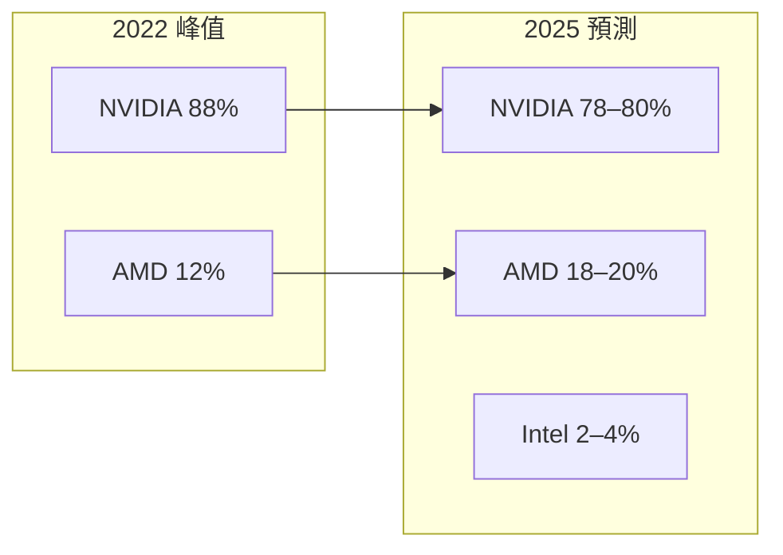
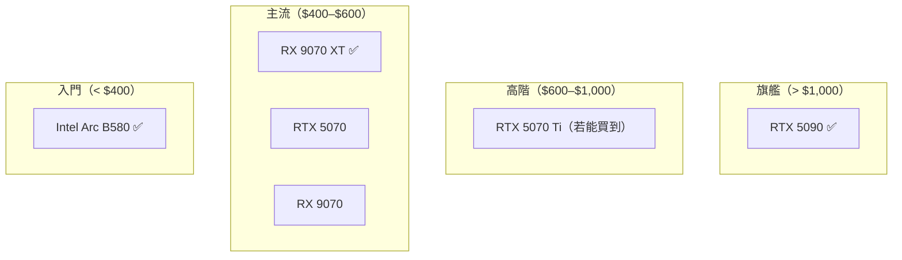

# 消費級市場格局轉變

2025 年的消費級 GPU 市場，正在經歷自 2021 年加密貨幣挖礦熱潮以來最大的格局重整。

## 市場份額歷史

## 驅動格局轉變的三個因素

**1. 供應策略差異**

NVIDIA RTX 50 系列在 2025 Q1 嚴重缺貨，原因包括：

- 台積電 4nm 產能分配給資料中心 GPU 優先
- H100 / B200 訂單擠壓消費級產能
- 黃牛炒作加劇市場失調

AMD 相對充裕的供應讓 RX 9070 XT 能長期維持建議售價。

**2. 性價比重新校準**

| 效能等級 | 2023 推薦 | 2025 推薦 | 變化 |
|---------|---------|---------|------|
| 旗艦 | RTX 4090 | RTX 5090 | NVIDIA 仍領先 |
| 高階 | RTX 4080 | RX 9070 XT ★ | AMD 性價比更高 |
| 主流 | RTX 4070 | RX 9070 | 競爭激烈 |
| 入門 | RX 7600 | RX 7600 XT | AMD 佔優 |

**3. 消費者心態轉變**

加密貨幣挖礦熱潮後的教訓，讓 2025 年的消費者對溢價更敏感：

- 「花 \$549 拿到 \$999 的效能」的訊息傳播非常快
- PC Gaming 社群（Reddit r/hardware、Hardware Unboxed）大量實測報導

## Intel Arc 的角色

Intel 的 Arc B580（2024 Q4）是意外的市場攪局者：

- \$249 的價格，提供 1080p 到 1440p 的遊戲效能
- 16 GB VRAM（同價位其他卡只有 8 GB）
- 入門 AI 推論（XeSS）
- 軟體穩定性從 2022 發布時的糟糕，逐漸改善

Intel 不期待在高階市場競爭，而是從入門市場蠶食。

## 2025 年競爭格局總結

## 延伸閱讀

- [AMD RX 9070 XT 的市場突破](rx9070xt.md) — 主角分析
- [GeForce 系列現況](geforce.md) — NVIDIA 的回應
