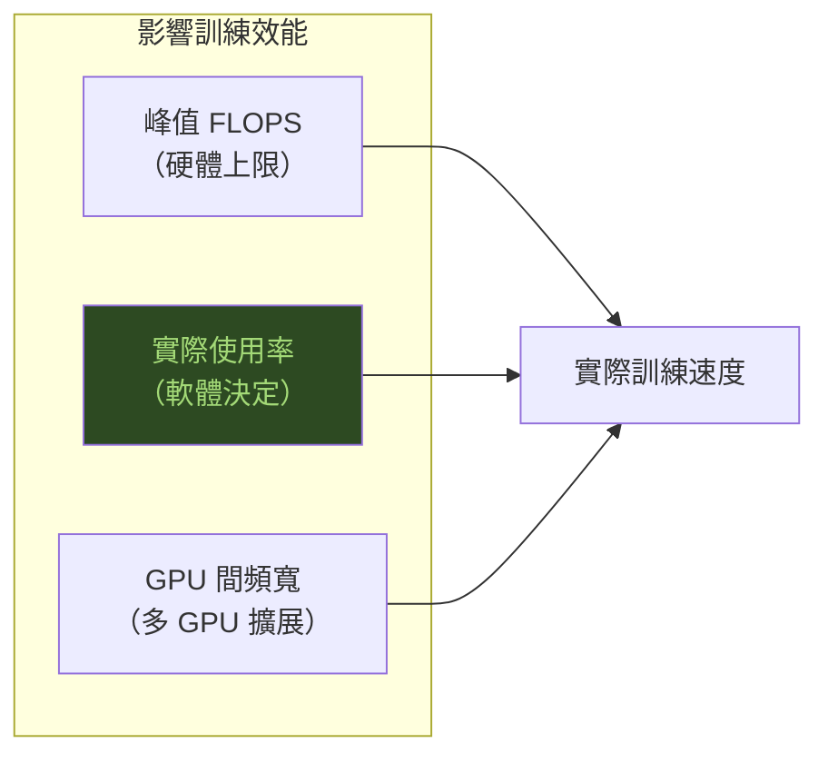

# 訓練效能基準

訓練效能受三個因素決定：FLOPS（計算能力）、記憶體頻寬、以及 GPU 間通訊頻寬。

## 主流 AI 訓練 GPU 規格對比（2024–2025）

| GPU | 架構 | FP8 TFLOPS（含 sparsity） | HBM 容量 | HBM 頻寬 | GPU 間互連 |
|-----|------|-----------|---------|---------|-------|
| NVIDIA H100 SXM | Hopper | 3,958 | 80 GB | 3.35 TB/s | NVLink 900 GB/s |
| NVIDIA H200 SXM | Hopper | 3,958 | 141 GB | 4.8 TB/s | NVLink 900 GB/s |
| NVIDIA B200 SXM | Blackwell | ~9,000 | 192 GB | 8.0 TB/s | NVLink 1.8 TB/s |
| AMD MI300X | CDNA 3 | 5,220 | 192 GB | 5.3 TB/s | Infinity Fabric ~896 GB/s |
| AMD MI325X | CDNA 3+ | 5,220 | 256 GB | 6.0 TB/s | Infinity Fabric ~896 GB/s |

## NVIDIA 在訓練場景的領先

第三方測試（MLPerf Training v4.0，2024）結論：

- 在 LLM 訓練上，NVIDIA H100 比 AMD MI300X 快約 **2–3 倍**
- 原因不在峰值 FLOPS，而在：
  1. **cuDNN / cuBLAS 深度最佳化**：Kernel Fusion、Flash Attention 等
  2. **NCCL 通訊庫**：All-Reduce 效率遠優於 AMD RCCL
  3. **Tensor Core 使用率**：CUDA 生態工具鏈能讓 Tensor Core 利用率持續維持高位

## 軟體才是瓶頸

AMD MI300X 的峰值 FP8 FLOPS（5,220 TFLOPS）**超過** H100（3,958 TFLOPS），但訓練場景落後，原因是：

- ROCm 的 HipBLAS 和 MIOpen 針對特定模型架構的最佳化不夠深
- 缺乏等同於 NCCL 成熟度的通訊庫
- PyTorch 的 ROCm 路徑維護資源遠少於 CUDA 路徑

## 延伸閱讀

- [NVIDIA 生態系護城河](../competitive/nvidia-moat.md) — 軟體成熟度的詳細分析
- [推論效能基準](inference-benchmarks.md) — 推論場景的競爭態勢截然不同
