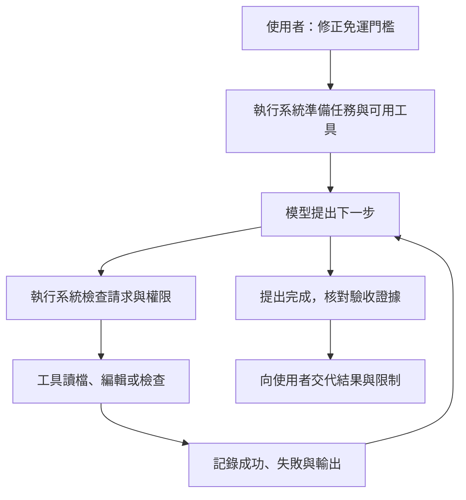

# 01　模型如何變成能工作的代理

模型能提出修改建議，執行系統才把建議接上實際工作。Harness（把模型接上資料、工具、紀錄與限制的系統）在本書統一稱為「執行系統」。它提供資料、執行工具、保存結果，也決定哪些動作不能做。

程式開發代理（coding agent）能透過工具處理程式開發任務，本書簡稱「代理」。它可能讀檔、修改檔案或執行檢查。當你看見它完成一項任務，成果來自模型與執行系統的配合，不能只用模型名稱解釋。

## 從一個差一元的錯誤開始

以下是本書自編的教學案例，並非論文的實驗。商店規定：「訂單滿 1,000 元免運，未滿收 60 元。」金額以整數元表示，先不討論折扣、稅與負數輸入。

`price.py` 裡卻寫成：

```python
def shipping_fee(total):
    return 0 if total > 1000 else 60
```

你請代理修正錯誤。模型若只看見這段程式，可能答出應把 `>` 改成 `>=`。但回覆正確，不代表你的檔案已改，也不代表檢查已跑過。

要讓修改真的發生，執行系統必須安排以下工作：

1. 找到檔案，把內容交給模型。
2. 由工具寫入修改，並回報成功或失敗。
3. 執行檢查，確認 1,000 元現在免運。

這些是執行系統要安排的工作。即使模型一次就猜對修法，系統仍要把「想做」轉成「已做」，再把「已做」轉成可查驗的結果。

## 分清使用者要求、模型請求與工具結果

第一種是**要求**。使用者說「修正免運門檻」，專案規則說「不要改動其他費用」。要求描述想得到的結果與限制。

第二種是**動作請求**。模型可能產生一份按固定欄位填寫的訊息，要求讀取 `price.py`。訊息包含工具名稱與參數；它本身還不是檔案操作。

第三種是**觀察結果**。工具真的讀完檔案後，回傳內容或錯誤。執行系統將結果放入下一次模型輸入，模型才有機會依新資料修正做法。



這張圖是本書的教學重繪。它把論文的功能分類放入一次任務，不代表每個產品都有同名模組。圖上的完成核對也可能很簡單；有些系統只在模型不再要求工具時結束。是否足夠，要看任務如何驗收。

## 用七個問題看懂執行系統

論文以七個子系統比較研究案例。把名稱換成工作問題，比背清單更容易理解。[來源：論文 §2.3](https://arxiv.org/html/2609.00006v1#S2.SS3)

| 要回答的問題 | 論文的子系統 | 在免運案例中的責任 |
|---|---|---|
| 下一步做什麼，何時停？ | 工作迴圈 | 讀檔後再編輯，檢查後才回報 |
| 如何把訊息交給模型？ | 模型整合 | 傳送規則、程式與工具說明 |
| 系統能做哪些動作？ | 工具與動作 | 讀取、替換及檢查程式 |
| 這次與下次需要記住什麼？ | 記憶與上下文 | 保留門檻規則及檢查結果 |
| 哪些動作可以執行？ | 安全與權限 | 限制修改的檔案及可用操作 |
| 是否需要分工？ | 任務編排 | 小任務可維持單一代理 |
| 新能力如何加入？ | 擴充機制 | 需要時加入既有專案的檢查流程 |

七個子系統是觀察角度，不是七個必須各寫一套程式的元件。小程式可能只用一個迴圈、一份訊息清單及幾個函式，就完成大半工作。「不用子代理」也是對任務編排作出的選擇。

此外，使用者介面和工作階段紀錄會跨越多個子系統。介面讓人送出要求、看進度或中止。工作階段保存一段任務的訊息與事件。它們像共用通道，不宜硬塞進單一功能盒子。

## 工具、模型與執行系統各自可能失敗

假設工具回傳「已修改」，模型接著說「測試全部通過」。這句話是否可信，取決於中間有沒有真的執行檢查。執行系統若沒有保存工具結果，使用者就難以區分事實與推測。

反過來，模型可能提出正確修改，工具卻因檔案唯讀而失敗。如果系統吞掉錯誤，下一輪仍可能以為修改成功。這時換更強的模型，並沒有修好錯誤回傳路徑。

還有第三種情況：工具只跑了 999 元的測試。那一筆即使通過，也沒碰到原本出錯的 1,000 元。工具執行成功與驗收充分，是兩個判斷。

因此，排查代理的問題時，先問失敗發生在哪一段：資料沒提供、模型判斷錯、操作被拒、工具失敗，還是驗收沒有覆蓋要求。這能避免把所有問題都歸咎於「模型不夠聰明」。

## 幾個容易混淆的名稱

**模型**根據輸入產生輸出。它沒有因為知道檔名，就自然取得讀寫檔案的能力。能力來自連接的工具與執行環境。

**開發框架**是讓開發者組裝程式的函式庫。**執行系統**則負責把模型的請求變成實際操作。兩者可以重疊：一個已完成的執行系統也可能提供可供其他程式呼叫的介面。第 15 章會處理這個變化。

**評測系統**用來安排題目、執行受測系統及計算結果。它包住的是受測代理；本書的執行系統包住的是模型。英文都可能稱為 Harness；閱讀時要先確認它包住誰。

**上層協調系統**負責安排其他執行系統。它可以統一任務分派，卻未必自己實作檔案編輯。本書把這個層次留到平台章，避免把不同責任的產品直接排成同一張排行榜。[來源：論文 §2.2](https://arxiv.org/html/2609.00006v1#S2.SS2)

## 小型架構的價值與上限

論文用 Mini-SWE-Agent（以少量程式呈現工作流程的程式開發代理）說明，核心工作流程可以很小。這提供一個可讀懂的起點，沒有證明所有額外功能都多餘。長時間工作、多人共用、資料隔離與失敗恢復，會帶來核心修題以外的需求。[來源：論文 §2.4](https://arxiv.org/html/2609.00006v1#S2.SS4)

免運案例適合用小系統學習，因為規則與結果都容易檢查。若改成同時處理多個客戶的專案，讀者就必須重新考慮隔離與權限。程式仍能跑，不等於原本的部署假設仍成立。

## 換你判斷

1. 模型回覆「已把 `>` 改為 `>=`」，但工具紀錄只有讀檔。你能確認哪些事？還缺什麼？
2. 免運小任務沒有使用多個代理。這表示系統缺少必要子系統，還是作出一項設計選擇？說明理由。

[查看解答](exercises-and-answers.md#ch01)。接著讀[原始碼比較能告訴我們什麼](02-reading-evidence.md)，學會分辨案例、證據與建議。
