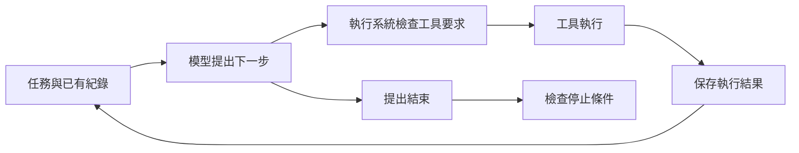

# 03 一次工作如何反覆前進

代理靠工作迴圈把「下一步想做什麼」變成「做完後知道什麼」。每次工具結果都要回到下一次模型輸入，否則模型無法依實際情況修正行動。

你可以把工作迴圈想成修理人員反覆「檢查、動手、再檢查」。每一步都要看實際結果，不能只照最初的猜測做到底。

## 先看一次運費修正

以下是本書自編教學例子。`price.py` 的 `shipping_fee` 規則是：金額滿 1,000 元免運，未滿則收 60 元。程式卻寫成 `total > 1000`。使用者請代理修好，並確認 999、1,000、1,001 元的結果。

模型不能只憑問題描述宣稱修好了。它需要先讀檔，提出修改，再取得工具結果。修改後還要跑檢查，確認結果符合規則。這些步驟串成一條有回饋的路徑：

圖為本書依論文 §6 的迴圈概念重繪。圖中的檢查與紀錄由程式執行；模型負責提出行動及解讀結果。這個分工很重要：模型說「已寫入」並不代表檔案真的改了，工具成功回傳才是寫入證據。

## 一輪要留下要求與結果

這裡把一次模型呼叫及後續工具處理稱為「一輪」。一輪可能包含多個工具要求，也可能只產生文字。不同產品對「步數」和「輪次」的計數方式不同，設計預算前要先定義。

下面的紀錄是教學追蹤，並非論文中的產品執行紀錄：

| 輪次 | 模型收到的新增資訊 | 模型提出的行動 | 工具交回的證據 |
|---|---|---|---|
| 1 | 使用者規則與檔案位置 | 讀取 `price.py` | 條件是 `total > 1000` |
| 2 | 實際程式內容 | 將 `>` 改成 `>=` | 唯一位置已替換 |
| 3 | 修改成功紀錄 | 檢查三個邊界金額 | 結果為 60、0、0 |
| 4 | 檢查通過紀錄 | 回覆完成與驗證方式 | 此輪不需工具 |

若第二輪沒有保存替換結果，第三輪的模型只能猜測修改是否成功。若第三輪的檢查輸出被丟掉，第四輪的完成說明也失去依據。因此，對話紀錄應同時保留工具要求與對應結果，而不是只保存模型說過的話。

工具呼叫識別碼用來連起這兩者。例如 `call_02` 指向一次編輯要求，結果也帶上 `call_02`。當一輪有兩個讀檔要求時，即使後提出的要求先完成，執行系統仍能知道每份內容來自哪個檔案。識別碼解決的是配對問題，不會自行保證內容正確。

## 失敗也是下一輪的輸入

假設有人在讀檔後改了 `price.py`，第二輪便可能收到「找不到待替換文字」。這不等於整個任務必須立刻失敗，但代表舊的編輯假設已經失效。下一輪應重新讀檔，確認現在的內容，再決定是否還需要修改。

反過來，如果執行系統把錯誤藏起來，只回傳空字串，模型可能以為操作成功。執行系統應記錄哪個請求失敗、是否已改變檔案等外部狀態，以及還能做什麼。這些外部狀態的改變稱為「副作用」。對修改檔案的工具而言，「未寫入」和「可能已寫入但回報中斷」需要不同處理。

重新呼叫工具也不是通用解法。讀檔失敗後重試通常容易推理；同一個付款或發布要求重試，卻可能重複產生效果。迴圈只決定繼續的順序，是否可以重試，仍要依工具契約判斷。工具契約就是工具對輸入、結果、錯誤及副作用的約定。

## 簡單迴圈與事件紀錄各解決什麼

論文快照中的 Mini-SWE-Agent 採用簡單線性迴圈。模型查詢後執行動作，接著把觀察加入訊息清單。這種安排容易讀懂，適合觀察模型和環境的互動。不過，訊息持續累積時，仍會碰到上下文容量限制。上下文是模型這次收到的全部資料，容量有限。

論文快照中的 OpenHands（以事件紀錄管理工作的代理系統）則保存事件紀錄，再依目前分支組出模型看到的歷史。所謂事件，是「提出工具要求」「工具已完成」等已發生的事。這讓回放、分支和重啟後接續工作有較明確的資料基礎，也增加狀態管理成本。[來源：論文 §6.2](https://arxiv.org/html/2609.00006v1#S6.SS2)

若你的任務只在一次短程式執行內完成，訊息清單可能已經足夠。若要中途重啟、回到先前決策或供多人追查，就要另想如何保存事件。不能因為事件紀錄較完整，就推論使用它的代理修錯率一定較高；論文沒有提供控制其他條件後的因果比較。

## 有依賴的動作必須等待

讀 `price.py` 和讀專案說明可以同時開始，因為兩者不必使用對方的輸出。但修改必須等讀檔完成，測試也必須等修改完成。若把修改與測試一起啟動，測試可能檢查舊版本，卻被誤當作新版本的驗證。

論文記錄了不同的並行安排：有的系統將工具分成可安全並行與必須依序執行兩類；有的系統依檔案等資源加鎖。這些都是研究快照中的實作策略。對讀者更實用的判斷是：兩項工作是否讀寫同一份狀態，以及其中一項是否需要另一項的結果。[來源：論文 §6.2](https://arxiv.org/html/2609.00006v1#S6.SS2)

資源不衝突仍不代表任務沒有邏輯依賴。修改設定檔與執行測試雖然是不同工具，測試卻可能依賴該設定。工具名稱或檔名只能協助排程，不能取代對任務流程的理解。

## 驗證可以放在不同位置

論文快照中的 Aider（協助修改程式碼的代理工具）在套用編輯後，將語法檢查或測試問題送回模型，再要求修正。這稱為「反思增強迴圈」：程式安排額外的檢查與修正機會，並非保證模型能自行發現錯誤。論文也記錄了把驗證檢查放在準備結束時的做法。[來源：論文 §6.3](https://arxiv.org/html/2609.00006v1#S6.SS3)

對運費案例，關鍵不在檢查被稱為哪一種迴圈，而在最新修改之後有沒有新的測試證據。先前版本的測試通過，不能替後來的修改背書。這個時間關係也是下一章停止條件的核心。

## 從紀錄找出斷掉的回饋

假設一段紀錄只有「要求讀檔」「要求編輯」「模型宣布完成」。你還無法知道程式經過哪些狀態。缺少讀檔結果，就不知道模型依據什麼內容編輯；缺少編輯結果，就不知道修改是否落地；缺少測試結果，就不知道行為是否符合要求。

檢查這類紀錄時，先逐一配對要求與結果，再沿著時間順序看資訊依賴。不要先閱讀最後一段漂亮的完成說明，才反過來找支持它的片段。這個方法能區分兩類錯誤：工具做錯了事，以及工具已正確回報、模型卻沒有採用結果。

如果工具明確回傳歧義，模型仍宣稱成功，應檢查結果是否真的送進下一輪。若沒有送入，是執行系統的資料流問題；若已送入，則要檢查模型如何回應與結束檢查是否放行。兩者表面上都像「代理亂說」，需要修改的位置卻不同。

另一個常見情況是程式在工具執行後中斷，結果沒有保存。此時重新啟動不能只從最後一筆「要求」推定動作尚未執行。應先核對檔案現況，再決定是否重試。這是為什麼可恢復的系統需要明確記錄執行中的狀態，而不只是累積聊天文字。

## 進階：把每輪政策拆開，仍要決定先後順序

線性迴圈可以清楚表達「呼叫模型，再執行工具」。如果每輪還要檢查費用、模型可讀容量及唯讀限制，主要流程就會變長。設計者需要決定：哪些檢查要分開寫，執行時又該先做哪一個？

論文快照中的 Mistral Vibe（程式開發代理工具）使用中介層管線。中介層是放在主要步驟前後的小段處理：有的檢查輪次與費用，有的觸發摘要，有的限制唯讀角色。主要迴圈先經過這些檢查，再繼續模型與工具流程。不同角色可採用不同組合；論文也特別指出，使用者取消仍在迴圈內直接處理，沒有把所有控制都做成中介層。[來源：論文 §6.2](https://arxiv.org/html/2609.00006v1#S6.SS2)

把檢查分開寫之後，仍要安排先後順序。以下是本書的教學推導：

若先產生摘要，再檢查費用上限，預算已耗盡的任務仍可能多付一次摘要費。若先移除寫入工具，再組裝提示，就能讓模型看見符合當輪模式的工具；反過來做，提示可能承諾一個實際不可用的操作。

因此，每段政策除了說明「做什麼」，還應交代讀取與改變哪些狀態。會花費預算的處理，要納入預算紀錄；會改變工具集合的處理，要讓提示與執行端保持一致。工具可見性仍不是完整權限保證，第 06 章會再拆開這個差別。

對運費小任務，幾個直接判斷已經容易理解，不必先建立管線。當你發現相同政策被不同角色重複使用，或每新增一條限制都要改主要迴圈，才有理由把它們抽出。驗證時也不只測每段政策單獨正確，而要安排「預算不足且需要摘要」這類同時成立的情況，確認組合後的執行順序仍符合承諾。

## 跟著小實驗看一次狀態變化

下載 [工作迴圈實驗](examples/loop_demo.py)，以 Python 執行。程式使用固定的模擬模型回應，不需要模型服務金鑰。依序核對正常完成、工具失敗與步數用完三種情況，觀察工具結果何時加入紀錄。

固定回應讓同一條路徑可以重跑，適合驗證控制流程。它不能測量真實模型是否會選對工具，也不能證明代理能處理未見過的程式錯誤。

## 換你判斷

1. 追蹤題：讀檔成功、編輯失敗，但模型下一輪說「已修好」。你應找哪兩份紀錄來確認問題？
2. 設計題：讀取說明、修改程式、執行測試，哪些步驟可以並行？請說明依賴。

查看[本章解答](exercises-and-answers.md#ch03)。接著讀[第 04 章：代理何時該停下來](04-stop-conditions.md)，把「迴圈結束」和「任務完成」分開判斷。
