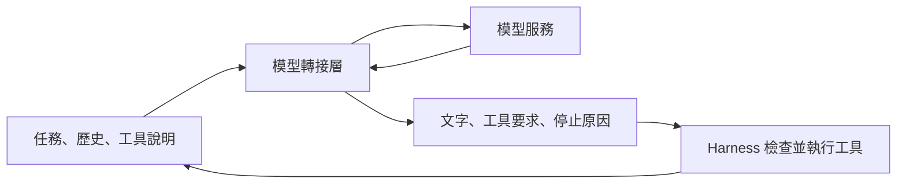

# 05 模型如何接上工作流程

更換模型通常不只改一個名稱。Harness 還要處理訊息格式、工具要求、停止訊號與模型支援的能力，才能讓同一段工作流程繼續運作。

本章讓你畫出模型與工具之間的資料流，知道哪些差異應由模型介面處理。

## 模型回應要能變成可執行的要求

延續本書自編的運費案例。模型讀過 `price.py`，決定把 `total > 1000` 改成 `total >= 1000`。接下來需要的不是一句「我會修改」，而是一份能被程式辨認的工具要求：工具名稱、參數與呼叫識別碼。

不同模型服務可能用不同欄位承載這些內容。有的回應把文字和工具要求分成不同區塊，有的把工具要求列在獨立陣列。Harness 需要讀懂服務的格式，再交給內部工具系統。反方向也一樣：工具產生的結果要改寫成模型服務接受的訊息形式。

處理這些差異的程式可稱為「模型轉接層」。它把服務專屬格式轉成 Harness 能處理的格式，再把內部紀錄送回服務。它不替模型決定要修哪一行，也不替權限系統批准寫入。

圖為本書自編。即使程式只接一種服務，也存在這條資料流；不一定需要先建立通用框架。

## 先分清楚三種結果

對最小的修錯流程，模型轉接層至少要讓 Harness 分清楚：模型要求使用工具、模型正常結束，以及請求沒有正常完成。第三種可能包含連線失敗、輸出長度用完或格式無法解析，不能一律轉成「沒有工具要求」。

例如模型輸出在參數中途被截斷。若轉接層把已收到的一半文字拼成可解析資料，參數仍可能缺少後半段的意圖。格式看似有效，不代表原本要求完整。論文快照中的 Pi 對長度截斷採取明確保護：不執行該回應的工具要求。這是研究記錄的一種處理方式，顯示停止原因會影響是否可執行工具。[來源：論文 §6.2](https://arxiv.org/html/2609.00006v1#S6.SS2)

串流回應會把內容分段送來，讓使用者較早看到進度。畫面可以逐段顯示，但有副作用的操作應等要求完整、格式驗證完成後才開始。本書的這項教學規則將「呈現速度」與「執行時機」分開，避免把收到第一段參數誤當作收到完整命令。

## 專用整合與通用整合的成本不同

論文把模型整合分成數種安排。與單一供應商緊密整合的系統，可以直接使用該服務的提示快取、推理設定和回應格式。支援多家服務的系統，則要自行維護差異，或依靠共用函式庫處理。[來源：論文 §7.1](https://arxiv.org/html/2609.00006v1#S7.SS1)

| 做法 | 適合的眼前需求 | 必須承擔的成本 |
|---|---|---|
| 直接接一種服務 | 任務只使用一種模型介面 | 更換服務時要重新處理格式 |
| 使用共用轉接函式庫 | 需要較快接上多家服務 | 追蹤函式庫支援程度與差異 |
| 自行維護多家轉接層 | 必須控制各家的特殊能力 | 持續維護與驗證服務差異 |

論文快照中的 Aider、OpenHands 與 Mini-SWE-Agent 使用 LiteLLM 這類多服務轉接工具。論文也觀察到其他多模型系統維護自己的整合，仍使用各家特有的快取和推理選項。因此，多模型支援不必然意味著只能用所有服務的最小共同能力；代價是有人要持續處理個別差異。

這個觀察不能推成「自己寫一定比較好」。如果你的任務只需要一個模型讀檔和改檔，建立完整供應商矩陣可能沒有讀者可見的收益。先確認真正需要替換哪一種服務，再決定需要多少共用介面。

## 工具能力不能只靠名稱推測

兩個模型都接受「工具呼叫」，仍可能在多項要求、參數格式或回應上限上不同。更換模型前，應以小案例檢查這些能力，而非只測一個純文字問答。

對運費任務，可以先讓模型提出一次讀檔要求，再交回固定檔案內容。接著確認模型的編輯要求可解析、識別碼沒有丟失，最後確認工具錯誤能回到下一輪。這些檢查測的是介面能否接通，不是模型是否一定能修好真實專案。

模型也可能偏好不同的編輯格式。論文快照中的 Aider 依模型選擇編輯格式與提示；OpenCode 也會依模型系列改變編輯工具。這表明提示、模型與工具不是完全獨立的三個開關。若只換模型而沿用不合適的工具說明，失敗可能發生在格式表達，而不在程式推理。[來源：論文 §7.2、§8.4](https://arxiv.org/html/2609.00006v1#S7.SS2)

## 提示也有穩定部分與變動部分

每輪通常要送出任務規則、工具說明、專案背景與最新結果。有些內容很少變，例如工具參數定義；有些每輪都變，例如測試輸出。把兩者分開，可以讓提示較容易維護，也可能配合服務的快取能力。

「提示快取」是服務重用已處理的相同提示內容，減少重複計算。它不是讓模型永遠記得任務，也不等於書中後續討論的長期記憶。即使服務有快取，Harness 仍須準備正確的當輪輸入。

論文快照記錄了靜態與動態區塊、分層組裝、模型專屬提示等安排。各服務的快取介面和命中條件不同，不能只因文字大意相同，就認定能重用。某些系統特別維持前綴內容穩定，也是為了降低不必要的變動。[來源：論文 §7.2](https://arxiv.org/html/2609.00006v1#S7.SS2)

運費任務的實際程式已改變時，就應提供新的內容。不能為了維持快取而保留舊程式，否則節省的計算成本會換成錯誤的工作依據。先維持資訊正確，再優化重複資料的傳送。

## 模型名稱之外，還要保存哪些設定

同一個模型名稱，搭配不同提示、工具集合與推理設定，可能產生不同工作路徑。若要比較兩次修錯結果，至少記錄實際模型識別、提示版本、可用工具與關鍵請求設定。否則你可能把工具改版帶來的差異，誤認成模型本身變好。

論文快照中的 Codex 從模型目錄取得部分模型專屬設定。這提供了一個具體例子：客戶端程式沒有更新，不代表它收到的提示與能力設定完全不變。本書不據此推論現在的服務行為，但讀者可以帶走一條檢查規則：記錄真正使用的設定，而不只記錄安裝版本。[來源：論文 §7.2](https://arxiv.org/html/2609.00006v1#S7.SS2)

不必把所有回應內容都留成永久資料。紀錄的粒度應符合重現與除錯需求，也應避免保存憑證或不必要的私人資料。對教學實驗而言，固定模擬回應能把模型變動移除，讓讀者先確認控制流程；接上真實模型後，再另外觀察決策品質。

## 進階：依失敗原因選擇恢復方式

模型整合不只處理成功回應，也要決定失敗後怎麼接續。論文快照中的 Hermes 將失敗原因分類，再分派到壓縮、切換可用憑證、替代模型路徑或中止等處理。這裡的重點是分類後恢復，不是替所有錯誤都多重試幾次。[來源：論文 §7.4](https://arxiv.org/html/2609.00006v1#S7.SS4)

以下分類是本書的教學整理，不是原系統的完整錯誤清單：

| 問題 | 可考慮的下一步 | 盲目重試的問題 |
|---|---|---|
| 暫時無法連線 | 在限制內等待後重試 | 立即連續重試可能加重壅塞 |
| 輸入超過容量 | 壓縮或減少輸入，再送出 | 相同輸入仍然放不下 |
| 工具格式不受支援 | 修正轉接或改用相容介面 | 等待不會改變格式能力 |
| 無有效授權 | 停止並交代缺少的設定 | 不應靠更換路徑繞過授權 |

替代模型也不是完全透明的替換。假設原模型熟悉補丁格式，替代模型收到的卻是另一種工具介面，單純重送歷史可能失敗。切換前要重新核對可用能力、訊息格式與必要設定；若不能安全接續，就回報限制。不能把連線恢復成功寫成任務品質沒有改變。

恢復還有一條界線：重新請求模型，和重新執行工具，是兩件事。若編輯已完成，只是下一次模型連線失敗，恢復時應保留編輯結果，不能重新執行整趟工具序列。若工具效果不明，則先核對現況。這會把本章的傳輸處理，接回第 03 章的狀態紀錄。

較完整的模型介面因此要傳遞可辨認的失敗種類、是否收到完整回應，以及已知用量。它不必暴露每個供應商的內部細節，但也不能把所有問題壓成一個空字串，讓主要迴圈失去選擇恢復方法的依據。

## 換模型後，重新檢查失敗路徑

把運費任務換到另一種模型，可以用下面的短清單檢查整合：

1. 送出已知任務，確認收到完整回應及停止原因。
2. 提供一個工具，確認參數通過格式檢查。
3. 交回工具失敗結果，確認下一輪收到該結果。
4. 模擬回應中斷，確認未完成的編輯不會執行。
5. 完成邊界測試後，確認回覆引用實際結果。

這些是本書建議的整合檢查，不是論文已執行的跨模型測試。它們能抓出資料配對與控制流程問題，卻不能用少量成功案例估計整體修錯能力。若要比較模型品質，還需要相同任務、相同限制與足夠的測試集合。

## 換你判斷

1. 追蹤題：模型回應因長度限制中斷，但已收到一份看似合法的編輯參數。為何不能只用「能解析」判斷是否執行？
2. 設計題：你的工具只服務一個固定模型，目前沒有更換需求。應先建立完整多供應商轉接框架嗎？哪些新需求會改變答案？

查看[本章解答](exercises-and-answers.md#ch05)。接著讀[第 06 章：工具如何讓模型可靠地做事](06-tool-contracts.md)，把工具的輸入與失敗結果寫清楚。
