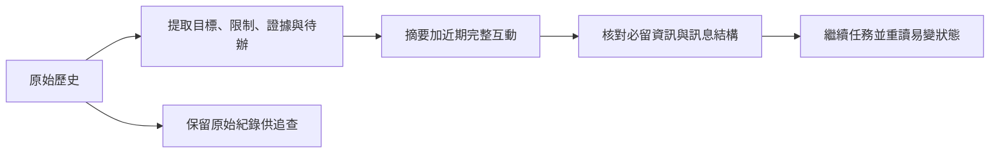

# 09 對話放不下時要保留什麼

壓縮對話時，要保留能讓任務正確繼續的狀態。字數變少只是容量改善；需求、限制或未完成事項消失，壓縮就失敗了。

## 模型每次能讀的內容有限

模型一次請求能接收的內容有上限，稱為上下文視窗。容量通常以 token（模型處理文字的單位）計算，與中文字數沒有固定比例。系統指示、工具說明、使用者訊息及工具結果，都可能占用這個空間。

修正運費錯誤時，代理起初只需要任務與幾個檔案。隨著查找、測試及修正，對話加入大量輸出。舊的搜尋結果可能已經沒用，卻仍占空間。等到請求超過上限才處理，模型可能連下一步都無法產生。

執行系統因此需要預留空間。觸發點不能只看目前訊息是否放得下，還要考慮下一次工具輸出、模型回應，以及摘要本身的成本。某個產品的固定門檻是實作選擇，不能直接套用到不同模型與任務。

## 摘要應像交接單，交代工作狀態

假設對話已確認：免運門檻包含 1000；錯誤位於 `price.py` 的 `shipping_fee`；條件已從 `>` 改成 `>=`；999、1000、1001 的測試尚未執行。以下兩份摘要都很短，但用途完全不同。

| 摘要 | 接手後可能發生什麼 |
|---|---|
| 已處理運費問題，接著完成工作 | 模型可能誤以為修正及驗證都完成 |
| 需求是滿 1000 免運；已改比較條件，尚未執行三個邊界測試；下一步核對差異並測試 | 模型知道已做與未做的分界 |

好摘要保留可操作的狀態，而不是替整段對話取一個標題。對本書教學例子，交接單還應寫明「不得改動其他定價規則」。如果存在被排除的假設，例如「不是顯示格式造成」，應附上判斷依據，避免下一輪重走已證偽的路。

摘要也不能把推測改寫成事實。「可能是比較條件」與「已讀到條件並重現錯誤」是不同證據等級。模型若把前者壓成後者，後續工作就會建立在不存在的查證上。

## 四種做法在保留程度上不同

論文 §9 整理了四種做法：

- **完整保留歷史：**容易追蹤全部過程，但終究會碰到容量上限。
- **反覆摘要：**先縮短較舊的內容，必要時再對摘要做一次摘要。
- **可替換的壓縮模組：**讓系統依需要選擇不同壓縮方式。
- **達到門檻才壓縮：**在接近設定容量時啟動摘要。

這些分類不是互斥開關。論文觀察到，有些系統會保留最近一段原文，同時把舊摘要帶入下一次摘要。這讓近期工具呼叫仍可精確追蹤，也降低早期決定在反覆摘要後消失的風險。不過，舊摘要若本來就錯，增量合併也可能把錯誤保存更久。

論文中的 Aider 採用反覆摘要，保留較新的尾段；OpenCode 的摘要要求目標、工作狀態、下一步及相關檔案等欄位。這兩個案例說明了不同重點：前者決定「哪段可以壓」，後者約束「壓完要留下什麼」。它們都不等於已經證明摘要完全無損。

在短任務中，保留完整歷史可能最簡單。對長時間任務，摘要加上近期原文通常更實用。若任務需要稽核，原始紀錄應另行保存；模型這次沒讀到某段內容，不代表系統應永久刪除它。

## 壓縮必須保留工具呼叫的結構

上下文不只是普通段落。一次工具呼叫與其結果可能必須成對出現，模型介面才接受該份歷史。若只刪掉呼叫、留下結果，或留下呼叫卻刪掉回傳，下一次請求可能因格式錯誤而失敗。

因此，執行系統要以完整互動單位選擇保留範圍。摘要可以說明「已讀取 `price.py`，條件已確認」，但不能把這句話偽裝成仍有效的原始工具回傳。原始紀錄、摘要及新回合之間應有清楚的分界。

檔案狀態也要重新核對。摘要記錄「已修改 `price.py`」只是一項歷史事實；另一個人或代理可能又改了檔案。壓縮後準備編輯時，應讀取當前內容，再確認先前結論是否仍成立。摘要不是檔案系統的替身。



這是本書的檢查流程。圖中分開保留原始紀錄，是為了讓壓縮失誤可追查，不表示所有研究樣本都採用相同儲存方式。

## 先檢查保留項，再比較長度

本書的 [上下文保留實驗](examples/context_demo.py) 用固定資料檢查摘要，避免把模型輸出波動與壓縮機制混在一起。下載程式後，在檔案所在目錄執行：

```sh
python context_demo.py
```

實驗檢查任務、限制、已做決定、證據與下一步，共五個欄位。任務明寫「滿 1000 元免運，未滿收 60 元」。第一個案例故意漏掉限制與證據；第二個把「尚未完成測試」改成「全部測試通過」；第三個完整保留。前兩者都應被檢查抓到，最後才顯示 `PASS: context checks`。程式採固定文字比對，不會證明真實模型能穩定產生好摘要，也不能自動判讀任意改寫。

實際部署還要觀察壓縮後的行為。例如，代理是否重複讀相同檔案、忘記使用者限制，或把未測試的修改當作完成。這些現象比壓縮率更接近任務品質。若摘要頻繁失真，可以增加保留欄位、留下更多近期原文，或把重要需求獨立保留。

當壓縮本身失敗時，不應無限制重試。系統可保留原始歷史、回報無法繼續的原因，或在受控條件下改用較小輸入再次嘗試。論文也記錄了遇到上下文溢出才啟動壓縮的復原路徑；預先觸發與溢出後復原可以共用機制，但要避免反覆溢出的迴圈。

最後，對話縮短不等於成本一定降低。產生摘要本身需要計算，摘要後重讀遺失檔案也需要工具呼叫。應比較整個任務的成本、完成率與可追溯性，而非只看某一次請求的長度。

## 不同資訊可以用不同方式保留

不是所有內容都值得交給模型重新措辭。明確的使用者限制可以保留原文；大量測試輸出可以保留結果、命令與紀錄位置；已修改檔案清單可以用結構化欄位保存。這樣做能減少摘要模型自行判斷每一項重要性的負擔。

對運費例子，「包含 1000」很短，誤刪的影響卻很大，適合直接保留。幾百行成功測試日誌則可以縮成實際命令、結束狀態與結果位置。若測試失敗，還應保留失敗案例與關鍵錯誤，不要只寫「有錯誤」。保留方式應跟資訊的用途一致。

也要防止摘要累積成另一份過長歷史。舊決定若已被新決定取代，可以保留目前有效狀態，並把取代原因留在可追查紀錄中。例如，先前打算改呼叫者，後來已確認共用函式才是問題，摘要就應明示目前方案。原始紀錄負責保存探索過程，工作摘要負責讓下一步做對。

## 進階：壓縮改變的是視野，還是歷史本身

保留摘要之後，還有一個更深的設計問題：舊內容放在哪裡？論文快照中的 Hermes 在壓縮時結束目前工作階段，再建立帶有父階段識別碼的新階段。後續查找能沿著關係回到舊紀錄。Pi 則把訊息存成只追加的樹，以目前分支的位置決定哪些內容進入模型。兩者都把「當下看到的內容」與「保存下來的歷史」分開。[來源：論文 §9.5](https://arxiv.org/html/2609.00006v1#S9.SS5)

這個分離有助於查明摘要何時漏掉需求，但也增加查找責任。沿著父階段搜尋時，可能在多份摘要與原始對話重複命中同一件事。論文記錄 Hermes 會在跨階段搜尋中去重。設計者要避免把重複紀錄當成多份獨立證據：同一則「滿 1000 免運」被摘要五次，仍只有原本那個來源。

回到舊對話也不等於回到舊檔案。論文明確指出 Pi 的分支切換不還原檔案系統；相對地，Mistral Vibe 的回退機制可選擇還原檔案。以下是本書失敗推演：模型回到尚未修改的對話分支，磁碟上的 `price.py` 卻已是 `>=`。若仍依舊訊息編輯，就可能產生零處匹配或重複修正。恢復流程應先交代對話與檔案各自恢復到哪個狀態，再重讀易變內容。[來源：論文 §9.5](https://arxiv.org/html/2609.00006v1#S9.SS5)

若任務需要回放與稽核，可以把壓縮本身記成事件。論文中的 OpenHands 保存壓縮要求與完成事件，讓歷史轉換也能追蹤。短暫、可重跑的教學任務未必需要這套儲存方式；需要中斷後接續或比較不同探索分支時，才值得承擔歷史關係、重複資料與檔案同步的成本。[來源：論文 §9.4](https://arxiv.org/html/2609.00006v1#S9.SS4)

實際驗收可故意切回舊分支，再確認系統是否指出檔案仍是新版本；這比只確認分支按鈕能操作更有用。

## 換你判斷

1. 摘要寫著「修好運費錯誤」，原始紀錄卻只有改檔，沒有測試。這份摘要混淆了哪兩種狀態？
2. 你要處理一個很短、可在容量內完成的任務。是否需要每三輪摘要一次？請指出要觀察的成本與收益。

[查看解答](exercises-and-answers.md#ch09)。

本章依據：[論文 §9 上下文管理](https://arxiv.org/html/2609.00006v1#S9)、[§16.5 壓縮建議](https://arxiv.org/html/2609.00006v1#S16.SS5)。產品行為限於論文 v1 快照；交接單與實驗為本書教學設計。

上一章：[如何找出任務需要的程式碼](08-code-retrieval.md)。下一章：[哪些知識應留到下一次任務](10-persistent-memory.md)。
