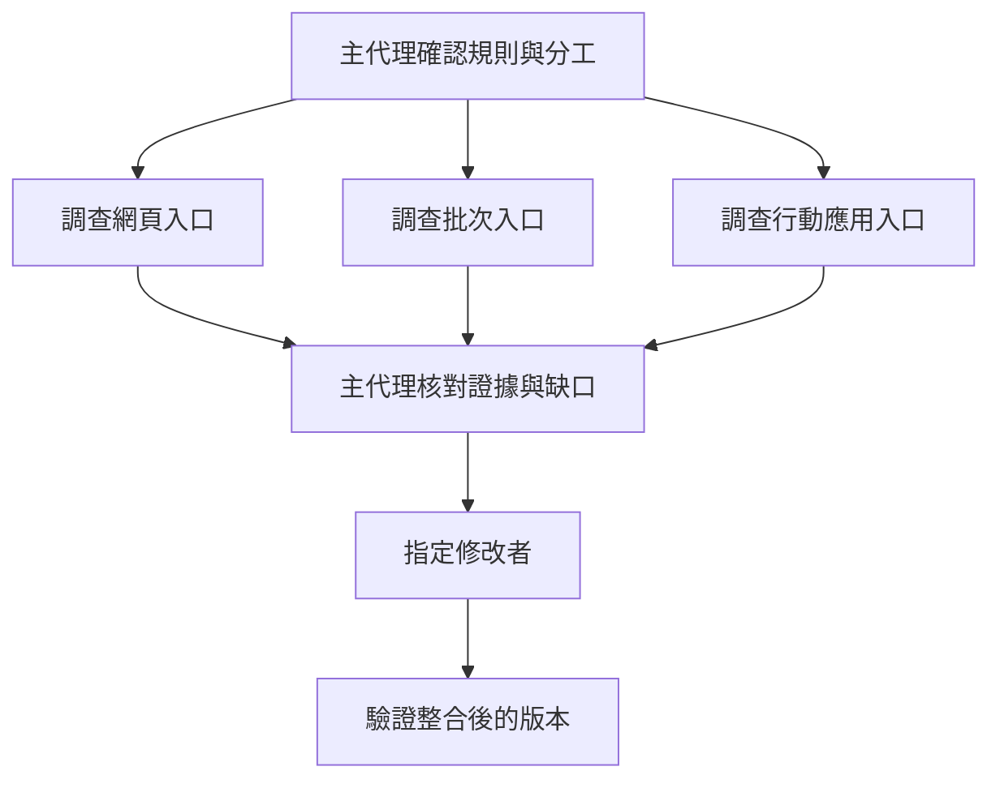

# 12 什麼任務值得交給多個 agent

任務能獨立探索、產出可核對的結果時，多個 agent 才可能節省時間。把一段緊密相依的工作切成多人接力，可能只增加交接與整合成本。

## 先看依賴，再決定人數

本書教學例子只有一個比較條件錯誤。Agent 需要確認需求、讀函式、修改 `>`、執行邊界測試。後一步依賴前一步的結果。若分別交給四個 agent，每個都要重新理解門檻與檔案狀態，主代理還得確認交接沒有遺漏。

這種工作通常由一個 agent 做更直接。但假設專案有網頁、批次處理及行動應用三條結帳入口，需要確認它們如何傳入運費金額，三條路徑就可能平行調查。每位子代理只讀取指定入口，回傳呼叫路徑、輸入單位與證據，主代理再決定共同修改點。

差別不是檔案有幾個，而是工作是否可以在不知道其他人結果時先前進。三個人同時改同一個函式，並未消除依賴；只是把等待改成衝突。

## 分工同時分開上下文

子代理通常有自己的對話歷史。它可以專心處理一個範圍，最後只回傳摘要與證據位置。主代理不必把所有中間搜尋輸出都讀一遍，這就是上下文隔離的價值。

但隔離也會讓資訊斷開。若主代理沒有告知「滿 1000 包含門檻」，子代理可能按照自己的假設判讀。若它只回傳「沒有問題」，主代理也無法知道它看過哪些呼叫者。節省上下文不等於可以省略任務契約。

一份有用的派工說明至少交代目標、範圍、可做動作及回報格式。以本例的擴充調查為例：

```text
目標：確認網頁結帳入口如何呼叫 shipping_fee。
規則：滿 1000 元免運，包含 1000。
範圍：只讀網頁入口與直接呼叫鏈，不修改檔案。
回報：呼叫路徑、金額單位、折扣先後、來源位置、未確認事項。
停止：找到實際呼叫點並核對輸入；超出範圍則回報缺口。
```

這是本書派工範例，不是特定產品的語法。它讓主代理可以檢查成果，也讓子代理知道何時可以停止。單純說「幫我看看運費」則缺少可驗收的終點。

## 常見形狀各解決不同問題

論文 §11 將多代理設計分為幾種形狀，包括循序委派、平行子工作、階層式分工，以及跨程序或跨系統呼叫。它們不必同時存在於一個產品。

| 形狀 | 適用工作 | 主要代價 |
|---|---|---|
| 循序委派 | 把一段專門調查交出去，再接續主流程 | 主代理仍要等待，未必縮短總時間 |
| 平行子工作 | 同時調查互不依賴的入口或文件 | 需要限制重複工作並整合結果 |
| 階層式分工 | 大任務可再拆成清楚子範圍 | 深度、成本與責任追蹤更複雜 |
| 跨系統呼叫 | 需要另一套工具、環境或服務 | 增加連線、認證與協定相容問題 |

論文快照中的 Mistral Vibe 採循序委派，子代理完成後主代理才繼續。Codex 使用可追蹤深度的執行緒樹。Pi 核心則不直接提供子代理，透過擴充示範跨程序呼叫。這些案例顯示，分工可以是核心能力，也可以是外加能力，沒有必要由功能數量決定優劣。

「有多個 agent」也不保證真正平行。兩個子工作可能被循序等待、共用受限服務，或因資料依賴而排隊。判斷速度改善要看實際執行時間，而不是建立了多少名字。

## 主代理仍要對整體結果負責

假設三位子代理回報：網頁入口傳折扣後金額，批次入口傳折扣前金額，行動應用入口尚未找到。主代理不能以「兩位完成」宣布整體完成。它應把已確認的差異與未確認範圍分開，再決定是否修改共同函式或入口。

如果兩份回報互相矛盾，應回到檔案與版本核對。讓 agent 投票無法取代證據：它們可能讀到相同過時文件，也可能共享同一個錯誤假設。多位執行者帶來的是更多檢查機會，不是自動取得獨立證據。



圖中刻意把調查平行化，把共同修改集中處理。這是本例的教學選擇。若檔案互相獨立，也可讓不同子代理各自修改，但需要宣告檔案責任，最後仍要對整合版本執行檢查。

## 共用檔案時，隔離對話還不夠

不同 agent 即使看不到彼此的對話，也可能寫入同一個工作目錄。甲讀到舊檔案後準備替換，乙已先修改內容，甲的寫入就可能覆蓋乙的成果。主代理不能把「有各自 session」誤認成「有各自檔案」。

可以按檔案分配責任，或使用分開的工作目錄，再由主代理整合。分開目錄會增加合併成本；共用目錄則需要更嚴格的所有權與變更核對。對只有一行修改的運費例子，兩種協調成本都可能比修改本身還大。

權限也要跟著分工。只負責探索的子代理可以只讀，不必取得寫入與外部傳送能力。它遇到權限阻礙時應回報，不能靠遞迴派工擴大權限。設定同時執行數、深度、回合及總成本限制，可以防止任務樹意外膨脹。

取消也要有定義。如果使用者停止任務，主代理必須知道哪些子工作還在執行，並回收或中止它們。否則主畫面已停止，背景仍可能寫檔。這是執行生命週期問題，不能只靠子代理最後說一句「完成」處理。

## 用總成本判斷分工是否值得

本書用一個簡化估算說明：三項各需五分鐘、互相獨立的調查，理想平行時間接近五分鐘，再加派工、等待與整合時間。若整合要十二分鐘，總時間就比單人循序做還長。這些數字是教學假設，不是論文測量值。

除了時間，還要計算各子代理重複載入的內容、模型使用量，以及主代理核對回報的成本。論文引述多代理研究的成本差異時，比較基準包含簡單聊天，不能直接推成「多代理一定比精心設計的單代理貴固定倍數」。

比較合理的起點，是先找一段明確的平行探索，再量測完成時間、證據品質與整合工作量。若結果改善，就保留分工；若只是產生更多摘要，就縮回單代理。較小或較快的模型可以負責邊界清楚、容易核對的任務，但模型分級不能取代驗收。

## 回報格式應保留失敗與未完成

子代理的最終文字不應只容納成功。它可以回報「找到入口，但無法執行測試」，並附上阻礙與已確認內容。主代理便能利用已完成的調查，另外安排必要驗證，而不是把整個子工作重做一次。

若子代理逾時，主代理也要知道它是否曾寫檔。失去回應不代表沒有副作用。這時先檢查實際工作目錄與變更，再決定重試範圍。分工協定能保存進度、失敗與取消狀態，才真正幫助任務接續。

## 進階：複製上下文時，不要一併共享可變狀態

子代理繼承的內容不只有文字。論文 §11.2.2 記錄，Claude Code 的分支建立會分開處理取消控制、檔案狀態快取、拒絕計數及工具決策。取消訊號由父代理傳到子代理，子代理停止不會反向取消父代理；部分狀態複製，部分重新建立。系統同時保留父代理已組好的提示原文，以維持快取可重用的條件。[來源：論文 §11.2.2](https://arxiv.org/html/2609.00006v1#S11.SS2.SSS2)

這些選擇處理的是不同問題。共用穩定提示能減少重複計算，共用可變的拒絕計數卻可能讓甲子任務的失敗影響乙子任務。以下是本書推演：負責網頁入口的子代理多次遇到權限拒絕，不應因此讓正在讀批次入口的子代理被誤判為反覆違規。狀態隔離要按用途決定，不能用「全部複製」或「全部共用」概括。

論文中的 Codex 提供歷史繼承模式，並過濾部分中間工具呼叫。這能縮小子代理輸入，卻提醒我們：繼承對話不等於繼承完整證據。如果派工要求它核對運費的精確測試結果，主代理仍應提供可重讀的紀錄位置，不能假設那份工具輸出一定存在於子代理上下文中。[來源：論文 §11.3](https://arxiv.org/html/2609.00006v1#S11.SS3)

當任務變成大量同型調查，例如逐個模組核對運費入口，可以要求每位子代理用同一組欄位回報。論文記錄了依資料列展開子工作、再按共同結果格式收回的設計。這適合輸入彼此獨立、成果能合併的工作。若每一列都要改同一個共享設定，格式再整齊也不能消除寫入衝突。驗收仍要檢查遺漏項目、重複項目與失敗項目，而非只計算收到幾份回報。

## 換你判斷

1. 兩位子代理都回報「所有入口正確」，卻沒有檔案位置或呼叫路徑。主代理可以據此完成任務嗎？
2. 一項工作要修改同一個函式的三個相依分支。你會平行改檔，還是先平行調查、再集中修改？說明依賴與驗證方式。

[查看解答](exercises-and-answers.md#ch12)。

本章依據：[論文 §11 多代理協調](https://arxiv.org/html/2609.00006v1#S11)、[§16.7 分工建議](https://arxiv.org/html/2609.00006v1#S16.SS7)。產品行為限於論文 v1 快照；分工案例與時間估算為本書教學推導。

上一章：[誰決定工具可以執行](11-permissions.md)。下一章：[新能力應接在哪一層](13-extensibility.md)。
