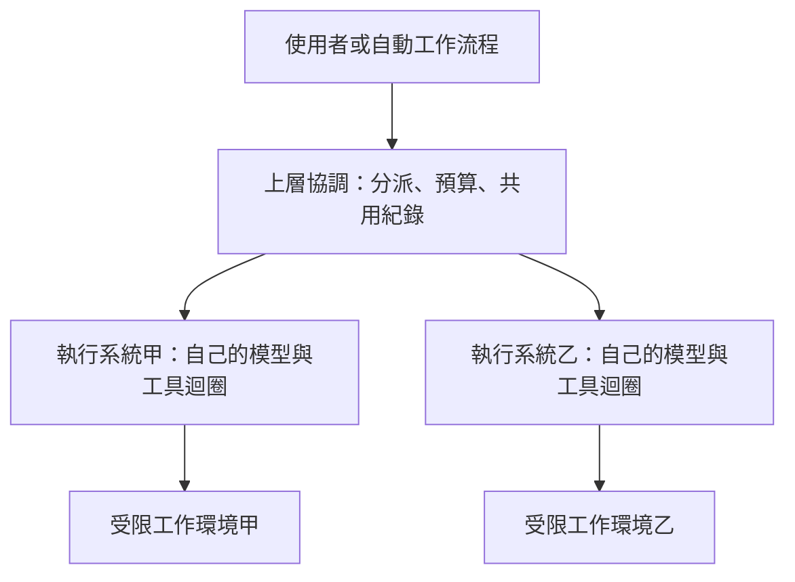

# 15　工具成為平台後多了哪些責任

當別人的流程、擴充與資料開始依賴你的執行系統，你就需要維護一個平台。完成單次任務之外，你還要維持介面相容、管理擴充的安裝與更新、控制權限，並讓工作能在不同環境接續。

論文把這個變化稱為「平台轉向」。這是作者對研究快照的綜合判斷，不是量測得到的產業定律。本章取其中可用來理解架構的部分，不把市場消息當作今天的產品現況。[來源：論文 §14](https://arxiv.org/html/2609.00006v1#S14)

## 從一個人的修錯工具開始

先想像免運修錯工具只由你使用。輸入任務、改檔、檢查，結果看完就結束。若內部函式改名，只要入口仍能工作，影響可能有限。

接著，團隊想從編輯器呼叫它；自動檢查服務想讀取進度；另一個部門想加入自己的工具。此時，回傳欄位、取消語意與權限行為都成了別人的依據。你再改動內部設計，就需要知道哪些承諾對外有效。

這就是平台責任的起點。它不一定來自使用者人數，而是來自依賴關係：只要別人的工作建立在你的行為上，你就需要維護那個行為或提供遷移方式。

## 四種介面把工作系統變成共用基礎

**擴充介面**讓別人加入新能力。第 13 章談到技能、工具與掛鉤；當這些內容由不同作者提供，就要處理來源、版本、啟用條件與衝突。

**程式介面**讓其他程式送出任務、收取進度或中止。SDK（供程式呼叫的開發套件）可以把執行系統的能力包起來。HTTP（網路上傳送請求與回應的通訊規則）服務則允許其他處理程序或裝置透過網路呼叫。

**工作階段介面**讓人恢復、分支或搬移一段工作。它傳遞的不只是聊天文字，還可能包括工具請求、工具結果、檔案狀態與權限範圍。

**治理介面**讓管理者限制團隊可用的能力。當管理規則與專案設定衝突，系統必須明確決定優先順序，並在執行時維持限制。

論文以 OpenCode 的伺服器與多種用戶端、OpenHands 的 SDK，以及不同系統的擴充與設定層次，說明這些介面如何在研究樣本中出現。[來源：論文 §14.1–14.3](https://arxiv.org/html/2609.00006v1#S14.SS1)

## 介面相同，不代表語意相同

假設兩個執行系統都提供 `cancel`。甲的意思是「停止接收新動作，但讓目前工具結束」，乙的意思是「嘗試終止目前的處理程序」。上層程式若只看名稱相同，就可能誤以為檔案已停止變動。

相同問題也出現在「完成」「權限拒絕」與「恢復」。恢復對話不一定恢復磁碟；匯入訊息不一定保留原本工具能力；批准一次也不必然代表後續同類操作都獲批准。

平台開發者應在介面說明中回答三個問題：

1. 何時算成功？
2. 失敗後留下什麼狀態？
3. 哪些工作仍由呼叫端處理？

兩個介面能否互換，要看這些行為是否一致，不能只比函式名稱。

| 介面承諾 | 必須問清楚的問題 | 教學案例 |
|---|---|---|
| 中止 | 已啟動的工具是否仍在執行？ | 取消後 `price.py` 會不會繼續被寫入？ |
| 恢復 | 恢復訊息，還是也恢復檔案？ | 門檻已改，但對話回到修改前 |
| 匯入 | 不支援的資料如何處理？ | 原本的檢查工具在新系統不存在 |
| 權限拒絕 | 是阻止本次操作，還是只發出通知？ | 拒絕寫檔後是否真的沒有變更？ |

## 上層協調系統把責任再分一次

論文的 Omnigent 對照案例，說明一個上層系統可以協調不同執行系統。原文指出，它自己不實作程式編輯迴圈，而是透過不同連接方式安排下層工作。[來源：論文 §14.4](https://arxiv.org/html/2609.00006v1#S14.SS4)

圖是本書的責任示意，不是 Omnigent 部署圖。關鍵在於：上層統一介面後，下層差異仍存在。某個執行系統能中止執行，另一個可能只能停止排入新工作。上層需要記錄差異，不能把能力一律宣告成相同。

論文也記錄了上層隔離策略並非處處一致。有些路徑自行包裝隔離，有些依賴下層原生模式。這提醒我們，統一政策的意圖不等於每條執行路徑都有相同保護。

對讀者而言，先問「這條規則最後由誰執行」，比只問「規則存在哪一個設定檔」更有用。

## 技能分發會帶來軟體供應的責任

技能檔看起來像文章，卻可能指示模型執行工具，或附帶程式。若團隊會自動安裝與更新，就必須把它當作會改變系統行為的輸入。

以免運專案為例，一份「發布前檢查」技能原本只讀取測試報告，更新後可能多出上傳結果的操作。若權限仍由執行層檢查，就能在新動作出現時判斷是否允許。若團隊只相信「這份文件以前很安全」，更新就可能越過原有預期。

本書的設計推論是：記錄安裝來源與版本，讓更新可審查，並在工具執行時維持權限邊界。這是對論文技能分發與信任層次的教學延伸，不是宣稱每個研究案例都提供同等保護。[來源：論文 §12.5、§14.3](https://arxiv.org/html/2609.00006v1#S12.SS5)

## 從兩次快照學會修改自己的判斷

論文保留部分系統的早期快照，再與後續快照比較。作者據此描述功能擴散、介面沿用，以及行為規則從提示文字移往設定的變化。

這種比較比只看今天的功能清單多回答一個問題：「責任正在往哪裡移動？」如果原本要求模型自行記住的規則，後來由設定與執行檢查承擔，系統就把遵守規則的部分責任移出了文字推理。

但兩次快照不代表每個變更都經過同樣完整的追蹤。Claude Code 的原始碼來源限制仍在，不能把版本歷史描述誤讀成完整原始碼差異證據。具體限制見[來源說明](sources.md)。

本章最實用的收穫，是把自己的設計決定也寫成可修正的版本。先記錄「我們目前只服務本機任務」，日後新增遠端呼叫時，就知道要重新檢查驗證、工作目錄、取消與權限。

## 進階：恢復協定要處理「結果不明」

服務化之後，呼叫端與執行端可能在不同時間失去連線。原文的用戶端／伺服器架構與上層協調討論，讓我們需要追問這個邊界；以下流程是本書教學推導，不是所有研究系統都已實作的保證。[來源：論文 §14](https://arxiv.org/html/2609.00006v1#S14)

假設服務已改好 `price.py`，但成功回覆尚未送達，連線就中斷。呼叫端只看見逾時。此時把同一要求再送一次，可能重複執行；直接報告失敗，也可能與檔案現況不符。「沒有收到成功」不能直接推成「沒有發生動作」。

最小可查核設計會保留操作識別碼、目標版本與目前狀態。恢復時先查同一筆操作，再核對檔案差異。若無法判斷是否完成，就回報結果不明，交由指定流程處理。識別碼只有在執行端也記錄並核對時，才有助避免重複動作。

取消也需要明確狀態。收到取消要求、停止接受新動作，以及現有程序已停止，是三個不同時點。上層系統若只收到第一個確認，就不應宣稱後續不會再寫檔。需要等執行端確認，並核對已留下的修改。

| 對外狀態 | 呼叫端能據此做什麼 | 還不能推論什麼 |
|---|---|---|
| 已接受 | 保存操作識別碼，繼續查詢 | 不能推論已開始或已完成 |
| 執行中 | 顯示進度，依契約申請取消 | 取消要求不等於已停止 |
| 已完成 | 取得結果、版本與驗證證據 | 業務需求仍需對照驗收 |
| 結果不明 | 查紀錄及實際產物，再決定如何恢復 | 不能直接重送有副作用的動作 |

這些狀態也影響擴充相容性。新版若把「取消成功」從停止排程改成終止程序，就算欄位名稱未變，語意也已改變。驗收介面時要測中斷與恢復，不只測正常回傳。這就是平台責任如何從一個簡單函式名稱擴展成可依賴的行為。

## 不必為了平台化而建立平台

免運實驗不需要技能市集、跨供應商協調或遠端服務。它需要的是清楚的工具契約與可核對的結果。只有當其他人或程式確實要依賴它，才需要建立並維護相應介面。

論文提供一張可能的成長地圖。本書的用法是辨識新增責任，讓你知道何時需要補強，而不是把每項平台功能都列成待辦。

## 換你判斷

1. 兩個執行系統都有「恢復工作」按鈕。你為何仍不能保證恢復後的檔案一致？需要核對什麼？
2. 團隊要共享一份會更新的技能。除了共享檔案，還要保存哪些資訊，才能知道行為為何改變？

[查看解答](exercises-and-answers.md#ch15)。接著讀[為自己的任務選出最小設計](16-design-your-harness.md)，把全書概念收斂成一份可驗證的方案。
