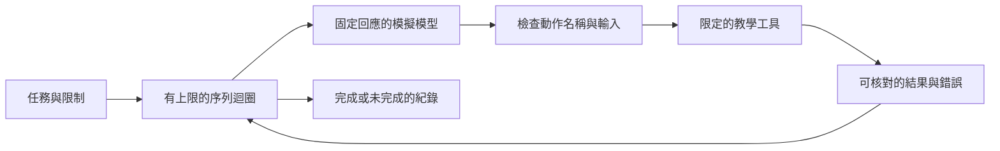

# 16　為自己的任務選出最小設計

先列出任務成功的證據，再加入取得證據所需的功能。最小設計是足以完成指定任務、守住必要邊界的設計，並不等於程式行數最少。

本章用免運案例完成一份設計，再用三個可執行實驗檢查關鍵機制。實驗使用固定回應，不呼叫付費模型，也不執行模型產生的任意命令。

## 第一步：把「修好」改成可核對的條件

任務仍是：滿 1,000 元免運，未滿收 60 元。教學範圍限定為非負整數金額，以及一份小型程式。

驗收不寫「看起來合理」，而是寫成：

- 999 元收 60 元；1,000 與 1,001 元收 0 元。
- 修改對準原本的條件式；沒有把其他相似文字一起替換。
- 工具不能確定位置時，拒絕修改並保留原檔。
- 達到步數上限時，系統回報未完成；不能把停止當成功。
- 工作記錄保留需求、限制、已做決定與待做檢查。

這些條件同時描述功能與執行行為。它們讓你知道下一個工具是否真的有必要，也讓同事能判斷結果。

## 第二步：畫出最少責任



圖中沒有真實模型連線，因為這一階段要觀察的是控制流程。固定回應讓同一個錯誤每次都能重現；之後換模型時，才有基準判斷是模型輸出變了，還是執行系統的行為變了。

| 責任 | 這一版的選擇 | 暫時不加入的能力 |
|---|---|---|
| 推進任務 | 一次執行一個動作 | 並行排程與子代理 |
| 模型輸入輸出 | 固定的回應序列 | 真實模型連線、分段回應與快取 |
| 檔案修改 | 暫存檔案，唯一匹配才替換 | 模糊匹配與跨檔案交易 |
| 結果判斷 | 明確成功狀態與邊界檢查 | 用另一個模型猜測是否完成 |
| 記憶 | 可檢查的結構化摘要 | 跨工作階段自動學習 |

省略的功能不是永遠不需要。表格只是固定本次實驗的邊界，避免一次更動太多因素。

## 第三步：跑三個小實驗

把下列檔案下載到同一個資料夾，以 Python 3 執行。它們只使用標準函式庫；執行時會印出結果並用內建檢查確認預期行為。

| 實驗 | 下載 | 回答的問題 |
|---|---|---|
| 工作迴圈 | [loop_demo.py](examples/loop_demo.py) | 正常完成、工具錯誤、達到上限能否分開？ |
| 唯一匹配編輯 | [edit_demo.py](examples/edit_demo.py) | 匹配零次與多次時，原檔是否不變？ |
| 上下文保留 | [context_demo.py](examples/context_demo.py) | 摘要是否保留預先指定的關鍵資訊？ |

```text
python loop_demo.py
python edit_demo.py
python context_demo.py
```

三組實驗分開，是為了讓讀者看見每個機制的責任。它們不是一套完整代理產品，也沒有聲稱實際模型能穩定修好新問題。詳盡的輸出與操作見[實驗導讀](examples/README.md)。

### 先看停止原因，不只看最後一句話

迴圈實驗把動作送給限定工具，保留每輪結果。正常流程與失敗流程分開執行。模型回應沒有後續動作時，系統不能憑空補出工具成功；工具拋出預期錯誤時，也不能把錯誤當成有效結果。

步數上限是控制失控的界線，不是完成標準。若上限先到，正確回報是「到達上限，任務未完成」。這種誠實狀態，比再加一段好聽的成功摘要更重要。

### 再看拒絕修改有沒有保住檔案

編輯實驗只在原字串出現一次時寫入。出現零次時，工具沒有足夠依據；出現多次時，位置不明確。兩者都應在寫入前拒絕。

「拒絕時沒有寫」不等於「能抵抗所有並行修改」。若另一個處理程序在讀完後改了同一個檔案，還需要額外的協調或版本檢查。本實驗限定單一寫入者；讀者不能把這個檢查擴張成檔案交易保證。

### 最後看摘要漏掉了什麼

上下文實驗給出同一段任務的三份摘要：一份漏掉限制與驗證狀態，一份把尚未測試改成全部通過，一份保留必要欄位。檢查對照事先列好的事實，讓讀者看見「文字比較短」與「下一步仍做得對」的差別，也能辨認摘要捏造的成功證據。

這是固定案例的保留檢查，不是通用的語意評分器。它不能自動理解所有同義改寫，也不能證明真實模型摘要沒有隱性偏差。若日後改用模型摘要，應先保留這些固定例子，再加入真實任務的人工核對。

## 第四步：把失敗變成升級理由

只有在失敗原因清楚時，新增功能才容易評估。

| 觀察到的問題 | 先處理什麼 | 不要立刻跳到什麼 |
|---|---|---|
| 同一項工具錯誤反覆出現 | 錯誤是否可理解，重試是否改變條件 | 再啟動更多代理 |
| 工具說明占滿輸入 | 減少重複說明，量測實際負擔 | 把固定工具數門檻當定律 |
| 摘要忘記限制 | 固定保存必要資訊，保留近期結果 | 無限制增加長期記憶 |
| 不同模型需要不同訊息格式 | 集中處理已觀察到的差異 | 先抽象出所有未來供應商 |
| 工作被中斷後狀態不明 | 記錄動作與結果，設計恢復方式 | 只增加「再試一次」按鈕 |

原文 §16 提供一組實務建議。本書把它們用作提問清單：這項建議防什麼失敗？我的任務有沒有這個失敗？怎樣量測改善？其中的數量門檻與順序是作者建議，不是普遍有效的工程常數。[來源：論文 §16](https://arxiv.org/html/2609.00006v1#S16)

## 如何讀論文的最小程式骨架

原文 §16.10 提供約 90 行的示意骨架。它把模型、工具、限制與摘要串起來，適合對照本書各章；原文也明示它不是生產程式。[來源：論文 Listing 3](https://arxiv.org/html/2609.00006v1#S16.SS10)

閱讀時，請刻意找出仍待實作的責任：模型介面只有宣告；工具參數格式需要完整定義；檔案路徑與命令執行沒有形成安全邊界；摘要的成本與錯誤也需要處理。程式用字元長度估計 token（模型處理文字的單位），也不能取代實際模型的計量。

還要分清「有成本欄位」與「成本上限可信」。若模型回傳沒有完整用量，或摘要呼叫未被計入，累加的數值可能漏算。上限在呼叫前檢查，也不代表最後一次呼叫絕對不超額。讀骨架的目的，是辨認接點與缺口，不是把短程式看成完整保證。

本書沒有直接照貼骨架執行。三組實驗改用窄範圍工具，讓沒有隔離環境的讀者也能觀察相同的核心問題。

## 交付自己的設計卡

請為下一個任務填好以下設計卡，每個欄位一兩句即可：

| 欄位 | 請寫下 |
|---|---|
| 目的 | 這次要完成什麼 |
| 輸入 | 需要哪些資料，從哪裡取得 |
| 允許的操作 | 代理可以做哪些動作 |
| 禁止的操作 | 代理不能碰哪些檔案或資源 |
| 完成證據 | 誰執行哪些檢查，結果如何才算通過 |
| 停止條件 | 何時完成、等待或中止 |
| 失敗後接手 | 誰接手，先查哪份紀錄 |
| 之後再加的功能 | 現在省略什麼，出現什麼問題才補上 |

免運案例的設計卡可以這樣寫：「只處理暫存副本的單一條件；唯一匹配才修改；核對三個邊界輸入；失敗保留紀錄；不呼叫真實模型。當需要評估真實模型時，先固定模型與任務集，再另外量測。」

這份卡片才是本書希望你帶走的產物。它把架構名詞變成責任、限制與可查驗的證據，讓下一位接手的人知道系統能做什麼。

## 進階作業：把最小設計提升為可交接的方案

完成三組實驗後，再加入一個條件：修正可能跨越兩次工作階段。先交付一份能讓別人檢查的設計。以下是本書綜合作業，不是論文的實測結果。

### 1. 保存恢復工作需要的資料

寫出恢復時必須保留的資料：需求、禁止事項、基準版本、已做動作、驗證所對應的版本，以及下一步。這裡的版本指待驗證檔案內容的識別；只記 Git 提交編號，無法辨認未提交的修改，還需保存差異或檔案內容雜湊（由內容算出的識別值，可用來比較檔案是否改變）。把聊天全文存起來並不足夠；接手者仍要知道哪項證據適用於目前檔案。

### 2. 比較兩種恢復方式

挑兩個候選設計。甲只保存摘要與版本，恢復後重讀檔案；乙另存逐步事件與檢查點。沿用第 14 章的方法比較，說明乙多出的紀錄解決哪種失敗。若任務很短，甲可能已足夠；若要追查多次中斷，乙才可能值得額外維護。

### 3. 故意中斷，檢查失敗處理

設計故障注入：故意在特定時點中斷流程，觀察系統如何處理。這不是等真實故障發生，而是主動製造可以核對的失敗。

| 故障情境 | 合格行為 | 不合格行為 |
|---|---|---|
| 修改完成、結果尚未記錄就中斷 | 查檔案與操作紀錄，必要時標為結果不明 | 無條件再修改一次 |
| 檢查通過後，另一人又修改檔案 | 舊證據不能直接證明目前版本，需重新核對 | 沿用舊測試宣稱完成 |
| 摘要遺漏「不得改其他費用」 | 從保留的需求來源補回限制 | 把摘要當唯一且永遠正確的需求 |
| 子代理回報成功卻未附證據 | 主流程查核差異與測試後再驗收 | 只根據回報文字合併成果 |

### 4. 寫下何時撤回新增設計

寫下撤回條件。例如新增分工後，總耗時沒有下降、合併錯誤卻增加，就先恢復單一代理。設計決策應能因證據而改變。

### 參考解法：以版本串起狀態與證據

這個作業可以先選甲：保存需求來源、基準版本與摘要；恢復時比對目前檔案。若版本不同，重新讀取並檢查；若修改是否發生仍不明，停止自動續跑並呈現待確認狀態。當這個方法無法回答實際追查需求時，再增加乙的逐步紀錄。

解答沒有指定一定要用資料庫、事件框架或多代理。評分重點是四個故障都有明確處理、證據不會跨版本誤用，以及讀者能說明代價。論文的 18 項建議可用來檢查遺漏；[模式組合專章](advanced-patterns.md)可協助判斷責任落在哪裡。

## 換你判斷

1. 三個教學實驗都通過，是否代表換成真實模型後能達到論文案例的修題率？請指出缺少的證據。
2. 你的摘要保留測試成功，卻漏掉「不得修改其他費用規則」。是否可以只靠測試通過接受摘要？你會新增什麼檢查？

[查看解答](exercises-and-answers.md#ch16)。下一步請執行[三組實驗](examples/README.md)，再填一份自己的設計卡。
