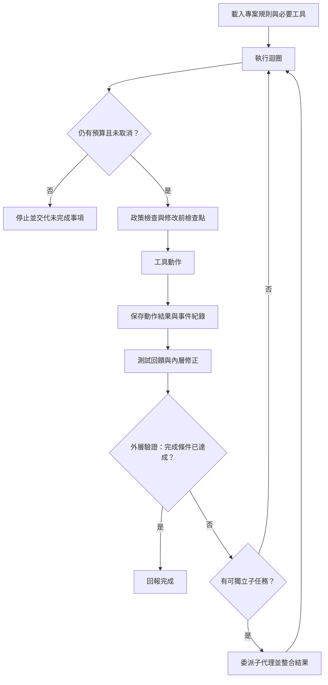

# 如何組合論文的架構模式

先找出任務在哪一步失敗，再選能解決問題的做法。論文列出 29 個架構模式，也就是反覆出現的系統設計做法；你不必全部採用。

本頁依「誰負責什麼、前一步如何影響下一步」分組。分類是本書的教學整理，不是論文作者的分類。模式名稱和系統案例依[表 11](https://arxiv.org/html/2609.00006v1#S13.T11)與[表 12](https://arxiv.org/html/2609.00006v1#S13.T12)；採用時機、下列小案例和成本分析是本書的工程推演，不代表論文已實作或測試這些組合。

## 1. 安排執行、檢查回饋，再決定是否完成

### 模板方法

Template Method（模板方法）先固定共用流程，再讓不同實作替換其中的步驟。共用流程放在「基底類別」，沿用它的「子類別」負責改寫解析或格式化步驟。

論文以 Aider 的 Coder 類別和 OpenHands 的 Agent 類別為例。

教學示例（非原文程式追蹤）：輸入是模型回覆，基底流程維持「解析→執行→格式化」，不同解析器把各自格式轉成同一種動作，輸出執行結果。流程狀態由基底掌握、格式細節可替換。

代價是追查一次行為時得同時讀基底與子類別。

### 依序執行中介層檢查

Middleware Pipeline（依序執行中介層檢查）把回合限制等政策拆成按順序執行的步驟，與主迴圈分開。

論文以 Mistral Vibe 為例。若檢查、限流、記錄依序包住一次模型呼叫，輸入輸出仍是同一回合，但各步驟能獨立替換。

代價是順序改變可能改變行為，除錯也多了步驟邊界。

### 事件紀錄

Event Sourcing（事件紀錄）把動作和觀察追加到事件歷史，之後從紀錄理解或重建狀態。

論文列出 OpenHands 的事件紀錄、Pi 的樹狀工作階段紀錄，以及 OpenCode 的佇列式紀錄。它回答「發生過什麼」。

代價是要保存歷史、處理事件格式演進，並驗證重播結果。

### 回合檢查點

Turn-Level Checkpoint（回合檢查點）保存當時的狀態，供之後還原。

論文中的 Mistral Vibe 依使用者訊息建立檔案快照。OpenCode 和 Hermes 使用 shadow-git（另用 Git 保存工作快照的做法）。Pi 的檢查點則只涵蓋對話。

因此，能還原什麼，要看檢查點保存了什麼。保存完整工作目錄，也需要儲存空間與還原時間。

### 反思迴圈

Reflection Loop（反思迴圈）把程式碼檢查或測試回饋送回內層迴圈，讓模型修正後再檢查。

論文以 Aider 為例，並把 Gemini CLI 的編輯修復和 OpenCode 的 LSP（讓編輯工具取得程式語法等資訊的通訊規則）回饋列為近親。錯誤訊息是輸入，修正後的新檔案是輸出。

代價是多一次模型呼叫，而且測試沒覆蓋到的錯誤仍可能留下。

### 卡住偵測

Stuck Detection（卡住偵測）尋找重複或無效行為，再警告、詢問或停止。論文記錄 OpenHands 的五種情境，以及 Gemini CLI 雜湊加模型判斷等做法。門檻太敏感會把必要重試當成停滯，太寬鬆則可能讓無效循環持續；偵測結果應當觸發可理解的處置。

### 外層驗證迴圈

Outer Verification Loop（外層驗證迴圈）在模型自己的回合之外檢查任務是否真的完成。論文舉 OpenHands `/goal` 判斷器與 Hermes verify-on-stop 為例；輸入是目標、工作結果和驗證訊號，輸出是完成判定或要求繼續。它可攔截過早結束，代價是多一層判斷、延遲及判斷器自身的錯誤風險。

## 2. 分清摘要、跨工作階段記憶和分支歷史

### 模型摘要

LLM Summarization（模型摘要）用模型縮短對話歷史。論文記錄九個系統採用摘要，Mini-SWE-Agent 沒有，Aider 部分採用；摘要省下上下文空間，但可能遺漏限制、決策理由或尚未完成的工作。

### 壓縮後保留舊工作階段

Lineage Compaction（壓縮後保留舊工作階段）讓新工作階段接續摘要，同時保留舊紀錄供查找。

論文中的 Hermes 把工作階段存入 SQLite（把資料存在本機檔案中的資料庫）。壓縮時，系統結束目前階段，再建立新階段。新階段以 `parent_session_id` 記下上一個階段，並帶入摘要。搜尋時，系統沿這些連結查舊紀錄，再移除重複結果。

教學示例：S1 的歷史經摘要後成為 S2 的起點，日後查詢 S2 也能回到 S1；狀態是多段相連工作階段，而非覆寫成一份新逐字稿。

代價是要維護鏈結、跨段搜尋和去重。

### 由代理維護的記憶

Agent-Maintained Memory（由代理維護的記憶）讓背景子代理擷取並整理跨工作階段資料。論文列出 Codex 以 Git 保存的基準版本分兩階段整理，以及 Gemini CLI 先寫入待審佇列、由人透過 `/memory` 檢查的做法；它減少手動整理，卻增加審核、過期資訊和錯誤記憶的管理工作。

### 用樹狀紀錄保存對話分支

Session-Tree Version Control（用樹狀紀錄保存對話分支）把對話項目存成只能追加的樹，並用可移動的葉節點指向目前分支。

論文描述 Pi 的 JSONL（每行存一筆資料的文字格式）項目帶有 `id`、`parentId`，支援分支、回復和分支摘要，OpenHands 也使用對話樹。

教學示例：目前對話走到 e8，使用者想回到 e5 試另一條路。系統從 e5 加入新紀錄，形成新分支，再把目前位置移到新分支的末端；舊分支仍保留。

分支摘要可帶回舊路徑的探索結果，但 Pi 不會因此還原檔案。使用者也必須知道目前在哪個分支。

## 3. 讓提示、工具和快取配合模型差異

### 提示快取

Prompt Caching（提示快取）固定可重用的提示前綴、快取邊界或工作階段鍵。論文列出 Claude Code、Codex、OpenHands、Hermes、Pi 和 OpenCode 的不同做法；重用可省去重複處理，但邊界和有效期限依服務而異，提示改動也可能讓快取失效。

### 依模型選擇提示

Model-Family Prompt Matrix（依模型選擇提示）依模型系列或世代挑選不同基礎提示。論文舉 Codex 的伺服器目錄、OpenCode 的九種提示及 Hermes 的條件區塊；輸入模型識別後選出對應提示，能適應模型差異，代價是提示版本與測試組合變多。

### 同時產生多家服務的快取格式

Cache-Dialect Fanout（同時產生多家服務的快取格式）讓同一套提示組裝流程同時輸出多家供應商各自的快取控制格式。

論文記錄 OpenCode 同時輸出六種供應商格式，並把系統提示限制在最多兩則、預設一則，以對齊快取位置。

教學示例：輸入穩定的系統提示前綴，組裝器按各格式插入對應標記，輸出仍是同一提示內容、附帶多種格式標記；不能假定某一家格式可直接套用到所有服務。

代價是標記位置、供應商行為和提示改動都要做相容性回歸檢查。

### 依模型切換編輯方式

Polymorphic Edits（依模型切換編輯方式）依模型選擇編輯格式或工具組合。論文舉 Aider 的提示工廠與 OpenCode 的工具登錄表；模型選擇是輸入，對應編輯工具是輸出，較貼近模型能力，但需要維護多套輸入契約及測試。

### 模仿執行系統身分

Harness Mimicry（模仿執行系統身分）是論文觀察到的相容性做法。用戶端呈現服務商自家執行系統的身分資訊，以使用訂閱方案的 OAuth 後端。OAuth 是讓使用者授權應用程式存取服務的機制。

表 12 舉出 Pi 呈現 Claude Code 身分，以及使用 ChatGPT 方案 Codex 後端的案例。這裡只保留來源觀察，不提供冒用操作教學。

依賴特定身分與後端，可能帶來政策及相容性風險。這是本書推論；論文沒有評估成本，也沒有把這個模式列為一般建議。

## 4. 讓能力按需出現，並用介面控制變化範圍

### 延後載入

Deferred Loading（延後載入）先把工具或技能說明留在提示之外，需要時才搜尋和載入。

論文舉 Codex 的 BM25（依關鍵字與文件相關程度排序的方法）工具 `tool_search` 和 Hermes 橋接工具。初始上下文較小，但搜尋可能找不到模型真正需要的能力。

### 即時載入專案上下文

JIT Repo Context（即時載入專案上下文）按目前目錄尋找階層式 Markdown 規則，再於需要時注入。論文列出 Claude Code、Codex、Gemini CLI、Mistral Vibe、Hermes、Pi、OpenCode 和 OpenHands；它回答專案有哪些規則，並不等於檢索所有相關程式碼，多份規則也可能衝突。

### 技能

Skills (capability bundles)（技能）以 `SKILL.md` 和名稱、說明等資料整理一項工作流程或專門知識。

論文記錄九個系統支援此模式。模型可按需載入整套做法，但作者仍要維護技能內容與發現方式。

### 條件啟用

Conditional Activation（條件啟用）按檔案路徑或環境決定工具、技能是否啟用。

論文例子包括 Claude Code 路徑規則、OpenHands PathTrigger 和 OpenClaw 的 `requires`。條件輸入會縮小當前可用能力，代價是條件疊加後較難診斷「為何沒有出現」。

### 自我更新技能

Self-Improving Skill Loop（自我更新技能）讓代理撰寫、修改和整理技能。論文舉 Hermes 的完整模式，Gemini CLI 的技能擷取仍是待審流程；更新變快，但要增加審核、差異檢查和版本管理。

### 協定介面

Protocol Interfaces（協定介面）用結構相容的介面替換實作，不要求繼承同一父類別。

論文舉 Mini-SWE-Agent 的 Python Protocol（用來宣告實作必須提供哪些操作的介面），以及 Pi 的 Operations（可替換工具執行方式的介面）。Pi 可透過這個介面把每項工具改為遠端執行。

教學示例：輸入 `read(path)`，本機和遠端實作都依同一呼叫契約回傳內容或錯誤；呼叫端不用知道資料來自磁碟或 SSH（透過加密連線操作遠端電腦的方式）。

代價是要明定回傳值、錯誤和契約版本，否則替換後才會暴露差異。

### 保留小核心，由擴充補上能力

Minimal-Core / Extension-Host（保留小核心，由擴充補上能力）把安全、沙箱、子代理和計畫模式等能力移到執行時事件傳遞機制。

論文以 Pi 為例。核心較精簡、能力可由擴充補上，但擴充相容性和安全責任也更分散。

### 客戶端／伺服器式執行系統

Client/Server Harness（客戶端／伺服器式執行系統）由內嵌 API（供其他程式呼叫的介面）伺服器提供代理能力，終端機、網頁、程式編輯器或自動檢查服務都可連接它。

論文列出 OpenCode 和 OpenHands agent-server。多種介面共用同一服務，代價是管理伺服器生命週期、連線和存取控制。

## 5. 在執行邊界落實規則

### 把規則寫成設定或程式

Policy-as-Code（把規則寫成設定或程式）把安全規則寫成可檢查的設定或程式。論文舉 Codex Starlark（用來撰寫規則的語言）、Claude Code 事件掛鉤、Gemini CLI TOML（一種設定檔格式）、Hermes 設定和 Pi 擴充事件掛鉤；集中規則較容易審核，但優先順序、例外和版本都需要管理。

### 依命令語法判斷權限

Syntax-Aware Command Permissioning（依命令語法判斷權限）先解析指令，再依其結構和引數範圍授權。論文以 OpenCode 的 tree-sitter 解析、Mistral Vibe 的解析驗證和 Hermes 去混淆比對為例；它能分辨部分命令形狀，卻不能單靠語法判斷真實意圖。

### 標記不可信內容

Untrusted-Content Delimiting（標記不可信內容）在工具或網頁結果前後加上明確標記，與可信指令分開。

論文記錄 Hermes 和 OpenHands 的污點標記。標記能提醒模型內容來源，不能自行隔離程序或取代權限檢查。

## 6. 只有工作可分割時才增加代理

### 讓子代理再分派工作

Recursive Composition（讓子代理再分派工作）讓代理再啟動子代理，並傳入分叉或連結的上下文。

論文列出 Claude Code、Codex、OpenHands、OpenClaw，Hermes 須由設定開啟，OpenCode 可選用。它能拆出獨立子任務，代價是協調、額外上下文和權限邊界。

### 上下文分叉

Context Forking（上下文分叉）複製父代理的狀態給子代理隔離使用。

論文列出 Claude Code、Codex 和 Hermes，Hermes 的背景分叉會共享快取。分叉保留任務起點，卻增加上下文成本，父子工作的改動也不會自動合併。

## 看一條任務流程如何組合

下面是本書的教學推演，不是論文中任何單一系統的實作。處理程式錯誤時，執行系統可按以下順序安排：

1. 按需要載入專案規則與工具。
2. 檢查權限，在需要復原時保存檢查點，再執行工具。
3. 保存工具結果。若測試失敗，把結果交回模型修正。
4. 由外層驗證檢查完成條件。
5. 若尚未完成，而且有可獨立處理的子任務，才委派子代理。

事件紀錄保存「發生過什麼」；檢查點保存「能還原的狀態」；摘要保留「下一步需要的資訊」。三者用途不同。

## 練習：決定哪些模式值得加入

你要做一個代理修改專案、跑測試並支援長時間工作。它有 24 個工具，權限規則需依指令內容判斷，使用者也要求能復原檔案。選一組模式，說明每項解決什麼問題、增加什麼成本，再判斷是否需要多代理。

**參考判斷：**可以先採用以下做法：

- 延後載入工具說明，減少初始輸入。
- 依命令語法檢查權限，分辨允許與禁止的操作。
- 保存檔案檢查點，供需要時還原。
- 用摘要接續長任務，並檢查重要限制是否保留。

只有找到能獨立並行的探索工作時，才加入多代理。論文的數字門檻有適用情境，不能直接套用到所有模型和任務。這組選擇是本書推演，論文沒有測試過。

回查完整模式名稱和章節去向，可看[論文對照索引](paper-map.md)；研究版本與適用範圍見[來源說明](sources.md)。接著讀[第 14 章](14-compare-designs.md)，用相同任務評估兩組設計。
