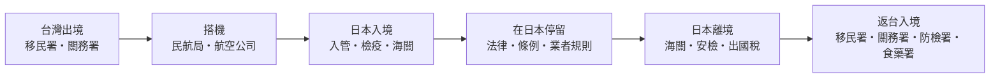

# 01 一趟旅程，要通過哪些規則？

阿哲第一次和朋友去大阪。他在網路上看到「日本免簽、行動電源可以帶、藥妝店買的東西都免稅」，就覺得準備完了。回程在關西機場，他才被航空公司提醒行動電源只能帶兩個；回到桃園，行李裡的肉乾被檢疫人員攔下。每一條網路說法都不算錯，只是各自只講了其中一道關卡。

!!! info "本章適用"
    - **何時用到**：開始規劃行程、還沒訂機票時。
    - **適用誰**：所有讀者；讀完本章再決定要細讀哪幾章。
    - **不處理**：各關卡的具體數字，那些在第 02–13 章。

## 五道關卡，五套規則

一次日本旅行，旅客和行李至少會依序經過下面五段。每一段有自己的主管機關；**通過前一段，不代表下一段一定能過**。

| 階段 | 主要在查什麼 | 主管或負責單位 | 本書章節 |
|---|---|---|---|
| 台灣出境 | 護照、役男出境許可、攜出現金 | 內政部移民署、役政署、財政部關務署 | [02](02-passport-visa.md)、[03](03-special-travelers.md)、[06](06-food-cash-goods.md) |
| 搭機 | 行動電源、鋰電池、液體、託運限制 | 交通部民用航空局、各航空公司 | [04](04-baggage-batteries.md) |
| 日本入境 | 免簽資格、動植物檢疫、藥品、海關申報 | 出入國在留管理廳、動物檢疫所、植物防疫所、厚生勞動省、日本海關 | [02](02-passport-visa.md)、[05](05-medicines.md)、[06](06-food-cash-goods.md)、[07](07-vjw-arrival.md) |
| 在日停留 | 護照攜帶、住宿登記、菸酒、自駕、地方條例 | 日本各主管機關、自治體、業者 | [08](08-stay-transport.md)、[09](09-local-rules.md)、[10](10-driving.md) |
| 日本離境 | 免稅品攜出確認、出國稅 | 日本海關、國稅廳、航空公司 | [11](11-tax-free.md) |
| 返台入境 | 菸酒與免稅額、現金、動植物檢疫、藥品、電子煙與加熱菸 | 關務署、防檢署、食藥署、衛福部 | [13](13-return-customs.md) |

最常見的誤解是「同一件東西在一個地方合法，其他地方也合法」。例如：

- **能上飛機，不等於能進日本。** 一包真空肉乾可以放進行李，但日本動物檢疫要求輸出國政府的檢查證明，旅客自帶幾乎無法符合。
- **日本買得到，不等於能帶回台灣。** 加熱菸在日本便利商店公開販售，但在台灣須經衛福部審查核定；國外購買、未經核定的產品不得攜入，違者處新台幣 5 萬至 500 萬元罰鍰。
- **日本免稅，不等於台灣免稅。** 日本免稅店退的是日本消費稅；回台灣時，是否超過台灣的免稅額要另外計算。

## 必須、業者要求、建議

同一段話裡，常常混著三種性質不同的要求。本書用三個標籤分開：

| 標籤 | 意思 | 例子 | 不遵守的後果 |
|---|---|---|---|
| **【法規】** | 政府規定 | 日本入境須申報攜帶品；返台酒類超過 1.5 公升須申報 | 拒絕入境、沒入、罰鍰 |
| **【業者】** | 航空公司、飯店、租車公司的條款 | 長榮要求行動電源放在前方座位下 | 拒絕載運或服務、依契約收費 |
| **【建議】** | 官方或本書的建議 | 護照剩餘效期預留餘裕；投保旅遊平安險 | 增加被拒絕或自付的風險 |

一條規定是哪一種，看它出自哪裡。航空公司網頁上的限制是業者條款，但它常常是在執行民航局或國際民航組織的規定；所以本書遇到這類情況，會先寫主管機關的底線，再寫業者額外加上的細節。

## 先分身分，再列文件

「從台灣出發」不是一種身分。日本給台灣的 90 日免簽，只適用於**護照上載有身分證字號**的持照人。下列情況都要先讀第 02、03 章，不要直接套用本書主線：

- 無戶籍國民、護照沒有身分證字號。
- 持外國護照（包括雙重國籍者用外國護照出入境）。
- 19 歲當年起至 36 歲當年、尚未服役的男性（役男）。
- 未成年人單獨搭機，或由非父母的成人帶同。
- 攜帶管制藥品、醫療器材，或需要輪椅、氧氣等協助。

## 規定會變：怎麼讀日期

本書把一條規定的日期分成四種：

1. **公告日**：主管機關發布消息的日子。
2. **生效日**：規定開始適用的日子，可能晚於公告日。
3. **網頁更新日**：網頁最後修改的日子，不一定等於規定變更。
4. **查閱日**：本書查看網頁的日子，全書為 2026-09-19。

舊網頁不一定會下架。本書撰寫時，台灣海關網站上仍有 2021 年更新的頁面寫著返台免稅酒 1 公升，但 2025 年修正的法規已改為 1.5 公升。遇到同一機關不同頁面說法不同時，先看**法規條文與最新公告**，再看說明頁。

## 無法確定時找誰

| 問題類型 | 找誰 |
|---|---|
| 能否免簽入境日本 | 日本台灣交流協會、日本出入國在留管理廳 |
| 能否帶上飛機 | 實際承運的航空公司（共用班號以實際飛的那家為準） |
| 能否帶進日本 | 日本海關、動物檢疫所、植物防疫所、厚生勞動省 |
| 能否帶回台灣 | 財政部關務署、農業部動植物防疫檢疫署、衛福部食藥署 |
| 在日本遇到急難 | 110／119，再聯絡外交部緊急聯絡中心與駐日代表處（見[第 12 章](12-emergencies.md)） |

## 出發前勾選

- ☐ 確認自己是否屬於主線讀者（有身分證字號的台灣護照、短期觀光）。
- ☐ 列出這趟旅行會用到的章節：有沒有要帶藥、租車、大量購物。
- ☐ 記下兩個切換日期：2026-07-01 出國稅調整已生效；2026-11-01 日本免稅新制。
- ☐ 把[附錄 A 四張清單](appendix-a-checklists.md)印出或存到手機。

## 來源與查閱日

| 來源 | 機關 | 本章用途 |
|---|---|---|
| [Exemption of Visa (Short-Term Stay)](https://www.mofa.go.jp/j_info/visit/visa/short/novisa.html) | 日本外務省 | 台灣免簽限載有身分證字號之護照 |
| [4月8日起，旅客搭機限帶2個行動電源](https://www.caa.gov.tw/NewsPublish-Content.aspx?a=381&lang=1&ngid=1&nid=2547&sed=2026/04/02&ssd=2025/04/02) | 交通部民用航空局 | 搭機階段的主管機關底線 |
| [Procedures of Passenger Clearance](https://www.customs.go.jp/english/summary/passenger.htm) | 日本海關 | 日本入境申報與檢疫順序 |
| [修正「入境旅客攜帶行李物品報驗稅放辦法」](https://web.customs.gov.tw/singlehtml/40?cntId=e96cee016fad413b85078d2e5d2cca11) | 財政部關務署 | 返台酒類 1.5 公升；舊頁版本差異 |
| [旅客入境通關須知（基隆關）](https://web.customs.gov.tw/keelung/singlehtml/243?cntId=cus3_98483_243) | 財政部關務署基隆關 | 舊頁仍存在的版本比對例 |
| [民眾攜帶加熱菸入境 代購或自用都違法](https://www.mohw.gov.tw/cp-6563-74984-1.html) | 衛生福利部 | 未經核定的加熱菸不得攜入 |
| [輸出物品販売場制度のリファンド方式への見直し](https://www.nta.go.jp/publication/pamph/shohi/menzei/201805/format/002.htm) | 日本國稅廳 | 2026-11-01 免稅新制 |
| [No.7195 国際観光旅客税のあらまし](https://www.nta.go.jp/taxes/shiraberu/taxanswer/inshi/7195.htm) | 日本國稅廳 | 2026-07-01 出國稅 |

查閱日：2026-09-19。規定可能變動，出發前請回官方頁重查。
