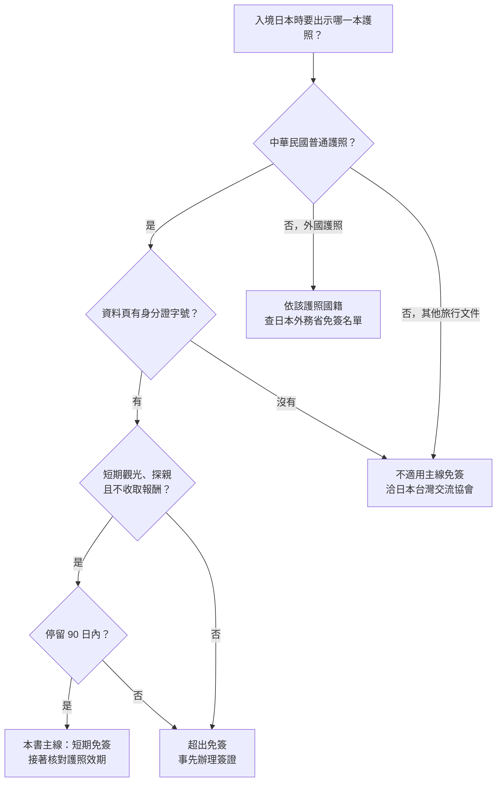

# 02 護照、免簽與入境資格

阿哲訂好下個月飛大阪的機票，才發現護照只剩四個月就到期。同事說「出國護照要剩六個月」，旅行社說「日本不用」。同行的表姊在台灣長大，但拿的是美國護照，她以為大家一起從桃園出發，就一起適用同樣的免簽。這一章把這幾件事拆開來看。

!!! info "本章適用"
    - **何時會用到**：訂機票前、決定要不要換護照時，以及同行者拿的證件不同時。
    - **適用誰**：持中華民國普通護照、短期赴日觀光或探親的旅客；也提供外國護照、無戶籍國民、雙重國籍同行者的分流方向。
    - **不適用誰**：役男出境核准、未成年人護照同意與兒童單獨搭機，見[第 03 章](03-special-travelers.md)；Visit Japan Web 與抵達後的入境流程，見[第 07 章](07-vjw-arrival.md)；工作、留學、打工度假等目的不在本書範圍，本章只告訴你何時已超出免簽。

## 免簽要同時符合三件事：護照、目的、期間

「台灣人去日本免簽」是簡化說法。日本外務省的免簽名單確實列出台灣，但附帶條件，而且免簽只代表「不必事先申請簽證」，入境與否仍由日本入境審查官決定。

- **【法規】護照**：日本外務省註明，台灣的免簽只適用**護照載有身分證字號**的持照人。出發前翻開護照資料頁確認。
- **【法規】目的**：限觀光、探親、短期商務聯絡等短期停留活動，**不得從事有報酬的活動**。日本外務省問答寫明，免簽短期訪問不包括賺取收入的活動。
- **【法規】期間**：短期停留 **90 日**。實際核給的停留期間以入境審查時的紀錄為準；天數怎麼算有疑問，請向日本台灣交流協會確認，不要自行推算到最後一天。
- **【法規】能返回**：日本台灣交流協會說明，免簽入境須持有效護照、確保能在停留期間內返回，並能說明真實且符合短期停留的活動內容；頻繁往返日本的旅客，可能被要求詳細說明在日活動。

日本外務省另外提醒：即使持有簽證，也不保證一定准予入境，審查官仍會核對身分與預定活動。免簽旅客同理。

| 條件 | 出發前核對什麼 | 不符合時 |
|---|---|---|
| 護照種類 | 中華民國普通護照，資料頁有身分證字號 | 不適用本主線免簽，洽日本台灣交流協會 |
| 旅行目的 | 行程中是否有演出、打工、收費帶團等收取報酬的活動 | 須事先辦理適當簽證 |
| 停留期間 | 入境日到離境日是否在 90 日內 | 超出免簽範圍，洽日本台灣交流協會 |
| 返回能力 | 護照在停留期間有效；有回程或下一段行程 | 見下一節「護照效期」 |

## 身分分流：從台灣出發，不等於同一種免簽

免簽看的是**入境日本時出示的護照**，不是從哪裡出發，也不是住在哪裡。同一班飛機上的家人朋友，可能分別走不同的規定。

| 同行者的身分 | 日本入境方向 | 返台方向 | 查詢窗口 |
|---|---|---|---|
| 有身分證字號的中華民國護照 | 本書主線，適用短期免簽 | 國人返國 | — |
| 中華民國護照但無身分證字號（例如無戶籍國民） | **不適用**外務省所列台灣免簽條件；個別簽證程序本書未查核 | 入台規定另查 | 日本台灣交流協會；內政部移民署 |
| 外國護照（含長住台灣的外籍人士） | 依該護照國籍查外務省名單，不套用台灣條件 | 依居留證或外國人入台規定；外交部所列外國人入台免簽條件與國人返國不同 | 該國的日本使領館；移民署 |
| 雙重國籍 | 依入境日本時出示的護照判斷；同時具日本國籍者另有規定，本書未展開 | 另查 | 日本台灣交流協會；移民署 |

**【建議】**持兩本以上護照者，進出日本使用同一本，並在出發前向實際要出示護照的國家窗口確認。外國政府的旅遊指南（例如英國、澳洲的日本頁面）寫的是該國公民待遇，不能拿來推論台灣護照或雙重國籍的處理方式。

## 護照效期：日本沒有一般性的「剩六個月」規定

「護照要剩六個月」來自外交部對**一般國家**的提醒，不是日本的法定條件。日本方面的說法是：

- **【法規】日本入境**：護照須在停留期間有效。日本台灣交流協會的說明寫「進出日本時護照必須有效，效期無特別規定」；日本駐雪梨總領事館的問答也說明日本不要求護照一律剩六個月，但建議向航空公司確認。
- **【業者】航空公司登機**：航空公司會在報到時檢查證件，是否另有要求，以實際承運的航空公司為準。
- **【法規】轉機地**：經第三地轉機時，轉機地的過境規定可能比日本嚴格，要分開查。

| 關卡 | 看什麼 | 去哪裡查 |
|---|---|---|
| 日本入境審查 | 護照在停留期間有效 | 日本台灣交流協會、日本外務省 |
| 航空公司報到 | 各航空公司的登機文件要求 | 實際承運人官方網站或客服 |
| 第三地轉機 | 轉機地的過境與效期規定 | 轉機地政府與航空公司 |
| 台灣出境 | 護照有效；役男另有核准手續 | 外交部領事事務局；役男見[第 03 章](03-special-travelers.md) |

**【建議】**即使日本沒有六個月規定，效期仍要留餘裕。班機延誤、颱風停飛（見[第 12 章](12-emergencies.md)）都可能讓你在日本多待幾天；日本台灣交流協會也建議入境後剩餘效期很短的人先換照。換照所需工作天數以外交部領事事務局公告為準，不要壓在出發前一週才辦。未滿 14 歲的護照效期一般為 5 年，比成人短，家長更要記得檢查孩子的護照。

## 入境時可能被問什麼：準備能說明行程的資料

入境審查官可能詢問停留目的、住在哪裡、何時離開。日本台灣交流協會說明，入境時可能被要求證明活動與目的一致。外交部駐日館處頁面則提醒自助旅客準備以下資料：

- 來回機票或電子機票行程單
- 行程概要
- 住宿資料（飯店名稱、地址、訂房確認）
- 交通安排
- 在日期間的付款能力證明（例如信用卡）

**【建議】**上面這份清單是台灣外交部的旅遊提醒，不是日本的法定文件清單。把資料存成離線檔，另印一份放在隨身包，手機沒電或沒網路時也拿得出來。入境時要按指紋、拍臉部照片，現場流程與 Visit Japan Web 的使用方式見[第 07 章](07-vjw-arrival.md)；入境後護照的隨身攜帶規定見[第 08 章](08-stay-transport.md)。

## 超出主線的情況：先確認，再訂票

以下情況不能用「觀光免簽」一句帶過，本書只指出方向：

- **有收入的活動**：演出、表演、實習、受僱工作、收費導覽等。日本外務省說明免簽不包括賺取收入的活動；遠距工作、數位遊牧等邊界情況，官方頁沒有逐項回答，**不要自行推論可行**，請洽日本台灣交流協會。
- **超過 90 日、留學、打工度假**：須事先申請對應簽證，日本台灣交流協會有各類簽證頁面。
- **經第三地轉機**：例如先飛首爾或香港再進日本，轉機地的過境規定與航空公司規定要分開查；日本端的免簽條件不因轉機而改變。
- **郵輪**：上下船港口與行程安排涉及郵輪公司條款，本版不展開，請向郵輪公司確認。
- **返台**：持中華民國護照的國人返國，不適用外交部「外國人入台免簽」頁面上的六個月效期條件，兩者不要混用。

## 無法確定時找誰

| 問題 | 窗口 |
|---|---|
| 免簽資格、無身分證字號護照、非觀光目的、停留期間 | 日本台灣交流協會台北事務所、高雄事務所（簽證業務） |
| 日本免簽國家名單與一般簽證問答 | 日本外務省簽證頁 |
| 換發護照、護照遺失、海外急難 | 外交部領事事務局；駐日館處 |
| 登機文件、效期要求 | 實際承運的航空公司 |
| 雙重國籍返台、無戶籍國民入台 | 內政部移民署 |

## 出發前勾選

- ☐ 每位同行者的護照資料頁都載有身分證字號；持外國護照者已按自己的國籍查過日本規定。
- ☐ 護照在整段停留期間有效，並已向實際承運的航空公司與轉機地確認沒有額外要求。
- ☐ 行程中沒有收取報酬的活動，停留天數在 90 日內。
- ☐ 回程機票、住宿與行程資料已存離線檔並印一份。
- ☐ 孩子的護照效期（未滿 14 歲一般 5 年）已另外檢查。

## 來源與查閱日

| 來源 | 機關 | 本章用途 |
|---|---|---|
| [Exemption of Visa (Short-Term Stay)](https://www.mofa.go.jp/j_info/visit/visa/short/novisa.html) | 日本外務省 | 台灣免簽限載有身分證字號之護照；90 日 |
| [Frequently Asked Questions](https://www.mofa.go.jp/j_info/visit/visa/faq.html) | 日本外務省 | 免簽不含賺取收入活動；簽證不保證入境 |
| [致以免簽證方式入境日本之各位](https://www.koryu.or.jp/tw/visa/kaohsiung/tabid3098.html) | 日本台灣交流協會 | 90 日、有效護照、報酬活動須簽證、入境時說明目的 |
| [査証免除で入国する皆様へ](https://www.koryu.or.jp/visa/taipei/exemption/) | 日本台灣交流協會 | 可返回本國、真實活動、頻繁往返者須說明 |
| [打工度假簽證之申請所需文件](https://www.koryu.or.jp/tw/visa/taipei/working/guide2026/guide-detail1/) | 日本台灣交流協會 | 進出日本護照須有效、效期無特別規定、建議先換照 |
| [VISA Frequently Asked Questions (FAQ)](https://www.sydney.au.emb-japan.go.jp/document/english/visa_info/FAQ2024.pdf) | 日本駐雪梨總領事館 | Q17：日本不一律要求剩六個月，建議向航空公司確認 |
| [中華民國國民可以免簽證、落地簽證及電子簽證前往之國家與地區](https://www.boca.gov.tw/fp-37-220-9f130-1.html) | 外交部領事事務局 | 六個月是一般國家提醒，以入境國公告為準 |
| [護照條例](https://www.boca.gov.tw/cp-121-4294-29fd9-1.html) | 外交部領事事務局 | 普通護照效期；未滿 14 歲一般 5 年 |
| [免簽證](https://www.boca.gov.tw/fp-384-4485-149c7-1.html) | 外交部領事事務局 | 外國人入台免簽條件，與國人返國區分 |
| [駐館位置及聯絡資訊（日本）](https://www.boca.gov.tw/sp-foof-countrycp-03-30-147e1-02-1.html) | 外交部領事事務局 | 自助旅客應備機票、住宿、付款能力等資料 |

查閱日：2026-09-19。規定可能變動，出發前請回官方頁重查。
