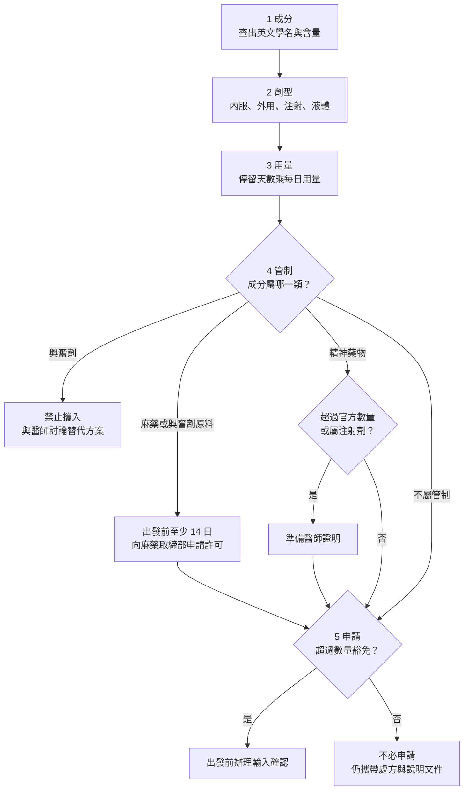

# 05 藥品與醫療準備

小林有高血壓，每天吃兩種處方藥，這次要在日本待 40 天。她另外帶了一盒台灣買的綜合感冒藥、一條痠痛藥膏和一瓶保健食品。朋友說「自用的藥不用管」，但她查了一下，發現日本對藥品的檢查有兩套：一套看**數量**，一套看**成分**。

!!! info "本章適用"
    - **何時會用到**：出發前至少三週開始準備；需要申請許可的藥品，官方要求提早辦理。
    - **適用誰**：攜帶處方藥、成藥、外用藥、注射劑、醫療器材或中藥材赴日的旅客，以及要替同行家人準備藥品的人。
    - **不適用誰**：本章**不判定個別藥物**能否帶入日本，只給判斷流程與查詢窗口。從日本帶藥回台灣，本章只簡述，詳見[第 13 章](13-return-customs.md)；在日本生病就醫與緊急求助，見[第 12 章](12-emergencies.md)。

## 日本的兩套檢查：數量豁免與管制成分

**第一套：數量豁免（厚生勞動省）。**【法規】旅客個人攜帶的藥品，在下列數量內不需辦理「輸入確認」（Import Confirmation）；超過就要在**出發前**辦妥，入境時出示給海關。

| 類別 | 免辦輸入確認的上限 |
|---|---|
| 處方藥（含毒藥、劇藥） | 1 個月用量 |
| 外用藥（處方藥等除外） | 每品項 24 個 |
| 注射劑與注射器（限預先填充或自我注射用） | 1 個月用量 |
| 其他藥品、醫藥部外品 | 2 個月用量 |
| 化妝品 | 每品項 24 個 |
| 隱形眼鏡 | 2 個月用量 |
| 家用醫療器材 | 1 組 |

**第二套：管制成分（厚生勞動省麻藥取締部）。**【法規】不管數量多少，只要成分屬管制類別，就另有規定：

- **麻藥、興奮劑原料**：須**事前取得許可**，官方要求**至少在出發前 14 日**申請。官方頁在麻藥類舉出的例子包括 morphine、fentanyl、oxycodone、codeine。
- **精神藥物**：在官方規定的數量內不需許可；超過數量或屬注射劑型，須備醫師證明。
- **興奮劑**：amphetamine、methamphetamine 等，**即使有本國處方也禁止**攜入。
- **剩藥帶出日本**：麻藥取締部提醒，若停留後要把剩下的管制藥品帶回國，也要提出出口申請。

兩套檢查互不取代。處方藥在 1 個月用量內，只代表不必辦輸入確認；若成分屬麻藥，仍須另申請許可。反過來，拿到管制藥品許可，也不代表超量部分自動免辦輸入確認。

## 五步判斷：成分 → 劑型 → 用量 → 管制 → 申請

每一種藥分開走一次下面的流程。

**1. 成分**：商品名在各國不同，日本官方以**成分**分類。**【建議】**請開藥的醫師或藥師提供每種藥的英文學名與含量，綜合感冒藥這類複方製劑要列出全部成分。英國政府的日本旅遊健康頁就提醒，含 pseudoephedrine、codeine 的常見藥品在日本可能受管制；是否屬管制、門檻是多少，要以日本麻藥取締部的分類為準。

**2. 劑型**：同一成分，錠劑、藥膏、注射劑落在不同的數量類別；液體劑型另受航空液體規則影響（見本章第四節）。

**3. 用量**：以用法用量計算停留期間需要的量。停留 40 天、每日一顆的處方藥，已超過 1 個月用量，須辦輸入確認；**【建議】**若醫師同意，也可只帶 1 個月內的量，但要評估在日本無法補藥的風險。

**4. 管制**：用成分對照麻藥取締部網站的分類與數量表。本書不替讀者判定，查不到或看不懂時，直接寫信問入境機場所屬地區的麻藥取締部。

**5. 申請**：

- **輸入確認**：厚生勞動省提供線上申請系統，出發前申請，核准後入境時出示給海關。
- **管制藥品許可**：依麻藥取締部指示準備申請書、醫師證明（須寫明具體用藥理由，不能只寫「個人使用」）與藥品包裝照片，以電子郵件、傳真或郵寄送到**入境機場所屬地區**的麻藥取締部。

## 帶什麼文件：原包裝、處方與英文說明

| 文件 | 用途 | 哪一關用得到 |
|---|---|---|
| 原包裝或藥袋（標示藥名與成分） | 讓海關與安檢人員辨識藥品 | 航空安檢、日本海關 |
| 醫師處方箋或診斷證明（**【建議】**英文版） | 說明用途與用量；管制藥品申請須醫師證明 | 日本海關、麻藥取締部、返台 |
| 英文成分名與含量清單 | 對照日本管制分類；在日就醫時給醫師看 | 行前判斷、在日就醫 |
| 輸入確認或管制藥品許可文件 | 超量或管制成分的核准證明 | 日本海關 |

**【建議】（官方建議）**食藥署提醒，慢性病用藥與管制藥品出國務必攜帶醫師開立的處方箋或證明文件。法國外交部的日本健康頁也建議處方藥保留原包裝，並備有日文以外、可辨識的藥名。

## 一件藥品的四關表

| 藥品類型 | 航空安檢 | 日本檢疫 | 日本海關（厚生勞動省規定） | 返台 |
|---|---|---|---|---|
| 一般處方錠劑，1 個月用量內 | 固體不受液體限制 | 不涉及 | 免辦輸入確認；成分仍須不屬管制 | 剩藥依食藥署限量，見[第 13 章](13-return-customs.md) |
| 處方藥超過 1 個月用量 | 同上 | 不涉及 | 出發前辦輸入確認 | 同上 |
| 含麻藥或興奮劑原料成分 | 同上 | 不涉及 | 至少出發前 14 日申請許可；剩藥帶出可能須出口申請 | 管制藥品須有處方箋，見[第 13 章](13-return-customs.md) |
| 液體藥、胰島素、預充填注射筆 | 醫療用液體可超過 100ml，須向安檢說明，可能要出示處方或藥袋 | 不涉及 | 注射劑限 1 個月用量；超量辦輸入確認 | 見[第 13 章](13-return-customs.md) |
| 綜合感冒藥等成藥 | 固體不受液體限制；糖漿屬液體 | 不涉及 | 2 個月用量內免辦；複方成分可能含管制成分 | 非處方藥有每種與合計數量上限，見[第 13 章](13-return-customs.md) |
| 痠痛藥膏、貼布等外用藥 | 膏狀、凝膠屬液體限制範圍 | 不涉及 | 每品項 24 個內免辦 | 見[第 13 章](13-return-customs.md) |
| 中藥材、生藥 | 固體不受液體限制 | **【法規】**植物防疫所將生藥材列為須檢查的植物品項 | 藥品屬性本書未查核，洽厚生勞動省 | 中藥材限量本書未能以原文核實，洽食藥署 |
| 保健食品（錠劑、膠囊） | 固體不受液體限制 | 含動物成分時查動物檢疫所 | 屬藥品或食品的判斷本書未查核，洽厚生勞動省 | 錠狀、膠囊食品有數量上限，見[第 13 章](13-return-customs.md) |

航空液體規則的細節見[第 04 章](04-baggage-batteries.md)；動植物檢疫見[第 06 章](06-food-cash-goods.md)。

## 保險與就醫準備

各國政府的日本旅遊指南（英國、澳洲、法國）都把保險放在健康章節的第一段，共同提醒是：日本醫療水準高，但費用可能要**先自行支付**，外國旅客不會自動被日本的保險制度涵蓋。這些是外國政府的**【建議】**，不是日本法律，但對台灣旅客同樣實用。

**【建議】**讀旅遊保險條款時，至少確認：

1. 海外醫療費用的上限與自負額；
2. 是否涵蓋出發前已有的慢性病（既往症）；
3. 能否由保險公司直接付款給日本醫院，或只能先付後申請；
4. 是否包含醫療後送與返國運送；
5. 24 小時海外急難協助電話，並把電話抄到[附錄 B 求助卡](appendix-b-emergency-card.md)。

全民健保的海外就醫核退規定，本書未查核，請洽衛生福利部中央健康保險署。在日本發生緊急狀況時，救護車是 119，完整的求助分工見[第 12 章](12-emergencies.md)。

## 無法確定時找誰

| 問題 | 窗口 |
|---|---|
| 數量豁免、輸入確認申請 | 日本厚生勞動省（藥品個人輸入頁與線上申請系統） |
| 麻藥、精神藥物、興奮劑原料的分類與許可 | 厚生勞動省麻藥取締部（依入境機場所屬地區） |
| 藥品英文學名、含量、替代藥 | 開藥的醫師、藥師 |
| 中藥材、生藥的植物檢疫 | 日本農林水產省植物防疫所 |
| 帶藥回台灣的限量 | 衛生福利部食品藥物管理署，見[第 13 章](13-return-customs.md) |
| 機上醫療需求 | 航空公司，見[第 03 章](03-special-travelers.md) |

## 出發前勾選

- ☐ 每種藥都已查出英文學名與含量，複方藥列出全部成分。
- ☐ 已計算停留期間用量，超過數量豁免者已辦妥輸入確認。
- ☐ 已對照麻藥取締部分類；需要許可者已在出發前至少 14 日申請。
- ☐ 處方箋或英文診斷證明、原包裝已備妥，液體藥另放方便安檢說明。
- ☐ 旅遊保險的醫療上限、既往症、直接付款與後送條款已讀過。

## 來源與查閱日

| 來源 | 機關 | 本章用途 |
|---|---|---|
| [Information for those who are bringing medicines for personal use into Japan](https://www.mhlw.go.jp/stf/seisakunitsuite/bunya/kenkou_iryou/iyakuhin/kojinyunyu/topics/tp010401-1_00001.html) | 日本厚生勞動省 | 各類藥品、化妝品、醫療器材的數量豁免；超量須出發前辦輸入確認 |
| [輸入確認線上申請系統](https://impconf.mhlw.go.jp/aicpte/page/login.jsp?lang=en) | 日本厚生勞動省 | 輸入確認申請入口 |
| [Application Guidance](https://www.ncd.mhlw.go.jp/en/application2.html) | 厚生勞動省麻藥取締部 | 麻藥與興奮劑原料須許可、至少 14 日前申請；精神藥物門檻；興奮劑禁止；剩藥出口申請；申請方式 |
| [Regulations when Bringing Plants into Japan from Another Country](https://www.maff.go.jp/pps/j/introduction/english.html) | 日本農林水產省植物防疫所 | 生藥材屬須檢查的植物品項 |
| [国際線の航空機内への液体物持込制限について（Q&A）](https://www.mlit.go.jp/koku/03_information/13_motikomiseigen/q&a.pdf) | 日本國土交通省 | 醫療用液體例外與可能要求的證明 |
| [旅客隨身行李安檢新措施問答集](https://www.caa.gov.tw/FileAtt.ashx?lang=1&id=5445) | 交通部民用航空局 | 台灣出發醫療用液體例外 |
| [出遊常備用藥及攜帶藥品出入境規定](https://www.fda.gov.tw/tc/newsContent.aspx?cid=4&id=t622952) | 衛生福利部食品藥物管理署 | 慢性病與管制藥品出國攜帶處方箋；返台限量 |
| [個人輸入自用藥品規範專區](https://www.fda.gov.tw/tc/site.aspx?sid=3928) | 衛生福利部食品藥物管理署 | 返台自用藥品與錠狀膠囊食品限量入口 |
| [Health - Japan travel advice](https://www.gov.uk/foreign-travel-advice/japan/health) | 英國外交部（FCDO） | 常見藥品在日本可能受管制的提醒；醫療先付費（外國政府建議） |
| [Japan Travel Advice & Safety](https://www.smartraveller.gov.au/destinations/asia/japan) | 澳洲外交貿易部 | 醫療先付費、保險提醒（外國政府建議） |
| [Japon - Santé](https://www.diplomatie.gouv.fr/fr/information-par-pays/japon/conseils-aux-voyageurs-sante) | 法國歐洲暨外交部 | 保險與後送、原包裝與藥名（外國政府建議） |

查閱日：2026-09-19。規定可能變動，出發前請回官方頁重查。
